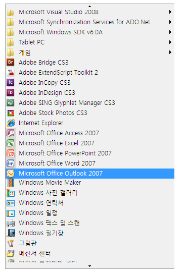

# UI 자동화 Scroll 컨트롤 패턴 구현Implementing the UI Automation Scroll Control Pattern
> [!NOTE]
>  이 설명서는 <xref:System.Windows.Automation> 네임스페이스에 정의된 관리되는 [!INCLUDE[TLA2#tla_uiautomation](../../../includes/tla2sharptla-uiautomation-md.md)] 클래스를 사용하려는 .NET Framework 개발자를 위한 것입니다.This documentation is intended for .NET Framework developers who want to use the managed [!INCLUDE[TLA2#tla_uiautomation](../../../includes/tla2sharptla-uiautomation-md.md)] classes defined in the <xref:System.Windows.Automation> namespace. [!INCLUDE[TLA2#tla_uiautomation](../../../includes/tla2sharptla-uiautomation-md.md)]에 대한 최신 정보는 [Windows 자동화 API: UI 자동화](http://go.microsoft.com/fwlink/?LinkID=156746)를 참조하세요.For the latest information about [!INCLUDE[TLA2#tla_uiautomation](../../../includes/tla2sharptla-uiautomation-md.md)], see [Windows Automation API: UI Automation](http://go.microsoft.com/fwlink/?LinkID=156746).  
  
 이 항목에서는 이벤트 및 속성에 대한 정보를 포함하여 <xref:System.Windows.Automation.Provider.IScrollProvider>를 구현하기 위한 지침 및 규칙을 제공합니다.This topic introduces guidelines and conventions for implementing <xref:System.Windows.Automation.Provider.IScrollProvider>, including information about events and properties. 추가 참조에 대한 링크는 항목 끝에 나열되어 있습니다.Links to additional references are listed at the end of the topic.  
  
 <xref:System.Windows.Automation.ScrollPattern> 컨트롤 패턴은 자식 개체의 컬렉션에 대해 스크롤할 수 있는 컨테이너 역할을 하는 컨트롤을 지원하는 데 사용됩니다.The <xref:System.Windows.Automation.ScrollPattern> control pattern is used to support a control that acts as a scrollable container for a collection of child objects. 이 컨트롤은 스크롤 기능을 지원하기 위해 스크롤 막대를 사용할 필요는 없지만 일반적으로는 스크롤 막대를 사용합니다.The control is not required to use scrollbars to support the scrolling functionality, although it commonly does.  
  
 ![스크롤 막대 없는 scroll 컨트롤입니다. ] (../../../docs/framework/ui-automation/media/uia-scrollpattern-without-scrollbars.PNG "UIA_ScrollPattern_Without_Scrollbars")  
스크롤 막대를 사용하지 않는 스크롤 컨트롤의 예제Example of a Scrolling Control that Does Not Use Scrollbars  
  
 이 컨트롤을 구현하는 컨트롤의 예제를 보려면 [Control Pattern Mapping for UI Automation Clients](../../../docs/framework/ui-automation/control-pattern-mapping-for-ui-automation-clients.md)을 참조하세요.For examples of controls that implement this control, see [Control Pattern Mapping for UI Automation Clients](../../../docs/framework/ui-automation/control-pattern-mapping-for-ui-automation-clients.md).  
  
   
## 구현 지침 및 규칙Implementation Guidelines and Conventions  
 Scroll 컨트롤 패턴을 구현할 때는 다음 지침 및 규칙에 유의하세요.When implementing the Scroll control pattern, note the following guidelines and conventions:  
  
-   이 컨트롤의 자식 항목은 <xref:System.Windows.Automation.Provider.IScrollItemProvider>를 구현해야 합니다.The children of this control must implement <xref:System.Windows.Automation.Provider.IScrollItemProvider>.  
  
-   컨테이너 컨트롤의 스크롤 막대는 <xref:System.Windows.Automation.ScrollPattern> 컨트롤 패턴을 지원하지 않습니다.The scrollbars of a container control do not support the <xref:System.Windows.Automation.ScrollPattern> control pattern. 이 스크롤 막대는 <xref:System.Windows.Automation.RangeValuePattern> 컨트롤 패턴을 지원해야 합니다.They must support the <xref:System.Windows.Automation.RangeValuePattern> control pattern instead.  
  
-   스크롤이 백분율로 측정되면, 스크롤 눈금과 관련된 모든 값 또는 양은 0에서 100까지의 범위로 정규화되어야 합니다.When scrolling is measured in percentages, all values or amounts related to scroll graduation must be normalized to a range of 0 to 100.  
  
-   <xref:System.Windows.Automation.ScrollPatternIdentifiers.HorizontallyScrollableProperty> 및 <xref:System.Windows.Automation.ScrollPatternIdentifiers.VerticallyScrollableProperty> 는 <xref:System.Windows.Automation.AutomationElement.IsEnabledProperty>와 관계가 없습니다.<xref:System.Windows.Automation.ScrollPatternIdentifiers.HorizontallyScrollableProperty> and <xref:System.Windows.Automation.ScrollPatternIdentifiers.VerticallyScrollableProperty> are independent of the <xref:System.Windows.Automation.AutomationElement.IsEnabledProperty>.  
  
-   경우 <xref:System.Windows.Automation.ScrollPatternIdentifiers.HorizontallyScrollableProperty>  =  `false` 다음 <xref:System.Windows.Automation.ScrollPatternIdentifiers.HorizontalViewSizeProperty> 100%로 설정 해야 하 고 <xref:System.Windows.Automation.ScrollPatternIdentifiers.HorizontalScrollPercentProperty> 로 설정 해야 <xref:System.Windows.Automation.ScrollPatternIdentifiers.NoScroll>합니다.If <xref:System.Windows.Automation.ScrollPatternIdentifiers.HorizontallyScrollableProperty> = `false` then <xref:System.Windows.Automation.ScrollPatternIdentifiers.HorizontalViewSizeProperty> should be set to 100% and <xref:System.Windows.Automation.ScrollPatternIdentifiers.HorizontalScrollPercentProperty> should be set to <xref:System.Windows.Automation.ScrollPatternIdentifiers.NoScroll>. 마찬가지로, <xref:System.Windows.Automation.ScrollPatternIdentifiers.VerticallyScrollableProperty> = `false` 일 경우 <xref:System.Windows.Automation.ScrollPatternIdentifiers.VerticalViewSizeProperty> 는 100%로 설정되어야 하며 <xref:System.Windows.Automation.ScrollPatternIdentifiers.VerticalScrollPercentProperty> 는 <xref:System.Windows.Automation.ScrollPatternIdentifiers.NoScroll>를 참조하세요.Likewise, if <xref:System.Windows.Automation.ScrollPatternIdentifiers.VerticallyScrollableProperty> = `false` then <xref:System.Windows.Automation.ScrollPatternIdentifiers.VerticalViewSizeProperty> should be set to 100 percent and <xref:System.Windows.Automation.ScrollPatternIdentifiers.VerticalScrollPercentProperty> should be set to <xref:System.Windows.Automation.ScrollPatternIdentifiers.NoScroll>. 따라서 클라이언트가 원하지 않는 스크롤 방향이 활성화되어 있는 경우 UI 자동화 클라이언트는 <xref:System.Windows.Automation.ScrollPattern.SetScrollPercent%2A> 경합 상태 [를 방지하면서](http://support.microsoft.com/default.aspx?scid=kb;en-us;317723) 메서드 내에서 이러한 속성 값을 사용할 수 있습니다.This allows a UI Automation client to use these property values within the <xref:System.Windows.Automation.ScrollPattern.SetScrollPercent%2A> method while avoiding a [race condition](http://support.microsoft.com/default.aspx?scid=kb;en-us;317723) if a direction the client is not interested in scrolling becomes activated.  
  
-   <xref:System.Windows.Automation.Provider.IScrollProvider.HorizontalScrollPercent%2A> 는 로캘과 관련됩니다.<xref:System.Windows.Automation.Provider.IScrollProvider.HorizontalScrollPercent%2A> is locale-specific. HorizontalScrollPercent = 100.0으로 설정하는 경우 왼쪽에서 오른쪽으로 읽는 언어(예: 영어)에서 컨트롤의 스크롤 위치는 맨 오른쪽 위치에 해당하는 값으로 설정해야 합니다.Setting HorizontalScrollPercent = 100.0 must set the scrolling location of the control to the equivalent of its rightmost position for languages such as English that read left to right. 또는 오른쪽에서 왼쪽으로 읽는 언어(예: 아랍어)의 경우 HorizontalScrollPercent = 100.0으로 설정할 경우 스크롤 위치는 맨 왼쪽 위치로 설정해야 합니다.Alternately, for languages such as Arabic that read right to left, setting HorizontalScrollPercent = 100.0 must set the scroll location to the leftmost position.  
  
   
## IScrollProvider에 필요한 멤버Required Members for IScrollProvider  
 <xref:System.Windows.Automation.Provider.IScrollProvider>를 구현하려면 다음과 같은 속성 및 메서드가 필요합니다.The following properties and methods are required for implementing <xref:System.Windows.Automation.Provider.IScrollProvider>.  
  
|필요한 멤버Required member|멤버 형식Member type|노트Notes|  
|---------------------|-----------------|-----------|  
|<xref:System.Windows.Automation.Provider.IScrollProvider.HorizontalScrollPercent%2A>|속성Property|없음None|  
|<xref:System.Windows.Automation.Provider.IScrollProvider.VerticalScrollPercent%2A>|속성Property|없음None|  
|<xref:System.Windows.Automation.Provider.IScrollProvider.HorizontalViewSize%2A>|속성Property|없음None|  
|<xref:System.Windows.Automation.Provider.IScrollProvider.VerticalViewSize%2A>|속성Property|없음None|  
|<xref:System.Windows.Automation.Provider.IScrollProvider.HorizontallyScrollable%2A>|속성Property|없음None|  
|<xref:System.Windows.Automation.Provider.IScrollProvider.VerticallyScrollable%2A>|속성Property|없음None|  
|<xref:System.Windows.Automation.Provider.IScrollProvider.Scroll%2A>|메서드Method|없음None|  
|<xref:System.Windows.Automation.Provider.IScrollProvider.SetScrollPercent%2A>|메서드Method|없음None|  
  
 이 컨트롤 패턴에 연결된 이벤트가 없습니다.This control pattern has no associated events.  
  
   
## 예외Exceptions  
 공급자는 다음과 같은 예외를 throw해야 합니다.Providers must throw the following exceptions.  
  
|예외 형식Exception Type|조건Condition|  
|--------------------|---------------|  
|<xref:System.ArgumentException>|컨트롤이 가로 또는 세로 스크롤에 대해서만<xref:System.Windows.Automation.Provider.IScrollProvider.Scroll%2A> 값을 지원하지만 <xref:System.Windows.Automation.ScrollAmount.SmallIncrement> 값이 전달되는 경우에 <xref:System.Windows.Automation.ScrollAmount.LargeIncrement> 은 이 예외를 발생시킵니다.<xref:System.Windows.Automation.Provider.IScrollProvider.Scroll%2A> throws this exception if a control supports <xref:System.Windows.Automation.ScrollAmount.SmallIncrement> values exclusively for horizontal or vertical scrolling, but a <xref:System.Windows.Automation.ScrollAmount.LargeIncrement> value is passed in.|  
|<xref:System.ArgumentException>|double로 변환할 수 없는 값이 전달되는 경우<xref:System.Windows.Automation.Provider.IScrollProvider.SetScrollPercent%2A> 가 이 예외를 발생시킵니다.<xref:System.Windows.Automation.Provider.IScrollProvider.SetScrollPercent%2A> throws this exception when a value that cannot be converted to a double is passed in.|  
|<xref:System.ArgumentOutOfRangeException>|100보다 크거나 0보다 작은 값이 전달되는 경우(<xref:System.Windows.Automation.Provider.IScrollProvider.SetScrollPercent%2A> 에 해당하는 -1 제외) <xref:System.Windows.Automation.ScrollPatternIdentifiers.NoScroll>가 이 예외를 발생시킵니다.<xref:System.Windows.Automation.Provider.IScrollProvider.SetScrollPercent%2A> throws this exception when a value greater than 100 or less than 0 is passed in (except -1 which is equivalent to <xref:System.Windows.Automation.ScrollPatternIdentifiers.NoScroll>).|  
|<xref:System.InvalidOperationException>|지원되지 않는 방향으로 스크롤이 시도되면 <xref:System.Windows.Automation.Provider.IScrollProvider.Scroll%2A> 및 <xref:System.Windows.Automation.Provider.IScrollProvider.SetScrollPercent%2A> 둘 다 이 예외를 발생시킵니다.Both <xref:System.Windows.Automation.Provider.IScrollProvider.Scroll%2A> and <xref:System.Windows.Automation.Provider.IScrollProvider.SetScrollPercent%2A> throw this exception when an attempt is made to scroll in an unsupported direction.|  
  
## 참고 항목See Also  
 [UI 자동화 컨트롤 패턴 개요UI Automation Control Patterns Overview](../../../docs/framework/ui-automation/ui-automation-control-patterns-overview.md)  
 [UI 자동화 공급자의 컨트롤 패턴 지원Support Control Patterns in a UI Automation Provider](../../../docs/framework/ui-automation/support-control-patterns-in-a-ui-automation-provider.md)  
 [클라이언트에 대 한 UI 자동화 컨트롤 패턴UI Automation Control Patterns for Clients](../../../docs/framework/ui-automation/ui-automation-control-patterns-for-clients.md)  
 [UI 자동화 트리 개요UI Automation Tree Overview](../../../docs/framework/ui-automation/ui-automation-tree-overview.md)  
 [UI 자동화의 캐싱 사용Use Caching in UI Automation](../../../docs/framework/ui-automation/use-caching-in-ui-automation.md)
