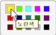

# UI 자동화 Selection 컨트롤 패턴 구현Implementing the UI Automation Selection Control Pattern
> [!NOTE]
>  이 설명서는 <xref:System.Windows.Automation> 네임스페이스에 정의된 관리되는 [!INCLUDE[TLA2#tla_uiautomation](../../../includes/tla2sharptla-uiautomation-md.md)] 클래스를 사용하려는 .NET Framework 개발자를 위한 것입니다.This documentation is intended for .NET Framework developers who want to use the managed [!INCLUDE[TLA2#tla_uiautomation](../../../includes/tla2sharptla-uiautomation-md.md)] classes defined in the <xref:System.Windows.Automation> namespace. [!INCLUDE[TLA2#tla_uiautomation](../../../includes/tla2sharptla-uiautomation-md.md)]에 대한 최신 정보는 [Windows 자동화 API: UI 자동화](http://go.microsoft.com/fwlink/?LinkID=156746)를 참조하세요.For the latest information about [!INCLUDE[TLA2#tla_uiautomation](../../../includes/tla2sharptla-uiautomation-md.md)], see [Windows Automation API: UI Automation](http://go.microsoft.com/fwlink/?LinkID=156746).  
  
 이 항목에서는 이벤트 및 속성에 대한 정보를 포함하여 <xref:System.Windows.Automation.Provider.ISelectionProvider>를 구현하기 위한 지침 및 규칙을 제공합니다.This topic introduces guidelines and conventions for implementing <xref:System.Windows.Automation.Provider.ISelectionProvider>, including information about events and properties. 추가 참조에 대한 링크는 항목 끝에 나열되어 있습니다.Links to additional references are listed at the end of the topic.  
  
 <xref:System.Windows.Automation.SelectionPattern> 컨트롤 패턴은 선택 가능한 자식 항목 컬렉션에 컨테이너 역할을 하는 컨트롤을 지원하는 데 사용됩니다.The <xref:System.Windows.Automation.SelectionPattern> control pattern is used to support controls that act as containers for a collection of selectable child items. 이 요소의 자식 항목은 <xref:System.Windows.Automation.Provider.ISelectionItemProvider>를 구현해야 합니다.The children of this element must implement <xref:System.Windows.Automation.Provider.ISelectionItemProvider>. 이 컨트롤 패턴을 구현하는 컨트롤의 예제를 보려면 [Control Pattern Mapping for UI Automation Clients](../../../docs/framework/ui-automation/control-pattern-mapping-for-ui-automation-clients.md)을 참조하세요.For examples of controls that implement this control pattern, see [Control Pattern Mapping for UI Automation Clients](../../../docs/framework/ui-automation/control-pattern-mapping-for-ui-automation-clients.md).  
  
   
## 구현 지침 및 규칙Implementation Guidelines and Conventions  
 Selection 컨트롤 패턴을 구현할 때는 다음 지침 및 규칙에 유의하세요.When implementing the Selection control pattern, note the following guidelines and conventions:  
  
-   <xref:System.Windows.Automation.Provider.ISelectionProvider> 를 구현하는 컨트롤을 통해 자식 항목을 하나 또는 여러 개 선택할 수 있습니다.Controls that implement <xref:System.Windows.Automation.Provider.ISelectionProvider> allow either single or multiple child items to be selected. 예를 들어 목록 상자, 목록 뷰, 트리 뷰는 여러 개의 선택을 지원하는 반면 콤보 상자, 슬라이더, 라디오 단추 그룹은 단일 선택을 지원합니다.For example, list box, list view, and tree view support multiple selections whereas combo box, slider, and radio button group support single selection.  
  
-   **볼륨** 슬라이더 컨트롤과 같이 최소, 최대, 연속 범위를 가진 컨트롤은 <xref:System.Windows.Automation.Provider.IRangeValueProvider> 대신 <xref:System.Windows.Automation.Provider.ISelectionProvider>를 구현해야 합니다.Controls that have a minimum, maximum, and continuous range, such as the **Volume** slider control, should implement <xref:System.Windows.Automation.Provider.IRangeValueProvider> instead of <xref:System.Windows.Automation.Provider.ISelectionProvider>.  
  
-   <xref:System.Windows.Automation.Provider.IRawElementProviderFragmentRoot>표시 속성 **대화 상자의** 화면 해상도 **슬라이더 또는** 의 **색 선택** 선택 컨트롤(아래 그림 참조) 등과 같이 [!INCLUDE[TLA#tla_word](../../../includes/tlasharptla-word-md.md)] 를 구현하는 자식 컨트롤을 관리하는 단일 선택 컨트롤은 <xref:System.Windows.Automation.Provider.ISelectionProvider>를 구현해야 하며, 해당 자식 항목은 <xref:System.Windows.Automation.Provider.IRawElementProviderFragment> 및 <xref:System.Windows.Automation.Provider.ISelectionItemProvider>둘 다 구현해야 합니다.Single-selection controls that manage child controls that implement <xref:System.Windows.Automation.Provider.IRawElementProviderFragmentRoot>, such as the **Screen Resolution** slider in the **Display Properties** dialog box or the **Color Picker** selection control from [!INCLUDE[TLA#tla_word](../../../includes/tlasharptla-word-md.md)] (illustrated below), should implement <xref:System.Windows.Automation.Provider.ISelectionProvider>; their children should implement both <xref:System.Windows.Automation.Provider.IRawElementProviderFragment> and <xref:System.Windows.Automation.Provider.ISelectionItemProvider>.  
  
 ![노란색이 강조 표시 된 색 선택 합니다. ] (../../../docs/framework/ui-automation/media/uia-valuepattern-colorpicker.png "UIA_ValuePattern_ColorPicker")  
색 견본 문자열 매핑의 예Example of Color Swatch String Mapping  
  
-   메뉴는 <xref:System.Windows.Automation.SelectionPattern>을 지원하지 않습니다.Menus do not support <xref:System.Windows.Automation.SelectionPattern>. 그래픽과 텍스트 둘 다 포함된 메뉴 항목을 작업하고(예: **에서** 보기 **메뉴의** 미리 보기 창 [!INCLUDE[TLA#tla_outlook](../../../includes/tlasharptla-outlook-md.md)]항목) 상태를 전달해야 하는 경우 <xref:System.Windows.Automation.Provider.IToggleProvider>를 구현해야 합니다.If you are working with menu items that include both graphics and text (such as the **Preview Pane** items in the **View** menu in [!INCLUDE[TLA#tla_outlook](../../../includes/tlasharptla-outlook-md.md)]) and need to convey state, you should implement <xref:System.Windows.Automation.Provider.IToggleProvider>.  
  
   
## ISelectionProvider에 필요한 멤버Required Members for ISelectionProvider  
 <xref:System.Windows.Automation.Provider.ISelectionProvider> 인터페이스에는 다음과 같은 속성, 메서드 및 이벤트가 필요합니다.The following properties, methods, and events are required for the <xref:System.Windows.Automation.Provider.ISelectionProvider> interface.  
  
|필요한 멤버Required members|형식Type|노트Notes|  
|----------------------|----------|-----------|  
|<xref:System.Windows.Automation.Provider.ISelectionProvider.CanSelectMultiple%2A>|속성Property|<xref:System.Windows.Automation.Automation.AddAutomationPropertyChangedEventHandler%2A> 및 <xref:System.Windows.Automation.Automation.RemoveAutomationPropertyChangedEventHandler%2A>를 사용하여 속성 변경 이벤트를 지원해야 합니다.Should support property changed events using <xref:System.Windows.Automation.Automation.AddAutomationPropertyChangedEventHandler%2A> and <xref:System.Windows.Automation.Automation.RemoveAutomationPropertyChangedEventHandler%2A>.|  
|<xref:System.Windows.Automation.Provider.ISelectionProvider.IsSelectionRequired%2A>|속성Property|<xref:System.Windows.Automation.Automation.AddAutomationPropertyChangedEventHandler%2A> 및 <xref:System.Windows.Automation.Automation.RemoveAutomationPropertyChangedEventHandler%2A>를 사용하여 속성 변경 이벤트를 지원해야 합니다.Should support property changed events using <xref:System.Windows.Automation.Automation.AddAutomationPropertyChangedEventHandler%2A> and <xref:System.Windows.Automation.Automation.RemoveAutomationPropertyChangedEventHandler%2A>.|  
|<xref:System.Windows.Automation.Provider.ISelectionProvider.GetSelection%2A>|메서드Method|없음None|  
|<xref:System.Windows.Automation.SelectionPatternIdentifiers.InvalidatedEvent>|이벤트Event|컨테이너의 선택 항목이 현저히 변경되어 <xref:System.Windows.Automation.Provider.AutomationInteropProvider.InvalidateLimit> 상수가 허용하는 것보다 더 많은 추가 및 제거 이벤트를 보내야 하는 경우에 발생합니다.Raised when a selection in a container has changed significantly and requires sending more addition and removal events than the <xref:System.Windows.Automation.Provider.AutomationInteropProvider.InvalidateLimit> constant permits.|  
  
 <xref:System.Windows.Automation.Provider.ISelectionProvider.IsSelectionRequired%2A> 및 <xref:System.Windows.Automation.Provider.ISelectionProvider.CanSelectMultiple%2A> 은 동적 속성일 수 있습니다.The <xref:System.Windows.Automation.Provider.ISelectionProvider.IsSelectionRequired%2A> and <xref:System.Windows.Automation.Provider.ISelectionProvider.CanSelectMultiple%2A> properties can be dynamic. 예를 들어, 컨트롤의 초기 상태에서 기본적으로 항목이 선택되지 않을 수 있으며 이는 <xref:System.Windows.Automation.Provider.ISelectionProvider.IsSelectionRequired%2A> 가 `false`임을 나타냅니다.For example, the initial state of a control might not have any items selected by default, indicating that <xref:System.Windows.Automation.Provider.ISelectionProvider.IsSelectionRequired%2A> is `false`. 그러나 항목이 선택된 후에는 컨트롤에 하나 이상의 항목이 항상 선택되어 있어야 합니다.However, after an item is selected, the control must always have at least one item selected. 마찬가지로, 드문 경우지만 초기화될 때 컨트롤에서 여러 항목이 선택될 수 있지만 이후에는 하나의 선택 항목만 허용됩니다.Similarly, in rare cases, a control might allow multiple items to be selected on initialization, but subsequently allow only single selections to be made.  
  
   
## 예외Exceptions  
 공급자는 다음과 같은 예외를 throw해야 합니다.Providers must throw the following exceptions.  
  
|예외 형식Exception Type|조건Condition|  
|--------------------|---------------|  
|<xref:System.Windows.Automation.ElementNotEnabledException>|컨트롤이 사용 설정되지 않은 경우.If the control is not enabled.|  
|<xref:System.InvalidOperationException>|컨트롤이 숨겨진 경우.If the control is hidden.|  
  
## 참고 항목See Also  
 [UI 자동화 컨트롤 패턴 개요UI Automation Control Patterns Overview](../../../docs/framework/ui-automation/ui-automation-control-patterns-overview.md)  
 [UI 자동화 공급자의 컨트롤 패턴 지원Support Control Patterns in a UI Automation Provider](../../../docs/framework/ui-automation/support-control-patterns-in-a-ui-automation-provider.md)  
 [클라이언트용 UI 자동화 컨트롤 패턴UI Automation Control Patterns for Clients](../../../docs/framework/ui-automation/ui-automation-control-patterns-for-clients.md)  
 [UI 자동화 SelectionItem 컨트롤 패턴 구현Implementing the UI Automation SelectionItem Control Pattern](../../../docs/framework/ui-automation/implementing-the-ui-automation-selectionitem-control-pattern.md)  
 [UI 자동화 트리 개요UI Automation Tree Overview](../../../docs/framework/ui-automation/ui-automation-tree-overview.md)  
 [UI 자동화의 캐싱 사용Use Caching in UI Automation](../../../docs/framework/ui-automation/use-caching-in-ui-automation.md)
