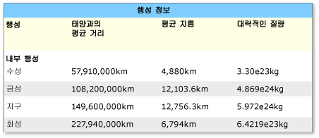
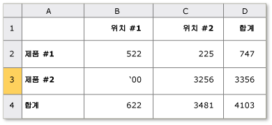

# UI 자동화 Table 컨트롤 패턴 구현
> [!NOTE]
>  이 설명서는 관리 되는 사용 하려는.NET Framework 개발자를 위한 [!INCLUDE[TLA2#tla_uiautomation](../../../includes/tla2sharptla-uiautomation-md.md)] 에 정의 된 클래스는 <xref:System.Windows.Automation> 네임 스페이스입니다. 에 대 한 최신 정보에 대 한 [!INCLUDE[TLA2#tla_uiautomation](../../../includes/tla2sharptla-uiautomation-md.md)], 참조 [Windows 자동화 API: UI 자동화](http://go.microsoft.com/fwlink/?LinkID=156746)합니다.  
  
 지침 및 규칙을 구현 하기 위한이 항목에서는 소개 <xref:System.Windows.Automation.Provider.ITableProvider>, 속성, 메서드 및 이벤트에 대 한 정보를 포함 합니다. 추가 참조에 대한 링크는 개요의 끝에 나열되어 있습니다.  
  
 <xref:System.Windows.Automation.TablePattern> 컨트롤 패턴의 자식 요소 컬렉션에 대 한 컨테이너 역할을 하는 컨트롤을 지 원하는 데 사용 됩니다. 이 요소의 자식 항목을 구현 해야 <xref:System.Windows.Automation.Provider.ITableItemProvider> 하며 행과 열으로 이동할 수 있는 논리적&2; 차원 좌표계로 구성 됩니다. 이 컨트롤 패턴은 유사 <xref:System.Windows.Automation.Provider.IgridProvider>를 구현 하는 컨트롤 차이에 <xref:System.Windows.Automation.Provider.ITableProvider> 각 자식 요소에 대 한 열 및/또는 행 머리글 관계 노출 해야 합니다. 이 컨트롤 패턴을 구현 하는 컨트롤의 예 참조 [UI 자동화 클라이언트에 대 한 컨트롤 패턴 매핑](../../../docs/framework/ui-automation/control-pattern-mapping-for-ui-automation-clients.md)합니다.  
  
   
## 구현 지침 및 규칙  
 Table 컨트롤 패턴을 구현할 때는 다음 지침 및 규칙에 유의하세요.  
  
-   개별 셀의 내용에 대 한 액세스가의 필수 동시 구현에서 제공 하는 배열 또는 논리적&2; 차원 좌표계를 통해 <xref:System.Windows.Automation.Provider.IGridProvider>합니다.  
  
-   열 또는 행 헤더는 테이블 개체 내에 포함되거나 테이블 개체와 연결된 별도의 헤더 개체에 포함될 수 있습니다.  
  
-   열 및 행 헤더에는 모든 지원 헤더는 물론 기본 헤더가 포함될 수 있습니다.  
  
> [!NOTE]
>  이 개념에 분명 하 게 되는 [!INCLUDE[TLA#tla_xl](../../../includes/tlasharptla-xl-md.md)] 스프레드시트는 사용자가 "First name" 열을 정의 하는 위치입니다. 이제 이 열에는 사용자가 정의한 "이름" 헤더와 응용 프로그램에서 할당한 해당 열의 영숫자 지정 두 개의 헤더가 있습니다.  
  
-   참조 [UI 자동화 Grid 컨트롤 패턴 구현](../../../docs/framework/ui-automation/implementing-the-ui-automation-grid-control-pattern.md) 관련 된 표 기능에 대 한 합니다.  
  
   
복잡한 열 헤더가 있는 테이블의 예  
  
   
모호한 RowOrColumnMajor 속성이 있는 테이블  
  
   
## ITableProvider에 필요한 멤버  
 ITableProvider 인터페이스에는 다음과 같은 속성 및 메서드가 필요합니다.  
  
|필요한 멤버|멤버 형식|노트|  
|----------------------|-----------------|-----------|  
|<xref:System.Windows.Automation.Provider.ITableProvider.RowOrColumnMajor%2A>|속성|없음|  
|<xref:System.Windows.Automation.Provider.ITableProvider.GetColumnHeaders%2A>|메서드|없음|  
|<xref:System.Windows.Automation.Provider.ITableProvider.GetRowHeaders%2A>|메서드|없음|  
  
 이 컨트롤 패턴에 연결된 이벤트가 없습니다.  
  
   
## 예외  
 이 컨트롤 패턴에 연결된 예외가 없습니다.  
  
## 참고 항목  
 [UI 자동화 컨트롤 패턴 개요](../../../docs/framework/ui-automation/ui-automation-control-patterns-overview.md)   
 [UI 자동화 공급자의 컨트롤 패턴 지원](../../../docs/framework/ui-automation/support-control-patterns-in-a-ui-automation-provider.md)   
 [클라이언트에 대 한 UI 자동화 컨트롤 패턴](../../../docs/framework/ui-automation/ui-automation-control-patterns-for-clients.md)   
 [UI 자동화 TableItem 컨트롤 패턴 구현](../../../docs/framework/ui-automation/implementing-the-ui-automation-tableitem-control-pattern.md)   
 [UI 자동화 Grid 컨트롤 패턴 구현](../../../docs/framework/ui-automation/implementing-the-ui-automation-grid-control-pattern.md)   
 [UI 자동화 트리 개요](../../../docs/framework/ui-automation/ui-automation-tree-overview.md)   
 [UI 자동화의 캐싱 사용](../../../docs/framework/ui-automation/use-caching-in-ui-automation.md)