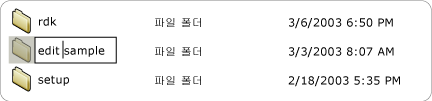

# Implementing the UI Automation Value Control Pattern
> [!NOTE]
>  이 설명서는 <xref:System.Windows.Automation> 네임스페이스에 정의된 관리되는 [!INCLUDE[TLA2#tla_uiautomation](../../../includes/tla2sharptla-uiautomation-md.md)] 클래스를 사용하려는 .NET Framework 개발자를 위한 것입니다.[!INCLUDE[TLA2#tla_uiautomation](../../../includes/tla2sharptla-uiautomation-md.md)]에 대한 최신 정보는 [Windows 자동화 API: UI 자동화](http://go.microsoft.com/fwlink/?LinkID=156746)를 참조하세요.  
  
 이 항목에서는 이벤트 및 속성에 대한 정보를 포함하여 <xref:System.Windows.Automation.Provider.IValueProvider>를 구현하기 위한 지침 및 규칙을 제공합니다. 추가 참조에 대한 링크는 항목 끝에 나열되어 있습니다.  
  
 <xref:System.Windows.Automation.ValuePattern> 컨트롤 패턴는 범위에 걸쳐 있지 않은 내장 값이 있고 문자열로 나타낼 수 있는 컨트롤을 지원하는 데 사용됩니다. 이 문자열은 컨트롤 및 해당 설정에 따라 편집할 수 있습니다. 이 패턴을 구현하는 컨트롤의 예제를 보려면 [Control Pattern Mapping for UI Automation Clients](../../../docs/framework/ui-automation/control-pattern-mapping-for-ui-automation-clients.md)을 참조하세요.  
  
   
## 구현 지침 및 규칙  
 Value 컨트롤 패턴을 구현할 때는 다음 지침 및 규칙에 유의하세요.  
  
-   <xref:System.Windows.Automation.ControlType.ListItem> 및 <xref:System.Windows.Automation.ControlType.TreeItem>과 같은 컨트롤은 항목이 편집 가능한 경우 컨트롤의 현재 편집 모드와 관계 없이 <xref:System.Windows.Automation.ValuePattern>을 지원해야 합니다. 자식 항목이 편집 가능한 경우 부모 컨트롤이 <xref:System.Windows.Automation.ValuePattern>도 지원해야 합니다.  
  
   
편집 가능한 목록 항목의 예  
  
-   단일 줄 편집 컨트롤은 <xref:System.Windows.Automation.Provider.IValueProvider>를 구현하여 해당 내용에 대한 프로그래밍 방식 액세스를 제공합니다. 하지만 여러 줄 편집 컨트롤은 <xref:System.Windows.Automation.Provider.IValueProvider>를 구현하지 않습니다. 대신, <xref:System.Windows.Automation.Provider.ITextProvider>를 구현하여 내용에 대한 액세스를 제공합니다.  
  
-   여러 줄 편집 컨트롤의 텍스트 내용을 검색하려면 컨트롤이 <xref:System.Windows.Automation.Provider.ITextProvider>를 구현해야 합니다. 하지만 <xref:System.Windows.Automation.Provider.ITextProvider>는 컨트롤의 값 설정을 지원하지 않습니다.  
  
-   <xref:System.Windows.Automation.Provider.IValueProvider>는 서식 정보 및 하위 문자열 값 검색을 지원하지 않습니다. 이러한 시나리오에서는 <xref:System.Windows.Automation.Provider.ITextProvider>를 구현합니다.  
  
-   <xref:System.Windows.Automation.Provider.IValueProvider>는 색 값\(예: "노란색"\) 및 해당되는 내부 [!INCLUDE[TLA#tla_rgb](../../../includes/tlasharptla-rgb-md.md)] 구조 간의 문자열 매핑을 지원하는 [!INCLUDE[TLA#tla_word](../../../includes/tlasharptla-word-md.md)]의 **색 선택** 선택 항목 컨트롤과 같은\(아래 그림 참조\) 컨트롤이 구현해야 합니다.  
  
   
색 견본 문자열 매핑의 예  
  
-   컨트롤에서 <xref:System.Windows.Automation.AutomationElement.IsEnabledProperty>가 `true`로 설정되고 <xref:System.Windows.Automation.ValuePattern.IsReadOnlyProperty>가 `false`로 설정되어야 <xref:System.Windows.Automation.Provider.IValueProvider.SetValue%2A>를 호출할 수 있습니다.  
  
   
## IValueProvider에 필요한 멤버  
 <xref:System.Windows.Automation.Provider.IValueProvider>를 구현하려면 다음과 같은 속성 및 메서드가 필요합니다.  
  
|필요한 멤버|멤버 형식|노트|  
|------------|-----------|--------|  
|<xref:System.Windows.Automation.ValuePattern.IsReadOnlyProperty>|속성|없음|  
|<xref:System.Windows.Automation.ValuePattern.ValueProperty>|속성|없음|  
|<xref:System.Windows.Automation.ValuePattern.SetValue%2A>|메서드|없음|  
  
   
## 예외  
 공급자는 다음과 같은 예외를 throw해야 합니다.  
  
|예외 형식|조건|  
|-----------|--------|  
|<xref:System.InvalidOperationException>|<xref:System.Windows.Automation.ValuePattern.SetValue%2A>   -   로캘 관련 정보가 잘못된 형식\(예: 올바르지 않은 형식의 날짜\)으로 컨트롤에 전달되는 경우.|  
|<xref:System.ArgumentException>|<xref:System.Windows.Automation.ValuePattern.SetValue%2A>   -   새 값을 문자열에서 컨트롤이 인식하는 형식으로 변환할 수 없는 경우.|  
|<xref:System.Windows.Automation.ElementNotEnabledException>|<xref:System.Windows.Automation.ValuePattern.SetValue%2A>   -   활성화되지 않은 컨트롤을 조작하려고 시도하는 경우.|  
  
## 참고 항목  
 [UI Automation Control Patterns Overview](../../../docs/framework/ui-automation/ui-automation-control-patterns-overview.md)   
 [Support Control Patterns in a UI Automation Provider](../../../docs/framework/ui-automation/support-control-patterns-in-a-ui-automation-provider.md)   
 [UI Automation Control Patterns for Clients](../../../docs/framework/ui-automation/ui-automation-control-patterns-for-clients.md)   
 [TextPattern Insert Text Sample](http://msdn.microsoft.com/ko-kr/67353f93-7ee2-42f2-ab76-5c078cf6ca16)   
 [UI Automation Tree Overview](../../../docs/framework/ui-automation/ui-automation-tree-overview.md)   
 [Use Caching in UI Automation](../../../docs/framework/ui-automation/use-caching-in-ui-automation.md)