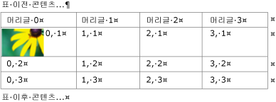
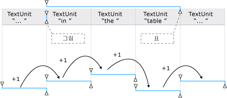
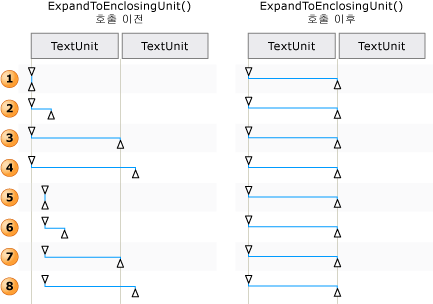

# TextPattern 및 포함 개체 개요TextPattern and Embedded Objects Overview
> [!NOTE]
>  이 설명서는 <xref:System.Windows.Automation> 네임스페이스에 정의된 관리되는 [!INCLUDE[TLA2#tla_uiautomation](../../../includes/tla2sharptla-uiautomation-md.md)] 클래스를 사용하려는 .NET Framework 개발자를 위한 것입니다.This documentation is intended for .NET Framework developers who want to use the managed [!INCLUDE[TLA2#tla_uiautomation](../../../includes/tla2sharptla-uiautomation-md.md)] classes defined in the <xref:System.Windows.Automation> namespace. [!INCLUDE[TLA2#tla_uiautomation](../../../includes/tla2sharptla-uiautomation-md.md)]에 대한 최신 정보는 [Windows 자동화 API: UI 자동화](http://go.microsoft.com/fwlink/?LinkID=156746)를 참조하세요.For the latest information about [!INCLUDE[TLA2#tla_uiautomation](../../../includes/tla2sharptla-uiautomation-md.md)], see [Windows Automation API: UI Automation](http://go.microsoft.com/fwlink/?LinkID=156746).  
  
 이 개요에서는 [!INCLUDE[TLA#tla_uiautomation](../../../includes/tlasharptla-uiautomation-md.md)] 에서 포함된 개체 또는 자식 요소를 텍스트 문서나 컨테이너 내에서 노출하는 방법을 설명합니다.This overview describes how [!INCLUDE[TLA#tla_uiautomation](../../../includes/tlasharptla-uiautomation-md.md)] exposes embedded objects, or child elements, within a text document or container.  
  
 [!INCLUDE[TLA2#tla_uiautomation](../../../includes/tla2sharptla-uiautomation-md.md)] 에서 포함된 개체란 예를 들어 이미지, 하이퍼링크, 테이블 또는 [!INCLUDE[TLA#tla_xl](../../../includes/tlasharptla-xl-md.md)] 스프레드시트나 [!INCLUDE[TLA#tla_winmedia](../../../includes/tlasharptla-winmedia-md.md)] 파일 등의 문서 형식과 같이 텍스트가 아닌 범위를 가진 요소입니다.In [!INCLUDE[TLA2#tla_uiautomation](../../../includes/tla2sharptla-uiautomation-md.md)] an embedded object is any element that has non-textual boundaries; for example, an image, hyperlink, table, or document type such as an [!INCLUDE[TLA#tla_xl](../../../includes/tlasharptla-xl-md.md)] spreadsheet or [!INCLUDE[TLA#tla_winmedia](../../../includes/tlasharptla-winmedia-md.md)] file. 이는 요소가 한 응용 프로그램에서 만들어져 다른 응용 프로그램 내에서 포함 또는 연결되는 표준 정의와 다릅니다.This differs from the standard definition, where an element is created in one application and embedded, or linked, within another. [!INCLUDE[TLA2#tla_uiautomation](../../../includes/tla2sharptla-uiautomation-md.md)]에서는 개체를 원래 응용 프로그램 내에서 편집할 수 있는지 여부가 중요하지 않습니다.Whether the object can be edited within its original application is irrelevant in the context of [!INCLUDE[TLA2#tla_uiautomation](../../../includes/tla2sharptla-uiautomation-md.md)].  
  
   
## 포함된 개체 및 UI 자동화 트리Embedded Objects and the UI Automation Tree  
 포함된 개체는 [!INCLUDE[TLA2#tla_uiautomation](../../../includes/tla2sharptla-uiautomation-md.md)] 트리의 컨트롤 뷰에서 개별 요소로 처리됩니다.Embedded objects are treated as individual elements within the control view of the [!INCLUDE[TLA2#tla_uiautomation](../../../includes/tla2sharptla-uiautomation-md.md)] tree. 텍스트 컨테이너의 자식으로 노출되어, [!INCLUDE[TLA2#tla_uiautomation](../../../includes/tla2sharptla-uiautomation-md.md)]의 다른 컨트롤과 동일한 모델을 통해 이들 개체에 액세스할 수 있습니다.They are exposed as children of the text container so that they can be accessed through the same model as other controls in [!INCLUDE[TLA2#tla_uiautomation](../../../includes/tla2sharptla-uiautomation-md.md)].  
  
   
테이블, 이미지, 하이퍼링크 등의 포함된 개체가 있는 텍스트 컨테이너의 예Example of a Text Container with Table, Image, and Hyperlink Embedded Objects  
  
   
이전 텍스트 컨테이너의 일부를 보여 주는 콘텐츠 뷰의 예Example of the Content View for a Portion of the Preceding Text Container  
  
   
## TextPattern 및 TextPatternRange를 사용하여 포함된 개체 노출Expose Embedded Objects Using TextPattern and TextPatternRange  
 <xref:System.Windows.Automation.TextPattern> 컨트롤 패턴 클래스와 <xref:System.Windows.Automation.Text.TextPatternRange> 클래스를 함께 사용하면 포함된 개체의 탐색과 쿼리를 돕는 메서드와 속성이 노출됩니다.Used in conjunction, the <xref:System.Windows.Automation.TextPattern> control pattern class and the <xref:System.Windows.Automation.Text.TextPatternRange> class expose methods and properties that facilitate navigation and querying of embedded objects.  
  
 텍스트 컨테이너 및 포함된 개체(예: 하이퍼링크 또는 테이블 셀)의 텍스트 내용(또는 내부 텍스트)은 [!INCLUDE[TLA2#tla_uiautomation](../../../includes/tla2sharptla-uiautomation-md.md)] 트리의 컨트롤 뷰와 콘텐츠 뷰에서 지속적인 단일 텍스트 스트림으로 노출됩니다. 개체 경계는 무시됩니다.The textual content (or inner text) of a text container and an embedded object, such as a hyperlink or table cell, is exposed as a single, continuous text stream in both the control view and the content view of the [!INCLUDE[TLA2#tla_uiautomation](../../../includes/tla2sharptla-uiautomation-md.md)] tree; object boundaries are ignored. UI 자동화 클라이언트가 낭독, 해석 또는 분석의 목적으로 텍스트를 특정 방식으로 검색하는 경우 텍스트 내용이나 기타 포함된 개체가 있는 테이블과 같이 특수한 경우가 텍스트 범위에 있는지 확인해야 합니다.If a UI Automation client is retrieving the text for the purpose of reciting, interpreting, or analyzing in some manner, the text range should be checked for special cases, such as a table with textual content or other embedded objects. 이렇게 하려면 <xref:System.Windows.Automation.Text.TextPatternRange.GetChildren%2A> 을 호출하여 각 포함된 개체에 대한 <xref:System.Windows.Automation.AutomationElement> 를 가져온 다음 <xref:System.Windows.Automation.TextPattern.RangeFromChild%2A> 를 호출하여 각 요소의 텍스트 범위를 가져오면 됩니다.This can be accomplished by calling <xref:System.Windows.Automation.Text.TextPatternRange.GetChildren%2A> to obtain an <xref:System.Windows.Automation.AutomationElement> for each embedded object and then calling <xref:System.Windows.Automation.TextPattern.RangeFromChild%2A> to obtain a text range for each element. 이 과정은 모든 텍스트 내용이 검색될 때까지 반복적으로 수행됩니다.This is done recursively until all textual content has been retrieved.  
  
 ![포함 된 개체에 포함 되는 텍스트 범위입니다. ] (../../../docs/framework/ui-automation/media/uia-textpattern-embeddedobjecttextranges.png "UIA_TextPattern_EmbeddedObjectTextRanges")  
포함된 개체가 있는 텍스트 스트림과 해당 범위의 예Example of a text stream with embedded objects and their range spans  
  
 텍스트 범위의 내용을 이동해야 하는 경우 <xref:System.Windows.Automation.Text.TextPatternRange.Move%2A> 메서드가 성공적으로 실행되려면 백그라운드에서 일련의 단계를 거쳐야 합니다.When it is necessary to traverse the content of a text range, a series of steps are involved behind the scenes in order for the <xref:System.Windows.Automation.Text.TextPatternRange.Move%2A> method to execute successfully.  
  
1.  텍스트 범위가 정규화됩니다. 다시 말해서, 텍스트 범위가 <xref:System.Windows.Automation.Text.TextPatternRangeEndpoint.Start> 끝점에서 중복 제거 범위로 축소되어 <xref:System.Windows.Automation.Text.TextPatternRangeEndpoint.End> 끝점이 불필요해집니다.The text range is normalized; that is, the text range is collapsed to a degenerate range at the <xref:System.Windows.Automation.Text.TextPatternRangeEndpoint.Start> endpoint, which makes the <xref:System.Windows.Automation.Text.TextPatternRangeEndpoint.End> endpoint superfluous. 이 단계는 텍스트 범위가 <xref:System.Windows.Automation.Text.TextUnit> 경계까지 확장된 경우 모호성을 제거하기 위해 필요합니다. 예를 들어 "{The U}RL [http://www.microsoft.com](http://www.microsoft.com) is embedded in text"에서 "{" 및 "}"는 텍스트 범위 끝점입니다.This step is necessary to remove ambiguity in situations where a text range spans <xref:System.Windows.Automation.Text.TextUnit> boundaries: for example, "{The U}RL [http://www.microsoft.com](http://www.microsoft.com) is embedded in text" where "{" and "}" are the text range endpoints.  
  
2.  결과 범위가 <xref:System.Windows.Automation.TextPattern.DocumentRange%2A> 내에서 뒤쪽으로 옮겨져 요청된 <xref:System.Windows.Automation.Text.TextUnit> 경계의 시작 부분으로 이동하게 됩니다.The resulting range is moved backward in the <xref:System.Windows.Automation.TextPattern.DocumentRange%2A> to the beginning of the requested <xref:System.Windows.Automation.Text.TextUnit> boundary.  
  
3.  범위가 요청된 <xref:System.Windows.Automation.TextPattern.DocumentRange%2A> 경계 수만큼 <xref:System.Windows.Automation.Text.TextUnit> 내에서 앞이나 뒤로 이동합니다.The range is moved forward or backward in the <xref:System.Windows.Automation.TextPattern.DocumentRange%2A> by the requested number of <xref:System.Windows.Automation.Text.TextUnit> boundaries.  
  
4.  그런 다음, 요청된 <xref:System.Windows.Automation.Text.TextPatternRangeEndpoint.End> 경계 하나만큼 <xref:System.Windows.Automation.Text.TextUnit> 끝점을 이동하여 중복 제거 범위 상태이던 범위가 확장됩니다.The range is then expanded from a degenerate range state by moving the <xref:System.Windows.Automation.Text.TextPatternRangeEndpoint.End> endpoint by one requested <xref:System.Windows.Automation.Text.TextUnit> boundary.  
  
   
Move() 및 ExpandToEnclosingUnit()에 따라 텍스트 범위가 조정되는 방법의 예Examples of how a text range is adjusted for Move() and ExpandToEnclosingUnit()  
  
   
## 일반적인 시나리오Common Scenarios  
 다음 섹션에서는 포함된 개체와 관련된 가장 일반적인 시나리오의 예를 소개합니다.The following sections present examples of the most common scenarios that involve embedded objects.  
  
 예제의 범례:Legend for the examples shown:  
  
 { = <xref:System.Windows.Automation.Text.TextPatternRangeEndpoint.Start>{ = <xref:System.Windows.Automation.Text.TextPatternRangeEndpoint.Start>  
  
 } = <xref:System.Windows.Automation.Text.TextPatternRangeEndpoint.End>} = <xref:System.Windows.Automation.Text.TextPatternRangeEndpoint.End>  
  
   
### 하이퍼링크Hyperlink  
 **예제 1 - 포함된 텍스트 하이퍼링크가 들어 있는 텍스트 범위****Example 1 - A text range that contains an embedded text hyperlink**  
  
 {The URL [http://www.microsoft.com](http://www.microsoft.com) is embedded in text}.{The URL [http://www.microsoft.com](http://www.microsoft.com) is embedded in text}.  
  
|호출되는 메서드Method called|결과Result|  
|-------------------|------------|  
|<xref:System.Windows.Automation.Text.TextPatternRange.GetText%2A>|"The URL http://www.microsoft.com is embedded in text"라는 문자열을 반환합니다.Returns the string "The URL http://www.microsoft.com is embedded in text".|  
|<xref:System.Windows.Automation.Text.TextPatternRange.GetEnclosingElement%2A>|텍스트 범위를 포함하는 가장 안쪽의 <xref:System.Windows.Automation.AutomationElement> 를 반환합니다. 이 예제에서는 텍스트 공급자 자체를 나타내는 <xref:System.Windows.Automation.AutomationElement> 입니다.Returns the innermost <xref:System.Windows.Automation.AutomationElement> that encloses the text range; in this case, the <xref:System.Windows.Automation.AutomationElement> that represents the text provider itself.|  
|<xref:System.Windows.Automation.Text.TextPatternRange.GetChildren%2A>|하이퍼링크 컨트롤을 나타내는 <xref:System.Windows.Automation.AutomationElement> 를 반환합니다.Returns an <xref:System.Windows.Automation.AutomationElement> representing the hyperlink control.|  
|<xref:System.Windows.Automation.TextPattern.RangeFromChild%2A> 여기서 <xref:System.Windows.Automation.AutomationElement> 는 이전 `GetChildren` 메서드에서 반환되는 개체입니다.<xref:System.Windows.Automation.TextPattern.RangeFromChild%2A> where <xref:System.Windows.Automation.AutomationElement> is the object returned by the previous `GetChildren` method.|"http://www.microsoft.com"을 나타내는 범위를 반환합니다.Returns the range that represents "http://www.microsoft.com".|  
  
 **예제 2 - 포함된 텍스트 하이퍼링크에 부분적으로 걸쳐 있는 텍스트 범위****Example 2 - A text range that partially spans an embedded text hyperlink**  
  
 URL http://{[www]을 (를) 텍스트에 포함 됩니다.The URL http://{[www]} is embedded in text.  
  
|호출되는 메서드Method called|결과Result|  
|-------------------|------------|  
|<xref:System.Windows.Automation.Text.TextPatternRange.GetText%2A>|문자열 "www"를 반환합니다.Returns the string "www".|  
|<xref:System.Windows.Automation.Text.TextPatternRange.GetEnclosingElement%2A>|텍스트 범위를 포함하는 가장 안쪽의 <xref:System.Windows.Automation.AutomationElement> 를 반환합니다. 이 예제에서는 하이퍼링크를 컨트롤입니다.Returns the innermost <xref:System.Windows.Automation.AutomationElement> that encloses the text range; in this case, the hyperlink control.|  
|<xref:System.Windows.Automation.Text.TextPatternRange.GetChildren%2A>|텍스트 범위가 전체 URL 문자열로 확장되지 않기 때문에 `null` 을 반환합니다.Returns `null` since the text range doesn't span the entire URL string.|  
  
 **예 3-텍스트 컨테이너의 콘텐츠에 부분적으로 걸쳐 있는 텍스트 범위입니다. 텍스트 컨테이너에 포함된 된 텍스트 하이퍼링크가 텍스트 범위에 속하지 않는 합니다.****Example 3 - A text range that partially spans the content of a text container. The text container has an embedded text hyperlink that is not part of the text range.**  
  
 {The URL} [http://www.microsoft.com](http://www.microsoft.com) is embedded in text.{The URL} [http://www.microsoft.com](http://www.microsoft.com) is embedded in text.  
  
|호출되는 메서드Method called|결과Result|  
|-------------------|------------|  
|<xref:System.Windows.Automation.Text.TextPatternRange.GetText%2A>|문자열 "The URL"을 반환합니다.Returns the string "The URL".|  
|<xref:System.Windows.Automation.Text.TextPatternRange.GetEnclosingElement%2A>|텍스트 범위를 포함하는 가장 안쪽의 <xref:System.Windows.Automation.AutomationElement> 를 반환합니다. 이 예제에서는 텍스트 공급자 자체를 나타내는 <xref:System.Windows.Automation.AutomationElement> 입니다.Returns the innermost <xref:System.Windows.Automation.AutomationElement> that encloses the text range; in this case, the <xref:System.Windows.Automation.AutomationElement> that represents the text provider itself.|  
|<xref:System.Windows.Automation.Text.TextPatternRange.Move%2A> 매개 변수는 (TextUnit.Word, 1)<xref:System.Windows.Automation.Text.TextPatternRange.Move%2A> with parameters of (TextUnit.Word, 1).|하이퍼링크의 텍스트가 개별 단어로 이루어져 있으므로 텍스트 범위를 "http"로 이동합니다.Moves the text range span to "http" since the text of the hyperlink is comprised of individual words. 이 경우 하이퍼링크는 단일 개체로 처리되지 않습니다.In this case, the hyperlink is not treated as a single object.   {[Http]} URL 텍스트에 포함 됩니다.The URL {[http]} is embedded in text.|  
  
   
### 이미지Image  
 **예제 1 - 포함된 이미지가 들어 있는 텍스트 범위****Example 1 - A text range that contains an embedded image**  
  
 {이미지  텍스트에 포함 된}.{The image  is embedded in text}.  
  
|호출되는 메서드Method called|결과Result|  
|-------------------|------------|  
|<xref:System.Windows.Automation.Text.TextPatternRange.GetText%2A>|문자열 "The is embedded in text"를 반환합니다.Returns the string "The is embedded in text". 이미지에 연결된 대체 텍스트는 텍스트 스트림에 포함된다고 기대할 수 없습니다.Any ALT text associated with the image cannot be expected to be included in the text stream.|  
|<xref:System.Windows.Automation.Text.TextPatternRange.GetEnclosingElement%2A>|텍스트 범위를 포함하는 가장 안쪽의 <xref:System.Windows.Automation.AutomationElement> 를 반환합니다. 이 예제에서는 텍스트 공급자 자체를 나타내는 <xref:System.Windows.Automation.AutomationElement> 입니다.Returns the innermost <xref:System.Windows.Automation.AutomationElement> that encloses the text range; in this case, the <xref:System.Windows.Automation.AutomationElement> that represents the text provider itself.|  
|<xref:System.Windows.Automation.Text.TextPatternRange.GetChildren%2A>|이미지 컨트롤을 나타내는 <xref:System.Windows.Automation.AutomationElement> 를 반환합니다.Returns an <xref:System.Windows.Automation.AutomationElement> representing the image control.|  
|<xref:System.Windows.Automation.TextPattern.RangeFromChild%2A> 여기서 <xref:System.Windows.Automation.AutomationElement> 는 이전 <xref:System.Windows.Automation.Text.TextPatternRange.GetChildren%2A> 메서드에서 반환되는 개체입니다.<xref:System.Windows.Automation.TextPattern.RangeFromChild%2A> where <xref:System.Windows.Automation.AutomationElement> is the object returned by the previous <xref:System.Windows.Automation.Text.TextPatternRange.GetChildren%2A> method.|나타내는 중복 제거 범위를 반환 합니다. ""입니다.Returns the degenerate range that represents "".|  
  
 **예제 2-텍스트 컨테이너의 콘텐츠에 부분적으로 걸쳐 있는 텍스트 범위입니다. 텍스트 컨테이너에 포함된 된 이미지가 텍스트 범위에 속하지 않는 합니다.****Example 2 - A text range that partially spans the content of a text container. The text container has an embedded image that is not part of the text range.**  
  
 {이미지}  텍스트에 포함 되어 있습니다.{The image}  is embedded in text.  
  
|호출되는 메서드Method called|결과Result|  
|-------------------|------------|  
|<xref:System.Windows.Automation.Text.TextPatternRange.GetText%2A>|문자열 "The image"를 반환합니다.Returns the string "The image".|  
|<xref:System.Windows.Automation.Text.TextPatternRange.GetEnclosingElement%2A>|텍스트 범위를 포함하는 가장 안쪽의 <xref:System.Windows.Automation.AutomationElement> 를 반환합니다. 이 예제에서는 텍스트 공급자 자체를 나타내는 <xref:System.Windows.Automation.AutomationElement> 입니다.Returns the innermost <xref:System.Windows.Automation.AutomationElement> that encloses the text range; in this case, the <xref:System.Windows.Automation.AutomationElement> that represents the text provider itself.|  
|<xref:System.Windows.Automation.Text.TextPatternRange.Move%2A> 매개 변수는 (TextUnit.Word, 1)<xref:System.Windows.Automation.Text.TextPatternRange.Move%2A> with parameters of (TextUnit.Word, 1).|텍스트 범위를 "is "로 이동합니다.Moves the text range span to "is ". 텍스트 기반의 포함된 개체만 텍스트 스트림의 일부로 간주되므로, 이 예제의 이미지는 이동 또는 해당 반환 값(이 경우 1)에 영향을 주지 않습니다.Because only text-based embedded objects are considered part of the text stream, the image in this example does not affect Move or its return value (1 in this case).|  
  
   
### 표Table  
  
### 예제에서 사용되는 테이블Table used for examples  
  
|이미지가 있는 셀Cell with Image|텍스트가 있는 셀Cell with Text|  
|---------------------|--------------------|  
||XX|  
||YY|  
|   Z의 이미지Image for Z|ZZ|  
  
 **예제 1 - 셀의 내용에서 텍스트 컨테이너 가져오기****Example 1 - Get the text container from the content of a cell.**  
  
|호출되는 메서드Method Called|결과Result|  
|-------------------|------------|  
|<xref:System.Windows.Automation.GridPattern.GetItem%2A> 매개 변수는 (0, 0)<xref:System.Windows.Automation.GridPattern.GetItem%2A> with parameters (0,0)|테이블 셀의 내용을 나타내는 <xref:System.Windows.Automation.AutomationElement> 를 반환합니다. 이 예제에서 요소는 텍스트 컨트롤입니다.Returns the <xref:System.Windows.Automation.AutomationElement> representing the content of the table cell; in this case, the element is a text control.|  
|<xref:System.Windows.Automation.TextPattern.RangeFromChild%2A> 여기서 <xref:System.Windows.Automation.AutomationElement> 는 이전 `GetItem` 메서드에서 반환되는 개체입니다.<xref:System.Windows.Automation.TextPattern.RangeFromChild%2A> where <xref:System.Windows.Automation.AutomationElement> is the object returned by the previous `GetItem` method.|이미지 범위를 반환 합니다.Returns the range that spans the image .|  
|이전<xref:System.Windows.Automation.Text.TextPatternRange.GetEnclosingElement%2A> 메서드에서 반환되는 개체에 대한 `RangeFromChild` 입니다.<xref:System.Windows.Automation.Text.TextPatternRange.GetEnclosingElement%2A> for the object returned by the previous `RangeFromChild` method.|테이블 셀을 나타내는 <xref:System.Windows.Automation.AutomationElement> 를 반환합니다. 이 예제에서 요소는 TableItemPattern을 지원하는 텍스트 컨트롤입니다.Returns the <xref:System.Windows.Automation.AutomationElement> representing the table cell; in this case, the element is a text control that supports TableItemPattern.|  
|이전 `GetEnclosingElement` 메서드에서 반환되는 개체에 대한 <xref:System.Windows.Automation.Text.TextPatternRange.GetEnclosingElement%2A>입니다.<xref:System.Windows.Automation.Text.TextPatternRange.GetEnclosingElement%2A> for the object returned by the previous `GetEnclosingElement` method.|테이블을 나타내는 <xref:System.Windows.Automation.AutomationElement> 를 반환합니다.Returns the <xref:System.Windows.Automation.AutomationElement> representing the table.|  
|이전<xref:System.Windows.Automation.Text.TextPatternRange.GetEnclosingElement%2A> 메서드에서 반환되는 개체에 대한 `GetEnclosingElement` 입니다.<xref:System.Windows.Automation.Text.TextPatternRange.GetEnclosingElement%2A> for the object returned by the previous `GetEnclosingElement` method.|텍스트 공급자 자체를 나타내는 <xref:System.Windows.Automation.AutomationElement> 를 반환합니다.Returns the <xref:System.Windows.Automation.AutomationElement> that represents the text provider itself.|  
  
 **예제 2 - 셀의 텍스트 콘텐츠 가져오기****Example 2 - Get the text content of a cell.**  
  
|호출되는 메서드Method Called|결과Result|  
|-------------------|------------|  
|<xref:System.Windows.Automation.GridPattern.GetItem%2A> 매개 변수는 (1,1)<xref:System.Windows.Automation.GridPattern.GetItem%2A> with parameters of (1,1).|테이블 셀의 내용을 나타내는 <xref:System.Windows.Automation.AutomationElement>를 반환합니다. 이 예제에서 요소는 텍스트 컨트롤입니다.Returns the <xref:System.Windows.Automation.AutomationElement> representing the content of the table cell; in this case, the element is a text control.|  
|<xref:System.Windows.Automation.TextPattern.RangeFromChild%2A> 여기서 <xref:System.Windows.Automation.AutomationElement>는 이전 `GetItem` 메서드에서 반환되는 개체입니다.<xref:System.Windows.Automation.TextPattern.RangeFromChild%2A> where <xref:System.Windows.Automation.AutomationElement> is the object returned by the previous `GetItem` method.|"Y"를 반환합니다.Returns "Y".|  
  
## 참고 항목See Also  
 <xref:System.Windows.Automation.TextPattern>  
 <xref:System.Windows.Automation.Text.TextPatternRange>  
 <xref:System.Windows.Automation.Provider.ITextProvider>  
 <xref:System.Windows.Automation.Provider.ITextRangeProvider>  
 [UI 자동화를 사용하여 포함 개체에 액세스Access Embedded Objects Using UI Automation](../../../docs/framework/ui-automation/access-embedded-objects-using-ui-automation.md)  
 [UI 자동화를 사용하여 표의 콘텐츠 노출Expose the Content of a Table Using UI Automation](../../../docs/framework/ui-automation/expose-the-content-of-a-table-using-ui-automation.md)  
 [UI 자동화를 사용하여 텍스트 이동Traverse Text Using UI Automation](../../../docs/framework/ui-automation/traverse-text-using-ui-automation.md)  
 [TextPattern 검색 및 선택 샘플TextPattern Search and Selection Sample](http://msdn.microsoft.com/en-us/0a3bca57-8b72-489d-a57c-da85b7a22c7f)
