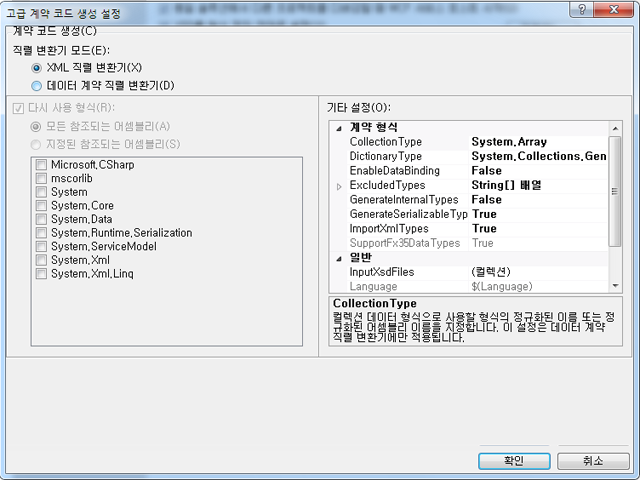

# <a name="contract-first-tool"></a><span data-ttu-id="82240-102">계약 중심 도구</span><span class="sxs-lookup"><span data-stu-id="82240-102">Contract-First Tool</span></span>
<span data-ttu-id="82240-103">서비스 계약을 기존 서비스에서 만들어야 할 경우가 있습니다.</span><span class="sxs-lookup"><span data-stu-id="82240-103">Service contracts often need to be created from existing services.</span></span> <span data-ttu-id="82240-104">[!INCLUDE[net_v45](../../../includes/net-v45-md.md)]에서 계약 중심 도구를 사용하여 데이터 계약 클래스를 기존 서비스에서 자동으로 만들 수 있습니다.</span><span class="sxs-lookup"><span data-stu-id="82240-104">In [!INCLUDE[net_v45](../../../includes/net-v45-md.md)], data contract classes can be created automatically from existing services using the contract-first tool.</span></span> <span data-ttu-id="82240-105">계약 중심 도구를 사용하려면 XSD(XML 스키마 정의) 파일을 로컬에서 다운로드해야 합니다. 이 도구는 HTTP를 통해 원격 데이터 계약을 가져올 수 없습니다.</span><span class="sxs-lookup"><span data-stu-id="82240-105">To use the contract-first tool, the XML schema definition file (XSD) must be downloaded locally; the tool cannot import remote data contracts via HTTP.</span></span>  
  
 <span data-ttu-id="82240-106">계약 중심 도구는 [!INCLUDE[vs_current_long](../../../includes/vs-current-long-md.md)]에 빌드 작업으로 통합됩니다.</span><span class="sxs-lookup"><span data-stu-id="82240-106">The contract-first tool is integrated into [!INCLUDE[vs_current_long](../../../includes/vs-current-long-md.md)] as a build task.</span></span> <span data-ttu-id="82240-107">빌드 작업에서 생성하는 코드 파일은 프로젝트가 빌드될 때마다 생성되므로 프로젝트는 기본 서비스 계약에서 변경 사항을 쉽게 채택할 수 있습니다.</span><span class="sxs-lookup"><span data-stu-id="82240-107">The code files generated by the build task are created every time the project is built, so that the project can easily adopt changes in the underlying service contract.</span></span>  
  
 <span data-ttu-id="82240-108">계약 중심 도구가 가져올 수 있는 스키마 유형에는 다음이 포함됩니다.</span><span class="sxs-lookup"><span data-stu-id="82240-108">Schema types that the contract-first tool can import include the following:</span></span>  
  
```xml  
<xsd:complexType>  
<xsd:simpleType>  
```  
  
 <span data-ttu-id="82240-109">단순 유형이 `Int16` 또는 `String`과 같은 기본 형식인 경우 생성되지 않으며 복합 형식이 `Collection` 유형의 일부인 경우 생성되지 않습니다.</span><span class="sxs-lookup"><span data-stu-id="82240-109">Simple types will not be generated if they are primitives such as `Int16` or `String`; complex types will not be generated if they are of type `Collection`.</span></span> <span data-ttu-id="82240-110">유형이 다른 `xsd:complexType`의 일부인 경우에도 생성되지 않습니다.</span><span class="sxs-lookup"><span data-stu-id="82240-110">Types will also not be generated if they are part of another `xsd:complexType`.</span></span> <span data-ttu-id="82240-111">이러한 모든 경우 프로젝트의 기존 유형에 대한 유형이 대신 참조됩니다.</span><span class="sxs-lookup"><span data-stu-id="82240-111">In all these cases, the types will be referenced to existing types in the project instead.</span></span>  
  
## <a name="adding-a-data-contract-to-a-project"></a><span data-ttu-id="82240-112">프로젝트에 데이터 계약 추가</span><span class="sxs-lookup"><span data-stu-id="82240-112">Adding a data contract to a project</span></span>  
 <span data-ttu-id="82240-113">서비스 계약(XSD)이 프로젝트에 추가되어야 계약 중심 도구를 사용할 수 있습니다.</span><span class="sxs-lookup"><span data-stu-id="82240-113">Before the contract-first tool can be used, the service contract (XSD) must be added to the project.</span></span> <span data-ttu-id="82240-114">이 개요에서는 다음 계약이 도구 중심 기능을 설명하는 데 사용됩니다.</span><span class="sxs-lookup"><span data-stu-id="82240-114">For the purposes of this overview, the following contract will be used to illustrate contract-first functions.</span></span> <span data-ttu-id="82240-115">이 서비스 정의는 Bing 검색 API에서 사용하는 서비스 계약의 작은 하위 집합입니다.</span><span class="sxs-lookup"><span data-stu-id="82240-115">This service definition is a small subset of the service contract used by Bing’s search API.</span></span>  
  
```xml  
<?xml version="1.0" encoding="utf-8"?>  
<xs:schema id="ServiceSchema"  
    targetNamespace="http://tempuri.org/ServiceSchema.xsd"  
    elementFormDefault="qualified"  
    xmlns="http://tempuri.org/ServiceSchema.xsd"  
    xmlns:mstns="http://tempuri.org/ServiceSchema.xsd"  
    xmlns:xs="http://www.w3.org/2001/XMLSchema"  
>  
  <xs:complexType name="SearchRequest">  
    <xs:sequence>  
      <xs:element minOccurs="0" maxOccurs="1" name="Version" type="xs:string" default="2.2" />  
      <xs:element minOccurs="0" maxOccurs="1" name="Market" type="xs:string" />  
      <xs:element minOccurs="0" maxOccurs="1" name="UILanguage" type="xs:string" />  
      <xs:element minOccurs="1" maxOccurs="1" name="Query" type="xs:string" />  
      <xs:element minOccurs="1" maxOccurs="1" name="AppId" type="xs:string" />  
      <xs:element minOccurs="0" maxOccurs="1" name="Latitude" type="xs:double" />  
      <xs:element minOccurs="0" maxOccurs="1" name="Longitude" type="xs:double" />  
      <xs:element minOccurs="0" maxOccurs="1" name="Radius" type="xs:double" />  
    </xs:sequence>  
  </xs:complexType>  
  <xs:simpleType name="WebSearchOption">  
    <xs:restriction base="xs:string">  
      <xs:enumeration value="DisableHostCollapsing" />  
      <xs:enumeration value="DisableQueryAlterations" />  
    </xs:restriction>  
  </xs:simpleType>  
</xs:schema>  
```  
  
 <span data-ttu-id="82240-116">위의 서비스 계약을 프로젝트에 추가할 프로젝트를 마우스 오른쪽 단추로 클릭 하 고 선택 **새로 추가...** .</span><span class="sxs-lookup"><span data-stu-id="82240-116">To add the above service contract to the project, right-click the project and select **Add New…**.</span></span> <span data-ttu-id="82240-117">템플릿 대화 상자의 WCF 창에서 스키마 정의를 선택하고 새 파일의 이름을 SampleContract.xsd로 지정합니다.</span><span class="sxs-lookup"><span data-stu-id="82240-117">Select Schema Definition from the WCF pane of the Templates dialog, and name the new file SampleContract.xsd.</span></span> <span data-ttu-id="82240-118">위의 코드를 복사하여 새 파일의 코드 뷰에 붙여 넣습니다.</span><span class="sxs-lookup"><span data-stu-id="82240-118">Copy and paste the above code into the code view of the new file.</span></span>  
  
## <a name="configuring-contract-first-options"></a><span data-ttu-id="82240-119">도구 중심 옵션 구성</span><span class="sxs-lookup"><span data-stu-id="82240-119">Configuring contract-first options</span></span>  
 <span data-ttu-id="82240-120">도구 중심 옵션은 [!INCLUDE[indigo2](../../../includes/indigo2-md.md)] 프로젝트의 속성 메뉴에서 구성할 수 있습니다.</span><span class="sxs-lookup"><span data-stu-id="82240-120">Contract-first options can be configured in the Properties menu of a [!INCLUDE[indigo2](../../../includes/indigo2-md.md)] project.</span></span> <span data-ttu-id="82240-121">계약 중심 개발을 사용 하려면 선택은 **XSD를 형식 정의 언어로** 프로젝트 속성 창의 WCF 페이지에서 확인란 합니다.</span><span class="sxs-lookup"><span data-stu-id="82240-121">To enable contract-first development, select the **Enable XSD as Type Definition Language** check box in the WCF page of the project properties window.</span></span>  
  
 <span data-ttu-id="82240-122"></span><span class="sxs-lookup"><span data-stu-id="82240-122"></span></span>  
  
 <span data-ttu-id="82240-123">고급 속성을 구성하려면 고급 단추를 클릭합니다.</span><span class="sxs-lookup"><span data-stu-id="82240-123">To configure advanced properties, click the Advanced button.</span></span>  
  
 <span data-ttu-id="82240-124"></span><span class="sxs-lookup"><span data-stu-id="82240-124"></span></span>  
  
 <span data-ttu-id="82240-125">다음 고급 설정은 계약의 코드 생성에 대해 구성할 수 있습니다.</span><span class="sxs-lookup"><span data-stu-id="82240-125">The following advanced settings can be configured for code generation from contracts.</span></span> <span data-ttu-id="82240-126">설정은 프로젝트의 파일 모두에 대해서만 구성할 수 있으며 이때 설정은 개별 파일에 대해 구성할 수 없습니다.</span><span class="sxs-lookup"><span data-stu-id="82240-126">Settings can only be configured for all of the files in the project; settings cannot be configured for individual files at this time.</span></span>  
  
-   <span data-ttu-id="82240-127">**Serializer 모드**:이 설정은 서비스 계약 파일을 읽는 데 사용할 serializer를 결정 합니다.</span><span class="sxs-lookup"><span data-stu-id="82240-127">**Serializer Mode**: This setting determines which serializer is used for reading service contract files.</span></span> <span data-ttu-id="82240-128">때 **XML Serializer** 확인란이 **컬렉션 형식** 및 **형식 재사용** 옵션을 사용할 수 있습니다.</span><span class="sxs-lookup"><span data-stu-id="82240-128">When **XML Serializer** is selected, the **Collection Types** and **Reuse Types** options are disabled.</span></span> <span data-ttu-id="82240-129">이러한 옵션에만 적용 된 **데이터 계약 Serializer**합니다.</span><span class="sxs-lookup"><span data-stu-id="82240-129">These options only apply to the **Data Contract Serializer**.</span></span>  
  
-   <span data-ttu-id="82240-130">**형식 재사용**:이 설정은 형식 재사용에 사용 되는 라이브러리를 지정 합니다.</span><span class="sxs-lookup"><span data-stu-id="82240-130">**Reuse Types**: This setting specifies which libraries are used for type reuse.</span></span> <span data-ttu-id="82240-131">경우에이 설정을 적용 **Serializer 모드** 로 설정 된 **데이터 계약 Serializer**합니다.</span><span class="sxs-lookup"><span data-stu-id="82240-131">This setting only applies if **Serializer Mode** is set to **Data Contract Serializer**.</span></span>  
  
-   <span data-ttu-id="82240-132">**컬렉션 형식**:이 설정은 컬렉션 데이터 형식에 사용할 형식 또는 정규화 된 어셈블리 형식을 지정 합니다.</span><span class="sxs-lookup"><span data-stu-id="82240-132">**Collection Type**: This setting specifies the fully-qualified or assembly-qualified type to be used for the collection data type.</span></span> <span data-ttu-id="82240-133">경우에이 설정을 적용 **Serializer 모드** 로 설정 된 **데이터 계약 Serializer**합니다.</span><span class="sxs-lookup"><span data-stu-id="82240-133">This setting only applies if **Serializer Mode** is set to **Data Contract Serializer**.</span></span>  
  
-   <span data-ttu-id="82240-134">**사전 형식**:이 설정은 사전 데이터 형식에 사용할 형식 또는 정규화 된 어셈블리 형식을 지정 합니다.</span><span class="sxs-lookup"><span data-stu-id="82240-134">**Dictionary Type**: This setting specifies the fully-qualified or assembly-qualified type to be used for the dictionary data type.</span></span>  
  
-   <span data-ttu-id="82240-135">**EnableDataBinding**:이 설정은 구현 여부를 지정 된 <xref:System.ComponentModel.INotifyPropertyChanged> 데이터 바인딩을 구현할 모든 데이터 형식에 대 한 인터페이스입니다.</span><span class="sxs-lookup"><span data-stu-id="82240-135">**EnableDataBinding**: This setting specifies whether to implement the <xref:System.ComponentModel.INotifyPropertyChanged> interface on all data types to implement data binding.</span></span>  
  
-   <span data-ttu-id="82240-136">**ExcludedTypes**:이 설정은 참조 된 어셈블리에서 제외할 또는 정규화 된 어셈블리 형식 목록을 지정 합니다.</span><span class="sxs-lookup"><span data-stu-id="82240-136">**ExcludedTypes**:This setting specifies the list of fully-qualified or assembly-qualified types to be excluded from the referenced assemblies.</span></span> <span data-ttu-id="82240-137">경우에이 설정을 적용 **Serializer 모드** 로 설정 된 **데이터 계약 Serializer**합니다.</span><span class="sxs-lookup"><span data-stu-id="82240-137">This setting only applies if **Serializer Mode** is set to **Data Contract Serializer**.</span></span>  
  
-   <span data-ttu-id="82240-138">**GenerateInternalTypes**:이 설정은 내부로 표시 된 클래스를 생성할지 여부를 지정 합니다.</span><span class="sxs-lookup"><span data-stu-id="82240-138">**GenerateInternalTypes**: This setting specifies whether to generate classes that are marked as internal.</span></span> <span data-ttu-id="82240-139">경우에이 설정을 적용 **Serializer 모드** 로 설정 된 **데이터 계약 Serializer**합니다.</span><span class="sxs-lookup"><span data-stu-id="82240-139">This setting only applies if **Serializer Mode** is set to **Data Contract Serializer**.</span></span>  
  
-   <span data-ttu-id="82240-140">**GenerateSerializableTypes**:이 설정은 있는 클래스를 생성할지 여부를 지정 된 <xref:System.SerializableAttribute> 특성입니다.</span><span class="sxs-lookup"><span data-stu-id="82240-140">**GenerateSerializableTypes**: This setting specifies whether to generate classes with the <xref:System.SerializableAttribute> attribute.</span></span> <span data-ttu-id="82240-141">경우에이 설정을 적용 **Serializer 모드** 로 설정 된 **데이터 계약 Serializer**합니다.</span><span class="sxs-lookup"><span data-stu-id="82240-141">This setting only applies if **Serializer Mode** is set to **Data Contract Serializer**.</span></span>  
  
-   <span data-ttu-id="82240-142">**ImportXMLTypes**:이 설정을 적용 하려면 데이터 계약 serializer를 구성할 지 여부를 지정 된 <xref:System.SerializableAttribute> 특성을 이용 하지 않는 클래스는 <xref:System.Runtime.Serialization.DataContractAttribute> 특성입니다.</span><span class="sxs-lookup"><span data-stu-id="82240-142">**ImportXMLTypes**: This setting specifies whether to configure the data contract serializer to apply the <xref:System.SerializableAttribute> attribute to classes without the <xref:System.Runtime.Serialization.DataContractAttribute> attribute.</span></span>  <span data-ttu-id="82240-143">경우에이 설정을 적용 **Serializer 모드** 로 설정 된 **데이터 계약 Serializer**합니다.</span><span class="sxs-lookup"><span data-stu-id="82240-143">This setting only applies if **Serializer Mode** is set to **Data Contract Serializer**.</span></span>  
  
-   <span data-ttu-id="82240-144">**SupportFx35TypedDataSets**:이 설정은.Net 용으로 만든 형식화 된 데이터 집합에 대 한 추가 기능을 제공 여부를 지정 Framework 3.5.</span><span class="sxs-lookup"><span data-stu-id="82240-144">**SupportFx35TypedDataSets**: This setting specifies whether to provide additional functionality for typed data sets created for .Net Framework 3.5.</span></span> <span data-ttu-id="82240-145">때 **Serializer 모드** 로 설정 된 **XML Serializer**, <xref:System.Data.Design.TypedDataSetSchemaImporterExtensionFx35> 확장이이 값은 True로 설정 하는 경우 XML 스키마 가져오기에 추가 됩니다.</span><span class="sxs-lookup"><span data-stu-id="82240-145">When  **Serializer Mode** is set to **XML Serializer**, the <xref:System.Data.Design.TypedDataSetSchemaImporterExtensionFx35> extension will be added to the XML schema importer when this value is set to True.</span></span> <span data-ttu-id="82240-146">때 **Serializer 모드** 로 설정 되어 **데이터 계약 Serializer**, 유형을 <xref:System.DateTimeOffset> 이 값은 False로 설정 하는 경우 참조에서 제외 되도록는 <xref:System.DateTimeOffset> 는 항상 생성 이전 프레임 워크 버전입니다.</span><span class="sxs-lookup"><span data-stu-id="82240-146">When  **Serializer Mode** is set to **Data Contract Serializer**, the type <xref:System.DateTimeOffset> will be excluded from the References when this value is set to False, so that a <xref:System.DateTimeOffset> is always generated for older framework versions.</span></span>  
  
-   <span data-ttu-id="82240-147">**InputXsdFiles**:이 설정은 입력된 파일 목록을 지정 합니다.</span><span class="sxs-lookup"><span data-stu-id="82240-147">**InputXsdFiles**: This setting specifies the list of input files.</span></span> <span data-ttu-id="82240-148">각 파일에는 올바른 XML 스키마가 포함되어야 합니다.</span><span class="sxs-lookup"><span data-stu-id="82240-148">Each file must contain a valid XML schema.</span></span>  
  
-   <span data-ttu-id="82240-149">**언어**:이 설정은 생성된 된 계약 코드의 언어를 지정 합니다.</span><span class="sxs-lookup"><span data-stu-id="82240-149">**Language**: This setting specifies the language of the generated contract code.</span></span> <span data-ttu-id="82240-150">이 설정은 <xref:System.CodeDom.Compiler.CodeDomProvider>에서 인식할 수 있어야 합니다.</span><span class="sxs-lookup"><span data-stu-id="82240-150">The setting must be recognizable by <xref:System.CodeDom.Compiler.CodeDomProvider>.</span></span>  
  
-   <span data-ttu-id="82240-151">**NamespaceMappings**:이 설정은 XSD 대상 네임 스페이스에서 CLR 네임 스페이스로 매핑을 지정 합니다.</span><span class="sxs-lookup"><span data-stu-id="82240-151">**NamespaceMappings**: This setting specifies the mappings from the XSD Target Namespaces to CLR namespaces.</span></span> <span data-ttu-id="82240-152">각 매핑은 다음 형식을 사용해야 합니다.</span><span class="sxs-lookup"><span data-stu-id="82240-152">Each mapping should use the following format:</span></span>  
  
    ```xml  
    "<Schema Namespace>, <CLR Namespace>"  
    ```  
  
     <span data-ttu-id="82240-153">XML Serializer는 다음 형식에서 매핑 하나만 허용됩니다.</span><span class="sxs-lookup"><span data-stu-id="82240-153">The XML Serializer only accepts one mapping in the following format:</span></span>  
  
    ```xml  
    "*, <CLR Namespace>"  
    ```  
  
-   <span data-ttu-id="82240-154">**OutputDirectory**:이 설정은 코드 파일이 생성 될 디렉터리를 지정 합니다.</span><span class="sxs-lookup"><span data-stu-id="82240-154">**OutputDirectory**: This setting specifies the directory where the code files will be generated.</span></span>  
  
 <span data-ttu-id="82240-155">이 설정은 프로젝트가 빌드될 때 서비스 계약 파일에서 서비스 계약 형식을 생성하는 데 사용됩니다.</span><span class="sxs-lookup"><span data-stu-id="82240-155">The settings will be used to generate service contract types from the service contract files when the project is built.</span></span>  
  
## <a name="using-contract-first-development"></a><span data-ttu-id="82240-156">계약 중심 개발 사용</span><span class="sxs-lookup"><span data-stu-id="82240-156">Using contract-first development</span></span>  
 <span data-ttu-id="82240-157">프로젝트에 서비스 계약을 추가 하 고 빌드 설정을 확인 키를 눌러 프로젝트를 빌드한 후 **F6**합니다.</span><span class="sxs-lookup"><span data-stu-id="82240-157">After adding the service contract to the project and confirming the build settings, build the project by pressing **F6**.</span></span> <span data-ttu-id="82240-158">서비스 계약에 정의된 형식은 프로젝트에서 사용할 수 있게 됩니다.</span><span class="sxs-lookup"><span data-stu-id="82240-158">The types defined in the service contract will then be available for use in the project.</span></span>  
  
 <span data-ttu-id="82240-159">서비스 계약에 정의된 형식을 사용하려면 현재 네임스페이스에서 `ContractTypes`에 대한 참조를 추가합니다.</span><span class="sxs-lookup"><span data-stu-id="82240-159">To use the types defined in the service contract, add a reference to `ContractTypes` under the current namespace:</span></span>  
  
```csharp  
using MyProjectNamespace.ContractTypes;  
```  
  
 <span data-ttu-id="82240-160">서비스 계약에 정의된 형식은 아래에 나와 있는 것처럼 프로젝트에서 확인할 수 있게 됩니다.</span><span class="sxs-lookup"><span data-stu-id="82240-160">The types defined in the service contract will then be resolvable in the project, as shown below.</span></span>  
  
 <span data-ttu-id="82240-161"></span><span class="sxs-lookup"><span data-stu-id="82240-161"></span></span>  
  
 <span data-ttu-id="82240-162">도구에서 생성한 형식은 GeneratedXSDTypes.cs 파일에 만들어집니다.</span><span class="sxs-lookup"><span data-stu-id="82240-162">The types generated by the tool are created in the GeneratedXSDTypes.cs file.</span></span> <span data-ttu-id="82240-163">에 파일을 만듭니다는 \<프로젝트 디렉터리 >으로\<빌드 구성 > 기본적으로 / xsdgeneratedcode / 디렉터리입니다.</span><span class="sxs-lookup"><span data-stu-id="82240-163">The file is created in the \<project directory>/obj/\<build configuration>/XSDGeneratedCode/ directory by default.</span></span> <span data-ttu-id="82240-164">이 항목 시작에 있는 샘플 스키마는 다음과 같이 변환됩니다.</span><span class="sxs-lookup"><span data-stu-id="82240-164">The sample schema at the beginning of this topic is converted as follows:</span></span>  
  
```csharp
//------------------------------------------------------------------------------  
// <auto-generated>  
//     This code was generated by a tool.  
//     Runtime Version:4.0.30319.17330  
//  
//     Changes to this file may cause incorrect behavior and will be lost if  
//     the code is regenerated.  
// </auto-generated>  
//------------------------------------------------------------------------------  
  
namespace TestXSD3.ContractTypes  
{  
    using System.Xml.Serialization;  
  
    /// <remarks/>  
    [System.CodeDom.Compiler.GeneratedCodeAttribute("System.Xml", "4.0.30319.17330")]  
    [System.SerializableAttribute()]  
    [System.Diagnostics.DebuggerStepThroughAttribute()]  
    [System.ComponentModel.DesignerCategoryAttribute("code")]  
    [System.Xml.Serialization.XmlTypeAttribute(Namespace="http://tempuri.org/ServiceSchema.xsd")]  
    [System.Xml.Serialization.XmlRootAttribute(Namespace="http://tempuri.org/ServiceSchema.xsd", IsNullable=true)]  
    public partial class SearchRequest  
    {  
  
        private string versionField;  
  
        private string marketField;  
  
        private string uILanguageField;  
  
        private string queryField;  
  
        private string appIdField;  
  
        private double latitudeField;  
  
        private bool latitudeFieldSpecified;  
  
        private double longitudeField;  
  
        private bool longitudeFieldSpecified;  
  
        private double radiusField;  
  
        private bool radiusFieldSpecified;  
  
        public SearchRequest()  
        {  
            this.versionField = "2.2";  
        }  
  
        /// <remarks/>  
        [System.ComponentModel.DefaultValueAttribute("2.2")]  
        public string Version  
        {  
            get  
            {  
                return this.versionField;  
            }  
            set  
            {  
                this.versionField = value;  
            }  
        }  
  
        /// <remarks/>  
        public string Market  
        {  
            get  
            {  
                return this.marketField;  
            }  
            set  
            {  
                this.marketField = value;  
            }  
        }  
  
        /// <remarks/>  
        public string UILanguage  
        {  
            get  
            {  
                return this.uILanguageField;  
            }  
            set  
            {  
                this.uILanguageField = value;  
            }  
        }  
  
        /// <remarks/>  
        public string Query  
        {  
            get  
            {  
                return this.queryField;  
            }  
            set  
            {  
                this.queryField = value;  
            }  
        }  
  
        /// <remarks/>  
        public string AppId  
        {  
            get  
            {  
                return this.appIdField;  
            }  
            set  
            {  
                this.appIdField = value;  
            }  
        }  
  
        /// <remarks/>  
        public double Latitude  
        {  
            get  
            {  
                return this.latitudeField;  
            }  
            set  
            {  
                this.latitudeField = value;  
            }  
        }  
  
        /// <remarks/>  
        [System.Xml.Serialization.XmlIgnoreAttribute()]  
        public bool LatitudeSpecified  
        {  
            get  
            {  
                return this.latitudeFieldSpecified;  
            }  
            set  
            {  
                this.latitudeFieldSpecified = value;  
            }  
        }  
  
        /// <remarks/>  
        public double Longitude  
        {  
            get  
            {  
                return this.longitudeField;  
            }  
            set  
            {  
                this.longitudeField = value;  
            }  
        }  
  
        /// <remarks/>  
        [System.Xml.Serialization.XmlIgnoreAttribute()]  
        public bool LongitudeSpecified  
        {  
            get  
            {  
                return this.longitudeFieldSpecified;  
            }  
            set  
            {  
                this.longitudeFieldSpecified = value;  
            }  
        }  
  
        /// <remarks/>  
        public double Radius  
        {  
            get  
            {  
                return this.radiusField;  
            }  
            set  
            {  
                this.radiusField = value;  
            }  
        }  
  
        /// <remarks/>  
        [System.Xml.Serialization.XmlIgnoreAttribute()]  
        public bool RadiusSpecified  
        {  
            get  
            {  
                return this.radiusFieldSpecified;  
            }  
            set  
            {  
                this.radiusFieldSpecified = value;  
            }  
        }  
    }  
  
    /// <remarks/>  
    [System.CodeDom.Compiler.GeneratedCodeAttribute("System.Xml", "4.0.30319.17330")]  
    [System.SerializableAttribute()]  
    [System.Xml.Serialization.XmlTypeAttribute(Namespace="http://tempuri.org/ServiceSchema.xsd")]  
    [System.Xml.Serialization.XmlRootAttribute(Namespace="http://tempuri.org/ServiceSchema.xsd", IsNullable=false)]  
    public enum WebSearchOption  
    {  
  
        /// <remarks/>  
        DisableHostCollapsing,  
  
        /// <remarks/>  
        DisableQueryAlterations,  
    }  
}  
```  
  
## <a name="errors-and-warnings"></a><span data-ttu-id="82240-165">오류 및 경고</span><span class="sxs-lookup"><span data-stu-id="82240-165">Errors and warnings</span></span>  
 <span data-ttu-id="82240-166">XSD 스키마를 구문 분석할 때 발생한 오류 및 경고는 빌드 오류 및 경고로 표시됩니다.</span><span class="sxs-lookup"><span data-stu-id="82240-166">Errors and warnings encountered in parsing the XSD schema will appear as build errors and warnings.</span></span>  
  
## <a name="interface-inheritance"></a><span data-ttu-id="82240-167">인터페이스 상속</span><span class="sxs-lookup"><span data-stu-id="82240-167">Interface Inheritance</span></span>  
 <span data-ttu-id="82240-168">계약 우선 개발을 포함하는 인터페이스 상속을 사용하는 것은 불가능하며, 다른 작업에서 인터페이스가 행동하는 방식과 일치합니다.</span><span class="sxs-lookup"><span data-stu-id="82240-168">It is not possible to use interface inheritance with contract-first development; this is consistent with the way interfaces behave in other operations.</span></span> <span data-ttu-id="82240-169">기본 인터페이스를 상속하는 인터페이스를 사용하려면 별도의 끝점 두 개를 사용합니다.</span><span class="sxs-lookup"><span data-stu-id="82240-169">In order to use an interface that inherits a base interface, use two separate endpoints.</span></span> <span data-ttu-id="82240-170">첫 번째 끝점은 상속된 계약을 사용하고, 두 번째 끝점은 기본 인터페이스를 구현합니다.</span><span class="sxs-lookup"><span data-stu-id="82240-170">The first endpoint uses the inherited contract, and the second endpoint implements the base interface.</span></span>
