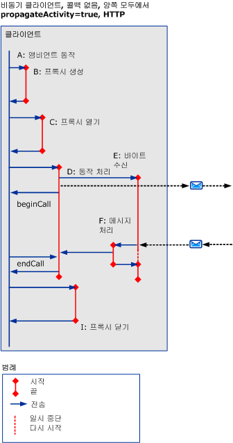
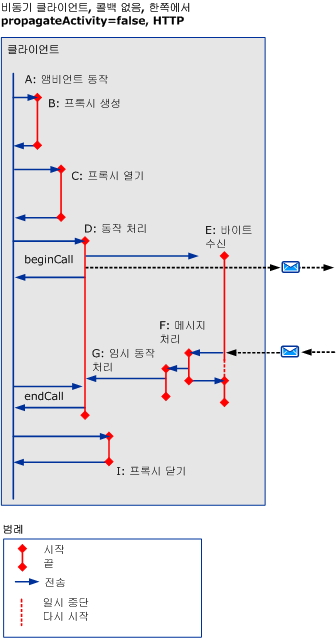
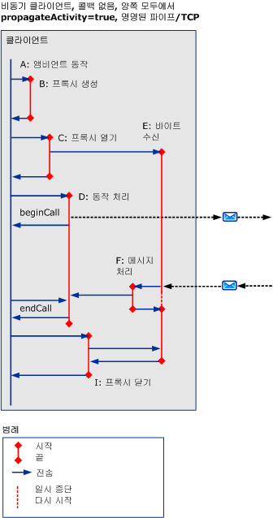
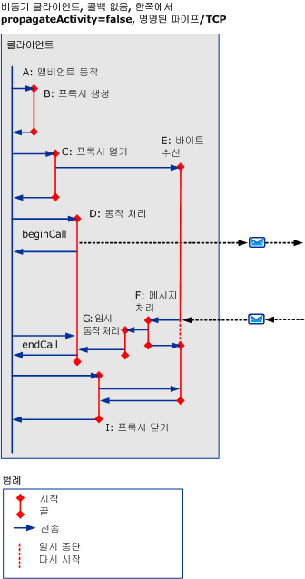
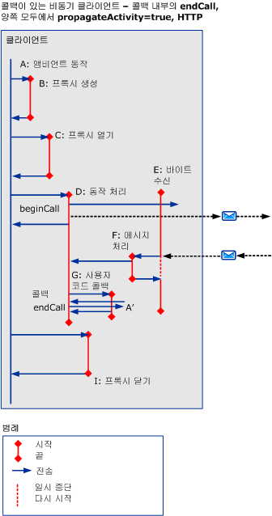
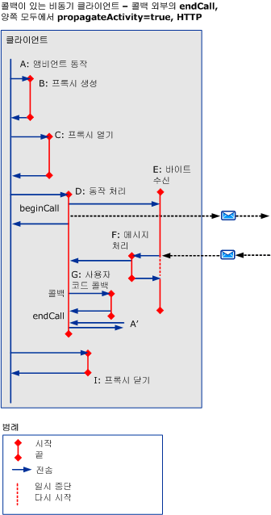
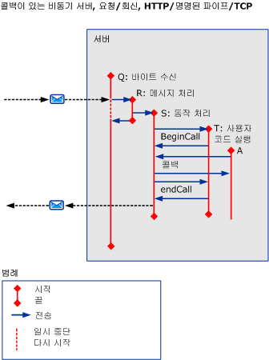

# HTTP, TCP 또는 명명된 파이프를 사용하는 비동기 시나리오
이 항목에서는 HTTP, TCP 또는 명명된 파이프를 사용하는 다중 스레드 요청이 포함된 다양한 비동기 request/reply 시나리오의 작업 및 전송에 대해 설명합니다.  
  
## 오류가 없는 비동기 Request/Reply  
 이 단원에서는 다중 스레드 클라이언트에서의 비동기 request/reply 시나리오 작업 및 전송에 대해 설명합니다.  
  
 `beginCall`이 반환되고 `endCall`이 반환되면 호출자 작업이 종료됩니다. 콜백을 호출하면 콜백이 반환됩니다.  
  
 `beginCall`이 반환되거나, `endCall`이 반환되거나, 작업에서 호출한 경우 콜백이 반환되면 호출된 작업이 종료됩니다.  
  
### 콜백이 없는 비동기 클라이언트  
  
#### 전파는 양쪽 모두에서 HTTP를 사용하여 활성화됩니다.  
   
  
 그림 1입니다. 비동기 클라이언트, 콜백이 없는 `propagateActivity` = `true` 양쪽 모두, HTTP  
  
 경우 `propagateActivity` = `true`, ProcessMessage는 전송 목표 ProcessAction 동작을 나타냅니다.  
  
 HTTP기반 시나리오의 경우 ReceiveBytes는 처음 보내는 메시지에서 호출되어 요청 수명이 끝날 때까지 존재합니다.  
  
#### HTTP를 사용하며 한쪽에서 전파가 비활성화  
 경우 `propagateActivity` = `false` 어느 쪽에 ProcessMessage을 전송 목표 ProcessAction 동작 나타내지 않습니다. 따라서 새 임시 ProcessAction 동작이 새 ID로 호출됩니다. 비동기 응답이 ServiceModel 모드에 있는 요청과 일치하는 경우 로컬 컨텍스트에서 작업 ID를 검색할 수 있습니다. 실제 ProcessAction 동작을 해당 ID와 함께 전송할 수 있습니다.  
  
   
  
 그림 2. 비동기 클라이언트, 콜백이 없는 `propagateActivity` = `false` HTTP 양쪽에  
  
 HTTP기반 시나리오의 경우 ReceiveBytes는 처음 보내는 메시지에서 호출되어 요청 수명이 끝날 때까지 존재합니다.  
  
 비동기 클라이언트는 Process Action 동작이 만들어집니다 때 `propagateActivity` = `false` 호출자 나 호출 수신자에서 및 응답 메시지는 동작 헤더가 포함 되지 않습니다.  
  
#### 전파는 양쪽 모두에서 TCP 또는 명명된 파이프를 사용하여 활성화됩니다.  
   
  
 그림 3. 비동기 클라이언트, 콜백이 없는 `propagateActivity` = `true` 양쪽 모두, 명명 된 파이프/t c P  
  
 명명된 파이프 또는 TCP 기반 시나리오에서 ReceiveBytes는 클라이언트가 열리면 호출되어 연결이 지속되는 동안 존재합니다.  
  
 그림 1과 비슷합니다 `propagateActivity` = `true`, ProcessMessage는 전송 목표 ProcessAction 동작을 나타냅니다.  
  
#### 전파는 한쪽에서 TCP 또는 명명된 파이프를 사용하여 비활성화됩니다.  
 명명된 파이프 또는 TCP 기반 시나리오에서 ReceiveBytes는 클라이언트가 열리면 호출되어 연결이 지속되는 동안 존재합니다.  
  
 그림 2와 마찬가지로 경우 `propagateActivity` = `false` 어느 쪽에 ProcessMessage을 전송 목표 ProcessAction 동작 나타내지 않습니다. 따라서 새 임시 ProcessAction 동작이 새 ID로 호출됩니다. 비동기 응답이 ServiceModel 모드에 있는 요청과 일치하는 경우 로컬 컨텍스트에서 작업 ID를 검색할 수 있습니다. 실제 ProcessAction 동작을 해당 ID와 함께 전송할 수 있습니다.  
  
   
  
 그림 4입니다. 비동기 클라이언트, 콜백이 없는 `propagateActivity` = `false` 한쪽에서 명명 된 파이프/t c P  
  
### 콜백이 있는 비동기 클라이언트  
 이 시나리오에서는 콜백과 `endCall`에 G 및 A’ 작업과 출력/입력되는 전송을 추가합니다.  
  
 이 섹션 보여 주며 HTTP를 사용 하 여 `propragateActivity` = `true`합니다. 그러나 추가 작업 및 전송에도 적용 다른 경우 (즉, `propagateActivity` = `false`, TCP 또는 명명 된 파이프를 사용 하 여).  
  
 클라이언트에서 사용자 코드를 호출하여 결과가 준비된 것을 알리면 콜백에서 새 작업(G)을 만듭니다. 그러면 사용자 코드에서 콜백 내부(그림 5) 또는 콜백 외부(그림 6)로부터 `endCall`을 호출합니다. 사용자 활동 (activity) 알려져 있지 있으므로 `endCall` 호출 되 고,이 활동 레이블이 지정 된 `A’`합니다. A’는 A와 같을 수도 있고 다를 수도 있습니다.  
  
   
  
 그림 5입니다. 콜백이 있는 비동기 클라이언트, 콜백 내부의 `endCall`  
  
   
  
 그림 6입니다. 콜백이 있는 비동기 클라이언트, 콜백 외부의 `endCall`  
  
### 콜백이 있는 비동기 서버  
   
  
 그림 7입니다. 콜백이 있는 비동기 서버  
  
 채널 스택에서는 메시지를 받으면 클라이언트를 콜백합니다. 이 처리의 추적은 ProcessRequest 작업 자체에서 내보냅니다.  
  
## 오류가 있는 Request/Reply  
 `endCall`을 수행하는 동안 오류 메시지 오류가 발생했습니다. 그 점을 제외한 작업과 전송은 이전 시나리오와 비슷합니다.  
  
## 오류가 있거나 없는 비동기 단방향  
 클라이언트에 응답이나 오류가 반환되지 않습니다.
