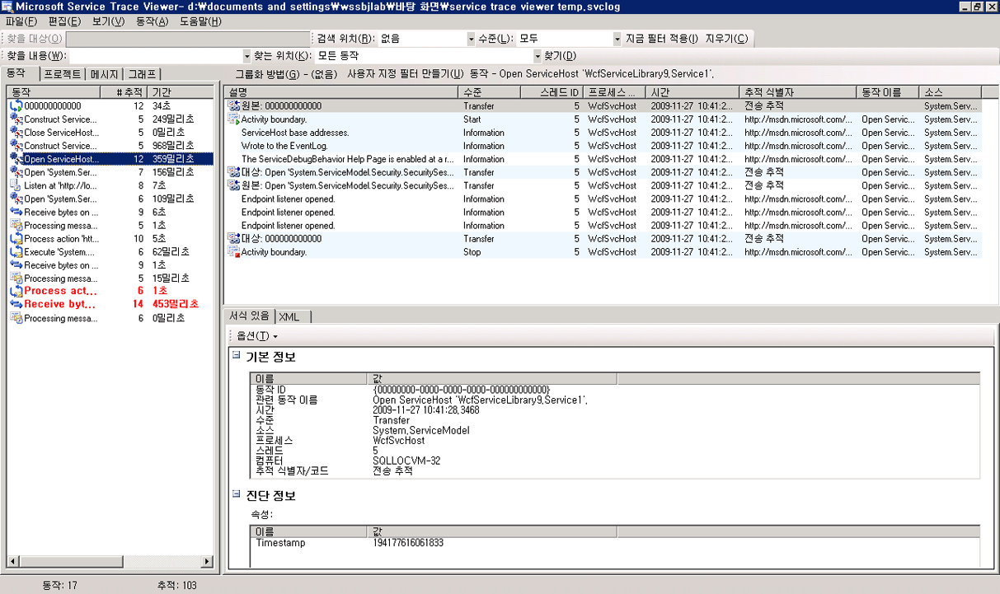
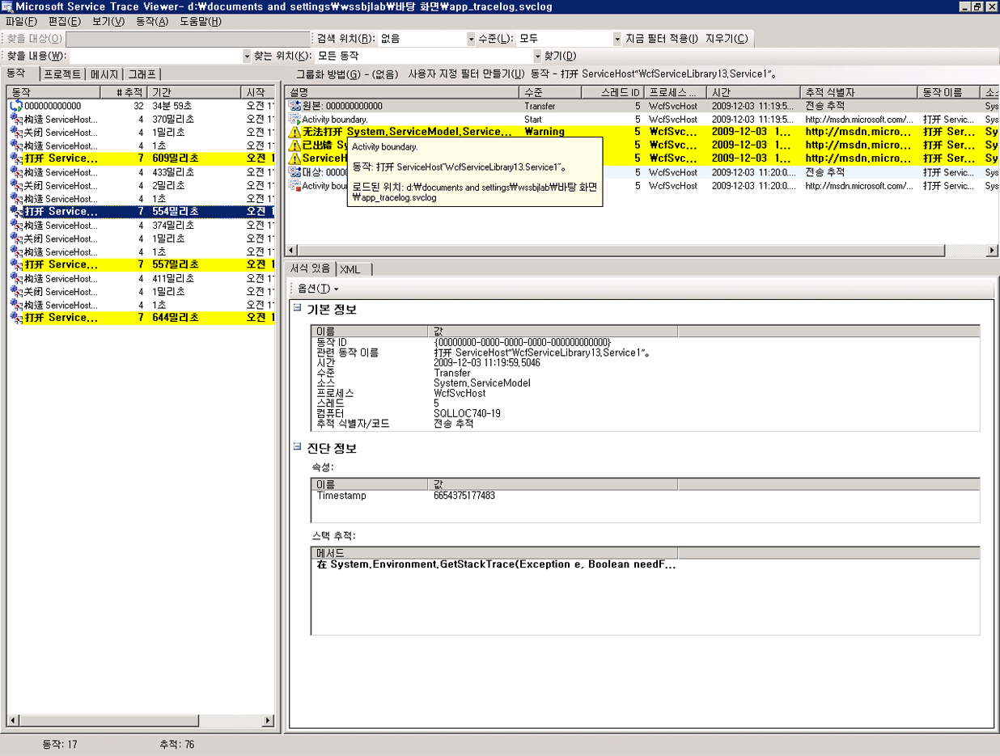
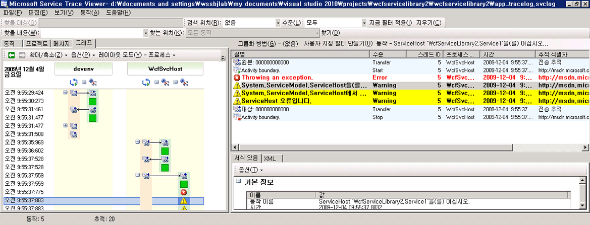

# <a name="emitting-user-code-traces"></a><span data-ttu-id="3628d-102">사용자 코드 추적 내보내기</span><span class="sxs-lookup"><span data-stu-id="3628d-102">Emitting User-Code Traces</span></span>
<span data-ttu-id="3628d-103">구성에서 추적을 활성화하여 [!INCLUDE[indigo1](../../../../../includes/indigo1-md.md)]에서 생성되는 계측 데이터를 수집하는 외에도 사용자 코드에서 프로그래밍 방식으로 추적할 수도 있습니다.</span><span class="sxs-lookup"><span data-stu-id="3628d-103">In addition to enabling tracing in configuration to collect instrumentation data generated by [!INCLUDE[indigo1](../../../../../includes/indigo1-md.md)], you can also emit traces programmatically in user code.</span></span> <span data-ttu-id="3628d-104">이런 방식으로 계측 데이터를 사전에 작성하여 나중에 진단을 위해 확인할 수 있습니다.</span><span class="sxs-lookup"><span data-stu-id="3628d-104">In this way, you can proactively create instrumentation data that you can peruse later for diagnostic purpose.</span></span> <span data-ttu-id="3628d-105">이 항목에서는 이 작업을 수행하는 방법에 대해 설명합니다.</span><span class="sxs-lookup"><span data-stu-id="3628d-105">This topic discusses how you can do this.</span></span>  
  
 <span data-ttu-id="3628d-106">또한는 [추적 확장](../../../../../docs/framework/wcf/samples/extending-tracing.md) 다음 섹션에 소개 하는 모든 코드 샘플에 포함 되어 있습니다.</span><span class="sxs-lookup"><span data-stu-id="3628d-106">In addition, the [Extending Tracing](../../../../../docs/framework/wcf/samples/extending-tracing.md) sample includes all the code demonstrated in the following sections.</span></span>  
  
## <a name="creating-a-trace-source"></a><span data-ttu-id="3628d-107">추적 소스 만들기</span><span class="sxs-lookup"><span data-stu-id="3628d-107">Creating a Trace Source</span></span>  
 <span data-ttu-id="3628d-108">다음 코드를 사용하여 사용자 추적 소스를 만들 수 있습니다.</span><span class="sxs-lookup"><span data-stu-id="3628d-108">You can use the following code to create a user trace source.</span></span>  
  
```  
TraceSource ts = new TraceSource("myUserTraceSource");  
```  
  
## <a name="creating-activities"></a><span data-ttu-id="3628d-109">동작 만들기</span><span class="sxs-lookup"><span data-stu-id="3628d-109">Creating Activities</span></span>  
 <span data-ttu-id="3628d-110">동작은 처리의 논리 단위입니다.</span><span class="sxs-lookup"><span data-stu-id="3628d-110">Activities are logical unit of processing.</span></span> <span data-ttu-id="3628d-111">추적을 그룹화할 주 처리 단위별로 하나의 동작을 만들 수 있습니다.</span><span class="sxs-lookup"><span data-stu-id="3628d-111">You can create one activity for each major processing unit in which you want traces to be grouped together.</span></span> <span data-ttu-id="3628d-112">예를 들어, 서비스 요청별로 하나의 동작을 만들 수 있습니다.</span><span class="sxs-lookup"><span data-stu-id="3628d-112">For example, you can create one activity for each request to the service.</span></span> <span data-ttu-id="3628d-113">그렇게 하려면 다음 단계를 수행합니다.</span><span class="sxs-lookup"><span data-stu-id="3628d-113">To do so, perform the following steps.</span></span>  
  
1.  <span data-ttu-id="3628d-114">범위 내의 동작 ID를 저장합니다.</span><span class="sxs-lookup"><span data-stu-id="3628d-114">Save the activity ID in scope.</span></span>  
  
2.  <span data-ttu-id="3628d-115">새 동작 ID를 만듭니다.</span><span class="sxs-lookup"><span data-stu-id="3628d-115">Create a new activity ID.</span></span>  
  
3.  <span data-ttu-id="3628d-116">범위 내의 동작을 새 동작으로 전송하고, 범위 내의 새 동작을 설정한 다음 해당 동작에 대한 Start 추적을 내보냅니다.</span><span class="sxs-lookup"><span data-stu-id="3628d-116">Transfer from the activity in scope to the new one, set the new activity in scope and emit a start trace for that activity.</span></span>  
  
 <span data-ttu-id="3628d-117">다음 코드에서는 이 작업을 수행하는 방법에 대해 설명합니다.</span><span class="sxs-lookup"><span data-stu-id="3628d-117">The following code demonstrates how to do this.</span></span>  
  
```  
Guid oldID = Trace.CorrelationManager.ActivityId;  
Guid traceID = Guid.NewGuid();  
ts.TraceTransfer(0, "transfer", traceID);  
Trace.CorrelationManager.ActivityId = traceID; // Trace is static  
ts.TraceEvent(TraceEventType.Start, 0, "Add request");  
```  
  
## <a name="emitting-traces-within-a-user-activity"></a><span data-ttu-id="3628d-118">사용자 동작에서 추적 내보내기</span><span class="sxs-lookup"><span data-stu-id="3628d-118">Emitting Traces within a User Activity</span></span>  
 <span data-ttu-id="3628d-119">다음 코드는 사용자 동작에서 추적을 내보냅니다.</span><span class="sxs-lookup"><span data-stu-id="3628d-119">The following code emits traces within a user activity.</span></span>  
  
```  
double value1 = 100.00D;  
double value2 = 15.99D;  
ts.TraceInformation("Client sends message to Add " + value1 + ", " + value2);  
double result = client.Add(value1, value2);  
ts.TraceInformation("Client receives Add response '" + result + "'");  
```  
  
## <a name="stopping-the-activities"></a><span data-ttu-id="3628d-120">동작 중지</span><span class="sxs-lookup"><span data-stu-id="3628d-120">Stopping the Activities</span></span>  
 <span data-ttu-id="3628d-121">동작을 중지하려면 이전 동작으로 다시 전송하고, 현재 동작 ID를 중지한 다음 범위 내의 이전 동작 ID를 다시 설정합니다.</span><span class="sxs-lookup"><span data-stu-id="3628d-121">To stop the activities, transfer back to the old activity, stop the current activity id, and reset the old activity id in scope.</span></span>  
  
 <span data-ttu-id="3628d-122">다음 코드에서는 이 작업을 수행하는 방법에 대해 설명합니다.</span><span class="sxs-lookup"><span data-stu-id="3628d-122">The following code demonstrates how to do this.</span></span>  
  
```  
ts.TraceTransfer(0, "transfer", oldID);  
ts.TraceEvent(TraceEventType.Stop, 0, "Add request");  
Trace.CorrelationManager.ActivityId = oldID;  
```  
  
## <a name="propagating-the-activity-id-to-a-service"></a><span data-ttu-id="3628d-123">서비스에 동작 ID 전파</span><span class="sxs-lookup"><span data-stu-id="3628d-123">Propagating the Activity ID to A Service</span></span>  
 <span data-ttu-id="3628d-124">클라이언트와 서비스 구성 파일 모두에서 `propagateActivity` 추적 소스에 대해 `true` 특성을 `System.ServiceModel`로 설정하면 클라이언트에 정의된 것과 동일한 동작에서 추가 요청에 대한 서비스 처리가 발생합니다.</span><span class="sxs-lookup"><span data-stu-id="3628d-124">If you set the `propagateActivity` attribute to `true` for the `System.ServiceModel` trace source in both the client and service configuration files, the service processing for the Add request occurs in the same activity as the one defined in the client.</span></span> <span data-ttu-id="3628d-125">서비스에서 자체 동작과 전송을 정의하는 경우 클라이언트가 전파한 동작에는 서비스 추적이 표시되지 않습니다.</span><span class="sxs-lookup"><span data-stu-id="3628d-125">If the service defines its own activities and transfers, the service traces do not appear in the client-propagated activity.</span></span> <span data-ttu-id="3628d-126">대신 클라이언트가 해당 ID를 전파한 동작의 Transfer 추적에 의해 연결된 동작에 서비스 추적이 표시됩니다.</span><span class="sxs-lookup"><span data-stu-id="3628d-126">Instead, they appear in an activity correlated by transfer traces to the activity whose ID is propagated by the client.</span></span>  
  
> [!NOTE]
>  <span data-ttu-id="3628d-127">클라이언트와 서비스 모두에서 `propagateActivity` 특성이 `true`로 설정되어 있는 경우 서비스 작업 범위 내의 앰비언트 동작이 [!INCLUDE[indigo2](../../../../../includes/indigo2-md.md)]에 의해 설정됩니다.</span><span class="sxs-lookup"><span data-stu-id="3628d-127">If the `propagateActivity` attribute is set to `true` on both the client and service, the ambient activity in the operation scope of the service is set by [!INCLUDE[indigo2](../../../../../includes/indigo2-md.md)].</span></span>  
  
 <span data-ttu-id="3628d-128">다음 코드를 사용하여 [!INCLUDE[indigo2](../../../../../includes/indigo2-md.md)]에 의해 범위 내의 동작이 설정되었는지 여부를 확인할 수 있습니다.</span><span class="sxs-lookup"><span data-stu-id="3628d-128">You can use the following code to check whether an activity was set in scope by [!INCLUDE[indigo2](../../../../../includes/indigo2-md.md)].</span></span>  
  
```  
// Check if an activity was set in scope by WCF, if it was   
// propagated from the client. If not, ( ambient activity is   
// equal to Guid.Empty), create a new one.  
if(Trace.CorrelationManager.ActivityId == Guid.Empty)  
{  
    Guid newGuid = Guid.NewGuid();  
    Trace.CorrelationManager.ActivityId = newGuid;  
}  
// Emit your Start trace.  
ts.TraceEvent(TraceEventType.Start, 0, "Add Activity");  
  
// Emit the processing traces for that request.  
serviceTs.TraceInformation("Service receives Add "   
                            + n1 + ", " + n2);  
// double result = n1 + n2;  
serviceTs.TraceInformation("Service sends Add result" + result);  
  
// Emit the Stop trace and exit the method scope.  
ts.TraceEvent(TraceEventType.Stop, 0, "Add Activity");  
// return result;  
```  
  
## <a name="tracing-exceptions-thrown-in-code"></a><span data-ttu-id="3628d-129">코드에서 Throw된 예외 추적</span><span class="sxs-lookup"><span data-stu-id="3628d-129">Tracing Exceptions Thrown in Code</span></span>  
 <span data-ttu-id="3628d-130">코드에서 예외를 throw한 경우 다음 코드를 사용하여 경고 수준 이상으로 예외를 추적할 수도 있습니다.</span><span class="sxs-lookup"><span data-stu-id="3628d-130">When you throw an exception in code, you can also trace the exception at Warning level or up using the following code.</span></span>  
  
```  
ts.TraceEvent(TraceEventType.Warning, 0, "Throwing exception " + "exceptionMessage");  
```  
  
## <a name="viewing-user-traces-in-the-service-trace-viewer-tool"></a><span data-ttu-id="3628d-131">서비스 추적 뷰어 도구에서 사용자 추적 보기</span><span class="sxs-lookup"><span data-stu-id="3628d-131">Viewing User Traces in the Service Trace Viewer Tool</span></span>  
 <span data-ttu-id="3628d-132">이 섹션에서는 실행 하 여 생성 된 추적의 스크린 샷을 [추적 확장](../../../../../docs/framework/wcf/samples/extending-tracing.md) 샘플을 사용 하 여 볼 때는 [Service Trace Viewer 도구 (SvcTraceViewer.exe)](../../../../../docs/framework/wcf/service-trace-viewer-tool-svctraceviewer-exe.md)합니다.</span><span class="sxs-lookup"><span data-stu-id="3628d-132">This section contains screenshots of traces generated by running the [Extending Tracing](../../../../../docs/framework/wcf/samples/extending-tracing.md) sample, when viewed using the [Service Trace Viewer Tool (SvcTraceViewer.exe)](../../../../../docs/framework/wcf/service-trace-viewer-tool-svctraceviewer-exe.md).</span></span>  
  
 <span data-ttu-id="3628d-133">다음 다이어그램에서는 이전에 만든 "추가 요청" 동작 왼쪽된 패널에서 선택 되어 있습니다.</span><span class="sxs-lookup"><span data-stu-id="3628d-133">In the following diagram, the "Add request" activity created previously is selected on the left panel.</span></span> <span data-ttu-id="3628d-134">응용 프로그램 클라이언트 프로그램을 구성하는 세 개의 수학 연산 동작(나누기, 빼기, 곱하기)으로 나열됩니다.</span><span class="sxs-lookup"><span data-stu-id="3628d-134">It is listed with three other Math operation activities (Divide, Subtract, Multiply) that constitute the application client program.</span></span> <span data-ttu-id="3628d-135">다른 요청에서 발생할 수 있는 잠재적 오류를 격리시키기 위해 사용자 코드에서 작업별로 하나의 새로운 동작을 정의했습니다.</span><span class="sxs-lookup"><span data-stu-id="3628d-135">The user code has defined one new activity for each operation to isolate potential error occurrences in different requests.</span></span>  
  
 <span data-ttu-id="3628d-136">전송에서의 사용 방법을 설명 하기는 [추적 확장](../../../../../docs/framework/wcf/samples/extending-tracing.md) 샘플에서는 4 개의 작업 요청을 캡슐화 하는 계산기 동작과 만들어집니다.</span><span class="sxs-lookup"><span data-stu-id="3628d-136">To demonstrate the use of transfers in the [Extending Tracing](../../../../../docs/framework/wcf/samples/extending-tracing.md) sample, a Calculator activity that encapsulates the four operation requests is also created.</span></span> <span data-ttu-id="3628d-137">각 요청에는 계산기 동작과 요청 동작 사이에 주고 받는 전송이 있습니다. 추적은 그림의 오른쪽 위 패널에 강조 표시되어 있습니다.</span><span class="sxs-lookup"><span data-stu-id="3628d-137">For each request, there is a transfer back and forth from the Calculator activity to the request activity (trace is highlighted in the upper right panel in the figure).</span></span>  
  
 <span data-ttu-id="3628d-138">왼쪽 패널에서 동작을 선택하면 이 동작에 포함된 추적이 오른쪽 위 패널에 표시됩니다.</span><span class="sxs-lookup"><span data-stu-id="3628d-138">When you select an activity on the left panel, the traces included by this activity are shown on the upper right panel.</span></span> <span data-ttu-id="3628d-139">경우 `propagateActivity` 은 `true` 요청 경로에 모든 끝점에 요청에 참여 하는 모든 프로세스에서 요청 동작에서 추적 됩니다.</span><span class="sxs-lookup"><span data-stu-id="3628d-139">If `propagateActivity` is `true` at every endpoint in the request path, traces in the request activity are from all processes that participate in the request.</span></span> <span data-ttu-id="3628d-140">이 예제에서는 패널의 네 번째 열에서 클라이언트와 서비스 모두의 추적을 확인할 수 있습니다.</span><span class="sxs-lookup"><span data-stu-id="3628d-140">In this example, you can see traces from both the client and service in the 4th column in the panel.</span></span>  
  
 <span data-ttu-id="3628d-141">이 동작의 처리 순서는 다음과 같습니다.</span><span class="sxs-lookup"><span data-stu-id="3628d-141">This activity shows the following order of processing:</span></span>  
  
1.  <span data-ttu-id="3628d-142">클라이언트가 추가할 메시지를 보냅니다.</span><span class="sxs-lookup"><span data-stu-id="3628d-142">Client sends message to Add.</span></span>  
  
2.  <span data-ttu-id="3628d-143">서비스가 추가 요청 메시지를 받습니다.</span><span class="sxs-lookup"><span data-stu-id="3628d-143">Service receives Add request message.</span></span>  
  
3.  <span data-ttu-id="3628d-144">서비스가 추가 응답을 보냅니다.</span><span class="sxs-lookup"><span data-stu-id="3628d-144">Service sends Add response.</span></span>  
  
4.  <span data-ttu-id="3628d-145">클라이언트가 추가 응답을 받습니다.</span><span class="sxs-lookup"><span data-stu-id="3628d-145">Client receives Add response.</span></span>  
  
 <span data-ttu-id="3628d-146">이러한 모든 추적을 정보 수준에서 내보냅니다.</span><span class="sxs-lookup"><span data-stu-id="3628d-146">All these traces were emitted at Information level.</span></span> <span data-ttu-id="3628d-147">오른쪽 위 패널에서 추적을 클릭하면 해당 추적에 대한 자세한 내용이 오른쪽 아래 패널에 표시됩니다.</span><span class="sxs-lookup"><span data-stu-id="3628d-147">Clicking a trace in the upper-right panel shows the details of that trace in the lower-right panel.</span></span>  
  
 <span data-ttu-id="3628d-148">다음 다이어그램에서는 계산기 동작에서 보내거나 받은 Transfer 추적을 표시하고 요청 동작별로 두 개의 Start 및 Stop 추적 쌍을 표시합니다. 이 추적 쌍은 클라이언트와 서비스별로 각각 하나씩(추적 소스별로 하나) 표시됩니다.</span><span class="sxs-lookup"><span data-stu-id="3628d-148">In the following diagram, we also see transfer traces from and to the Calculator activity, as well as two pairs of Start and Stop traces per request activity, one for the client and one for the service (one for each trace source).</span></span>  
  
 <span data-ttu-id="3628d-149"></span><span class="sxs-lookup"><span data-stu-id="3628d-149"></span></span>  
<span data-ttu-id="3628d-150">생성 시간별 동작 목록(왼쪽 패널) 및 중첩된 동작 목록(오른쪽 위 패널)</span><span class="sxs-lookup"><span data-stu-id="3628d-150">List of activities by creation time (left panel) and their nested activities (upper-right panel)</span></span>  
  
 <span data-ttu-id="3628d-151">서비스 코드가 예외를 throw하여 클라이언트에서도 예외가 throw되면(예: 클라이언트가 요청에 대한 응답을 가져오지 않은 경우), 서비스 및 클라이언트 경고 또는 오류 메시지가 직접 상관 관계에 대해 동일한 동작에서 표시됩니다.</span><span class="sxs-lookup"><span data-stu-id="3628d-151">If the service code throws an exception that causes the client to throw as well (for example, when the client did not get the response to its request), both the service and client warning or error messages occur in the same activity for direct correlation.</span></span> <span data-ttu-id="3628d-152">다음 다이어그램에는 서비스 "서비스는 사용자 코드에서이 요청을 처리 하지는 않습니다."를 나타내는 예외를 throw</span><span class="sxs-lookup"><span data-stu-id="3628d-152">In the following diagram, the service throws an exception that states "The service refuses to process this request in user code."</span></span> <span data-ttu-id="3628d-153">클라이언트 "는 서버 내부 오류로 인해 요청을 처리할 수 없습니다."를 나타내는 예외를 throw</span><span class="sxs-lookup"><span data-stu-id="3628d-153">The client also throws an exception that states "The server was unable to process the request due to an internal error."</span></span>  
  
 <span data-ttu-id="3628d-154"></span><span class="sxs-lookup"><span data-stu-id="3628d-154"></span></span>  
<span data-ttu-id="3628d-155">지정된 요청에 대한 끝점에서의 오류는 요청 동작 ID가 전파된 경우와 동일한 동작에 표시됩니다.</span><span class="sxs-lookup"><span data-stu-id="3628d-155">Errors across endpoints for a given request appear in the same activity if the request activity id was propagated</span></span>  
  
 <span data-ttu-id="3628d-156">왼쪽 패널에서 곱하기 동작을 두 번 클릭하면 다음과 같은 그래프가 표시되고 포함된 프로세스별로 곱하기 동작에 대한 추적 사항이 나타납니다.</span><span class="sxs-lookup"><span data-stu-id="3628d-156">Double-clicking the Multiply activity on the left panel shows the following graph, with the traces for the Multiply activity for each process involved.</span></span> <span data-ttu-id="3628d-157">서비스에서 처음 발생한 경고(throw된 예외)와 요청을 처리하지 못하여 클라이언트에서 발생한 경고 및 오류가 표시됩니다.</span><span class="sxs-lookup"><span data-stu-id="3628d-157">We can see a warning first occurred at the service (exception thrown), which is followed by warnings and errors on the client because the request could not be processed.</span></span> <span data-ttu-id="3628d-158">따라서 끝점 사이의 오류의 인과 관계를 유추하여 오류의 근본 원인을 파악할 수 있습니다.</span><span class="sxs-lookup"><span data-stu-id="3628d-158">Therefore, we can imply the causal error relationship between endpoints and derive the root cause of the error.</span></span>  
  
 <span data-ttu-id="3628d-159"></span><span class="sxs-lookup"><span data-stu-id="3628d-159"></span></span>  
<span data-ttu-id="3628d-160">오류 상관 관계 그래프 보기</span><span class="sxs-lookup"><span data-stu-id="3628d-160">Graph view of error correlation</span></span>  
  
 <span data-ttu-id="3628d-161">이전 추적을 가져오려면 사용자 추적 소스에 대해 `ActivityTracing`을 설정하고 `propagateActivity=true` 추적 소스에 대해 `System.ServiceModel`로 설정합니다.</span><span class="sxs-lookup"><span data-stu-id="3628d-161">To obtain the previous traces, we set `ActivityTracing` for the user trace sources and `propagateActivity=true` for the `System.ServiceModel` trace source.</span></span> <span data-ttu-id="3628d-162">사용자 코드 동작 전파에 사용자 코드를 활성화하기 위해 `ActivityTracing` 추적 소스에 대해서는 `System.ServiceModel`을 설정하지 않았습니다.</span><span class="sxs-lookup"><span data-stu-id="3628d-162">We did not set `ActivityTracing` for the `System.ServiceModel` trace source to enable user code to user code activity propagation.</span></span> <span data-ttu-id="3628d-163">ServiceModel 동작 추적이 설정되어 있으면 클라이언트에 정의된 동작 ID가 서비스 사용자 코드에 끝까지 전파되지 않지만, 전송은 클라이언트 및 서비스 사용자 코드 동작을 중간 [!INCLUDE[indigo2](../../../../../includes/indigo2-md.md)] 동작에 연결합니다.</span><span class="sxs-lookup"><span data-stu-id="3628d-163">(When ServiceModel activity tracing is on, the activity ID defined in the client is not propagated all the way to the service user code; Transfers, however, correlate the client and service user code activities to the intermediate [!INCLUDE[indigo2](../../../../../includes/indigo2-md.md)] activities.)</span></span>  
  
 <span data-ttu-id="3628d-164">동작을 정의하고 동작 ID를 전파하면 끝점을 통해 오류 상관 관계를 직접 수행할 수 있습니다.</span><span class="sxs-lookup"><span data-stu-id="3628d-164">Defining activities and propagating the activity ID enables us to perform direct error correlation across endpoints.</span></span> <span data-ttu-id="3628d-165">그러면 오류에 대한 근본 원인을 신속하게 찾을 수 있습니다.</span><span class="sxs-lookup"><span data-stu-id="3628d-165">In this way, we can locate the root cause of an error more quickly.</span></span>  
  
## <a name="see-also"></a><span data-ttu-id="3628d-166">참고 항목</span><span class="sxs-lookup"><span data-stu-id="3628d-166">See Also</span></span>  
 [<span data-ttu-id="3628d-167">추적 확장</span><span class="sxs-lookup"><span data-stu-id="3628d-167">Extending Tracing</span></span>](../../../../../docs/framework/wcf/samples/extending-tracing.md)
