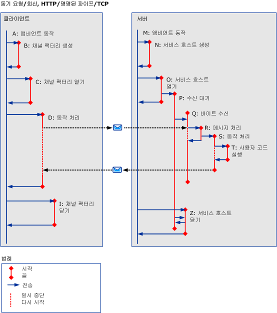

# HTTP, TCP 또는 명명된 파이프를 사용하는 동기 시나리오Synchronous Scenarios using HTTP, TCP or Named-Pipe
이 항목에서는 HTTP, TCP 또는 명명된 파이프를 사용하는 단일 스레드 클라이언트가 포함된 다양한 동기 요청/회신 시나리오의 작업 및 전송에 대해 설명합니다.This topic describes the activities and transfers for different synchronous request/reply scenarios, with a single-threaded client, using HTTP, TCP or named pipe. 참조 [HTTP, TCP 또는 명명 된 파이프를 사용 하는 비동기 시나리오](../../../../../docs/framework/wcf/diagnostics/tracing/asynchronous-scenarios-using-http-tcp-or-named-pipe.md) 다중 스레드 요청에 대 한 자세한 내용은 합니다.See [Asynchronous Scenarios using HTTP, TCP, or Named-Pipe](../../../../../docs/framework/wcf/diagnostics/tracing/asynchronous-scenarios-using-http-tcp-or-named-pipe.md) for more information on multi-threaded requests.  
  
## 오류가 없는 동기 요청/회신Synchronous Request/Reply without Errors  
 이 단원에서는 단일 스레드 클라이언트에서의 유효한 동기 요청/회신 시나리오 작업 및 전송에 대해 설명합니다.This section describes the activities and transfers for a valid synchronous request/reply scenario, with single-threaded client.  
  
### 클라이언트Client  
  
#### 서비스 끝점과의 통신 설정Establishing Communication with Service Endpoint  
 클라이언트가 구성되고 열립니다.A client is constructed and opened. 각이 단계에 대 한 앰비언트 동작 (A) 전송 되는 "Construct Client" (B)과 "Open Client" 동작 (C)를 각각.For each of these steps, the ambient activity (A) is transferred to a "Construct Client" (B) and "Open Client" (C) activity respectively. 전송 중인 각 동작에서 앰비언트 동작은 다시 전송될 때까지, 즉 ServiceModel 코드가 실행될 때까지 일시 중단됩니다.For each activity being transferred to, the ambient activity is suspended until there is a transfer back, that is, until ServiceModel code is executed.  
  
#### 서비스 끝점에 요청하기Making a Request to Service Endpoint  
 앰비언트 동작 (D), "ProcessAction" 동작으로 전송 됩니다.The ambient activity is transferred to a "ProcessAction" (D) activity. 이 동작 내에서 요청 메시지가 전송되고 응답 메시지가 수신됩니다.Within this activity, a request message is sent, and a response message is received. 이 동작은 컨트롤이 사용자 코드로 반환되면 종료됩니다.The activity ends when control returns to user code. 이것은 동기 요청이므로 컨트롤이 반환될 때까지 앰비언트 동작이 일시 중단됩니다.Because this is a synchronous request, the ambient activity suspends until control returns.  
  
#### 서비스 끝점과의 통신 닫기Closing Communication with Service Endpoint  
 클라이언트의 닫기 동작(I)은 앰비언트 동작에서 만들어집니다.The client's close activity (I) is created from the ambient activity. 이 동작은 새로 만들기 및 열기와 동일합니다.This is identical to new and open.  
  
### 서버Server  
  
#### 서비스 호스트 설정Setting up a Service Host  
 ServiceHost의 새로 만들기 및 열기 동작(N 및 O)은 앰비언트 동작(M)에서 만들어집니다.The ServiceHost’s new and open activities (N and O) are created from the ambient activity (M).  
  
 수신기 동작(P)은 각 수신기의 ServiceHost를 열면 만들어집니다.A listener activity (P) is created from opening a ServiceHost for each listener. 수신기 동작은 데이터를 받고 처리할 때까지 기다립니다.The listener activity waits to receive and process data.  
  
#### 통신 중에 데이터 받기Receiving Data on the Wire  
 데이터 통신 중에 도착 하면 (Q) 받은 데이터를 처리할 수 없는 경우 "ReceiveBytes" 동작이 만들어집니다.When data arrives on the wire, a "ReceiveBytes" activity is created if it does not already exist (Q) to process the received data. 이 동작은 연결 또는 큐 내의 여러 메시지에 다시 사용할 수 있습니다.This activity can be reused for multiple messages within a connection or queue.  
  
 ReceiveBytes 동작은 SOAP 동작 메시지를 구성할 데이터가 충분하면 ProcessMessage 동작(R)을 시작합니다.The ReceiveBytes activity launches a ProcessMessage activity (R) if it has enough data to form a SOAP action message.  
  
 동작 R에서 메시지 헤더가 처리되고 activityID 헤더가 확인됩니다.In activity R, the message headers are processed, and the activityID header is verified. 이 헤더가 있는 경우 동작 ID는 ProcessAction 동작으로 설정되고 그렇지 않으면, 새 ID가 만들어집니다.If this header is present, the activity ID is set to the ProcessAction activity; otherwise, a new ID is created.  
  
 ProcessAction 동작(S)이 만들어지고 호출이 처리되면 전송됩니다.ProcessAction activity (S) is created and being transferred to, when the call is processed. 이 동작은 사용자 코드(T) 실행 및 가능한 경우 응답 메시지 보내기를 비롯하여 들어오는 메시지와 관련된 모든 처리가 완료되면 종료됩니다.This activity ends when all processing related to the incoming message is completed, including executing user code (T) and sending the response message if applicable.  
  
#### 서비스 호스트 닫기Closing a Service Host  
 ServiceHost의 닫기 동작(Z)은 앰비언트 동작에서 만들어집니다.The ServiceHost’s close activity (Z) is created from the ambient activity.  
  
   
  
 \<a: 이름 >, `A` 는 이전 텍스트 및 표 3 활동에 설명 하는 바로 가기 기호입니다.In \<A: name>, `A` is a shortcut symbol that describes the activity in the previous text and in table 3. `Name`은 동작의 약식 이름입니다.`Name` is a shortened name of the activity.  
  
 경우 `propagateActivity` = `true`, 클라이언트와 서비스 모두에서 Process Action 동일한 동작 ID를 갖습니다.If `propagateActivity`=`true`, Process Action on both the client and service have the same activity ID.  
  
## 오류가 있는 동기 요청/회신Synchronous Request/Reply with Errors  
 이전 시나리오와 유일하게 다른 점은 SOAP 오류 메시지가 응답 메시지로 반환된다는 것입니다.The only difference with the previous scenario is that a SOAP fault message is returned as a response message. 경우 `propagateActivity` = `true`, 요청 메시지의 동작 ID는 SOAP 오류 메시지에 추가 됩니다.If `propagateActivity`=`true`, the activity ID of the request message is added to the SOAP fault message.  
  
## 오류가 없는 동기 단방향Synchronous One-Way without Errors  
 첫 번째 시나리오와 유일하게 다른 점은 메시지가 서버로 반환되지 않는다는 것입니다.The only difference with the first scenario is that no message is returned to the server. HTTP 기반 프로토콜의 경우 상태(유효 또는 오류)가 클라이언트로 반환됩니다.For HTTP-based protocols, a status (valid or error) is still returned to the client. HTTP가 [!INCLUDE[indigo2](../../../../../includes/indigo2-md.md)] 프로토콜 스택의 일부인 요청 응답 의미 체계가 있는 유일한 프로토콜이기 때문입니다.This is because HTTP is the only protocol with a request-response semantics that is part of the [!INCLUDE[indigo2](../../../../../includes/indigo2-md.md)] protocol stack. TCP 처리는 [!INCLUDE[indigo2](../../../../../includes/indigo2-md.md)]에서 표시되지 않으므로 클라이언트에게 확인 메시지가 발송되지 않습니다.Because TCP processing is hidden from [!INCLUDE[indigo2](../../../../../includes/indigo2-md.md)], no acknowledgement is sent to the client.  
  
## 오류가 있는 동기 단방향Synchronous One-Way with Errors  
 메시지(Q 이상)를 처리하는 동안 오류가 발생하는 경우 클라이언트에게 확인 메시지가 반환되지 않습니다.If an error occurs while processing the message (Q or beyond), no notification is returned to the client. 이 시나리오는 "오류가 없는 동기 단방향" 시나리오와 동일합니다.This is identical to the "Synchronous One-Way without Errors" scenario. 오류 메시지를 받으려면 단방향 시나리오를 사용하지 마십시오.You should not use a One-Way scenario if you want to receive an error message.  
  
## 이중Duplex  
 이전 시나리오와 다른 점은 클라이언트가 서비스 역할을 한다는 것입니다. 여기서는 비동기 시나리오와 비슷한 ReceiveBytes 및 ProcessMessage 동작을 만듭니다.The difference with the previous scenarios is that the client acts as a service, in which it creates the ReceiveBytes and ProcessMessage activities, similar to the Asynchronous scenarios.
