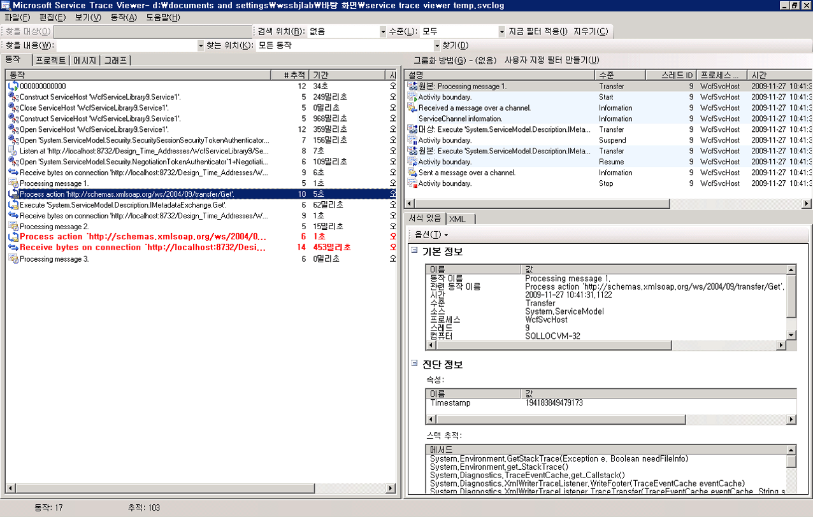
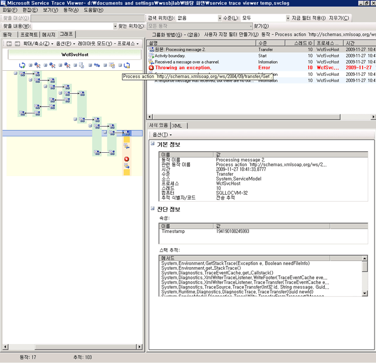
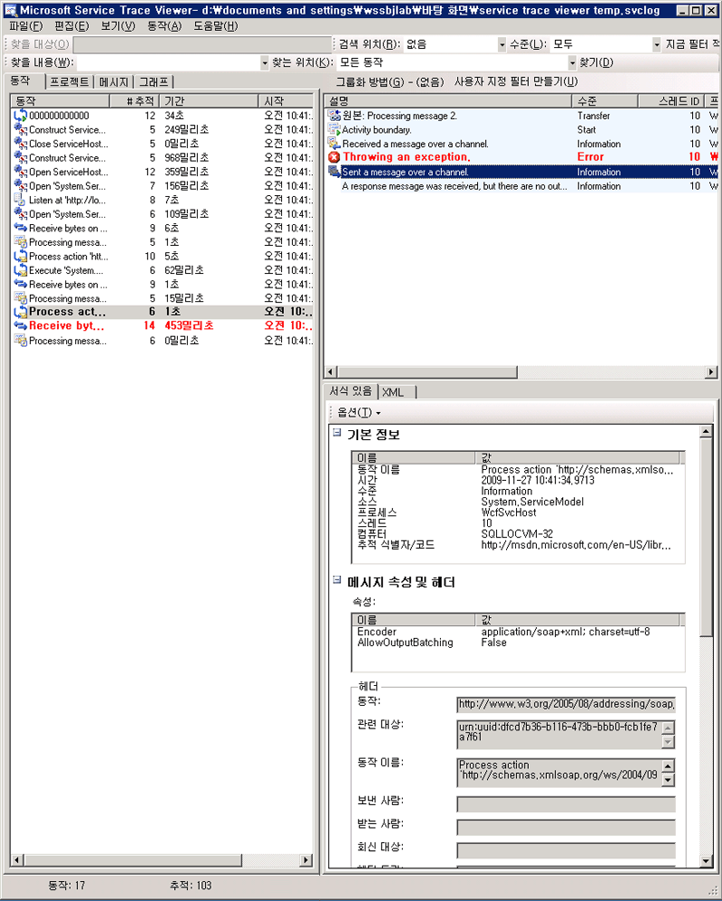
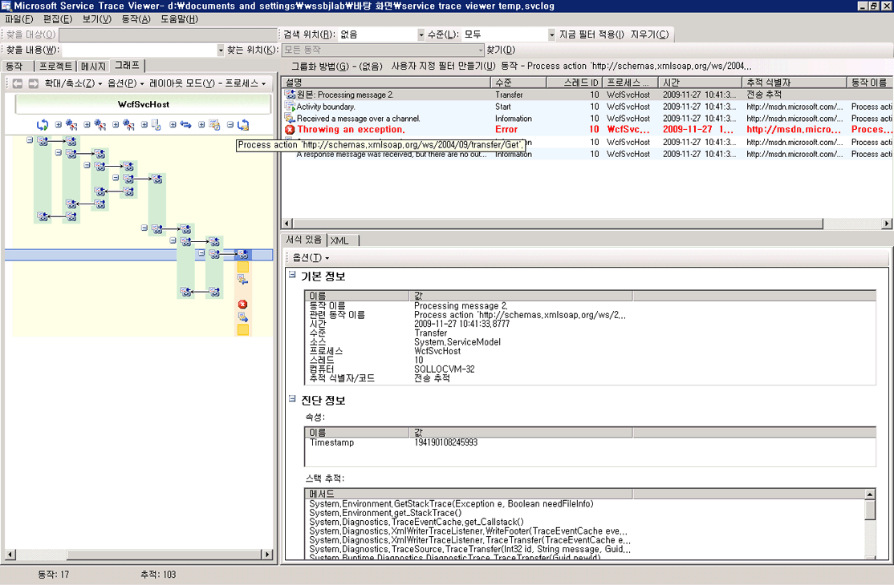
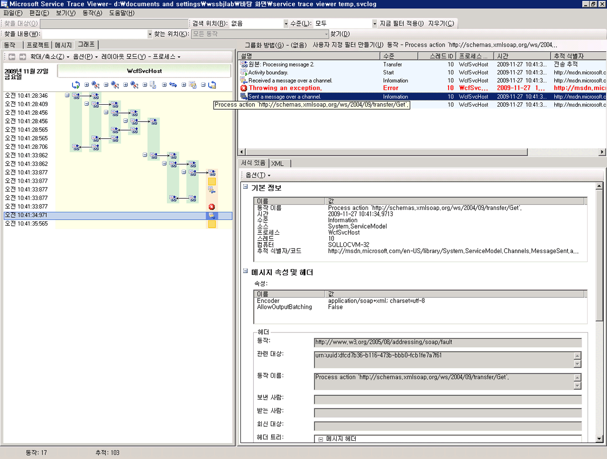
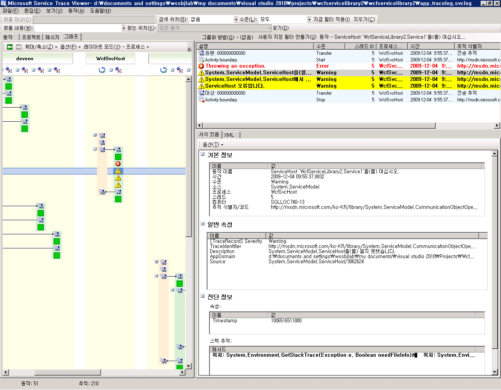
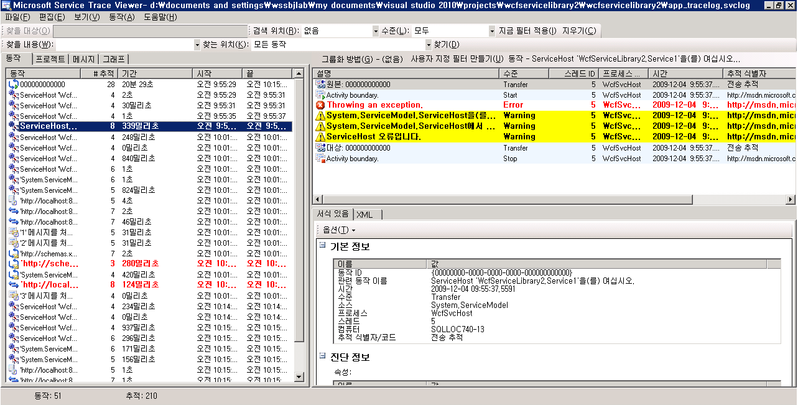
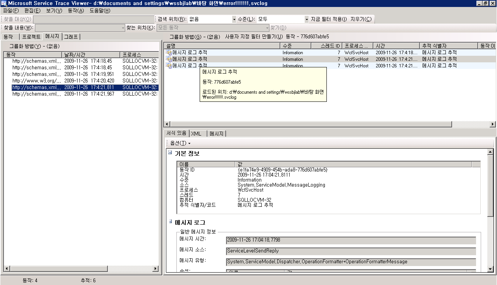

# Service Trace Viewer를 사용하여 상호 관련된 추적 보기 및 문제 해결
이 항목에서는 추적 데이터 형식, 추적 데이터를 보는 방법 및 Service Trace Viewer를 사용하여 응용 프로그램 문제를 해결하는 방법에 대해 설명합니다.  
  
## Service Trace Viewer 도구 사용  
 [!INCLUDE[indigo1](../../../../../includes/indigo1-md.md)] Service Trace Viewer 도구를 사용하면 [!INCLUDE[indigo2](../../../../../includes/indigo2-md.md)] 수신기에서 생성한 진단 추적의 연관성을 파악하여 오류의 근본 원인을 찾을 수 있습니다.  이 도구를 사용하면 추적을 쉽게 보고, 그룹화하며 필터링할 수 있으므로 [!INCLUDE[indigo2](../../../../../includes/indigo2-md.md)] 서비스 관련 문제를 진단, 복구 및 확인할 수 있습니다.  이 도구의 사용 방법에 대한 자세한 내용은 [Service Trace Viewer 도구\(SvcTraceViewer.exe\)](../../../../../docs/framework/wcf/service-trace-viewer-tool-svctraceviewer-exe.md)를 참조하세요.  
  
 이 항목에서는 [추적 및 메시지 로깅](../../../../../docs/framework/wcf/samples/tracing-and-message-logging.md) 샘플을 실행하여 생성된 추적에 대한 스크린샷을 제공합니다\([Service Trace Viewer 도구\(SvcTraceViewer.exe\)](../../../../../docs/framework/wcf/service-trace-viewer-tool-svctraceviewer-exe.md)를 통해 보는 경우\).  이 항목에서는 추적의 내용, 동작 및 상관 관계를 이해하는 방법과 문제 해결 시 많은 수의 추적을 분석하는 방법을 보여 줍니다.  
  
## 추적 내용 보기  
 추적 이벤트에는 다음과 같은 가장 중요한 정보가 들어 있습니다.  
  
-   동작 이름\(설정된 경우\)  
  
-   내보내기 시간  
  
-   추적 수준  
  
-   추적 소스 이름  
  
-   프로세스 이름  
  
-   스레드 ID  
  
-   고유한 추적 식별자\(추적과 관련된 정보를 얻을 수 있는 온라인 MSDN 라이브러리 페이지를 가리키는 URL\)  
  
 이러한 정보는 모두 Service Trace Viewer의 오른쪽 위 패널 또는 추적을 선택할 때 오른쪽 아래 패널에 있는 서식이 지정된 보기의 **기본 정보** 섹션에서 볼 수 있습니다.  
  
> [!NOTE]
>  클라이언트와 서비스가 동일한 컴퓨터에 있는 경우 두 응용 프로그램에 대한 추적이 있습니다.  이러한 추적은 **프로세스 이름** 열을 사용하여 필터링할 수 있습니다.  
  
 서식이 지정된 보기에서는 사용 가능한 경우 추적 및 추가 세부 정보에 대한 설명을 볼 수도 있습니다.  추가 세부 정보에는 예외 형식 및 메시지, 호출 스택, 메시지 동작, 보낸 사람\/받는 사람 필드 및 기타 예외 정보가 포함될 수 있습니다.  
  
 XML 보기에서 유용한 xml 태그는 다음과 같습니다.  
  
-   \<SubType\>\(추적 수준\)  
  
-   \<TimeCreated\>  
  
-   \<Source\>\(추적 소스 이름\)  
  
-   \<Correlation\>\(추적을 내보낼 때 동작 ID 집합\)  
  
-   \<Execution\>\(프로세스 및 스레드 ID\)  
  
-   \<Computer\>  
  
-   메시지를 보낼 때 메시지 헤더에 설정된 \<Action\>, \<MessageID\> 및 \<ActivityId\>를 비롯한 \<ExtendedData\>  
  
 "채널을 통해 메시지를 보냈습니다." 추적을 검사하면 다음 내용을 볼 수 있습니다.  
  
```  
<E2ETraceEvent xmlns="http://schemas.microsoft.com/2004/06/E2ETraceEvent">  
   <System xmlns="http://schemas.microsoft.com/2004/06/windows/eventlog/system">  
      <EventID>262163</EventID>  
      <Type>3</Type>  
      <SubType Name="Information">0</SubType>  
      <Level>8</Level>  
      <TimeCreated SystemTime="2006-08-04T18:45:30.8491051Z" />  
      <Source Name="System.ServiceModel" />  
       <Correlation ActivityID="{27c6331d-8998-43aa-a382-03239013a6bd}"/>  
       <Execution ProcessName="client" ProcessID="1808" ThreadID="1" />  
       <Channel />  
       <Computer>TEST1</Computer>  
   </System>  
   <ApplicationData>  
       <TraceData>  
          <DataItem>  
             <TraceRecord xmlns="http://schemas.microsoft.com/2004/10/E2ETraceEvent/TraceRecord" Severity="Information">  
                 <TraceIdentifier>http://msdn.microsoft.com/library/System.ServiceModel.Channels.MessageSent.aspx</TraceIdentifier>  
                 <Description>Sent a message over a channel.</Description>  
                 <AppDomain>client.exe</AppDomain>  
                 <Source>System.ServiceModel.Channels.ClientFramingDuplexSessionChannel/35191196</Source>  
                <ExtendedData xmlns="http://schemas.microsoft.com/2006/08/ServiceModel/MessageTransmitTraceRecord">  
  
                  <MessageProperties>  
                     <AllowOutputBatching>False</AllowOutputBatching>  
                  </MessageProperties>  
                  <MessageHeaders>  
                     <Action d4p1:mustUnderstand="1" xmlns:d4p1="http://www.w3.org/2003/05/soap-envelope" xmlns="http://www.w3.org/2005/08/addressing">http://Microsoft.ServiceModel.Samples/ICalculator/Multiply</Action>  
                     <MessageID xmlns="http://www.w3.org/2005/08/addressing">urn:uuid:7c6670d8-4c9c-496e-b6a0-2ceb6db35338</MessageID>  
                     <ActivityId CorrelationId="b02e2189-0816-4387-980c-dd8e306440f5" xmlns="http://schemas.microsoft.com/2004/09/ServiceModel/Diagnostics">27c6331d-8998-43aa-a382-03239013a6bd</ActivityId>  
                     <ReplyTo xmlns="http://www.w3.org/2005/08/addressing">  
                        <Address>http://www.w3.org/2005/08/addressing/anonymous</Address>  
                    </ReplyTo>  
                    <To d4p1:mustUnderstand="1" xmlns:d4p1="http://www.w3.org/2003/05/soap-envelope" xmlns="http://www.w3.org/2005/08/addressing">net.tcp://localhost/servicemodelsamples/service</To>  
                  </MessageHeaders>  
                  <RemoteAddress>net.tcp://localhost/servicemodelsamples/service</RemoteAddress>  
                </ExtendedData>  
            </TraceRecord>  
          </DataItem>  
       </TraceData>  
   </ApplicationData>  
</E2ETraceEvent>  
```  
  
## ServiceModel E2E 추적  
 `System.ServiceModel` 추적 소스가 Off가 아닌 `switchValue` 및 `ActivityTracing`으로 설정되면 [!INCLUDE[indigo2](../../../../../includes/indigo2-md.md)]에서 [!INCLUDE[indigo2](../../../../../includes/indigo2-md.md)] 처리에 대한 동작 및 전송을 만듭니다.  
  
 동작은 해당 처리 단위와 관련된 모든 추적을 그룹화하는 논리적인 처리 단위입니다.  예를 들어 요청별로 하나의 동작을 정의할 수 있습니다.  전송은 끝점 내의 동작 사이에 인과 관계를 만듭니다.  동작 ID를 전파하면 끝점을 통해 동작을 서로 연결할 수 있습니다.  이 작업을 수행하려면 모든 끝점의 구성에서 `propagateActivity`를 `true`로 설정합니다.  동작, 전송 및 전파를 통해 오류 상관 관계를 수행할 수 있습니다.  이 방법으로 오류에 대한 근본적인 원인을 신속하게 찾을 수 있습니다.  
  
 클라이언트에서 각 개체 모델 호출\(예: Open ChannelFactory, Add, Divide 등\)에 대해 [!INCLUDE[indigo2](../../../../../includes/indigo2-md.md)] 동작 한 개가 만들어집니다. 각 작업 호출은 "Process Action" 동작에서 처리됩니다.  
  
 [추적 및 메시지 로깅](../../../../../docs/framework/wcf/samples/tracing-and-message-logging.md) 샘플에서 추출된 다음 스크린샷에서 왼쪽 패널에는 클라이언트 프로세스에서 만들어진 작업 목록이 만든 시간을 기준으로 정렬되어 표시됩니다.  다음은 발생한 동작 순서 목록입니다.  
  
-   채널 팩터리 생성\(ClientBase\)  
  
-   채널 팩터리 열기  
  
-   작업 추가 처리  
  
-   보안 세션 설정\(첫 번째 요청에서의 이 OCCURRED\) 및 세 가지 보안 인프라 응답 메시지인 RST, RSTR, SCT\(메시지 처리 1, 2, 3\) 처리  
  
-   빼기, 곱하기 및 나누기 요청 처리  
  
-   채널 팩터리 닫기, 보안 세션 닫기 및 보안 메시지 응답 취소 처리  
  
 wsHttpBinding이 사용되기 때문에 보안 인프라 메시지가 표시됩니다.  
  
> [!NOTE]
>  [!INCLUDE[indigo2](../../../../../includes/indigo2-md.md)]에서는 요청 메시지를 포함하는 Process Action 동작에 전송을 통해 응답 메시지를 관련시키기 전에 처음에 별도의 동작\(Process message\)에서 처리되고 있는 응답 메시지를 보여 줍니다.  이는 인프라 메시지와 비동기 요청에 대해 발생하며, 그 이유는 메시지를 검사하고, activityId 헤더를 읽고, 이 ID를 갖는 기존의 Process Action 동작을 식별하여 서로 관련시켜야 하기 때문입니다.  동기 요청의 경우에는 응답을 차단하므로 응답이 어떤 Process Action과 연결되어 있는지 알 수 있습니다.  
  
   
만든 시간별로 나열된 WCF 클라이언트 동작\(왼쪽 패널\)과 중첩된 동작 및 추적\(오른쪽 위 패널\)  
  
 왼쪽 패널에서 동작을 선택하면 중첩된 동작과 추적이 오른쪽 위 패널에 표시됩니다.  따라서 이 보기는 선택한 부모 동작을 기준으로 왼쪽에 동작 목록을 축소한 계층 구조 보기입니다.  선택한 Process action Add가 첫 번째 요청이므로 이 동작에 Set Up Secure Session 동작\(전송, 다시 전송\)이 포함되며 추가 작업의 실제 처리를 추적합니다.  
  
 왼쪽 패널에서 Process action Add 동작을 두 번 클릭하면 추가와 관련된 클라이언트 [!INCLUDE[indigo2](../../../../../includes/indigo2-md.md)] 동작이 그래픽으로 표시됩니다.  왼쪽의 첫 번째 동작은 기본 동작인 루트 동작\(0000\)입니다.  [!INCLUDE[indigo2](../../../../../includes/indigo2-md.md)]는 앰비언트 동작 밖으로 전송합니다.  이 동작이 정의되지 않은 경우 [!INCLUDE[indigo2](../../../../../includes/indigo2-md.md)]는 0000에서 전송합니다.  이때 두 번째 동작인 Process Action Add가 0에서 전송합니다.  그런 다음 Setup Secure Session이 표시됩니다.  
  
   
WCF 클라이언트 동작 그래프 보기: 앰비언트 동작\(여기서 0\), Process action 및 Set Up Secure Session  
  
 오른쪽 위 패널에서 Process Action Add 동작과 관련된 추적이 모두 표시됩니다.  특히 같은 동작으로 요청 메시지\("채널을 통해 메시지를 보냈습니다."\)를 보내고 응답\("채널을 통해 메시지를 받았습니다"\)을 받았습니다.  다음 그래프에서 이를 확인할 수 있습니다.  쉽게 구별할 수 있도록 Set up Secure Session 동작은 그래프에 축소되어 있습니다.  
  
   
Process Action 동작에 대한 추적 목록: 같은 동작으로 요청을 보내고 응답을 받습니다.  
  
 여기서는 쉽게 구별할 수 있도록 클라이언트 추적만 로드하지만 서비스 추적\(받은 요청 메시지와 보낸 응답 메시지\)이 도구에 로드되고 `propagateActivity`가 `true.` 로 설정된 경우 서비스 추적도 동일한 동작에 나타납니다. 뒤에 나오는 그림에서 이러한 경우를 보여 줍니다.  
  
 서비스에서 동작 모델이 다음과 같이 [!INCLUDE[indigo2](../../../../../includes/indigo2-md.md)] 개념에 매핑됩니다.  
  
1.  ServiceHost를 생성하고 엽니다. 이렇게 하면 보안의 경우 여러 호스트 관련 동작을 만들 수 있습니다.  
  
2.  Open ServiceHost 내부 및 외부로 전송하여 ServiceHost에서 각 수신기에 대한 Listen At 동작을 만듭니다.  
  
3.  수신기가 클라이언트에서 시작된 통신 요청을 감지하면 "Receive Bytes" 동작으로 전송합니다. 여기서 클라이언트가 보낸 모든 바이트가 처리됩니다.  이 동작에서 클라이언트\-서비스 상호 작용 중에 발생한 연결 오류가 표시됩니다.  
  
4.  메시지에 해당하는 각 바이트 집합을 받으면 이러한 바이트를 "메시지 처리" 동작에서 처리합니다. 이 동작은 [!INCLUDE[indigo2](../../../../../includes/indigo2-md.md)] 메시지 개체를 만듭니다.  이 동작에서 악의적인 메시지 또는 잘못된 봉투와 관련된 오류가 표시됩니다.  
  
5.  메시지가 형성되면 Process Action 동작으로 전송합니다.  `propagateActivity`가 클라이언트와 서버에서 모두 `true`로 설정되는 경우 이 동작에는 클라이언트에서 정의되고 앞에서 설명한 것과 동일한 ID를 갖게 됩니다.  요청과 관련된 [!INCLUDE[indigo2](../../../../../includes/indigo2-md.md)]에서 내보낸 모든 추적이 응답 메시지 처리를 비롯한 같은 동작에 있기 때문에 이 단계부터 끝점을 통해 직접적인 상관 관계의 이점을 활용할 수 있습니다.  
  
6.  out\-of\-process 작업에서 "사용자 코드 실행" 동작을 만들어 [!INCLUDE[indigo2](../../../../../includes/indigo2-md.md)]에서 내보낸 추적과 사용자 코드에서 내보낸 추적을 격리시킵니다.  앞의 예제에서 "서비스가 추가 응답을 보냅니다." 추적을 가능한 경우 클라이언트가 전파한 동작이 아니라 "사용자 코드 실행" 동작에서 내보냅니다.  
  
 다음 그림에서 왼쪽의 첫 번째 동작은 기본 동작인 루트 동작\(0000\)입니다.  다음 세 동작은 ServiceHost를 여는 동작입니다.  열 5의 동작은 수신기이고, 나머지 동작\(6 \- 8\)은 바이트 처리부터 사용자 코드 활성화까지 메시지를 처리하는 WCF입니다.  
  
   
WCF 서비스 동작 목록  
  
 다음 스크린샷에서는 클라이언트와 서비스 모두의 동작을 보여 주고 여러 프로세스에 걸쳐 Process Action Add 동작을 강조 표시합니다\(주황색\).  화살표는 클라이언트와 서비스가 보내고 받은 요청 및 응답 메시지를 서로 연결합니다.  Process Action의 추적이 그래프에서 프로세스 간에 구분되어 있지만 오른쪽 위 패널에 같은 동작의 일부로 표시되어 있습니다.  이 패널에서 보낸 메시지에 대한 클라이언트 추적을 확인한 다음 받고 처리한 메시지에 대한 서비스 추적을 확인할 수 있습니다.  
  
   
WCF 클라이언트 및 서비스 동작 모두에 대한 그래프 보기  
  
 다음 오류 시나리오에서 서비스 및 클라이언트의 오류와 경고 추적이 서로 관련되어 있습니다.  예외가 서비스의 사용자 코드에서 먼저 throw됩니다\("서비스가 사용자 코드에서 이 요청을 처리할 수 없습니다." 예외에 대한 경고 추적이 포함된 맨 오른쪽의 녹색 동작\).  응답이 클라이언트에게 전송되면 오류 메시지를 표시하기 위해 경고 추적이 다시 내보내집니다\(왼쪽의 분홍색 동작\).  그런 다음 클라이언트가 해당 WCF 클라이언트를 닫습니다\(왼쪽 아래의 노란색 동작\). 그러면 서비스에 대한 연결이 중단됩니다.  서비스가 오류를 throw합니다\(오른쪽의 가장 긴 분홍색 동작\).  
  
   
서비스와 클라이언트의 오류 상관 관계  
  
 이러한 추적을 생성하는 데 사용된 샘플은 wsHttpBinding을 사용하는 일련의 동기 요청입니다.  보안을 사용하지 않거나 비동기 요청이 있는 시나리오의 경우 이 그래프에 차이가 있습니다. 여기서 Process Action 동작은 비동기 호출을 구성하는 시작 및 끝 작업을 포함하며 호출 동작에 대한 전송을 표시합니다.  추가 시나리오에 대한 자세한 내용은 [종단 간 추적 시나리오](../../../../../docs/framework/wcf/diagnostics/tracing/end-to-end-tracing-scenarios.md)를 참조하세요.  
  
## Service Trace Viewer를 사용하여 문제 해결  
 Service Trace Viewer 도구에서 추적 파일을 로드하면 왼쪽 패널에서 빨간색 또는 노란색 동작을 선택하여 응용 프로그램에서 문제의 원인을 추적할 수 있습니다.  000 동작에는 일반적으로 사용자에게 버블링되는 처리되지 않은 예외가 있습니다.  
  
   
문제 원인을 찾으려면 빨간색이나 노란색 동작 선택  
  
 오른쪽 위 패널에서는 왼쪽에서 선택한 동작에 대한 추적을 검사할 수 있습니다.  그런 다음 이 패널에서 빨간색 또는 노란색 추적을 검사하고 이들 추적이 상호 연결된 방식을 볼 수 있습니다.  앞의 그래프에서는 동일한 Process Action 동작에서 클라이언트와 서비스 모두에 대한 경고 추적을 볼 수 있습니다.  
  
 이러한 추적이 오류의 근본 원인을 제공하지 않으면 왼쪽 패널에서 선택한 동작\(여기서는 Process action\)을 두 번 클릭하여 그래프를 사용할 수 있습니다.  그러면 관련된 동작이 있는 그래프가 표시됩니다.  관련된 동작을 확장하여\("\+" 기호 클릭\) 관련된 동작에서 빨간색이나 노란색으로 된 첫 번째로 내보낸 추적을 찾을 수 있습니다.  문제의 근본 원인을 추적할 때까지 빨간색 또는 노란색 추적 바로 전에 발생한 동작을 계속 확장하면서 관련된 동작이나 끝점 간의 메시지 흐름으로의 전송을 살펴 봅니다.  
  
   
동작을 확장하여 문제의 근본적인 원인 추적  
  
 ServiceModel `ActivityTracing`이 해제되어 있지만 ServiceModel 추적이 설정된 경우 0000 동작에 내보낸 ServiceModel 추적을 확인할 수 있습니다.  하지만 이렇게 하려면 이러한 추적의 상관 관계를 이해해야 합니다.  
  
 메시지 로깅을 사용하도록 설정된 경우 메시지 탭을 사용하여 오류의 영향을 받는 메시지를 확인할 수 있습니다.  빨간색 또는 노란색 메시지를 두 번 클릭하여 관련 동작에 대한 그래프 보기를 볼 수 있습니다.  이러한 동작은 오류가 발생한 요청과 가장 관련이 높은 동작입니다.  
  
   
문제 해결을 시작하려면 빨간색 또는 노란색 메시지 추적을 선택하고 두 번 클릭하여 문제의 원인을 추적합니다.  
  
## 참고 항목  
 [종단 간 추적 시나리오](../../../../../docs/framework/wcf/diagnostics/tracing/end-to-end-tracing-scenarios.md)   
 [Service Trace Viewer 도구\(SvcTraceViewer.exe\)](../../../../../docs/framework/wcf/service-trace-viewer-tool-svctraceviewer-exe.md)   
 [추적](../../../../../docs/framework/wcf/diagnostics/tracing/index.md)