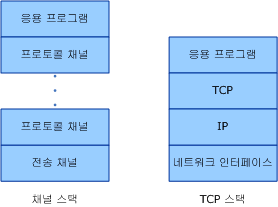
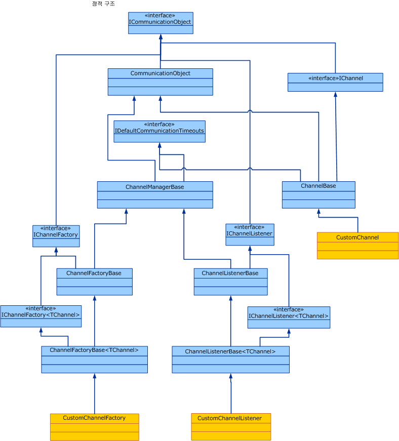

# 채널 모델 개요Channel Model Overview
[!INCLUDE[indigo1](../../../../includes/indigo1-md.md)] 채널 스택은 메시지를 처리하는 하나 이상의 채널로 계층화된 통신 스택입니다.The [!INCLUDE[indigo1](../../../../includes/indigo1-md.md)] channel stack is a layered communication stack with one or more channels that process messages. 스택의 맨 아래에는 채널 스택을 TCP, HTTP, SMTP 및 기타 다른 유형의 전송과 같은 기본 전송에 적용하는 전송 채널이 있습니다.At the bottom of the stack is a transport channel that is responsible for adapting the channel stack to the underlying transport (for example, TCP, HTTP, SMTP and other types of transport.). 채널은 메시지를 보내고 받기 위한 하위 수준의 프로그래밍 모델을 제공합니다.Channels provide a low-level programming model for sending and receiving messages. 이러한 프로그래밍 모델에서는 몇 가지 인터페이스와 총체적으로 [!INCLUDE[indigo2](../../../../includes/indigo2-md.md)] 채널 모델이라고 하는 기타 형식을 사용합니다.This programming model relies on several interfaces and other types collectively known as the [!INCLUDE[indigo2](../../../../includes/indigo2-md.md)] channel model. 이 항목에서는 채널 셰이프, 서비스에서의 기본 채널 수신기 생성 및 클라이언트에서의 채널 팩터리 생성에 대해 설명합니다.This topic discusses channel shapes, the construction of a basic channel listener (on the service) and channel factory (on the client).  
  
## 채널 스택Channel Stack  
 [!INCLUDE[indigo2](../../../../includes/indigo2-md.md)] 끝점은 채널 스택이라고 하는 통신 스택을 사용하여 세계와 통신합니다. endpoints communicate with the world using a communication stack called the channel stack. 다음 다이어그램에서는 채널 스택을 TCP/IP 등의 다른 통신 스택과 비교합니다.The following diagram compares the channel stack with other communication stacks, for example TCP/IP.  
  
   
  
 우선 유사점은 두 경우 모두 스택의 각 계층이 해당 계층 아래 세계에 대한 일부 추상화를 제공하고, 해당 추상화는 그 바로 위 계층에만 노출된다는 점입니다.First, the similarities: In both cases, each layer of the stack provides some abstraction of the world below that layer and exposed that abstraction only to the layer directly above it. 각 계층에서는 바로 아래 계층에 대한 추상화만 사용합니다.Each layer uses the abstraction of only the layer directly below it. 또한 두 경우 모두, 두 스택이 통신할 때 각 계층은 상대 스택의 해당 계층과 통신합니다. 예를 들어 IP 계층은 IP 계층끼리, TCP 계층은 TCP 계층끼리 통신합니다.Also in both cases, when two stacks communicate, each layer communicates with the corresponding layer in the other stack, for example, the IP layer communicates with the IP layer and the TCP layer with the TCP layer, and so on.  
  
 차이점은 TCP 스택은 실제 네트워크에 대한 추상화를 제공하도록 디자인된 반면, 채널 스택은 메시지 전달 방법(즉, 전송)뿐 아니라 메시지 내용 또는 통신에 사용되는 프로토콜 등의 기타 기능(전송은 해당되지만 그 이상은 아님)에 대해서도 추상화를 제공하도록 디자인되었습니다.Now, the differences: While the TCP stack was designed to provide an abstraction of the physical network, the channel stack is designed to provide an abstraction of not only how the message is delivered, that is, the transport, but also other features such as what is in the message or what protocol is used for communication, including the transport but much more than that. 예를 들어 신뢰할 수 있는 세션 바인딩 요소는 채널 스택의 일부지만 전송 아래에 있거나 전송 자체는 아닙니다.For example, reliable session binding element is part of the channel stack but is not below the transport or the transport itself. 이러한 추상화는 스택의 맨 아래 채널에게 기본 전송 프로토콜을 채널 스택 아키텍처에 적용하도록 요구한 다음, 안정성 보장 및 보안과 같은 통신 기능을 제공하기 위해 스택의 상위 채널을 사용하는 방식으로 이루어집니다.This abstraction is achieved by requiring the bottom channel in the stack to adapt the underlying transport protocol to the channel stack architecture and then relying on channels further up in the stack to provide communication features such as reliability guarantees and security.  
  
 메시지는 <xref:System.ServiceModel.Channels.Message> 개체와 같은 통신 스택을 통해 이동합니다.Messages flow through the communication stack as <xref:System.ServiceModel.Channels.Message> objects. 위 그림과 같이 맨 아래 채널을 전송 채널이라고 하며,As shown in figure above, the bottom channel is called a transport channel. 이 채널을 통해 메시지를 다른 상대방과 주고 받게 됩니다.It is the channel that is responsible for sending and receiving messages to and from other parties. 또한 <xref:System.ServiceModel.Channels.Message> 개체를 다른 상대방과 통신하기 위한 형식으로 변환하기도 합니다.This includes the responsibility of transforming the <xref:System.ServiceModel.Channels.Message> object to and from the format used to communicate with other parties. 이 전송 채널 위에는 안정된 전달 보장과 같은 통신 기능을 제공하는 여러 프로토콜 채널이 있을 수 있습니다.Above the transport channel there can be any number of protocol channels each responsible for providing a communication function such as reliable delivery guarantees. 프로토콜 채널은 <xref:System.ServiceModel.Channels.Message> 개체의 형태로 프로토콜 채널을 통해 이동하는 메시지를 바탕으로 작동합니다.Protocol channels operate on messages flowing through them in the form of the <xref:System.ServiceModel.Channels.Message> object. 그리고 일반적으로 헤더 추가 또는 본문 암호화 등을 통해 메시지를 변환하거나 수신 승인과 같은 자체 프로토콜 제어 메시지를 주고 받습니다.They typically either transform the message, for example, by adding headers or encrypting the body, or send and receive their own protocol control messages, for example, receipt acknowledgments.  
  
## 채널 셰이프Channel Shapes  
 각 채널에서는 채널 셰이프 인터페이스 또는 채널 셰이프라고 하는 인터페이스를 하나 이상 구현합니다.Each channel implements one or more interfaces known as channel shape interfaces or channel shapes. 이러한 채널 셰이프에서는 채널에서 구현되어 채널 사용자가 호출하는 보내기 및 받기 또는 요청 및 응답과 같은 통신 기반 메서드를 제공합니다.Those channel shapes provide the communication-oriented methods such as send and receive or request and reply that the channel implements and the user of the channel calls. 채널 셰이프의 맨 아래에는 <xref:System.ServiceModel.Channels.IChannel> 인터페이스를 제공 하는 인터페이스는 `GetProperty` \<T > 메서드는 스택 내 채널에에서 의해 노출 되는 임의의 기능에 액세스 하기 위한 계층화 된 메커니즘으로 합니다.At the base of the channel shapes is the <xref:System.ServiceModel.Channels.IChannel> interface, which is an interface that provides a `GetProperty`\<T> method intended as a layered mechanism to access arbitrary features exposed by channels in the stack. <xref:System.ServiceModel.Channels.IChannel>을 확장하는 다섯 개의 채널 셰이프는 다음과 같습니다.The five channel shapes that extend <xref:System.ServiceModel.Channels.IChannel> are:  
  
-   <xref:System.ServiceModel.Channels.IInputChannel>  
  
-   <xref:System.ServiceModel.Channels.IOutputChannel>  
  
-   <xref:System.ServiceModel.Channels.IRequestChannel>  
  
-   <xref:System.ServiceModel.Channels.IReplyChannel>  
  
-   <xref:System.ServiceModel.Channels.IDuplexChannel>  
  
 또한 이러한 각 셰이프에는 세션 지원을 위해 <xref:System.ServiceModel.Channels.ISessionChannel%601?displayProperty=nameWithType>을 확장하는 해당 항목이 있습니다.Further, each of these shapes has an equivalent that extends <xref:System.ServiceModel.Channels.ISessionChannel%601?displayProperty=nameWithType> to support sessions. 이러한 항목은 다음과 같습니다.These are:  
  
-   <xref:System.ServiceModel.Channels.IInputSessionChannel>  
  
-   <xref:System.ServiceModel.Channels.IOutputSessionChannel>  
  
-   <xref:System.ServiceModel.Channels.IRequestSessionChannel>  
  
-   <xref:System.ServiceModel.Channels.IReplySessionChannel>  
  
-   <xref:System.ServiceModel.Channels.IDuplexSessionChannel>  
  
 채널 셰이프는 기존 전송 프로토콜에서 지원하는 몇 가지 기본 메시지 교환 패턴에 따라 패턴화됩니다.The channel shapes are patterned after some of the fundamental message exchange patterns supported by existing transport protocols. 예를 들어 단방향 메시징에 해당는 <xref:System.ServiceModel.Channels.IInputChannel> / <xref:System.ServiceModel.Channels.IOutputChannel> 쌍에 해당 요청-회신 <xref:System.ServiceModel.Channels.IRequestChannel> / <xref:System.ServiceModel.Channels.IReplyChannel> 쌍과 양방향 이중 통신에 해당 <xref:System.ServiceModel.Channels.IDuplexChannel> (모두 확장 <xref:System.ServiceModel.Channels.IInputChannel> 및 <xref:System.ServiceModel.Channels.IOutputChannel>).For example, one-way messaging corresponds to an <xref:System.ServiceModel.Channels.IInputChannel>/<xref:System.ServiceModel.Channels.IOutputChannel> pair, request-reply corresponds to <xref:System.ServiceModel.Channels.IRequestChannel>/<xref:System.ServiceModel.Channels.IReplyChannel> pairs and two-way duplex communications corresponds to <xref:System.ServiceModel.Channels.IDuplexChannel> (which extends both <xref:System.ServiceModel.Channels.IInputChannel> and <xref:System.ServiceModel.Channels.IOutputChannel>).  
  
## 채널 스택을 사용한 프로그래밍Programming with the Channel Stack  
 채널 스택은 일반적으로 바인딩을 통해 채널 스택이 만들어지는 팩터리 패턴을 사용하여 만들어집니다.Channel stacks are typically created using a factory pattern where a binding creates the channel stack. 보내는 쪽에서 바인딩을 사용하여 <xref:System.ServiceModel.ChannelFactory>를 빌드하는데, 이를 통해 채널 스택을 차례로 빌드하고 스택의 맨 위 채널에 참조를 반환합니다.On the send side, a binding is used to build a <xref:System.ServiceModel.ChannelFactory>, which in turn builds a channel stack and returns a reference to the top channel in the stack. 그러면 응용 프로그램에서 이 채널을 사용하여 메시지를 보낼 수 있습니다.The application can then use this channel to send messages. 자세한 내용은 참조 [클라이언트 채널 수준 프로그래밍](../../../../docs/framework/wcf/extending/client-channel-level-programming.md)합니다.For more information, see [Client Channel-Level Programming](../../../../docs/framework/wcf/extending/client-channel-level-programming.md).  
  
 받는 쪽에서는 바인딩을 사용하여 <xref:System.ServiceModel.Channels.IChannelListener>를 빌드하는데, 이를 통해 들어오는 메시지를 수신 대기합니다.On the receive side a binding is used to build a <xref:System.ServiceModel.Channels.IChannelListener>, which listens for incoming messages. <xref:System.ServiceModel.Channels.IChannelListener>에서는 채널 스택을 만들고 맨 위 채널에 응용 프로그램 참조를 전달하여 메시지를 수신 대기 응용 프로그램에 제공합니다.The <xref:System.ServiceModel.Channels.IChannelListener> provides messages to the listening application by creating channel stacks and handing the application reference to the top channel. 그러면 응용 프로그램에서 이 채널을 사용하여, 들어오는 메시지를 받습니다.The application then uses this channel to receive incoming messages. 자세한 내용은 참조 [서비스 채널 수준 프로그래밍](../../../../docs/framework/wcf/extending/service-channel-level-programming.md)합니다.For more information, see [Service Channel-Level Programming](../../../../docs/framework/wcf/extending/service-channel-level-programming.md).  
  
## 채널 개체 모델The Channel Object Model  
 채널 개체 모델은 채널, 채널 수신기 및 채널 팩터리를 구현하는 데 필요한 핵심 인터페이스 집합입니다.The channel object model is the core set of interfaces required to implement channels, channel listeners and channel factories. 또한 사용자 지정 구현을 도와 주는 몇 가지 기본 클래스도 있습니다.There are also some base classes provided to assist in custom implementations.  
  
 채널 수신기는 들어오는 메시지를 수신 대기한 다음, 이를 채널 수신기에서 만든 채널을 통해 위 계층으로 전달합니다.Channel listeners are responsible for listening for incoming messages, then delivering them to the layer above through channels created by the channel listener.  
  
 채널 팩터리는 메시지를 전송하고 만들어진 모든 채널을 채널 팩터리 종료 시 닫는 데 사용하는 채널을 만듭니다.Channel factories are responsible for creating channels that are used for sending messages and for closing all channels they created when the channel factory is closed.  
  
 <xref:System.ServiceModel.ICommunicationObject>는 모든 통신 개체가 구현하는 기본 상태 시스템을 정의하는 핵심 인터페이스입니다.<xref:System.ServiceModel.ICommunicationObject> is the core interface that defines the basic state machine that all communication objects implement. <xref:System.ServiceModel.Channels.CommunicationObject>는 다른 채널 클래스가 인터페이스를 다시 구현하지 않고 파생할 수 있는 이 핵심 인터페이스의 구현을 제공합니다.<xref:System.ServiceModel.Channels.CommunicationObject> provides an implementation of this core interface that other channel classes can derive from rather than re-implementing the interface. 하지만 반드시 이렇게 할 필요는 없으며, 사용자 지정 채널을 통해 <xref:System.ServiceModel.ICommunicationObject>를 <xref:System.ServiceModel.Channels.CommunicationObject>에서 상속하지 않고 바로 구현할 수도 있습니다.However, this is not required: a custom channel can implement <xref:System.ServiceModel.ICommunicationObject> directly and not inherit from <xref:System.ServiceModel.Channels.CommunicationObject>. 그림 3의 클래스는 모두 채널 모델의 일부로 간주되지 않으며, 채널을 빌드하려는 사용자 지정 채널 구현자가 사용할 수 있는 도우미입니다.None of the classes in Figure 3 are considered part of the channel model; they are helpers available to custom channel implementers who want to build channels.  
  
   
  
 다음 항목에서는 채널 개체 모델 및 사용자 지정 채널을 편리하게 빌드할 수 있는 다양한 개발 영역에 대해 설명합니다.The following topics describe the channel object model as well as various development areas that help build custom channels.  
  
|항목Topic|설명Description|  
|-----------|-----------------|  
|[서비스: 채널 수신기 및 채널Service: Channel Listeners and Channels](../../../../docs/framework/wcf/extending/service-channel-listeners-and-channels.md)|서비스 응용 프로그램에서 들어오는 채널을 수신 대기하는 채널 수신기에 대해 설명합니다.Describes channel listeners, which listen for incoming channels in a service application.|  
|[클라이언트: 채널 팩터리 및 채널Client: Channel Factories and Channels](../../../../docs/framework/wcf/extending/client-channel-factories-and-channels.md)|서비스 응용 프로그램에 연결할 채널을 만드는 채널 팩터리에 대해 설명합니다.Describes channel factories, which create channels to connect to a service application.|  
|[상태 변경 이해Understanding State Changes](../../../../docs/framework/wcf/extending/understanding-state-changes.md)|<xref:System.ServiceModel.ICommunicationObject?displayProperty=nameWithType> 인터페이스 모델 상태가 채널에서 어떻게 바뀌는지에 대해 설명합니다.Describes how the <xref:System.ServiceModel.ICommunicationObject?displayProperty=nameWithType> interface models state changes in channels.|  
|[메시지 교환 패턴 선택Choosing a Message Exchange Pattern](../../../../docs/framework/wcf/extending/choosing-a-message-exchange-pattern.md)|채널에서 지원할 수 있는 여섯 가지의 기본 메시지 교환 패턴에 대해 설명합니다.Describes the six basic message exchange patterns that channels can support.|  
|[예외 및 오류 처리Handling Exceptions and Faults](../../../../docs/framework/wcf/extending/handling-exceptions-and-faults.md)|사용자 지정 채널에서 오류 및 예외를 처리하는 방법에 대해 설명합니다.Describes how to handle faults and exceptions in custom channels.|  
|[구성 및 메타데이터 지원Configuration and Metadata Support](../../../../docs/framework/wcf/extending/configuration-and-metadata-support.md)|응용 프로그램 모델에서 사용자 지정 채널을 사용할 수 있도록 지원하는 방법과 바인딩 및 바인딩 요소를 사용하여 메타데이터를 가져오거나 내보내는 방법에 대해 설명합니다.Describes how to support the use of custom channels from the application model and how to export and import metadata using bindings and binding elements.|
