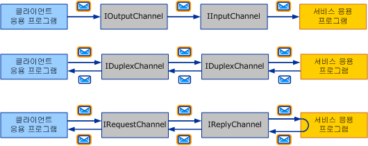
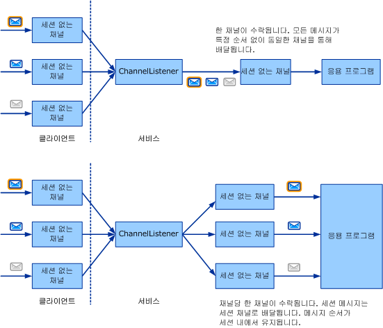

# 메시지 교환 패턴 선택Choosing a Message Exchange Pattern
결정 하는 사용자 지정 전송을 작성 하는 첫 번째 단계는 *메시지 교환 패턴* (즉, Mep)는 개발 중인 채널에 대 한 필요 합니다.The first step in writing a custom transport is to decide which *message exchange patterns* (or MEPs) are required for the channel you are developing. 이 항목에서는 사용 가능한 옵션과 여러 가지 요구 사항에 대해 설명합니다.This topic describes the options available and discusses the various requirements. 이에 설명 된 채널 개발 작업 목록에서 첫 번째 작업이 [개발 채널](../../../../docs/framework/wcf/extending/developing-channels.md)합니다.This is the first task in the channel development task list described in [Developing Channels](../../../../docs/framework/wcf/extending/developing-channels.md).  
  
## 여섯 개의 메시지 교환 패턴Six Message Exchange Patterns  
 다음과 같은 세 개의 MEP가 있습니다.There are three MEPs to choose from:  
  
-   데이터그램(<xref:System.ServiceModel.Channels.IInputChannel> 및 <xref:System.ServiceModel.Channels.IOutputChannel>)Datagram (<xref:System.ServiceModel.Channels.IInputChannel> and <xref:System.ServiceModel.Channels.IOutputChannel>)  
  
     데이터 그램 MEP를 사용할 때 클라이언트가 사용 하 여 메시지를 보내는 *실행 후 제거 교환은* 교환 합니다.When using a datagram MEP, a client sends a message using a *fire and forget* exchange. 실행 후 제거 교환은 성공적인 전달에 대한 out-of-band 확인이 필요한 교환입니다.A fire and forget exchange is one that requires out-of-band confirmation of successful delivery. 메시지는 전송 중에 손실되어 서비스에 전달되지 않을 수 있습니다.The message might be lost in transit and never reach the service. 보내기 작업이 클라이언트 쪽에서 완료되더라도 원격 끝점에서 메시지를 수신했다고 보장할 수는 없습니다.If the send operation completes successfully at the client end, it does not guarantee that the remote endpoint has received the message. 데이터그램은 메시징을 위한 기본적인 빌딩 블록으로, 이 위에 신뢰할 수 있는 프로토콜 및 보안 프로토콜을 포함한 고유 프로토콜을 빌드할 수 있습니다.The datagram is a fundamental building block for messaging, as you can build your own protocols on top of it—including reliable protocols and secure protocols. 클라이언트 데이터그램 채널은 <xref:System.ServiceModel.Channels.IOutputChannel> 인터페이스를 구현하고, 서비스 데이터그램 채널은 <xref:System.ServiceModel.Channels.IInputChannel> 인터페이스를 구현합니다.Client datagram channels implement the <xref:System.ServiceModel.Channels.IOutputChannel> interface and service datagram channels implement the <xref:System.ServiceModel.Channels.IInputChannel> interface.  
  
-   요청-응답(<xref:System.ServiceModel.Channels.IRequestChannel> 및 <xref:System.ServiceModel.Channels.IReplyChannel>)Request-Response (<xref:System.ServiceModel.Channels.IRequestChannel> and <xref:System.ServiceModel.Channels.IReplyChannel>)  
  
     이 MEP에서는 메시지가 전송되고 회신이 수신됩니다.In this MEP, a message is sent, and a reply is received. 이 패턴은 요청-응답 쌍으로 구성됩니다.The pattern consists of request-response pairs. RPC(원격 프로시저 호출) 및 브라우저 GET 요청 등이 요청-응답 호출에 해당합니다.Examples of request-response calls are remote procedure calls (RPC) and browser GET requests. 이 패턴을 반이중이라고도 합니다.This pattern is also known as half-duplex. 이 MEP에서 클라이언트 채널은 <xref:System.ServiceModel.Channels.IRequestChannel>을 구현하고 서비스 채널은 <xref:System.ServiceModel.Channels.IReplyChannel>을 구현합니다.In this MEP, client channels implement <xref:System.ServiceModel.Channels.IRequestChannel> and service channels implement <xref:System.ServiceModel.Channels.IReplyChannel>.  
  
-   이중(<xref:System.ServiceModel.Channels.IDuplexChannel>)Duplex (<xref:System.ServiceModel.Channels.IDuplexChannel>)  
  
     이중 MEP를 사용하면 임의 개수의 메시지를 클라이언트에서 보내고 임의의 순서로 받을 수 있습니다.The duplex MEP allows an arbitrary number of messages to be sent by a client and received in any order. 이중 MEP는 말로 전달되는 각 단어가 메시지에 해당하는 전화 통화와 같습니다.The duplex MEP is like a phone conversation, where each word being spoken is a message. 이 MEP에서는 양측의 송/수신이 가능하기 때문에 클라이언트와 서비스 채널에서 <xref:System.ServiceModel.Channels.IDuplexChannel> 인터페이스를 구현합니다.Because both sides can send and receive in this MEP, the interface implemented by the client and service channels is <xref:System.ServiceModel.Channels.IDuplexChannel>.  
  
   
다음은 세 가지 기본 메시지 교환 패턴으로The three basic message exchange patterns. 위에서부터 차례로 데이터그램, 요청-응답 및 이중 교환 패턴입니다.Top to bottom: datagram, request-response, and duplex.  
  
 도 지원할 수 있습니다 이러한 mep는 각각 *세션*합니다.Each of these MEPs can also support *sessions*. 세션(및 <xref:System.ServiceModel.Channels.ISessionChannel%601?displayProperty=nameWithType> 형식의 <xref:System.ServiceModel.Channels.ISession?displayProperty=nameWithType> 구현)은 채널에서 주고 받는 모든 메시지와 상호 관련됩니다.A session (and implementation of <xref:System.ServiceModel.Channels.ISessionChannel%601?displayProperty=nameWithType> of type <xref:System.ServiceModel.Channels.ISession?displayProperty=nameWithType>) correlates all messages sent and received on a channel. 요청-응답 패턴은 요청과 회신이 상호 관련되어 있지만 독립 실행형 두 메시지 세션입니다.The request-response pattern is a stand-alone two-message session, as the request and reply are correlated. 반면, 세션을 지원하는 요청-응답 패턴은 해당 채널의 모든 요청/응답 쌍이 상호 관련되어 있음을 의미합니다.In contrast, the request-response pattern that supports sessions implies that all request/response pairs on that channel are correlated with each other. 이런 식으로 다음과 같이 총 여섯 개의 MEP가 제공됩니다.This gives you a total of six MEPs to choose from:  
  
-   데이터그램Datagram  
  
-   요청-응답Request-response  
  
-   이중Duplex  
  
-   세션 지원 데이터그램 MEPDatagram with sessions  
  
-   세션 지원 요청-응답 MEPRequest-response with sessions  
  
-   세션 지원 이중 MEPDuplex with sessions  
  
> [!NOTE]
>  UDP 전송의 경우 UDP는 본래 실행 후 제거 프로토콜이므로 데이터그램 MEP만 지원됩니다.For the UDP transport, the only MEP that is supported is datagram, because UDP is inherently a fire and forget protocol.  
  
## 세션 및 세션 채널Sessions and Sessionful Channels  
 네트워킹 환경에는 TCP와 같은 연결 지향 프로토콜과 UDP와 같은 연결 지양 프로토콜이 있습니다.In the networking world, there are connection-oriented protocols (for example, TCP) and connection-less protocols (for example, UDP). [!INCLUDE[indigo2](../../../../includes/indigo2-md.md)]는 연결과 비슷한 논리적 추상을 나타내는 데 세션이라는 용어를 사용합니다. uses the term session to mean a connection-like logical abstraction. 세션 WCF 프로토콜은 연결 지향 네트워크 프로토콜과 비슷하며 세션 없는 WCF 프로토콜은 연결 지양 네트워크 프로토콜과 비슷합니다.Sessionful WCF protocols are similar to connection-oriented network protocols and sessionless WCF protocols are similar to connection-less network protocols.  
  
 채널 개체 모델에서 각각의 논리적 세션은 세션 채널의 인스턴스로 매니페스트됩니다.In the channel object model, each logical session manifests as an instance of a sessionful channel. 따라서 클라이언트에서 만들어져 서비스에서 허용되는 모든 새 세션은 클라이언트와 서비스 측의 새 세션 채널에 해당합니다.Therefore every new session created by the client, and accepted on the service, corresponds to a new sessionful channel on each side. 다음은 위와 아래에 세션 없는 채널 구조와 세션 채널 구조가 각각 표시된 다이어그램입니다.The following diagram shows, on the top, the structure of sessionless channels, and on the bottom, the structure of sessionful channels.  
  
   
  
 클라이언트는 새로운 세션 채널을 만들어 메시지를 보냅니다.A client creates a new sessionful channel and sends a message. 그러면 서비스 측에서 채널 수신기가 이 메시지를 받고 해당 메시지가 새 세션에 속하는 것으로 감지하여, 새 세션 채널을 만들고 채널 수신기의 AcceptChannel을 호출하는 응용 프로그램에 대한 응답으로 이를 응용 프로그램에 전달합니다.On the service side, the channel listener receives this message and detects that it belongs to a new session so it creates a new sessionful channel and hands it to the application (in response to the application calling AcceptChannel on the channel listener). 그럼 다음 응용 프로그램에서는 이 메시지를 비롯한, 동일한 세션 채널을 통해 같은 세션에서 보내진 모든 후속 메시지를 받습니다.The application then receives this message and all subsequent messages sent in the same session through the same sessionful channel.  
  
 다른 클라이언트 또는 같은 클라이언트에서도 새로운 세션 채널을 만들어 메시지를 보냅니다.Another client (or the same client) creates a new sessionful and sends a message. 채널 수신기는 이 메시지가 새 세션에 있는 것으로 감지하고 새 세션 채널을 만드는데, 이 프로세스가 반복됩니다.The channel listener detects this message is in a new session and creates a new sessionful channel and the process repeats.  
  
 세션이 없는 경우에는 채널과 세션 간에 상호 관련성이 없습니다.Without sessions, there is no correlation between channels and sessions. 따라서 채널 수신기는 모든 수신 메시지가 응용 프로그램에 전달되는 하나의 채널만 만듭니다.Therefore a channel listener creates only one channel through which all received messages are delivered to the application. 메시지 순서를 관리할 세션이 없으므로 메시지에 대한 순서 지정도 없습니다.There is also no message ordering because there is no session within which to maintain message order. 이러한 세션 없는 메시지 교환에 대해서는 이전 그림의 상단에 설명되어 있습니다.The top portion of the preceding graphic illustrates a sessionless message exchange.  
  
## 세션 시작 및 종료Starting and Terminating Sessions  
 세션 채널이 새로 만들어지면 클라이언트에서 세션이 시작됩니다.Sessions are started on the client by simply creating a new sessionful channel. 또한 새 세션에서 전송된 메시지를 서비스에서 받으면 서비스에서 세션이 시작됩니다.They are started on the service when the service receives a message that was sent in a new session. 이와 마찬가지로, 세션 채널을 닫거나 중단하면 세션이 종료됩니다.Likewise, sessions are terminated by closing or aborting a sessionful channel.  
  
 하지만 이중 세션 통신 패턴으로 메시지를 보내고 받는 데 모두 사용되는 <xref:System.ServiceModel.Channels.IDuplexSessionChannel>은 이 경우에 예외입니다.The exception to this is <xref:System.ServiceModel.Channels.IDuplexSessionChannel> which is used for both sending and receiving messages in a duplex, sessionful communication pattern. 한 쪽에서 메시지 전송은 중단하고 메시지 수신을 계속하길 원할 수 있는데, 이 경우 <xref:System.ServiceModel.Channels.IDuplexSessionChannel>을 사용하면 출력 세션을 닫을 수 있는 메커니즘이 제공됩니다. 즉, 더 이상 메시지를 보내지 않지만 계속해서 메시지를 받을 수 있도록 입력 세션이 열린 상태로 유지됩니다.It is possible that one side will want to stop sending messages but continue to receive messages therefore when using <xref:System.ServiceModel.Channels.IDuplexSessionChannel> there is a mechanism that lets you close the output session indicating you will not send any more messages but keep the input session opened allowing you to continue to receive messages.  
  
 일반적으로 세션은 들어오는 쪽이 아닌 나가는 쪽에서 닫힙니다.In general, sessions are closed on the outgoing side and not on the incoming side. 즉, 세션 출력 채널을 닫아 세션을 완전히 종료할 수 있습니다.That is, sessionful output channels can be closed, thereby cleanly terminating the session. 세션 출력 채널을 닫으면 해당 세션 입력 채널에서는 <xref:System.ServiceModel.Channels.IInputChannel.Receive%2A?displayProperty=nameWithType>의 <xref:System.ServiceModel.Channels.IDuplexSessionChannel>를 호출하는 응용 프로그램에 null을 반환합니다.Closing a sessionful output channel causes the corresponding sessionful input channel to return null to the application calling <xref:System.ServiceModel.Channels.IInputChannel.Receive%2A?displayProperty=nameWithType> on the <xref:System.ServiceModel.Channels.IDuplexSessionChannel>.  
  
 하지만 세션 입력 채널은 <xref:System.ServiceModel.Channels.IInputChannel.Receive%2A?displayProperty=nameWithType>의 <xref:System.ServiceModel.Channels.IDuplexSessionChannel>가세션이 이미 닫혀 있음을 나타내는 null을 반환하지 않는 이상 닫히지 않습니다.However sessionful input channels should not be closed unless <xref:System.ServiceModel.Channels.IInputChannel.Receive%2A?displayProperty=nameWithType> on the <xref:System.ServiceModel.Channels.IDuplexSessionChannel> returns null, indicating that the session is already closed. <xref:System.ServiceModel.Channels.IInputChannel.Receive%2A?displayProperty=nameWithType>의 <xref:System.ServiceModel.Channels.IDuplexSessionChannel>가null을 반환하지 않은 상태에서 세션 입력 채널을 닫으면 채널을 닫는 동안 예기치 않은 메시지를 받을 수 있으므로 예외가 throw됩니다.If <xref:System.ServiceModel.Channels.IInputChannel.Receive%2A?displayProperty=nameWithType> on the <xref:System.ServiceModel.Channels.IDuplexSessionChannel> has not returned null, closing a sessionful input channel may throw an exception because it may receive unexpected messages while closing. 발신자가 세션을 종료하기 전에 수신자가 세션을 종료하려면 갑자기 세션이 종료되는 <xref:System.ServiceModel.ICommunicationObject.Abort%2A>를 입력 채널에서 호출해야 합니다.If a receiver wishes to terminate a session before the sender does, it should call <xref:System.ServiceModel.ICommunicationObject.Abort%2A> on the input channel, which abruptly terminates the session.  
  
## 세션 채널 작성Writing Sessionful Channels  
 세션 채널 작성자로서 채널에서 세션 제공을 위해 수행해야 할 몇 가지 사항이 있습니다.As a sessionful channel author, there are a few things your channel must do to provide sessions. 보내는 쪽의 채널에서는 다음이 이루어져야 합니다.On the send side, your channel needs to:  
  
-   각각의 새로운 채널에 대해 새 세션을 만들고 이를 고유 문자열인 새 세션 ID와 연결합니다.For each new channel, create a new session and associate it with a new session id which is a unique string. 또는 스택 내 하위 세션 채널에서 새 세션을 얻습니다.Or obtain a new session from the sessionful channel below you in the stack.  
  
-   세션을 하위 계층에서 얻지 않고 채널에서 세션을 만든 경우에는, 이 채널을 통해 보낸 각 메시지에 대해 해당 메시지를 세션과 연결해야 합니다.For each message sent using this channel, if your channel created the session (as opposed to obtaining it from the layer below you), you need to associate the message with the session. 이러한 작업은 프로토콜 채널의 경우 일반적으로 SOAP 헤더를 추가하여 이루어지고,For protocol channels, this is typically done by adding a SOAP header. 전송 채널의 경우에는 새 전송 연결을 만들거나 세션 정보를 프레이밍 프로토콜에 추가하여 이루어집니다.For transport channels, this is typically done by creating a new transport connection or adding session information to the framing protocol.  
  
-   이 채널을 통해 보낸 각 메시지에 대해, 앞서 설명한 전달 보장이 이루어져야 합니다.For each message sent using this channel, you need to provide the delivery guarantees mentioned above. 세션을 제공하는 데 하위 채널을 사용하면 해당 채널을 통해서도 전달 보장이 이루어집니다.If you are relying on the channel below you to provide the session, that channel will also provide the delivery guarantees. 사용자가 세션을 직접 제공할 경우에는 이러한 보장을 프로토콜의 일부로 구현해야 합니다.If you’re providing the session yourself, you need to implement those guarantees as part of your protocol. 일반적으로 양쪽 모두에서 WCF를 사용하는 것으로 가정하는 프로토콜 채널을 작성하는 경우에는 TCP 전송이나 신뢰할 수 있는 메시징 채널이 필요할 수 있고, 세션을 제공하는 데에는 어느 쪽이든 사용할 수 있습니다.In general, if you are writing a protocol channel that assumes WCF on both sides you may require the TCP transport or the Reliable Messaging channel and rely on either one to provide a session.  
  
-   채널에서 <xref:System.ServiceModel.ICommunicationObject.Close%2A?displayProperty=nameWithType>가 호출되면 지정된 시간 제한이나 기본 시간 제한을 사용하여 세션을 닫는 데 필요한 작업을 수행합니다.When <xref:System.ServiceModel.ICommunicationObject.Close%2A?displayProperty=nameWithType> is called on your channel, perform the necessary work to close the session using either the specified timeout or the default one. 이 작업은 세션을 하위 채널에서 얻은 경우 해당 채널에서 <xref:System.ServiceModel.ICommunicationObject.Close%2A>를 호출하거나 특별한 SOAP 메시지를 보내거나 전송 연결을 닫는 작업만큼이나 간단합니다.This can be as simple as calling <xref:System.ServiceModel.ICommunicationObject.Close%2A> on the channel below you (if you just obtained the session from it) or sending a special SOAP message or closing a transport connection.  
  
-   채널에서 <xref:System.ServiceModel.ICommunicationObject.Abort%2A>를 호출하면 I/O가 수행되지 않고 세션이 갑자기 종료됩니다.When <xref:System.ServiceModel.ICommunicationObject.Abort%2A> is called on your channel, terminate the session abruptly without performing I/O. 즉, 수행된 작업이 없거나 네트워크 연결 또는 일부 다른 리소스가 중단될 수 있습니다.This may mean doing nothing or may involve aborting a network connection or some other resource.  
  
 받는 쪽의 채널에서는 다음이 이루어져야 합니다.On the receive side, your channel needs to:  
  
-   들어오는 각 메시지에 대해, 채널 수신기에서 해당 메시지가 속한 세션을 감지해야 합니다.For each incoming message, the channel listener must detect the session it belongs to. 세션의 첫 번째 메시지에 대해서는 채널 수신기가 새 채널을 만들고 <xref:System.ServiceModel.Channels.IChannelListener%601.AcceptChannel%2A?displayProperty=nameWithType>에 대한 호출에서 이를 반환해야 합니다.If this is the first message in the session, the channel listener must create a new channel and return it from the call to <xref:System.ServiceModel.Channels.IChannelListener%601.AcceptChannel%2A?displayProperty=nameWithType>. 그렇지 않으면 채널 수신기가 세션에 해당하는 기존 채널을 찾아 해당 채널을 통해 메시지를 전달해야 합니다.Otherwise the channel listener must find the existing channel that corresponds to the session and deliver the message through that channel.  
  
-   요구되는 전달 보장과 함께 채널에서 세션을 제공하는 경우에는 받는 쪽에서 메시지 순서 변경이나 승인 전송 등의 일부 작업을 수행해야 합니다.If your channel is providing the session (along with the required delivery guarantees) the receive side may be required to perform some actions such as re-order messages or send acknowledgements.  
  
-   채널에서 <xref:System.ServiceModel.ICommunicationObject.Close%2A>가 호출되면 지정된 시간 제한이나 기본 시간 제한을 사용하여 세션을 닫는 데 필요한 작업을 수행합니다.When <xref:System.ServiceModel.ICommunicationObject.Close%2A> is called on your channel, perform the necessary work to close the session either the specified timeout or the default one. 이로 인해 종료 시간 제한 만료를 기다리는 동안 채널에서 메시지를 받을 경우 예외가 발생할 수 있는데,This could result in exceptions if the channel receives a message while waiting for the close timeout to expire. 이는 채널이 메시지를 받을 때 Closing 상태에 있기 때문입니다.That’s because the channel will be in the Closing state when it receives a message so it would throw.  
  
-   채널에서 <xref:System.ServiceModel.ICommunicationObject.Abort%2A>를 호출하면 I/O가 수행되지 않고 세션이 갑자기 종료됩니다.When <xref:System.ServiceModel.ICommunicationObject.Abort%2A> is called on your channel, terminate the session abruptly without performing I/O. 위에서 언급한 바와 같이, 이는 수행된 작업이 없거나 네트워크 연결 또는 일부 다른 리소스가 중단될 수 있음을 의미합니다.Again, this may mean doing nothing or may involve aborting a network connection or some other resource.  
  
## 참고 항목See Also  
 [채널 모델 개요Channel Model Overview](../../../../docs/framework/wcf/extending/channel-model-overview.md)
