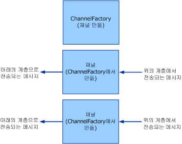

# <a name="client-channel-factories-and-channels"></a><span data-ttu-id="feb3f-102">클라이언트: 채널 팩터리 및 채널</span><span class="sxs-lookup"><span data-stu-id="feb3f-102">Client: Channel Factories and Channels</span></span>
<span data-ttu-id="feb3f-103">이 항목에서는 채널 팩터리 및 채널 만들기에 대해 설명합니다.</span><span class="sxs-lookup"><span data-stu-id="feb3f-103">This topic discusses the creation of channel factories and channels.</span></span>  
  
## <a name="channel-factories-and-channels"></a><span data-ttu-id="feb3f-104">채널 팩터리 및 채널</span><span class="sxs-lookup"><span data-stu-id="feb3f-104">Channel Factories and Channels</span></span>  
 <span data-ttu-id="feb3f-105">채널 팩터리는 채널을 만듭니다.</span><span class="sxs-lookup"><span data-stu-id="feb3f-105">Channel factories are responsible for creating channels.</span></span> <span data-ttu-id="feb3f-106">채널 팩터리에서 만든 채널은 메시지를 보내는 데 사용됩니다.</span><span class="sxs-lookup"><span data-stu-id="feb3f-106">Channels created by channel factories are used for sending messages.</span></span> <span data-ttu-id="feb3f-107">이러한 채널은 위의 계층에서 메시지를 가져와서 필요한 모든 처리 작업을 수행한 다음 메시지를 아래 계층으로 보냅니다.</span><span class="sxs-lookup"><span data-stu-id="feb3f-107">These channels are responsible for getting the message from the layer above, performing whatever processing is necessary, then sending the message to the layer below.</span></span> <span data-ttu-id="feb3f-108">다음 그래픽에서는 이 프로세스를 보여 줍니다.</span><span class="sxs-lookup"><span data-stu-id="feb3f-108">The following graphic illustrates this process.</span></span>  
  
 <span data-ttu-id="feb3f-109"></span><span class="sxs-lookup"><span data-stu-id="feb3f-109"></span></span>  
<span data-ttu-id="feb3f-110">채널 팩터리가 채널을 만듭니다.</span><span class="sxs-lookup"><span data-stu-id="feb3f-110">A channel factory creates channels.</span></span>  
  
 <span data-ttu-id="feb3f-111">닫힌 채널 팩터리는 만든 채널 중에서 아직 닫히지 않은 채널을 닫습니다.</span><span class="sxs-lookup"><span data-stu-id="feb3f-111">When closed, channel factories are responsible for closing any channels they created that are not yet closed.</span></span> <span data-ttu-id="feb3f-112">여기서는 채널 수신기가 닫혀 있기 때문에 모델이 비대칭이며, 새 채널 승인만 중지하고 기존 채널은 메시지 수신을 계속할 수 있도록 열린 상태로 유지합니다.</span><span class="sxs-lookup"><span data-stu-id="feb3f-112">Note that the model is asymmetric here because when a channel listener is closed, it only stops accepting new channels but leaves existing channels open so that they can continue receiving messages.</span></span>  
  
 [!INCLUDE[indigo2](../../../../includes/indigo2-md.md)]<span data-ttu-id="feb3f-113">은 이 프로세스에 대한 기본 클래스 도우미를 제공합니다.</span><span class="sxs-lookup"><span data-stu-id="feb3f-113"> provides base class helpers for this process.</span></span> <span data-ttu-id="feb3f-114">(이 항목에서 설명 하는 채널 도우미 클래스 다이어그램을 참조 하십시오. [채널 모델 개요](../../../../docs/framework/wcf/extending/channel-model-overview.md).)</span><span class="sxs-lookup"><span data-stu-id="feb3f-114">(For a diagram of the channel helper classes discussed in this topic, see [Channel Model Overview](../../../../docs/framework/wcf/extending/channel-model-overview.md).)</span></span>  
  
-   <span data-ttu-id="feb3f-115"><xref:System.ServiceModel.Channels.CommunicationObject> 클래스 구현 <xref:System.ServiceModel.ICommunicationObject> 의 2 단계에서 설명한 상태 시스템을 적용 하 고 [개발 채널](../../../../docs/framework/wcf/extending/developing-channels.md)합니다.</span><span class="sxs-lookup"><span data-stu-id="feb3f-115">The <xref:System.ServiceModel.Channels.CommunicationObject> class implements <xref:System.ServiceModel.ICommunicationObject> and enforces the state machine described in step 2 of [Developing Channels](../../../../docs/framework/wcf/extending/developing-channels.md).</span></span>  
  
-   <span data-ttu-id="feb3f-116">'<xref:System.ServiceModel.Channels.ChannelManagerBase> 클래스 구현 <xref:System.ServiceModel.Channels.CommunicationObject> 에 대 한 통합된 기본 클래스를 제공 하 고 <xref:System.ServiceModel.Channels.ChannelFactoryBase?displayProperty=nameWithType> 및 <xref:System.ServiceModel.Channels.ChannelListenerBase?displayProperty=nameWithType>합니다.</span><span class="sxs-lookup"><span data-stu-id="feb3f-116">The``<xref:System.ServiceModel.Channels.ChannelManagerBase> class implements <xref:System.ServiceModel.Channels.CommunicationObject> and provides a unified base class for <xref:System.ServiceModel.Channels.ChannelFactoryBase?displayProperty=nameWithType> and <xref:System.ServiceModel.Channels.ChannelListenerBase?displayProperty=nameWithType>.</span></span> <span data-ttu-id="feb3f-117"><xref:System.ServiceModel.Channels.ChannelManagerBase> 클래스는 <xref:System.ServiceModel.Channels.ChannelBase>을 구현하는 기본 클래스인 <xref:System.ServiceModel.Channels.IChannel>와 함께 사용됩니다.</span><span class="sxs-lookup"><span data-stu-id="feb3f-117">The <xref:System.ServiceModel.Channels.ChannelManagerBase> class works in conjunction with <xref:System.ServiceModel.Channels.ChannelBase>, which is a base class that implements <xref:System.ServiceModel.Channels.IChannel>.</span></span>  
  
-   <span data-ttu-id="feb3f-118">'<xref:System.ServiceModel.Channels.ChannelFactoryBase> 클래스 구현 <xref:System.ServiceModel.Channels.ChannelManagerBase> 및 <xref:System.ServiceModel.Channels.IChannelFactory> 하 고 통합 된 `CreateChannel` 하나에 오버 로드 `OnCreateChannel` 추상 메서드.</span><span class="sxs-lookup"><span data-stu-id="feb3f-118">The``<xref:System.ServiceModel.Channels.ChannelFactoryBase> class implements <xref:System.ServiceModel.Channels.ChannelManagerBase> and <xref:System.ServiceModel.Channels.IChannelFactory> and consolidates the `CreateChannel` overloads into one `OnCreateChannel` abstract method.</span></span>  
  
-   <span data-ttu-id="feb3f-119">'<xref:System.ServiceModel.Channels.ChannelListenerBase> 클래스 구현 <xref:System.ServiceModel.Channels.IChannelListener>합니다.</span><span class="sxs-lookup"><span data-stu-id="feb3f-119">The``<xref:System.ServiceModel.Channels.ChannelListenerBase> class implements <xref:System.ServiceModel.Channels.IChannelListener>.</span></span> <span data-ttu-id="feb3f-120">이 클래스는 기본 상태 관리를 담당합니다.</span><span class="sxs-lookup"><span data-stu-id="feb3f-120">It takes care of basic state management.</span></span>  
  
 <span data-ttu-id="feb3f-121">다음 논의 기반으로 [전송: UDP](../../../../docs/framework/wcf/samples/transport-udp.md) 샘플.</span><span class="sxs-lookup"><span data-stu-id="feb3f-121">The following discussion is based upon the [Transport: UDP](../../../../docs/framework/wcf/samples/transport-udp.md) sample.</span></span>  
  
### <a name="creating-a-channel-factory"></a><span data-ttu-id="feb3f-122">채널 팩터리 만들기</span><span class="sxs-lookup"><span data-stu-id="feb3f-122">Creating a Channel Factory</span></span>  
 <span data-ttu-id="feb3f-123">`UdpChannelFactory`는 <xref:System.ServiceModel.Channels.ChannelFactoryBase>에서 파생됩니다.</span><span class="sxs-lookup"><span data-stu-id="feb3f-123">The `UdpChannelFactory` derives from <xref:System.ServiceModel.Channels.ChannelFactoryBase>.</span></span> <span data-ttu-id="feb3f-124">샘플에서는 메시지 인코더의 메시지 버전에 액세스할 수 있도록 <xref:System.ServiceModel.Channels.ChannelFactoryBase.GetProperty%2A>를 재정의합니다.</span><span class="sxs-lookup"><span data-stu-id="feb3f-124">The sample overrides <xref:System.ServiceModel.Channels.ChannelFactoryBase.GetProperty%2A> to provide access to the message version of the message encoder.</span></span> <span data-ttu-id="feb3f-125">또한 상태 시스템이 전환될 때 <xref:System.ServiceModel.Channels.ChannelFactoryBase.OnClose%2A>의 인스턴스를 중지하도록 <xref:System.ServiceModel.Channels.BufferManager>를 재정의합니다.</span><span class="sxs-lookup"><span data-stu-id="feb3f-125">The sample also overrides <xref:System.ServiceModel.Channels.ChannelFactoryBase.OnClose%2A> to tear down our instance of <xref:System.ServiceModel.Channels.BufferManager> when the state machine transitions.</span></span>  
  
#### <a name="the-udp-output-channel"></a><span data-ttu-id="feb3f-126">UDP 출력 채널</span><span class="sxs-lookup"><span data-stu-id="feb3f-126">The UDP Output Channel</span></span>  
 <span data-ttu-id="feb3f-127">`UdpOutputChannel`은 <xref:System.ServiceModel.Channels.IOutputChannel>을 구현합니다.</span><span class="sxs-lookup"><span data-stu-id="feb3f-127">The `UdpOutputChannel` implements <xref:System.ServiceModel.Channels.IOutputChannel>.</span></span> <span data-ttu-id="feb3f-128">생성자는 인수의 유효성을 검사하여 전달되는 <xref:System.Net.EndPoint>를 기반으로 대상 <xref:System.ServiceModel.EndpointAddress> 개체를 구성합니다.</span><span class="sxs-lookup"><span data-stu-id="feb3f-128">The constructor validates the arguments and constructs a destination <xref:System.Net.EndPoint> object based on the <xref:System.ServiceModel.EndpointAddress> that is passed in.</span></span>  
  
 <span data-ttu-id="feb3f-129"><xref:System.ServiceModel.Channels.CommunicationObject.OnOpen%2A>을 재정의하면 이 <xref:System.Net.EndPoint>에 메시지를 보내는 데 사용되는 소켓이 생성됩니다.</span><span class="sxs-lookup"><span data-stu-id="feb3f-129">The override of <xref:System.ServiceModel.Channels.CommunicationObject.OnOpen%2A> creates a socket that is used to send messages to this <xref:System.Net.EndPoint>.</span></span>  
  
 `this.socket = new Socket(`  
  
 `this.remoteEndPoint.AddressFamily,`  
  
 `SocketType.Dgram,`  
  
 `ProtocolType.Udp`  
  
 `);`  
  
 <span data-ttu-id="feb3f-130">채널이 정상적 또는 비정상적으로 닫힐 수 있습니다.</span><span class="sxs-lookup"><span data-stu-id="feb3f-130">The channel can be closed gracefully or ungracefully.</span></span> <span data-ttu-id="feb3f-131">채널이 정상적으로 닫히면 소켓이 닫히고 기본 클래스 `OnClose` 메서드가 호출됩니다.</span><span class="sxs-lookup"><span data-stu-id="feb3f-131">If the channel is closed gracefully the socket is closed and a call is made to the base class `OnClose` method.</span></span> <span data-ttu-id="feb3f-132">이 때 예외가 throw되면 인프라가 `Abort`를 호출하여 채널을 정리합니다.</span><span class="sxs-lookup"><span data-stu-id="feb3f-132">If this throws an exception, the infrastructure calls `Abort` to ensure the channel is cleaned up.</span></span>  
  
```  
this.socket.Close();  
base.OnClose(timeout);  
```  
  
 <span data-ttu-id="feb3f-133">구현 `Send()` 및 `BeginSend()` / `EndSend()`합니다.</span><span class="sxs-lookup"><span data-stu-id="feb3f-133">Implement `Send()` and `BeginSend()`/`EndSend()`.</span></span> <span data-ttu-id="feb3f-134">그러면 두 개의 기본 섹션으로 분할됩니다.</span><span class="sxs-lookup"><span data-stu-id="feb3f-134">This breaks down into two main sections.</span></span> <span data-ttu-id="feb3f-135">먼저 메시지를 바이트 배열로 serialize합니다.</span><span class="sxs-lookup"><span data-stu-id="feb3f-135">First serialize the message into a byte array:</span></span>  
  
```  
ArraySegment<byte> messageBuffer = EncodeMessage(message);  
```  
  
 <span data-ttu-id="feb3f-136">그런 다음 네트워크를 통해 결과 데이터를 보냅니다.</span><span class="sxs-lookup"><span data-stu-id="feb3f-136">Then send the resulting data on the wire:</span></span>  
  
```  
this.socket.SendTo(  
  messageBuffer.Array,   
  messageBuffer.Offset,   
  messageBuffer.Count,   
  SocketFlags.None,   
  this.remoteEndPoint  
);  
```  
  
## <a name="see-also"></a><span data-ttu-id="feb3f-137">참고 항목</span><span class="sxs-lookup"><span data-stu-id="feb3f-137">See Also</span></span>  
 [<span data-ttu-id="feb3f-138">채널 개발</span><span class="sxs-lookup"><span data-stu-id="feb3f-138">Developing Channels</span></span>](../../../../docs/framework/wcf/extending/developing-channels.md)
