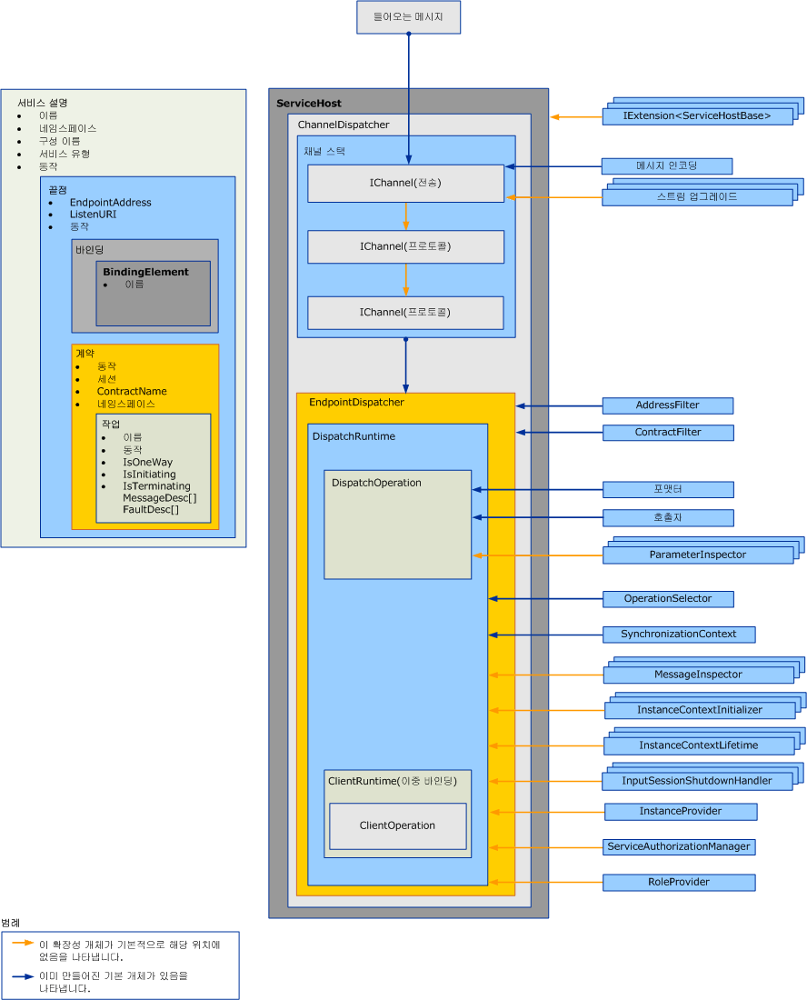

# 디스패처 확장
디스패처는 기본 채널에서 들어오는 메시지를 끌어와서 응용 프로그램 코드에서 이를 메서드 호출로 변환하여 결과를 다시 호출자에게 보내는 역할을 합니다. 디스패처 확장을 사용하여 이 처리를 수정할 수 있습니다.  메시지의 내용 또는 매개 변수를 검사하거나 수정하는 메시지 또는 매개 변수 검사자를 구현할 수 있습니다.  메시지가 작업으로 라우트되는 방식을 변경하거나 일부 다른 기능을 제공할 수 있습니다.  
  
 이 항목에서는 <xref:System.ServiceModel.Dispatcher.DispatchRuntime> 서비스 응용 프로그램에서 <xref:System.ServiceModel.Dispatcher.DispatchOperation> 및 [!INCLUDE[indigo1](../../../../includes/indigo1-md.md)] 클래스를 사용하여 디스패처의 기본 실행 동작을 수정하는 방법과 메시지, 매개 변수 또는 반환 값을 채널 계층에서 보내거나 검색하기 이전 또는 이후에 이를 가로채거나 수정하는 방법에 대해 설명합니다. 해당 하는 클라이언트 런타임 메시지를 처리 하는 방법에 대 한 자세한 내용은 참조 [클라이언트 확장](../../../../docs/framework/wcf/extending/extending-clients.md)합니다. 역할을 이해 하는 <xref:System.ServiceModel.IExtensibleObject%601> 형식 다양 한 런타임 사용자 지정 개체 사이 공유 상태를 액세스 하는 동안 재생, 참조 [확장 가능한 개체](../../../../docs/framework/wcf/extending/extensible-objects.md)합니다.  
  
## 디스패처  
 일반적으로 채널 계층으로 불리는 서비스 모델 계층을 통해 개발자의 프로그래밍 모델과 기본 메시지 교환 간의 변환이 수행됩니다. [!INCLUDE[indigo2](../../../../includes/indigo2-md.md)]에서 채널 및 끝점 디스패처(각각 <xref:System.ServiceModel.Dispatcher.ChannelDispatcher> 및 <xref:System.ServiceModel.Dispatcher.EndpointDispatcher>)는 새로운 채널을 허용하고 메시지, 작업 디스패치 및 호출을 수신하며 응답 처리를 담당하는 서비스 구성 요소입니다. 디스패처 개체는 수신자 개체이지만, 이중 서비스에서의 콜백 계약 구현에서도 검사, 수정 또는 확장을 위해 디스패처 개체를 노출합니다.  
  
 채널 디스패처(및 도우미 <xref:System.ServiceModel.Channels.IChannelListener>)는 기본 채널에서 메시지를 가져와 각 끝점 디스패처에 메시지를 전달합니다. 각 끝점 디스패처에는 작업을 구현하는 메서드를 호출하는 <xref:System.ServiceModel.Dispatcher.DispatchRuntime>에 메시지를 라우트하는 <xref:System.ServiceModel.Dispatcher.DispatchOperation>이 있습니다. 방식에 따라 다양한 선택적 확장 클래스와 필수 확장 클래스가 호출됩니다. 이 항목에서는 이러한 항목들이 연결되는 방법 및 속성을 수정하고 자체 코드를 연결하여 기본 기능을 확장하는 방법에 대해 설명합니다.  
  
 디스패처 속성 및 수정된 사용자 지정 개체는 서비스, 끝점, 계약 또는 작업 동작 개체를 사용하여 삽입합니다. 이 항목에서는 동작 사용 방법에 대해서는 설명하지 않습니다. 디스패처 수정을 삽입 하는 데 사용 되는 형식에 대 한 자세한 내용은 참조 [구성 하 고 런타임 동작을 확장](../../../../docs/framework/wcf/extending/configuring-and-extending-the-runtime-with-behaviors.md)합니다.  
  
 다음 그래픽에서는 서비스의 아키텍처 항목에 대해 간략하게 보여 줍니다.  
  
   
  
### 채널 디스패처  
 <xref:System.ServiceModel.Dispatcher.ChannelDispatcher> 개체는 특정 URI(수신 대기 URI)에서 <xref:System.ServiceModel.Channels.IChannelListener>를 서비스의 인스턴스와 연결하기 위해 만들어집니다. 각 <xref:System.ServiceModel.ServiceHost> 개체에는 여러 개의 <xref:System.ServiceModel.Dispatcher.ChannelDispatcher> 개체가 포함될 수 있으며, 각 개체는 단 하나의 수신기와 수신 대기 URI에 연결됩니다. 메시지가 도착하면 <xref:System.ServiceModel.Dispatcher.ChannelDispatcher>는 연관된 각 <xref:System.ServiceModel.Dispatcher.EndpointDispatcher> 개체에 쿼리하여 끝점에서 메시지를 수락할 수 있는지 여부를 확인한 다음 수락할 수 있는 끝점에 메시지를 전달합니다.  
  
 채널 세션의 수명과 동작을 제어하는 모든 속성을 사용하여 <xref:System.ServiceModel.Dispatcher.ChannelDispatcher> 개체를 검사하거나 수정할 수 있습니다. 여기에는 사용자 지정 채널 이니셜라이저, 채널 수신기, 호스트, 관련 <xref:System.ServiceModel.InstanceContext> 등이 포함됩니다.  
  
### 끝점 디스패처  
 메시지의 대상 주소가 <xref:System.ServiceModel.Dispatcher.EndpointDispatcher>와 일치하고 메시지 동작이 <xref:System.ServiceModel.Dispatcher.ChannelDispatcher> 속성과 일치하면 <xref:System.ServiceModel.Dispatcher.EndpointDispatcher.AddressFilter%2A> 개체는 <xref:System.ServiceModel.Dispatcher.EndpointDispatcher.ContractFilter%2A>의 메시지를 처리합니다. 두 <xref:System.ServiceModel.Dispatcher.EndpointDispatcher> 개체가 메시지를 수락할 수 있는 경우 <xref:System.ServiceModel.Dispatcher.EndpointDispatcher.FilterPriority%2A> 속성 값에 따라 우선 순위가 높은 끝점이 결정됩니다.  
  
 디스패처의 처리를 사용자 지정하는 데 사용할 수 있는 두 개의 기본 서비스 모델 확장 지점(<xref:System.ServiceModel.Dispatcher.EndpointDispatcher> 및 <xref:System.ServiceModel.Dispatcher.DispatchRuntime> 클래스)을 가져오려면 <xref:System.ServiceModel.Dispatcher.DispatchOperation>를 사용합니다. <xref:System.ServiceModel.Dispatcher.DispatchRuntime> 클래스를 사용하면, 계약 범위(즉, 계약의 모든 메시지)에서 디스패처를 가로채고 확장할 수 있습니다. 그리고 <xref:System.ServiceModel.Dispatcher.DispatchOperation> 클래스를 사용하면, 작업 범위(즉, 작업의 모든 메시지)에서 디스패처를 가로채고 확장할 수 있습니다.  
  
## 시나리오  
 디스패처를 확장하는 데에는 다음과 같은 여러 가지 이유가 있습니다.  
  
-   사용자 지정 메시지 유효성 확인. 메시지가 특정 스키마에 유효하도록 지정할 수 있습니다. 이 작업은 메시지 인터셉터 인터페이스를 구현하여 수행할 수 있습니다. 예를 들어 참조 [메시지 검사자](../../../../docs/framework/wcf/samples/message-inspectors.md)합니다.  
  
-   사용자 지정 메시지 로깅. 끝점을 통해 이동하는 응용 프로그램 메시지의 일부를 검사하고 기록할 수 있습니다. 이 작업도 메시지 인터셉터 인터페이스를 통해 수행할 수 있습니다.  
  
-   사용자 지정 메시지 변환. 런타임에 메시지에 특정 변환을 적용할 수 있습니다(예: 버전 관리). 이 작업도 메시지 인터셉터 인터페이스를 통해 수행할 수 있습니다.  
  
-   사용자 지정 데이터 모델. [!INCLUDE[indigo2](../../../../includes/indigo2-md.md)]에서 기본적으로 지원되는 데이터 serialization 모델(즉, <xref:System.Runtime.Serialization.DataContractSerializer?displayProperty=nameWithType>, <xref:System.Xml.Serialization.XmlSerializer?displayProperty=nameWithType> 및 원시 메시지) 이외의 데이터 serialization 모델을 사용할 수 있습니다. 이 작업은 메시지 포맷터 인터페이스를 구현하여 수행할 수 있습니다. 예를 들어 참조 [작업 포맷터와 작업 선택기](../../../../docs/framework/wcf/samples/operation-formatter-and-operation-selector.md)합니다.  
  
-   사용자 지정 매개 변수 유효성 검사. XML 형식이 아닌 다른 형식의 매개 변수가 유효하도록 지정할 수 있습니다. 이 작업은 매개 변수 검사자 인터페이스를 사용하여 수행할 수 있습니다.  
  
-   사용자 지정 작업 디스패치. 동작 이외의 다른 요소, 예를 들면 본문 요소나 사용자 지정 메시지 속성에 대한 디스패치를 구현할 수 있습니다. 이 작업은 <xref:System.ServiceModel.Dispatcher.IDispatchOperationSelector> 인터페이스를 사용하여 수행할 수 있습니다. 예를 들어 참조 [작업 포맷터와 작업 선택기](../../../../docs/framework/wcf/samples/operation-formatter-and-operation-selector.md)합니다.  
  
-   개체 풀링. 모든 호출에 새 인스턴스를 할당하는 대신 인스턴스를 풀링할 수 있습니다. 이 작업은 인스턴스 공급자 인터페이스를 사용하여 구현할 수 있습니다. 예를 들어 참조 [풀링](../../../../docs/framework/wcf/samples/pooling.md)합니다.  
  
-   인스턴스 대여. .NET Framework Remoting의 대여 패턴과 유사한, 인스턴스 수명에 대한 대여 패턴을 구현할 수 있습니다. 이 작업은 인스턴스 컨텍스트 수명 인터페이스를 사용하여 수행할 수 있습니다.  
  
-   사용자 지정 오류 처리. 로컬 오류를 처리하는 방법 및 오류에 대해 클라이언트에 다시 통신하는 방법을 제어할 수 있습니다. 이 작업은 <xref:System.ServiceModel.Dispatcher.IErrorHandler> 인터페이스를 사용하여 구현할 수 있습니다.  
  
-   사용자 지정 권한 부여 동작. 계약 또는 작업 런타임 부분을 확장하고 메시지에 있는 토큰에 따라 보안 검사를 추가하여 사용자 지정 액세스 제어를 구현할 수 있습니다. 이 작업은 메시지 인터셉터 또는 매개 변수 인터셉터 인터페이스를 사용하여 수행할 수 있습니다. 예제를 보려면 [보안 확장성](../../../../docs/framework/wcf/samples/security-extensibility.md)합니다.  
  
    > [!CAUTION]
    >  보안 속성을 변경하면 [!INCLUDE[indigo2](../../../../includes/indigo2-md.md)] 응용 프로그램의 보안을 잠재적으로 해칠 수 있으므로, 보안과 관련된 수정 작업은 주의해서 수행하고 배포 전에 철저하게 테스트하는 것이 좋습니다.  
  
-   사용자 지정 WCF 런타임 유효성 검사기. 서비스, 계약 및 바인딩을 검사하는 사용자 지정 유효성 검사기를 설치하여 [!INCLUDE[indigo2](../../../../includes/indigo2-md.md)] 응용 프로그램에 대해 엔터프라이즈 수준의 정책을 적용할 수 있습니다. (예를 들어 참조 [하는 방법: 엔터프라이즈에서 끝점 아래로 잠금](../../../../docs/framework/wcf/extending/how-to-lock-down-endpoints-in-the-enterprise.md).)  
  
### DispatchRuntime 클래스 사용  
 서비스나 개별 끝점의 기본 동작을 수정하거나 다음 서비스 프로세스(또는 이중 클라이언트의 경우 클라이언트 프로세스) 중 하나 또는 모두에 대해 사용자 지정 수정 작업을 구현하는 개체를 삽입하려면 <xref:System.ServiceModel.Dispatcher.DispatchRuntime> 클래스를 사용합니다.  
  
-   들어오는 메시지를 개체로 변환하고 이러한 개체를 서비스 개체에 대한 메서드 호출로 해제  
  
-   서비스 작업 호출에 대한 응답에서 수신한 개체를 아웃바운드 메시지로 변환  
  
 <xref:System.ServiceModel.Dispatcher.DispatchRuntime>을 사용하면 메시지가 인식되지 않는 경우에도 특정 계약을 통해 모든 메시지에 대한 채널 또는 끝점 디스패처를 가로채서 확장할 수 있습니다. 계약에 선언된 메시지와 일치하지 않는 메시지가 도착하면 이 메시지는 <xref:System.ServiceModel.Dispatcher.DispatchRuntime.UnhandledDispatchOperation%2A> 속성에 의해 반환된 작업에 디스패치됩니다. 특정 작업에 대한 모든 메시지를 가로채거나 확장하려면 <xref:System.ServiceModel.Dispatcher.DispatchOperation> 클래스를 참조하세요.  
  
 <xref:System.ServiceModel.Dispatcher.DispatchRuntime> 클래스에 의해 노출되는 디스패처 확장성의 네 가지 기본 영역은 다음과 같습니다.  
  
1.  채널 구성 요소에서는 <xref:System.ServiceModel.Dispatcher.DispatchRuntime> 속성 및 <xref:System.ServiceModel.Dispatcher.DispatchRuntime.ChannelDispatcher%2A> 속성에서 반환하는 연관된 채널 디스패처의 속성을 사용하여 채널 디스패처가 채널을 허용하고 닫는 방법을 사용자 지정합니다. 이 범주에는 <xref:System.ServiceModel.Dispatcher.ChannelDispatcher.ChannelInitializers%2A> 및 <xref:System.ServiceModel.Dispatcher.DispatchRuntime.InputSessionShutdownHandlers%2A> 속성이 포함됩니다.  
  
2.  메시지 구성 요소는 처리되는 메시지별로 사용자 지정됩니다. 이 범주에는 <xref:System.ServiceModel.Dispatcher.DispatchRuntime.MessageInspectors%2A>, <xref:System.ServiceModel.Dispatcher.DispatchRuntime.OperationSelector%2A>, <xref:System.ServiceModel.Dispatcher.DispatchRuntime.Operations%2A> 및 <xref:System.ServiceModel.Dispatcher.ChannelDispatcher.ErrorHandlers%2A> 속성이 포함됩니다.  
  
3.  인스턴스 구성 요소는 해당 서비스 형식 인스턴스의 생성, 수명, 삭제를 사용자 지정합니다. 서비스 개체 수명에 대한 자세한 내용은 <xref:System.ServiceModel.ServiceBehaviorAttribute.InstanceContextMode%2A> 속성을 참조하세요. 이 범주에는 <xref:System.ServiceModel.Dispatcher.DispatchRuntime.InstanceContextInitializers%2A> 및 <xref:System.ServiceModel.Dispatcher.DispatchRuntime.InstanceProvider%2A> 속성이 포함됩니다.  
  
4.  보안 관련 구성 요소는 다음과 같은 속성을 사용할 수 있습니다.  
  
    -   <xref:System.ServiceModel.Dispatcher.DispatchRuntime.SecurityAuditLogLocation%2A>은 감사 이벤트가 작성되는 위치를 나타냅니다.  
  
    -   <xref:System.ServiceModel.Dispatcher.DispatchRuntime.ImpersonateCallerForAllOperations%2A>는 들어오는 메시지가 제공하는 자격 증명을 사용하여 서비스가 가장을 시도하는지 여부를 제어합니다.  
  
    -   <xref:System.ServiceModel.Dispatcher.DispatchRuntime.MessageAuthenticationAuditLevel%2A>은 성공적인 메시지 권한 부여 이벤트가 <xref:System.ServiceModel.Dispatcher.DispatchRuntime.SecurityAuditLogLocation%2A>에서 지정된 이벤트 로그에 작성되는지 여부를 제어합니다.  
  
    -   <xref:System.ServiceModel.Dispatcher.DispatchRuntime.PrincipalPermissionMode%2A>는 <xref:System.Threading.Thread.CurrentPrincipal%2A> 속성을 설정하는 방법을 제어합니다.  
  
    -   <xref:System.ServiceModel.Dispatcher.DispatchRuntime.ServiceAuthorizationAuditLevel%2A>은 권한 부여 이벤트에 대한 감사를 수행하는 방법을 지정합니다.  
  
    -   <xref:System.ServiceModel.Dispatcher.DispatchRuntime.SuppressAuditFailure%2A>는 로깅 프로세스 중에 발생하는 중요하지 않은 예외가 표시되지 않도록 할지 여부를 지정합니다.  
  
 일반적으로 사용자 지정 확장 개체는 <xref:System.ServiceModel.Dispatcher.DispatchRuntime> 속성에 할당되거나 서비스 동작(<xref:System.ServiceModel.Description.IServiceBehavior>를 구현하는 개체), 계약 동작(<xref:System.ServiceModel.Description.IContractBehavior>를 구현하는 개체) 또는 끝점 동작(<xref:System.ServiceModel.Description.IEndpointBehavior>를 구현하는 개체)에 의해 컬렉션에 삽입됩니다. 그런 다음 프로그래밍 방식을 사용하거나 사용자 지정 <xref:System.ServiceModel.Configuration.BehaviorExtensionElement> 개체를 구현하여 설치 동작 개체를 해당 동작 컬렉션에 추가하므로, 응용 프로그램 구성 파일을 사용하여 동작을 삽입할 수 있습니다.  
  
 이중 클라이언트(이중 서비스에서 지정한 콜백 계약을 구현하는 클라이언트)도 <xref:System.ServiceModel.Dispatcher.DispatchRuntime> 속성을 사용하여 액세스할 수 있는 <xref:System.ServiceModel.Dispatcher.ClientRuntime.CallbackDispatchRuntime%2A> 개체를 가질 수 있습니다.  
  
### DispatchOperation 클래스 사용  
 <xref:System.ServiceModel.Dispatcher.DispatchOperation> 클래스는 하나의 서비스 작업으로만 범위가 제한된 사용자 지정 확장에 대한 삽입 지점 및 런타임 수정 내용에 대한 위치입니다. 계약의 모든 메시지에 대한 서비스 런타임 동작을 수정하려면 <xref:System.ServiceModel.Dispatcher.DispatchRuntime> 클래스를 사용합니다.  
  
 사용자 지정 서비스 동작 개체를 사용하여 <xref:System.ServiceModel.Dispatcher.DispatchOperation> 수정 내용을 설치합니다.  
  
 특정 서비스 작업을 나타내는 <xref:System.ServiceModel.Dispatcher.DispatchRuntime.Operations%2A> 개체를 찾으려면 <xref:System.ServiceModel.Dispatcher.DispatchOperation> 속성을 사용합니다.  
  
 다음 속성에서는 작업 수준에서 런타임 실행을 제어합니다.  
  
-   <xref:System.ServiceModel.Dispatcher.DispatchOperation.Action%2A>, <xref:System.ServiceModel.Dispatcher.DispatchOperation.ReplyAction%2A>, <xref:System.ServiceModel.Dispatcher.DispatchOperation.FaultContractInfos%2A>, <xref:System.ServiceModel.Dispatcher.DispatchOperation.IsOneWay%2A>, <xref:System.ServiceModel.Dispatcher.DispatchOperation.IsTerminating%2A> 및 <xref:System.ServiceModel.Dispatcher.DispatchOperation.Name%2A> 속성은 작업에 대해 해당하는 값을 가져옵니다.  
  
-   <xref:System.ServiceModel.Dispatcher.DispatchOperation.TransactionAutoComplete%2A> 및 <xref:System.ServiceModel.Dispatcher.DispatchOperation.TransactionRequired%2A>는 트랜잭션 동작을 지정합니다.  
  
-   <xref:System.ServiceModel.Dispatcher.DispatchOperation.ReleaseInstanceBeforeCall%2A> 및 <xref:System.ServiceModel.Dispatcher.DispatchOperation.ReleaseInstanceAfterCall%2A> 속성은 <xref:System.ServiceModel.InstanceContext>를 기준으로 사용자 정의 서비스 개체의 수명을 제어합니다.  
  
-   <xref:System.ServiceModel.Dispatcher.DispatchOperation.DeserializeRequest%2A>, <xref:System.ServiceModel.Dispatcher.DispatchOperation.SerializeReply%2A> 및 <xref:System.ServiceModel.Dispatcher.DispatchOperation.Formatter%2A> 속성을 사용하면 메시지에서 개체로 또는 개체에서 메시지로의 변환에 대해 명시적으로 제어할 수 있습니다.  
  
-   <xref:System.ServiceModel.Dispatcher.DispatchOperation.Impersonation%2A> 속성은 작업 가장 수준을 지정합니다.  
  
-   <xref:System.ServiceModel.Dispatcher.DispatchOperation.CallContextInitializers%2A> 속성은 작업에 대한 사용자 지정 호출 컨텍스트 확장을 삽입합니다.  
  
-   <xref:System.ServiceModel.Dispatcher.DispatchOperation.AutoDisposeParameters%2A> 속성은 매개 변수 개체가 삭제되는 시점을 제어합니다.  
  
-   사용자 지정 호출자 개체를 삽입하는 <xref:System.ServiceModel.Dispatcher.DispatchOperation.Invoker%2A> 속성입니다.  
  
-   <xref:System.ServiceModel.Dispatcher.DispatchOperation.ParameterInspectors%2A> 속성을 사용하면 매개 변수와 반환 값을 검사하거나 수정하는 데 사용할 수 있는 사용자 지정 매개 변수 검사자를 삽입할 수 있습니다.  
  
## 참고 항목  
 <xref:System.ServiceModel.Dispatcher.DispatchRuntime>  
 <xref:System.ServiceModel.Dispatcher.DispatchOperation>  
 [방법: 서비스에서 메시지 검사 및 수정](../../../../docs/framework/wcf/extending/how-to-inspect-and-modify-messages-on-the-service.md)  
 [방법: 매개 변수 검사 또는 수정](../../../../docs/framework/wcf/extending/how-to-inspect-or-modify-parameters.md)  
 [방법: 엔터프라이즈에서 끝점 잠그기](../../../../docs/framework/wcf/extending/how-to-lock-down-endpoints-in-the-enterprise.md)
