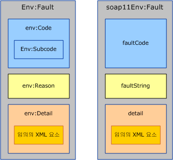
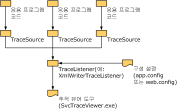

# <a name="handling-exceptions-and-faults"></a><span data-ttu-id="bee67-102">예외 및 오류 처리</span><span class="sxs-lookup"><span data-stu-id="bee67-102">Handling Exceptions and Faults</span></span>
<span data-ttu-id="bee67-103">예외는 서비스 또는 클라이언트 구현 내에서 로컬 오류 통신에 사용됩니다.</span><span class="sxs-lookup"><span data-stu-id="bee67-103">Exceptions are used to communicate errors locally within the service or the client implementation.</span></span> <span data-ttu-id="bee67-104">이와 반대로 오류는 서버에서 클라이언트로 또는 그 반대로 가는 경우와 같이 서비스 경계 너머로 이루어지는 오류 통신에도 사용되는 말입니다.</span><span class="sxs-lookup"><span data-stu-id="bee67-104">Faults, on the other hand, are used to communicate errors across service boundaries, such as from the server to the client or vice versa.</span></span> <span data-ttu-id="bee67-105">오류 외에, 전송 채널에서 전송별 메커니즘을 사용하여 전송 수준의 오류 통신을 수행하는 경우도 많습니다.</span><span class="sxs-lookup"><span data-stu-id="bee67-105">In addition to faults, transport channels often use transport-specific mechanisms to communicate transport-level errors.</span></span> <span data-ttu-id="bee67-106">예를 들어 HTTP 전송에서는 404 등의 상태 코드를 사용하여 끝점 URL이 없는 경우(오류를 다시 보낼 끝점이 없음)를 나타냅니다.</span><span class="sxs-lookup"><span data-stu-id="bee67-106">For example, HTTP transport uses status codes such as 404 to communicate a non-existing endpoint URL (there is no endpoint to send back a fault).</span></span> <span data-ttu-id="bee67-107">이 문서는 사용자 지정 채널 작성자를 위한 안내 자료를 제공하는 세 개의 단원으로 구성되어 있습니다.</span><span class="sxs-lookup"><span data-stu-id="bee67-107">This document consists of three sections that provide guidance to custom channel authors.</span></span> <span data-ttu-id="bee67-108">첫 단원에서는 예외를 정의하고 throw하는 방법에 대한 안내 자료를 제공합니다.</span><span class="sxs-lookup"><span data-stu-id="bee67-108">The first section provides guidance on when and how to define and throw exceptions.</span></span> <span data-ttu-id="bee67-109">둘째 단원에서는 오류 생성 및 소비에 대한 안내 자료를 제공합니다.</span><span class="sxs-lookup"><span data-stu-id="bee67-109">The second section provides guidance around generating and consuming faults.</span></span> <span data-ttu-id="bee67-110">셋째 단원에서는 추적 정보를 제공하여 사용자 지정 채널 사용자의 응용 프로그램 실행 문제 해결을 돕는 방법에 대해 설명합니다.</span><span class="sxs-lookup"><span data-stu-id="bee67-110">The third section explains how to provide trace information to aid the user of your custom channel in troubleshooting running applications.</span></span>  
  
## <a name="exceptions"></a><span data-ttu-id="bee67-111">예외</span><span class="sxs-lookup"><span data-stu-id="bee67-111">Exceptions</span></span>  
 <span data-ttu-id="bee67-112">예외를 throw할 경우 두 가지를 염두에 두어야 합니다. 첫째, 사용자가 예외에 적절하게 반응하는 정확한 코드를 쓸 수 있는 형식이어야 합니다.</span><span class="sxs-lookup"><span data-stu-id="bee67-112">There are two things to keep in mind when throwing an exception: First it has to be of a type that allows users to write correct code that can react appropriately to the exception.</span></span> <span data-ttu-id="bee67-113">둘째, 잘못된 것이 무엇이고, 실패의 영향은 무엇이며, 문제를 해결하는 방법이 무엇인지 사용자가 이해하기에 충분한 정보를 제공해야 합니다.</span><span class="sxs-lookup"><span data-stu-id="bee67-113">Second, it has to provide enough information for the user to understand what went wrong, the failure impact, and how to fix it.</span></span> <span data-ttu-id="bee67-114">다음 단원에서는 [!INCLUDE[indigo1](../../../../includes/indigo1-md.md)] 채널의 예외 형식과 메시지에 대한 안내 자료를 제공합니다.</span><span class="sxs-lookup"><span data-stu-id="bee67-114">The following sections give guidance around exception types and messages for [!INCLUDE[indigo1](../../../../includes/indigo1-md.md)] channels.</span></span> <span data-ttu-id="bee67-115">.NET의 예외 디자인 지침 문서에도 예외에 대한 일반적인 안내 자료가 있습니다.</span><span class="sxs-lookup"><span data-stu-id="bee67-115">There is also general guidance around exceptions in .NET in the Design Guidelines for Exceptions document.</span></span>  
  
### <a name="exception-types"></a><span data-ttu-id="bee67-116">예외 형식</span><span class="sxs-lookup"><span data-stu-id="bee67-116">Exception Types</span></span>  
 <span data-ttu-id="bee67-117">채널에서 throw되는 모든 예외는 <xref:System.TimeoutException?displayProperty=nameWithType>, <xref:System.ServiceModel.CommunicationException?displayProperty=nameWithType>이거나 <xref:System.ServiceModel.CommunicationException>에서 파생된 형식이어야 합니다.</span><span class="sxs-lookup"><span data-stu-id="bee67-117">All exceptions thrown by channels must be either a <xref:System.TimeoutException?displayProperty=nameWithType>, <xref:System.ServiceModel.CommunicationException?displayProperty=nameWithType>, or a type derived from <xref:System.ServiceModel.CommunicationException>.</span></span> <span data-ttu-id="bee67-118"><xref:System.ObjectDisposedException> 등의 예외도 throw될 수 있지만 이는 오직 호출 코드에서 채널을 잘못 사용한 것을 나타내기 위한 것입니다.</span><span class="sxs-lookup"><span data-stu-id="bee67-118">(Exceptions such as <xref:System.ObjectDisposedException> may also be thrown, but only to indicate that the calling code has misused the channel.</span></span> <span data-ttu-id="bee67-119">채널이 올바르게 사용된 경우 지정된 예외를 throw해야 합니다.) [!INCLUDE[indigo2](../../../../includes/indigo2-md.md)]는 <xref:System.ServiceModel.CommunicationException>에서 파생되고 채널에서 사용하도록 설계된 일곱 가지 예외 형식을 제공합니다.</span><span class="sxs-lookup"><span data-stu-id="bee67-119">If a channel is used correctly, it must only throw the given exceptions.) [!INCLUDE[indigo2](../../../../includes/indigo2-md.md)] provides seven exception types that derive from <xref:System.ServiceModel.CommunicationException> and are designed to be used by channels.</span></span> <span data-ttu-id="bee67-120"><xref:System.ServiceModel.CommunicationException>에서 파생되며 시스템의 다른 부분에서 사용하도록 디자인된 다른 예외도 있습니다.</span><span class="sxs-lookup"><span data-stu-id="bee67-120">There are other <xref:System.ServiceModel.CommunicationException>-derived exceptions that are designed to be used by other parts of the system.</span></span> <span data-ttu-id="bee67-121">예외 형식은 다음과 같습니다.</span><span class="sxs-lookup"><span data-stu-id="bee67-121">These exception types are:</span></span>  
  
|<span data-ttu-id="bee67-122">예외 형식</span><span class="sxs-lookup"><span data-stu-id="bee67-122">Exception Type</span></span>|<span data-ttu-id="bee67-123">의미</span><span class="sxs-lookup"><span data-stu-id="bee67-123">Meaning</span></span>|<span data-ttu-id="bee67-124">내부 예외 콘텐츠</span><span class="sxs-lookup"><span data-stu-id="bee67-124">Inner Exception Content</span></span>|<span data-ttu-id="bee67-125">복구 전략</span><span class="sxs-lookup"><span data-stu-id="bee67-125">Recovery Strategy</span></span>|  
|--------------------|-------------|-----------------------------|-----------------------|  
|<xref:System.ServiceModel.AddressAlreadyInUseException>|<span data-ttu-id="bee67-126">수신용으로 지정된 끝점 주소가 이미 사용 중입니다.</span><span class="sxs-lookup"><span data-stu-id="bee67-126">The endpoint address specified for listening is already in use.</span></span>|<span data-ttu-id="bee67-127">있는 경우 이 예외를 일으킨 전송 오류에 대한 세부 정보를 더 제공합니다.</span><span class="sxs-lookup"><span data-stu-id="bee67-127">If present, provides more details about the transport error that caused this exception.</span></span> <span data-ttu-id="bee67-128">예를 들면 다음과 같습니다.</span><span class="sxs-lookup"><span data-stu-id="bee67-128">For example.</span></span> <span data-ttu-id="bee67-129"><xref:System.IO.PipeException>, <xref:System.Net.HttpListenerException> 또는 <xref:System.Net.Sockets.SocketException>.</span><span class="sxs-lookup"><span data-stu-id="bee67-129"><xref:System.IO.PipeException>, <xref:System.Net.HttpListenerException>, or <xref:System.Net.Sockets.SocketException>.</span></span>|<span data-ttu-id="bee67-130">다른 주소를 지정하십시오.</span><span class="sxs-lookup"><span data-stu-id="bee67-130">Try a different address.</span></span>|  
|<xref:System.ServiceModel.AddressAccessDeniedException>|<span data-ttu-id="bee67-131">프로세스에 수신용으로 지정된 끝점 주소에 대한 액세스가 허용되지 않습니다.</span><span class="sxs-lookup"><span data-stu-id="bee67-131">The process is not allowed access to the endpoint address specified for listening.</span></span>|<span data-ttu-id="bee67-132">있는 경우 이 예외를 일으킨 전송 오류에 대한 세부 정보를 더 제공합니다.</span><span class="sxs-lookup"><span data-stu-id="bee67-132">If present, provides more details about the transport error that caused this exception.</span></span> <span data-ttu-id="bee67-133">예를 들면 <xref:System.IO.PipeException> 또는 <xref:System.Net.HttpListenerException>과 같습니다.</span><span class="sxs-lookup"><span data-stu-id="bee67-133">For example, <xref:System.IO.PipeException>, or <xref:System.Net.HttpListenerException>.</span></span>|<span data-ttu-id="bee67-134">다른 자격 증명으로 시도해 보십시오.</span><span class="sxs-lookup"><span data-stu-id="bee67-134">Try with different credentials.</span></span>|  
|<xref:System.ServiceModel.CommunicationObjectFaultedException>|<span data-ttu-id="bee67-135"><xref:System.ServiceModel.ICommunicationObject> Faulted 상태에서는 사용 되 고 (자세한 내용은 참조 [상태 변경 이해](../../../../docs/framework/wcf/extending/understanding-state-changes.md)).</span><span class="sxs-lookup"><span data-stu-id="bee67-135">The <xref:System.ServiceModel.ICommunicationObject> being used is in the Faulted state (for more information, see [Understanding State Changes](../../../../docs/framework/wcf/extending/understanding-state-changes.md)).</span></span> <span data-ttu-id="bee67-136">개체에서 보류 중인 호출이 여러 개인 경우에는 한 호출에서만 실패와 관련된 예외가 throw되며, 나머지 호출에서는 <xref:System.ServiceModel.CommunicationObjectFaultedException>이 throw됩니다.</span><span class="sxs-lookup"><span data-stu-id="bee67-136">Note that when an object with multiple pending calls transitions to the Faulted state, only one call throws an exception that is related to the failure and the rest of the calls throw a <xref:System.ServiceModel.CommunicationObjectFaultedException>.</span></span> <span data-ttu-id="bee67-137">이 예외는 보통 응용 프로그램에서 예외를 간과하고 이미 실패한 개체를 사용하려는 경우에 throw되며, 원래 예외를 catch한 것과 다른 스레드에서 일어나는 경우가 많습니다.</span><span class="sxs-lookup"><span data-stu-id="bee67-137">This exception is typically thrown because an application overlooks some exception and tries to use an already faulted object, possibly on a thread other than the one that caught the original exception.</span></span>|<span data-ttu-id="bee67-138">있는 경우 내부 예외에 대한 세부 정보를 제공합니다.</span><span class="sxs-lookup"><span data-stu-id="bee67-138">If present provides details about the inner exception.</span></span>|<span data-ttu-id="bee67-139">새 개체를 만듭니다.</span><span class="sxs-lookup"><span data-stu-id="bee67-139">Create a new object.</span></span> <span data-ttu-id="bee67-140">처음에 <xref:System.ServiceModel.ICommunicationObject>의 오류를 일으킨 것이 무엇인지에 따라 다른 복구 작업이 필요할 수도 있습니다.</span><span class="sxs-lookup"><span data-stu-id="bee67-140">Note that depending on what caused the <xref:System.ServiceModel.ICommunicationObject> to fault in the first place, there may be other work required to recover.</span></span>|  
|<xref:System.ServiceModel.CommunicationObjectAbortedException>|<span data-ttu-id="bee67-141"><xref:System.ServiceModel.ICommunicationObject> 사용이 중단 되었습니다 (자세한 내용은 참조 [상태 변경 이해](../../../../docs/framework/wcf/extending/understanding-state-changes.md)).</span><span class="sxs-lookup"><span data-stu-id="bee67-141">The <xref:System.ServiceModel.ICommunicationObject> being used has been Aborted (for more information, see [Understanding State Changes](../../../../docs/framework/wcf/extending/understanding-state-changes.md)).</span></span> <span data-ttu-id="bee67-142"><xref:System.ServiceModel.CommunicationObjectFaultedException>과 마찬가지로, 이 예외는 응용 프로그램에서 개체에 대해 <xref:System.ServiceModel.ICommunicationObject.Abort%2A>를 호출했으며 따라서 개체를 더 이상 사용할 수 없는 경우를 나타냅니다. 이러한 호출은 다른 스레드에서 이루어지는 경우도 많습니다.</span><span class="sxs-lookup"><span data-stu-id="bee67-142">Similar to <xref:System.ServiceModel.CommunicationObjectFaultedException>, his exception indicates the application has called <xref:System.ServiceModel.ICommunicationObject.Abort%2A> on the object, possibly from another thread, and the object is no longer usable for that reason.</span></span>|<span data-ttu-id="bee67-143">있는 경우 내부 예외에 대한 세부 정보를 제공합니다.</span><span class="sxs-lookup"><span data-stu-id="bee67-143">If present provides details about the inner exception.</span></span>|<span data-ttu-id="bee67-144">새 개체를 만듭니다.</span><span class="sxs-lookup"><span data-stu-id="bee67-144">Create a new object.</span></span> <span data-ttu-id="bee67-145">처음에 <xref:System.ServiceModel.ICommunicationObject>의 중단을 일으킨 것이 무엇인지에 따라 다른 복구 작업이 필요할 수도 있습니다.</span><span class="sxs-lookup"><span data-stu-id="bee67-145">Note that depending on what caused the <xref:System.ServiceModel.ICommunicationObject> to abort in the first place, there may be other work required to recover.</span></span>|  
|<xref:System.ServiceModel.EndpointNotFoundException>|<span data-ttu-id="bee67-146">대상 원격 끝점이 수신 대기 상태가 아닙니다.</span><span class="sxs-lookup"><span data-stu-id="bee67-146">The target remote endpoint is not listening.</span></span> <span data-ttu-id="bee67-147">이는 끝점 주소에 잘못된 부분이 있거나, 주소를 확인할 수 없거나, 끝점이 다운된 경우에 발생할 수 있습니다.</span><span class="sxs-lookup"><span data-stu-id="bee67-147">This can result from any part of the endpoint address being incorrect, irresolvable, or the endpoint being down.</span></span> <span data-ttu-id="bee67-148">예로는 DNS 오류, 큐 관리자를 사용할 수 없는 경우, 그리고 서비스가 실행되지 않는 경우가 포함됩니다.</span><span class="sxs-lookup"><span data-stu-id="bee67-148">Examples include DNS error, Queue Manager not available, and service not running.</span></span>|<span data-ttu-id="bee67-149">내부 예외는 세부 정보(일반적으로 기본 전송에 대한 정보)를 제공합니다.</span><span class="sxs-lookup"><span data-stu-id="bee67-149">The inner exception provides details, typically from the underlying transport.</span></span>|<span data-ttu-id="bee67-150">다른 주소를 지정하십시오.</span><span class="sxs-lookup"><span data-stu-id="bee67-150">Try a different address.</span></span> <span data-ttu-id="bee67-151">또는 서비스가 다운된 경우 발신자가 잠시 기다렸다가 다시 시도할 수도 있습니다.</span><span class="sxs-lookup"><span data-stu-id="bee67-151">Alternatively, the sender may wait a while and try again in case the service was down</span></span>|  
|<xref:System.ServiceModel.ProtocolException>|<span data-ttu-id="bee67-152">끝점의 정책에 설명된 통신 프로토콜이 끝점 사이에서 일치하지 않습니다.</span><span class="sxs-lookup"><span data-stu-id="bee67-152">The communication protocols, as described by the endpoint’s policy, are mismatched between endpoints.</span></span> <span data-ttu-id="bee67-153">예를 들어, 프레이밍 콘텐츠 형식이 일치하지 않거나 최대 메시지 크기가 초과된 경우일 수 있습니다.</span><span class="sxs-lookup"><span data-stu-id="bee67-153">For example, framing content type mismatch or max message size exceeded.</span></span>|<span data-ttu-id="bee67-154">있는 경우 특정 프로토콜 오류에 대한 세부 정보를 더 제공합니다.</span><span class="sxs-lookup"><span data-stu-id="bee67-154">If present provides more information about the specific protocol error.</span></span> <span data-ttu-id="bee67-155">예를 들어 <xref:System.ServiceModel.QuotaExceededException>은 오류의 원인이 MaxReceivedMessageSize 초과인 경우의 내부 예외입니다.</span><span class="sxs-lookup"><span data-stu-id="bee67-155">For example, <xref:System.ServiceModel.QuotaExceededException> is the inner exception when the error cause is exceeding MaxReceivedMessageSize.</span></span>|<span data-ttu-id="bee67-156">복구: 발신자와 받는 프로토콜의 설정이 일치하는지 확인하십시오.</span><span class="sxs-lookup"><span data-stu-id="bee67-156">Recovery: Ensure sender and received protocol settings match.</span></span> <span data-ttu-id="bee67-157">여기 사용되는 방법 중 하나는 서비스 끝점의 메타데이터(정책)를 다시 가져온 다음 생성된 바인딩을 사용하여 채널을 다시 만드는 것입니다.</span><span class="sxs-lookup"><span data-stu-id="bee67-157">One way to do this is to re-import the service endpoint’s metadata (policy) and use the generated binding to recreate the channel.</span></span>|  
|<xref:System.ServiceModel.ServerTooBusyException>|<span data-ttu-id="bee67-158">원격 끝점이 수신 대기 상태이지만 메시지를 처리할 준비가 되지 않았습니다.</span><span class="sxs-lookup"><span data-stu-id="bee67-158">The remote endpoint is listening but is not prepared to process messages.</span></span>|<span data-ttu-id="bee67-159">있는 경우 내부 예외는 SOAP 오류 또는 전송 수준 오류의 세부 정보를 제공합니다.</span><span class="sxs-lookup"><span data-stu-id="bee67-159">If present, the inner Exception provides the SOAP fault or transport-level error details.</span></span>|<span data-ttu-id="bee67-160">복구: 기다렸다가 나중에 작업을 다시 시도하십시오.</span><span class="sxs-lookup"><span data-stu-id="bee67-160">Recovery: Wait and retry the operation later.</span></span>|  
|<xref:System.TimeoutException>|<span data-ttu-id="bee67-161">제한 시간을 초과하기 전에 작업을 완료하지 못했습니다.</span><span class="sxs-lookup"><span data-stu-id="bee67-161">The operation failed to complete within the timeout period.</span></span>|<span data-ttu-id="bee67-162">제한 시간에 대한 세부 정보를 제공할 수 있습니다.</span><span class="sxs-lookup"><span data-stu-id="bee67-162">May provide details about the timeout.</span></span>|<span data-ttu-id="bee67-163">기다렸다가 나중에 작업을 다시 시도하십시오.</span><span class="sxs-lookup"><span data-stu-id="bee67-163">Wait and retry the operation later.</span></span>|  
  
 <span data-ttu-id="bee67-164">지정된 유형이 기존 예외 형식 모두와 다른 특정 복구 전략에 해당되는 경우에만 새 예외 형식을 정의합니다.</span><span class="sxs-lookup"><span data-stu-id="bee67-164">Define a new exception type only if that type corresponds to a specific recovery strategy different from all of the existing exception types.</span></span> <span data-ttu-id="bee67-165">새 예외 형식을 정의하는 경우, 새 형식은 <xref:System.ServiceModel.CommunicationException> 또는 파생된 클래스 중 하나에서 파생된 것이어야 합니다.</span><span class="sxs-lookup"><span data-stu-id="bee67-165">If you do define a new exception type, it must derive from <xref:System.ServiceModel.CommunicationException> or one of its derived classes.</span></span>  
  
### <a name="exception-messages"></a><span data-ttu-id="bee67-166">예외 메시지</span><span class="sxs-lookup"><span data-stu-id="bee67-166">Exception Messages</span></span>  
 <span data-ttu-id="bee67-167">예외 메시지는 프로그램이 아닌 사용자를 대상으로 하기 때문에 사용자가 문제를 이해하고 해결하는 데 충분히 도움이 될 만한 정보를 제공해야 합니다.</span><span class="sxs-lookup"><span data-stu-id="bee67-167">Exception messages are targeted at the user not the program so they should provide sufficient information to help the user understand and solve the problem.</span></span> <span data-ttu-id="bee67-168">좋은 예외 메시지의 3가지 주요 부분은 다음과 같습니다.</span><span class="sxs-lookup"><span data-stu-id="bee67-168">The three essential parts of a good exception message are:</span></span>  
  
 <span data-ttu-id="bee67-169">발생 상황.</span><span class="sxs-lookup"><span data-stu-id="bee67-169">What happened.</span></span> <span data-ttu-id="bee67-170">사용자의 경험과 밀접한 용어를 사용하여 문제를 명확하게 설명합니다.</span><span class="sxs-lookup"><span data-stu-id="bee67-170">Provide a clear description of the problem using terms that relate to the user’s experience.</span></span> <span data-ttu-id="bee67-171">예를 들어, 잘못된 예외 메시지의 예로는 "잘못된 구성 섹션"이 있습니다.</span><span class="sxs-lookup"><span data-stu-id="bee67-171">For example, a bad exception message would be "Invalid configuration section".</span></span> <span data-ttu-id="bee67-172">그러면 사용자는 구성 섹션에서 잘못된 부분이 어느 곳이며 잘못된 이유가 무엇인지 알 수 없습니다.</span><span class="sxs-lookup"><span data-stu-id="bee67-172">This leaves the user wondering which configuration section is incorrect and why it is incorrect.</span></span> <span data-ttu-id="bee67-173">메시지를 좀더 개선된 것 "잘못 된 구성 섹션 \<customBinding >"입니다.</span><span class="sxs-lookup"><span data-stu-id="bee67-173">An improved message would be "Invalid configuration section \<customBinding>".</span></span> <span data-ttu-id="bee67-174">"바인딩에 이미 myTransport라는 전송이 있기 때문에 myBinding이라는 바인딩에 myTransport라는 전송을 추가할 수 없습니다"로 만들면 메시지가 한결 더 나아집니다.</span><span class="sxs-lookup"><span data-stu-id="bee67-174">An even better message would be "Cannot add the transport named myTransport to the binding named myBinding because the binding already has a transport named myTransport".</span></span> <span data-ttu-id="bee67-175">이 메시지는 사용자가 응용 프로그램의 구성 파일에서 쉽게 식별할 수 있는 용어와 이름을 사용한 매우 구체적인 메시지입니다.</span><span class="sxs-lookup"><span data-stu-id="bee67-175">This is a very specific message using terms and names that the user can easily identify in the application’s configuration file.</span></span> <span data-ttu-id="bee67-176">하지만 여전히 몇 가지 주요 구성 요소가 빠져 있습니다.</span><span class="sxs-lookup"><span data-stu-id="bee67-176">However, there are still a few key components missing.</span></span>  
  
 <span data-ttu-id="bee67-177">오류의 중대성.</span><span class="sxs-lookup"><span data-stu-id="bee67-177">The significance of the error.</span></span> <span data-ttu-id="bee67-178">메시지에 오류의 의미가 명확하게 표시되어 있지 않으면 사용자는 치명적인 오류인지 무시해도 되는 오류인지 알 방법이 없습니다.</span><span class="sxs-lookup"><span data-stu-id="bee67-178">Unless the message states clearly what the error means, the user is likely to wonder whether it is a fatal error or if it can be ignored.</span></span> <span data-ttu-id="bee67-179">일반적으로 메시지를 통해 오류의 의미나 중대성을 알 수 있어야 합니다.</span><span class="sxs-lookup"><span data-stu-id="bee67-179">In general, messages should lead with the meaning or significance of the error.</span></span> <span data-ttu-id="bee67-180">이전의 예를 개선하면 메시지는 "구성 오류 때문에 ServiceHost를 열지 못했습니다. 바인딩에 이미 myTransport라는 전송이 있기 때문에 myBinding이라는 바인딩에 myTransport라는 전송을 추가할 수 없습니다"가 될 수 있습니다.</span><span class="sxs-lookup"><span data-stu-id="bee67-180">To improve the previous example, the message could be "ServiceHost failed to Open due to a configuration error: Cannot add the transport named myTransport to the binding named myBinding because the binding already has a transport named myTransport".</span></span>  
  
 <span data-ttu-id="bee67-181">사용자가 문제를 해결하는 방법.</span><span class="sxs-lookup"><span data-stu-id="bee67-181">How the user should correct the problem.</span></span> <span data-ttu-id="bee67-182">메시지에서 가장 중요한 부분은 사용자가 문제를 해결할 수 있게 돕는 것입니다.</span><span class="sxs-lookup"><span data-stu-id="bee67-182">The most important part of the message is helping the user fix the problem.</span></span> <span data-ttu-id="bee67-183">메시지에는 문제를 해결하기 위해 확인하거나 수정해야 할 사항에 대한 안내 자료 또는 힌트가 포함되어 있어야 합니다.</span><span class="sxs-lookup"><span data-stu-id="bee67-183">The message should include some guidance or hints about what to check or fix to remedy the problem.</span></span> <span data-ttu-id="bee67-184">예를 들면 "구성 오류 때문에 ServiceHost를 열지 못했습니다. 바인딩에 이미 myTransport라는 전송이 있기 때문에 myBinding이라는 바인딩에 myTransport라는 전송을 추가할 수 없습니다.</span><span class="sxs-lookup"><span data-stu-id="bee67-184">For example, "ServiceHost failed to Open due to a configuration error: Cannot add the transport named myTransport to the binding named myBinding because the binding already has a transport named myTransport.</span></span> <span data-ttu-id="bee67-185">바인딩에 전송이 하나 뿐인지 확인하십시오"가 될 수 있습니다.</span><span class="sxs-lookup"><span data-stu-id="bee67-185">Please ensure there is only one transport in the binding".</span></span>  
  
## <a name="communicating-faults"></a><span data-ttu-id="bee67-186">오류 통신</span><span class="sxs-lookup"><span data-stu-id="bee67-186">Communicating Faults</span></span>  
 <span data-ttu-id="bee67-187">SOAP 1.1과 SOAP 1.2는 모두 오류의 특정 구조를 정의합니다.</span><span class="sxs-lookup"><span data-stu-id="bee67-187">SOAP 1.1 and SOAP 1.2 both define a specific structure for faults.</span></span> <span data-ttu-id="bee67-188">두 사양 사이에 약간의 차이는 있지만 일반적으로 Message 및 MessageFault 형식을 사용하여 오류를 만들고 소비합니다.</span><span class="sxs-lookup"><span data-stu-id="bee67-188">There are some differences between the two specifications but in general, the Message and MessageFault types are used to create and consume faults.</span></span>  
  
 <span data-ttu-id="bee67-189"></span><span class="sxs-lookup"><span data-stu-id="bee67-189"></span></span>  
<span data-ttu-id="bee67-190">SOAP 1.2 오류(왼쪽)와 SOAP 1.1 오류(오른쪽).</span><span class="sxs-lookup"><span data-stu-id="bee67-190">SOAP 1.2 Fault (left) and SOAP 1.1 Fault (right).</span></span> <span data-ttu-id="bee67-191">SOAP 1.1에서는 오류 요소의 네임스페이스만 정규화됩니다.</span><span class="sxs-lookup"><span data-stu-id="bee67-191">Note that in SOAP 1.1 only the Fault element is namespace qualified.</span></span>  
  
 <span data-ttu-id="bee67-192">SOAP에서는 오류 메시지를 오류 요소(이름이 `<env:Fault>`인 요소)를 `<env:Body>`의 자식으로 포함하는 메시지로만 정의합니다.</span><span class="sxs-lookup"><span data-stu-id="bee67-192">SOAP defines a fault message as a message that contains only a fault element (an element whose name is `<env:Fault>`) as a child of `<env:Body>`.</span></span> <span data-ttu-id="bee67-193">그림 1에 표시된 것과 같이 오류 요소의 콘텐츠는 SOAP 1.1과 SOAP 1.2 사이에서 약간 다릅니다.</span><span class="sxs-lookup"><span data-stu-id="bee67-193">The contents of the fault element differ slightly between SOAP 1.1 and SOAP 1.2 as shown in figure 1.</span></span> <span data-ttu-id="bee67-194">하지만 <xref:System.ServiceModel.Channels.MessageFault?displayProperty=nameWithType> 클래스에서는 이런 차이를 한 개체 모델로 정규화합니다.</span><span class="sxs-lookup"><span data-stu-id="bee67-194">However, the <xref:System.ServiceModel.Channels.MessageFault?displayProperty=nameWithType> class normalizes these differences into one object model:</span></span>  
  
```  
public abstract class MessageFault  
{  
    protected MessageFault();  
  
    public virtual string Actor { get; }  
    public virtual string Node { get; }  
    public static string DefaultAction { get; }  
    public abstract FaultCode Code { get; }  
    public abstract bool HasDetail { get; }  
    public abstract FaultReason Reason { get; }  
  
    public T GetDetail<T>();  
    public T GetDetail<T>( XmlObjectSerializer serializer);  
    public System.Xml.XmlDictionaryReader GetReaderAtDetailContents();  
  
    // other methods omitted  
}  
```  
  
 <span data-ttu-id="bee67-195">`Code` 속성은 `env:Code`(또는 SOAP 1.1의 경우 `faultCode`)이며 오류의 유형을 식별합니다.</span><span class="sxs-lookup"><span data-stu-id="bee67-195">The `Code` property corresponds to the `env:Code` (or `faultCode` in SOAP 1.1) and identifies the type of the fault.</span></span> <span data-ttu-id="bee67-196">SOAP 1.2에서는 Sender 또는 Receiver 등의 5가지 허용되는 값을 `faultCode`에 정의하고 하위 코드 값을 포함할 수 있는 `Subcode` 요소를 정의합니다.</span><span class="sxs-lookup"><span data-stu-id="bee67-196">SOAP 1.2 defines five allowable values for `faultCode` (for example, Sender and Receiver) and defines a `Subcode` element which can contain any subcode value.</span></span> <span data-ttu-id="bee67-197">(참조는 [SOAP 1.2 사양](http://go.microsoft.com/fwlink/?LinkId=95176) 허용 가능한 오류 코드 및 오류의 목록에 대 한 합니다.) SOAP 1.1의 메커니즘은 약간 다릅니다. 여기서는 Client 및 Server와 같은 4개의 `faultCode` 값을 정의하며, 이 값은 완전히 새로운 값을 정의하거나 점 표기법을 사용하여 더 구체적인 `faultCodes`로 만들 수 있습니다(예: Client.Authentication).</span><span class="sxs-lookup"><span data-stu-id="bee67-197">(See the [SOAP 1.2 specification](http://go.microsoft.com/fwlink/?LinkId=95176) for the list of allowable fault codes and their meaning.) SOAP 1.1 has a slightly different mechanism: It defines four `faultCode` values (for example, Client and Server) that can be extended either by defining entirely new ones or by using the dot notation to create more specific `faultCodes`, for example, Client.Authentication.</span></span>  
  
 <span data-ttu-id="bee67-198">MessageFault를 사용하여 오류를 프로그래밍하면 FaultCode.Name 및 FaultCode.Namespace는 SOAP 1.2 `env:Code` 또는 SOAP 1.1 `faultCode`의 이름 및 네임스페이스에 매핑됩니다.</span><span class="sxs-lookup"><span data-stu-id="bee67-198">When you use MessageFault to program faults, the FaultCode.Name and FaultCode.Namespace maps to the name and namespace of the SOAP 1.2 `env:Code` or the SOAP 1.1 `faultCode`.</span></span> <span data-ttu-id="bee67-199">FaultCode.SubCode는 SOAP 1.2의 경우 `env:Subcode`에 매핑되며 SOAP 1.1의 경우 null입니다.</span><span class="sxs-lookup"><span data-stu-id="bee67-199">The FaultCode.SubCode maps to `env:Subcode` for SOAP 1.2 and is null for SOAP 1.1.</span></span>  
  
 <span data-ttu-id="bee67-200">프로그래밍 방식으로 오류를 구분하는 것이 좋은 경우에는 새 오류 하위 코드(또는 SOAP 1.1을 사용하는 경우 새 오류 코드)를 만들어야 합니다.</span><span class="sxs-lookup"><span data-stu-id="bee67-200">You should create new fault subcodes (or new fault codes if using SOAP 1.1) if it is interesting to programmatically distinguish a fault.</span></span> <span data-ttu-id="bee67-201">이는 새 예외 형식을 만드는 것과 유사합니다.</span><span class="sxs-lookup"><span data-stu-id="bee67-201">This is analogous to creating a new exception type.</span></span> <span data-ttu-id="bee67-202">SOAP 1.1 오류 코드에서는 점 표기법 사용을 피해야 합니다.</span><span class="sxs-lookup"><span data-stu-id="bee67-202">You should avoid using the dot notation with SOAP 1.1 fault codes.</span></span> <span data-ttu-id="bee67-203">(의 [WS-기본 프로필](http://go.microsoft.com/fwlink/?LinkId=95177) 또한 오류 코드 점 표기법의 사용을 방지 합니다.)</span><span class="sxs-lookup"><span data-stu-id="bee67-203">(The [WS-I Basic Profile](http://go.microsoft.com/fwlink/?LinkId=95177) also discourages the use of the fault code dot notation.)</span></span>  
  
```  
public class FaultCode  
{  
    public FaultCode(string name);  
    public FaultCode(string name, FaultCode subCode);  
    public FaultCode(string name, string ns);  
    public FaultCode(string name, string ns, FaultCode subCode);  
  
    public bool IsPredefinedFault { get; }  
    public bool IsReceiverFault { get; }  
    public bool IsSenderFault { get; }  
    public string Name { get; }  
    public string Namespace { get; }  
    public FaultCode SubCode { get; }  
  
//  methods omitted  
  
}  
```  
  
 <span data-ttu-id="bee67-204">`Reason` 속성은 오류 조건을 사람이 읽을 수 있게 설명한 `env:Reason`(또는 SOAP 1.1의 경우 `faultString`)에 해당되며 예외 메시지와 비슷합니다.</span><span class="sxs-lookup"><span data-stu-id="bee67-204">The `Reason` property corresponds to the `env:Reason` (or `faultString` in SOAP 1.1) a human-readable description of the error condition analogous to an exception’s message.</span></span> <span data-ttu-id="bee67-205">`FaultReason` 클래스(및 SOAP `env:Reason/faultString`)에는 세계화를 위해 여러 번역을 지원하는 기능이 기본 제공됩니다.</span><span class="sxs-lookup"><span data-stu-id="bee67-205">The `FaultReason` class (and SOAP `env:Reason/faultString`) has built-in support for having multiple translations in the interest of globalization.</span></span>  
  
```  
public class FaultReason  
{  
    public FaultReason(FaultReasonText translation);  
    public FaultReason(IEnumerable<FaultReasonText> translations);  
    public FaultReason(string text);  
  
    public SynchronizedReadOnlyCollection<FaultReasonText> Translations   
    {   
       get;   
    }  
  
 }  
```  
  
 <span data-ttu-id="bee67-206">오류 세부 콘텐츠 포함 하는 다양 한 방법을 사용 하는 MessageFault에서 노출 되는 `GetDetail` \<T > 및 `GetReaderAtDetailContents`().</span><span class="sxs-lookup"><span data-stu-id="bee67-206">The fault detail contents are exposed on MessageFault using various methods including the `GetDetail`\<T> and `GetReaderAtDetailContents`().</span></span> <span data-ttu-id="bee67-207">오류 세부 정보는 오류에 대한 추가 정보를 전달하는 데 사용되는 불투명 요소입니다.</span><span class="sxs-lookup"><span data-stu-id="bee67-207">The fault detail is an opaque element for carrying additional detail about the fault.</span></span> <span data-ttu-id="bee67-208">오류와 함께 전달할 임의 구조의 세무 정보가 있는 경우에 유용합니다.</span><span class="sxs-lookup"><span data-stu-id="bee67-208">This is useful if there is some arbitrary structured detail that you want to carry with the fault.</span></span>  
  
### <a name="generating-faults"></a><span data-ttu-id="bee67-209">오류 생성</span><span class="sxs-lookup"><span data-stu-id="bee67-209">Generating Faults</span></span>  
 <span data-ttu-id="bee67-210">이 단원에서는 채널에서 검색된 오류나 채널에서 만든 메시지 속성에 대한 반응으로 오류를 생성하는 과정을 설명합니다.</span><span class="sxs-lookup"><span data-stu-id="bee67-210">This section explains the process of generating a fault in response to an error condition detected in a channel or in a message property created by the channel.</span></span> <span data-ttu-id="bee67-211">일반적인 예로는 잘못된 데이터가 포함된 요청 메시지에 대한 반응으로 오류를 다시 보내는 경우가 있습니다.</span><span class="sxs-lookup"><span data-stu-id="bee67-211">A typical example is sending back a fault in response to a request message that contains invalid data.</span></span>  
  
 <span data-ttu-id="bee67-212">오류를 생성할 때에는 사용자 지정 채널에서 오류를 직접 보내지 않고 예외를 throw한 다음 위의 계층에서 예외를 오류로 변환할 것인지 여부와 전송 방법을 결정하게 해야 합니다.</span><span class="sxs-lookup"><span data-stu-id="bee67-212">When generating a fault, the custom channel should not send the fault directly, rather, it should throw an exception and let the layer above decide whether to convert that exception to a fault and how to send it.</span></span> <span data-ttu-id="bee67-213">이 변환을 돕기 위해, 채널에서는 사용자 지정 채널에서 throw된 예외를 적절한 오류로 변환할 수 있는 `FaultConverter` 구현을 제공해야 합니다.</span><span class="sxs-lookup"><span data-stu-id="bee67-213">To aid in this conversion, the channel should provide a `FaultConverter` implementation that can convert the exception thrown by the custom channel to the appropriate fault.</span></span> <span data-ttu-id="bee67-214">`FaultConverter`는 다음과 같이 정의됩니다.</span><span class="sxs-lookup"><span data-stu-id="bee67-214">`FaultConverter` is defined as:</span></span>  
  
```  
public class FaultConverter  
{  
    public static FaultConverter GetDefaultFaultConverter(  
                                   MessageVersion version);  
    protected abstract bool OnTryCreateFaultMessage(  
                                   Exception exception,   
                                   out Message message);  
    public bool TryCreateFaultMessage(  
                                   Exception exception,   
                                   out Message message);  
}  
```  
  
 <span data-ttu-id="bee67-215">사용자 지정 오류를 생성하는 각 채널에서는 `FaultConverter`를 구현하여 호출에서 `GetProperty<FaultConverter>`로 반환해야 합니다.</span><span class="sxs-lookup"><span data-stu-id="bee67-215">Each channel that generates custom faults must implement `FaultConverter` and return it from a call to `GetProperty<FaultConverter>`.</span></span> <span data-ttu-id="bee67-216">사용자 지정 `OnTryCreateFaultMessage` 구현에서는 예외를 오류로 변환하거나 내부 채널의 `FaultConverter`에 위임해야 합니다.</span><span class="sxs-lookup"><span data-stu-id="bee67-216">The custom `OnTryCreateFaultMessage` implementation must either convert the exception to a fault or delegate to the inner channel’s `FaultConverter`.</span></span> <span data-ttu-id="bee67-217">채널이 전송인 경우에는 예외를 변환하거나 인코더의 `FaultConverter` 또는 `FaultConverter`에 제공되는 기본 [!INCLUDE[indigo2](../../../../includes/indigo2-md.md)]에 위임해야 합니다.</span><span class="sxs-lookup"><span data-stu-id="bee67-217">If the channel is a transport it must either convert the exception or delegate to the encoder’s `FaultConverter` or the default `FaultConverter` provided in [!INCLUDE[indigo2](../../../../includes/indigo2-md.md)] .</span></span> <span data-ttu-id="bee67-218">기본 `FaultConverter`는 WS-Addressing 및 SOAP에서 지정한 오류 메시지에 해당되는 오류를 변환합니다.</span><span class="sxs-lookup"><span data-stu-id="bee67-218">The default `FaultConverter` converts errors corresponding to fault messages specified by WS-Addressing and SOAP.</span></span> <span data-ttu-id="bee67-219">다음은 `OnTryCreateFaultMessage` 구현 예입니다.</span><span class="sxs-lookup"><span data-stu-id="bee67-219">Here is an example `OnTryCreateFaultMessage` implementation.</span></span>  
  
```  
public override bool OnTryCreateFaultMessage(Exception exception,   
                                             out Message message)  
{  
    if (exception is ...)  
    {  
        message = ...;  
        return true;  
    }  
  
#if IMPLEMENTING_TRANSPORT_CHANNEL  
    FaultConverter encoderConverter =   
                    this.encoder.GetProperty<FaultConverter>();  
    if ((encoderConverter != null) &&               
        (encoderConverter.TryCreateFaultMessage(  
         exception, out message)))  
    {  
        return true;  
    }  
  
    FaultConverter defaultConverter =   
                   FaultConverter.GetDefaultFaultConverter(  
                   this.channel.messageVersion);  
    return defaultConverter.TryCreateFaultMessage(  
                   exception,   
                   out message);  
#else  
    FaultConverter inner =   
                   this.innerChannel.GetProperty<FaultConverter>();  
    if (inner != null)  
    {  
        return inner.TryCreateFaultMessage(exception, out message);  
    }  
    else  
    {  
        message = null;  
        return false;  
    }  
#endif  
}  
```  
  
 <span data-ttu-id="bee67-220">이 패턴의 구현은 오류가 필요한 오류 조건의 계층 사이에서 throw된 예외에 해당 오류 생성기로 올바른 오류를 만들기에 충분한 정보가 있어야 한다는 것입니다.</span><span class="sxs-lookup"><span data-stu-id="bee67-220">An implication of this pattern is that exceptions thrown between layers for error conditions that require faults must contain enough information for the corresponding fault generator to create the correct fault.</span></span> <span data-ttu-id="bee67-221">사용자 지정 채널 작성자는 다양한 오류 조건에 해당하는 예외 형식을 정의할 수 있습니다(그러한 예외가 이미 존재하지 않는 경우).</span><span class="sxs-lookup"><span data-stu-id="bee67-221">As a custom channel author, you may define exception types that correspond to different fault conditions if such exceptions do not already exist.</span></span> <span data-ttu-id="bee67-222">채널 계층 사이를 이동하는 예외는 불투명 오류 데이터가 아닌 오류 조건을 전달해야 합니다.</span><span class="sxs-lookup"><span data-stu-id="bee67-222">Note that exceptions traversing channel layers should communicate the error condition rather than opaque fault data.</span></span>  
  
### <a name="fault-categories"></a><span data-ttu-id="bee67-223">오류 범주</span><span class="sxs-lookup"><span data-stu-id="bee67-223">Fault Categories</span></span>  
 <span data-ttu-id="bee67-224">일반적으로 오류에는 세 가지 범주가 있습니다.</span><span class="sxs-lookup"><span data-stu-id="bee67-224">There are generally three categories of faults:</span></span>  
  
1.  <span data-ttu-id="bee67-225">전체 스택에 퍼지는 오류.</span><span class="sxs-lookup"><span data-stu-id="bee67-225">Faults that are pervasive throughout the entire stack.</span></span> <span data-ttu-id="bee67-226">이러한 오류는 InvalidCardinalityAddressingException와 같이 채널 스택 내의 어느 계층에서나 발생할 수 있습니다.</span><span class="sxs-lookup"><span data-stu-id="bee67-226">These faults could be encountered at any layer in the channel stack, for example InvalidCardinalityAddressingException.</span></span>  
  
2.  <span data-ttu-id="bee67-227">흐름 트랜잭션이나 보안 역할에 관한 일부 오류의 예와 같이 스택에서 특정 계층 위의 어느 곳에서나 발생할 수 있는 오류.</span><span class="sxs-lookup"><span data-stu-id="bee67-227">Faults that can be encountered anywhere above a certain layer in the stack for example some errors that pertain to a flowed transaction or to security roles.</span></span>  
  
3.  <span data-ttu-id="bee67-228">WS-RM 시퀀스 번호 오류와 같이 스택의 단일 계층에 전달되는 오류.</span><span class="sxs-lookup"><span data-stu-id="bee67-228">Faults that are directed at a single layer in the stack, for example errors like WS-RM sequence number faults.</span></span>  
  
 <span data-ttu-id="bee67-229">범주 1입니다.</span><span class="sxs-lookup"><span data-stu-id="bee67-229">Category 1.</span></span> <span data-ttu-id="bee67-230">오류는 일반적으로 WS-Addressing 및 SOAP 오류입니다.</span><span class="sxs-lookup"><span data-stu-id="bee67-230">Faults are generally WS-Addressing and SOAP faults.</span></span> <span data-ttu-id="bee67-231">`FaultConverter`에서 제공되는 기본 [!INCLUDE[indigo2](../../../../includes/indigo2-md.md)] 클래스에서는 WS-Addressing 및 SOAP에 지정된 오류 메시지에 해당되는 오류를 변환하기 때문에 이런 예외의 변환을 자신이 직접 처리할 필요가 없습니다.</span><span class="sxs-lookup"><span data-stu-id="bee67-231">The base `FaultConverter` class provided by [!INCLUDE[indigo2](../../../../includes/indigo2-md.md)] converts errors corresponding to fault messages specified by WS-Addressing and SOAP so you do not have to handle conversion of these exceptions yourself.</span></span>  
  
 <span data-ttu-id="bee67-232">범주 2입니다.</span><span class="sxs-lookup"><span data-stu-id="bee67-232">Category 2.</span></span> <span data-ttu-id="bee67-233">오류는 계층에 대한 메시지 정보를 완전히 소비하지 않는 메시지에 계층에서 속성을 추가한 경우에 발생합니다.</span><span class="sxs-lookup"><span data-stu-id="bee67-233">Faults occur when a layer adds a property to the message that does not completely consume message information that pertains to that layer.</span></span> <span data-ttu-id="bee67-234">높은 계층에서 메시지 속성에 추가로 메시지 정보를 처리하도록 요청하는 경우 이후에 오류가 검색될 수 있습니다.</span><span class="sxs-lookup"><span data-stu-id="bee67-234">Errors may be detected later when a higher layer asks the message property to process message information further.</span></span> <span data-ttu-id="bee67-235">이러한 채널에서는 이전에 지정한 `GetProperty`를 구현하여 높은 계층에서 올바른 오류를 다시 보낼 수 있게 합니다.</span><span class="sxs-lookup"><span data-stu-id="bee67-235">Such channels should implement the `GetProperty` specified previously to enable the higher layer to send back the correct fault.</span></span> <span data-ttu-id="bee67-236">이러한 경우의 예에는 TransactionMessageProperty가 있습니다.</span><span class="sxs-lookup"><span data-stu-id="bee67-236">An example of this is the TransactionMessageProperty.</span></span> <span data-ttu-id="bee67-237">이 속성은 헤더에 있는 모든 데이터의 유효성을 완전히 검사하지 않고 메시지에 추가됩니다. 그 과정에서 DTC(Distributed Transaction Coordinator)에 연결해야 할 수도 있습니다.</span><span class="sxs-lookup"><span data-stu-id="bee67-237">This property is added to the message without fully validating all the data in the header (doing so may involve contacting the distributed transaction coordinator (DTC).</span></span>  
  
 <span data-ttu-id="bee67-238">범주 3.</span><span class="sxs-lookup"><span data-stu-id="bee67-238">Category 3.</span></span> <span data-ttu-id="bee67-239">오류는 프로세서 내의 단일 계층에서만 생성하여 보냅니다.</span><span class="sxs-lookup"><span data-stu-id="bee67-239">Faults are only generated and sent by a single layer in the processor.</span></span> <span data-ttu-id="bee67-240">따라서 모든 예외는 계층 내에 포함됩니다.</span><span class="sxs-lookup"><span data-stu-id="bee67-240">Therefore all the exceptions are contained within the layer.</span></span> <span data-ttu-id="bee67-241">채널 사이의 일관성을 향상시키고 유지 관리를 쉽게 하려면 사용자 지정 채널에서 내부 오류에 대해서도 이전에 지정한 패턴을 사용하여 오류 메시지를 생성해야 합니다.</span><span class="sxs-lookup"><span data-stu-id="bee67-241">To improve consistency among channels and ease maintenance, your custom channel should use the pattern specified previously to generate fault messages even for internal faults.</span></span>  
  
### <a name="interpreting-received-faults"></a><span data-ttu-id="bee67-242">받은 오류 해석</span><span class="sxs-lookup"><span data-stu-id="bee67-242">Interpreting Received Faults</span></span>  
 <span data-ttu-id="bee67-243">이 단원에서는 오류 메시지를 받을 때 적절한 예외를 생성하는 경우에 대한 안내 자료를 제공합니다.</span><span class="sxs-lookup"><span data-stu-id="bee67-243">This section provides guidance for generating the appropriate exception when receiving a fault message.</span></span> <span data-ttu-id="bee67-244">스택의 모든 계층에서 메시지를 처리하는 경우의 의사 결정 트리는 다음과 같습니다.</span><span class="sxs-lookup"><span data-stu-id="bee67-244">The decision tree for processing a message at every layer in the stack is as follows:</span></span>  
  
1.  <span data-ttu-id="bee67-245">계층에서 메시지가 잘못된 것으로 간주하는 경우에는 계층에서 ‘잘못된 메시지’ 처리를 수행해야 합니다.</span><span class="sxs-lookup"><span data-stu-id="bee67-245">If the layer considers the message to be invalid, the layer should do its ‘invalid message’ processing.</span></span> <span data-ttu-id="bee67-246">이러한 처리는 계층별로 적용되지만 메시지의 삭제, 추적 또는 오류로 변환되는 예외 throw 등이 포함될 수도 있습니다.</span><span class="sxs-lookup"><span data-stu-id="bee67-246">Such processing is specific to the layer but could include dropping the message, tracing, or throwing an exception that gets converted to a fault.</span></span> <span data-ttu-id="bee67-247">예에는 보안에서 제대로 보호되지 않은 메시지를 받는 경우나 RM에서 시퀀스 번호가 잘못된 메시지를 받는 경우가 포함됩니다.</span><span class="sxs-lookup"><span data-stu-id="bee67-247">Examples include security receiving a message that is not secured properly, or RM receiving a message with a bad sequence number.</span></span>  
  
2.  <span data-ttu-id="bee67-248">그렇지 않은 경우, 메시지가 계층에만 적용되는 오류 메시지이면 계층 상호 작용의 외부에서 메시지가 의미를 갖지 못하기 때문에 계층에서 오류 조건을 처리해야 합니다.</span><span class="sxs-lookup"><span data-stu-id="bee67-248">Otherwise, if the message is a fault message that applies specifically to the layer, and the message is not meaningful outside the layer’s interaction, the layer should handle the error condition.</span></span> <span data-ttu-id="bee67-249">이 경우의 예로는 RM 채널 위의 계층에서는 의미가 없고 RM 채널 안에서만 오류가 발생하며 보류 중인 작업에서 throw되는 RM 시퀀스 거부 오류가 있습니다.</span><span class="sxs-lookup"><span data-stu-id="bee67-249">An example of this is an RM Sequence Refused fault that is meaningless to layers above the RM channel and that implies faulting the RM channel and throwing from pending operations.</span></span>  
  
3.  <span data-ttu-id="bee67-250">그렇지 않으면 Request() 또는 Receive()에서 메시지가 반환되어야 합니다.</span><span class="sxs-lookup"><span data-stu-id="bee67-250">Otherwise, the message should be returned from Request() or Receive().</span></span> <span data-ttu-id="bee67-251">여기에는 계층에서 오류를 인식하지만, 채널에서 오류가 발생하고 보류 중인 작업에서 오류가 throw되는 것을 의미하지는 않고 단지 요청이 실패했다는 사실만을 알리는 경우가 포함됩니다.</span><span class="sxs-lookup"><span data-stu-id="bee67-251">This includes cases where the layer recognizes the fault, but the fault just indicates that a request failed and does not imply faulting the channel and throwing from pending operations.</span></span> <span data-ttu-id="bee67-252">이러한 경우에 기능성을 개선하려면 계층에서 `GetProperty<FaultConverter>`를 구현하고, `FaultConverter`을 재정의하여 오류를 예외로 변환할 수 있는 `OnTryCreateException` 파생 클래스를 반환해야 합니다.</span><span class="sxs-lookup"><span data-stu-id="bee67-252">To improve usability in such a case, the layer should implement `GetProperty<FaultConverter>` and return a `FaultConverter` derived class that can convert the fault to an exception by overriding `OnTryCreateException`.</span></span>  
  
 <span data-ttu-id="bee67-253">다음 개체 모델에서는 메시지를 예외로 변환하는 기능을 지원합니다.</span><span class="sxs-lookup"><span data-stu-id="bee67-253">The following object model supports converting messages to exceptions:</span></span>  
  
```  
public class FaultConverter  
{  
    public static FaultConverter GetDefaultFaultConverter(  
                                  MessageVersion version);  
    protected abstract bool OnTryCreateException(  
                                 Message message,   
                                 MessageFault fault,   
                                 out Exception exception);  
    public bool TryCreateException(  
                                 Message message,   
                                 MessageFault fault,   
                                 out Exception exception);  
}  
```  
  
 <span data-ttu-id="bee67-254">채널 계층에서는 `GetProperty<FaultConverter>`를 구현하여 오류 메시지를 예외로 변환하는 기능을 지원할 수 있습니다.</span><span class="sxs-lookup"><span data-stu-id="bee67-254">A channel layer can implement `GetProperty<FaultConverter>` to support converting fault messages to exceptions.</span></span> <span data-ttu-id="bee67-255">그러려면 `OnTryCreateException`을 재정의하고 오류 메시지를 검사합니다.</span><span class="sxs-lookup"><span data-stu-id="bee67-255">To do so, override `OnTryCreateException` and inspect the fault message.</span></span> <span data-ttu-id="bee67-256">인식된 경우 변환을 수행하고, 그렇지 않은 경우 내부 채널에 변환을 요청합니다.</span><span class="sxs-lookup"><span data-stu-id="bee67-256">If recognized, do the conversion, otherwise ask the inner channel to convert it.</span></span> <span data-ttu-id="bee67-257">전송 채널은 `FaultConverter.GetDefaultFaultConverter`에 위임하여 기본 SOAP/WS-Addressing FaultConverter를 가져와야 합니다.</span><span class="sxs-lookup"><span data-stu-id="bee67-257">Transport channels should delegate to `FaultConverter.GetDefaultFaultConverter` to get the default SOAP/WS-Addressing FaultConverter.</span></span>  
  
 <span data-ttu-id="bee67-258">일반적인 구현은 다음과 같습니다.</span><span class="sxs-lookup"><span data-stu-id="bee67-258">A typical implementation looks like this:</span></span>  
  
```  
public override bool OnTryCreateException(  
                            Message message,   
                            MessageFault fault,   
                            out Exception exception)  
{  
    if (message.Action == "...")  
    {  
        exception = ...;  
        return true;  
    }  
    // OR  
    if ((fault.Code.Name == "...") && (fault.Code.Namespace == "..."))  
    {  
        exception = ...;  
        return true;  
    }  
  
    if (fault.IsMustUnderstand)  
    {  
        if (fault.WasHeaderNotUnderstood(  
                   message.Headers, "...", "..."))  
        {  
            exception = new ProtocolException(...);  
            return true;  
        }  
    }  
  
#if IMPLEMENTING_TRANSPORT_CHANNEL  
    FaultConverter encoderConverter =   
              this.encoder.GetProperty<FaultConverter>();  
    if ((encoderConverter != null) &&   
        (encoderConverter.TryCreateException(  
                              message, fault, out exception)))  
    {  
        return true;  
    }  
  
    FaultConverter defaultConverter =  
             FaultConverter.GetDefaultFaultConverter(  
                             this.channel.messageVersion);  
    return defaultConverter.TryCreateException(  
                             message, fault, out exception);  
#else  
    FaultConverter inner =   
                    this.innerChannel.GetProperty<FaultConverter>();  
    if (inner != null)  
    {  
        return inner.TryCreateException(message, fault, out exception);  
    }  
    else  
    {  
        exception = null;  
        return false;  
    }  
#endif  
}  
```  
  
 <span data-ttu-id="bee67-259">구분되는 복구 시나리오가 있는 특정 오류 조건의 경우에는 `ProtocolException`의 파생된 클래스를 사용하는 것을 고려해 보십시오.</span><span class="sxs-lookup"><span data-stu-id="bee67-259">For specific fault conditions that have distinct recovery scenarios, consider defining a derived class of `ProtocolException`.</span></span>  
  
### <a name="mustunderstand-processing"></a><span data-ttu-id="bee67-260">MustUnderstand 처리</span><span class="sxs-lookup"><span data-stu-id="bee67-260">MustUnderstand Processing</span></span>  
 <span data-ttu-id="bee67-261">SOAP에서는 수신기에서 필수 헤더가 이해되지 않은 경우를 나타내기 위한 일반 오류를 정의합니다.</span><span class="sxs-lookup"><span data-stu-id="bee67-261">SOAP defines a general fault for signaling that a required header was not understood by the receiver.</span></span> <span data-ttu-id="bee67-262">이 오류를 `mustUnderstand` 오류라고 합니다.</span><span class="sxs-lookup"><span data-stu-id="bee67-262">This fault is known as the `mustUnderstand` fault.</span></span> <span data-ttu-id="bee67-263">[!INCLUDE[indigo2](../../../../includes/indigo2-md.md)]의 사용자 지정 채널에서는 `mustUnderstand` 오류가 생성되지 않습니다.</span><span class="sxs-lookup"><span data-stu-id="bee67-263">In [!INCLUDE[indigo2](../../../../includes/indigo2-md.md)], custom channels never generate `mustUnderstand` faults.</span></span> <span data-ttu-id="bee67-264">대신 [!INCLUDE[indigo2](../../../../includes/indigo2-md.md)] 통신 스택의 맨 위에 있는 [!INCLUDE[indigo2](../../../../includes/indigo2-md.md)] 디스패처에서 MustUndestand=true로 표시된 모든 헤더를 기본 스택에서 이해해고 있는지 확인합니다.</span><span class="sxs-lookup"><span data-stu-id="bee67-264">Instead, the [!INCLUDE[indigo2](../../../../includes/indigo2-md.md)] Dispatcher, which is located at the top of the [!INCLUDE[indigo2](../../../../includes/indigo2-md.md)] communication stack, checks to see that all headers that were marked as MustUndestand=true were understood by the underlying stack.</span></span> <span data-ttu-id="bee67-265">이해되지 않은 것이 있으면 그 순간 `mustUnderstand` 오류가 생성됩니다.</span><span class="sxs-lookup"><span data-stu-id="bee67-265">If any were not understood, a `mustUnderstand` fault is generated at that point.</span></span> <span data-ttu-id="bee67-266">사용자는 이 `mustUnderstand` 처리를 끄고 응용 프로그램에서 모든 메시지 헤더를 받게 만들 수 있습니다.</span><span class="sxs-lookup"><span data-stu-id="bee67-266">(The user can choose to turn off this `mustUnderstand` processing and have the application receive all message headers.</span></span> <span data-ttu-id="bee67-267">그런 경우에는 응용 프로그램에서 `mustUnderstand` 처리를 수행합니다. 생성된 오류에는 MustUnderstand=true이고 이해되지 않은 모든 헤더의 이름이 포함된 NotUnderstood 헤더가 있습니다.</span><span class="sxs-lookup"><span data-stu-id="bee67-267">In that case the application is responsible for performing `mustUnderstand` processing.) The generated fault includes a NotUnderstood header that contains the names of all headers with MustUnderstand=true that were not understood.</span></span>  
  
 <span data-ttu-id="bee67-268">프로토콜 채널에서 MustUnderstand=true인 사용자 지정 헤더를 보낸 후 `mustUnderstand` 오류를 받은 경우에는 헤더를 보냈기 때문에 발생한 오류인지 여부를 확인해야 합니다.</span><span class="sxs-lookup"><span data-stu-id="bee67-268">If your protocol channel sends a custom header with MustUnderstand=true and receives a `mustUnderstand` fault, it must figure out whether that fault is due to the header it sent.</span></span> <span data-ttu-id="bee67-269">`MessageFault` 클래스에는 여기에 유용한 2개의 멤버가 있습니다.</span><span class="sxs-lookup"><span data-stu-id="bee67-269">There are two members on the `MessageFault` class that are useful for this:</span></span>  
  
```  
public class MessageFault  
{  
    ...  
    public bool IsMustUnderstandFault { get; }  
    public static bool WasHeaderNotUnderstood(MessageHeaders headers,   
        string name, string ns) { }  
    ...  
  
}  
```  
  
 <span data-ttu-id="bee67-270">오류가 `IsMustUnderstandFault` 오류인 경우 `true`는 `mustUnderstand`를 반환합니다.</span><span class="sxs-lookup"><span data-stu-id="bee67-270">`IsMustUnderstandFault` returns `true` if the fault is a `mustUnderstand` fault.</span></span> <span data-ttu-id="bee67-271">`WasHeaderNotUnderstood`에서는 지정된 이름과 네임스페이스의 헤더가 오류에 NotUnderstood 헤더로 포함되어 있으면 `true`를 반환합니다.</span><span class="sxs-lookup"><span data-stu-id="bee67-271">`WasHeaderNotUnderstood` returns `true` if the header with the specified name and namespace is included in the fault as a NotUnderstood header.</span></span>  <span data-ttu-id="bee67-272">그 외의 경우 `false`를 반환합니다.</span><span class="sxs-lookup"><span data-stu-id="bee67-272">Otherwise, it returns `false`.</span></span>  
  
 <span data-ttu-id="bee67-273">채널에서 MustUnderstand = true로 표시된 헤더를 전송하면 계층에서도 Exception Generation API 패턴을 구현하고 앞서 설명한 것과 같이 헤더에서 발생한 `mustUnderstand` 오류를 좀더 유용한 예외로 변환해야 합니다.</span><span class="sxs-lookup"><span data-stu-id="bee67-273">If a channel emits a header that is marked MustUnderstand = true, then that layer should also implement the Exception Generation API pattern and should convert `mustUnderstand` faults caused by that header to a more useful exception as described previously.</span></span>  
  
## <a name="tracing"></a><span data-ttu-id="bee67-274">추적</span><span class="sxs-lookup"><span data-stu-id="bee67-274">Tracing</span></span>  
 <span data-ttu-id="bee67-275">.NET Framework에서는 디버거를 첨부하고 코드를 실행할 수 없는 경우 프로덕션 응용 프로그램 또는 일시적인 문제의 진단을 돕는 방법으로서 프로그램 실행을 추적하는 메커니즘을 제공합니다.</span><span class="sxs-lookup"><span data-stu-id="bee67-275">The .NET Framework provides a mechanism to trace program execution as a way to aid diagnosing production applications or intermittent problems where it is not possible to just attach a debugger and step through the code.</span></span> <span data-ttu-id="bee67-276">이 메커니즘의 핵심 구성 요소는 <xref:System.Diagnostics?displayProperty=nameWithType> 네임스페이스에 있으며 다음으로 구성됩니다.</span><span class="sxs-lookup"><span data-stu-id="bee67-276">The core components of this mechanism are in the <xref:System.Diagnostics?displayProperty=nameWithType> namespace and consist of:</span></span>  
  
-   <span data-ttu-id="bee67-277"><xref:System.Diagnostics.TraceSource?displayProperty=nameWithType>는 쓰려는 추적 정보의 소스이고 <xref:System.Diagnostics.TraceListener?displayProperty=nameWithType>는 <xref:System.Diagnostics.TraceSource>로부터 추적할 정보를 받아 수신기별 대상으로 출력하는 구체적인 수신기의 추상 기본 클래스입니다.</span><span class="sxs-lookup"><span data-stu-id="bee67-277"><xref:System.Diagnostics.TraceSource?displayProperty=nameWithType>, which is the source of trace information to be written, <xref:System.Diagnostics.TraceListener?displayProperty=nameWithType>, which is an abstract base class for concrete listeners that receive the information to be traced from the <xref:System.Diagnostics.TraceSource> and output it to a listener-specific destination.</span></span> <span data-ttu-id="bee67-278">예를 들어 <xref:System.Diagnostics.XmlWriterTraceListener>에서는 추적 정보를 XML 파일로 출력합니다.</span><span class="sxs-lookup"><span data-stu-id="bee67-278">For example, <xref:System.Diagnostics.XmlWriterTraceListener> outputs trace information to an XML file.</span></span> <span data-ttu-id="bee67-279">마지막으로 <xref:System.Diagnostics.TraceSwitch?displayProperty=nameWithType>은 응용 프로그램 사용자가 추적의 자세한 정도를 추적할 수 있게 해 주며 일반적으로 구성에 지정됩니다.</span><span class="sxs-lookup"><span data-stu-id="bee67-279">Finally, <xref:System.Diagnostics.TraceSwitch?displayProperty=nameWithType>, which lets the application user control the tracing verbosity and is typically specified in configuration.</span></span>  
  
-   <span data-ttu-id="bee67-280">핵심 구성 요소 외에도 사용할 수 있습니다는 [Service Trace Viewer 도구 (SvcTraceViewer.exe)](../../../../docs/framework/wcf/service-trace-viewer-tool-svctraceviewer-exe.md) 를 보고 검색할 [!INCLUDE[indigo2](../../../../includes/indigo2-md.md)] 추적 합니다.</span><span class="sxs-lookup"><span data-stu-id="bee67-280">In addition to the core components, you can use the [Service Trace Viewer Tool (SvcTraceViewer.exe)](../../../../docs/framework/wcf/service-trace-viewer-tool-svctraceviewer-exe.md) to view and search [!INCLUDE[indigo2](../../../../includes/indigo2-md.md)] traces.</span></span> <span data-ttu-id="bee67-281">해당 도구는 [!INCLUDE[indigo2](../../../../includes/indigo2-md.md)]에서 생성되는 추적 파일을 위해 디자인되었으며 <xref:System.Diagnostics.XmlWriterTraceListener>를 사용하여 작성되었습니다.</span><span class="sxs-lookup"><span data-stu-id="bee67-281">The tool is designed specifically for trace files generated by [!INCLUDE[indigo2](../../../../includes/indigo2-md.md)] and written out using <xref:System.Diagnostics.XmlWriterTraceListener>.</span></span> <span data-ttu-id="bee67-282">다음 그림에서는 추적에 관련된 다양한 구성 요소를 소개합니다.</span><span class="sxs-lookup"><span data-stu-id="bee67-282">The following figure shows the various components involved in tracing.</span></span>  
  
 <span data-ttu-id="bee67-283"></span><span class="sxs-lookup"><span data-stu-id="bee67-283"></span></span>  
  
### <a name="tracing-from-a-custom-channel"></a><span data-ttu-id="bee67-284">사용자 지정 채널에서 추적</span><span class="sxs-lookup"><span data-stu-id="bee67-284">Tracing from a Custom Channel</span></span>  
 <span data-ttu-id="bee67-285">사용자 지정 채널에서는 디버거를 실행 중인 응용 프로그램에 첨부할 수 없는 경우 문제의 진단을 돕기 위한 추적 메시지를 작성해야 합니다.</span><span class="sxs-lookup"><span data-stu-id="bee67-285">Custom channels should write out trace messages to assist in diagnosing problems when it is not possible to attach a debugger to the running application.</span></span> <span data-ttu-id="bee67-286">이 과정은 높은 수준의 작업 2개로 진행됩니다. 하나는 <xref:System.Diagnostics.TraceSource>를 인스턴스화하는 작업이고, 다른 하나는 메서드를 호출하여 추적을 작성하는 작업입니다.</span><span class="sxs-lookup"><span data-stu-id="bee67-286">This involves two high level tasks: Instantiating a <xref:System.Diagnostics.TraceSource> and calling its methods to write traces.</span></span>  
  
 <span data-ttu-id="bee67-287"><xref:System.Diagnostics.TraceSource>를 인스턴스화하면 지정한 문자열이 소스의 이름이 됩니다.</span><span class="sxs-lookup"><span data-stu-id="bee67-287">When instantiating a <xref:System.Diagnostics.TraceSource>, the string you specify becomes the name of that source.</span></span> <span data-ttu-id="bee67-288">이 이름은 추적 소스를 구성(활성화/비활성화/추적 수준 설정)하는 데 사용됩니다.</span><span class="sxs-lookup"><span data-stu-id="bee67-288">This name is used to configure (enable/disable/set tracing level) the trace source.</span></span> <span data-ttu-id="bee67-289">이 이름은 추적 출력 자체에도 표시됩니다.</span><span class="sxs-lookup"><span data-stu-id="bee67-289">It also appears in the trace output itself.</span></span> <span data-ttu-id="bee67-290">사용자 지정 채널에서는 추적 출력을 읽는 사람이 추적 정보가 오는 곳을 파악할 수 있도록 고유한 소스 이름을 사용해야 합니다.</span><span class="sxs-lookup"><span data-stu-id="bee67-290">Custom channels should use a unique source name to help readers of the trace output understand where the trace information comes from.</span></span> <span data-ttu-id="bee67-291">일반적으로는 정보를 쓰는 어셈블리의 이름을 추적 소스의 이름으로 사용합니다.</span><span class="sxs-lookup"><span data-stu-id="bee67-291">Using the name of the assembly that is writing the information as the name of the trace source is the common practice.</span></span> <span data-ttu-id="bee67-292">예를 들어 [!INCLUDE[indigo2](../../../../includes/indigo2-md.md)]에서는 System.ServiceModel 어셈블리에서 쓰는 정보의 추적 소스로 System.ServiceModel을 사용합니다.</span><span class="sxs-lookup"><span data-stu-id="bee67-292">For example, [!INCLUDE[indigo2](../../../../includes/indigo2-md.md)] uses System.ServiceModel as the trace source for information written from the System.ServiceModel assembly.</span></span>  
  
 <span data-ttu-id="bee67-293">추적 소스가 있으면 <xref:System.Diagnostics.TraceSource.TraceData%2A>, <xref:System.Diagnostics.TraceSource.TraceEvent%2A> 또는 <xref:System.Diagnostics.TraceSource.TraceInformation%2A> 메서드를 호출하여 추적 수신기에 추적 항목을 씁니다.</span><span class="sxs-lookup"><span data-stu-id="bee67-293">Once you have a trace source, you call its <xref:System.Diagnostics.TraceSource.TraceData%2A>, <xref:System.Diagnostics.TraceSource.TraceEvent%2A>, or <xref:System.Diagnostics.TraceSource.TraceInformation%2A> methods to write trace entries to the trace listeners.</span></span> <span data-ttu-id="bee67-294">쓰는 각 추적 항목에 대해 이벤트의 형식을 <xref:System.Diagnostics.TraceEventType>에 정의된 이벤트 형식 중 하나로 분류해야 합니다.</span><span class="sxs-lookup"><span data-stu-id="bee67-294">For each trace entry you write, you need to classify the type of event as one of the event types defined in <xref:System.Diagnostics.TraceEventType>.</span></span> <span data-ttu-id="bee67-295">구성에서 이 분류와 추적 수준 설정에 따라 추적 항목이 수신기로 출력되는지 여부가 결정됩니다.</span><span class="sxs-lookup"><span data-stu-id="bee67-295">This classification and the trace level setting in configuration determine whether the trace entry is output to the listener.</span></span> <span data-ttu-id="bee67-296">예를 들어 구성에서 추적 수준을 `Warning`으로 설정하면 `Warning`, `Error` 및 `Critical` 추적 항목을 쓰고 Information 및 Verbose 항목은 차단합니다.</span><span class="sxs-lookup"><span data-stu-id="bee67-296">For example, setting the trace level in configuration to `Warning` allows `Warning`, `Error` and `Critical` trace entries to be written but blocks Information and Verbose entries.</span></span> <span data-ttu-id="bee67-297">다음은 추적 소스를 인스턴스화하고 Information 수준에서 항목을 쓰는 경우의 예입니다.</span><span class="sxs-lookup"><span data-stu-id="bee67-297">Here is an example of instantiating a trace source and writing out an entry at Information level:</span></span>  
  
```  
using System.Diagnostics;  
//...  
TraceSource udpSource=new TraceSource("Microsoft.Samples.Udp");  
//...  
udpsource.TraceInformation("UdpInputChannel received a message");  
```  
  
> [!IMPORTANT]
>  <span data-ttu-id="bee67-298">추적 출력을 읽는 사람이 출력이 온 위치를 파악할 수 있도록 추적 소스 이름을 지정하는 것이 좋습니다.</span><span class="sxs-lookup"><span data-stu-id="bee67-298">It is highly recommended that you specify a trace source name that is unique to your custom channel to help trace output readers understand where the output came from.</span></span>  
  
#### <a name="integrating-with-the-trace-viewer"></a><span data-ttu-id="bee67-299">Trace Viewer와 통합</span><span class="sxs-lookup"><span data-stu-id="bee67-299">Integrating with the Trace Viewer</span></span>  
 <span data-ttu-id="bee67-300">채널에 의해 생성 된 추적에서 읽을 수 있는 형식 출력 수는 [Service Trace Viewer 도구 (SvcTraceViewer.exe)](../../../../docs/framework/wcf/service-trace-viewer-tool-svctraceviewer-exe.md) 를 사용 하 여 <xref:System.Diagnostics.XmlWriterTraceListener?displayProperty=nameWithType> 추적 수신기로 합니다.</span><span class="sxs-lookup"><span data-stu-id="bee67-300">Traces generated by your channel can be output in a format readable by the [Service Trace Viewer Tool (SvcTraceViewer.exe)](../../../../docs/framework/wcf/service-trace-viewer-tool-svctraceviewer-exe.md) by using <xref:System.Diagnostics.XmlWriterTraceListener?displayProperty=nameWithType> as the trace listener.</span></span> <span data-ttu-id="bee67-301">채널 개발자에게는 이 기능이 필요 없습니다.</span><span class="sxs-lookup"><span data-stu-id="bee67-301">This is not something you, as the channel developer, need to do.</span></span> <span data-ttu-id="bee67-302">응용 프로그램의 구성 파일에 이 추적 수신기를 구성할 필요가 있는 것은 응용 프로그램 사용자(또는 응용 프로그램 문제를 해결하는 사람)입니다.</span><span class="sxs-lookup"><span data-stu-id="bee67-302">Rather, it is the application user (or the person troubleshooting the application) that needs to configure this trace listener in the application’s configuration file.</span></span> <span data-ttu-id="bee67-303">예를 들어 다음 구성에서는 <xref:System.ServiceModel?displayProperty=nameWithType> 및 `Microsoft.Samples.Udp` 모두의 추적 정보를 `TraceEventsFile.e2e`라는 파일로 출력합니다.</span><span class="sxs-lookup"><span data-stu-id="bee67-303">For example, the following configuration outputs trace information from both <xref:System.ServiceModel?displayProperty=nameWithType> and `Microsoft.Samples.Udp` to the file named `TraceEventsFile.e2e`:</span></span>  
  
```xml  
<configuration>  
  <system.diagnostics>  
    <sources>  
      <!-- configure System.ServiceModel trace source -->  
      <source name="System.ServiceModel" switchValue="Verbose"   
              propagateActivity="true">  
        <listeners>  
          <add name="e2e" />  
        </listeners>  
      </source>  
      <!-- configure Microsoft.Samples.Udp trace source -->  
      <source name="Microsoft.Samples.Udp" switchValue="Verbose" >  
        <listeners>  
          <add name="e2e" />  
        </listeners>  
      </source>  
    </sources>  
    <!--   
    Define a shared trace listener that outputs to TraceFile.e2e  
    The listener name is e2e   
    -->  
    <sharedListeners>  
      <add name="e2e" type="System.Diagnostics.XmlWriterTraceListener"  
        initializeData=".\TraceFile.e2e"/>  
    </sharedListeners>  
    <trace autoflush="true" />  
  </system.diagnostics>  
</configuration>  
```  
  
#### <a name="tracing-structured-data"></a><span data-ttu-id="bee67-304">구조적 데이터 추적</span><span class="sxs-lookup"><span data-stu-id="bee67-304">Tracing Structured Data</span></span>  
 <span data-ttu-id="bee67-305"><xref:System.Diagnostics.TraceSource?displayProperty=nameWithType>에는 추적 항목에 포함할 개체를 하나 이상 가져오는 <xref:System.Diagnostics.TraceSource.TraceData%2A> 메서드가 있습니다.</span><span class="sxs-lookup"><span data-stu-id="bee67-305"><xref:System.Diagnostics.TraceSource?displayProperty=nameWithType> has a <xref:System.Diagnostics.TraceSource.TraceData%2A> method that takes one or more objects that are to be included in the trace entry.</span></span> <span data-ttu-id="bee67-306">일반적으로 <xref:System.Object.ToString%2A?displayProperty=nameWithType> 메서드는 각 개체에서 호출되며 결과 문자열은 추적 항목의 일부로 기록됩니다.</span><span class="sxs-lookup"><span data-stu-id="bee67-306">In general, the <xref:System.Object.ToString%2A?displayProperty=nameWithType> method is called on each object and the resulting string is written as part of the trace entry.</span></span> <span data-ttu-id="bee67-307"><xref:System.Diagnostics.XmlWriterTraceListener?displayProperty=nameWithType>를 사용하여 추적을 출력하는 경우 <xref:System.Xml.XPath.IXPathNavigable?displayProperty=nameWithType>을 데이터 개체로 <xref:System.Diagnostics.TraceSource.TraceData%2A>에 전달할 수 있습니다.</span><span class="sxs-lookup"><span data-stu-id="bee67-307">When using <xref:System.Diagnostics.XmlWriterTraceListener?displayProperty=nameWithType> to output traces, you can pass an <xref:System.Xml.XPath.IXPathNavigable?displayProperty=nameWithType> as the data object to <xref:System.Diagnostics.TraceSource.TraceData%2A>.</span></span> <span data-ttu-id="bee67-308">결과 추적 항목에는 <xref:System.Xml.XPath.XPathNavigator?displayProperty=nameWithType>에서 제공되는 XML이 포함됩니다.</span><span class="sxs-lookup"><span data-stu-id="bee67-308">The resulting trace entry includes the XML provided by the <xref:System.Xml.XPath.XPathNavigator?displayProperty=nameWithType>.</span></span> <span data-ttu-id="bee67-309">다음은 XML 응용 프로그램 데이터의 항목 예입니다.</span><span class="sxs-lookup"><span data-stu-id="bee67-309">Here is an example entry with XML application data:</span></span>  
  
```xml  
<E2ETraceEvent xmlns="http://schemas.microsoft.com/2004/06/E2ETraceEvent">  
  <System xmlns="...">  
    <EventID>12</EventID>  
    <Type>3</Type>  
    <SubType Name="Information">0</SubType>  
    <Level>8</Level>  
    <TimeCreated SystemTime="2006-01-13T22:58:03.0654832Z" />  
    <Source Name="Microsoft.ServiceModel.Samples.Udp" />  
    <Correlation ActivityID="{00000000-0000-0000-0000-000000000000}" />  
    <Execution  ProcessName="UdpTestConsole"   
                ProcessID="3348" ThreadID="4" />  
    <Channel />  
    <Computer>COMPUTER-LT01</Computer>  
  </System>  
<!-- XML application data -->  
  <ApplicationData>  
  <TraceData>  
   <DataItem>  
   <TraceRecord   
     Severity="Information"  
     xmlns="…">  
        <TraceIdentifier>some trace id</TraceIdentifier>  
        <Description>EndReceive called</Description>  
        <AppDomain>UdpTestConsole.exe</AppDomain>  
        <Source>UdpInputChannel</Source>  
      </TraceRecord>  
    </DataItem>  
  </TraceData>  
  </ApplicationData>  
</E2ETraceEvent>  
```  
  
 <span data-ttu-id="bee67-310">[!INCLUDE[indigo2](../../../../includes/indigo2-md.md)] Trace Viewer에서는 이전에 표시된 `TraceRecord` 요소의 스키마를 파악하고 자식 요소에서 데이터를 추출하여 표 형식으로 표시합니다.</span><span class="sxs-lookup"><span data-stu-id="bee67-310">The [!INCLUDE[indigo2](../../../../includes/indigo2-md.md)] trace viewer understands the schema of the `TraceRecord` element shown previously and extracts the data from its child elements and displays it in a tabular format.</span></span> <span data-ttu-id="bee67-311">채널에서는 Svctraceviewer.exe 사용자가 데이터를 읽는 데 도움이 되도록 구조적 응용 프로그램 데이터를 추적할 때 이 스키마를 사용해야 합니다.</span><span class="sxs-lookup"><span data-stu-id="bee67-311">Your channel should use this schema when tracing structured application data to help Svctraceviewer.exe users read the data.</span></span>
