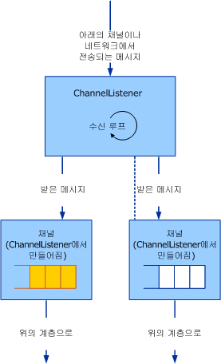

# <a name="service-channel-listeners-and-channels"></a>서비스: 채널 수신기 및 채널
채널 개체에는 채널, 채널 수신기 및 채널 팩터리의 세 가지 범주가 있습니다. 채널은 응용 프로그램과 채널 스택 사이의 인터페이스입니다. 채널 수신기는 받는(또는 수신) 쪽, 일반적으로 새 들어오는 메시지 또는 연결에 대한 응답으로 채널을 만듭니다. 채널 팩터리는 보내는 쪽에 끝점과 통신을 시작할 채널을 만듭니다.  
  
## <a name="channel-listeners-and-channels"></a>채널 수신기 및 채널  
 채널 수신기는 채널을 만들고 아래 계층 또는 네트워크로부터 메시지를 받습니다. 받은 메시지는 채널 수신기에서 만든 채널을 사용하여 위의 계층에 전달됩니다.  
  
 다음 다이어그램에서는 메시지를 받고 위의 계층에 전달하는 프로세스를 보여 줍니다.  
  
   
채널 수신기는 채널을 통해 메시지를 받아서 위의 계층에 전달합니다.  
  
 구현에서는 실제로 큐를 사용하지 않을 수도 있지만 이 프로세스는 개념적으로 각 채널 내의 큐로 모델링될 수 있습니다. 채널 수신기는 아래 계층 또는 네트워크로부터 메시지를 받아서 큐에 넣습니다. 채널은 큐에서 메시지를 가져오고 계층이 채널에서 `Receive`를 호출하는 것과 같은 방법으로 메시지를 요청하면 위의 계층으로 해당 메시지를 전달합니다.  
  
 [!INCLUDE[indigo2](../../../../includes/indigo2-md.md)]은 이 프로세스에 대한 기본 클래스 도우미를 제공합니다. (이 항목에서 설명 하는 채널 도우미 클래스 다이어그램을 참조 하십시오. [채널 모델 개요](../../../../docs/framework/wcf/extending/channel-model-overview.md).)  
  
-   <xref:System.ServiceModel.Channels.CommunicationObject> 클래스 구현 <xref:System.ServiceModel.ICommunicationObject> 의 2 단계에서 설명한 상태 시스템을 적용 하 고 [개발 채널](../../../../docs/framework/wcf/extending/developing-channels.md)합니다.  
  
-   <xref:System.ServiceModel.Channels.ChannelManagerBase> 클래스는 <xref:System.ServiceModel.Channels.CommunicationObject>를 구현하고 <xref:System.ServiceModel.Channels.ChannelFactoryBase> 및 <xref:System.ServiceModel.Channels.ChannelListenerBase>에 대한 통합 기본 클래스를 제공합니다. <xref:System.ServiceModel.Channels.ChannelManagerBase> 클래스는 <xref:System.ServiceModel.Channels.ChannelBase>을 구현하는 기본 클래스인 <xref:System.ServiceModel.Channels.IChannel>와 함께 사용됩니다.  
  
-   '<xref:System.ServiceModel.Channels.ChannelFactoryBase> 클래스 구현 <xref:System.ServiceModel.Channels.ChannelManagerBase> 및 <xref:System.ServiceModel.Channels.IChannelFactory> 하 고 통합 된 `CreateChannel` 하나에 오버 로드 `OnCreateChannel` 추상 메서드.  
  
-   <xref:System.ServiceModel.Channels.ChannelListenerBase> 클래스는 <xref:System.ServiceModel.Channels.IChannelListener>을 구현합니다. 이 클래스는 기본 상태 관리를 담당합니다.  
  
 다음 논의 기반으로 [전송: UDP](../../../../docs/framework/wcf/samples/transport-udp.md) 샘플.  
  
## <a name="creating-a-channel-listener"></a>채널 수신기 만들기  
 '에서 파생 되는 샘플 구현 UdpChannelListener는 <xref:System.ServiceModel.Channels.ChannelListenerBase> 클래스입니다. 단일 UDP 소켓을 사용하여 데이터그램을 받습니다. `OnOpen` 메서드는 비동기 루프에서 UDP 소켓을 사용하여 데이터를 받습니다. 그런 다음 데이터는 메시지 인코딩 시스템을 사용하여 메시지로 변환됩니다.  
  
```  
message = UdpConstants.MessageEncoder.ReadMessage(  
  new ArraySegment<byte>(buffer, 0, count),   
  bufferManager  
);  
```  
  
 같은 데이터그램 채널은 여러 소스에서 도착한 메시지를 나타내므로 `UdpChannelListener`는 singleton 수신기입니다. 대부분 활성에 <xref:System.ServiceModel.Channels.IChannel>' 한 번에이 수신기와 연결 된입니다. 이 샘플에서는 <xref:System.ServiceModel.Channels.ChannelListenerBase%601.AcceptChannel%2A> 메서드에서 반환되는 채널이 이후에 삭제되는 경우에만 새 채널을 생성합니다. 메시지를 받으면 이 singleton 채널의 큐에 삽입됩니다.  
  
### <a name="udpinputchannel"></a>UdpInputChannel  
 `UdpInputChannel` 클래스는 <xref:System.ServiceModel.Channels.IInputChannel>을 구현합니다. 이 클래스는 `UdpChannelListener`의 소켓으로 채워지는 들어오는 메시지의 큐로 구성됩니다. 이러한 메시지는 <xref:System.ServiceModel.Channels.IInputChannel.Receive%2A> 메서드에 의해 큐에서 제거됩니다.
