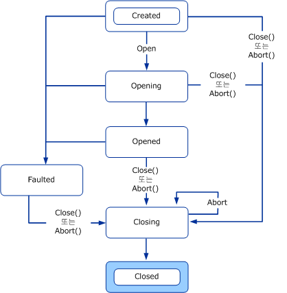
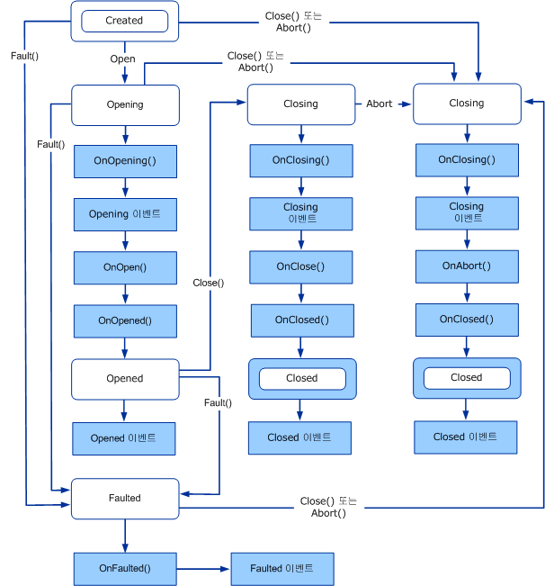
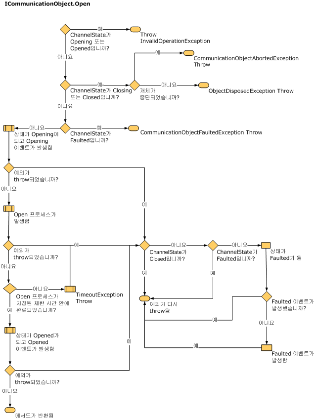
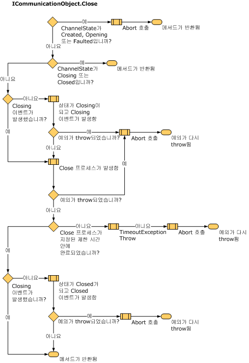
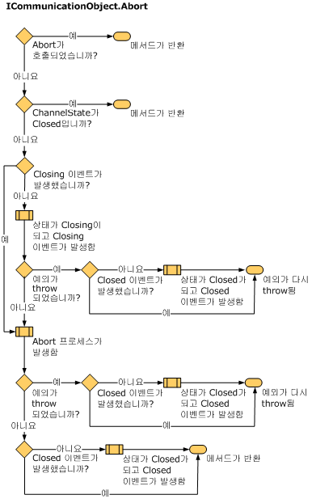

# 상태 변경 이해
이 항목에서는 채널에 있는 상태와 전이, 채널 상태의 구조 지정에 사용되는 형식, 그리고 구현 방법에 대해 설명합니다.  
  
## 상태 시스템 및 채널  
 소켓과 같이 통신을 처리하는 개체는 보통 상태 전이와 네트워크 리소스 할당, 연결 시작 및 수락, 연결 닫기 및 통신 종료 등이 관련된 상태 시스템을 사용합니다.채널 상태 시스템에서는 개체의 기본 구현을 요약하는 통신 개체의 상태에 대한 균일 모델을 제공합니다.<xref:System.ServiceModel.ICommunicationObject> 인터페이스에서는 상태 집합, 상태 전이 메서드 및 상태 전이 이벤트를 제공합니다.모든 채널, 채널 팩터리 및 채널 수신기는 채널 상태 시스템을 구현합니다.  
  
 Closed, Closing, Faulted, Opened 및 Opening 이벤트는 상태 전이가 발생한 후에 외부의 관찰자에게 해당 사실을 알립니다.  
  
 Abort, Close 및 Open 메서드와 이에 해당되는 비동기 이벤트는 상태 전이를 일으킵니다.  
  
 상태 속성은 <xref:System.ServiceModel.CommunicationState>에서 정의한 현재 상태를 반환합니다.  
  
## ICommunicationObject, CommunicationObject와 상태 및 상태 전이  
 <xref:System.ServiceModel.ICommunicationObject>는 다양한 속성을 구성할 수 있는 만듦 상태에서 시작합니다.열림 상태가 된 개체는 메시지 보내기와 받기에 사용할 수 있지만 해당 속성은 변경할 수 없는 것으로 간주됩니다.Closing 상태가 된 개체는 더 이상 새 보내기 또는 받기 요청을 처리할 수 없지만 기존 요청은 Close 제한 시간에 도달할 때까지 완료할 기회가 있습니다.복구할 수 없는 오류가 발생한 경우 개체는 Faulted 상태로 전이되며, 해당 상태에서 오류에 대한 정보가 검사된 후 결국 닫힙니다.Closed 상태에 있는 개체는 기본적으로 상태 시스템의 끝에 도달한 것입니다.개체가 한 상태에서 다음 상태로 전이되고 나면 이전 상태로 돌아가지 않습니다.  
  
 다음 다이어그램은 <xref:System.ServiceModel.ICommunicationObject> 상태 및 상태 전이를 보여 줍니다.상태 전이는 Abort, Open 또는 Close의 세 가지 메서드 중 하나를 호출하여 일으킬 수 있습니다.다른 구현 관련 메서드를 호출하여 일으킬 수도 있습니다.Faulted 상태로의 전이는 통신 개체를 여는 도중이나 열고 난 후에 오류가 발생한 경우 일어날 수 있습니다.  
  
 모든 <xref:System.ServiceModel.ICommunicationObject>는 만듦 상태로 시작합니다.이 상태에서는 응용 프로그램이 속성을 설정하여 개체를 구성할 수 있습니다.개체가 Created 외의 상태가 되면 변경할 수 없는 것으로 간주됩니다.  
  
   
그림 1.ICommunicationObject 상태 시스템.  
  
 [!INCLUDE[indigo1](../../../../includes/indigo1-md.md)]에서는 <xref:System.ServiceModel.ICommunicationObject> 및 채널 상태 시스템을 구현하는 <xref:System.ServiceModel.Channels.CommunicationObject>라는 추상 기본 클래스를 제공합니다.다음 그래픽은 <xref:System.ServiceModel.Channels.CommunicationObject>에 적용되는 수정된 상태 다이어그램입니다.여기에는 <xref:System.ServiceModel.ICommunicationObject> 상태 시스템 외에도 추가 <xref:System.ServiceModel.Channels.CommunicationObject> 메서드가 호출되는 타이밍이 표시됩니다.  
  
   
그림 2.이벤트 및 보호된 메서드 호출을 포함한 ICommunicationObject 상태 시스템의 CommunicationObject 구현  
  
### ICommunicationObject 이벤트  
 <xref:System.ServiceModel.Channels.CommunicationObject>는 <xref:System.ServiceModel.ICommunicationObject>에 정의된 5개의 이벤트를 노출합니다.이러한 이벤트는 통신 개체를 사용하는 코드에 상태 전이를 알리는 데 사용하도록 디자인되었습니다.위의 그림 2에 표시된 것과 같이 각 이벤트는 이벤트에서 명명된 상태로 개체의 상태 전이가 이루어진 후에 시작됩니다.5개의 이벤트는 모두 다음과 같이 정의되는 `EventHandler` 형식입니다.  
  
 `public delegate void EventHandler(object sender, EventArgs e);`  
  
 <xref:System.ServiceModel.Channels.CommunicationObject> 구현에서 발신자는 <xref:System.ServiceModel.Channels.CommunicationObject> 자체이거나 <xref:System.ServiceModel.Channels.CommunicationObject> 생성자에 발신자로 전달되는 항목입니다\(해당 생성자 오버로드를 사용하는 경우\).EventArgs 매개 변수 `e`는 항상 `EventArgs.Empty`입니다.  
  
### 파생된 개체 콜백  
 <xref:System.ServiceModel.Channels.CommunicationObject>에서는 5개의 이벤트 외에도 상태 전이가 일어나기 전후에 파생된 개체를 콜백할 수 있도록 디자인된 8개의 보호된 가상 메서드를 선언합니다.  
  
 <xref:System.ServiceModel.Channels.CommunicationObject.Open%2A?displayProperty=fullName> 및 <xref:System.ServiceModel.Channels.CommunicationObject.Close%2A?displayProperty=fullName> 메서드에는 이러한 3개의 콜백이 각각 연결되어 있습니다.예를 들어, <xref:System.ServiceModel.Channels.CommunicationObject.Open%2A?displayProperty=fullName>에 해당되는 것으로 <xref:System.ServiceModel.Channels.CommunicationObject.OnOpening%2A?displayProperty=fullName>, <xref:System.ServiceModel.Channels.CommunicationObject.OnOpen%2A?displayProperty=fullName> 및 <xref:System.ServiceModel.Channels.CommunicationObject.OnOpened%2A?displayProperty=fullName>가 있습니다.<xref:System.ServiceModel.Channels.CommunicationObject.Close%2A?displayProperty=fullName>에는 <xref:System.ServiceModel.Channels.CommunicationObject.OnClose%2A?displayProperty=fullName>, <xref:System.ServiceModel.Channels.CommunicationObject.OnClosing%2A?displayProperty=fullName> 및 <xref:System.ServiceModel.Channels.CommunicationObject.OnClosed%2A?displayProperty=fullName> 메서드가 연결됩니다.  
  
 마찬가지로 <xref:System.ServiceModel.Channels.CommunicationObject.Abort%2A?displayProperty=fullName> 메서드에는 해당 <xref:System.ServiceModel.Channels.CommunicationObject.OnAbort%2A?displayProperty=fullName>가 있습니다.  
  
 <xref:System.ServiceModel.Channels.CommunicationObject.OnOpen%2A?displayProperty=fullName>, <xref:System.ServiceModel.Channels.CommunicationObject.OnClose%2A?displayProperty=fullName> 및 <xref:System.ServiceModel.Channels.CommunicationObject.OnAbort%2A?displayProperty=fullName>에는 기본 구현이 없지만 다른 콜백에는 상태 시스템의 정확성을 위해 필요한 기본 구현이 있습니다.해당 메서드를 재정의하는 경우에는 기본 구현을 호출하거나 올바르게 대체해야 합니다.  
  
 <xref:System.ServiceModel.Channels.CommunicationObject.OnOpening%2A?displayProperty=fullName>, <xref:System.ServiceModel.Channels.CommunicationObject.OnClosing%2A?displayProperty=fullName> 및 <xref:System.ServiceModel.Channels.CommunicationObject.OnFaulted%2A?displayProperty=fullName>는 해당 <xref:System.ServiceModel.Channels.CommunicationObject.Opening?displayProperty=fullName>, <xref:System.ServiceModel.Channels.CommunicationObject.Closing?displayProperty=fullName> 및 <xref:System.ServiceModel.Channels.CommunicationObject.Faulted?displayProperty=fullName> 이벤트를 시작합니다.<xref:System.ServiceModel.Channels.CommunicationObject.OnOpened%2A?displayProperty=fullName> 및 <xref:System.ServiceModel.Channels.CommunicationObject.OnClosed%2A?displayProperty=fullName>는 각각 개체 상태를 Opened와 Closed로 설정한 다음 해당되는 <xref:System.ServiceModel.Channels.CommunicationObject.Opened?displayProperty=fullName> 및 <xref:System.ServiceModel.Channels.CommunicationObject.Closed?displayProperty=fullName> 이벤트를 시작합니다.  
  
### 상태 전이 메서드  
 <xref:System.ServiceModel.Channels.CommunicationObject>에서는 Abort, Close 및 Open의 구현을 제공합니다.또한 Faulted 상태로 상태 전이를 일으키는 Fault 메서드도 제공합니다.그림 2는 전이를 일으키는 각 메서드가 레이블로 표시된 <xref:System.ServiceModel.ICommunicationObject> 상태 시스템을 보여 줍니다. 레이블이 없는 전이는 레이블이 있는 마지막 전이를 일으킨 메서드의 구현 내에서 이루어집니다.  
  
> [!NOTE]
>  통신 상태 가져오기\/설정의 모든 <xref:System.ServiceModel.Channels.CommunicationObject> 구현은 스레드로 동기화됩니다.  
  
 생성자  
  
 <xref:System.ServiceModel.Channels.CommunicationObject>에서는 3개의 생성자를 제공하며, 이들 생성자는 모두 개체를 만듦 상태로 남겨 둡니다.생성자는 다음과 같이 정의됩니다.  
  
 첫 번째 생성자는 개체를 받는 생성자 오버로드에 위임하는 기본 생성자입니다.  
  
 `protected CommunicationObject() : this(new object()) { … }`  
  
 개체를 받는 생성자에서는 해당 매개 변수를 통신 개체 상태에 대한 액세스를 동기화할 때 잠글 개체로 사용합니다.  
  
 `protected CommunicationObject(object mutex) { … }`  
  
 마지막으로 세 번째 생성자는 <xref:System.ServiceModel.ICommunicationObject> 이벤트를 시작할 때 발신자 인수로 사용되는 추가 매개 변수를 받습니다.  
  
 `protected CommunicationObject(object mutex, object eventSender) { … }`  
  
 앞의 두 생성자에서 해당 발신자를 설정합니다.  
  
 Open 메서드  
  
 사전 조건: 상태는 Created.  
  
 사후 조건: 상태는 Opened 또는 Faulted.예외가 throw될 수 있습니다.  
  
 Open\(\) 메서드에서는 통신 개체를 열고 상태를 Opened로 설정하려 합니다.여기서 오류가 발견되면 상태를 Faulted로 설정합니다.  
  
 메서드에서는 먼저 현재 상태가 Created인지 확인합니다.현재 상태가 Opening 또는 Opened이면 <xref:System.InvalidOperationException>이 throw됩니다.현재 상태가 Closing 또는 Closed이면 개체가 종료된 경우 <xref:System.ServiceModel.CommunicationObjectAbortedException>, 그렇지 않은 경우 <xref:System.ObjectDisposedException>이 throw됩니다.현재 상태가 Faulted인 경우에는 <xref:System.ServiceModel.CommunicationObjectFaultedException>이 throw됩니다.  
  
 다음으로는 상태를 Opening으로 설정하고 Opening 이벤트를 일으키는 OnOpening\(\)과 OnOpen\(\) 및 OnOpened\(\)를 차례로 호출합니다.OnOpened\(\)에서는 상태를 Opened로 설정하고 Opened 이벤트를 일으킵니다.이 과정 중에 예외가 throw되면 Open\(\)에서는 Fault\(\)를 호출하고 예외를 일으킵니다.다음 다이어그램은 Open 프로세스를 보다 자세히 나타낸 것입니다.  
  
   
내부 통신 개체 열기 등의 사용자 지정 열기 논리를 구현하려면 OnOpen 메서드를 재정의합니다.  
  
 Close 메서드  
  
 사전 조건: 없음.  
  
 사후 조건: 상태는 Closed.예외가 throw될 수 있습니다.  
  
 Close\(\) 메서드는 어느 상태에서나 호출할 수 있습니다.여기서는 개체를 정상적으로 닫으려 합니다.오류가 발생하면 개체를 종료합니다.현재 상태가 Closing 또는 Closed이면 이 메서드에서는 아무 것도 하지 않습니다.그렇지 않으면 상태를 Closing으로 설정합니다.원래 상태가 Created, Opening 또는 Faulted이면 Abort\(\)를 호출합니다\(다음 다이어그램 참조\).원래 상태가 Opened이면 Closing 이벤트를 일으키는 OnClosing\(\)과 OnClose\(\) 및 OnClosed\(\)를 순서대로 호출합니다.이 과정 중에 예외가 throw되면 Close\(\)에서는 Abort\(\)를 호출하고 예외를 일으킵니다.OnClosed\(\)에서는 상태를 Closed로 설정하고 Closed 이벤트를 일으킵니다.다음 다이어그램은 Close 프로세스를 보다 자세히 나타낸 것입니다.  
  
   
내부 통신 개체 닫기 등의 사용자 지정 닫기 논리를 구현하려면 OnClose 메서드를 재정의합니다.장기적으로 차단될 수 있는 모든 정상적인 닫기 논리는\(예: 다른 쪽의 응답을 기다리는 경우\) 제한 시간 매개 변수를 받고 Abort\(\)의 일부로 호출되지 않기 때문에 OnClose\(\)에 구현해야 합니다.  
  
 중단  
  
 사전 조건: 없음.  
사후 조건: 상태는 Closed.예외가 throw될 수 있습니다.  
  
 현재 상태가 Closed이거나 이전에 개체가 다른 스레드에서 Abort\(\)를 실행하는 등의 방법으로 종료된 경우에는 Abort\(\) 메서드에서 아무 것도 하지 않습니다.그렇지 않은 경우에는 상태를 Closing으로 설정하고 Closing 이벤트를 일으키는 OnClosing\(\)과 OnAbort\(\) 및 OnClosed\(\)를 순서대로 호출합니다. 개체를 닫는 경우가 아니라 종료하는 경우이기 때문에 OnClose는 호출하지 않습니다.OnClosed\(\)에서는 상태를 Closed로 설정하고 Closed 이벤트를 일으킵니다.이 과정에서 예외가 throw되면 Abort의 호출자에게 예외가 다시 throw됩니다.OnClosing\(\), OnClosed\(\) 및 OnAbort\(\)의 구현은 입력\/출력 등을 차단하지 않아야 합니다.다음 다이어그램은 Abort 프로세스를 보다 자세히 나타낸 것입니다.  
  
   
내부 통신 개체 종료 등의 사용자 지정 종료 논리를 구현하려면 OnAbort 메서드를 재정의합니다.  
  
 Fault  
  
 Fault 메서드는 <xref:System.ServiceModel.Channels.CommunicationObject>에 적용되며 <xref:System.ServiceModel.ICommunicationObject> 인터페이스의 일부가 아닙니다.여기서는 완전성을 위해 함께 설명합니다.  
  
 사전 조건: 없음.  
  
 사후 조건: 상태는 Faulted.예외가 throw될 수 있습니다.  
  
 현재 상태가 Faulted 또는 Closed이면 Fault\(\) 메서드에서 아무 것도 하지 않습니다.그렇지 않은 경우에는 상태를 Faulted로 설정하고 Faulted 이벤트를 일으키는 OnFaulted\(\)를 호출합니다.OnFaulted에서 예외가 throw되면 다시 throw됩니다.  
  
### ThrowIfXxx 메서드  
 CommunicationObject에는 개체가 특정 상태에 있을 때 예외를 throw하는 데 사용되는 보호된 메서드가 3개 있습니다.  
  
 <xref:System.ServiceModel.Channels.CommunicationObject.ThrowIfDisposed%2A>에서는 상태가 Closing, Closed 또는 Faulted인 경우에 예외를 throw합니다.  
  
 <xref:System.ServiceModel.Channels.CommunicationObject.ThrowIfDisposedOrImmutable%2A>에서는 상태가 Created가 아닌 경우에 예외를 throw합니다.  
  
 <xref:System.ServiceModel.Channels.CommunicationObject.ThrowIfDisposedOrNotOpen%2A>에서는 상태가 Opened가 아닌 경우에 예외를 throw합니다.  
  
 throw되는 예외는 상태에 따라 다릅니다.다음 표에서는 여러 상태 및 해당 상태에서 ThrowIfXxx를 호출하면 throw되는 해당 예외 형식을 보여 줍니다.  
  
|상태|Abort 호출 여부|예외|  
|--------|-----------------|--------|  
|Created|N\/A|<xref:System.InvalidOperationException?displayProperty=fullName>|  
|Opening|N\/A|<xref:System.InvalidOperationException?displayProperty=fullName>|  
|Opened|N\/A|<xref:System.InvalidOperationException?displayProperty=fullName>|  
|Closing|예|<xref:System.ServiceModel.CommunicationObjectAbortedException?displayProperty=fullName>|  
|Closing|아니요|<xref:System.ObjectDisposedException?displayProperty=fullName>|  
|Closed|예|이전에 명시적인 Abort 호출로 개체가 닫힌 경우 <xref:System.ServiceModel.CommunicationObjectAbortedException?displayProperty=fullName>.개체에서 Close를 호출하면 <xref:System.ObjectDisposedException?displayProperty=fullName>이 throw됩니다.|  
|Closed|아니요|<xref:System.ObjectDisposedException?displayProperty=fullName>|  
|Faulted|해당 없음|<xref:System.ServiceModel.CommunicationObjectFaultedException?displayProperty=fullName>|  
  
### 시간 제한  
 지금까지 설명한 메서드 중 일부는 시간 제한 매개 변수를 사용합니다.Close, Open\(일부 오버로드 및 비동기 버전\), OnClose 및 OnOpen이 여기에 해당됩니다.이러한 메서드는 연결을 정상적으로 닫는 동안 입력\/출력을 차단하는 등의 오래 걸리는 작업이 가능하도록 디자인되었기 때문에 시간 제한 매개 변수는 인터럽트되기 전에 이러한 작업에 사용할 수 있는 시간을 나타냅니다.이러한 메서드의 구현에서는 제공된 시간 제한 값을 사용하여 제한 시간 내에 호출자에게 반환되게 해야 합니다.시간 제한을 사용하지 않는 다른 메서드의 구현은 오래 걸리는 작업을 위해 디자인되어 있지 않으며 입력\/출력을 차단하지 않아야 합니다.  
  
 시간 제한을 사용하지 않는 Open\(\) 및 Close\(\) 오버로드는 예외입니다.파생된 클래스가 제공한 기본 시간 제한 값을 사용합니다.<xref:System.ServiceModel.Channels.CommunicationObject>는 다음과 같이 정의된 <xref:System.ServiceModel.Channels.CommunicationObject.DefaultCloseTimeout%2A>과 <xref:System.ServiceModel.Channels.CommunicationObject.DefaultOpenTimeout%2A>이라는 두 가지 보호된 추상 속성을 노출합니다.  
  
 `protected abstract TimeSpan DefaultCloseTimeout { get; }`  
  
 `protected abstract TimeSpan DefaultOpenTimeout { get; }`  
  
 파생된 클래스에서는 이러한 속성을 구현하여 시간 제한 값을 받지 않는 Open\(\) 및 Close\(\) 오버로드에 기본 시간 제한 값을 제공합니다.그러면 Open\(\) 및 Close\(\) 구현에서는 예를 들어 시간 제한 값을 받는 오버로드에 기본 시간 제한 값을 다음과 같이 위임합니다.  
  
 `public void Open()`  
  
 `{`  
  
 `this.Open(this.DefaultOpenTimeout);`  
  
 `}`  
  
#### IDefaultCommunicationTimeouts  
 이 인터페이스에는 열기, 보내기, 받기 및 닫기에 대해 기본 시간 제한 값을 제공하는 4개의 읽기 전용 속성이 있습니다.각 구현은 적절한 모든 방법으로 기본값을 가져오는 일을 담당합니다.편의상 <xref:System.ServiceModel.Channels.ChannelFactoryBase> 및 <xref:System.ServiceModel.Channels.ChannelListenerBase>에서는 이 기본값을 각각 1분으로 설정합니다.