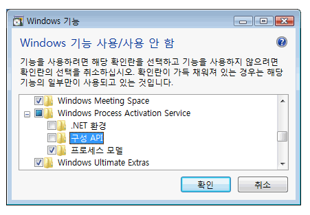
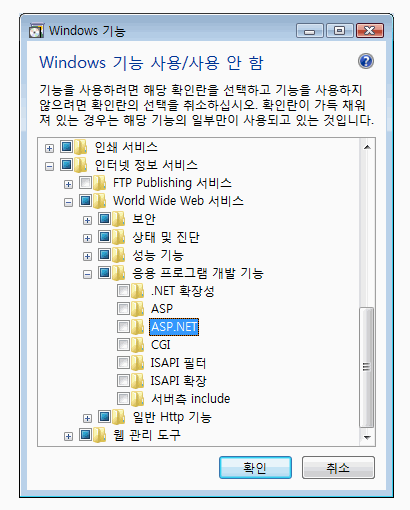
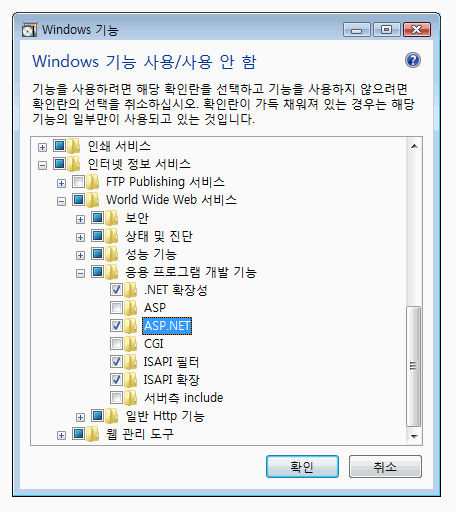
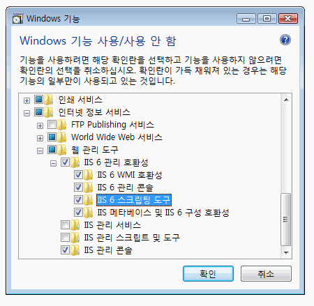

# Windows Communication Foundation에 대해 Internet Information Services 7.0 구성
IIS(인터넷 정보 서비스) 7.0은 필요한 구성 요소를 선택적으로 설치할 수 있는 모듈형 디자인입니다. 이러한 디자인은 [!INCLUDE[wv](../../../../includes/wv-md.md)]에 도입된 새로운 매니페스트 기반의 컴포넌트화 기술을 바탕으로 합니다. [!INCLUDE[iisver](../../../../includes/iisver-md.md)]에는 개별적으로 설치할 수 있는 40개 이상의 독립 실행형 기능 구성 요소가 있습니다. 따라서 IT 전문가는 필요에 따라 편리하게 설치를 사용자 지정할 수 있습니다. 이 항목에서는 [!INCLUDE[iisver](../../../../includes/iisver-md.md)]을 [!INCLUDE[indigo1](../../../../includes/indigo1-md.md)]와 함께 사용할 수 있도록 구성하는 방법과 필요한 구성 요소를 결정하는 방법에 대해 설명합니다.  
  
## 최소 설치: WAS 설치  
 전체 [!INCLUDE[iisver](../../../../includes/iisver-md.md)] 패키지를 최소 설치하려면 WAS(Windows Process Activation Service)를 설치합니다. WAS는 독립 실행형 기능으로, 모든 [!INCLUDE[iisver](../../../../includes/iisver-md.md)] 운영 체제(Home Basic, Home Premium, Business, Ultimate 및 Enterprise)에서 사용할 수 있는 [!INCLUDE[wv](../../../../includes/wv-md.md)]의 유일한 기능입니다.  
  
 제어판에서 클릭 **프로그램** 클릭 하 고 **Windows 기능 설정 또는 해제** 아래에 나열 된 **프로그램 및 기능**, WAS 구성 요소가에 표시 되는 다음 그림과 같이 목록입니다.  
  
   
  
 이 기능에는 다음과 같은 하위 구성 요소가 있습니다.  
  
-   .NET 환경  
  
-   구성 API  
  
-   프로세스 모델  
  
 만 WAS의 루트 노드를 선택 하는 경우는 **프로세스 모델** 하위 노드는 기본적으로 선택 됩니다. 이 설치에서는 웹 서버에 대한 지원이 없으므로 WAS만 설치됩니다.  
  
 있도록 [!INCLUDE[indigo2](../../../../includes/indigo2-md.md)] 또는 모든 [!INCLUDE[vstecasp](../../../../includes/vstecasp-md.md)] 작동 하도록 하는 응용 프로그램 확인는 **.NET 환경** 확인란을 선택 합니다. 이는 모든 WAS 구성 요소가 [!INCLUDE[indigo2](../../../../includes/indigo2-md.md)] 및 [!INCLUDE[vstecasp](../../../../includes/vstecasp-md.md)] 작동에 필요함을 의미합니다. 이러한 구성 요소는 일단 설치되면 자동으로 선택됩니다.  
  
## IIS 7.0: 기본 설치  
 선택 하 여는 **인터넷 정보 서비스** 다음 그림에 나와 있는 것 처럼 기능 하위 노드 일부가 자동으로 선택 됩니다.  
  
   
  
 이것은 [!INCLUDE[iisver](../../../../includes/iisver-md.md)]의 기본 설치입니다. 이 설치에서는 [!INCLUDE[iisver](../../../../includes/iisver-md.md)]을 사용하여 HTML 페이지나 기타 콘텐츠와 같은 정적 콘텐츠를 제공할 수 있습니다. 하지만 [!INCLUDE[vstecasp](../../../../includes/vstecasp-md.md)] 또는 CGI 응용 프로그램을 실행하거나 [!INCLUDE[indigo2](../../../../includes/indigo2-md.md)] 서비스를 호스팅할 수 없습니다.  
  
## IIS 7.0: ASP.NET 지원과 함께 설치  
 IIS 7.0에서 [!INCLUDE[vstecasp](../../../../includes/vstecasp-md.md)]이 작동하도록 [!INCLUDE[vstecasp](../../../../includes/vstecasp-md.md)]을 설치해야 합니다. 확인 한 후 **ASP.NET**, 화면이 다음 그림과 같이 표시 합니다.  
  
   
  
 이는 [!INCLUDE[indigo2](../../../../includes/indigo2-md.md)] 및 [!INCLUDE[vstecasp](../../../../includes/vstecasp-md.md)] 응용 프로그램이 모두 [!INCLUDE[iisver](../../../../includes/iisver-md.md)]에서 작동하기 위한 최소 환경입니다.  
  
## IIS 7.0: IIS 6.0 호환성 구성 요소와 함께 설치  
 설치할 때 [!INCLUDE[iisver](../../../../includes/iisver-md.md)] 는 Visual Studio 2005 또는 일부 다른 자동화 스크립트 또는 도구 (예: Adsutil.vbs)를 사용 하는 가상 응용 프로그램을 구성 하는 시스템에서 [!INCLUDE[iis601](../../../../includes/iis601-md.md)] 메타 베이스 API를 확인 하는 확인 된 [!INCLUDE[iis601](../../../../includes/iis601-md.md)]  **스크립팅 도구**합니다. 다른 하위 노드를 자동으로 확인이 [!INCLUDE[iis601](../../../../includes/iis601-md.md)] **관리 호환성**합니다. 이 작업이 끝나면 화면이 다음 그림과 같이 표시됩니다.  
  
   
  
 이 설치에서는 [!INCLUDE[iisver](../../../../includes/iisver-md.md)], [!INCLUDE[vstecasp](../../../../includes/vstecasp-md.md)] 및 [!INCLUDE[indigo2](../../../../includes/indigo2-md.md)] 기능을 사용하는 데 필요한 모든 요소와 웹에서 사용할 수 있는 샘플이 제공됩니다.  
  
## 요청 제한  
 IIS 7이 설치된 [!INCLUDE[wv](../../../../includes/wv-md.md)]에서 `maxUri` 및 `maxQueryStringSize` 설정의 기본값이 변경되었습니다. 기본적으로 IIS 7.0의 요청 필터링은 URL 길이로 4096자를 허용하며 쿼리 문자열 길이로 2048자를 허용합니다. 이러한 기본값을 변경하려면 다음 XML을 App.config 파일에 추가합니다.  
  
 `<system.webServer>`  
  
 `<security>`  
  
 `<requestFiltering>`  
  
 `<requestLimits maxUrl="8192" maxQueryString="8192" />`  
  
 `</requestFiltering>`  
  
 `</security>`  
  
 `</system.webServer>`  
  
## 참고 항목  
 [WAS Activation 아키텍처](../../../../docs/framework/wcf/feature-details/was-activation-architecture.md)  
 [WCF와 함께 사용 하도록 WAS 구성](../../../../docs/framework/wcf/feature-details/configuring-the-wpa--service-for-use-with-wcf.md)  
 [방법: 설치 하 고 WCF Activation 구성 요소 구성](../../../../docs/framework/wcf/feature-details/how-to-install-and-configure-wcf-activation-components.md)  
 [Windows Server App Fabric 호스팅 기능](http://go.microsoft.com/fwlink/?LinkId=201276)
