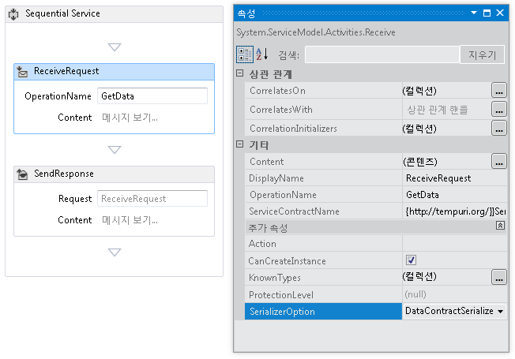
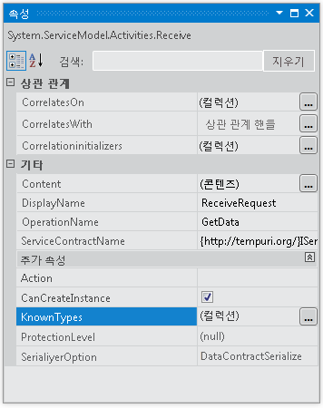
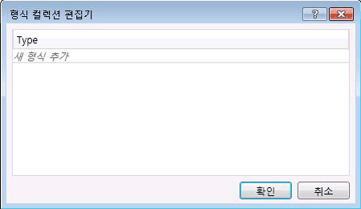

# <a name="configuring-serialization-in-a-workflow-service"></a>워크플로 서비스에서 Serialization 구성
워크플로 서비스는 [!INCLUDE[indigo1](../../../../includes/indigo1-md.md)] 서비스이기 때문에 <xref:System.Runtime.Serialization.DataContractSerializer>(기본값) 또는 <xref:System.Xml.Serialization.XmlSerializer>를 사용하는 옵션이 있습니다. 워크플로가 아닌 서비스를 작성할 때 사용할 직렬화기 형식은 서비스 또는 작업 계약에서 지정됩니다. [!INCLUDE[indigo2](../../../../includes/indigo2-md.md)] 워크플로 서비스를 만드는 경우에는 이러한 계약이 코드로 지정되지 않고 런타임에 계약 유추를 통해 생성됩니다. [!INCLUDE[crabout](../../../../includes/crabout-md.md)]계약 유추를 참조 하십시오. [워크플로에서 계약 사용 하 여](../../../../docs/framework/wcf/feature-details/using-contracts-in-workflow.md)합니다.  직렬화기는 <xref:System.ServiceModel.Activities.Receive.SerializerOption%2A> 속성을 사용하여 지정됩니다. 다음 그림과 같이 디자이너에서 이 속성을 설정할 수 있습니다.  
  
   
  
 다음 예제와 같이 코드에서 직렬화기를 설정할 수도 있습니다.  
  
```  
Receive approveExpense = new Receive  
            {  
                OperationName = "ApproveExpense",  
                CanCreateInstance = true,  
                ServiceContractName = "FinanceService",  
                SerializerOption = SerializerOption.DataContractSerializer,  
                Content = ReceiveContent.Create(new OutArgument<Expense>(expense))  
            };  
```  
  
 워크플로 서비스에서 알려진 형식도 지정할 수 있습니다. [!INCLUDE[crabout](../../../../includes/crabout-md.md)]형식 참조 알려진 [데이터 계약 알려진 형식을](../../../../docs/framework/wcf/feature-details/data-contract-known-types.md)합니다. 디자이너나 코드에서 알려진 형식을 지정할 수 있습니다. 디자이너에서 알려진 형식을 지정하려면 다음 그림과 같이 <xref:System.ServiceModel.Activities.Receive> 작업에 대한 속성 창에서 KnownTypes 속성 옆에 있는 줄임표 단추를 클릭합니다.  
  
   
  
 알려진 형식을 검색하고 지정할 수 있는 형식 컬렉션 편집기가 표시됩니다.  
  
   
  
 클릭는 **새 유형을 추가** 에 연결 하 고 알려진된 형식 컬렉션에 추가 하도록 선택 하거나 검색 유형에 대 한 드롭다운을 사용 합니다. 코드에서 알려진 형식을 지정하려면 다음 예제와 같이 <xref:System.ServiceModel.Activities.Receive.KnownTypes%2A> 속성을 사용합니다.  
  
```  
Receive approveExpense = new Receive  
            {  
                OperationName = "ApproveExpense",  
                CanCreateInstance = true,  
                ServiceContractName = "FinanceService",  
                SerializerOption = SerializerOption.DataContractSerializer,  
                Content = ReceiveContent.Create(new OutArgument<Expense>(expense))  
            };  
            approveExpense.KnownTypes.Add(typeof(Travel));  
            approveExpense.KnownTypes.Add(typeof(Meal));  
```  
  
 구성 요소를 참조는 워크플로 서비스에 대 한 직렬화를 구성 하는 방법을 보여 주는 전체 코드 예제를 보려면 [워크플로 서비스에서 메시지 서식 지정](../../../../docs/framework/windows-workflow-foundation/samples/formatting-messages-in-workflow-services.md)합니다.
