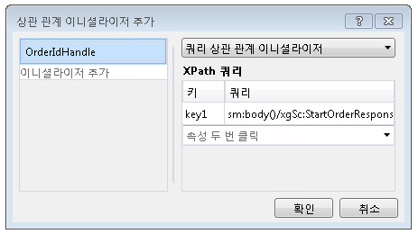

# 내용 기반 상관 관계
워크플로 서비스가 클라이언트 및 기타 서비스와 통신할 때 교환되는 메시지에는 해당 메시지를 특정 인스턴스와 고유하게 연결하는 데 사용할 수 있는 데이터가 있을 수 있습니다. 내용 기반 상관 관계는 메시지에 있는 이 데이터(예: 고객 번호 또는 주문 ID)를 사용하여 메시지를 적절한 워크플로 인스턴스에 라우트합니다. 이 항목에서는 워크플로에서 내용 기반 상관 관계를 사용하는 방법에 대해 설명합니다.  
  
## 내용 기반 상관 관계 사용  
 내용 기반 상관 관계는 워크플로 서비스에 단일 클라이언트가 액세스하는 메서드가 여러 개 있고 교환되는 메시지의 일부 데이터로 원하는 인스턴스를 식별할 수 있는 경우에 사용됩니다.  
  
> [!NOTE]
>  내용 기반 상관 관계는 지원되는 컨텍스트 교환 바인딩이 없어 컨텍스트 상관 관계를 사용할 수 없는 경우에 유용합니다. [!INCLUDE[crabout](../../../../includes/crabout-md.md)]컨텍스트 상관 관계 참조 [컨텍스트 교환](../../../../docs/framework/wcf/feature-details/context-exchange-correlation.md)합니다.  
  
 이러한 통신에 사용되는 각 메시징 작업은 메시지에서 인스턴스를 고유하게 식별하는 데이터가 있는 위치를 지정해야 합니다. 이 작업은 <xref:System.ServiceModel.MessageQuerySet> 또는 <xref:System.ServiceModel.Activities.QueryCorrelationInitializer>을 통해 메시지에서 인스턴스를 고유하게 식별하는 데이터를 쿼리하는 <xref:System.ServiceModel.Activities.Receive.CorrelatesOn%2A>을 제공하여 수행됩니다.  
  
> [!WARNING]
>  인스턴스를 식별하는 데 사용되는 데이터는 상관 관계 키로 해시됩니다. 상관 관계에는 고유한 데이터를 사용해야 합니다. 그렇지 않으면 해시된 키에서 충돌이 발생하여 메시지가 잘못 라우트될 수 있습니다. 예를 들어 고객 이름에만 의존하는 상관 관계는 동일한 이름을 가진 고객이 여러 명 있을 수 있으므로 충돌을 일으킬 수 있습니다. 메시지를 상호 연결하는 데 사용되는 데이터에 콜론(`:`)을 포함하면 안 됩니다. 이는 이후에 해시되는 문자열을 만들기 위해 메시지 쿼리의 키와 값을 구분하는 데 콜론이 이미 사용되기 때문입니다.  
  
 다음 예에서 초기 <xref:System.ServiceModel.Activities.Receive> / <xref:System.ServiceModel.Activities.SendReply> 반환을 워크플로 서비스에는 `OrderId`, 다음 예제에서 클라이언트에서 다시 전달 되는 <xref:System.ServiceModel.Activities.Receive> 워크플로 서비스의 활동입니다.  
  
 [!code-csharp[CFX_ContentCorrelation#1](../../../../samples/snippets/csharp/VS_Snippets_CFX/cfx_contentcorrelation/cs/program.cs#1)]  
  
 이전 예제에서는 <xref:System.ServiceModel.Activities.SendReply>에 의해 초기화되는 내용 기반 상관 관계를 보여 줍니다. <xref:System.ServiceModel.MessageQuerySet>은 이 서비스에 대한 후속 메시지를 식별하는 데 사용되는 데이터가 `OrderId`가 되도록 지정합니다.  
  
 [!code-csharp[CFX_ContentCorrelation#2](../../../../samples/snippets/csharp/VS_Snippets_CFX/cfx_contentcorrelation/cs/program.cs#2)]  
  
 워크플로에서 <xref:System.ServiceModel.Activities.Receive>를 따르는 <xref:System.ServiceModel.Activities.SendReply> 작업은 <xref:System.ServiceModel.Activities.SendReply>에 의해 초기화되는 상관 관계를 따릅니다. 두 작업은 동일한 <xref:System.ServiceModel.Activities.CorrelationHandle>을 공유하지만 특정 메시지에서 식별 데이터가 있는 위치를 지정하는 <xref:System.ServiceModel.MessageQuerySet> 및 <xref:System.ServiceModel.XPathMessageQuery>는 공유하지 않습니다. <xref:System.ServiceModel.MessageQuerySet>은 상관 관계를 초기화하는 작업의 경우 <xref:System.ServiceModel.Activities.Receive.CorrelationInitializers%2A> 속성에 지정되고 다음 <xref:System.ServiceModel.Activities.Receive> 작업의 경우 <xref:System.ServiceModel.Activities.Receive.CorrelatesOn%2A> 속성을 사용하여 지정됩니다.  
  
 [!code-csharp[CFX_ContentCorrelation#3](../../../../samples/snippets/csharp/VS_Snippets_CFX/cfx_contentcorrelation/cs/program.cs#3)]  
  
 내용 기반 상관 관계는 데이터가 메시지의 일부로 전달될 때 메시징 작업(<xref:System.ServiceModel.Activities.Send>, <xref:System.ServiceModel.Activities.Receive>, <xref:System.ServiceModel.Activities.SendReply>, <xref:System.ServiceModel.Activities.ReceiveReply>)에 의해 초기화될 수 있으며, 데이터의 특정 부분이 메시지의 일부로 전달되지 않을 경우 <xref:System.ServiceModel.Activities.InitializeCorrelation> 작업을 사용하여 명시적으로 초기화될 수 있습니다. 메시지를 고유하게 식별하기 위해 데이터의 여러 부분이 필요할 경우 <xref:System.ServiceModel.MessageQuerySet>에 여러 개의 쿼리를 추가할 수 있습니다. 이러한 예제에서는 <xref:System.ServiceModel.Activities.CorrelationHandle> 또는 `CorrelatesWith` 속성을 사용하여 각 작업에 `CorrelationHandle`이 명시적으로 제공되었지만 모든 데이터가 `OrderId`와 상호 연결되는 이 예제처럼 전체 워크플로에 하나의 상관 관계만 필요한 경우 <xref:System.ServiceModel.Activities.WorkflowServiceHost>가 제공하는 암시적 상관 관계 핸들 관리만으로 충분합니다.  
  
## InitializeCorrelation 작업 사용  
 이전 예제에서는 `OrderId`가 <xref:System.ServiceModel.Activities.SendReply> 작업을 통해 호출자에게 전달되었고, 이때 상관 관계가 초기화되었습니다. 이 동작은 <xref:System.ServiceModel.Activities.InitializeCorrelation> 작업을 사용하여 수행할 수도 있습니다. <xref:System.ServiceModel.Activities.InitializeCorrelation> 작업은 메시지를 올바른 인스턴스에 매핑하는 데 사용되는 데이터를 나타내는 항목의 사전과 <xref:System.ServiceModel.Activities.CorrelationHandle>을 사용합니다. 위의 샘플에서 <xref:System.ServiceModel.Activities.InitializeCorrelation> 작업을 사용하려면 <xref:System.ServiceModel.Activities.SendReply.CorrelationInitializers%2A> 작업에서 <xref:System.ServiceModel.Activities.SendReply>를 제거하고 <xref:System.ServiceModel.Activities.InitializeCorrelation> 작업을 사용하여 상관 관계를 초기화합니다.  
  
 [!code-csharp[CFX_ContentCorrelation#4](../../../../samples/snippets/csharp/VS_Snippets_CFX/cfx_contentcorrelation/cs/program.cs#4)]  
  
 그러면 데이터를 보유하는 변수가 채워진 후, 초기화된 <xref:System.ServiceModel.Activities.InitializeCorrelation>과 상호 연결되는 <xref:System.ServiceModel.Activities.Receive> 작업이 시작되기 전에 <xref:System.ServiceModel.Activities.CorrelationHandle> 작업이 사용됩니다.  
  
 [!code-csharp[CFX_ContentCorrelation#5](../../../../samples/snippets/csharp/VS_Snippets_CFX/cfx_contentcorrelation/cs/program.cs#5)]  
  
## Workflow Designer를 사용하여 XPath 쿼리 구성  
 이전 예제에서는 메시지 쿼리에 사용되는 작업 및 XPath 쿼리가 코드에서 지정되었습니다. [!INCLUDE[vs_current_long](../../../../includes/vs-current-long-md.md)]의 Workflow Designer는 내용 기반 상관 관계의 `DataContract` 형식을 사용하여 XPath를 생성할 수 있는 기능도 제공합니다. 이전 예제에 구성된 첫 번째 XPath는 <xref:System.ServiceModel.Activities.SendReply>에 대해 구성되었습니다.  
  
 [!code-csharp[CFX_ContentCorrelation#2](../../../../samples/snippets/csharp/VS_Snippets_CFX/cfx_contentcorrelation/cs/program.cs#2)]  
  
 워크플로 디자이너에서 메시징 작업의 XPath를 구성하려면 워크플로 디자이너에서 작업을 선택합니다. 활동 앞의 예와 상관 관계를 초기화 하는 경우에 대 한 줄임표 단추를 클릭는 **CorrelationInitializers** 속성에는 **속성** 창. 그러면 표시 됩니다는 **상관 관계 이니셜라이저 추가** 대화 상자 창. 이 대화 상자에서 상관 관계 형식을 지정하고 상관 관계에 사용할 내용을 선택할 수 있습니다. <xref:System.ServiceModel.Activities.CorrelationHandle> 에 지정 된 변수는 **이니셜라이저 추가** 에서 선택 상자에서 상관 관계 유형 및 상관 관계에 사용 되는 데이터는 **XPath 쿼리** 대화 상자의 섹션.  
  
   
  
 이전 예제에 있는 두 번째 XPath 쿼리는 <xref:System.ServiceModel.Activities.Receive> 작업에서 구성되었습니다.  
  
 [!code-csharp[CFX_ContentCorrelation#3](../../../../samples/snippets/csharp/VS_Snippets_CFX/cfx_contentcorrelation/cs/program.cs#3)]  
  
 상관 관계를 초기화 하지 않는 메시징 작업에 대 한 XPath 쿼리를 구성 하려면 워크플로 디자이너에서 활동을 선택 하 고 다음에 대 한 줄임표 단추를 클릭는 **CorrelatesOn** 속성에는  **속성** 창. 그러면 표시 됩니다는 **CorrelatesOn 정의** 대화 상자 창.  
  
   
  
 이 대화 상자에서 지정 된 <xref:System.ServiceModel.Activities.CorrelationHandle> 에서 항목을 선택 하 고는 **XPath 쿼리** XPath 쿼리를 작성 하는 목록.
