# <a name="creating-a-long-running-workflow-service"></a><span data-ttu-id="76127-102">장기 실행 워크플로 서비스 만들기</span><span class="sxs-lookup"><span data-stu-id="76127-102">Creating a Long-running Workflow Service</span></span>
<span data-ttu-id="76127-103">이 항목에서는 장기 실행 워크플로 서비스를 만드는 방법에 대해 설명합니다.</span><span class="sxs-lookup"><span data-stu-id="76127-103">This topic describes how to create a long-running workflow service.</span></span> <span data-ttu-id="76127-104">장기 실행 워크플로 서비스는 장기간 실행될 수 있습니다.</span><span class="sxs-lookup"><span data-stu-id="76127-104">Long running workflow services may run for long periods of time.</span></span> <span data-ttu-id="76127-105">특정 지점에서 워크플로는 추가 정보를 기다리며 유휴 상태가 될 수 있습니다.</span><span class="sxs-lookup"><span data-stu-id="76127-105">At some point the workflow may go idle waiting for some additional information.</span></span> <span data-ttu-id="76127-106">이 경우 워크플로는 SQL 데이터베이스에 유지되고 메모리에서 제거됩니다.</span><span class="sxs-lookup"><span data-stu-id="76127-106">When this occurs the workflow is persisted to a SQL database and is removed from memory.</span></span> <span data-ttu-id="76127-107">추가 정보를 사용할 수 있으면 워크플로 인스턴스가 다시 메모리에 로드되어 계속 실행됩니다.</span><span class="sxs-lookup"><span data-stu-id="76127-107">When the additional information becomes available the workflow instance is loaded back into memory and continues executing.</span></span>  <span data-ttu-id="76127-108">이 시나리오에서는 매우 간단한 주문 시스템을 구현합니다.</span><span class="sxs-lookup"><span data-stu-id="76127-108">In this scenario you are implementing a very simplified ordering system.</span></span>  <span data-ttu-id="76127-109">클라이언트가 워크플로 서비스에 초기 메시지를 보내 주문을 시작하고,</span><span class="sxs-lookup"><span data-stu-id="76127-109">The client sends an initial message to the workflow service to start the order.</span></span> <span data-ttu-id="76127-110">워크플로 서비스는 주문 ID를 클라이언트에 반환합니다.</span><span class="sxs-lookup"><span data-stu-id="76127-110">It returns an order ID to the client.</span></span> <span data-ttu-id="76127-111">이 시점에서 워크플로 서비스가 클라이언트에서 다른 메시지를 기다리며 유휴 상태가 되고 SQL Server 데이터베이스에 유지됩니다.</span><span class="sxs-lookup"><span data-stu-id="76127-111">At this point the workflow service is waiting for another message from the client and goes into the idle state and is persisted to a SQL Server database.</span></span>  <span data-ttu-id="76127-112">클라이언트가 품목을 주문하기 위해 다음 메시지를 보내면 워크플로 서비스는 메모리에 다시 로드되고 주문 처리를 마칩니다.</span><span class="sxs-lookup"><span data-stu-id="76127-112">When the client sends the next message to order an item, the workflow service is loaded back into memory and finishes processing the order.</span></span> <span data-ttu-id="76127-113">코드 샘플에서 워크플로 서비스는 품목이 주문에 추가되었음을 나타내는 문자열을 반환합니다.</span><span class="sxs-lookup"><span data-stu-id="76127-113">In the code sample it returns a string stating the item has been added to the order.</span></span> <span data-ttu-id="76127-114">코드 샘플은 이 기술의 실제 응용 프로그램이라기보다는 장기 실행 워크플로 서비스를 보여 주는 간단한 샘플입니다.</span><span class="sxs-lookup"><span data-stu-id="76127-114">The code sample is not meant to be a real world application of the technology, but rather a simple sample that illustrates long running workflow services.</span></span> <span data-ttu-id="76127-115">이 항목에서는 [!INCLUDE[vs_current_long](../../../../includes/vs-current-long-md.md)] 프로젝트 및 솔루션을 만드는 방법을 알고 있다고 가정합니다.</span><span class="sxs-lookup"><span data-stu-id="76127-115">This topic assumes you know how to create [!INCLUDE[vs_current_long](../../../../includes/vs-current-long-md.md)] projects and solutions.</span></span>  
  
## <a name="prerequisites"></a><span data-ttu-id="76127-116">필수 구성 요소</span><span class="sxs-lookup"><span data-stu-id="76127-116">Prerequisites</span></span>  
 <span data-ttu-id="76127-117">이 연습을 사용하려면 다음 소프트웨어를 설치해야 합니다.</span><span class="sxs-lookup"><span data-stu-id="76127-117">You must have the following software installed to use this walkthrough:</span></span>  
  
1.  <span data-ttu-id="76127-118">Microsoft SQL Server 2008</span><span class="sxs-lookup"><span data-stu-id="76127-118">Microsoft SQL Server 2008</span></span>  
  
2.  [!INCLUDE[vs_current_long](../../../../includes/vs-current-long-md.md)]  
  
3.  <span data-ttu-id="76127-119">Microsoft [!INCLUDE[netfx_current_long](../../../../includes/netfx-current-long-md.md)]</span><span class="sxs-lookup"><span data-stu-id="76127-119">Microsoft  [!INCLUDE[netfx_current_long](../../../../includes/netfx-current-long-md.md)]</span></span>  
  
4.  <span data-ttu-id="76127-120">WCF 및 [!INCLUDE[vs_current_long](../../../../includes/vs-current-long-md.md)]에 익숙하고 프로젝트/솔루션을 만드는 방법을 알고 있습니다.</span><span class="sxs-lookup"><span data-stu-id="76127-120">You are familiar with WCF and [!INCLUDE[vs_current_long](../../../../includes/vs-current-long-md.md)] and know how to create projects/solutions.</span></span>  
  
### <a name="to-setup-the-sql-database"></a><span data-ttu-id="76127-121">SQL 데이터베이스를 설정하려면</span><span class="sxs-lookup"><span data-stu-id="76127-121">To Setup the SQL Database</span></span>  
  
1.  <span data-ttu-id="76127-122">워크플로 서비스 인스턴스가 유지되려면 Microsoft SQL Server가 설치되어 있어야 하고 유지된 워크플로 인스턴스를 저장하도록 데이터베이스를 구성해야 합니다.</span><span class="sxs-lookup"><span data-stu-id="76127-122">In order for workflow service instances to be persisted you must have Microsoft SQL Server installed and you must configure a database to store the persisted workflow instances.</span></span> <span data-ttu-id="76127-123">클릭 하 여 Microsoft SQL Management Studio를 실행 된 **시작** 단추를 선택 하면 **모든 프로그램**, **Microsoft SQL Server 2008**, 및 **Microsoft SQL Management Studio**합니다.</span><span class="sxs-lookup"><span data-stu-id="76127-123">Run Microsoft SQL Management Studio by clicking the **Start** button, selecting **All Programs**, **Microsoft SQL Server 2008**, and **Microsoft SQL Management Studio**.</span></span>  
  
2.  <span data-ttu-id="76127-124">클릭는 **연결** SQL Server 인스턴스에 로그온 하는 단추</span><span class="sxs-lookup"><span data-stu-id="76127-124">Click the **Connect** button to log on to the SQL Server instance</span></span>  
  
3.  <span data-ttu-id="76127-125">마우스 오른쪽 단추로 클릭 **데이터베이스** 트리 뷰 및 선택 **새 데이터베이스...**</span><span class="sxs-lookup"><span data-stu-id="76127-125">Right click **Databases** in the tree view and select **New Database..**</span></span> <span data-ttu-id="76127-126">라는 새 데이터베이스를 만들려면 `SQLPersistenceStore`합니다.</span><span class="sxs-lookup"><span data-stu-id="76127-126">to create a new database called `SQLPersistenceStore`.</span></span>  
  
4.  <span data-ttu-id="76127-127">SQLPersistenceStore 데이터베이스의 C:\Windows\Microsoft.NET\Framework\v4.0\SQL\en 디렉터리에 있는 SqlWorkflowInstanceStoreSchema.sql 스크립트 파일을 실행하여 필요한 데이터베이스 스키마를 설정합니다.</span><span class="sxs-lookup"><span data-stu-id="76127-127">Run the SqlWorkflowInstanceStoreSchema.sql script file located in the C:\Windows\Microsoft.NET\Framework\v4.0\SQL\en directory on the SQLPersistenceStore database to set up the needed database schemas.</span></span>  
  
5.  <span data-ttu-id="76127-128">SQLPersistenceStore 데이터베이스의 C:\Windows\Microsoft.NET\Framework\v4.0\SQL\en 디렉터리에 있는 SqlWorkflowInstanceStoreLogic.sql 스크립트 파일을 실행하여 필요한 데이터베이스 논리를 설정합니다.</span><span class="sxs-lookup"><span data-stu-id="76127-128">Run the SqlWorkflowInstanceStoreLogic.sql script file located in the C:\Windows\Microsoft.NET\Framework\v4.0\SQL\en directory on the SQLPersistenceStore database to set up the needed database logic.</span></span>  
  
### <a name="to-create-the-web-hosted-workflow-service"></a><span data-ttu-id="76127-129">웹 호스팅 워크플로 서비스를 만들려면</span><span class="sxs-lookup"><span data-stu-id="76127-129">To Create the Web Hosted Workflow Service</span></span>  
  
1.  <span data-ttu-id="76127-130">비어 있는 [!INCLUDE[vs_current_long](../../../../includes/vs-current-long-md.md)] 솔루션을 만들고 `OrderProcessing`으로 이름을 지정합니다.</span><span class="sxs-lookup"><span data-stu-id="76127-130">Create an empty [!INCLUDE[vs_current_long](../../../../includes/vs-current-long-md.md)] solution, name it `OrderProcessing`.</span></span>  
  
2.  <span data-ttu-id="76127-131">[!INCLUDE[indigo2](../../../../includes/indigo2-md.md)]라는 새 `OrderService` 워크플로 서비스 응용 프로그램 프로젝트를 솔루션에 추가합니다.</span><span class="sxs-lookup"><span data-stu-id="76127-131">Add a new [!INCLUDE[indigo2](../../../../includes/indigo2-md.md)] Workflow Service Application project called `OrderService` to the solution.</span></span>  
  
3.  <span data-ttu-id="76127-132">프로젝트 속성 대화 상자에서 선택 된 **웹** 탭 합니다.</span><span class="sxs-lookup"><span data-stu-id="76127-132">In the project properties dialog, select the **Web** tab.</span></span>  
  
    1.  <span data-ttu-id="76127-133">아래 **시작 작업** 선택 **특정 페이지** 지정 `Service1.xamlx`합니다.</span><span class="sxs-lookup"><span data-stu-id="76127-133">Under **Start Action** select **Specific Page** and specify `Service1.xamlx`.</span></span>  
  
         <span data-ttu-id="76127-134">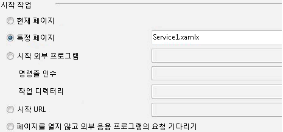</span><span class="sxs-lookup"><span data-stu-id="76127-134"></span></span>  
  
    2.  <span data-ttu-id="76127-135">아래 **서버** 선택 **로컬 IIS 웹 서버**합니다.</span><span class="sxs-lookup"><span data-stu-id="76127-135">Under **Servers** select **Use Local IIS Web server**.</span></span>  
  
         <span data-ttu-id="76127-136">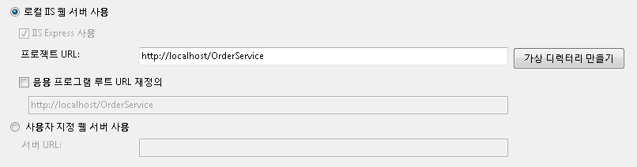</span><span class="sxs-lookup"><span data-stu-id="76127-136"></span></span>  
  
        > [!WARNING]
        >  <span data-ttu-id="76127-137">이 설정을 지정하려면 [!INCLUDE[vs_current_long](../../../../includes/vs-current-long-md.md)]을 관리자 모드로 실행해야 합니다.</span><span class="sxs-lookup"><span data-stu-id="76127-137">You must run [!INCLUDE[vs_current_long](../../../../includes/vs-current-long-md.md)] in administrator mode to make this setting.</span></span>  
  
         <span data-ttu-id="76127-138">이러한 두 단계에서는 IIS에서 호스팅하도록 워크플로 서비스 프로젝트를 구성합니다.</span><span class="sxs-lookup"><span data-stu-id="76127-138">These two steps configure the workflow service project to be hosted by IIS.</span></span>  
  
4.  <span data-ttu-id="76127-139">열고 `Service1.xamlx` 아직 열려 있고 기존 삭제 되지 경우 **ReceiveRequest** 및 **SendResponse** 활동입니다.</span><span class="sxs-lookup"><span data-stu-id="76127-139">Open `Service1.xamlx` if it is not open already and delete the existing **ReceiveRequest** and **SendResponse** activities.</span></span>  
  
5.  <span data-ttu-id="76127-140">선택 된 **순차 서비스** 활동과 클릭은 **변수** 에 연결 하 고 다음 그림에 표시 된 변수를 추가 합니다.</span><span class="sxs-lookup"><span data-stu-id="76127-140">Select the **Sequential Service** activity and click the **Variables** link and add the variables shown in the following illustration.</span></span> <span data-ttu-id="76127-141">이렇게 하면 워크플로 서비스에서 나중에 사용할 일부 변수가 추가됩니다.</span><span class="sxs-lookup"><span data-stu-id="76127-141">Doing this adds some variables that will be used later on in the workflow service.</span></span>  
  
    > [!NOTE]
    >  <span data-ttu-id="76127-142">CorrelationHandle이 변수 형식 드롭다운에 없는 경우 선택 **형식 찾아보기** 드롭다운 목록에서 합니다.</span><span class="sxs-lookup"><span data-stu-id="76127-142">If CorrelationHandle is not in the Variable Type drop-down, select **Browse for types** from the drop-down.</span></span> <span data-ttu-id="76127-143">에 CorrelationHandle을 입력에서 **유형 이름** 상자 목록 상자에서 CorrelationHandle을 선택 하 고 클릭 **확인**합니다.</span><span class="sxs-lookup"><span data-stu-id="76127-143">Type CorrelationHandle in the **Type name** box, select CorrelationHandle from the listbox and click **OK**.</span></span>  
  
     <span data-ttu-id="76127-144">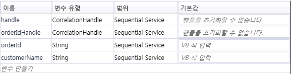</span><span class="sxs-lookup"><span data-stu-id="76127-144"></span></span>  
  
6.  <span data-ttu-id="76127-145">끌어서 놓기는 **ReceiveAndSendReply** 활동 템플릿을로 **순차 서비스** 활동입니다.</span><span class="sxs-lookup"><span data-stu-id="76127-145">Drag and drop a **ReceiveAndSendReply** activity template into the **Sequential Service** activity.</span></span> <span data-ttu-id="76127-146">이 활동 집합은 클라이언트에서 메시지를 받고 회신을 보냅니다.</span><span class="sxs-lookup"><span data-stu-id="76127-146">This set of activities will receive a message from a client and send a reply back.</span></span>  
  
    1.  <span data-ttu-id="76127-147">선택 된 **수신** 활동과 다음 그림에 강조 표시 된 속성 집합입니다.</span><span class="sxs-lookup"><span data-stu-id="76127-147">Select the **Receive** activity and set the properties highlighted in the following illustration.</span></span>  
  
         <span data-ttu-id="76127-148">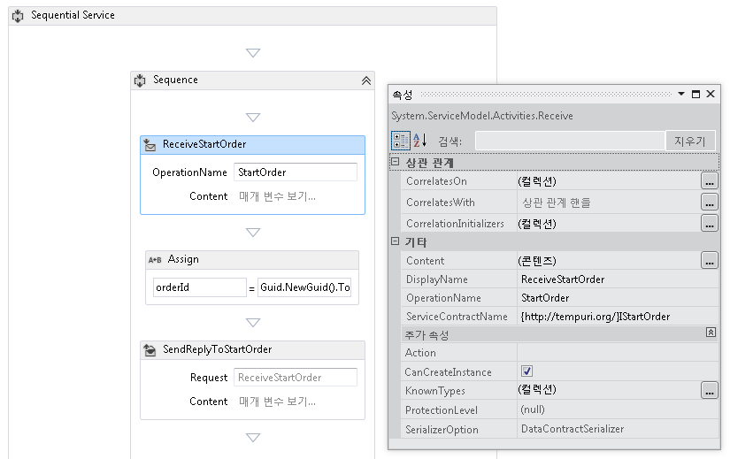</span><span class="sxs-lookup"><span data-stu-id="76127-148"></span></span>  
  
         <span data-ttu-id="76127-149">DisplayName 속성은 디자이너에서 표시되는 Receive 활동의 이름을 설정합니다.</span><span class="sxs-lookup"><span data-stu-id="76127-149">The DisplayName property sets the name displayed for the Receive activity in the designer.</span></span> <span data-ttu-id="76127-150">ServiceContractName 및 OperationName 속성은 Receive 활동으로 구현되는 서비스 계약 및 작업의 이름을 지정합니다.</span><span class="sxs-lookup"><span data-stu-id="76127-150">The ServiceContractName and OperationName properties specify the name of the service contract and operation that are implemented by the Receive activity.</span></span> [!INCLUDE[crabout](../../../../includes/crabout-md.md)]<span data-ttu-id="76127-151">서비스 계약 워크플로에서 사용 되는 방법을 참조 하십시오 [워크플로에서 계약 사용 하 여](../../../../docs/framework/wcf/feature-details/using-contracts-in-workflow.md)합니다.</span><span class="sxs-lookup"><span data-stu-id="76127-151"> how contracts are used in Workflow services see [Using Contracts in Workflow](../../../../docs/framework/wcf/feature-details/using-contracts-in-workflow.md).</span></span>  
  
    2.  <span data-ttu-id="76127-152">클릭는 **정의...**  연결에 **ReceiveStartOrder** 작업 하 고 다음 그림에 나와 있는 속성을 설정 합니다.</span><span class="sxs-lookup"><span data-stu-id="76127-152">Click the **Define...** link in the **ReceiveStartOrder** activity and set the properties shown in the following illustration.</span></span>  <span data-ttu-id="76127-153">다음에 유의 **매개 변수** 라디오 단추를 선택 하면 매개 변수 이름 `p_customerName` 에 바인딩된는 `customerName` 변수입니다.</span><span class="sxs-lookup"><span data-stu-id="76127-153">Notice that the **Parameters** radio button is selected, a parameter named `p_customerName` is bound to the `customerName` variable.</span></span> <span data-ttu-id="76127-154">이렇게 하면 구성 된 **수신** 일부 데이터를 받아 해당 데이터를 로컬 변수에 바인딩하는 작업입니다.</span><span class="sxs-lookup"><span data-stu-id="76127-154">This configures the **Receive** activity to receive some data and bind that data to local variables.</span></span>  
  
         <span data-ttu-id="76127-155">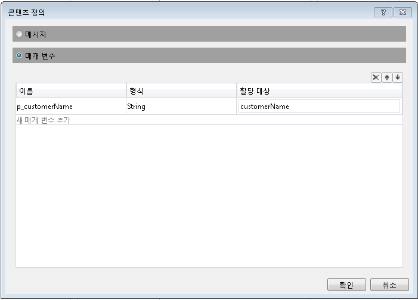</span><span class="sxs-lookup"><span data-stu-id="76127-155"></span></span>  
  
    3.  <span data-ttu-id="76127-156">선택 된 **SendReplyToReceive** 활동 및 강조 표시 된 다음 그림에 표시 된 속성을 설정 합니다.</span><span class="sxs-lookup"><span data-stu-id="76127-156">Select The **SendReplyToReceive** activity and set the highlighted property shown in the following illustration.</span></span>  
  
         <span data-ttu-id="76127-157">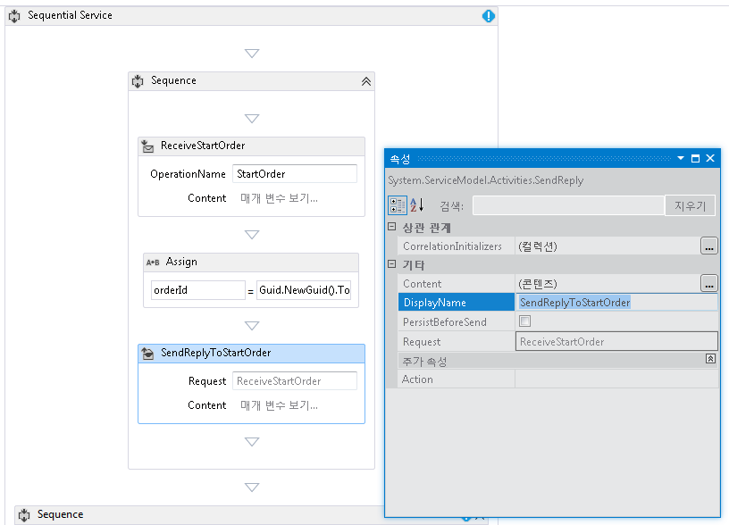</span><span class="sxs-lookup"><span data-stu-id="76127-157"></span></span>  
  
    4.  <span data-ttu-id="76127-158">클릭는 **정의...**  연결에 **SendReplyToStartOrder** 작업 하 고 다음 그림에 나와 있는 속성을 설정 합니다.</span><span class="sxs-lookup"><span data-stu-id="76127-158">Click the **Define...** link in the **SendReplyToStartOrder** activity and set the properties shown in the following illustration.</span></span> <span data-ttu-id="76127-159">다음에 유의 **매개 변수** 라디오 단추가 선택 되 고, 매개 변수 이름이 `p_orderId` 바인딩되는 `orderId` 변수입니다.</span><span class="sxs-lookup"><span data-stu-id="76127-159">Notice that the **Parameters** radio button is selected; a parameter named `p_orderId` is bound to the `orderId` variable.</span></span> <span data-ttu-id="76127-160">이 설정은 SendReplyToStartOrder 활동이 문자열 형식의 값을 호출자에게 반환하도록 지정합니다.</span><span class="sxs-lookup"><span data-stu-id="76127-160">This setting specifies that the SendReplyToStartOrder activity will return a value of type string to the caller.</span></span>  
  
         <span data-ttu-id="76127-161">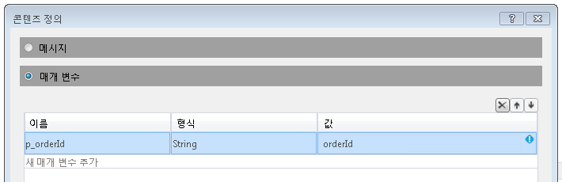</span><span class="sxs-lookup"><span data-stu-id="76127-161"></span></span>  
  
    5.  <span data-ttu-id="76127-162">Assign 활동을 중간에 끌어서는 **수신** 및 **SendReply** 활동 다음 그림에 나와 있는 것 처럼 속성을 설정 합니다.</span><span class="sxs-lookup"><span data-stu-id="76127-162">Drag and drop an Assign activity in between the **Receive** and **SendReply** activities and set the properties as shown in the following illustration:</span></span>  
  
         <span data-ttu-id="76127-163">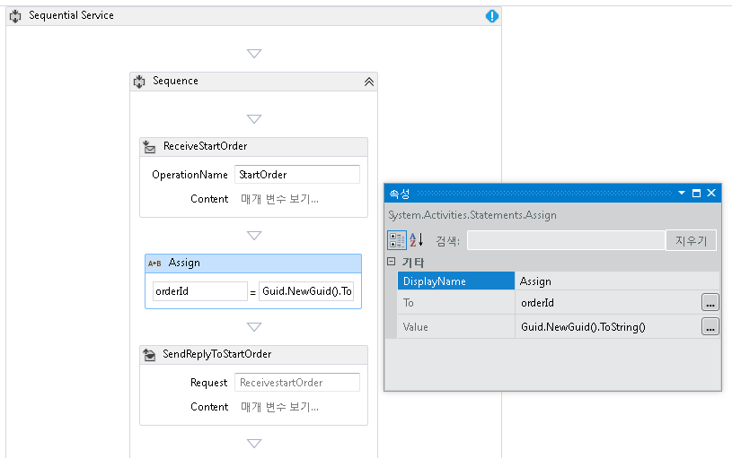</span><span class="sxs-lookup"><span data-stu-id="76127-163"></span></span>  
  
         <span data-ttu-id="76127-164">이렇게 하면 새 주문 ID가 만들어지고 orderId 변수에 값이 배치됩니다.</span><span class="sxs-lookup"><span data-stu-id="76127-164">This creates a new order ID and places the value in the orderId variable.</span></span>  
  
    6.  <span data-ttu-id="76127-165">선택 된 **ReplyToStartOrder** 활동입니다.</span><span class="sxs-lookup"><span data-stu-id="76127-165">Select the **ReplyToStartOrder** activity.</span></span> <span data-ttu-id="76127-166">속성 창에 대 한 줄임표 단추를 클릭 **CorrelationInitializers**합니다.</span><span class="sxs-lookup"><span data-stu-id="76127-166">In the properties window click the ellipsis button for **CorrelationInitializers**.</span></span> <span data-ttu-id="76127-167">선택 된 **이니셜라이저 추가** 링크를 입력 `orderIdHandle` 고 이니셜라이저 텍스트 상자에서 상관 관계 형식의 쿼리 상관 관계 이니셜라이저를 선택 하 고 XPATH 쿼리 드롭다운 상자에서 p_orderId를 선택 합니다.</span><span class="sxs-lookup"><span data-stu-id="76127-167">Select the **Add initializer** link, enter `orderIdHandle` in the Initializer text box, select Query correlation initializer for the Correlation type, and select p_orderId under the XPATH Queries dropdown box.</span></span> <span data-ttu-id="76127-168">이러한 설정이 다음 그림에 나와 있습니다.</span><span class="sxs-lookup"><span data-stu-id="76127-168">These settings are shown in the following illustration.</span></span> <span data-ttu-id="76127-169">**확인**을 클릭합니다.</span><span class="sxs-lookup"><span data-stu-id="76127-169">Click **OK**.</span></span>  <span data-ttu-id="76127-170">클라이언트와 이 워크플로 서비스 인스턴스 간에 상관 관계가 초기화됩니다.</span><span class="sxs-lookup"><span data-stu-id="76127-170">This initializes a correlation between the client and this instance of the workflow service.</span></span> <span data-ttu-id="76127-171">이 주문 ID가 포함된 메시지가 수신되면 이 워크플로 서비스 인스턴스로 라우팅됩니다.</span><span class="sxs-lookup"><span data-stu-id="76127-171">When a message containing this order ID is received it is routed to this instance of the workflow service.</span></span>  
  
         <span data-ttu-id="76127-172">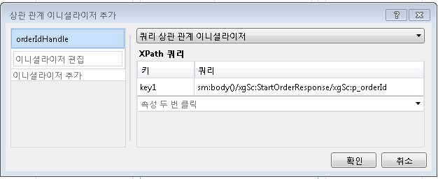</span><span class="sxs-lookup"><span data-stu-id="76127-172"></span></span>  
  
7.  <span data-ttu-id="76127-173">끌어서 놓기 다른 **ReceiveAndSendReply** 활동을 워크플로의 끝 (외부의 **시퀀스** 첫 번째 포함 된 **수신** 및  **SendReply** 활동).</span><span class="sxs-lookup"><span data-stu-id="76127-173">Drag and drop another **ReceiveAndSendReply** activity to the end of the workflow (outside the **Sequence** containing the first **Receive** and **SendReply** activities).</span></span> <span data-ttu-id="76127-174">이 활동은 클라이언트에서 보낸 두 번째 메시지를 받고 응답합니다.</span><span class="sxs-lookup"><span data-stu-id="76127-174">This will receive the second message sent by the client and respond to it.</span></span>  
  
    1.  <span data-ttu-id="76127-175">선택 된 **시퀀스** 새로 추가 된 포함 된 **수신** 및 **SendReply** 활동과 클릭은 **변수** 단추 합니다.</span><span class="sxs-lookup"><span data-stu-id="76127-175">Select the **Sequence** that contains the newly added **Receive** and **SendReply** activities and click the **Variables** button.</span></span> <span data-ttu-id="76127-176">다음 그림에 강조 표시된 변수를 추가합니다.</span><span class="sxs-lookup"><span data-stu-id="76127-176">Add the variable highlighted in the following illustration:</span></span>  
  
         <span data-ttu-id="76127-177">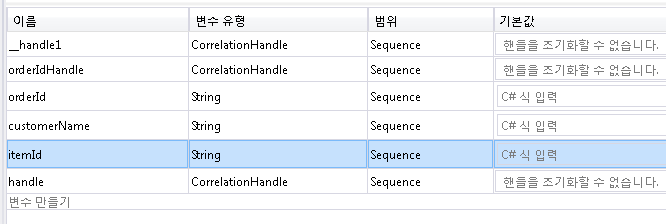</span><span class="sxs-lookup"><span data-stu-id="76127-177"></span></span>  
  
    2.  <span data-ttu-id="76127-178">선택의 **수신** 활동 하 고 다음 그림에 나와 있는 속성을 설정 합니다.</span><span class="sxs-lookup"><span data-stu-id="76127-178">Select the **Receive** activity and set the properties shown in the following illustration:</span></span>  
  
         <span data-ttu-id="76127-179">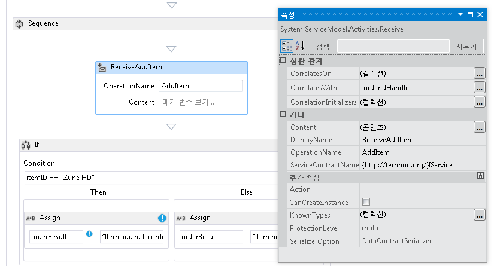</span><span class="sxs-lookup"><span data-stu-id="76127-179"></span></span>  
  
    3.  <span data-ttu-id="76127-180">클릭는 **정의...**  링크를 **ReceiveAddItem** 활동 하 고 다음 그림에 표시 된 매개 변수 추가:이 주문 ID와 주문 되는 항목의 ID 두 개의 매개 변수를 수락 하도록 수신 작업을 구성 합니다.</span><span class="sxs-lookup"><span data-stu-id="76127-180">Click the **Define...** link in the **ReceiveAddItem** activity and add the parameters shown in the following illustration:This configures the receive activity to accept two parameters, the order ID and the ID of the item being ordered.</span></span>  
  
         <span data-ttu-id="76127-181">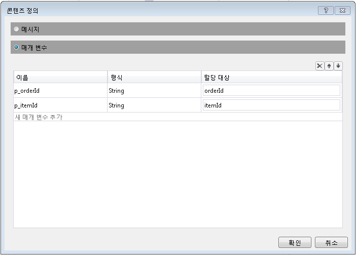</span><span class="sxs-lookup"><span data-stu-id="76127-181"></span></span>  
  
    4.  <span data-ttu-id="76127-182">클릭는 **CorrelateOn** 줄임표 단추를 선택한 입력 `orderIdHandle`합니다.</span><span class="sxs-lookup"><span data-stu-id="76127-182">Click the **CorrelateOn** ellipsis button and enter `orderIdHandle`.</span></span> <span data-ttu-id="76127-183">아래 **XPath 쿼리**를 드롭다운 화살표를 클릭 하 고 `p_orderId`합니다.</span><span class="sxs-lookup"><span data-stu-id="76127-183">Under **XPath Queries**, click the drop down arrow and select `p_orderId`.</span></span> <span data-ttu-id="76127-184">이렇게 하면 두 번째 Receive 활동에 대한 상관 관계가 구성됩니다.</span><span class="sxs-lookup"><span data-stu-id="76127-184">This configures the correlation on the second receive activity.</span></span> [!INCLUDE[crabout](../../../../includes/crabout-md.md)]<span data-ttu-id="76127-185">상관 관계 참조 [상관 관계](../../../../docs/framework/wcf/feature-details/correlation.md)합니다.</span><span class="sxs-lookup"><span data-stu-id="76127-185"> correlation see [Correlation](../../../../docs/framework/wcf/feature-details/correlation.md).</span></span>  
  
         <span data-ttu-id="76127-186">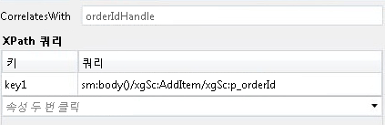</span><span class="sxs-lookup"><span data-stu-id="76127-186"></span></span>  
  
    5.  <span data-ttu-id="76127-187">끌어서 놓기는 **경우** 작업 바로 뒤의 **ReceiveAddItem** 활동입니다.</span><span class="sxs-lookup"><span data-stu-id="76127-187">Drag and drop an **If** activity immediately after the **ReceiveAddItem** activity.</span></span> <span data-ttu-id="76127-188">이 활동은 if 문처럼 작동합니다.</span><span class="sxs-lookup"><span data-stu-id="76127-188">This activity acts just like an if statement.</span></span>  
  
        1.  <span data-ttu-id="76127-189">설정의 **조건** 속성을`itemId=="Zune HD" (itemId="Zune HD" for Visual Basic)`</span><span class="sxs-lookup"><span data-stu-id="76127-189">Set the **Condition** property to `itemId=="Zune HD" (itemId="Zune HD" for Visual Basic)`</span></span>  
  
        2.  <span data-ttu-id="76127-190">끌어서 놓기는 **할당** 활동을는 **다음** 섹션과에 다른는 **Else** 의 속성을 설정 하는 섹션에서 **할당** 다음 그림과 같이 작업 합니다.</span><span class="sxs-lookup"><span data-stu-id="76127-190">Drag and drop an **Assign** activity in to the **Then** section and another into the **Else** section set the properties of the **Assign** activities as shown in the following illustration.</span></span>  
  
             <span data-ttu-id="76127-191">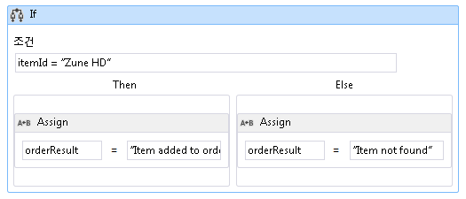</span><span class="sxs-lookup"><span data-stu-id="76127-191"></span></span>  
  
             <span data-ttu-id="76127-192">조건이 `true` 는 **다음** 섹션 실행 됩니다.</span><span class="sxs-lookup"><span data-stu-id="76127-192">If the condition is `true` the **Then** section will be executed.</span></span> <span data-ttu-id="76127-193">조건이 `false` 는 **Else** 섹션이 실행 됩니다.</span><span class="sxs-lookup"><span data-stu-id="76127-193">If the condition is `false` the **Else** section is executed.</span></span>  
  
        3.  <span data-ttu-id="76127-194">선택 된 **SendReplyToReceive** 활동 집합과 **DisplayName** 다음 그림에 표시 된 속성입니다.</span><span class="sxs-lookup"><span data-stu-id="76127-194">Select the **SendReplyToReceive** activity and set the **DisplayName** property shown in the following illustration.</span></span>  
  
             <span data-ttu-id="76127-195">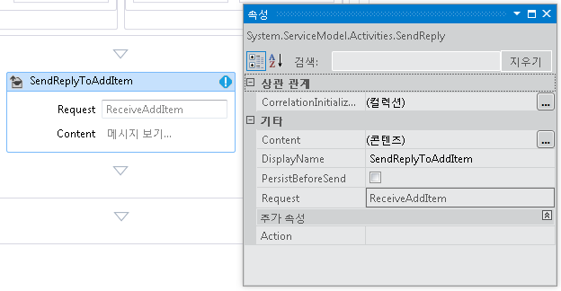</span><span class="sxs-lookup"><span data-stu-id="76127-195"></span></span>  
  
        4.  <span data-ttu-id="76127-196">클릭는 **정의...**  연결에 **SetReplyToAddItem** 활동 다음 그림에 나와 있는 대로 구성 합니다.</span><span class="sxs-lookup"><span data-stu-id="76127-196">Click the **Define ...** link in the **SetReplyToAddItem** activity and configure it as shown in the following illustration.</span></span> <span data-ttu-id="76127-197">이렇게 하면 구성는 **SendReplyToAddItem** 활동에서 값을 반환 하는 `orderResult` 변수입니다.</span><span class="sxs-lookup"><span data-stu-id="76127-197">This configures the **SendReplyToAddItem** activity to return the value in the `orderResult` variable.</span></span>  
  
             <span data-ttu-id="76127-198"></span><span class="sxs-lookup"><span data-stu-id="76127-198"></span></span>  
  
8.  <span data-ttu-id="76127-199">Web.config 파일을 열고 다음 요소에 추가 \<동작 > 섹션에 워크플로 지 속성을 사용 합니다.</span><span class="sxs-lookup"><span data-stu-id="76127-199">Open the web.config file and add the following elements in the \<behavior> section to enable workflow persistence.</span></span>  
  
    ```xml  
    <sqlWorkflowInstanceStore connectionString="Data Source=your-machine\SQLExpress;Initial Catalog=SQLPersistenceStore;Integrated Security=True;Asynchronous Processing=True" instanceEncodingOption="None" instanceCompletionAction="DeleteAll" instanceLockedExceptionAction="BasicRetry" hostLockRenewalPeriod="00:00:30" runnableInstancesDetectionPeriod="00:00:02" />  
              <workflowIdle timeToUnload="0"/>  
    ```  
  
    > [!WARNING]
    >  <span data-ttu-id="76127-200">이전 코드 조각의 호스트 및 SQL Server 인스턴스 이름을 바꿔야 합니다.</span><span class="sxs-lookup"><span data-stu-id="76127-200">Make sure to replace your host and SQL server instance name in the previous code snippet.</span></span>  
  
9. <span data-ttu-id="76127-201">솔루션을 빌드합니다.</span><span class="sxs-lookup"><span data-stu-id="76127-201">Build the solution.</span></span>  
  
### <a name="to-create-a-client-application-to-call-the-workflow-service"></a><span data-ttu-id="76127-202">클라이언트 응용 프로그램을 만들어 워크플로 서비스를 호출하려면</span><span class="sxs-lookup"><span data-stu-id="76127-202">To Create a Client Application to Call the Workflow Service</span></span>  
  
1.  <span data-ttu-id="76127-203">솔루션에 `OrderClient`라는 새 콘솔 응용 프로그램 프로젝트를 추가합니다.</span><span class="sxs-lookup"><span data-stu-id="76127-203">Add a new Console application project called `OrderClient` to the solution.</span></span>  
  
2.  <span data-ttu-id="76127-204">다음 어셈블리에 대한 참조를 `OrderClient` 프로젝트에 추가합니다.</span><span class="sxs-lookup"><span data-stu-id="76127-204">Add references to the following assemblies to the `OrderClient` project</span></span>  
  
    1.  <span data-ttu-id="76127-205">System.ServiceModel.dll</span><span class="sxs-lookup"><span data-stu-id="76127-205">System.ServiceModel.dll</span></span>  
  
    2.  <span data-ttu-id="76127-206">System.ServiceModel.Activities.dll</span><span class="sxs-lookup"><span data-stu-id="76127-206">System.ServiceModel.Activities.dll</span></span>  
  
3.  <span data-ttu-id="76127-207">서비스 참조를 워크플로 서비스에 추가하고 `OrderService`를 네임스페이스로 지정합니다.</span><span class="sxs-lookup"><span data-stu-id="76127-207">Add a service reference to the workflow service and specify `OrderService` as the namespace.</span></span>  
  
4.  <span data-ttu-id="76127-208">클라이언트 프로젝트의 `Main()` 메서드에서 다음 코드를 추가합니다.</span><span class="sxs-lookup"><span data-stu-id="76127-208">In the `Main()` method of the client project add the following code:</span></span>  
  
    ```  
    static void Main(string[] args)  
    {  
       // Send initial message to start the workflow service  
       Console.WriteLine("Sending start message");  
       StartOrderClient startProxy = new StartOrderClient();  
       string orderId = startProxy.StartOrder("Kim Abercrombie");  
  
       // The workflow service is now waiting for the second message to be sent  
       Console.WriteLine("Workflow service is idle...");  
       Console.WriteLine("Press [ENTER] to send an add item message to reactivate the workflow service...");  
       Console.ReadLine();  
  
       // Send the second message  
       Console.WriteLine("Sending add item message");  
       AddItemClient addProxy = new AddItemClient();  
       AddItem item = new AddItem();  
       item.p_itemId = "Zune HD";  
       item.p_orderId = orderId;  
  
       string orderResult = addProxy.AddItem(item);  
       Console.WriteLine("Service returned: " + orderResult);  
    }  
    ```  
  
5.  <span data-ttu-id="76127-209">솔루션을 빌드하고 `OrderClient` 응용 프로그램을 실행합니다.</span><span class="sxs-lookup"><span data-stu-id="76127-209">Build the solution and run the `OrderClient` application.</span></span> <span data-ttu-id="76127-210">클라이언트에서 다음 텍스트가 표시됩니다.</span><span class="sxs-lookup"><span data-stu-id="76127-210">The client will display the following text:</span></span>  
  
    ```Output  
    Sending start messageWorkflow service is idle...Press [ENTER] to send an add item message to reactivate the workflow service...  
    ```  
  
6.  <span data-ttu-id="76127-211">워크플로 서비스가 유지 되었는지 있는지를 확인 하려면 SQL Server Management Studio를 시작으로 이동 하 여는 **시작** 메뉴 선택 **모든 프로그램**, **Microsoft SQL Server 2008**, **SQL Server Management Studio**합니다.</span><span class="sxs-lookup"><span data-stu-id="76127-211">To verify that the workflow service has been persisted, start the SQL Server Management Studio by going to the **Start** menu, Selecting **All Programs**, **Microsoft SQL Server 2008**, **SQL Server Management Studio**.</span></span>  
  
    1.  <span data-ttu-id="76127-212">왼쪽 창에서 확장을 **데이터베이스**, **SQLPersistenceStore**, **뷰** 마우스 오른쪽 단추로 클릭 하 고 **System.Activities.DurableInstancing.Instances**  선택 **상위 1000 개 행 선택**합니다.</span><span class="sxs-lookup"><span data-stu-id="76127-212">In the left hand pane expand, **Databases**, **SQLPersistenceStore**, **Views** and right click **System.Activities.DurableInstancing.Instances** and select **Select Top 1000 Rows**.</span></span> <span data-ttu-id="76127-213">에 **결과** 창 나열 된 인스턴스를 하나 이상 참조를 확인 합니다.</span><span class="sxs-lookup"><span data-stu-id="76127-213">In the **Results** pane verify you see at least one instance listed.</span></span> <span data-ttu-id="76127-214">실행하는 동안 예외가 발생한 경우 이전 실행의 다른 인스턴스가 있을 수 있습니다.</span><span class="sxs-lookup"><span data-stu-id="76127-214">There may be other instances from prior runs if an exception occurred while running.</span></span> <span data-ttu-id="76127-215">마우스 오른쪽 단추로 클릭 하 여 기존 행을 삭제할 수 **System.Activities.DurableInstancing.Instances** 선택 하 고 **편집 상위 200 개 행**를 누르면는 **Execute** 단추를 결과 창에서 모든 행을 선택 하 고 선택 하면 **삭제**합니다.</span><span class="sxs-lookup"><span data-stu-id="76127-215">You can delete existing rows by right clicking **System.Activities.DurableInstancing.Instances** and selecting **Edit Top 200 rows**, pressing the **Execute** button, selecting all rows in the results pane and selecting **delete**.</span></span>  <span data-ttu-id="76127-216">데이터베이스에 표시되는 인스턴스가 응용 프로그램에서 만든 인스턴스인지 확인하려면 클라이언트를 실행하기 전에 인스턴스 뷰가 비어 있는지 확인합니다.</span><span class="sxs-lookup"><span data-stu-id="76127-216">To verify the instance displayed in the database is the instance your application created, verify the instances view is empty prior to running the client.</span></span> <span data-ttu-id="76127-217">클라이언트가 실행되고 있으면 쿼리(상위 1000개의 행 선택)를 다시 실행하고 새 인스턴스가 추가되었는지 확인합니다.</span><span class="sxs-lookup"><span data-stu-id="76127-217">Once the client is running re-run the query (Select Top 1000 Rows) and verify a new instance has been added.</span></span>  
  
7.  <span data-ttu-id="76127-218">Enter 키를 눌러 워크플로 서비스에 품목 추가 메시지를 보냅니다.</span><span class="sxs-lookup"><span data-stu-id="76127-218">Press enter to send the add item message to the workflow service.</span></span> <span data-ttu-id="76127-219">클라이언트에서 다음 텍스트가 표시됩니다.</span><span class="sxs-lookup"><span data-stu-id="76127-219">The client will display the following text:</span></span>  
  
    ```Output  
    Sending add item messageService returned: Item added to orderPress any key to continue . . .  
    ```  
  
## <a name="see-also"></a><span data-ttu-id="76127-220">참고 항목</span><span class="sxs-lookup"><span data-stu-id="76127-220">See Also</span></span>  
 [<span data-ttu-id="76127-221">워크플로 서비스</span><span class="sxs-lookup"><span data-stu-id="76127-221">Workflow Services</span></span>](../../../../docs/framework/wcf/feature-details/workflow-services.md)
