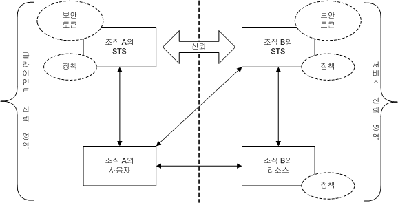
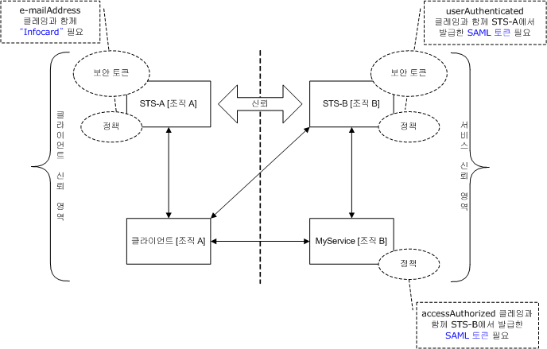
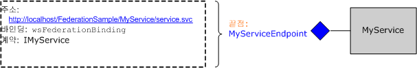
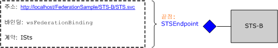
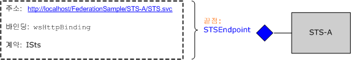
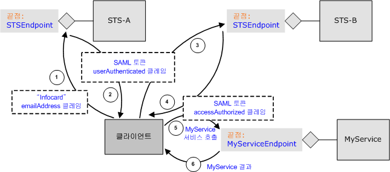

# <a name="federation"></a>페더레이션
이 항목에서는 페더레이션 보안의 개념에 대한 간략한 개요를 제공합니다. 또한 페더레이션된 보안 아키텍처 배포에 대 한 Windows Communication Foundation (WCF) 지원을 설명 합니다. 페더레이션을 보여 주는 샘플 응용 프로그램을 참조 하십시오. [Federation 샘플](../../../../docs/framework/wcf/samples/federation-sample.md)합니다.  
  
## <a name="definition-of-federated-security"></a>페더레이션 보안 정의  
 페더레이션 보안을 사용하면 클라이언트가 액세스 중인 서비스, 관련 인증, 권한 부여 절차를 서로 확실히 구분할 수 있습니다. 페더레이션 보안을 통해 여러 신뢰 영역에 있는 여러 시스템, 네트워크 및 조직 간에 공동 작업을 수행할 수도 있습니다.  
  
 WCF에는 페더레이션된 보안을 사용 하는 분산된 시스템을 구축 하기 위한 지원을 제공 합니다.  
  
### <a name="elements-of-a-federated-security-architecture"></a>페더레이션 보안 아키텍처의 요소  
 다음 표에 설명된 것처럼 페더레이션 보안 아키텍처에는 세 가지 요소가 있습니다.  
  
|요소|설명|  
|-------------|-----------------|  
|도메인/영역|보안 관리 또는 신뢰의 단일 단위입니다. 일반 도메인은 단일 조직을 포함할 수 있습니다.|  
|페더레이션|설정된 신뢰가 있는 도메인의 컬렉션입니다. 신뢰 수준은 다양할 수 있지만 일반적으로 인증을 포함하며, 거의 대부분의 경우 권한 부여를 포함합니다. 일반 페더레이션에는 리소스 집합에 대한 공유 액세스에 대해 신뢰를 설정한 여러 조직이 포함될 수 있습니다.|  
|STS(보안 토큰 서비스)|보안 토큰을 발급하는 웹 서비스. 이 웹 서비스에서 신뢰하는 증거를 기반으로 누구나 이 어설션을 신뢰할 수 있도록 만듭니다. 이는 도메인 간의 신뢰를 조정하는 기준을 형성합니다.|  
  
### <a name="example-scenario"></a>예제 시나리오  
 다음 그림에서는 페더레이션 보안의 예제를 보여 줍니다.  
  
   
  
 이 시나리오에는 A와 B라는 두 조직이 있습니다. 조직 B에는 조직 A의 일부 사용자가 가치 있게 여기는 웹 리소스(웹 서비스)가 있습니다.  
  
> [!NOTE]
>  이 섹션의 용어를 사용 하 여 *리소스*, *서비스*, 및 *웹 서비스* 같은 의미로 합니다.  
  
 일반적으로 조직 A의 사용자는 조직 B의 서비스에 액세스하기 전에 일부 유효한 인증 형식을 제공해야 합니다. 뿐만 아니라 해당 사용자는 조직 B에서 특정 리소스에 액세스하려면 권한을 부여받아야 할 수도 있습니다. 이 문제를 해결하고 조직 A의 사용자가 조직 B의 리소스에 액세스할 수 있도록 하기 위한 한 가지 방법은 다음과 같습니다.  
  
-   조직 A의 사용자는 조직 B와 함께 자격 증명(사용자 이름 및 암호)을 등록합니다.  
  
-   리소스에 액세스하는 동안 조직 A의 사용자는 자격 증명을 조직 B에 제공하고, 리소스에 액세스하기 전에 인증됩니다.  
  
 이 접근 방식에는 세 가지 중대한 단점이 있습니다.  
  
-   조직 B는 해당 로컬 사용자의 자격 증명뿐만 아니라 조직 A의 사용자 자격 증명도 관리해야 합니다.  
  
-   조직 A의 사용자는 조직 A 내의 리소스에 대한 액세스 권한을 얻기 위해 일반적으로 사용하는 자격 증명 외에 추가 자격 증명 집합도 유지 관리(추가 사용자 이름 및 암호를 기억)해야 합니다. 이렇게 되면 사용자는 대개 여러 서비스 사이트에서 동일한 사용자 이름과 암호를 사용하게 되며, 이것은 취약한 보안 방법입니다.  
  
-   여러 조직이 조직 B의 리소스를 가치 있는 것으로 인식함에 따라 아키텍처는 확장되지 않습니다.  
  
 위에 언급한 단점을 해결하는 대체 접근 방식은 페더레이션 보안을 사용하는 것입니다. 이러한 접근 방식으로 조직 A와 B는 신뢰 관계를 구축하고, 구축된 신뢰 관계를 조정하기 위해 STS(보안 토큰 서비스)를 사용합니다.  
  
 페더레이션 보안 아키텍처에서, 조직 A의 사용자는 조직 B의 STS에서 발급된 유효한 보안 토큰(특정 서비스에 대한 액세스 권한을 부여하고 인증)을 제공해야 하는 조직 B의 웹 서비스에 액세스할지 여부를 알고 있습니다.  
  
 사용자는 STS B에 연결하여 STS와 관련된 정책으로부터 다른 수준의 간접 참조를 받습니다. STS A(클라이언트 신뢰 영역)에서 발급한 유효한 보안 토큰을 제공해야 STS B가 보안 토큰을 발급할 수 있습니다. 이는 두 조직 간에 자연스럽게 구축된 신뢰 관계이며, 조직 B가 조직 A의 사용자 ID를 관리할 필요가 없음을 의미합니다. 사실상 STS B에는 일반적으로 null `issuerAddress`와 `issuerMetadataAddress`가 있습니다. 자세한 내용은 참조 [하는 방법: 로컬 발급자 구성](../../../../docs/framework/wcf/feature-details/how-to-configure-a-local-issuer.md)합니다. 클라이언트를 STS A. 찾을 로컬 정책을 확인 하는 경우 이 구성을 라고 *홈 영역 페더레이션* STS B 1. STS에 대 한 정보를 유지 관리할 필요가 없기 때문에 확장 성능이 보다 우수 하 고  
  
 그런 다음 사용자는 조직 A의 STS에 연결하고, 조직 A 내의 기타 리소스에 대한 액세스 권한을 얻기 위해 일반적으로 사용하는 인증 자격 증명을 제공함으로써 보안 토큰을 가져옵니다. 이는 또한 사용자가 여러 자격 증명 집합을 유지 관리해야 하거나 여러 서비스 사이트에서 동일한 자격 증명 집합을 사용하는 문제를 줄여줍니다.  
  
 사용자는 STS A로부터 가져온 보안 토큰을 STS B에 제공합니다. 조직 B에서는 사용자 요청에 대한 권한 부여를 수행하고, 자체 보안 토큰 집합으로부터 사용자에게 보안 토큰을 발급합니다. 그런 다음 사용자는 토큰을 조직 B의 리소스에 제공하고 서비스에 액세스합니다.  
  
## <a name="support-for-federated-security-in-wcf"></a>WCF의 페더레이션 보안을 위한 지원  
 WCF를 통해 페더레이션된 보안 아키텍처 배포를 위한 턴키 지원을 제공는 [ \<wsFederationHttpBinding >](../../../../docs/framework/configure-apps/file-schema/wcf/wsfederationhttpbinding.md)합니다.  
  
 [ \<wsFederationHttpBinding >](../../../../docs/framework/configure-apps/file-schema/wcf/wsfederationhttpbinding.md) 요소에 대 한 HTTP 요청-회신 통신 스타일에 대 한 기본 전송 메커니즘으로 사용 해야 하는 보안성, 안정성, 상호 운용 가능한 바인딩을 제공 텍스트 및 XML 인코딩 통신 형식으로 사용 합니다.  
  
 사용 [ \<wsFederationHttpBinding >](../../../../docs/framework/configure-apps/file-schema/wcf/wsfederationhttpbinding.md) 페더레이션 보안에서 시나리오 분리할 수 있습니다 논리적으로 독립 두 단계로 다음 섹션에 설명 된 대로 합니다.  
  
### <a name="phase-1-design-phase"></a>1단계: 디자인 단계  
 디자인 단계 동안 클라이언트가 사용 하 여 [ServiceModel Metadata 유틸리티 도구 (Svcutil.exe)](../../../../docs/framework/wcf/servicemodel-metadata-utility-tool-svcutil-exe.md) 서비스 끝점이 노출 정책을 확인 하 고 서비스의 인증 및 권한 부여 요구 사항을 수집 하 합니다. 적절한 프록시는 클라이언트에서 다음 페더레이션 보안 통신 패턴을 만들기 위해 생성됩니다.  
  
-   클라이언트 신뢰 영역의 STS로부터 보안 토큰을 가져옵니다.  
  
-   서비스 신뢰 영역의 STS에 대해 토큰을 제공합니다.  
  
-   서비스 신뢰 영역에서 STS로부터 보안 토큰을 가져옵니다.  
  
-   서비스에 대한 토큰을 제시하여 서비스에 액세스합니다.  
  
### <a name="phase-2-run-time-phase"></a>2단계: 런타임 단계  
 런타임 단계 동안 클라이언트는 WCF 클라이언트 클래스의 개체를 인스턴스화합니다 하 고 WCF 클라이언트를 사용 하 여에 대 한 호출. WCF의 기본 프레임 워크는 페더레이션된 보안 통신 패턴에서 이전에 언급 한 단계를 처리 하 고 원활 하 게 서비스를 사용할 수 있습니다.  
  
## <a name="sample-implementation-using-wcf"></a>WCF를 사용하여 샘플 구현  
 다음 그림에는 WCF의 기본적인 지원을 사용 하 여 페더레이션된 보안 아키텍처에 대 한 샘플 구현을 보여 줍니다.  
  
   
  
### <a name="example-myservice"></a>예제 MyService  
 `MyService` 서비스는 `MyServiceEndpoint`를 통해 단일 끝점을 노출합니다. 다음 그림에서는 끝점과 연관된 주소, 바인딩 및 계약을 보여 줍니다.  
  
   
  
 서비스 끝점 `MyServiceEndpoint` 사용 하 여는 [ \<wsFederationHttpBinding >](../../../../docs/framework/configure-apps/file-schema/wcf/wsfederationhttpbinding.md) 와 유효한 보안 어설션을 Markup Language (SAML) 토큰으로 이루어지며는 `accessAuthorized` 2. STS에서 발급 한 클레임 이 서비스 구성에 선언적으로 지정 됩니다.  
  
```xml  
<system.serviceModel>  
  <services>  
    <service type="FederationSample.MyService"      
        behaviorConfiguration='MyServiceBehavior'>  
        <endpoint address=""  
            binding=" wsFederationHttpBinding"  
            bindingConfiguration='MyServiceBinding'  
            contract="Federation.IMyService" />  
   </service>  
  </services>  
  
  <bindings>  
    <wsFederationHttpBinding>  
    <!-- This is the binding used by MyService. It redirects   
    clients to STS-B. -->  
      <binding name='MyServiceBinding'>  
        <security mode="Message">  
           <message issuedTokenType=  
"http://docs.oasis-open.org/wss/oasis-wss-saml-token-profile-1.1#SAMLV1.1">  
           <issuer address="http://localhost/FederationSample/STS-B/STS.svc" />  
            <issuerMetadata   
           address=  
"http://localhost/FederationSample/STS-B/STS.svc/mex" />  
         <requiredClaimTypes>  
            <add claimType="http://tempuri.org:accessAuthorized" />  
         </requiredClaimTypes>  
        </message>  
      </security>  
      </binding>  
    </wsFederationHttpBinding>  
  </bindings>  
  
  <behaviors>  
    <behavior name='MyServiceBehavior'>  
      <serviceAuthorization   
operationRequirementType="FederationSample.MyServiceOperationRequirement, MyService" />  
       <serviceCredentials>  
         <serviceCertificate findValue="CN=FederationSample.com"  
         x509FindType="FindBySubjectDistinguishedName"  
         storeLocation='LocalMachine'  
         storeName='My' />  
      </serviceCredentials>  
    </behavior>  
  </behaviors>  
</system.serviceModel>  
```  
  
> [!NOTE]
>  `MyService`에서 필요로 하는 클레임에 대해 미세한 지점이 언급되어야 합니다. 두 번째 그림에서는 `MyService`에는 `accessAuthorized` 클레임과 함께 SAML 토큰이 필요함을 나타냅니다. 좀 더 구체적으로 설명하면 이는 `MyService`에서 필요로 하는 클레임 형식을 지정합니다. 이 클레임 형식의 정규화 된 이름은 http://tempuri.org:accessAuthorized (연관된 네임 스페이스 포함)을 함께 사용 되는 서비스 구성 파일입니다. 이 클레임의 값은 이 클레임의 존재를 표시하고, STS B에 의해 `true`로 설정된다고 가정합니다.  
  
 런타임에 이 정책은 `MyServiceOperationRequirement`의 일부로 구현되는 `MyService` 클래스에 의해 적용됩니다.  
  
 [!code-csharp[C_Federation#0](../../../../samples/snippets/csharp/VS_Snippets_CFX/c_federation/cs/source.cs#0)]
 [!code-vb[C_Federation#0](../../../../samples/snippets/visualbasic/VS_Snippets_CFX/c_federation/vb/source.vb#0)]  
[!code-csharp[C_Federation#1](../../../../samples/snippets/csharp/VS_Snippets_CFX/c_federation/cs/source.cs#1)]
[!code-vb[C_Federation#1](../../../../samples/snippets/visualbasic/VS_Snippets_CFX/c_federation/vb/source.vb#1)]  
  
#### <a name="sts-b"></a>STS B  
 다음 그림에서는 STS B를 보여 줍니다. 위에서 설명한 것처럼 STS(보안 토큰 서비스)도 웹 서비스이며 이와 연관된 끝점, 정책 등을 가질 수 있습니다.  
  
   
  
 STS B는 보안 토큰을 요청하는 데 사용할 수 있는 `STSEndpoint`라는 단일 끝점을 노출합니다. 특히 STS B는 서비스에 액세스하기 위해 `accessAuthorized` 클레임과 함께 `MyService` 서비스 사이트에 제공할 수 있는 SAML 토큰을 발급합니다. 그러나 STS B를 사용하려면 `userAuthenticated` 클레임이 포함된 STS A에서 발급한 유효한 SAML 토큰을 제공해야 합니다. 이는 STS 구성에서 선언적으로 지정됩니다.  
  
```xml  
<system.serviceModel>  
  <services>  
    <service type="FederationSample.STS_B" behaviorConfiguration=  
     "STS-B_Behavior">  
    <endpoint address=""  
              binding="wsFederationHttpBinding"  
              bindingConfiguration='STS-B_Binding'  
      contract="FederationSample.ISts" />  
    </service>  
  </services>  
  <bindings>  
    <wsFederationHttpBinding>  
    <!-- This is the binding used by STS-B. It redirects clients to   
         STS-A. -->  
      <binding name='STS-B_Binding'>  
        <security mode='Message'>  
          <message issuedTokenType="http://docs.oasis-open.org/wss/oasis-wss-saml-token-profile-1.1#SAMLV1.1">  
          <issuer address='http://localhost/FederationSample/STS-A/STS.svc' />  
          <issuerMetadata address='http://localhost/FederationSample/STS-A/STS.svc/mex'/>  
          <requiredClaimTypes>  
            <add claimType='http://tempuri.org:userAuthenticated'/>  
          </requiredClaimTypes>  
          </message>  
        </security>  
    </binding>  
   </wsFederationHttpBinding>  
  </bindings>  
  <behaviors>  
  <behavior name='STS-B_Behavior'>  
    <serviceAuthorization   operationRequirementType='FederationSample.STS_B_OperationRequirement, STS_B' />  
    <serviceCredentials>  
      <serviceCertificate findValue='CN=FederationSample.com'  
      x509FindType='FindBySubjectDistinguishedName'  
       storeLocation='LocalMachine'  
       storeName='My' />  
     </serviceCredentials>  
   </behavior>  
  </behaviors>  
</system.serviceModel>  
```  
  
> [!NOTE]
>  다시,는 `userAuthenticated` 클레임은 STS B.에 필요한 클레임 형식 이 클레임 형식의 정규화 된 이름은 http://tempuri.org:userAuthenticated (연관된 네임 스페이스 포함)을 함께 사용 되는 STS 구성 파일입니다. 이 클레임의 값은 이 클레임의 존재를 표시하고 STS A에 의해 `true`로 설정된다고 가정합니다.  
  
 런타임에 `STS_B_OperationRequirement` 클래스는 STS B의 일부로 구현되는 이 정책을 적용합니다.  
  
 [!code-csharp[C_Federation#2](../../../../samples/snippets/csharp/VS_Snippets_CFX/c_federation/cs/source.cs#2)]
 [!code-vb[C_Federation#2](../../../../samples/snippets/visualbasic/VS_Snippets_CFX/c_federation/vb/source.vb#2)]  
  
 액세스가 확인되면 STS B는 `accessAuthorized` 클레임과 함께 SAML 토큰을 발급합니다.  
  
 [!code-csharp[C_Federation#3](../../../../samples/snippets/csharp/VS_Snippets_CFX/c_federation/cs/source.cs#3)]
 [!code-vb[C_Federation#3](../../../../samples/snippets/visualbasic/VS_Snippets_CFX/c_federation/vb/source.vb#3)]  
  
#### <a name="sts-a"></a>STS A  
 다음 그림은 STS A를 보여 줍니다.  
  
   
  
 STS B와 마찬가지로 STS A도 보안 토큰을 발급하고, 이를 위해 단일 끝점을 노출하는 웹 서비스입니다. 그러나 이는 다른 바인딩(`wsHttpBinding`)을 사용하며, 사용자가 [!INCLUDE[infocard](../../../../includes/infocard-md.md)] 클레임과 함께 유효한 `emailAddress`를 제공해야 합니다. 그 결과, STS A가 `userAuthenticated` 클레임과 함께 SAML 토큰을 발급합니다. 이는 서비스 구성에서 선언적으로 지정됩니다.  
  
```xml  
<system.serviceModel>  
  <services>  
    <service type="FederationSample.STS_A" behaviorConfiguration="STS-A_Behavior">  
      <endpoint address=""  
                binding="wsHttpBinding"  
                bindingConfiguration="STS-A_Binding"  
                contract="FederationSample.ISts">  
       <identity>  
       <certificateReference findValue="CN=FederationSample.com"    
                       x509FindType="FindBySubjectDistinguishedName"  
                       storeLocation="LocalMachine"   
                       storeName="My" />  
       </identity>  
    <endpoint>  
  </service>  
</services>  
  
<bindings>  
  <wsHttpBinding>  
  <!-- This is the binding used by STS-A. It requires users to present  
   a CardSpace. -->  
    <binding name='STS-A_Binding'>  
      <security mode='Message'>  
        <message clientCredentialType="CardSpace" />  
      </security>  
    </binding>  
  </wsHttpBinding>  
</bindings>  
  
<behaviors>  
  <behavior name='STS-A_Behavior'>  
    <serviceAuthorization operationRequirementType=  
     "FederationSample.STS_A_OperationRequirement, STS_A" />  
      <serviceCredentials>  
  <serviceCertificate findValue="CN=FederationSample.com"  
                     x509FindType='FindBySubjectDistinguishedName'  
                     storeLocation='LocalMachine'  
                     storeName='My' />  
      </serviceCredentials>  
    </behavior>  
  </behaviors>  
</system.serviceModel>  
```  
  
 런타임에 `STS_A_OperationRequirement` 클래스는 STS A의 일부로 구현되는 이 정책을 적용합니다.  
  
 [!code-csharp[C_Federation#4](../../../../samples/snippets/csharp/VS_Snippets_CFX/c_federation/cs/source.cs#4)]
 [!code-vb[C_Federation#4](../../../../samples/snippets/visualbasic/VS_Snippets_CFX/c_federation/vb/source.vb#4)]  
  
 액세스가 `true`이면 STS A는 `userAuthenticated` 클레임과 함께 SAML 토큰을 발급합니다.  
  
 [!code-csharp[C_Federation#5](../../../../samples/snippets/csharp/VS_Snippets_CFX/c_federation/cs/source.cs#5)]
 [!code-vb[C_Federation#5](../../../../samples/snippets/visualbasic/VS_Snippets_CFX/c_federation/vb/source.vb#5)]  
  
### <a name="client-at-organization-a"></a>조직 A의 클라이언트  
 다음 그림에서는 `MyService` 서비스 호출에 포함된 단계와 함께 조직 A의 클라이언트를 보여 줍니다. 다른 기능 구성 요소도 완전성을 위해 포함됩니다.  
  
   
  
## <a name="summary"></a>요약  
 페더레이션 보안은 책임을 확실히 나누며, 안전하고 확장성 있는 서비스 아키텍처를 구축하는 데 도움이 됩니다. WCF는 분산된 응용 프로그램 구축 하기 위한 플랫폼으로 페더레이션된 보안을 구현 하기 위한 네이티브 지원을 제공 합니다.  
  
## <a name="see-also"></a>참고 항목  
 [보안](../../../../docs/framework/wcf/feature-details/security.md)
