# <a name="flowing-transactions-into-and-out-of-workflow-services"></a>트랜잭션을 워크플로 서비스 내부 및 외부로 이동
워크플로 서비스 및 클라이언트는 트랜잭션에 참여할 수 있습니다.  서비스 작업이 앰비언트 트랜잭션의 일부가 되도록 하려면 <xref:System.ServiceModel.Activities.Receive> 활동 내에 <xref:System.ServiceModel.Activities.TransactedReceiveScope> 활동을 배치합니다. <xref:System.ServiceModel.Activities.Send> 내의 <xref:System.ServiceModel.Activities.SendReply> 또는 <xref:System.ServiceModel.Activities.TransactedReceiveScope> 활동에서 실행하는 모든 호출은 앰비언트 트랜잭션 내에서도 실행됩니다. 워크플로 클라이언트 응용 프로그램에서는 <xref:System.Activities.Statements.TransactionScope> 활동을 사용하여 앰비언트 트랜잭션을 만들고 앰비언트 트랜잭션을 사용하여 서비스 작업을 호출할 수 있습니다. 이 항목에서는 트랜잭션에 참여하는 워크플로 서비스와 워크플로 클라이언트를 만드는 과정을 보여 줍니다.  
  
> [!WARNING]
>  워크플로 서비스 인스턴스가 트랜잭션 내에서 로드되고 워크플로에 <xref:System.Activities.Statements.Persist> 활동이 포함된 경우 트랜잭션 제한 시간이 초과될 때까지 워크플로 인스턴스가 중단됩니다.  
  
> [!IMPORTANT]
>  <xref:System.ServiceModel.Activities.TransactedReceiveScope>를 사용할 때마다 <xref:System.ServiceModel.Activities.TransactedReceiveScope> 활동 내에 워크플로의 모든 Receive를 두는 것이 좋습니다.  
  
> [!IMPORTANT]
>  <xref:System.ServiceModel.Activities.TransactedReceiveScope>를 사용할 때 메시지가 잘못된 순서로 도착하는 경우 워크플로가 순서가 잘못된 첫 번째 메시지를 전달하려고 할 때 중단됩니다. 워크플로가 유휴 상태일 때 항상 일관된 중지 지점에 있는지 확인해야 합니다. 이렇게 하면 워크플로가 중단된 경우 이전 유지 지점에서 워크플로를 다시 시작할 수 있습니다.  
  
### <a name="create-a-shared-library"></a>공유 라이브러리 만들기  
  
1.  비어 있는 새 Visual Studio 솔루션을 만듭니다.  
  
2.  `Common`이라는 새 클래스 라이브러리 프로젝트를 추가하고, 다음 어셈블리에 대한 참조를 추가합니다.  
  
    -   System.Activities.dll  
  
    -   System.ServiceModel.dll  
  
    -   System.ServiceModel.Activities.dll  
  
    -   System.Transactions.dll  
  
3.  `PrintTransactionInfo` 프로젝트에 `Common`라는 새 클래스를 추가합니다. 이 클래스는 <xref:System.Activities.NativeActivity>에서 파생되며 <xref:System.Activities.NativeActivity.Execute%2A> 메서드를 오버로드합니다.  
  
    ```  
    using System;  
    using System;  
    using System.Activities;  
    using System.Transactions;  
  
    namespace Common  
    {  
        public class PrintTransactionInfo : NativeActivity  
        {  
            protected override void Execute(NativeActivityContext context)  
            {  
                RuntimeTransactionHandle rth = context.Properties.Find(typeof(RuntimeTransactionHandle).FullName) as RuntimeTransactionHandle;  
  
                if (rth == null)  
                {  
                    Console.WriteLine("There is no ambient RuntimeTransactionHandle");  
                }  
  
                Transaction t = rth.GetCurrentTransaction(context);  
  
                if (t == null)  
                {  
                    Console.WriteLine("There is no ambient transaction");  
                }  
                else  
                {  
                    Console.WriteLine("Transaction: {0} is {1}", t.TransactionInformation.DistributedIdentifier, t.TransactionInformation.Status);  
                }  
            }  
        }  
  
    }  
    ```  
  
     이는 앰비언트 트랜잭션에 대한 정보를 표시하는 기본 활동으로서, 이 항목에 사용되는 서비스 및 클라이언트 워크플로 모두에 사용됩니다. 이 활동에서 사용할 수 있도록 솔루션을 빌드하는 **일반적인** 섹션은 **도구 상자**합니다.  
  
### <a name="implement-the-workflow-service"></a>워크플로 서비스 구현  
  
1.  라는 새 WCF 워크플로 서비스를 추가 `WorkflowService` 에 `Common` 프로젝트. 마우스 오른쪽 단추로 클릭이 작업을 수행 하는 `Common` 프로젝트를 **추가**, **새 항목...** 선택, **워크플로** 아래 **설치 된 템플릿** 선택 **WCF 워크플로 서비스**합니다.  
  
     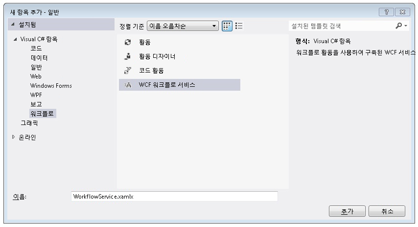  
  
2.  기본 `ReceiveRequest` 및 `SendResponse` 활동을 삭제합니다.  
  
3.  <xref:System.Activities.Statements.WriteLine> 활동을 `Sequential Service` 활동으로 끌어 놓습니다. 다음 예제와 같이 텍스트 속성을 `"Workflow Service starting ..."`으로 설정합니다.  
  
       
  
4.  <xref:System.ServiceModel.Activities.TransactedReceiveScope>을 <xref:System.Activities.Statements.WriteLine> 활동 뒤로 끌어 놓습니다. <xref:System.ServiceModel.Activities.TransactedReceiveScope> 에서 활동을 확인할 수 있습니다는 **메시징** 의 섹션은 **도구 상자**합니다. <xref:System.ServiceModel.Activities.TransactedReceiveScope> 두 섹션으로 구성 된 활동 **요청** 및 **본문**합니다. **요청** 섹션에 포함 되어는 <xref:System.ServiceModel.Activities.Receive> 활동입니다. **본문** 섹션에는 메시지가 수신 된 후 트랜잭션 내에서 실행할 활동이 포함 되어 있습니다.  
  
     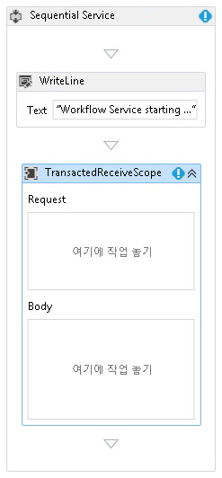  
  
5.  선택 된 <xref:System.ServiceModel.Activities.TransactedReceiveScope> 활동과 클릭은 **변수** 단추입니다. 다음 변수를 추가합니다.  
  
     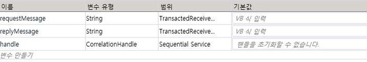  
  
    > [!NOTE]
    >  기본적으로 여기에 포함된 데이터 변수를 삭제할 수 있습니다. 기존 핸들 변수를 사용할 수도 있습니다.  
  
6.  끌어서 놓기는 <xref:System.ServiceModel.Activities.Receive> 내의 활동에서 **요청** 의 섹션은 <xref:System.ServiceModel.Activities.TransactedReceiveScope> 활동입니다. 다음 속성을 설정합니다.  
  
    |속성|값|  
    |--------------|-----------|  
    |CanCreateInstance|True(확인란 선택)|  
    |OperationName|StartSample|  
    |ServiceContractName|ITransactionSample|  
  
     워크플로가 다음과 같이 나타납니다.  
  
     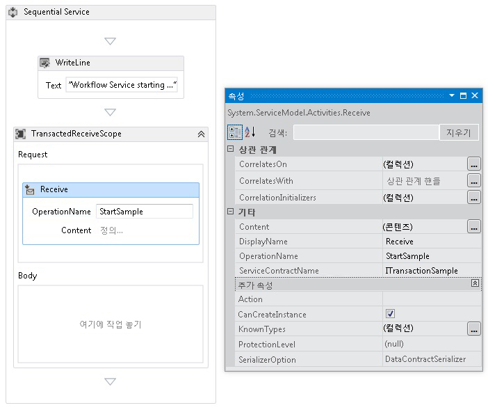  
  
7.  클릭는 **정의...**  연결에 <xref:System.ServiceModel.Activities.Receive> 활동 다음과 같이 설정 합니다.  
  
     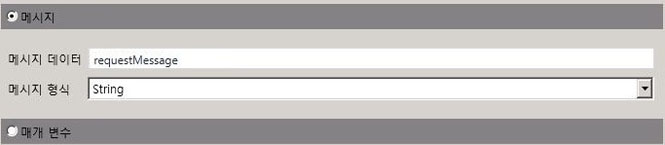  
  
8.  <xref:System.Activities.Statements.Sequence> 활동을 <xref:System.ServiceModel.Activities.TransactedReceiveScope>의 본문 섹션으로 끌어 놓습니다. <xref:System.Activities.Statements.Sequence> 활동 내에 두 개의 <xref:System.Activities.Statements.WriteLine> 활동을 끌어 놓고 <xref:System.Activities.Statements.WriteLine.Text%2A> 속성을 다음 표와 같이 설정합니다.  
  
    |동작|값|  
    |--------------|-----------|  
    |1st WriteLine|"Service: 완료 된 수신"|  
    |2nd WriteLine|"Service: Received = " + requestMessage|  
  
     이제 워크플로가 다음과 같이 나타납니다.  
  
     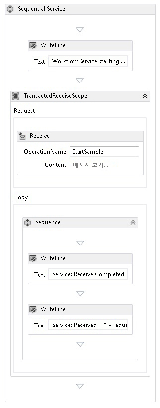  
  
9. 끌어서 놓기는 `PrintTransactionInfo` 두 번째 뒤로 <xref:System.Activities.Statements.WriteLine> 활동에는 **본문** 에 <xref:System.ServiceModel.Activities.TransactedReceiveScope> 활동입니다.  
  
     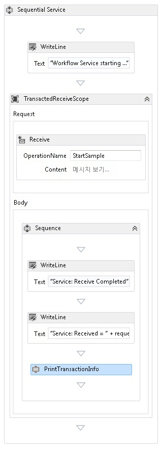  
  
10. <xref:System.Activities.Statements.Assign> 활동을 `PrintTransactionInfo` 활동 뒤로 끌어 놓고 해당 속성을 다음 표와 같이 설정합니다.  
  
    |속성|값|  
    |--------------|-----------|  
    |후|replyMessage|  
    |값|"Service: Sending reply"|  
  
11. <xref:System.Activities.Statements.WriteLine> 활동을 <xref:System.Activities.Statements.Assign> 활동 뒤로 끌어 놓고 해당 <xref:System.Activities.Statements.WriteLine.Text%2A> 속성을 "Service: Begin reply"로 설정합니다.  
  
     이제 워크플로가 다음과 같이 나타납니다.  
  
     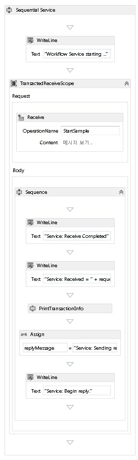  
  
12. 마우스 오른쪽 단추로 클릭는 <xref:System.ServiceModel.Activities.Receive> 활동과 선택 **SendReply 만들기** 지난 후 붙여 <xref:System.Activities.Statements.WriteLine> 활동입니다. 클릭는 **정의...**  연결에 `SendReplyToReceive` 활동 다음과 같이 설정 합니다.  
  
     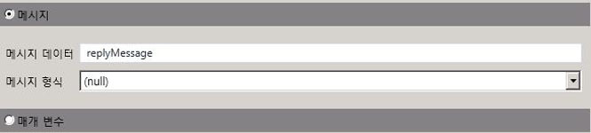  
  
13. 끌어서 놓기는 <xref:System.Activities.Statements.WriteLine> 뒤로 `SendReplyToReceive` 활동 집합과 있기 <xref:System.Activities.Statements.WriteLine.Text%2A> 속성을 "Service: 보낸 회신 합니다."  
  
14. <xref:System.Activities.Statements.WriteLine> 활동을 워크플로의 맨 아래로 끌어 놓고 해당 <xref:System.Activities.Statements.WriteLine.Text%2A> 속성을 "Service: Workflow ends, press ENTER to exit"로 설정합니다.  
  
     완료된 서비스 워크플로는 다음과 같습니다.  
  
     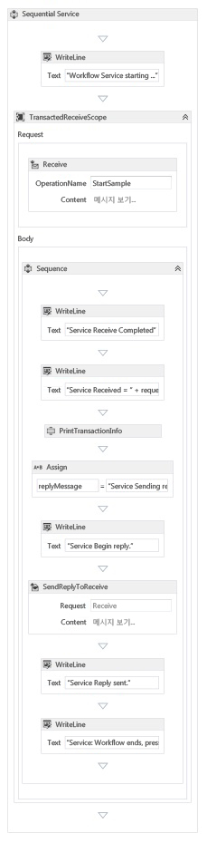  
  
### <a name="implement-the-workflow-client"></a>워크플로 클라이언트 구현  
  
1.  `WorkflowClient` 프로젝트에 `Common`라는 새 WCF 워크플로 응용 프로그램을 추가합니다. 마우스 오른쪽 단추로 클릭이 작업을 수행 하는 `Common` 프로젝트를 **추가**, **새 항목...** 선택, **워크플로** 아래 **설치 된 템플릿** 선택 **활동**합니다.  
  
     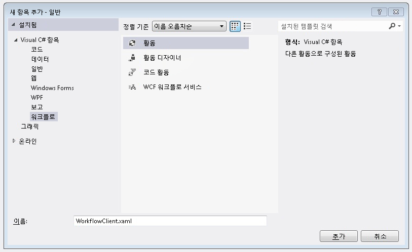  
  
2.  디자인 화면으로 <xref:System.Activities.Statements.Sequence> 활동을 끌어 놓습니다.  
  
3.  <xref:System.Activities.Statements.Sequence> 활동 내에 <xref:System.Activities.Statements.WriteLine> 활동을 끌어 놓고 해당 <xref:System.Activities.Statements.WriteLine.Text%2A> 속성을 `"Client: Workflow starting"`으로 설정합니다. 이제 워크플로가 다음과 같이 나타납니다.  
  
       
  
4.  <xref:System.Activities.Statements.TransactionScope> 활동을 <xref:System.Activities.Statements.WriteLine> 활동 뒤로 끌어 놓습니다.  <xref:System.Activities.Statements.TransactionScope> 활동을 선택하고 변수 단추를 클릭한 후 다음 변수를 추가합니다.  
  
     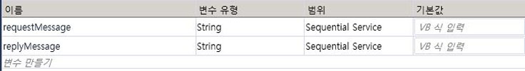  
  
5.  <xref:System.Activities.Statements.Sequence> 활동을 <xref:System.Activities.Statements.TransactionScope> 활동의 본문으로 끌어 놓습니다.  
  
6.  `PrintTransactionInfo` 활동을 <xref:System.Activities.Statements.Sequence> 안으로 끌어 놓습니다.  
  
7.  끌어서 놓기는 <xref:System.Activities.Statements.WriteLine> 뒤로 `PrintTransactionInfo` 활동 집합과 해당 <xref:System.Activities.Statements.WriteLine.Text%2A> 속성을 "Client: Beginning Send"입니다. 이제 워크플로가 다음과 같이 나타납니다.  
  
       
  
8.  <xref:System.ServiceModel.Activities.Send> 활동을 <xref:System.Activities.Statements.Assign> 활동 뒤로 끌어 놓고 다음 속성을 설정합니다.  
  
    |속성|값|  
    |--------------|-----------|  
    |EndpointConfigurationName|workflowServiceEndpoint|  
    |OperationName|StartSample|  
    |ServiceContractName|ITransactionSample|  
  
     이제 워크플로가 다음과 같이 나타납니다.  
  
     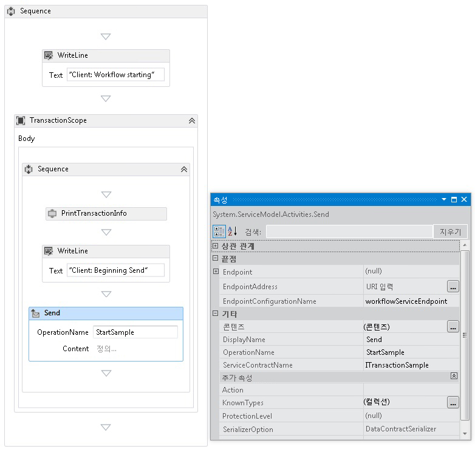  
  
9. 클릭는 **정의...**  에 연결 하 고 다음과 같이 설정 합니다.  
  
     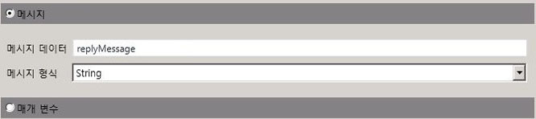  
  
10. 마우스 오른쪽 단추로 클릭는 <xref:System.ServiceModel.Activities.Send> 활동과 선택 **ReceiveReply 만들기**합니다. <xref:System.ServiceModel.Activities.ReceiveReply> 활동이 자동으로 <xref:System.ServiceModel.Activities.Send> 활동 뒤에 배치됩니다.  
  
11. ReceiveReplyForSend 활동의 정의... 링크를 클릭하고 다음과 같이 설정합니다.  
  
     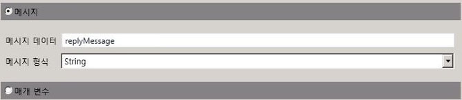  
  
12. <xref:System.Activities.Statements.WriteLine> 활동을 <xref:System.ServiceModel.Activities.Send> 활동과 <xref:System.ServiceModel.Activities.ReceiveReply> 활동 사이로 끌어 놓고 해당 <xref:System.Activities.Statements.WriteLine.Text%2A> 속성을 "Client: Send complete"로 설정합니다.  
  
13. <xref:System.Activities.Statements.WriteLine> 활동을 <xref:System.ServiceModel.Activities.ReceiveReply> 활동 뒤로 끌어 놓고 해당 <xref:System.Activities.Statements.WriteLine.Text%2A> 속성을 "Client side: Reply received = " + replyMessage로 설정합니다.  
  
14. `PrintTransactionInfo` 활동을 <xref:System.Activities.Statements.WriteLine> 활동 뒤로 끌어 놓습니다.  
  
15. <xref:System.Activities.Statements.WriteLine> 활동을 워크플로 끝으로 끌어 놓고 해당 <xref:System.Activities.Statements.WriteLine.Text%2A> 속성을 "Client workflow ends"로 설정합니다. 완료된 클라이언트 워크플로는 다음 다이어그램과 같습니다.  
  
     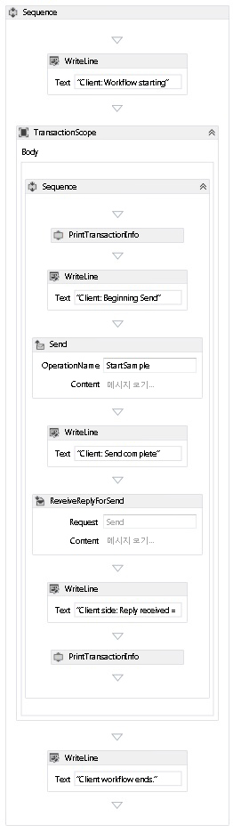  
  
16. 솔루션을 빌드합니다.  
  
### <a name="create-the-service-application"></a>서비스 응용 프로그램 만들기  
  
1.  솔루션에 `Service`라는 새 콘솔 응용 프로그램 프로젝트를 추가하고, 다음 어셈블리에 대한 참조를 추가합니다.  
  
    1.  System.Activities.dll  
  
    2.  System.ServiceModel.dll  
  
    3.  System.ServiceModel.Activities.dll  
  
2.  생성된 Program.cs 파일을 열고 다음 코드를 추가합니다.  
  
    ```  
    static void Main()  
          {  
              Console.WriteLine("Building the server.");  
              using (WorkflowServiceHost host = new WorkflowServiceHost(new DeclarativeServiceWorkflow(), new Uri("net.tcp://localhost:8000/TransactedReceiveService/Declarative")))  
              {                
                  //Start the server  
                  host.Open();  
                  Console.WriteLine("Service started.");  
  
                  Console.WriteLine();  
                  Console.ReadLine();  
                  //Shutdown  
                  host.Close();  
              };         
          }  
    ```  
  
3.  프로젝트에 다음 app.config 파일을 추가합니다.  
  
    ```xml  
    <?xml version="1.0" encoding="utf-8" ?>  
    <!-- Copyright © Microsoft Corporation.  All rights reserved. -->  
    <configuration>  
        <system.serviceModel>  
            <bindings>  
                <netTcpBinding>  
                    <binding transactionFlow="true" />  
                </netTcpBinding>  
            </bindings>  
        </system.serviceModel>  
    </configuration>  
    ```  
  
### <a name="create-the-client-application"></a>클라이언트 응용 프로그램 만들기  
  
1.  솔루션에 `Client`라는 새 콘솔 응용 프로그램 프로젝트를 추가하고, System.Activities.dll에 대한 참조를 추가합니다.  
  
2.  program.cs 파일을 열고 다음 코드를 추가합니다.  
  
    ```  
    class Program  
        {  
  
            private static AutoResetEvent syncEvent = new AutoResetEvent(false);  
  
            static void Main(string[] args)  
            {  
                //Build client  
                Console.WriteLine("Building the client.");  
                WorkflowApplication client = new WorkflowApplication(new DeclarativeClientWorkflow());  
                client.Completed = Program.Completed;  
                client.Aborted = Program.Aborted;  
                client.OnUnhandledException = Program.OnUnhandledException;  
  
                //Wait for service to start  
                Console.WriteLine("Press ENTER once service is started.");  
                Console.ReadLine();  
  
                //Start the client              
                Console.WriteLine("Starting the client.");  
                client.Run();  
                syncEvent.WaitOne();  
  
                //Sample complete  
                Console.WriteLine();  
                Console.WriteLine("Client complete. Press ENTER to exit.");  
                Console.ReadLine();  
            }  
  
            private static void Completed(WorkflowApplicationCompletedEventArgs e)  
            {  
                Program.syncEvent.Set();  
            }  
  
            private static void Aborted(WorkflowApplicationAbortedEventArgs e)  
            {  
                Console.WriteLine("Client Aborted: {0}", e.Reason);  
                Program.syncEvent.Set();  
            }  
  
            private static UnhandledExceptionAction OnUnhandledException(WorkflowApplicationUnhandledExceptionEventArgs e)  
            {  
                Console.WriteLine("Client had an unhandled exception: {0}", e.UnhandledException);  
                return UnhandledExceptionAction.Cancel;  
            }  
        }  
    ```  
  
## <a name="see-also"></a>참고 항목  
 [워크플로 서비스](../../../../docs/framework/wcf/feature-details/workflow-services.md)  
 [Windows Communication Foundation 트랜잭션 개요](../../../../docs/framework/wcf/feature-details/transactions-overview.md)  
 [TransactedReceiveScope 사용](../../../../docs/framework/windows-workflow-foundation/samples/use-of-transactedreceivescope.md)
