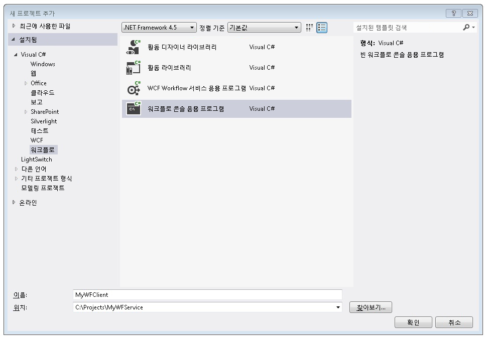
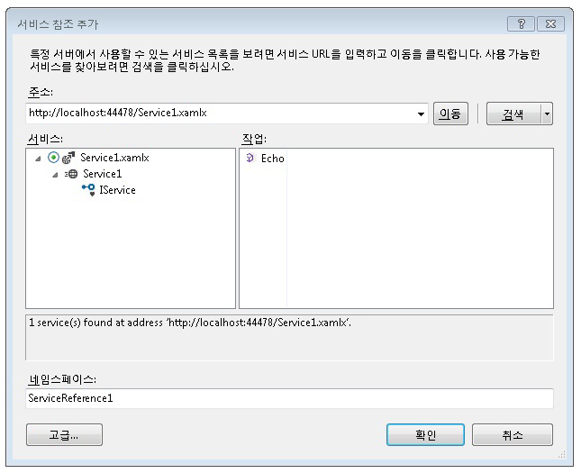
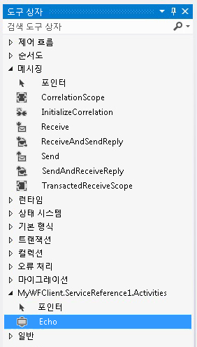
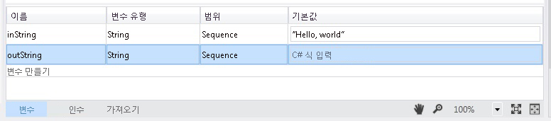
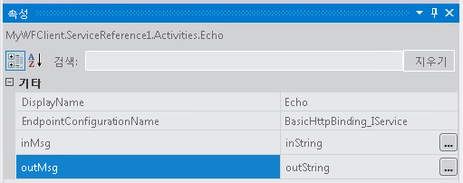
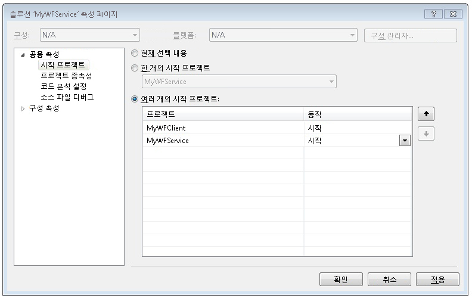

# 방법: 워크플로 응용 프로그램에서 서비스 액세스
이 항목에서는 워크플로 콘솔 응용 프로그램에서 워크플로 서비스를 호출하는 방법에 대해 설명합니다. 완료에 종속 된 [하는 방법: 메시징 작업으로는 워크플로 서비스 만들기](../../../../docs/framework/wcf/feature-details/how-to-create-a-workflow-service-with-messaging-activities.md) 항목. 이 항목에서는 워크플로 응용 프로그램에서 워크플로 서비스를 호출하는 방법에 대해 설명하지만 동일한 방법을 사용하여 워크플로 응용 프로그램에서 [!INCLUDE[indigo1](../../../../includes/indigo1-md.md)] 서비스를 호출할 수도 있습니다.  
  
### 워크플로 콘솔 응용 프로그램 프로젝트 만들기  
  
1.  [!INCLUDE[vs_current_long](../../../../includes/vs-current-long-md.md)]를 시작합니다.  
  
2.  만든 MyWFService 프로젝트 로드는 [하는 방법: 메시징 작업으로는 워크플로 서비스 만들기](../../../../docs/framework/wcf/feature-details/how-to-create-a-workflow-service-with-messaging-activities.md) 항목입니다.  
  
3.  마우스 오른쪽 단추로 클릭는 **MyWFService** 에서 솔루션의 **솔루션 탐색기** 선택 **추가**, **새 프로젝트**합니다. 선택 **워크플로** 에 **설치 된 템플릿** 및 **워크플로 콘솔 응용 프로그램** 프로젝트 형식 목록에서 합니다. 다음 그림과 같이 프로젝트 이름을 MyWFClient로 지정하고 기본 위치를 사용합니다.  
  
       
  
     클릭는 **확인** 해제 단추는 **새 프로젝트 대화 상자 추가**합니다.  
  
4.  프로젝트가 만들어진 후 디자이너에서 Workflow1.xaml 파일이 열립니다. 클릭는 **도구 상자** 없는 경우 이미 열고 압정을 도구 상자 창을 계속 열어 도구 상자를 탭 합니다.  
  
5.  Ctrl+F5를 눌러 서비스를 빌드하고 시작합니다. 이전과 마찬가지로 ASP.NET Development Server가 시작되고 Internet Explorer에 WCF 도움말 페이지가 표시됩니다. 이 페이지의 URI는 다음 단계에서도 사용됩니다.  
  
       
  
6.  마우스 오른쪽 단추로 클릭는 **MyWFClient** 프로젝트에 **솔루션 탐색기** 선택 **서비스 참조 추가**합니다. 클릭는 **Discover** 모든 서비스에 대 한 현재 솔루션을 검색 하려면 단추입니다. 서비스 목록에서 Service1.xamlx 옆에 있는 삼각형을 클릭합니다. Service1 옆에 있는 삼각형을 클릭하여 Service1 서비스에 의해 구현되는 계약을 나열합니다. 확장 된 **Service1** 에서 노드는 **서비스** 목록입니다. 에 Echo 작업이 표시 됩니다는 **작업** 다음 그림에 나와 있는 것 처럼를 나열 합니다.  
  
       
  
     기본 네임 스페이스를 유지 하 고 클릭 **확인** 를 닫습니다는 **서비스 참조 추가** 대화 상자. 다음 대화 상자가 표시됩니다.  
  
       
  
     클릭 **확인** 를 대화 상자를 닫습니다. 그런 다음 Ctrl+Shift+B를 눌러 솔루션을 빌드합니다. 라는 새 섹션이 추가 된 도구 상자에 공지 **MyWFClient.ServiceReference1.Activities**합니다. 다음 그림과 같이 이 섹션을 확장하고 추가된 Echo 작업을 확인합니다.  
  
       
  
7.  끌어서 놓기는 <!--zz <xref:System.ServiceModel.Activities.Sequence>--> `System.ServiceModel.Activities.Sequence` 활동 디자이너 화면으로 합니다. 아래에 **제어 흐름** 도구 상자의 섹션.  
  
8.  와 <!--zz <xref:System.ServiceModel.Activities.Sequence>--> `System.ServiceModel.Activities.Sequence` 에 포커스를 활동 클릭는 **변수** 이라는 문자열 변수를 추가 및 연결 `inString`합니다. 기본값을 변수에 지정 `"Hello, world"` 이라는 문자열 변수 뿐만 아니라 `outString` 다음 다이어그램에 나와 있는 것 처럼 합니다.  
  
       
  
9. 끌어서 놓기는 **에코** 활동에는 <!--zz <xref:System.ServiceModel.Activities.Sequence>--> `System.ServiceModel.Activities.Sequence`합니다. 속성 창에서 바인딩할는 `inMsg` 인수를는 `inString` 변수 및 `outMsg` 인수에는 `outString` 다음 그림에 나와 있는 것 처럼 변수입니다. 그러면 `inString` 변수의 값이 작업에 전달되고 반환 값이 `outString` 변수에 추가됩니다.  
  
       
  
10. 끌어서 놓기는 **WriteLine** 아래에 활동의 **에코** 서비스 호출에 의해 반환 된 문자열을 표시 하는 활동입니다. **WriteLine** 활동에는 **기본 형식** 도구 상자에서 노드. 바인딩하는 **텍스트** 의 인수는 **WriteLine** 활동을는 `outString` 입력 하 여 변수 `outString` 에 텍스트 상자에는 **WriteLine** 활동입니다. 그러면 워크플로가 다음 그림과 같이 표시됩니다.  
  
       
  
11. MyWFService 솔루션을 마우스 오른쪽 단추로 클릭 하 고 선택 **시작 프로젝트 설정 중...** . 선택 된 **여러 개의 시작 프로젝트** 라디오 단추를 선택 **시작** 의 각 프로젝트에 대 한는 **작업** 다음 그림에 나와 있는 것 처럼 열입니다.  
  
       
  
12. Ctrl+F5를 눌러 서비스와 클라이언트를 둘 다 시작합니다. ASP.NET 개발 서버는 서비스를 호스트, Internet Explorer에 WCF 도움말 페이지 표시 및 클라이언트 워크플로 응용 프로그램이 콘솔 창에서 시작 하 고 ("Hello, world") 서비스에서 반환 된 문자열을 표시 합니다.  
  
## 참고 항목  
 [워크플로 서비스](../../../../docs/framework/wcf/feature-details/workflow-services.md)  
 [방법: 메시징 작업을 사용하여 워크플로 서비스 만들기](../../../../docs/framework/wcf/feature-details/how-to-create-a-workflow-service-with-messaging-activities.md)  
 [웹 프로젝트의 워크플로에서 WCF 서비스 사용](http://go.microsoft.com/fwlink/?LinkId=207725)
