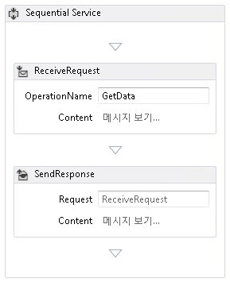
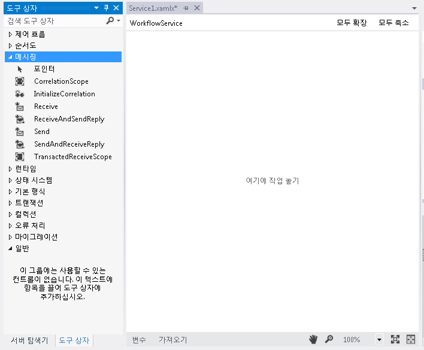
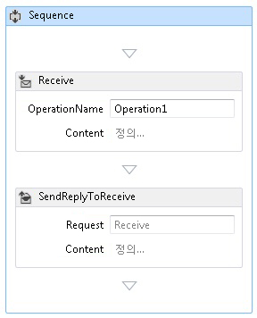
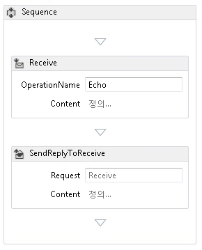
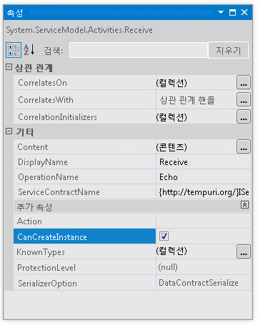
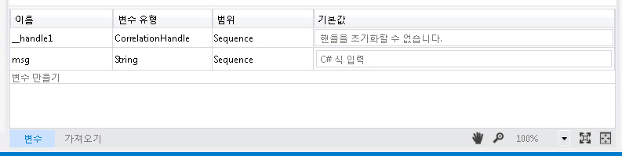
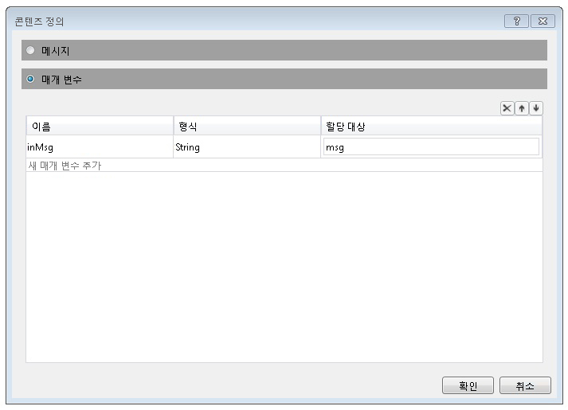
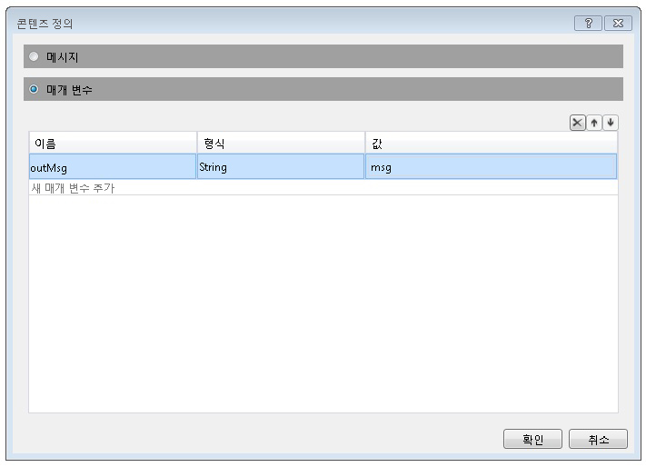
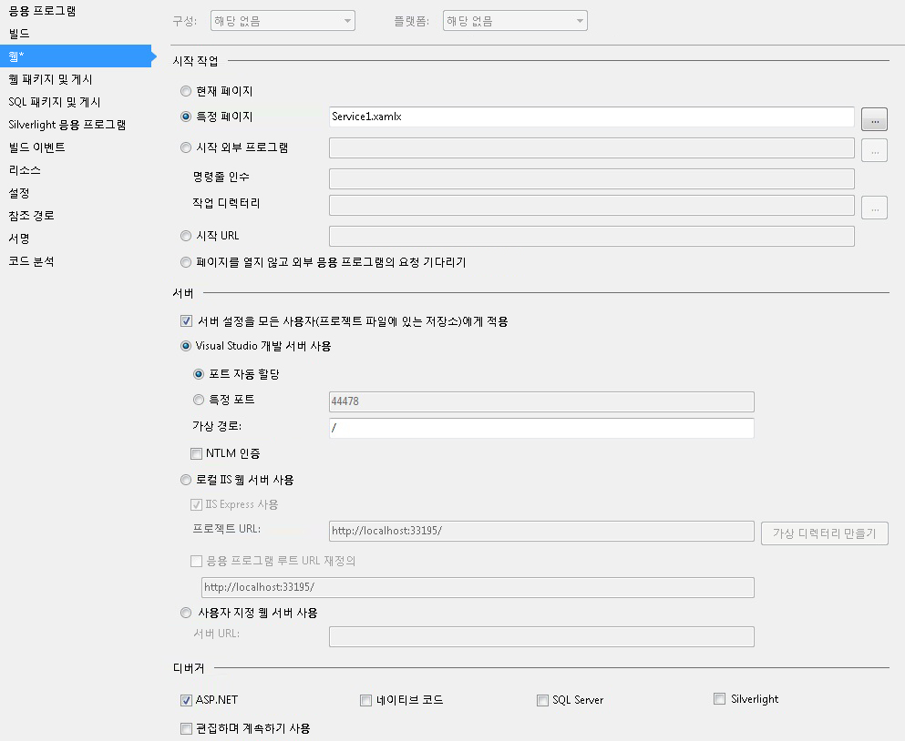

# 방법: 메시징 작업을 사용하여 워크플로 서비스 만들기How to: Create a Workflow Service with Messaging Activities
이 항목에서는 메시징 작업을 사용하여 간단한 워크플로 서비스를 만드는 방법을 보여 줍니다.This topic describes how to create a simple workflow service using messaging activities. 이 항목에서는 서비스가 메시징 작업만으로 구성된 워크플로 서비스를 만드는 방법에 중점을 둡니다.This topic focuses on the mechanics of creating a workflow service where the service consists solely of messaging activities. 실제 서비스의 워크플로에는 다른 많은 작업이 포함되어 있습니다.In a real-world service, the workflow contains many other activities. 이 항목의 서비스에서는 문자열을 받아서 호출자에게 반환하는 Echo라는 하나의 작업을 구현합니다.The service implements one operation called Echo, which takes a string and returns the string to the caller. 이 항목은 시리즈로 된 두 항목 중 첫 번째 항목입니다.This topic is the first in a series of two topics. 다음 항목에서는 [How To:는 서비스는 워크플로 응용 프로그램에서 액세스](../../../../docs/framework/wcf/feature-details/how-to-access-a-service-from-a-workflow-application.md) 이 항목에서 만든 서비스를 호출할 수 있는 워크플로 응용 프로그램을 만드는 방법에 설명 합니다.The next topic [How To: Access a Service From a Workflow Application](../../../../docs/framework/wcf/feature-details/how-to-access-a-service-from-a-workflow-application.md) discusses how to create a workflow application that can call the service created in this topic.  
  
### 워크플로 서비스 프로젝트를 만들려면To create a workflow service project  
  
1.  [!INCLUDE[vs_current_long](../../../../includes/vs-current-long-md.md)]를 시작합니다.Start [!INCLUDE[vs_current_long](../../../../includes/vs-current-long-md.md)].  
  
2.  클릭는 **파일** 메뉴 선택 **새로**, 차례로 **프로젝트** 표시 하는 **새 프로젝트 대화 상자**합니다.Click the **File** menu, select **New**, and then **Project** to display the **New Project Dialog**. 선택 **워크플로** 설치 된 템플릿 목록에서 및 **WCF 워크플로 서비스 응용 프로그램** 프로젝트 형식 목록에서 합니다.Select **Workflow** from the list of installed templates and **WCF Workflow Service Application** from the list of project types. 프로젝트 이름을 `MyWFService` 다음 그림에 나와 있는 것 처럼 기본 위치를 사용 합니다.Name the project `MyWFService` and use the default location as shown in the following illustration.  
  
     클릭는 **확인** 해제 단추는 **새 프로젝트 대화 상자**합니다.Click the **OK** button to dismiss the **New Project Dialog**.  
  
3.  프로젝트가 생성되면 다음 그림과 같이 Service1.xamlx 파일이 디자이너에서 열립니다.When the project is created, the Service1.xamlx file is opened in the designer as shown in the following illustration.  
  
       
  
     레이블이 지정 된 활동을 마우스 오른쪽 단추로 클릭 **순차 서비스** 선택 **삭제**합니다.Right-click the activity labeled **Sequential Service** and select **Delete**.  
  
### 워크플로 서비스를 구현하려면To implement the workflow service  
  
1.  선택 된 **도구 상자** 탭 창을 계속 열어에 압정을 클릭 하 고 도구 상자를 표시 하려면 화면 왼쪽에 있습니다.Select the **Toolbox** tab on the left side of the screen to display the toolbox and click the pushpin to keep the window open. 확장 된 **메시징** 다음 그림에 나와 있는 것 처럼 여 메시징 작업과 메시징 작업 템플릿을 표시 하려면 도구 상자의 섹션.Expand the **Messaging** section of the toolbox to display the messaging activities and the messaging activity templates as shown in the following illustration.  
  
       
  
2.  끌어서 놓기는 **ReceiveAndSendReply** 템플릿을 워크플로 디자이너로 합니다.Drag and drop a **ReceiveAndSendReply** template to the workflow designer. 그렇기 때문에 <!--zz <xref:System.ServiceModel.Activities.Sequence>--> `System.ServiceModel.Activities.Sequence` 활동과 **수신** 작업과 그 뒤는 <xref:System.ServiceModel.Activities.SendReply> 다음 그림과 같이 작업 합니다.This creates a <!--zz <xref:System.ServiceModel.Activities.Sequence>--> `System.ServiceModel.Activities.Sequence` activity with a **Receive** activity followed by a <xref:System.ServiceModel.Activities.SendReply> activity as shown in the following illustration.  
  
       
  
     <xref:System.ServiceModel.Activities.SendReply> 작업의 <xref:System.ServiceModel.Activities.SendReply.Request%2A> 속성이 `Receive` 작업이 회신하는 <xref:System.ServiceModel.Activities.Receive> 작업의 이름인 <xref:System.ServiceModel.Activities.SendReply>로 설정됩니다.Notice that the <xref:System.ServiceModel.Activities.SendReply> activity’s <xref:System.ServiceModel.Activities.SendReply.Request%2A> property is set to `Receive`, the name of the <xref:System.ServiceModel.Activities.Receive> activity to which the <xref:System.ServiceModel.Activities.SendReply> activity is replying.  
  
3.  에 <xref:System.ServiceModel.Activities.Receive> 활동 유형 `Echo` 이라는 입력란에 **OperationName**합니다.In the <xref:System.ServiceModel.Activities.Receive> activity type `Echo` into the textbox labeled **OperationName**. 그러면 서비스가 구현하는 작업의 이름이 정의됩니다.This defines the name of the operation the service implements.  
  
       
  
4.  와 <xref:System.ServiceModel.Activities.Receive> 활동을 선택한 경우 속성 창을 열고 클릭 하 여 열려 있지 않으면는 **보기** 메뉴에서 **속성 창**합니다.With the <xref:System.ServiceModel.Activities.Receive> activity selected, open the properties window if not already open by clicking the **View** menu and selecting **Properties Window**. 에 **속성 창** 나타날 때까지 아래로 스크롤하여 **CanCreateInstance** 다음 그림에 나와 있는 것 처럼이 확인란을 클릭 합니다.In the **Properties Window** scroll down until you see **CanCreateInstance** and click the checkbox as shown in the following illustration. 이렇게 설정하면 메시지를 받을 때 필요한 경우 워크플로 서비스 호스트가 서비스의 새 인스턴스를 만들 수 있습니다.This setting enables the workflow service host to create a new instance of the service (if needed) when a message is received.  
  
       
  
5.  선택은 <!--zz <xref:System.ServiceModel.Activities.Sequence>--> `System.ServiceModel.Activities.Sequence` 활동과 클릭은 **변수** 디자이너의 왼쪽된 아래 모서리에서 단추입니다.Select the <!--zz <xref:System.ServiceModel.Activities.Sequence>--> `System.ServiceModel.Activities.Sequence` activity and click the **Variables** button in the lower left corner of the designer. 그러면 변수 편집기가 표시됩니다.This displays the variables editor. 클릭는 **변수 만들기** 링크 작업에 전송 하 여 문자열을 저장할 변수를 추가 합니다.Click the **Create Variable** link to add a variable to store the string sent to the operation. 변수 이름을 `msg` 설정 하 고 해당 **변수** 다음 그림에 나와 있는 것 처럼 문자열을 입력 합니다.Name the variable `msg` and set its **Variable** type to String as shown in the following illustration.  
  
       
  
     클릭는 **변수** 변수 편집기를 다시 단추입니다.Click the **Variables** button again to close the variables editor.  
  
6.  클릭는 **정의...**Click the **Define..** 연결에 **콘텐츠** 텍스트 상자에 <xref:System.ServiceModel.Activities.Receive> 표시 하는 활동의 **콘텐츠 정의** 대화입니다.link in the **Content** text box in the <xref:System.ServiceModel.Activities.Receive> activity to display the **Content Definition** dialog. 선택 된 **매개 변수** 라디오 단추를 클릭는 **새 매개 변수를 추가** 링크를 입력 `inMsg` 에 **이름** 텍스트 상자 **문자열**에 **형식** 드롭 다운 목록 상자 및 형식 `msg` 에 **에 할당할** 다음 그림에 나와 있는 것 처럼 텍스트 상자입니다.Select the **Parameters** radio button, click the **Add new Parameter** link, type `inMsg` in the **name** text box, select **String** in the **Type** drop down list box, and type `msg` in the **Assign To** text box as shown in the following illustration.  
  
       
  
     그러면 받기 작업이 문자열 매개 변수를 받고 데이터가 `msg` 변수에 바인딩되도록 지정됩니다.This specifies that the Receive activity receives string parameter and that data is bound to the `msg` variable. 클릭 **확인** 를 닫으려면는 **콘텐츠 정의** 대화 상자.Click **OK** to close the **Content Definition** dialog.  
  
7.  클릭는 **정의...**  연결에 **콘텐츠** 상자에 <xref:System.ServiceModel.Activities.SendReply> 표시 하는 활동의 **콘텐츠 정의** 대화입니다.Click the **Define...** link in the **Content** box in the <xref:System.ServiceModel.Activities.SendReply> activity to display the **Content Definition** dialog. 선택은 **매개 변수** 라디오 단추를 클릭는 **새 매개 변수를 추가** 링크를 입력 `outMsg` 에 **이름** textbox, **문자열**에 **형식** 드롭다운 목록 상자 및 `msg` 에 **값** 다음 그림에 나와 있는 것 처럼 텍스트 상자입니다.Select the **Parameters** radio button, click the **Add new Parameter** link, type `outMsg` in the **name** textbox, select **String** in the **Type** dropdown list box, and `msg` in the **Value** text box as shown in the following illustration.  
  
       
  
     그러면 <xref:System.ServiceModel.Activities.SendReply> 작업이 메시지 또는 메시지 계약 형식을 보내고 데이터가 `msg` 변수에 바인딩되도록 지정됩니다.This specifies that the <xref:System.ServiceModel.Activities.SendReply> activity sends a message or message contract type and that data is bound to the `msg` variable. 이 작업이 <xref:System.ServiceModel.Activities.SendReply> 작업이므로 이는 이 작업이 클라이언트에 다시 보내는 메시지를 채우는 데 `msg`의 데이터가 사용됨을 의미합니다.Because this is a <xref:System.ServiceModel.Activities.SendReply> activity, this means the data in `msg` is used to populate the message the activity sends back to the client. 클릭 **확인** 를 닫으려면는 **콘텐츠 정의** 대화 상자.Click **OK** to close the **Content Definition** dialog.  
  
8.  저장 하 고 클릭 하 여 솔루션을 빌드합니다는 **빌드** 메뉴에서 **솔루션 빌드**합니다.Save and build the solution by clicking the **Build** menu and selecting **Build Solution**.  
  
## 워크플로 서비스 프로젝트 구성Configure the Workflow Service Project  
 워크플로 서비스가 완료되었으므로The workflow service is complete. 이 단원에서는 워크플로 서비스 솔루션을 손쉽게 호스팅하고 실행할 수 있도록 구성하는 방법에 대해 설명합니다.This section explains how to configure the workflow service solution to make it easy to host and run. 이 솔루션은 ASP.NET Development Server를 사용하여 서비스를 호스팅합니다.This solution uses the ASP.NET Development Server to host the service.  
  
#### 프로젝트 시작 옵션을 설정하려면To set project start up options  
  
1.  에 **솔루션 탐색기**를 마우스 오른쪽 단추로 클릭 **MyWFService** 선택 **속성** 표시 하는 **프로젝트 속성** 대화 상자.In the **Solution Explorer**, right-click **MyWFService** and select **Properties** to display the **Project Properties** dialog.  
  
2.  선택 된 **웹** 탭을 선택한 **특정 페이지** 아래 **시작 작업** 유형과 `Service1.xamlx` 다음 그림에 나와 있는 것 처럼 텍스트 상자에 합니다.Select the **Web** tab and select **Specific Page** under **Start Action** and type `Service1.xamlx` in the text box as shown in the following illustration.  
  
       
  
     그러면 ASP.NET Development Server에서 Service1.xamlx에 정의된 서비스가 호스팅됩니다.This hosts the service defined in Service1.xamlx in the ASP.NET Development Server.  
  
3.  Ctrl+F5를 눌러 서비스를 시작합니다.Press Ctrl + F5 to launch the service. 그러면 다음 그림과 같이 바탕 화면의 오른쪽 아래에 ASP.NET Development Server 아이콘이 표시됩니다.The ASP.NET Development Server icon is displayed in the lower right side of the desktop as shown in the following image.  
  
       
  
     또한 Internet Explorer에 서비스에 대한 WCF 서비스 도움말 페이지가 표시됩니다.In addition, Internet Explorer displays the WCF Service Help Page for the service.  
  
       
  
4.  계속 진행 하는 [How To:는 서비스는 워크플로 응용 프로그램에서 액세스](../../../../docs/framework/wcf/feature-details/how-to-access-a-service-from-a-workflow-application.md) 이 서비스를 호출 하는 워크플로 클라이언트를 만드는 항목입니다.Continue on to the [How To: Access a Service From a Workflow Application](../../../../docs/framework/wcf/feature-details/how-to-access-a-service-from-a-workflow-application.md) topic to create a workflow client that calls this service.  
  
## 참고 항목See Also  
 [워크플로 서비스Workflow Services](../../../../docs/framework/wcf/feature-details/workflow-services.md)  
 [워크플로 서비스 호스팅 개요Hosting Workflow Services Overview](../../../../docs/framework/wcf/feature-details/hosting-workflow-services-overview.md)  
 [메시징 활동Messaging Activities](../../../../docs/framework/wcf/feature-details/messaging-activities.md)
