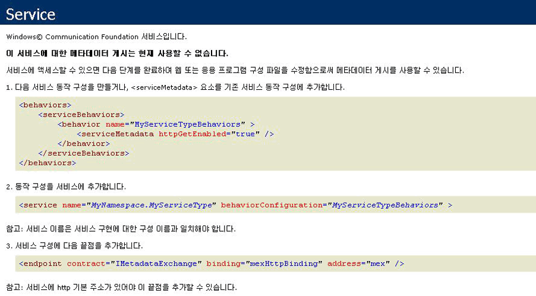

# <a name="how-to-host-a-non-service-workflow-in-iis"></a><span data-ttu-id="534bc-102">방법: IIS에서 서비스가 아닌 워크플로 호스팅</span><span class="sxs-lookup"><span data-stu-id="534bc-102">How to: Host a non-service workflow in IIS</span></span>
<span data-ttu-id="534bc-103">워크플로 서비스가 아닌 워크플로는 IIS/WAS에서 호스트될 수 있습니다.</span><span class="sxs-lookup"><span data-stu-id="534bc-103">Workflows that are not workflow services can be hosted under IIS/WAS.</span></span> <span data-ttu-id="534bc-104">이는 다른 사람이 작성한 워크플로를 호스트해야 하는 경우에 유용합니다.</span><span class="sxs-lookup"><span data-stu-id="534bc-104">This is useful when you need to host a workflow written by somebody else.</span></span> <span data-ttu-id="534bc-105">Workflow Designer를 다시 호스트하고 사용자가 워크플로를 직접 만들 수 있도록 허용하는 경우를 예로 들 수 있습니다.</span><span class="sxs-lookup"><span data-stu-id="534bc-105">For example, if you rehost the workflow designer and allow users to create their own workflows.</span></span>  <span data-ttu-id="534bc-106">IIS에서 서비스가 아닌 워크플로를 호스트하면 프로세스 재활용, 유휴 상태이면 종료, 프로세스 상태 모니터링 및 메시지 기반 활성화와 같은 기능이 지원됩니다.</span><span class="sxs-lookup"><span data-stu-id="534bc-106">Hosting non-service workflows in IIS provides support for features like process recycling, idle shutdown, process health monitoring, and message-based activation.</span></span> <span data-ttu-id="534bc-107">IIS에서 호스트되는 워크플로 서비스에는 <xref:System.ServiceModel.Activities.Receive> 활동이 포함되고 IIS에서 메시지가 수신되면 서비스가 활성화됩니다.</span><span class="sxs-lookup"><span data-stu-id="534bc-107">Workflow services hosted in IIS contain <xref:System.ServiceModel.Activities.Receive> activities and are activated when a message is received by IIS.</span></span> <span data-ttu-id="534bc-108">서비스가 아닌 워크플로에는 메시징 활동이 포함되지 않으며 기본적으로 메시지 전송을 통해 활성화할 수 없습니다.</span><span class="sxs-lookup"><span data-stu-id="534bc-108">Non-service workflows do not contain messaging activities, and by default cannot be activated by sending a message.</span></span>  <span data-ttu-id="534bc-109"><xref:System.ServiceModel.Activities.WorkflowHostingEndpoint>에서 클래스를 파생하고 워크플로 인스턴스를 만드는 작업이 포함된 서비스 계약을 정의해야 합니다.</span><span class="sxs-lookup"><span data-stu-id="534bc-109">You must derive a class from <xref:System.ServiceModel.Activities.WorkflowHostingEndpoint> and define a service contract that contains operations to create an instance of the workflow.</span></span> <span data-ttu-id="534bc-110">이 항목에서는 간단한 워크플로 만드는에서 워크플로 활성화 하기 위해 클라이언트가 사용할 수는 서비스 계약을 정의 및에서 클래스를 파생 하는 과정을 안내 <xref:System.ServiceModel.Activities.WorkflowHostingEndpoint> 워크플로 만들기 요청에 대 한 수신 하도록 서비스 계약을 사용 하 여입니다.</span><span class="sxs-lookup"><span data-stu-id="534bc-110">This topic will walk you through creating a simple workflow, defining a service contract a client can use to activate the workflow, and deriving a class from <xref:System.ServiceModel.Activities.WorkflowHostingEndpoint> which uses the service contract to listen for workflow creating requests.</span></span>  
  
### <a name="create-a-simple-workflow"></a><span data-ttu-id="534bc-111">간단한 워크플로 만들기</span><span class="sxs-lookup"><span data-stu-id="534bc-111">Create a simple workflow</span></span>  
  
1.  <span data-ttu-id="534bc-112">[!INCLUDE[vs_current_long](../../../../includes/vs-current-long-md.md)]라는 비어 있는 새 `CreationEndpointTest` 솔루션을 만듭니다.</span><span class="sxs-lookup"><span data-stu-id="534bc-112">Create a new [!INCLUDE[vs_current_long](../../../../includes/vs-current-long-md.md)] empty solution called `CreationEndpointTest`.</span></span>  
  
2.  <span data-ttu-id="534bc-113">`SimpleWorkflow`라는 새 WCF 워크플로 서비스 응용 프로그램 프로젝트를 솔루션에 추가합니다.</span><span class="sxs-lookup"><span data-stu-id="534bc-113">Add a new WCF Workflow Service Application project called `SimpleWorkflow` to the solution.</span></span> <span data-ttu-id="534bc-114">Workflow Designer가 열립니다.</span><span class="sxs-lookup"><span data-stu-id="534bc-114">The workflow designer will open.</span></span>  
  
3.  <span data-ttu-id="534bc-115">ReceiveRequest 및 SendResponse 활동을 삭제합니다.</span><span class="sxs-lookup"><span data-stu-id="534bc-115">Delete the ReceiveRequest and SendResponse activities.</span></span> <span data-ttu-id="534bc-116">이러한 활동은 워크플로를 워크플로 서비스로 만듭니다.</span><span class="sxs-lookup"><span data-stu-id="534bc-116">These activities are what makes a workflow a workflow service.</span></span> <span data-ttu-id="534bc-117">워크플로 서비스로 작업하는 것이 아니므로 이러한 활동이 더 이상 필요하지 않습니다.</span><span class="sxs-lookup"><span data-stu-id="534bc-117">Since we are not working with a workflow service, we no longer need them.</span></span>  
  
4.  <span data-ttu-id="534bc-118">시퀀스 활동을 "Sequential Workflow" DisplayName을 설정 합니다.</span><span class="sxs-lookup"><span data-stu-id="534bc-118">Set the DisplayName for the sequence activity to "Sequential Workflow".</span></span>  
  
5.  <span data-ttu-id="534bc-119">Service1.xamlx의 이름을 Workflow1.xamlx로 바꿉니다.</span><span class="sxs-lookup"><span data-stu-id="534bc-119">Rename Service1.xamlx to Workflow1.xamlx.</span></span>  
  
6.  <span data-ttu-id="534bc-120">Sequence 활동 외부에서 디자이너를 클릭 하 고 Name 및 ConfigurationName 속성을 "workflow1"로 설정</span><span class="sxs-lookup"><span data-stu-id="534bc-120">Click the designer outside of the sequence activity, and set the Name and ConfigurationName properties to "Workflow1"</span></span>  
  
7.  <span data-ttu-id="534bc-121"><xref:System.Activities.Statements.WriteLine> 활동을 <xref:System.Activities.Statements.Sequence>로 끌어 옵니다.</span><span class="sxs-lookup"><span data-stu-id="534bc-121">Drag a <xref:System.Activities.Statements.WriteLine> activity into the <xref:System.Activities.Statements.Sequence>.</span></span> <span data-ttu-id="534bc-122"><xref:System.Activities.Statements.WriteLine> 에서 활동을 확인할 수 있습니다는 **기본 형식** 도구 상자의 섹션.</span><span class="sxs-lookup"><span data-stu-id="534bc-122">The <xref:System.Activities.Statements.WriteLine> activity can be found in the **Primitives** section of the toolbox.</span></span> <span data-ttu-id="534bc-123">설정의 <xref:System.Activities.Statements.WriteLine.Text%2A> 의 속성은 <xref:System.Activities.Statements.WriteLine> 활동을 "Hello, world"입니다.</span><span class="sxs-lookup"><span data-stu-id="534bc-123">Set the <xref:System.Activities.Statements.WriteLine.Text%2A> property of the <xref:System.Activities.Statements.WriteLine> activity to "Hello, world".</span></span>  
  
     <span data-ttu-id="534bc-124">그러면 워크플로가 다음 다이어그램과 같이 표시됩니다.</span><span class="sxs-lookup"><span data-stu-id="534bc-124">The workflow should now look like the following diagram.</span></span>  
  
     <span data-ttu-id="534bc-125"></span><span class="sxs-lookup"><span data-stu-id="534bc-125"></span></span>  
  
### <a name="create-the-workflow-creation-service-contract"></a><span data-ttu-id="534bc-126">워크플로 생성 서비스 계약 만들기</span><span class="sxs-lookup"><span data-stu-id="534bc-126">Create the workflow creation service contract</span></span>  
  
1.  <span data-ttu-id="534bc-127">`Shared`라는 새 클래스 라이브러리 프로젝트를 `CreationEndpointTest` 솔루션에 추가합니다.</span><span class="sxs-lookup"><span data-stu-id="534bc-127">Add a new class library project called `Shared` to the `CreationEndpointTest` solution.</span></span>  
  
2.  <span data-ttu-id="534bc-128">System.ServiceModel.dll, System.Configuration 및 System.ServiceModel.Activities에 대한 참조를 `Shared` 프로젝트에 추가합니다.</span><span class="sxs-lookup"><span data-stu-id="534bc-128">Add a reference to System.ServiceModel.dll, System.Configuration, and System.ServiceModel.Activities to the `Shared` project.</span></span>  
  
3.  <span data-ttu-id="534bc-129">Class1.cs 파일의 이름을 IWorkflowCreation.cs로 바꾸고 다음 코드를 이 파일에 추가합니다.</span><span class="sxs-lookup"><span data-stu-id="534bc-129">Rename the Class1.cs file to IWorkflowCreation.cs and the following code to the file.</span></span>  
  
    ```  
    using System;  
    using System.Collections.Generic;  
    using System.Linq;  
    using System.Text;  
    using System.ServiceModel;  
  
    namespace Shared  
    {  
        //service contract exposed from the endpoint  
        [ServiceContract(Name = "IWorkflowCreation")]  
        public interface IWorkflowCreation  
        {  
            [OperationContract(Name = "Create")]  
            Guid Create(IDictionary<string, object> inputs);  
  
            [OperationContract(Name = "CreateWithInstanceId", IsOneWay = true)]  
            void CreateWithInstanceId(IDictionary<string, object> inputs, Guid instanceId);  
        }  
    }  
    ```  
  
     <span data-ttu-id="534bc-130">이 계약은 두 작업을 정의합니다. 두 작업 모두 방금 만든 서비스가 아닌 워크플로의 새 인스턴스를 만듭니다.</span><span class="sxs-lookup"><span data-stu-id="534bc-130">This contract defines two operations both create a new instance of the non-service workflow you just created.</span></span> <span data-ttu-id="534bc-131">한 작업은 생성된 인스턴스 ID를 사용하여 새 인스턴스를 만들고 다른 작업은 새 워크플로 인스턴스의 인스턴스 ID를 지정할 수 있도록 합니다.</span><span class="sxs-lookup"><span data-stu-id="534bc-131">One creates a new instance with a generated instance ID and the other allows you to specify the instance ID for the new workflow instance.</span></span>  <span data-ttu-id="534bc-132">두 방법 모두 새 워크플로 인스턴스에 매개 변수를 전달할 수 있습니다.</span><span class="sxs-lookup"><span data-stu-id="534bc-132">Both methods allow you to pass in parameters to the new workflow instance.</span></span> <span data-ttu-id="534bc-133">이 계약에서 노출 될는 <xref:System.ServiceModel.Activities.WorkflowHostingEndpoint> 클라이언트가 서비스가 아닌 워크플로의 새 인스턴스를 만들 수 있도록 합니다.</span><span class="sxs-lookup"><span data-stu-id="534bc-133">This contract will be exposed by the <xref:System.ServiceModel.Activities.WorkflowHostingEndpoint> to allow clients to create new instances of a non-service workflow.</span></span>  
  
### <a name="derive-a-class-from-workflowhostingendpoint"></a><span data-ttu-id="534bc-134">WorkflowHostingEndpoint에서 클래스 파생</span><span class="sxs-lookup"><span data-stu-id="534bc-134">Derive a class from WorkflowHostingEndpoint</span></span>  
  
1.  <span data-ttu-id="534bc-135">라는 새 클래스 추가 `CreationEndpoint` 에서 파생 된 <xref:System.ServiceModel.Activities.WorkflowHostingEndpoint> 에 `Shared` 프로젝트.</span><span class="sxs-lookup"><span data-stu-id="534bc-135">Add a new class called `CreationEndpoint` derived from <xref:System.ServiceModel.Activities.WorkflowHostingEndpoint> to the `Shared` project.</span></span>  
  
    ```  
    using System;  
    using System.Collections.Generic;  
    using System.Diagnostics;  
    using System.Globalization;  
    using System.ServiceModel;  
    using System.ServiceModel.Activities;  
    using System.ServiceModel.Channels;  
  
    namespace Shared  
    {  
        public class CreationEndpoint : WorkflowHostingEndpoint  
        {  
        }  
    }  
    ```  
  
2.  <span data-ttu-id="534bc-136"><xref:System.Uri>라는 로컬 정적 `defaultBaseUri` 변수를 `CreationEndpoint` 클래스에 추가합니다.</span><span class="sxs-lookup"><span data-stu-id="534bc-136">Add a local static <xref:System.Uri> variable called `defaultBaseUri` to the `CreationEndpoint` class.</span></span>  
  
    ```  
    public class CreationEndpoint : WorkflowHostingEndpoint  
    {  
        static Uri defaultBaseUri;  
    }  
    ```  
  
3.  <span data-ttu-id="534bc-137">`CreationEndpoint` 클래스에 다음 생성자를 추가합니다.</span><span class="sxs-lookup"><span data-stu-id="534bc-137">Add the following constructor to the `CreationEndpoint` class.</span></span> <span data-ttu-id="534bc-138">기본 생성자 호출에는 `IWorkflowCreation` 서비스 계약을 지정합니다.</span><span class="sxs-lookup"><span data-stu-id="534bc-138">Notice we specify the `IWorkflowCreation` service contract in the call to the base constructor.</span></span>  
  
    ```  
    public CreationEndpoint(Binding binding, EndpointAddress address)  
       : base(typeof(IWorkflowCreation), binding, address)  
       {  
       }  
    ```  
  
4.  <span data-ttu-id="534bc-139">`CreationEndpoint` 클래스에 다음 기본 생성자를 추가합니다.</span><span class="sxs-lookup"><span data-stu-id="534bc-139">Add the following default constructor to the `CreationEndpoint` class.</span></span>  
  
    ```  
    public CreationEndpoint()  
       : this(GetDefaultBinding(),  
       new EndpointAddress(new Uri(DefaultBaseUri, new Uri(Guid.NewGuid().ToString(), UriKind.Relative))))  
       {  
       }  
    ```  
  
5.  <span data-ttu-id="534bc-140">`DefaultBaseUri` 클래스에 정적 `CreationEndpoint` 속성을 추가합니다.</span><span class="sxs-lookup"><span data-stu-id="534bc-140">Add a static `DefaultBaseUri` property to the `CreationEndpoint` class.</span></span> <span data-ttu-id="534bc-141">이 속성은 기본적인 기본 URI가 제공되지 않은 경우 기본 URI를 저장하는 데 사용됩니다.</span><span class="sxs-lookup"><span data-stu-id="534bc-141">This property will be used to hold a default base URI if one is not provided.</span></span>  
  
    ```  
    static Uri DefaultBaseUri  
    {  
       get  
       {  
          if (defaultBaseUri == null)  
          {  
             defaultBaseUri = new Uri(string.Format(CultureInfo.InvariantCulture, "net.pipe://localhost/workflowCreationEndpoint/{0}/{1}",  
                Process.GetCurrentProcess().Id,  
                AppDomain.CurrentDomain.Id));  
          }  
          return defaultBaseUri;  
       }  
     }  
    ```  
  
6.  <span data-ttu-id="534bc-142">만들기 끝점에 사용할 기본 바인딩을 가져오는 다음 메서드를 만듭니다.</span><span class="sxs-lookup"><span data-stu-id="534bc-142">Create the following method to get the default binding to use for the creation endpoint.</span></span>  
  
    ```  
    //defaults to NetNamedPipeBinding  
    public static Binding GetDefaultBinding()  
    {  
       return new NetNamedPipeBinding(NetNamedPipeSecurityMode.None) { TransactionFlow = true };  
    }  
    ```  
  
7.  <span data-ttu-id="534bc-143">워크플로 인스턴스 ID를 반환하도록 <xref:System.ServiceModel.Activities.WorkflowHostingEndpoint.OnGetInstanceId%2A> 메서드를 재정의합니다.</span><span class="sxs-lookup"><span data-stu-id="534bc-143">Override the <xref:System.ServiceModel.Activities.WorkflowHostingEndpoint.OnGetInstanceId%2A> method to return the workflow instance ID.</span></span> <span data-ttu-id="534bc-144">경우는 `Action` 경우 빈 GUID를 반환 하는 "만들기"로 `Action` 헤더가 "CreateWithInstanceId" 반환 메서드에 전달 된 GUID로 끝납니다.</span><span class="sxs-lookup"><span data-stu-id="534bc-144">If the `Action` header ends with "Create" return an empty GUID, if the `Action` header ends with "CreateWithInstanceId" return the GUID passed into the method.</span></span> <span data-ttu-id="534bc-145">그 외의 경우에는 <xref:System.InvalidOperationException>을 throw합니다.</span><span class="sxs-lookup"><span data-stu-id="534bc-145">Otherwise, throw an <xref:System.InvalidOperationException>.</span></span> <span data-ttu-id="534bc-146">이러한 `Action` 헤더는 `IWorkflowCreation` 서비스 계약에 정의된 두 작업에 해당합니다.</span><span class="sxs-lookup"><span data-stu-id="534bc-146">These `Action` headers correspond to the two operations defined in the `IWorkflowCreation` service contract.</span></span>  
  
    ```  
    protected override Guid OnGetInstanceId(object[] inputs, OperationContext operationContext)  
    {  
       //Create was called by client  
       if (operationContext.IncomingMessageHeaders.Action.EndsWith("Create"))  
       {  
          return Guid.Empty;  
       }  
       //CreateWithInstanceId was called by client  
       else if (operationContext.IncomingMessageHeaders.Action.EndsWith("CreateWithInstanceId"))  
       {  
          return (Guid)inputs[1];  
       }  
       else  
       {  
          throw new InvalidOperationException("Invalid Action: " + operationContext.IncomingMessageHeaders.Action);  
       }  
    }  
    ```  
  
8.  <span data-ttu-id="534bc-147"><xref:System.ServiceModel.Activities.WorkflowHostingEndpoint.OnGetCreationContext%2A>를 만들고 워크플로의 모든 인수를 추가한 다음 클라이언트에 인스턴스 ID를 보내고 <xref:System.ServiceModel.Activities.WorkflowCreationContext>를 반환하도록 <xref:System.ServiceModel.Activities.WorkflowCreationContext> 메서드를 재정의합니다.</span><span class="sxs-lookup"><span data-stu-id="534bc-147">Override the <xref:System.ServiceModel.Activities.WorkflowHostingEndpoint.OnGetCreationContext%2A> method to create a <xref:System.ServiceModel.Activities.WorkflowCreationContext> and add any arguments for the workflow, send the instance ID to the client, and then return the <xref:System.ServiceModel.Activities.WorkflowCreationContext>.</span></span>  
  
    ```  
    protected override WorkflowCreationContext OnGetCreationContext(object[] inputs, OperationContext operationContext, Guid instanceId, WorkflowHostingResponseContext responseContext)  
    {  
       WorkflowCreationContext creationContext = new WorkflowCreationContext();  
       if (operationContext.IncomingMessageHeaders.Action.EndsWith("Create") || (operationContext.IncomingMessageHeaders.Action.EndsWith("CreateWithInstanceId")))  
       {  
          Dictionary<string, object> arguments = (Dictionary<string, object>)inputs[0];  
          if (arguments != null && arguments.Count > 0)  
          {  
             foreach (KeyValuePair<string, object> pair in arguments)  
             {  
                //arguments to pass to the workflow  
                creationContext.WorkflowArguments.Add(pair.Key, pair.Value);  
             }  
          }  
          //reply to client with instanceId  
          responseContext.SendResponse(instanceId, null);  
       }  
       else  
       {  
          throw new InvalidOperationException("Invalid Action: " + operationContext.IncomingMessageHeaders.Action);  
       }  
       return creationContext;  
    }  
    ```  
  
### <a name="create-a-standard-endpoint-element-to-allow-you-to-configure-the-workflowcreationendpoint"></a><span data-ttu-id="534bc-148">WorkflowCreationEndpoint를 구성할 수 있도록 표준 끝점 요소 만들기</span><span class="sxs-lookup"><span data-stu-id="534bc-148">Create a standard endpoint element to allow you to configure the WorkflowCreationEndpoint</span></span>  
  
1.  <span data-ttu-id="534bc-149">`CreationEndpoint` 프로젝트에서 Shared에 대한 참조를 추가합니다.</span><span class="sxs-lookup"><span data-stu-id="534bc-149">Add a reference to Shared in the `CreationEndpoint` project</span></span>  
  
2.  <span data-ttu-id="534bc-150">`CreationEndpointElement`에서 파생된 <xref:System.ServiceModel.Configuration.StandardEndpointElement>라는 새 클래스를 `CreationEndpoint` 프로젝트에 추가합니다.</span><span class="sxs-lookup"><span data-stu-id="534bc-150">Add a new class called `CreationEndpointElement`, derived from <xref:System.ServiceModel.Configuration.StandardEndpointElement> to the `CreationEndpoint` project.</span></span> <span data-ttu-id="534bc-151">이 클래스는 web.config 파일의 `CreationEndpoint`를 나타냅니다.</span><span class="sxs-lookup"><span data-stu-id="534bc-151">This class will represent a `CreationEndpoint` in a web.config file.</span></span>  
  
    ```  
    using System;  
    using System.Configuration;  
    using System.ServiceModel.Activities;  
    using System.ServiceModel.Configuration;  
    using System.ServiceModel.Description;  
    using Shared;  
  
    namespace CreationEndpointTest  
    {  
        //config element for CreationEndpoint  
        public class CreationEndpointElement : StandardEndpointElement  
        {  
       }  
    ```  
  
3.  <span data-ttu-id="534bc-152">끝점의 형식을 반환하기 위해 `EndpointType`이라는 속성을 추가합니다.</span><span class="sxs-lookup"><span data-stu-id="534bc-152">Add a property called `EndpointType` to return the type of the endpoint.</span></span>  
  
    ```  
    protected override Type EndpointType  
    {  
       get { return typeof(CreationEndpoint); }  
    }  
    ```  
  
4.  <span data-ttu-id="534bc-153"><xref:System.ServiceModel.Configuration.StandardEndpointElement.CreateServiceEndpoint%2A> 메서드를 재정의하고 새 `CreationEndpoint`를 반환합니다.</span><span class="sxs-lookup"><span data-stu-id="534bc-153">Override the <xref:System.ServiceModel.Configuration.StandardEndpointElement.CreateServiceEndpoint%2A> method and return a new `CreationEndpoint`.</span></span>  
  
    ```  
    protected override ServiceEndpoint CreateServiceEndpoint(ContractDescription contractDescription)  
    {  
       return new CreationEndpoint();  
    }  
    ```  
  
5.  <span data-ttu-id="534bc-154"><xref:System.ServiceModel.Configuration.StandardEndpointElement.OnApplyConfiguration%2A>, <xref:System.ServiceModel.Configuration.StandardEndpointElement.OnApplyConfiguration%2A>, <xref:System.ServiceModel.Configuration.StandardEndpointElement.OnInitializeAndValidate%2A> 및 <xref:System.ServiceModel.Configuration.StandardEndpointElement.OnInitializeAndValidate%2A> 메서드를 오버로드합니다.</span><span class="sxs-lookup"><span data-stu-id="534bc-154">Overload the <xref:System.ServiceModel.Configuration.StandardEndpointElement.OnApplyConfiguration%2A>, <xref:System.ServiceModel.Configuration.StandardEndpointElement.OnApplyConfiguration%2A>, <xref:System.ServiceModel.Configuration.StandardEndpointElement.OnInitializeAndValidate%2A>, and <xref:System.ServiceModel.Configuration.StandardEndpointElement.OnInitializeAndValidate%2A> methods.</span></span> <span data-ttu-id="534bc-155">이러한 메서드는 정의되어야 하며 이러한 메서드에 코드를 추가할 필요는 없습니다.</span><span class="sxs-lookup"><span data-stu-id="534bc-155">These methods just need to be defined, you do not need to add any code to them.</span></span>  
  
    ```  
    protected override void OnApplyConfiguration(ServiceEndpoint endpoint, ChannelEndpointElement channelEndpointElement)  
    {  
    }  
  
    protected override void OnApplyConfiguration(ServiceEndpoint endpoint, ServiceEndpointElement serviceEndpointElement)  
    {  
    }  
  
    protected override void OnInitializeAndValidate(ChannelEndpointElement channelEndpointElement)  
    {  
    }  
  
    protected override void OnInitializeAndValidate(ServiceEndpointElement serviceEndpointElement)  
    {  
    }  
    ```  
  
6.  <span data-ttu-id="534bc-156">`CreationEndpoint`의 컬렉션 클래스를 `CreationEndpoint` 프로젝트의 CreationEndpointElement.cs 파일에 추가합니다.</span><span class="sxs-lookup"><span data-stu-id="534bc-156">Add the collection class for `CreationEndpoint` to the CreationEndpointElement.cs file in the `CreationEndpoint` project.</span></span> <span data-ttu-id="534bc-157">이 클래스는 web.config 파일에 많은 `CreationEndpoint` 인스턴스를 저장하기 위해 구성에서 사용됩니다.</span><span class="sxs-lookup"><span data-stu-id="534bc-157">This class is used by configuration to hold a number of `CreationEndpoint` instances in a web.config file.</span></span>  
  
    ```  
    public class CreationEndpointCollection : StandardEndpointCollectionElement<CreationEndpoint, CreationEndpointElement>  
    {  
    }  
    ```  
  
7.  <span data-ttu-id="534bc-158">솔루션을 빌드합니다.</span><span class="sxs-lookup"><span data-stu-id="534bc-158">Build the solution.</span></span>  
  
### <a name="host-the-workflow-in-iis"></a><span data-ttu-id="534bc-159">IIS에서 워크플로 호스팅</span><span class="sxs-lookup"><span data-stu-id="534bc-159">Host the workflow in IIS</span></span>  
  
1.  <span data-ttu-id="534bc-160">IIS에서 `MyCreationEndpoint`라는 새 응용 프로그램을 만듭니다.</span><span class="sxs-lookup"><span data-stu-id="534bc-160">Create a new application called `MyCreationEndpoint` in IIS.</span></span>  
  
2.  <span data-ttu-id="534bc-161">Workflow Designer에서 생성된 workflow1.xaml 파일을 응용 프로그램 디렉터리에 복사하고 workflow1.xamlx로 이름을 바꿉니다.</span><span class="sxs-lookup"><span data-stu-id="534bc-161">Copy the workflow1.xaml file generated by the workflow designer to the application directory and rename it to workflow1.xamlx.</span></span>  
  
3.  <span data-ttu-id="534bc-162">shared.dll 및 CreationEndpoint.dll 파일을 응용 프로그램의 bin 디렉터리에 복사합니다(bin 디렉터리가 없는 경우 만들어야 함).</span><span class="sxs-lookup"><span data-stu-id="534bc-162">Copy the shared.dll and CreationEndpoint.dll files to the application’s bin directory (create the bin directory if it is not present).</span></span>  
  
4.  <span data-ttu-id="534bc-163">`CreationEndpoint` 프로젝트에서 Web.config 파일의 내용을 다음 코드로 바꿉니다.</span><span class="sxs-lookup"><span data-stu-id="534bc-163">Replace the contents of the Web.config file in the `CreationEndpoint` project with the following code.</span></span>  
  
    ```xaml  
    <?xml version="1.0" encoding="utf-8" ?>  
    <configuration>  
      <system.web>  
        <compilation debug="true" targetFramework="4.0" />  
      </system.web>   
    </configuration>  
    ```  
  
5.  <span data-ttu-id="534bc-164">`<system.web>` 요소 뒤에 다음 구성 코드를 추가하여 `CreationEndpoint`를 등록합니다.</span><span class="sxs-lookup"><span data-stu-id="534bc-164">After the `<system.web>` element, register `CreationEndpoint` by adding the following configuration code.</span></span>  
  
    ```xml  
    <system.serviceModel>  
        <!--register CreationEndpoint-->  
        <serviceHostingEnvironment multipleSiteBindingsEnabled="true" />  
        <extensions>  
          <endpointExtensions>  
            <add name="creationEndpoint" type="CreationEndpointTest.CreationEndpointCollection, CreationEndpoint, Version=1.0.0.0, Culture=neutral, PublicKeyToken=null" />  
          </endpointExtensions>  
        </extensions>  
    </system.serviceModel>  
    ```  
  
     <span data-ttu-id="534bc-165">이렇게 하면 `CreationEndpointCollection` 클래스가 등록되므로 web.config 파일에서 `CreationEndpoint`를 구성할 수 있습니다.</span><span class="sxs-lookup"><span data-stu-id="534bc-165">This registers the `CreationEndpointCollection` class so you can configure a `CreationEndpoint` in a web.config file.</span></span>  
  
6.  <span data-ttu-id="534bc-166">추가 `<service>` 요소 (후의 \</extensions > 태그)와 `CreationEndpoint` 들어오는 메시지를 수신 합니다.</span><span class="sxs-lookup"><span data-stu-id="534bc-166">Add a `<service>` element (after the \</extensions> tag) with a `CreationEndpoint` which will listen for incoming messages.</span></span>  
  
    ```xml  
    <services>  
          <!-- add endpoint to service-->  
          <service name="Workflow1" behaviorConfiguration="basicConfig" >  
            <endpoint kind="creationEndpoint" binding="basicHttpBinding" address=""/>  
          </service>  
        </services>  
    ```  
  
7.  <span data-ttu-id="534bc-167">추가 \<동작 > 요소 (후의  \< /서비스 > 태그) 서비스 메타 데이터를 사용 하도록 합니다.</span><span class="sxs-lookup"><span data-stu-id="534bc-167">Add a \<behaviors> element (after the \</services> tag) to enable service metadata.</span></span>  
  
    ```xml  
    <behaviors>  
          <serviceBehaviors>  
            <behavior name="basicConfig">  
              <serviceMetadata httpGetEnabled="true" />  
            </behavior>  
          </serviceBehaviors>  
        </behaviors>  
    ```  
  
8.  <span data-ttu-id="534bc-168">IIS 응용 프로그램 디렉터리에 web.config를 복사합니다.</span><span class="sxs-lookup"><span data-stu-id="534bc-168">Copy the web.config to your IIS application directory.</span></span>  
  
9. <span data-ttu-id="534bc-169">Internet Explorer를 시작하고 http://localhost/MyCreationEndpoint/Workflow1.xamlx로 이동하여 만들기 끝점이 작동하고 있는지 확인합니다.</span><span class="sxs-lookup"><span data-stu-id="534bc-169">Test to see if the creation endpoint is working by starting Internet Explorer and browsing to http://localhost/MyCreationEndpoint/Workflow1.xamlx.</span></span> <span data-ttu-id="534bc-170">Internet Explorer는 다음 화면을 표시해야 합니다.</span><span class="sxs-lookup"><span data-stu-id="534bc-170">Internet Explorer should display the following screen:</span></span>  
  
     <span data-ttu-id="534bc-171"></span><span class="sxs-lookup"><span data-stu-id="534bc-171"></span></span>  
  
### <a name="create-a-client-that-will-call-the-creationendpoint"></a><span data-ttu-id="534bc-172">CreationEndpoint를 호출할 클라이언트 만들기</span><span class="sxs-lookup"><span data-stu-id="534bc-172">Create a client that will call the CreationEndpoint.</span></span>  
  
1.  <span data-ttu-id="534bc-173">새 콘솔 응용 프로그램을 `CreationEndpointTest` 솔루션에 추가합니다.</span><span class="sxs-lookup"><span data-stu-id="534bc-173">Add a new Console application to the `CreationEndpointTest` solution.</span></span>  
  
2.  <span data-ttu-id="534bc-174">System.ServiceModel.dll, System.ServiceModel.Activities 및 `Shared`에 대한 참조를 프로젝트에 추가합니다.</span><span class="sxs-lookup"><span data-stu-id="534bc-174">Add references to System.ServiceModel.dll, System.ServiceModel.Activities, and the `Shared` project.</span></span>  
  
3.  <span data-ttu-id="534bc-175">에 `Main` 메서드 만들기는 <xref:System.ServiceModel.ChannelFactory%601> 형식의 `IWorkflowCreation` 호출 <xref:System.ServiceModel.ChannelFactory%601.CreateChannel%2A>합니다.</span><span class="sxs-lookup"><span data-stu-id="534bc-175">In the `Main` method create a <xref:System.ServiceModel.ChannelFactory%601> of type `IWorkflowCreation` and call <xref:System.ServiceModel.ChannelFactory%601.CreateChannel%2A>.</span></span> <span data-ttu-id="534bc-176">이렇게 하면 프록시가 반환됩니다.</span><span class="sxs-lookup"><span data-stu-id="534bc-176">This will return a proxy.</span></span> <span data-ttu-id="534bc-177">이 프록시에서 `Create`를 호출하여 IIS에서 호스트된 워크플로 인스턴스를 만들 수 있습니다.</span><span class="sxs-lookup"><span data-stu-id="534bc-177">You can then call `Create` on that proxy to create the workflow instance hosted under IIS:</span></span>  
  
    ```  
    using System.Text;  
    using Shared;  
    using System.ServiceModel;  
  
    namespace CreationEndpointClient  
    {  
        class Program  
        {  
            static void Main(string[] args)  
            {  
                try  
                {  
                    //client using BasicHttpBinding  
                    IWorkflowCreation client = new ChannelFactory<IWorkflowCreation>(new BasicHttpBinding(), new EndpointAddress("http://localhost/CreationEndpoint/Workflow1.xamlx")).CreateChannel();  
  
                    Console.WriteLine("Workflow Instance created using CreationEndpoint added in config. Instance Id: {0}", client.Create(null));  
                    Console.WriteLine("Press return to exit ...");  
                    Console.ReadLine();  
                }  
                catch (Exception ex)  
                {  
                    Console.WriteLine(ex);  
                    Console.ReadLine();  
                }  
            }  
        }  
    }  
    ```  
  
4.  <span data-ttu-id="534bc-178">CreationEndpointClient를 실행합니다.</span><span class="sxs-lookup"><span data-stu-id="534bc-178">Run the CreationEndpointClient.</span></span> <span data-ttu-id="534bc-179">출력은 다음과 같습니다.</span><span class="sxs-lookup"><span data-stu-id="534bc-179">The output should look like the following:</span></span>  
  
    ```Output  
    Workflow Instance created using CreationEndpoint added in config. Instance Id: 0875dac0-2b8b-473e-b3cc-abcb235e9693Press return to exit ...  
    ```  
  
    > [!NOTE]
    >  <span data-ttu-id="534bc-180">워크플로가 콘솔 출력이 없는 IIS에서 실행되고 있기 때문에 워크플로의 출력은 표시되지 않습니다.</span><span class="sxs-lookup"><span data-stu-id="534bc-180">You will not see the output of the workflow because it is running under IIS which has no console output.</span></span>  
  
## <a name="example"></a><span data-ttu-id="534bc-181">예제</span><span class="sxs-lookup"><span data-stu-id="534bc-181">Example</span></span>  
 <span data-ttu-id="534bc-182">다음은 이 샘플의 전체 코드입니다.</span><span class="sxs-lookup"><span data-stu-id="534bc-182">The following is the complete code for this sample.</span></span>  
  
```xaml  
<!-— workflow1.xamlx -->  
<WorkflowService mc:Ignorable="sap"   
                 ConfigurationName="Workflow1"   
                 sap:VirtualizedContainerService.HintSize="263,230"   
                 Name="Workflow1"   
                 mva:VisualBasic.Settings="Assembly references and imported namespaces serialized as XML namespaces"   
                 xmlns="http://schemas.microsoft.com/netfx/2009/xaml/servicemodel"   
                 xmlns:mc="http://schemas.openxmlformats.org/markup-compatibility/2006"   
                 xmlns:mv="clr-namespace:Microsoft.VisualBasic;assembly=System"   
                 xmlns:mva="clr-namespace:Microsoft.VisualBasic.Activities;assembly=System.Activities"   
                 xmlns:p="http://schemas.microsoft.com/netfx/2009/xaml/activities"   
                 xmlns:s="clr-namespace:System;assembly=mscorlib"   
                 xmlns:s1="clr-namespace:System;assembly=System"   
                 xmlns:s2="clr-namespace:System;assembly=System.Xml"   
                 xmlns:s3="clr-namespace:System;assembly=System.Core"   
                 xmlns:sad="clr-namespace:System.Activities.Debugger;assembly=System.Activities"   
                 xmlns:sap="http://schemas.microsoft.com/netfx/2009/xaml/activities/presentation"   
                 xmlns:scg="clr-namespace:System.Collections.Generic;assembly=System"   
                 xmlns:scg1="clr-namespace:System.Collections.Generic;assembly=System.ServiceModel"   
                 xmlns:scg2="clr-namespace:System.Collections.Generic;assembly=System.Core"   
                 xmlns:scg3="clr-namespace:System.Collections.Generic;assembly=mscorlib"   
                 xmlns:sd="clr-namespace:System.Data;assembly=System.Data"   
                 xmlns:sl="clr-namespace:System.Linq;assembly=System.Core"   
                 xmlns:st="clr-namespace:System.Text;assembly=mscorlib"   
                 xmlns:x="http://schemas.microsoft.com/winfx/2006/xaml">  
  <p:Sequence DisplayName="Sequential Service"   
              sad:XamlDebuggerXmlReader.FileName="c:\projects\CreationEndpointTest\CreationEndpoint\Service1.xamlx"   
              sap:VirtualizedContainerService.HintSize="233,200"   
              mva:VisualBasic.Settings="Assembly references and imported namespaces serialized as XML namespaces">  
    <p:Sequence.Variables>  
      <p:Variable x:TypeArguments="CorrelationHandle" Name="handle" />  
      <p:Variable x:TypeArguments="x:Int32" Name="data" />  
    </p:Sequence.Variables>  
    <sap:WorkflowViewStateService.ViewState>  
      <scg3:Dictionary x:TypeArguments="x:String, x:Object">  
        <x:Boolean x:Key="IsExpanded">True</x:Boolean>  
      </scg3:Dictionary>  
    </sap:WorkflowViewStateService.ViewState>  
    <p:WriteLine sap:VirtualizedContainerService.HintSize="211,61" Text="Hello, world" />  
  </p:Sequence>  
</WorkflowService>  
```  
  
```csharp  
// CreationEndpointElement.cs  
using System;  
using System.Configuration;  
using System.ServiceModel.Activities;  
using System.ServiceModel.Configuration;  
using System.ServiceModel.Description;  
using Shared;  
  
namespace CreationEndpointTest  
{  
    //config element for CreationEndpoint  
    public class CreationEndpointElement : StandardEndpointElement  
    {  
        protected override Type EndpointType  
        {  
            get { return typeof(CreationEndpoint); }  
        }  
  
        protected override ConfigurationPropertyCollection Properties  
        {  
            get  
            {  
                ConfigurationPropertyCollection properties = base.Properties;  
                properties.Add(new ConfigurationProperty("name", typeof(String), null, ConfigurationPropertyOptions.IsRequired));  
                return properties;  
            }  
        }  
  
        protected override ServiceEndpoint CreateServiceEndpoint(ContractDescription contractDescription)  
        {  
            return new CreationEndpoint();  
        }  
  
        protected override void OnApplyConfiguration(ServiceEndpoint endpoint, ChannelEndpointElement channelEndpointElement)  
        {  
        }  
  
        protected override void OnApplyConfiguration(ServiceEndpoint endpoint, ServiceEndpointElement serviceEndpointElement)  
        {  
        }  
  
        protected override void OnInitializeAndValidate(ChannelEndpointElement channelEndpointElement)  
        {  
        }  
  
        protected override void OnInitializeAndValidate(ServiceEndpointElement serviceEndpointElement)  
        {  
        }  
    }  
  
    public class CreationEndpointCollection : StandardEndpointCollectionElement<CreationEndpoint, CreationEndpointElement>  
    {  
    }  
}  
```  
  
```xml  
<!-- web.config -->  
<?xml version="1.0" encoding="utf-8" ?>  
<configuration>  
  <system.web>  
    <compilation debug="true" targetFramework="4.0" />  
  </system.web>  
  <system.serviceModel>  
    <!--register CreationEndpoint-->  
    <serviceHostingEnvironment multipleSiteBindingsEnabled="true" />  
    <extensions>  
      <endpointExtensions>  
        <add name="creationEndpoint" type="CreationEndpointTest.CreationEndpointCollection, Shared, Version=1.0.0.0, Culture=neutral, PublicKeyToken=null" />  
      </endpointExtensions>  
    </extensions>  
    <services>  
      <!-- add endpoint to service-->  
      <service name="Workflow1" behaviorConfiguration="basicConfig" >  
        <endpoint kind="creationEndpoint" binding="basicHttpBinding" address=""/>  
      </service>  
    </services>  
    <behaviors>  
      <serviceBehaviors>  
        <behavior name="basicConfig">  
          <serviceMetadata httpGetEnabled="true" />  
        </behavior>  
      </serviceBehaviors>  
    </behaviors>  
  </system.serviceModel>  
</configuration>  
```  
  
```csharp  
// IWorkflowCreation.cs  
using System;  
using System.Collections.Generic;  
using System.Linq;  
using System.Text;  
using System.ServiceModel;  
  
namespace Shared  
{  
    //service contract exposed from the endpoint  
    [ServiceContract(Name = "IWorkflowCreation")]  
    public interface IWorkflowCreation  
    {  
        [OperationContract(Name = "Create")]  
        Guid Create(IDictionary<string, object> inputs);  
  
        [OperationContract(Name = "CreateWithInstanceId", IsOneWay = true)]  
        void CreateWithInstanceId(IDictionary<string, object> inputs, Guid instanceId);  
    }  
}  
```  
  
```csharp  
// CreationEndpoint.cs  
using System;  
using System.Collections.Generic;  
using System.Linq;  
using System.Text;  
using System.ServiceModel.Activities;  
using System.ServiceModel.Channels;  
using System.ServiceModel;  
using System.Globalization;  
using System.Diagnostics;  
  
namespace Shared  
{  
    public class CreationEndpoint : WorkflowHostingEndpoint  
    {  
        static Uri defaultBaseUri;  
  
        public CreationEndpoint(Binding binding, EndpointAddress address)  
            : base(typeof(IWorkflowCreation), binding, address) { }  
  
        public CreationEndpoint()  
            : this(GetDefaultBinding(),  
                new EndpointAddress(new Uri(DefaultBaseUri, new Uri(Guid.NewGuid().ToString(), UriKind.Relative)))) { }  
  
        static Uri DefaultBaseUri  
        {  
            get  
            {  
                if (defaultBaseUri == null)  
                {  
                    defaultBaseUri = new Uri(string.Format(CultureInfo.InvariantCulture, "net.pipe://localhost/workflowCreationEndpoint/{0}/{1}",  
                        Process.GetCurrentProcess().Id,  
                        AppDomain.CurrentDomain.Id));  
                }  
                return defaultBaseUri;  
            }  
        }  
  
        //defaults to NetNamedPipeBinding  
        public static Binding GetDefaultBinding()  
        {  
            return new NetNamedPipeBinding(NetNamedPipeSecurityMode.None) { TransactionFlow = true };  
        }  
  
        protected override Guid OnGetInstanceId(object[] inputs, OperationContext operationContext)  
        {  
            //Create was called by client  
            if (operationContext.IncomingMessageHeaders.Action.EndsWith("Create"))  
            {  
                return Guid.Empty;  
            }  
  
            //CreateWithInstanceId was called by client  
            else if (operationContext.IncomingMessageHeaders.Action.EndsWith("CreateWithInstanceId"))  
            {  
                return (Guid)inputs[1];  
            }  
            else  
            {  
                throw new InvalidOperationException("Invalid Action: " + operationContext.IncomingMessageHeaders.Action);  
            }  
        }  
  
        protected override WorkflowCreationContext OnGetCreationContext(object[] inputs, OperationContext operationContext, Guid instanceId, WorkflowHostingResponseContext responseContext)  
        {  
            WorkflowCreationContext creationContext = new WorkflowCreationContext();  
            if (operationContext.IncomingMessageHeaders.Action.EndsWith("Create"))  
            {  
                Dictionary<string, object> arguments = (Dictionary<string, object>)inputs[0];  
                if (arguments != null && arguments.Count > 0)  
                {  
                    foreach (KeyValuePair<string, object> pair in arguments)  
                    {  
                        //arguments to pass to the workflow  
                        creationContext.WorkflowArguments.Add(pair.Key, pair.Value);  
                    }  
                }  
                //reply to client with instanceId  
                responseContext.SendResponse(instanceId, null);  
            }  
            else if (operationContext.IncomingMessageHeaders.Action.EndsWith("CreateWithInstanceId"))  
            {  
                Dictionary<string, object> arguments = (Dictionary<string, object>)inputs[0];  
                if (arguments != null && arguments.Count > 0)  
                {  
                    foreach (KeyValuePair<string, object> pair in arguments)  
                    {  
                        //arguments to pass to workflow  
                        creationContext.WorkflowArguments.Add(pair.Key, pair.Value);  
                    }  
                }  
            }  
            else  
            {  
                throw new InvalidOperationException("Invalid Action: " + operationContext.IncomingMessageHeaders.Action);  
            }  
            return creationContext;  
        }  
    }  
}  
```  
  
```csharp  
// CreationEndpointClient.cs  
using System;  
using System.Collections.Generic;  
using System.Linq;  
using System.Text;  
using Shared;  
using System.ServiceModel;  
  
namespace CreationClient  
{  
    class Program  
    {  
        static void Main(string[] args)  
        {  
            try  
            {  
                //client using BasicHttpBinding  
                IWorkflowCreation client = new ChannelFactory<IWorkflowCreation>(new BasicHttpBinding(), new EndpointAddress("http://localhost/MyCreationEndpoint/Workflow1.xamlx")).CreateChannel();  
  
                Console.WriteLine("Workflow Instance created using CreationEndpoint added in config. Instance Id: {0}", client.Create(null));  
                Console.WriteLine("Press return to exit ...");  
                Console.ReadLine();  
            }  
            catch (Exception ex)  
            {  
                Console.WriteLine(ex);  
                Console.ReadLine();  
            }  
  
        }  
    }  
  
}  
```  
  
 <span data-ttu-id="534bc-183">`IWorkflowCreation`을 구현하는 서비스를 구현하지 않기 때문에 이 예제가 혼동스러울 수도 있습니다.</span><span class="sxs-lookup"><span data-stu-id="534bc-183">This example may seem confusing because you never implement a service that implements `IWorkflowCreation`.</span></span> <span data-ttu-id="534bc-184">이는 `CreationEndpoint`가 이러한 구현 작업을 대신 수행하기 때문입니다.</span><span class="sxs-lookup"><span data-stu-id="534bc-184">This is because the `CreationEndpoint` does this for you.</span></span>  
  
## <a name="see-also"></a><span data-ttu-id="534bc-185">참고 항목</span><span class="sxs-lookup"><span data-stu-id="534bc-185">See Also</span></span>  
 [<span data-ttu-id="534bc-186">워크플로 서비스</span><span class="sxs-lookup"><span data-stu-id="534bc-186">Workflow Services</span></span>](../../../../docs/framework/wcf/feature-details/workflow-services.md)  
 [<span data-ttu-id="534bc-187">인터넷 정보 서비스에서 호스팅</span><span class="sxs-lookup"><span data-stu-id="534bc-187">Hosting in Internet Information Services</span></span>](../../../../docs/framework/wcf/feature-details/hosting-in-internet-information-services.md)  
 [<span data-ttu-id="534bc-188">인터넷 정보 서비스 호스팅을 위한 최선의 방법</span><span class="sxs-lookup"><span data-stu-id="534bc-188">Internet Information Services Hosting Best Practices</span></span>](../../../../docs/framework/wcf/feature-details/internet-information-services-hosting-best-practices.md)  
 [<span data-ttu-id="534bc-189">인터넷 정보 서비스 호스팅 지침</span><span class="sxs-lookup"><span data-stu-id="534bc-189">Internet Information Service Hosting Instructions</span></span>](../../../../docs/framework/wcf/samples/internet-information-service-hosting-instructions.md)  
 [<span data-ttu-id="534bc-190">Windows 워크플로 아키텍처</span><span class="sxs-lookup"><span data-stu-id="534bc-190">Windows Workflow Architecture</span></span>](../../../../docs/framework/windows-workflow-foundation/architecture.md)  
 [<span data-ttu-id="534bc-191">WorkflowHostingEndpoint 다시 시작 책갈피</span><span class="sxs-lookup"><span data-stu-id="534bc-191">WorkflowHostingEndpoint Resume Bookmark</span></span>](../../../../docs/framework/windows-workflow-foundation/samples/workflowhostingendpoint-resume-bookmark.md)  
 [<span data-ttu-id="534bc-192">워크플로 디자이너 재호스트</span><span class="sxs-lookup"><span data-stu-id="534bc-192">Rehosting the Workflow Designer</span></span>](../../../../docs/framework/windows-workflow-foundation/rehosting-the-workflow-designer.md)  
 [<span data-ttu-id="534bc-193">Windows 워크플로 개요</span><span class="sxs-lookup"><span data-stu-id="534bc-193">Windows Workflow Overview</span></span>](../../../../docs/framework/windows-workflow-foundation/overview.md)
