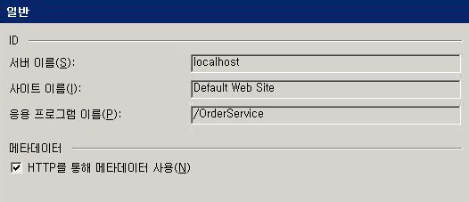
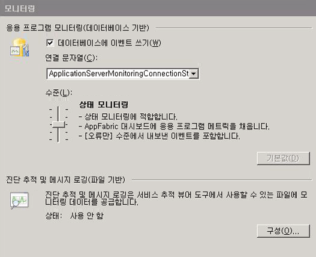
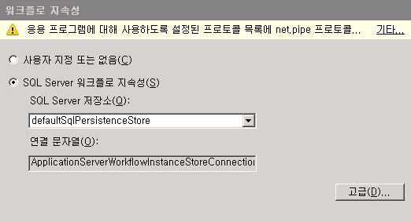
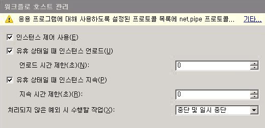
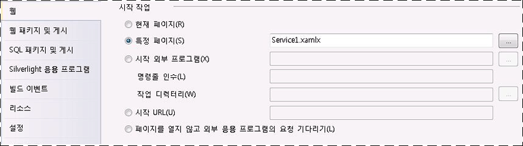
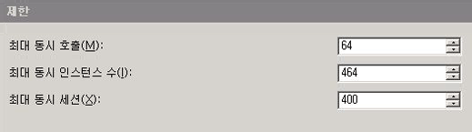
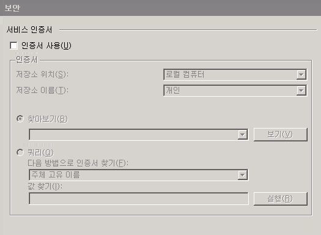
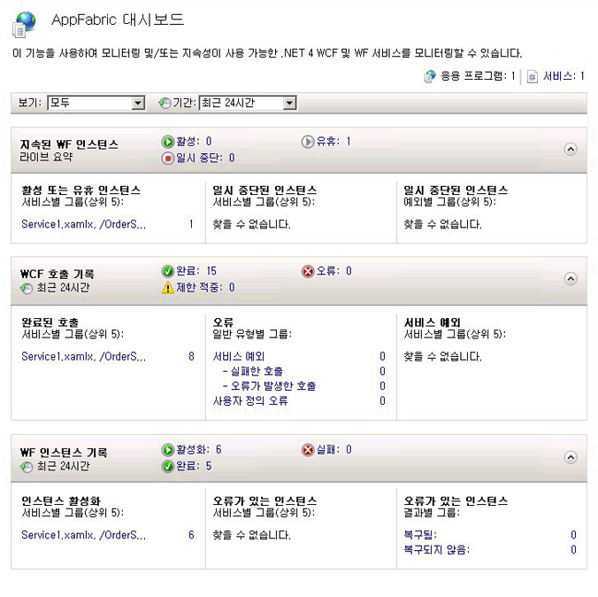
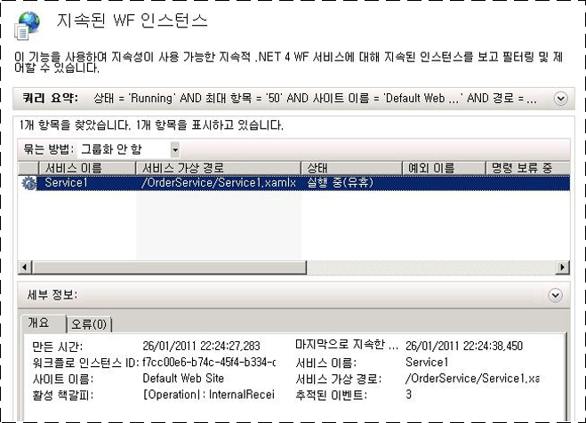

# 방법: Windows Server AppFabric을 사용하여 워크플로 서비스 호스팅How to: Host a Workflow Service with Windows Server App Fabric
AppFabric에서 워크플로 서비스를 호스팅하는 것은 IIS/WAS에서 호스팅하는 것과 유사합니다.Hosting workflow services in App Fabric is similar to hosting under IIS/WAS. 유일한 차이점은 AppFabric에서 워크플로 서비스의 배포, 모니터링 및 관리를 위해 제공하는 도구입니다.The only difference is the tools App Fabric provides for deploying, monitoring, and managing workflow services. 이 항목에서는에서 만든 워크플로 서비스는 [장기 실행 워크플로 서비스를 만드는](../../../../docs/framework/wcf/feature-details/creating-a-long-running-workflow-service.md)합니다.This topic uses the workflow service created in the [Creating a Long-running Workflow Service](../../../../docs/framework/wcf/feature-details/creating-a-long-running-workflow-service.md). 이 항목에서는 워크플로 서비스를 만드는 방법을 안내하며,That topic will walk you through creating a workflow service. AppFabric을 사용하여 워크플로 서비스를 호스팅하는 방법을 설명합니다.This topic will explain how to host the workflow service using App Fabric. Windows Server App Fabric에 대 한 자세한 내용은 참조 [Windows Server App Fabric 문서](http://go.microsoft.com/fwlink/?LinkID=193037&clcid=0x409)합니다.For more information about Windows Server App Fabric, see [Windows Server App Fabric Documentation](http://go.microsoft.com/fwlink/?LinkID=193037&clcid=0x409). 아래의 단계를 완료하기 전에 Windows Server AppFabric이 설치되어 있는지 확인합니다.Before completing the steps below make sure you have Windows Server App Fabric installed.  인터넷 정보 서비스 (inetmgr.exe)를이 열고를 수행 하려면 서버 이름을 클릭는 **연결** 사이트를 클릭 하 고 클릭 **기본 웹 사이트**합니다.To do this open up Internet Information Services (inetmgr.exe), click your server name in the **Connections** view, click Sites, and click **Default Web Site**. 화면 오른쪽에 있는 섹션이 표시 되어야 **App Fabric**합니다.In the right-hand side of the screen you should see a section called **App Fabric**. 이 섹션(오른쪽 창의 맨 위에 있음)이 없으면 AppFabric이 설치되지 않은 것입니다.If you don’t see this section (it will be on the top of the right-hand pane) you do not have App Fabric installed. Windows Server Appfabric을 설치 하는 방법에 대 한 자세한 내용은 참조 [설치 Windows Server App Fabric](http://go.microsoft.com/fwlink/?LinkId=193136)합니다.For more information about installing Windows Server App Fabric see [Installing Windows Server App Fabric](http://go.microsoft.com/fwlink/?LinkId=193136).  
  
### 간단한 워크플로 서비스 만들기Creating a Simple Workflow Service  
  
1.  열기 [!INCLUDE[vs_current_long](../../../../includes/vs-current-long-md.md)] 에서 만든 OrderProcessing 솔루션을 로드 하 고는 [장기 실행 워크플로 서비스를 만드는](../../../../docs/framework/wcf/feature-details/creating-a-long-running-workflow-service.md) 항목입니다.Open [!INCLUDE[vs_current_long](../../../../includes/vs-current-long-md.md)] and load the OrderProcessing solution you created in the [Creating a Long-running Workflow Service](../../../../docs/framework/wcf/feature-details/creating-a-long-running-workflow-service.md) topic.  
  
2.  마우스 오른쪽 단추로 클릭는 **OrderService** 프로젝트를 마우스 선택 **속성** 선택 하 고는 **웹** 탭 합니다.Right click the **OrderService** project and select **Properties** and select the **Web** tab.  
  
3.  에 **시작 작업** 속성 페이지의 섹션 선택 **특정 페이지** 편집 상자에 Service1.xamlx를 입력 합니다.In the **Start Action** section of the property page select **Specific Page** and type Service1.xamlx in the edit box.  
  
4.  에 **서버** 속성 페이지의 섹션을 선택 **로컬 IIS 웹 서버 사용** 및 다음 url에서 형식: `http://localhost/OrderService`합니다.In the **Servers** section of the property page select **Use Local IIS Web Server** and type in the following URL: `http://localhost/OrderService`.  
  
5.  클릭는 **가상 디렉터리 만들기** 단추입니다.Click the **Create Virtual Directory** button. 새 가상 디렉터리가 만들어지고 프로젝트가 빌드될 때 이 가상 디렉터리에 필요한 파일을 복사하도록 프로젝트가 설정됩니다.This will create a new virtual directory and set up the project to copy the needed files to the virtual directory when the project is built.  또는 .xamlx, web.config 및 필요한 DLL을 가상 디렉터리에 수동으로 복사할 수 있습니다.Alternatively you could manually copy the .xamlx, the web.config, and any needed DLLs to the virtual directory.  
  
### Windows Server AppFabric에서 호스팅되는 워크플로 서비스 구성Configuring a Workflow Service Hosted in Windows Server App Fabric  
  
1.  인터넷 정보 서비스 관리자(inetmgr.exe)를 엽니다.Open Internet Information Services Manager (inetmgr.exe).  
  
2.  OrderService 가상 디렉터리로 이동 된 **연결** 창.Navigate to the OrderService virtual directory in the **Connections** pane.  
  
3.  OrderService를 마우스 오른쪽 단추로 클릭 하 고 선택 **WCF 및 WF 서비스 관리**, **구성 중...** .Right click OrderService and select **Manage WCF and WF Services**, **Configure…**. **WCF 및 WF 응용 프로그램에 대 한 구성** 대화 상자가 표시 됩니다.The **Configure WCF and WF for Application** dialog box is displayed.  
  
4.  선택 된 **일반** 다음 스크린 샷과 같이 응용 프로그램에 대 한 일반 정보를 표시 하려면 탭 합니다.Select the **General** tab to display general information about the application as shown in the following screen shot.  
  
       
  
5.  선택 된 **모니터링** 탭 합니다. 다음 스크린 샷과 같이 다양한 모니터링 설정이 표시됩니다.Select the **Monitoring** tab. This shows various monitoring settings as shown in the following screen shot.  
  
       
  
     워크플로 서비스를 구성 하는 방법에 대 한 자세한 내용은 참조에서 App Fabric 모니터링 [App Fabric로 모니터링 구성](http://go.microsoft.com/fwlink/?LinkId=193153)합니다.For more information about configuring workflow service monitoring in App Fabric see [Configuring monitoring with App Fabric](http://go.microsoft.com/fwlink/?LinkId=193153).  
  
6.  선택 된 **워크플로 지 속성** 탭 합니다. 여기에서는 다음 스크린 샷과 같이 AppFabric의 기본 지속성 공급자를 사용하도록 응용 프로그램을 구성할 수 있습니다.Select the **Workflow Persistence** tab. This allows you to configure your application to use App Fabric’s default persistence provider as shown in the following screen shot.  
  
       
  
     Windows Server Appfabric에서 워크플로 지 속성을 구성 하는 방법에 대 한 자세한 내용은 참조 [Appfabric에서 워크플로 지 속성 구성](http://go.microsoft.com/fwlink/?LinkId=193148)합니다.For more information about configuring workflow persistence in Windows Server App Fabric see [Configuring Workflow Persistence in App Fabric](http://go.microsoft.com/fwlink/?LinkId=193148).  
  
7.  선택 된 **워크플로 호스트 관리** 탭 합니다. 여기에서는 다음 스크린 샷과 같이 유휴 워크플로 서비스 인스턴스가 언로드되고 유지되는 때를 지정할 수 있습니다.Select the **Workflow Host Management** tab. This allows you to specify when idle workflow service instances should be unloaded and persisted as shown in the following screen shot.  
  
       
  
     워크플로 호스트 관리 구성에 대 한 자세한 내용은 참조 [Appfabric에서 워크플로 호스트 관리 구성](http://go.microsoft.com/fwlink/?LinkId=193151)합니다.For more information about workflow host management configuration see [Configuring Workflow Host Management in App Fabric](http://go.microsoft.com/fwlink/?LinkId=193151).  
  
8.  선택 된 **자동 시작** 탭 합니다. 여기에서는 다음 스크린 샷과 같이 응용 프로그램에서 워크플로 서비스에 대한 자동 시작 설정을 지정할 수 있습니다.Select the **Auto-Start** tab. This allows you to specify auto-start settings for the workflow services in the application as shown in the following screen shot.  
  
       
  
     자동 시작 구성 하는 방법에 대 한 자세한 내용은 참조 [구성 자동 시작 App Fabric로](http://go.microsoft.com/fwlink/?LinkId=193150)합니다.For more information about configuring Auto-Start see [Configuring Auto-Start with App Fabric](http://go.microsoft.com/fwlink/?LinkId=193150).  
  
9. 선택 된 **제한** 탭 합니다. 여기에서는 다음 스크린 샷과 같이 워크플로 서비스에 대한 제한 설정을 구성할 수 있습니다.Select the **Throttling** tab. This allows you to configure throttling settings for the workflow service as shown in the following screen shot.  
  
       
  
     조정 구성에 대 한 자세한 내용은 참조 [App Fabric로 제한 구성](http://go.microsoft.com/fwlink/?LinkId=193149)합니다.For more information about configuring throttling see [Configuring Throttling with App Fabric](http://go.microsoft.com/fwlink/?LinkId=193149).  
  
10. 선택 된 **보안** 탭 합니다. 여기에서는 다음 스크린 샷과 같이 응용 프로그램에 대한 보안 설정을 구성할 수 있습니다.Select the **Security** tab. This allows you to configure security settings for the application as shown in the following screen shot.  
  
       
  
     Windows Server Appfabric을 사용 하 여 보안을 구성 하는 방법에 대 한 자세한 내용은 참조 [App Fabric로 보안 구성](http://go.microsoft.com/fwlink/?LinkId=193152)합니다.For more information about configuring security with Windows Server App Fabric see [Configuring Security with App Fabric](http://go.microsoft.com/fwlink/?LinkId=193152).  
  
### Windows Server AppFabric 사용Using Windows Server App Fabric  
  
1.  솔루션을 빌드하여 필요한 파일을 가상 디렉터리에 복사합니다.Build the solution to copy the necessary files to the virtual directory.  
  
2.  OrderClient 프로젝트를 마우스 오른쪽 단추로 클릭 하 고 선택 **디버그**, **새 인스턴스 시작** 클라이언트 응용 프로그램을 시작 합니다.Right click the OrderClient project and select **Debug**, **Start New Instance** to launch the client application.  
  
3.  클라이언트가 실행 되 고 이름이 표시 됩니다는 **연결 보안 경고** 대화 상자를 클릭는 **연결 안 함** 단추입니다.The client will run and Visual Studio will display an **Attach Security Warning** dialog box, click the **Don’t Attach** button. 이렇게 하면 Visual Studio에서 디버깅을 위해 IIS 프로세스에 연결하지 않습니다.This tells Visual Studio to not attach to the IIS process for debugging.  
  
4.  클라이언트 응용 프로그램은 워크플로 서비스를 즉시 호출한 다음 기다립니다.The client application will immediately call the Workflow service and then wait. 워크플로 서비스는 유휴 상태가 되고 유지됩니다.The workflow service will go idle and be persisted. 인터넷 정보 서비스(inetmgr.exe)를 시작하고 연결 창에서 OrderService로 이동한 다음 선택하여 이를 확인할 수 있습니다.You can verify this by starting Internet Information Services (inetmgr.exe), navigating to the OrderService in the Connections pane and selecting it. 그런 다음 오른쪽 창에서 AppFabric 대시보드 아이콘을 클릭합니다.Next, click the App Fabric Dashboard icon in the right-hand pane. 지속된 WF 인스턴스 아래에 다음 스크린 샷과 같이 유지된 워크플로 서비스 인스턴스가 하나 있습니다.Under Persisted WF Instances you will see there is one persisted workflow service instance as shown in the following screen shot.  
  
       
  
     **WF 인스턴스 기록** 워크플로 서비스 정품 인증 수, 워크플로 서비스 인스턴스 완료 수 및 오류가 있는 워크플로 인스턴스 수와 같은 워크플로 서비스에 대 한 정보를 나열 합니다.The **WF Instance History** lists information about the workflow service such as the number of workflow service activations, the number of workflow service instance completions, and the number of workflow instances with failures. 활성 또는 유휴 인스턴스 아래에 링크가 표시됩니다. 이 링크를 클릭하면 다음 스크린 샷과 같이 유휴 워크플로 인스턴스에 대한 자세한 정보가 표시됩니다.Under Active or Idle instances a link will be displayed, clicking on the link will display more information about the idle workflow instances as shown in the following screen shot.  
  
       
  
     Windows Server App Fabric에 대 한 자세한 내용은 기능 및 사용 하는 방법 참조 [Windows Server App Fabric 호스팅 기능](http://go.microsoft.com/fwlink/?LinkID=193143&clcid=0x409)For more information about Windows Server App Fabric features and how to use them see [Windows Server App Fabric Hosting Features](http://go.microsoft.com/fwlink/?LinkID=193143&clcid=0x409)  
  
## 참고 항목See Also  
 [장기 실행 워크플로 서비스 만들기Creating a Long-running Workflow Service](../../../../docs/framework/wcf/feature-details/creating-a-long-running-workflow-service.md)  
 [Windows Server App Fabric 호스팅 기능Windows Server App Fabric Hosting Features](http://go.microsoft.com/fwlink/?LinkId=193143)  
 [Windows Server Appfabric 설치Installing Windows Server App Fabric](http://go.microsoft.com/fwlink/?LinkId=193136)  
 [Windows Server App Fabric 문서Windows Server App Fabric Documentation](http://go.microsoft.com/fwlink/?LinkID=193037&clcid=0x409)
