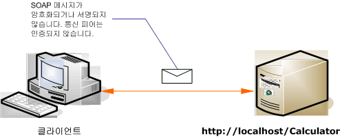

# <a name="internet-unsecured-client-and-service"></a>보안이 설정되지 않은 인터넷 클라이언트 및 서비스
다음 그림에는 public, 보안 되지 않은 Windows Communication Foundation (WCF) 클라이언트와 서비스의 예가 나와 있습니다.  
  
   
  
|특성|설명|  
|--------------------|-----------------|  
|보안 모드|없음|  
|전송|HTTP|  
|바인딩|<xref:System.ServiceModel.BasicHttpBinding> 코드에서 또는 [ \<basicHttpBinding >](../../../../docs/framework/configure-apps/file-schema/wcf/basichttpbinding.md) 구성 요소입니다.|  
|상호 운용성|기존 웹 서비스 클라이언트 및 서비스와의 상호 운용성|  
|인증|없음|  
|무결성|없음|  
|기밀성|없음|  
  
## <a name="service"></a>서비스  
 다음 코드와 구성은 독립적으로 실행되어야 합니다. 다음 작업 중 하나를 수행합니다.  
  
-   구성 없이 코드를 사용하여 독립 실행형 서비스를 만듭니다.  
  
-   제공된 구성을 사용하여 서비스를 만들지만 끝점을 정의하지 않습니다.  
  
### <a name="code"></a>코드  
 다음 코드에서는 보안 없이 끝점을 만드는 방법을 보여 줍니다. 기본적으로 <xref:System.ServiceModel.BasicHttpBinding>에는 <xref:System.ServiceModel.BasicHttpSecurityMode.None>으로 설정된 보안 모드가 있습니다.  
  
 [!code-csharp[C_UnsecuredService#1](../../../../samples/snippets/csharp/VS_Snippets_CFX/c_unsecuredservice/cs/source.cs#1)]
 [!code-vb[C_UnsecuredService#1](../../../../samples/snippets/visualbasic/VS_Snippets_CFX/c_unsecuredservice/vb/source.vb#1)]  
  
### <a name="service-configuration"></a>서비스 구성  
 다음 코드에서는 구성을 사용하여 동일한 끝점을 설정합니다.  
  
```xml  
<?xml version="1.0" encoding="utf-8"?>  
<configuration>  
  <system.serviceModel>  
    <behaviors />  
    <services>  
      <service behaviorConfiguration="" name="ServiceModel.Calculator">  
        <endpoint address="http://localhost/Calculator"   
                  binding="basicHttpBinding"  
                  bindingConfiguration="Basic_Unsecured"   
                  name="BasicHttp_ICalculator"  
                  contract="ServiceModel.ICalculator" />  
      </service>  
    </services>  
    <bindings>  
      <basicHttpBinding>  
        <binding name="Basic_Unsecured" />  
      </basicHttpBinding>  
    </bindings>  
    <client />  
  </system.serviceModel>  
</configuration>  
```  
  
## <a name="client"></a>클라이언트  
 다음 코드와 구성은 독립적으로 실행되어야 합니다. 다음 작업 중 하나를 수행합니다.  
  
-   이 코드와 클라이언트 코드를 사용하여 독립 실행형 클라이언트를 만듭니다.  
  
-   끝점 주소를 정의하지 않는 클라이언트를 만듭니다. 대신 구성 이름을 인수로 사용하는 클라이언트 생성자를 사용합니다. 예를 들면 다음과 같습니다.  
  
     [!code-csharp[C_SecurityScenarios#0](../../../../samples/snippets/csharp/VS_Snippets_CFX/c_securityscenarios/cs/source.cs#0)]
     [!code-vb[C_SecurityScenarios#0](../../../../samples/snippets/visualbasic/VS_Snippets_CFX/c_securityscenarios/vb/source.vb#0)]  
  
### <a name="code"></a>코드  
 다음 코드는 보안 되지 않은 끝점에 액세스 하는 기본 WCF 클라이언트를 보여 줍니다.  
  
 [!code-csharp[C_UnsecuredClient#1](../../../../samples/snippets/csharp/VS_Snippets_CFX/c_unsecuredclient/cs/source.cs#1)]
 [!code-vb[C_UnsecuredClient#1](../../../../samples/snippets/visualbasic/VS_Snippets_CFX/c_unsecuredclient/vb/source.vb#1)]  
  
### <a name="client-configuration"></a>클라이언트 구성  
 다음 코드에서는 클라이언트를 구성합니다.  
  
```xml  
<?xml version="1.0" encoding="utf-8"?>  
<configuration>  
  <system.serviceModel>  
    <bindings>  
      <basicHttpBinding>  
        <binding name="BasicHttpBinding_ICalculator" >  
          <security mode="None">  
          </security>  
        </binding>  
      </basicHttpBinding>  
    </bindings>  
    <client>  
      <endpoint address="http://localhost/Calculator/Unsecured"  
          binding="basicHttpBinding"   
          bindingConfiguration="BasicHttpBinding_ICalculator"  
          contract="ICalculator"   
          name="BasicHttpBinding_ICalculator" />  
    </client>  
  </system.serviceModel>  
</configuration>  
```  
  
## <a name="see-also"></a>참고 항목  
 [일반적인 보안 시나리오](../../../../docs/framework/wcf/feature-details/common-security-scenarios.md)  
 [보안 개요](../../../../docs/framework/wcf/feature-details/security-overview.md)  
 [Windows Server App Fabric에 대 한 보안 모델](http://go.microsoft.com/fwlink/?LinkID=201279&clcid=0x409)
