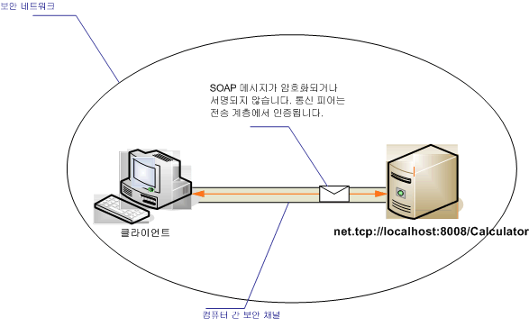

# <a name="intranet-unsecured-client-and-service"></a><span data-ttu-id="eaa9c-102">보안이 설정되지 않은 인트라넷 클라이언트 및 서비스</span><span class="sxs-lookup"><span data-stu-id="eaa9c-102">Intranet Unsecured Client and Service</span></span>
<span data-ttu-id="eaa9c-103">다음 그림에서는 WCF 응용 프로그램에 보안 사설망에 정보를 제공 하기 위해 개발 된 간단한 Windows Communication Foundation (WCF) 서비스를 보여 줍니다.</span><span class="sxs-lookup"><span data-stu-id="eaa9c-103">The following illustration depicts a simple Windows Communication Foundation (WCF) service developed to provide information on a secure private network to a WCF application.</span></span> <span data-ttu-id="eaa9c-104">보안은 데이터의 중요도 낮거나, 본질적으로 안전 이어야 하는데 네트워크 또는 WCF 인프라 아래 계층에서 보안을 제공 하기 때문에 필요 하지 않습니다.</span><span class="sxs-lookup"><span data-stu-id="eaa9c-104">Security is not required because the data is of low importance, the network is expected to be inherently secure, or security is provided by a layer below the WCF infrastructure.</span></span>  
  
 <span data-ttu-id="eaa9c-105"></span><span class="sxs-lookup"><span data-stu-id="eaa9c-105"></span></span>  
  
|<span data-ttu-id="eaa9c-106">특성</span><span class="sxs-lookup"><span data-stu-id="eaa9c-106">Characteristic</span></span>|<span data-ttu-id="eaa9c-107">설명</span><span class="sxs-lookup"><span data-stu-id="eaa9c-107">Description</span></span>|  
|--------------------|-----------------|  
|<span data-ttu-id="eaa9c-108">보안 모드</span><span class="sxs-lookup"><span data-stu-id="eaa9c-108">Security Mode</span></span>|<span data-ttu-id="eaa9c-109">없음</span><span class="sxs-lookup"><span data-stu-id="eaa9c-109">None</span></span>|  
|<span data-ttu-id="eaa9c-110">전송</span><span class="sxs-lookup"><span data-stu-id="eaa9c-110">Transport</span></span>|<span data-ttu-id="eaa9c-111">TCP</span><span class="sxs-lookup"><span data-stu-id="eaa9c-111">TCP</span></span>|  
|<span data-ttu-id="eaa9c-112">바인딩</span><span class="sxs-lookup"><span data-stu-id="eaa9c-112">Binding</span></span>|<xref:System.ServiceModel.NetTcpBinding>|  
|<span data-ttu-id="eaa9c-113">상호 운용성</span><span class="sxs-lookup"><span data-stu-id="eaa9c-113">Interoperability</span></span>|<span data-ttu-id="eaa9c-114">WCF만</span><span class="sxs-lookup"><span data-stu-id="eaa9c-114">WCF only</span></span>|  
|<span data-ttu-id="eaa9c-115">인증</span><span class="sxs-lookup"><span data-stu-id="eaa9c-115">Authentication</span></span>|<span data-ttu-id="eaa9c-116">없음</span><span class="sxs-lookup"><span data-stu-id="eaa9c-116">None</span></span>|  
|<span data-ttu-id="eaa9c-117">무결성</span><span class="sxs-lookup"><span data-stu-id="eaa9c-117">Integrity</span></span>|<span data-ttu-id="eaa9c-118">없음</span><span class="sxs-lookup"><span data-stu-id="eaa9c-118">None</span></span>|  
|<span data-ttu-id="eaa9c-119">기밀성</span><span class="sxs-lookup"><span data-stu-id="eaa9c-119">Confidentiality</span></span>|<span data-ttu-id="eaa9c-120">없음</span><span class="sxs-lookup"><span data-stu-id="eaa9c-120">None</span></span>|  
  
## <a name="service"></a><span data-ttu-id="eaa9c-121">서비스</span><span class="sxs-lookup"><span data-stu-id="eaa9c-121">Service</span></span>  
 <span data-ttu-id="eaa9c-122">다음 코드와 구성은 독립적으로 실행되어야 합니다.</span><span class="sxs-lookup"><span data-stu-id="eaa9c-122">The following code and configuration are meant to run independently.</span></span> <span data-ttu-id="eaa9c-123">다음 작업 중 하나를 수행합니다.</span><span class="sxs-lookup"><span data-stu-id="eaa9c-123">Do one of the following:</span></span>  
  
-   <span data-ttu-id="eaa9c-124">구성 없이 코드를 사용하여 독립 실행형 서비스를 만듭니다.</span><span class="sxs-lookup"><span data-stu-id="eaa9c-124">Create a stand-alone service using the code with no configuration.</span></span>  
  
-   <span data-ttu-id="eaa9c-125">제공된 구성을 사용하여 서비스를 만들지만 끝점을 정의하지 않습니다.</span><span class="sxs-lookup"><span data-stu-id="eaa9c-125">Create a service using the supplied configuration, but do not define any endpoints.</span></span>  
  
### <a name="code"></a><span data-ttu-id="eaa9c-126">코드</span><span class="sxs-lookup"><span data-stu-id="eaa9c-126">Code</span></span>  
 <span data-ttu-id="eaa9c-127">다음 코드는 보안 없이 끝점을 만드는 방법을 보여 줍니다.</span><span class="sxs-lookup"><span data-stu-id="eaa9c-127">The following code shows how to create an endpoint with no security:</span></span>  
  
 [!code-csharp[C_UnsecuredService#2](../../../../samples/snippets/csharp/VS_Snippets_CFX/c_unsecuredservice/cs/source.cs#2)]
 [!code-vb[C_UnsecuredService#2](../../../../samples/snippets/visualbasic/VS_Snippets_CFX/c_unsecuredservice/vb/source.vb#2)]  
  
### <a name="configuration"></a><span data-ttu-id="eaa9c-128">구성</span><span class="sxs-lookup"><span data-stu-id="eaa9c-128">Configuration</span></span>  
 <span data-ttu-id="eaa9c-129">다음 코드는 구성을 사용하여 동일한 끝점을 설정합니다.</span><span class="sxs-lookup"><span data-stu-id="eaa9c-129">The following code sets up the same endpoint using configuration:</span></span>  
  
```xml  
<?xml version="1.0" encoding="utf-8"?>  
<configuration>  
  <system.serviceModel>  
    <behaviors />  
    <services>  
      <service behaviorConfiguration=""   
               name="ServiceModel.Calculator">  
        <endpoint address="net.tcp://localhost:8008/Calculator"   
                  binding="netTcpBinding"  
                  bindingConfiguration="tcp_Unsecured"   
                  name="netTcp_ICalculator"  
                  contract="ServiceModel.ICalculator" />  
      </service>  
    </services>  
    <bindings>  
      <netTcpBinding>  
        <binding name="tcp_Unsecured">  
          <security mode="None" />  
        </binding>  
      </netTcpBinding>  
    </bindings>  
    <client />  
  </system.serviceModel>  
</configuration>  
```  
  
## <a name="client"></a><span data-ttu-id="eaa9c-130">클라이언트</span><span class="sxs-lookup"><span data-stu-id="eaa9c-130">Client</span></span>  
 <span data-ttu-id="eaa9c-131">다음 코드와 구성은 독립적으로 실행되어야 합니다.</span><span class="sxs-lookup"><span data-stu-id="eaa9c-131">The following code and configuration are meant to run independently.</span></span> <span data-ttu-id="eaa9c-132">다음 작업 중 하나를 수행합니다.</span><span class="sxs-lookup"><span data-stu-id="eaa9c-132">Do one of the following:</span></span>  
  
-   <span data-ttu-id="eaa9c-133">이 코드와 클라이언트 코드를 사용하여 독립 실행형 클라이언트를 만듭니다.</span><span class="sxs-lookup"><span data-stu-id="eaa9c-133">Create a stand-alone client using the code (and client code).</span></span>  
  
-   <span data-ttu-id="eaa9c-134">끝점 주소를 정의하지 않는 클라이언트를 만듭니다.</span><span class="sxs-lookup"><span data-stu-id="eaa9c-134">Create a client that does not define any endpoint addresses.</span></span> <span data-ttu-id="eaa9c-135">대신 구성 이름을 인수로 사용하는 클라이언트 생성자를 사용합니다.</span><span class="sxs-lookup"><span data-stu-id="eaa9c-135">Instead, use the client constructor that takes the configuration name as an argument.</span></span> <span data-ttu-id="eaa9c-136">예를 들면 다음과 같습니다.</span><span class="sxs-lookup"><span data-stu-id="eaa9c-136">For example:</span></span>  
  
     [!code-csharp[C_SecurityScenarios#0](../../../../samples/snippets/csharp/VS_Snippets_CFX/c_securityscenarios/cs/source.cs#0)]
     [!code-vb[C_SecurityScenarios#0](../../../../samples/snippets/visualbasic/VS_Snippets_CFX/c_securityscenarios/vb/source.vb#0)]  
  
### <a name="code"></a><span data-ttu-id="eaa9c-137">코드</span><span class="sxs-lookup"><span data-stu-id="eaa9c-137">Code</span></span>  
 <span data-ttu-id="eaa9c-138">다음 코드에서는 TCP 프로토콜을 사용 하는 보안 되지 않은 끝점에 액세스 하는 기본 WCF 클라이언트를 보여 줍니다.</span><span class="sxs-lookup"><span data-stu-id="eaa9c-138">The following code shows a basic WCF client that accesses an unsecured endpoint using the TCP protocol.</span></span>  
  
 [!code-csharp[C_UnsecuredClient#2](../../../../samples/snippets/csharp/VS_Snippets_CFX/c_unsecuredclient/cs/source.cs#2)]
 [!code-vb[C_UnsecuredClient#2](../../../../samples/snippets/visualbasic/VS_Snippets_CFX/c_unsecuredclient/vb/source.vb#2)]  
  
### <a name="configuration"></a><span data-ttu-id="eaa9c-139">구성</span><span class="sxs-lookup"><span data-stu-id="eaa9c-139">Configuration</span></span>  
 <span data-ttu-id="eaa9c-140">다음 구성 코드는 클라이언트에 적용됩니다.</span><span class="sxs-lookup"><span data-stu-id="eaa9c-140">The following configuration code applies to the client:</span></span>  
  
```xml  
<?xml version="1.0" encoding="utf-8"?>  
<configuration>  
  <system.serviceModel>  
    <bindings>  
      <netTcpBinding>  
        <binding name="NetTcpBinding_ICalculator" >  
          <security mode="None">  
          </security>  
        </binding>  
      </netTcpBinding>  
    </bindings>  
    <client>  
      <endpoint address="net.tcp://machineName:8008/Calculator "  
                binding="netTcpBinding"   
                bindingConfiguration="NetTcpBinding_ICalculator"  
                contract="ICalculator"   
                name="NetTcpBinding_ICalculator" />  
    </client>  
  </system.serviceModel>  
</configuration>  
```  
  
## <a name="see-also"></a><span data-ttu-id="eaa9c-141">참고 항목</span><span class="sxs-lookup"><span data-stu-id="eaa9c-141">See Also</span></span>  
 <xref:System.ServiceModel.NetTcpBinding>  
 [<span data-ttu-id="eaa9c-142">보안 개요</span><span class="sxs-lookup"><span data-stu-id="eaa9c-142">Security Overview</span></span>](../../../../docs/framework/wcf/feature-details/security-overview.md)  
 [<span data-ttu-id="eaa9c-143">Windows Server App Fabric에 대 한 보안 모델</span><span class="sxs-lookup"><span data-stu-id="eaa9c-143">Security Model for Windows Server App Fabric</span></span>](http://go.microsoft.com/fwlink/?LinkID=201279&clcid=0x409)
