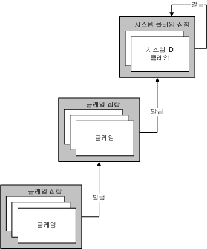
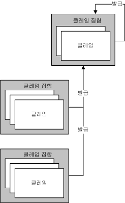
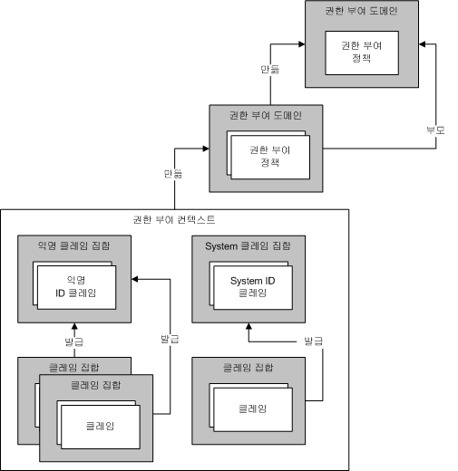

# ID 모델을 사용하여 클레임 및 권한 부여 관리
권한 부여는 컴퓨터 리소스를 변경하거나 보거나 컴퓨터 리소스에 액세스할 수 있는 사용 권한이 있는 엔터티를 확인하는 프로세스입니다.예를 들어 비즈니스에서 관리자만 직원 파일에 액세스할 수 있습니다.[!INCLUDE[indigo1](../../../../includes/indigo1-md.md)]은 권한 부여 처리를 수행하기 위한 두 가지 메커니즘을 지원합니다.첫 번째 메커니즘을 사용하면 기존의 CLR\(공용 언어 런타임\) 구문을 사용하여 권한 부여를 제어할 수 있습니다.두 번째 메커니즘은 *ID 모델*이라고 하는 클레임 기반 모델입니다.[!INCLUDE[indigo2](../../../../includes/indigo2-md.md)]에서는 ID 모델을 사용하여 들어오는 메시지에서 클레임을 만듭니다. ID 모델 클래스는 사용자 지정 권한 부여 체계의 새 클레임 형식을 지원하도록 확장할 수 있습니다.이 항목에서는 ID 모델 기능의 주요 프로그래밍 개념에 대한 개요와 이 기능에서 사용되는 매우 중요한 클래스의 목록을 제공합니다.  
  
## ID 모델 시나리오  
 다음 시나리오에는 ID 모델 사용이 예시되어 있습니다.  
  
### 시나리오 1: ID, 역할 및 그룹 클레임 지원  
 사용자가 메시지를 웹 서비스에 보냅니다.웹 서비스에 대한 액세스 제어 요구 사항에는 ID, 역할 또는 그룹이 사용됩니다.메시지 발신자가 역할 또는 그룹 집합으로 매핑됩니다.역할 또는 그룹 정보는 액세스 확인을 수행하는 데 사용됩니다.  
  
### 시나리오 2: 다양한 클레임 지원  
 사용자가 메시지를 웹 서비스에 보냅니다.웹 서비스에 대한 액세스 제어 요구 사항에는 ID, 역할 또는 그룹보다 더 다양한 모델이 필요합니다.웹 서비스는 지정된 사용자가 다양한 클레임 기반 모델을 사용하여 보호된 특정 리소스에 액세스할 수 있는지 확인합니다.예를 들어 어떤 사용자는 급여 정보와 같이 다른 사용자에게 허용되지 않는 특정한 정보를 읽을 수 있습니다.  
  
### 시나리오 3: 서로 다른 클레임 매핑  
 사용자가 메시지를 웹 서비스에 보냅니다.사용자는 X.509 인증서, 사용자 이름 토큰 또는 Kerberos 토큰 등 여러 가지 방식으로 자격 증명을 지정할 수 있습니다.웹 서비스에서는 사용자 자격 증명 형식에 관계없이 동일한 방식으로 액세스 제어를 확인해야 합니다.이후에 또 다른 자격 증명 형식이 지원되면 시스템도 그에 맞게 향상되어야 합니다.  
  
### 시나리오 4: 여러 리소스에 대한 액세스 확인  
 웹 서비스에서 여러 리소스에 액세스하려고 합니다.이 경우 서비스는 사용자와 관련된 클레임과 리소스에 액세스하는 데 필요한 클레임을 비교하여 지정된 사용자가 액세스할 수 있는 보호된 리소스를 확인합니다.  
  
## ID 모델 용어  
 다음은 ID 모델의 개념을 설명하는 데 사용되는 주요 용어를 정의한 목록입니다.  
  
 권한 부여 정책  
 입력 클레임 집합을 출력 클레임 집합으로 매핑하기 위한 규칙 집합입니다.권한 부여 정책의 평가를 통해 클레임 집합이 평가 컨텍스트에 추가되고 이후에 권한 부여 컨텍스트에 추가됩니다.  
  
 권한 부여 컨텍스트  
 클레임 집합과 하나 이상의 속성 집합\(또는 속성 없이\)이며,하나 이상의 권한 부여 정책을 평가한 결과입니다.  
  
 클레임  
 클레임 형식, 권한 및 값의 조합입니다.  
  
 클레임 집합  
 특정 발급자가 발급한 클레임 집합입니다.  
  
 클레임 형식  
 클레임의 종류입니다.ID 모델 API로 정의한 클레임은 <xref:System.IdentityModel.Claims.Claim.ClaimType%2A> 클래스의 속성입니다.시스템에서 제공하는 클레임 형식에는 <xref:System.IdentityModel.Claims.ClaimTypes.Dns%2A>, <xref:System.IdentityModel.Claims.ClaimTypes.Email%2A>, <xref:System.IdentityModel.Claims.ClaimTypes.Hash%2A>, <xref:System.IdentityModel.Claims.ClaimTypes.Name%2A>, <xref:System.IdentityModel.Claims.ClaimTypes.Rsa%2A>, <xref:System.IdentityModel.Claims.ClaimTypes.Sid%2A>, <xref:System.IdentityModel.Claims.ClaimTypes.Spn%2A>, <xref:System.IdentityModel.Claims.ClaimTypes.System%2A>, <xref:System.IdentityModel.Claims.ClaimTypes.Thumbprint%2A>, <xref:System.IdentityModel.Claims.ClaimTypes.Uri%2A>, <xref:System.IdentityModel.Claims.ClaimTypes.X500DistinguishedName%2A> 등이 있습니다.  
  
 평가 컨텍스트  
 권한 부여 정책이 평가되는 컨텍스트로,속성 및 클레임 집합을 포함합니다.평가 완료 후에는 권한 부여 컨텍스트의 기반으로 사용됩니다.  
  
 ID 클레임  
 권한이 ID인 클레임입니다.  
  
 발급자  
 ID 클레임이 하나 이상 있으며 다른 클레임 집합을 발급한 것으로 간주되는 클레임 집합입니다.  
  
 속성  
 평가 컨텍스트 또는 권한 부여 컨텍스트와 관련된 정보 집합입니다.  
  
 보호된 리소스  
 우선 특정 요구 사항에 부합되는 경우에만 사용, 액세스 또는 조작할 수 있는 시스템 리소스입니다.  
  
 권한  
 리소스에 대한 자격으로,ID 모델 API로 정의한 권한은 <xref:System.IdentityModel.Claims.Rights> 클래스의 속성입니다.시스템에서 제공하는 권한은 <xref:System.IdentityModel.Claims.Rights.Identity%2A>, <xref:System.IdentityModel.Claims.Rights.PossessProperty%2A> 등입니다.  
  
 값  
 권한이 요구되는 대상입니다.  
  
## 클레임  
 ID 모델은 클레임을 기반으로 하는 시스템입니다.클레임은 시스템의 엔터티\(주로 사용자\)와 관련된 권한을 나타냅니다.특정 엔터티와 관련된 클레임 집합은 열쇠와 같은 개념으로 생각할 수 있으며,특정 클레임은 이와 같은 열쇠의 모양을 정의합니다.클레임은 리소스에 대한 액세스 권한을 얻는 데 사용됩니다.보호된 리소스에 대한 액세스 권한은 해당 리소스에 액세스하는 데 필요한 클레임과 액세스를 시도하는 엔터티와 관련된 클레임을 비교하여 확인됩니다.  
  
 클레임은 특정 값에 대한 권한을 나타낸 것입니다."Read", "Write" 또는 "Execute" 등이 권한에 해당하며 데이터베이스, 파일, 사서함 또는 속성이 값에 해당합니다.또한 클레임에는 클레임 형식이 있으며,클레임 형식과 권한을 조합하면 값에 대한 자격을 지정하는 메커니즘이 제공됩니다.예를 들어 "Biography.doc" 값에 대해 "Read" 권한을 가진 "File" 형식의 클레임은 이러한 클레임과 관련되는 엔터티에 Biography.doc 파일에 대한 읽기 권한이 있음을 나타냅니다.또한 "Martin" 값에 대해 "PossessProperty" 권한이 있는 "Name" 형식의 클레임은 이러한 클레임과 관련되는 엔터티에 값이 "Martin"인 Name 속성이 있음을 나타냅니다.  
  
 여러 가지 클레임 형식과 권한이 ID 모델의 일부로 정의되어 있어도, 시스템은 확장 가능하기 때문에 ID 모델 인프라의 맨 위에 빌드되는 다양한 시스템에서 필요에 따라 추가 클레임 형식과 권한을 정의할 수 있습니다.  
  
### ID 클레임  
 ID를 특정 권한으로 갖는 클레임입니다.이 권한을 가진 클레임은 엔터티의 ID에 대한 문을 만듭니다.예를 들어 값이 "someone@example.com"이며 권한이 ID인 " UPN\(User Principal Name\)" 형식의 클레임은 특정 도메인의 특정 ID를 나타냅니다.  
  
#### System ID 클레임  
 ID 모델은 System이라는 하나의 ID 클레임을 정의합니다.System ID 클레임은 엔터티가 현재 응용 프로그램 또는 시스템임을 나타냅니다.  
  
### 클레임 집합  
 엔터티의 개념이 결국에는 그 "자신"이 되더라도 클레임은 시스템의 일부 엔터티에 의해 항상 발급되므로, ID를 나타내는 클레임의 모델은 중요합니다.클레임은 하나의 집합으로 서로 그룹화되며 각 집합에는 발급자가 있습니다.발급자도 클레임 집합입니다.이러한 재귀 관계는 결국 클레임 집합이 자신의 발급자가 되는 것으로 끝납니다.  
  
 다음 그림에 있는 세 개의 클레임 집합 예제는 한 클레임 집합이 다른 클레임 집합을 자신의 발급자로 사용하다가 결국에는 System 클레임 집합이 자신의 발급자가 되는 관계를 보여 줍니다.따라서 클레임 집합의 계층 구조는 얼마든지 깊어질 수 있습니다.  
  
   
  
 다음 그림과 같이, 여러 개의 클레임 집합에서 같은 발급 클레임 집합을 사용할 수도 있습니다.  
  
   
  
 자기 자신을 발급자로 사용하는 클레임 집합 이외에는 ID 모델에서 클레임 집합이 순환 관계를 형성할 수 없습니다.따라서 A 클레임 집합이 B 클레임 집합에 의해 발급되며 B 클레임 집합이 A 클레임 집합에 의해 발급되는 상황은 발생하지 않습니다.또한 ID 모델에서는 클레임 집합에 여러 발급자가 있을 수도 없습니다.지정된 클레임 집합을 둘 이상의 발급자가 발급해야 하는 경우에는, 동일한 클레임이 포함되어 있지만 발급자가 각기 다른 여러 클레임 집합을 사용해야 합니다.  
  
### 클레임의 발단  
 클레임은 여러 가지 소스로부터 만들어질 수 있습니다.그 중 일반적인 한 가지 예로, 사용자가 웹 서비스에 보낸 메시지의 일부로 제공한 자격 증명을 들 수 있습니다.이러한 클레임은 시스템에서 유효성 검사를 거친 후 해당 사용자와 관련된 클레임 집합의 일부가 됩니다.운영 체제, 네트워크 스택, 런타임 환경 또는 응용 프로그램 등의 기타 시스템 구성 요소도 클레임의 소스가 될 수 있습니다.그 밖에 원격 서비스도 클레임의 소스가 될 수 있습니다.  
  
### 권한 부여 정책  
 ID 모델에서 클레임은 권한 부여 정책 평가 프로세스의 일부로 생성됩니다.권한 부여 정책에서는 대개 비어 있는 기존 클레임 집합을 조사하고, 기존의 클레임을 근거로 추가 클레임과 추가 정보를 임의로 추가하도록 선택할 수 있습니다.또한 클레임 간의 매핑을 위한 기반을 제공합니다.시스템 내 클레임이 존재하는지 유무는 다른 클레임의 추가 여부와 관련해 권한 부여 정책의 동작에 영향을 줍니다.  
  
 예를 들어 권한 부여 정책을 통해, 시스템을 사용하는 여러 엔터티의 생일을 포함하는 데이터베이스에 액세스할 수 있습니다.이 경우 권한 부여 정책은 이러한 정보를 사용하여 "Over18" 클레임을 컨텍스트에 추가합니다.이 Over18 클레임은 18세 이상이라는 정보 이외의 다른 엔터티 정보는 노출하지 않습니다.'Over18' 클레임에 대한 해석은 해당 클레임의 의미 체계에 대한 파악에 따라 다릅니다.해당 클레임을 추가한 권한 부여 정책에는 그 의미 체계가 일정 수준에서 파악되어 있습니다.그리고 이후에 정책 평가의 결과로 발생한 클레임을 조사하는 코드에도 해당 의미 체계에 대한 정보가 제공됩니다.  
  
 지정된 권한 부여 정책에서 여러 번의 정책 평가를 요구할 수 있습니다. 그 이유는 다른 권한 부여 정책이 클레임을 추가하는 것처럼, 해당 권한 부여 정책이 훨씬 더 많은 클레임을 추가할 수 있기 때문입니다.ID 모델은 적용되는 권한 부여 정책에 의해 컨텍스트에 추가될 클레임이 더 이상 없을 때까지 평가를 계속하도록 디자인되었습니다.이렇게 이어지는 권한 부여 정책 평가를 통해 권한 부여 정책을 특정 순서로 평가하도록 하는 요구 사항을 방지할 수 있으며, 따라서 정책을 임의의 순서로 평가할 수 있습니다.예를 들어, A 정책이 B 클레임을 추가한 상황에서 X 정책이 Z 클레임만 추가하는 경우, X를 먼저 평가하면 처음에는 Z 클레임을 추가하지 않습니다.그 이후에, A가 평가되고 B 클레임을 추가합니다.그런 다음 X를 다시 평가하여 이번에 Z 클레임을 추가합니다.  
  
 지정된 시스템에는 적용되는 권한 부여 정책이 여러 개 있을 수 있습니다.  
  
### 열쇠 제작 기계  
 관련된 여러 권한 부여 정책을 평가하는 것은 열쇠를 제작하는 기계를 사용하는 것과 비슷합니다.각각의 권한 부여 정책을 평가하면 클레임 집합이 생성되어 열쇠의 모양을 갖추게 됩니다.열쇠의 모양이 완성되면 이를 사용하여 잠금이 열리는지 확인해 볼 수 있습니다.열쇠의 모양은 권한 부여 관리자가 만든 "권한 부여 컨텍스트"에 저장됩니다.  
  
### 권한 부여 컨텍스트  
 권한 부여 관리자는 이전 설명과 같이 여러 가지 권한 부여 정책을 평가하며, 그 결과는 클레임 집합과 일부 관련된 속성 집합으로 이루어진 권한 부여 컨텍스트가 됩니다.이러한 권한 부여 컨텍스트를 조사하면 해당 컨텍스트에 있는 클레임에 대해 그리고 발급 클레임 집합과 같은 여러 클레임 간의 관계에 대해 확인할 수 있으며, 궁극적으로는 이러한 내용을 리소스에 액세스하기 위해 부합해야 하는 일부 요구 사항과 비교할 수 있습니다.  
  
### 잠금  
 권한 부여 컨텍스트\(클레임 집합\)가 열쇠라면, 그 열쇠가 들어맞는 자물쇠는 특정한 보호된 리소스에 대한 액세스 권한을 부여 받기 위해 충족되어야 하는 요구 사항들로 구성됩니다.ID 모델에서는 이러한 요구 사항의 표현 방식을 형식화하지 않지만, 시스템의 클레임 기반 특성을 고려하여 권한 부여 컨텍스트의 클레임과 일부 요구된 클레임 집합을 비교하는 방식을 형식화합니다.  
  
### 반복  
 ID 모델은 클레임 개념을 바탕으로 합니다.클레임은 집합으로 그룹화되며 권한 부여 컨텍스트에서 집계됩니다.클레임 집합을 포함하는 권한 부여 컨텍스트는 권한 부여 관리자와 관련된 여러 가지 권한 부여 정책을 평가한 결과입니다.이러한 클레임 집합을 조사하면 액세스 요구 사항이 부합되었는지 확인할 수 있습니다.다음 그림에서는 이런 다양한 ID 모델 개념 간의 관계를 보여 줍니다.  
  
   
  
## WCF 및 ID 모델  
 [!INCLUDE[indigo2](../../../../includes/indigo2-md.md)]에서는 ID 모델 인프라를 권한 부여를 위한 기반으로 사용합니다.[!INCLUDE[indigo2](../../../../includes/indigo2-md.md)]에서 <xref:System.ServiceModel.Description.ServiceAuthorizationBehavior> 클래스를 사용하면 *권한 부여* 정책을 서비스의 일부로 지정할 수 있습니다.이러한 권한 부여 정책은 *외부 권한 부여 정책*이라고 하며, 로컬 정책을 바탕으로 또는 원격 서비스와의 상호 작용을 통해 클레임 처리를 수행할 수 있습니다.<xref:System.ServiceModel.ServiceAuthorizationManager> 클래스로 표시되는 권한 부여 관리자는 여러 가지 자격 증명 형식\(토큰\)을 인식하는 권한 부여 정책과 함께 외부 권한 부여 정책을 평가하고, 들어오는 메시지에 적합한 클레임으로 *권한 부여 컨텍스트*를 채웁니다.권한 부여 컨텍스트는<xref:System.IdentityModel.Policy.AuthorizationContext> 클래스로 표시됩니다.  
  
## ID 모델 프로그래밍  
 다음 표에서는 ID 모델 확장을 프로그래밍하기 위해 사용되는 개체 모델에 대해 설명합니다.이러한 클래스는 모두 <xref:System.IdentityModel.Policy> 또는 <xref:System.IdentityModel.Claims> 네임스페이스에 있습니다.  
  
|클래스|설명|  
|---------|--------|  
|권한 부여 구성 요소|<xref:System.IdentityModel.Policy.IAuthorizationComponent> 인터페이스를 구현하는 ID 모델 클래스입니다.|  
|<xref:System.IdentityModel.Policy.IAuthorizationComponent>|하나의 읽기 전용 문자열 속성인 Id를 제공하는 인터페이스입니다.이 속성 값은 이 인터페이스를 구현하는 시스템의 각 인스턴스에 대해 고유합니다.|  
|<xref:System.IdentityModel.Policy.AuthorizationContext>|`ClaimSet` 인스턴스 집합과 0개 이상의 속성을 포함하는 *권한 부여 구성 요소*로서, 하나 이상의 권한 부여 정책을 평가한 결과입니다.|  
|<xref:System.IdentityModel.Claims.Claim>|클레임 형식, 권한 및 값의 조합입니다.권한과 값 일부는 클레임 형식의 제약을 받습니다.|  
|<xref:System.IdentityModel.Claims.ClaimSet>|추상 기본 클래스로,`Claim` 인스턴스의 컬렉션입니다.|  
|<xref:System.IdentityModel.Claims.DefaultClaimSet>|봉인 클래스로,`ClaimSet` 클래스의 구현입니다.|  
|<xref:System.IdentityModel.Policy.EvaluationContext>|추상 기본 클래스로,정책 평가 시 권한 부여 정책에 전달됩니다.|  
|<xref:System.IdentityModel.Policy.IAuthorizationPolicy>|`IAuthorizationComponent`에서 파생된 인터페이스로, 권한 부여 정책 클래스에 의해 구현됩니다.|  
|<xref:System.IdentityModel.Claims.Rights>|미리 정의된 권한 값을 포함하는 정적 클래스입니다.|  
  
 다음 클래스는 ID 모델 프로그래밍에도 사용되지만, <xref:System.IdentityModel.Policy> 또는 <xref:System.IdentityModel.Claims> 네임스페이스에는 없는 클래스입니다.  
  
|클래스|설명|  
|---------|--------|  
|<xref:System.ServiceModel.ServiceAuthorizationManager>|서비스에서의 각 작업에 대해 클레임 기반의 권한 부여를 확인하기 위한 메서드\(<xref:System.ServiceModel.ServiceAuthorizationManager.CheckAccessCore%2A>\)를 제공하는 클래스입니다.이 클래스에서 파생시키고 이 메서드를 재정의해야 합니다.|  
|<xref:System.ServiceModel.Description.ServiceAuthorizationBehavior>|권한 부여와 연관이 있을 때 서비스의 동작과 관련된 여러 가지 속성을 제공하는 봉인 클래스입니다.|  
|<xref:System.ServiceModel.ServiceSecurityContext>|현재 실행 중이거나 실행될 작업에 대해 권한 부여 컨텍스트를 비롯한 보안 컨텍스트를 제공하는 클래스입니다.이 클래스의 인스턴스는 <xref:System.ServiceModel.OperationContext>의 일부입니다.|  
  
### 핵심 멤버  
 다음 멤버는 새 클레임 형식을 만드는 데 흔히 사용됩니다.  
  
|멤버|설명|  
|--------|--------|  
|<xref:System.ServiceModel.ServiceAuthorizationManager.CheckAccessCore%2A>|이 메서드는 서비스에서 작업을 실행하기 전에 클레임 기반의 액세스 확인을 수행하기 위해 파생 클래스에서 구현됩니다.제공된 <xref:System.ServiceModel.OperationContext> 또는 기타 위치에 있는 모든 정보는 액세스 확인 결정을 할 때 조사할 수 있습니다.<xref:System.ServiceModel.ServiceAuthorizationManager.CheckAccessCore%2A>에서 `true`를 반환하면 액세스 권한이 부여되어 작업을 실행할 수 있으며,`CheckAccessCore`에서 `false`를 반환하면 액세스가 거부되어 작업을 실행할 수 없습니다.예제를 보려면 [방법: 서비스에 대한 사용자 지정 권한 부여 관리자 만들기](../../../../docs/framework/wcf/extending/how-to-create-a-custom-authorization-manager-for-a-service.md)를 참조하십시오.|  
|<xref:System.ServiceModel.Description.ServiceAuthorizationBehavior.ServiceAuthorizationManager%2A>|서비스에 대해 <xref:System.ServiceModel.ServiceAuthorizationManager>를 반환합니다.<xref:System.ServiceModel.ServiceAuthorizationManager>는 권한 부여에 대한 결정을 합니다.|  
|<xref:System.ServiceModel.Description.ServiceAuthorizationBehavior.ExternalAuthorizationPolicies%2A>|서비스에 대해 지정된 사용자 지정 권한 부여 정책의 컬렉션입니다.들어오는 메시지의 자격 증명과 관련된 정책 외에도 이러한 정책도 평가됩니다.|  
  
## 참고 항목  
 <xref:System.IdentityModel.Policy.AuthorizationContext>   
 <xref:System.IdentityModel.Claims.Claim>   
 <xref:System.IdentityModel.Policy.EvaluationContext>   
 <xref:System.IdentityModel.Policy.IAuthorizationComponent>   
 <xref:System.IdentityModel.Policy.IAuthorizationPolicy>   
 <xref:System.IdentityModel.Claims.Rights>   
 <xref:System.IdentityModel.Claims>   
 <xref:System.IdentityModel.Policy>   
 <xref:System.IdentityModel.Tokens>   
 <xref:System.IdentityModel.Selectors>   
 [클레임 및 토큰](../../../../docs/framework/wcf/feature-details/claims-and-tokens.md)   
 [클레임 및 리소스 액세스 거부](../../../../docs/framework/wcf/feature-details/claims-and-denying-access-to-resources.md)   
 [클레임 만들기 및 리소스 값](../../../../docs/framework/wcf/feature-details/claim-creation-and-resource-values.md)   
 [방법: 사용자 지정 클레임 만들기](../../../../docs/framework/wcf/extending/how-to-create-a-custom-claim.md)   
 [방법: 클레임 비교](../../../../docs/framework/wcf/extending/how-to-compare-claims.md)   
 [방법: 사용자 지정 권한 부여 정책 만들기](../../../../docs/framework/wcf/extending/how-to-create-a-custom-authorization-policy.md)   
 [방법: 서비스에 대한 사용자 지정 권한 부여 관리자 만들기](../../../../docs/framework/wcf/extending/how-to-create-a-custom-authorization-manager-for-a-service.md)   
 [보안 개요](../../../../docs/framework/wcf/feature-details/security-overview.md)   
 [권한 부여](../../../../docs/framework/wcf/feature-details/authorization-in-wcf.md)