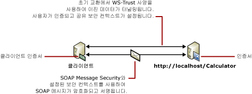

# <a name="message-security-with-a-certificate-client"></a><span data-ttu-id="7c354-102">인증서 클라이언트를 사용하는 메시지 보안</span><span class="sxs-lookup"><span data-stu-id="7c354-102">Message Security with a Certificate Client</span></span>
<span data-ttu-id="7c354-103">다음 시나리오에서는 메시지 보안 모드를 사용하여 보호되는 [!INCLUDE[indigo1](../../../../includes/indigo1-md.md)] 클라이언트 및 서비스를 보여 줍니다.</span><span class="sxs-lookup"><span data-stu-id="7c354-103">The following scenario shows a [!INCLUDE[indigo1](../../../../includes/indigo1-md.md)] client and service secured using message security mode.</span></span> <span data-ttu-id="7c354-104">클라이언트 및 서비스는 인증서를 사용하여 인증됩니다.</span><span class="sxs-lookup"><span data-stu-id="7c354-104">Both the client and the service are authenticated with certificates.</span></span> [!INCLUDE[crdefault](../../../../includes/crdefault-md.md)]<span data-ttu-id="7c354-105">[분산 응용 프로그램 보안](../../../../docs/framework/wcf/feature-details/distributed-application-security.md)합니다.</span><span class="sxs-lookup"><span data-stu-id="7c354-105"> [Distributed Application Security](../../../../docs/framework/wcf/feature-details/distributed-application-security.md).</span></span>  
  
 <span data-ttu-id="7c354-106">샘플 응용 프로그램에 대 한 참조 [메시지 보안 인증서](../../../../docs/framework/wcf/samples/message-security-certificate.md)합니다.</span><span class="sxs-lookup"><span data-stu-id="7c354-106">For a sample application, see [Message Security Certificate](../../../../docs/framework/wcf/samples/message-security-certificate.md).</span></span>  
  
 <span data-ttu-id="7c354-107"></span><span class="sxs-lookup"><span data-stu-id="7c354-107"></span></span>  
  
|<span data-ttu-id="7c354-108">특성</span><span class="sxs-lookup"><span data-stu-id="7c354-108">Characteristic</span></span>|<span data-ttu-id="7c354-109">설명</span><span class="sxs-lookup"><span data-stu-id="7c354-109">Description</span></span>|  
|--------------------|-----------------|  
|<span data-ttu-id="7c354-110">보안 모드</span><span class="sxs-lookup"><span data-stu-id="7c354-110">Security Mode</span></span>|<span data-ttu-id="7c354-111">메시지</span><span class="sxs-lookup"><span data-stu-id="7c354-111">Message</span></span>|  
|<span data-ttu-id="7c354-112">상호 운용성</span><span class="sxs-lookup"><span data-stu-id="7c354-112">Interoperability</span></span>|[!INCLUDE[indigo2](../../../../includes/indigo2-md.md)]<span data-ttu-id="7c354-113">에만 해당</span><span class="sxs-lookup"><span data-stu-id="7c354-113"> only</span></span>|  
|<span data-ttu-id="7c354-114">인증(서버)</span><span class="sxs-lookup"><span data-stu-id="7c354-114">Authentication (Server)</span></span>|<span data-ttu-id="7c354-115">서비스 인증서 사용</span><span class="sxs-lookup"><span data-stu-id="7c354-115">Using service certificate</span></span>|  
|<span data-ttu-id="7c354-116">인증(클라이언트)</span><span class="sxs-lookup"><span data-stu-id="7c354-116">Authentication (Client)</span></span>|<span data-ttu-id="7c354-117">클라이언트 인증서 사용</span><span class="sxs-lookup"><span data-stu-id="7c354-117">Using client certificate</span></span>|  
|<span data-ttu-id="7c354-118">무결성</span><span class="sxs-lookup"><span data-stu-id="7c354-118">Integrity</span></span>|<span data-ttu-id="7c354-119">예</span><span class="sxs-lookup"><span data-stu-id="7c354-119">Yes</span></span>|  
|<span data-ttu-id="7c354-120">기밀성</span><span class="sxs-lookup"><span data-stu-id="7c354-120">Confidentiality</span></span>|<span data-ttu-id="7c354-121">예</span><span class="sxs-lookup"><span data-stu-id="7c354-121">Yes</span></span>|  
|<span data-ttu-id="7c354-122">전송</span><span class="sxs-lookup"><span data-stu-id="7c354-122">Transport</span></span>|<span data-ttu-id="7c354-123">HTTP</span><span class="sxs-lookup"><span data-stu-id="7c354-123">HTTP</span></span>|  
|<span data-ttu-id="7c354-124">바인딩</span><span class="sxs-lookup"><span data-stu-id="7c354-124">Binding</span></span>|<xref:System.ServiceModel.WSHttpBinding>|  
  
## <a name="service"></a><span data-ttu-id="7c354-125">서비스</span><span class="sxs-lookup"><span data-stu-id="7c354-125">Service</span></span>  
 <span data-ttu-id="7c354-126">다음 코드와 구성은 독립적으로 실행되어야 합니다.</span><span class="sxs-lookup"><span data-stu-id="7c354-126">The following code and configuration are meant to run independently.</span></span> <span data-ttu-id="7c354-127">다음 작업 중 하나를 수행합니다.</span><span class="sxs-lookup"><span data-stu-id="7c354-127">Do one of the following:</span></span>  
  
-   <span data-ttu-id="7c354-128">구성 없이 코드를 사용하여 독립 실행형 서비스를 만듭니다.</span><span class="sxs-lookup"><span data-stu-id="7c354-128">Create a stand-alone service using the code with no configuration.</span></span>  
  
-   <span data-ttu-id="7c354-129">제공된 구성을 사용하여 서비스를 만들지만 끝점을 정의하지 않습니다.</span><span class="sxs-lookup"><span data-stu-id="7c354-129">Create a service using the supplied configuration, but do not define any endpoints.</span></span>  
  
### <a name="code"></a><span data-ttu-id="7c354-130">코드</span><span class="sxs-lookup"><span data-stu-id="7c354-130">Code</span></span>  
 <span data-ttu-id="7c354-131">다음 코드에서는 안전한 컨텍스트를 설정하기 위해 메시지 보안을 사용하는 서비스 끝점을 만드는 방법을 보여 줍니다.</span><span class="sxs-lookup"><span data-stu-id="7c354-131">The following code shows how to create a service endpoint that uses message security to establish a secure context.</span></span>  
  
 [!code-csharp[C_SecurityScenarios#10](../../../../samples/snippets/csharp/VS_Snippets_CFX/c_securityscenarios/cs/source.cs#10)]
 [!code-vb[C_SecurityScenarios#10](../../../../samples/snippets/visualbasic/VS_Snippets_CFX/c_securityscenarios/vb/source.vb#10)]  
  
### <a name="configuration"></a><span data-ttu-id="7c354-132">구성</span><span class="sxs-lookup"><span data-stu-id="7c354-132">Configuration</span></span>  
 <span data-ttu-id="7c354-133">코드 대신 다음 구성을 사용할 수 있습니다.</span><span class="sxs-lookup"><span data-stu-id="7c354-133">The following configuration can be used instead of the code.</span></span>  
  
```xml  
<?xml version="1.0" encoding="utf-8"?>  
<configuration>  
  <system.serviceModel>  
    <behaviors>  
      <serviceBehaviors>  
        <behavior name="ServiceCredentialsBehavior">  
          <serviceCredentials>  
            <serviceCertificate findValue="Contoso.com"  
                                x509FindType="FindBySubjectName" />  
          </serviceCredentials>  
        </behavior>  
      </serviceBehaviors>  
    </behaviors>  
    <services>  
      <service behaviorConfiguration="ServiceCredentialsBehavior"   
               name="ServiceModel.Calculator">  
        <endpoint address="http://localhost/Calculator"   
                  binding="wsHttpBinding"  
                  bindingConfiguration="MessageAndCerficiateClient"   
                  name="SecuredByClientCertificate"  
                  contract="ServiceModel.ICalculator" />  
      </service>  
    </services>  
    <bindings>  
      <wsHttpBinding>  
        <binding name="WSHttpBinding_ICalculator">  
          <security mode="Message">  
            <message clientCredentialType="Certificate" />  
          </security>  
        </binding>  
      </wsHttpBinding>  
    </bindings>  
    <client />  
  </system.serviceModel>  
</configuration>  
```  
  
## <a name="client"></a><span data-ttu-id="7c354-134">클라이언트</span><span class="sxs-lookup"><span data-stu-id="7c354-134">Client</span></span>  
 <span data-ttu-id="7c354-135">다음 코드와 구성은 독립적으로 실행되어야 합니다.</span><span class="sxs-lookup"><span data-stu-id="7c354-135">The following code and configuration are meant to run independently.</span></span> <span data-ttu-id="7c354-136">다음 작업 중 하나를 수행합니다.</span><span class="sxs-lookup"><span data-stu-id="7c354-136">Do one of the following:</span></span>  
  
-   <span data-ttu-id="7c354-137">이 코드와 클라이언트 코드를 사용하여 독립 실행형 클라이언트를 만듭니다.</span><span class="sxs-lookup"><span data-stu-id="7c354-137">Create a stand-alone client using the code (and client code).</span></span>  
  
-   <span data-ttu-id="7c354-138">끝점 주소를 정의하지 않는 클라이언트를 만듭니다.</span><span class="sxs-lookup"><span data-stu-id="7c354-138">Create a client that does not define any endpoint addresses.</span></span> <span data-ttu-id="7c354-139">대신 구성 이름을 인수로 사용하는 클라이언트 생성자를 사용합니다.</span><span class="sxs-lookup"><span data-stu-id="7c354-139">Instead, use the client constructor that takes the configuration name as an argument.</span></span> <span data-ttu-id="7c354-140">예를 들면 다음과 같습니다.</span><span class="sxs-lookup"><span data-stu-id="7c354-140">For example:</span></span>  
  
     [!code-csharp[C_SecurityScenarios#0](../../../../samples/snippets/csharp/VS_Snippets_CFX/c_securityscenarios/cs/source.cs#0)]
     [!code-vb[C_SecurityScenarios#0](../../../../samples/snippets/visualbasic/VS_Snippets_CFX/c_securityscenarios/vb/source.vb#0)]  
  
### <a name="code"></a><span data-ttu-id="7c354-141">코드</span><span class="sxs-lookup"><span data-stu-id="7c354-141">Code</span></span>  
 <span data-ttu-id="7c354-142">다음 코드에서는 클라이언트를 만듭니다.</span><span class="sxs-lookup"><span data-stu-id="7c354-142">The following code creates the client.</span></span> <span data-ttu-id="7c354-143">바인딩은 메시지 모드 보안으로 설정되며 클라이언트 자격 증명 형식은 `Certificate`로 설정됩니다.</span><span class="sxs-lookup"><span data-stu-id="7c354-143">The binding is to message mode security, and the client credential type is set to `Certificate`.</span></span>  
  
 [!code-csharp[C_SecurityScenarios#17](../../../../samples/snippets/csharp/VS_Snippets_CFX/c_securityscenarios/cs/source.cs#17)]
 [!code-vb[C_SecurityScenarios#17](../../../../samples/snippets/visualbasic/VS_Snippets_CFX/c_securityscenarios/vb/source.vb#17)]  
  
### <a name="configuration"></a><span data-ttu-id="7c354-144">구성</span><span class="sxs-lookup"><span data-stu-id="7c354-144">Configuration</span></span>  
 <span data-ttu-id="7c354-145">다음 구성에서는 끝점 동작을 사용하는 클라이언트 인증서를 지정합니다.</span><span class="sxs-lookup"><span data-stu-id="7c354-145">The following configuration specifies the client certificate using an endpoint behavior.</span></span> <span data-ttu-id="7c354-146">자세한 내용은 [인증서 작업](../../../../docs/framework/wcf/feature-details/working-with-certificates.md)을 참조하세요.</span><span class="sxs-lookup"><span data-stu-id="7c354-146">For more information about certificates, see [Working with Certificates](../../../../docs/framework/wcf/feature-details/working-with-certificates.md).</span></span> <span data-ttu-id="7c354-147">코드는 또한 사용 하 여는 <`identity`>는 DNS 도메인 이름 ()의 예상 되는 서버 id 지정 하는 요소입니다.</span><span class="sxs-lookup"><span data-stu-id="7c354-147">The code also uses an <`identity`> element to specify a Domain Name System (DNS) of the expected server identity.</span></span> [!INCLUDE[crabout](../../../../includes/crabout-md.md)]<span data-ttu-id="7c354-148">id 참조 [서비스 Id 및 인증](../../../../docs/framework/wcf/feature-details/service-identity-and-authentication.md)합니다.</span><span class="sxs-lookup"><span data-stu-id="7c354-148"> identity, see [Service Identity and Authentication](../../../../docs/framework/wcf/feature-details/service-identity-and-authentication.md).</span></span>  
  
```xml  
<?xml version="1.0" encoding="utf-8"?>  
<configuration>  
  <system.serviceModel>  
    <behaviors>  
      <endpointBehaviors>  
        <behavior name="endpointCredentialsBehavior">  
          <clientCredentials>  
            <clientCertificate findValue="Cohowinery.com"   
               storeLocation="LocalMachine"  
              x509FindType="FindBySubjectName" />  
          </clientCredentials>  
        </behavior>  
      </endpointBehaviors>  
    </behaviors>  
    <bindings>  
      <wsHttpBinding>  
        <binding name="WSHttpBinding_ICalculator" >  
          <security mode="Message">  
            <message clientCredentialType="Certificate" />  
          </security>  
        </binding>  
      </wsHttpBinding>  
    </bindings>  
    <client>  
      <endpoint address="http://machineName/Calculator"   
                behaviorConfiguration="endpointCredentialsBehavior"  
                binding="wsHttpBinding"  
                bindingConfiguration="WSHttpBinding_ICalculator"  
                contract="ICalculator"  
                name="WSHttpBinding_ICalculator">  
        <identity>  
          <dns value="Contoso.com" />  
        </identity>  
      </endpoint>  
    </client>  
  </system.serviceModel>  
</configuration>  
```  
  
## <a name="see-also"></a><span data-ttu-id="7c354-149">참고 항목</span><span class="sxs-lookup"><span data-stu-id="7c354-149">See Also</span></span>  
 [<span data-ttu-id="7c354-150">보안 개요</span><span class="sxs-lookup"><span data-stu-id="7c354-150">Security Overview</span></span>](../../../../docs/framework/wcf/feature-details/security-overview.md)  
 [<span data-ttu-id="7c354-151">서비스 Id 및 인증</span><span class="sxs-lookup"><span data-stu-id="7c354-151">Service Identity and Authentication</span></span>](../../../../docs/framework/wcf/feature-details/service-identity-and-authentication.md)  
 [<span data-ttu-id="7c354-152">인증서 작업</span><span class="sxs-lookup"><span data-stu-id="7c354-152">Working with Certificates</span></span>](../../../../docs/framework/wcf/feature-details/working-with-certificates.md)  
 [<span data-ttu-id="7c354-153">Windows Server App Fabric에 대 한 보안 모델</span><span class="sxs-lookup"><span data-stu-id="7c354-153">Security Model for Windows Server App Fabric</span></span>](http://go.microsoft.com/fwlink/?LinkID=201279&clcid=0x409)
