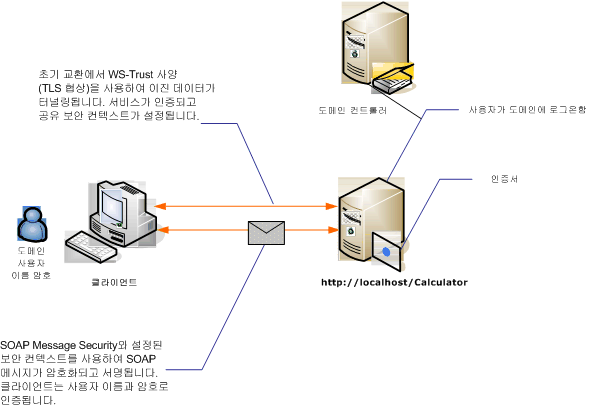

# <a name="message-security-with-a-user-name-client"></a>사용자 이름 클라이언트를 사용하는 메시지 보안
다음 그림에는 Windows Communication Foundation (WCF) 서비스 및 메시지 수준 보안을 사용 하 여 보호할 클라이언트 보여 줍니다. 서비스는 X.509 인증서를 사용하여 인증됩니다. 클라이언트는 사용자 이름 및 암호를 사용하여 인증합니다.  
  
 샘플 응용 프로그램에 대 한 참조 [메시지 보안 사용자 이름](../../../../docs/framework/wcf/samples/message-security-user-name.md)합니다.  
  
   
  
|특성|설명|  
|--------------------|-----------------|  
|보안 모드|메시지|  
|상호 운용성|Windows Communication Foundation (WCF)만|  
|인증(서버)|최초 협상에는 서버 인증이 필요합니다.|  
|인증(클라이언트)|사용자 이름/암호|  
|무결성|예, 공유 보안 컨텍스트 사용|  
|기밀성|예, 공유 보안 컨텍스트 사용|  
|전송|HTTP|  
|바인딩|<xref:System.ServiceModel.WSHttpBinding>|  
  
## <a name="service"></a>서비스  
 다음 코드와 구성은 독립적으로 실행되어야 합니다. 다음 작업 중 하나를 수행합니다.  
  
-   구성 없이 코드를 사용하여 독립 실행형 서비스를 만듭니다.  
  
-   제공된 구성을 사용하여 서비스를 만들지만 끝점을 정의하지 않습니다.  
  
### <a name="code"></a>코드  
 다음 코드에서는 메시지 보안을 사용하는 서비스 끝점을 만드는 방법을 보여 줍니다.  
  
 [!code-csharp[C_SecurityScenarios#9](../../../../samples/snippets/csharp/VS_Snippets_CFX/c_securityscenarios/cs/source.cs#9)]
 [!code-vb[C_SecurityScenarios#9](../../../../samples/snippets/visualbasic/VS_Snippets_CFX/c_securityscenarios/vb/source.vb#9)]  
  
### <a name="configuration"></a>구성  
 코드 대신 다음 구성을 사용할 수 있습니다.  
  
```xml  
<?xml version="1.0" encoding="utf-8"?>  
<configuration>  
  <system.serviceModel>  
    <behaviors>  
      <serviceBehaviors>  
        <behavior name="ServiceCredentialsBehavior">  
          <serviceCredentials>  
            <serviceCertificate findValue="Contoso.com"   
                                storeLocation="LocalMachine"  
                                storeName="My"     
                                x509FindType="FindBySubjectName" />  
          </serviceCredentials>  
        </behavior>  
      </serviceBehaviors>  
    </behaviors>  
    <services>  
      <service behaviorConfiguration="ServiceCredentialsBehavior"  
               name="ServiceModel.Calculator">  
        <endpoint address="http://localhost/Calculator"  
                  binding="wsHttpBinding"  
                  bindingConfiguration="MessageAndUserName"  
                  name="SecuredByTransportEndpoint"  
                  contract="ServiceModel.ICalculator" />  
      </service>  
    </services>  
    <bindings>  
      <wsHttpBinding>  
        <binding name="MessageAndUserName">  
          <security mode="Message">              
            <message clientCredentialType="UserName" />  
          </security>  
        </binding>  
      </wsHttpBinding>  
    </bindings>  
    <client />  
  </system.serviceModel>  
</configuration>  
```  
  
## <a name="client"></a>클라이언트  
  
### <a name="code"></a>코드  
 다음 코드에서는 클라이언트를 만듭니다. 바인딩은 메시지 모드 보안으로 설정되며 클라이언트 자격 증명 형식은 `UserName`로 설정됩니다. 사용자 이름 및 암호는 코드(구성할 수 없음)를 사용해서만 지정할 수 있습니다. 사용자 이름 및 암호를 반환할 코드는 응용 프로그램 수준에서 수행되는 작업이기 때문에 여기에 표시되지 않습니다. 예를 들어 데이터에 대한 사용자를 쿼리하려면 Windows Forms 대화 상자를 사용합니다.  
  
 [!code-csharp[C_SecurityScenarios#16](../../../../samples/snippets/csharp/VS_Snippets_CFX/c_securityscenarios/cs/source.cs#16)]
 [!code-vb[C_SecurityScenarios#16](../../../../samples/snippets/visualbasic/VS_Snippets_CFX/c_securityscenarios/vb/source.vb#16)]  
  
### <a name="configuration"></a>구성  
 다음 코드에서는 클라이언트를 구성합니다. 바인딩은 메시지 모드 보안으로 설정되며 클라이언트 자격 증명 형식은 `UserName`로 설정됩니다. 사용자 이름 및 암호는 코드(구성할 수 없음)를 사용해서만 지정할 수 있습니다.  
  
```xml  
<?xml version="1.0" encoding="utf-8"?>  
<configuration>  
  <system.serviceModel>  
    <bindings>  
      <wsHttpBinding>  
        <binding name="WSHttpBinding_ICalculator" >  
          <security mode="Message">  
            <message clientCredentialType="UserName" />  
          </security>  
        </binding>  
      </wsHttpBinding>  
    </bindings>  
    <client>  
      <endpoint address="http://machineName/Calculator"   
                binding="wsHttpBinding"  
                bindingConfiguration="WSHttpBinding_ICalculator"   
                contract="ICalculator"  
                name="WSHttpBinding_ICalculator">  
        <identity>  
          <dns value ="Contoso.com" />  
        </identity>  
      </endpoint>  
    </client>  
  </system.serviceModel>  
</configuration>  
```  
  
## <a name="see-also"></a>참고 항목  
 [보안 개요](../../../../docs/framework/wcf/feature-details/security-overview.md)  
 [메시지 보안 사용자 이름](../../../../docs/framework/wcf/samples/message-security-user-name.md)  
 [서비스 ID 및 인증](../../../../docs/framework/wcf/feature-details/service-identity-and-authentication.md)  
 [\<identity>](../../../../docs/framework/configure-apps/file-schema/wcf/identity.md)  
 [Windows Server App Fabric에 대 한 보안 모델](http://go.microsoft.com/fwlink/?LinkID=201279&clcid=0x409)
