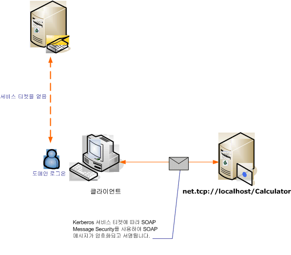

# <a name="message-security-with-a-windows-client-without-credential-negotiation"></a><span data-ttu-id="18d67-102">자격 증명 협상 없이 Windows 클라이언트를 사용하는 메시지 보안</span><span class="sxs-lookup"><span data-stu-id="18d67-102">Message Security with a Windows Client without Credential Negotiation</span></span>
<span data-ttu-id="18d67-103">다음 시나리오에서는 Kerberos 프로토콜에 의해 보안된 [!INCLUDE[indigo1](../../../../includes/indigo1-md.md)] 클라이언트 및 서비스를 보여 줍니다.</span><span class="sxs-lookup"><span data-stu-id="18d67-103">The following scenario shows a [!INCLUDE[indigo1](../../../../includes/indigo1-md.md)] client and service secured by the Kerberos protocol.</span></span>  
  
 <span data-ttu-id="18d67-104">서비스와 클라이언트 모두 동일한 도메인 또는 신뢰할 수 있는 도메인에 있습니다.</span><span class="sxs-lookup"><span data-stu-id="18d67-104">Both the service and the client are in the same domain or trusted domains.</span></span>  
  
> [!NOTE]
>  <span data-ttu-id="18d67-105">이 시나리오의 차이점 및 [Windows 클라이언트는 메시지 보안](../../../../docs/framework/wcf/feature-details/message-security-with-a-windows-client.md) 이 시나리오는 응용 프로그램 메시지를 보내기 전에 서비스와 서비스 자격 증명을 협상 하지 됩니다.</span><span class="sxs-lookup"><span data-stu-id="18d67-105">The difference between this scenario and [Message Security with a Windows Client](../../../../docs/framework/wcf/feature-details/message-security-with-a-windows-client.md) is that this scenario does not negotiate the service credential with the service prior to sending the application message.</span></span> <span data-ttu-id="18d67-106">또한 이 시나리오에는 Kerberos 프로토콜이 필요하기 때문에 Windows 도메인 환경이 필요합니다.</span><span class="sxs-lookup"><span data-stu-id="18d67-106">Additionally, because this requires the Kerberos protocol, this scenario requires a Windows domain environment.</span></span>  
  
 <span data-ttu-id="18d67-107"></span><span class="sxs-lookup"><span data-stu-id="18d67-107"></span></span>  
  
|<span data-ttu-id="18d67-108">특성</span><span class="sxs-lookup"><span data-stu-id="18d67-108">Characteristic</span></span>|<span data-ttu-id="18d67-109">설명</span><span class="sxs-lookup"><span data-stu-id="18d67-109">Description</span></span>|  
|--------------------|-----------------|  
|<span data-ttu-id="18d67-110">보안 모드</span><span class="sxs-lookup"><span data-stu-id="18d67-110">Security Mode</span></span>|<span data-ttu-id="18d67-111">메시지</span><span class="sxs-lookup"><span data-stu-id="18d67-111">Message</span></span>|  
|<span data-ttu-id="18d67-112">상호 운용성</span><span class="sxs-lookup"><span data-stu-id="18d67-112">Interoperability</span></span>|<span data-ttu-id="18d67-113">예, 클라이언트와 호환되는 WS-Security 및 Kerberos 토큰 프로필과 상호 운용할 수 있습니다.</span><span class="sxs-lookup"><span data-stu-id="18d67-113">Yes, WS-Security with Kerberos token-profile compatible clients</span></span>|  
|<span data-ttu-id="18d67-114">인증(서버)</span><span class="sxs-lookup"><span data-stu-id="18d67-114">Authentication (Server)</span></span>|<span data-ttu-id="18d67-115">서버와 클라이언트의 상호 인증</span><span class="sxs-lookup"><span data-stu-id="18d67-115">Mutual authentication of the server and client</span></span>|  
|<span data-ttu-id="18d67-116">인증(클라이언트)</span><span class="sxs-lookup"><span data-stu-id="18d67-116">Authentication (Client)</span></span>|<span data-ttu-id="18d67-117">서버와 클라이언트의 상호 인증</span><span class="sxs-lookup"><span data-stu-id="18d67-117">Mutual authentication of the server and client</span></span>|  
|<span data-ttu-id="18d67-118">무결성</span><span class="sxs-lookup"><span data-stu-id="18d67-118">Integrity</span></span>|<span data-ttu-id="18d67-119">예</span><span class="sxs-lookup"><span data-stu-id="18d67-119">Yes</span></span>|  
|<span data-ttu-id="18d67-120">기밀성</span><span class="sxs-lookup"><span data-stu-id="18d67-120">Confidentiality</span></span>|<span data-ttu-id="18d67-121">예</span><span class="sxs-lookup"><span data-stu-id="18d67-121">Yes</span></span>|  
|<span data-ttu-id="18d67-122">전송</span><span class="sxs-lookup"><span data-stu-id="18d67-122">Transport</span></span>|<span data-ttu-id="18d67-123">HTTP</span><span class="sxs-lookup"><span data-stu-id="18d67-123">HTTP</span></span>|  
|<span data-ttu-id="18d67-124">바인딩</span><span class="sxs-lookup"><span data-stu-id="18d67-124">Binding</span></span>|<xref:System.ServiceModel.WSHttpBinding>|  
  
## <a name="service"></a><span data-ttu-id="18d67-125">서비스</span><span class="sxs-lookup"><span data-stu-id="18d67-125">Service</span></span>  
 <span data-ttu-id="18d67-126">다음 코드와 구성은 독립적으로 실행되어야 합니다.</span><span class="sxs-lookup"><span data-stu-id="18d67-126">The following code and configuration are meant to run independently.</span></span> <span data-ttu-id="18d67-127">다음 작업 중 하나를 수행합니다.</span><span class="sxs-lookup"><span data-stu-id="18d67-127">Do one of the following:</span></span>  
  
-   <span data-ttu-id="18d67-128">구성 없이 코드를 사용하여 독립 실행형 서비스를 만듭니다.</span><span class="sxs-lookup"><span data-stu-id="18d67-128">Create a stand-alone service using the code with no configuration.</span></span>  
  
-   <span data-ttu-id="18d67-129">제공된 구성을 사용하여 서비스를 만들지만 끝점을 정의하지 않습니다.</span><span class="sxs-lookup"><span data-stu-id="18d67-129">Create a service using the supplied configuration, but do not define any endpoints.</span></span>  
  
### <a name="code"></a><span data-ttu-id="18d67-130">코드</span><span class="sxs-lookup"><span data-stu-id="18d67-130">Code</span></span>  
 <span data-ttu-id="18d67-131">다음 코드에서는 메시지 보안을 사용하는 서비스 끝점을 만듭니다.</span><span class="sxs-lookup"><span data-stu-id="18d67-131">The following code creates a service endpoint that uses message security.</span></span> <span data-ttu-id="18d67-132">코드는 서비스 자격 증명 협상과 SCT(보안 컨텍스트 토큰) 설정을 비활성화합니다.</span><span class="sxs-lookup"><span data-stu-id="18d67-132">The code disables service credential negotiation, and the establishment of a security context token (SCT).</span></span>  
  
> [!NOTE]
>  <span data-ttu-id="18d67-133">Windows 자격 증명 형식을 협상 없이 사용하려면 서비스의 사용자 계정이 Active Directory 도메인에 등록된 SPN(서비스 사용자 이름)에 대한 액세스 권한이 있어야 합니다.</span><span class="sxs-lookup"><span data-stu-id="18d67-133">To use the Windows credential type without negotiation, the service's user account must have access to service principal name (SPN) that is registered with the Active Directory domain.</span></span> <span data-ttu-id="18d67-134">이 작업은</span><span class="sxs-lookup"><span data-stu-id="18d67-134">You can do this in two ways:</span></span>  
  
1.  <span data-ttu-id="18d67-135">`NetworkService` 또는 `LocalSystem` 계정을 사용하여 서비스를 실행합니다.</span><span class="sxs-lookup"><span data-stu-id="18d67-135">Use the `NetworkService` or `LocalSystem` account to run your service.</span></span> <span data-ttu-id="18d67-136">이러한 계정은 시스템에서 Active Directory 도메인에 연결할 때 설정된 시스템 SPN에 대한 액세스 권한이 있으므로, [!INCLUDE[indigo2](../../../../includes/indigo2-md.md)]에서는 서비스 메타데이터(웹 서비스 기술 언어 또는 WSDL)의 서비스 끝점에 적절한 SPN 요소를 자동으로 생성합니다.</span><span class="sxs-lookup"><span data-stu-id="18d67-136">Because those accounts have access to the machine SPN that is established when the machine joins the Active Directory domain, [!INCLUDE[indigo2](../../../../includes/indigo2-md.md)] automatically generates the proper SPN element inside the service's endpoint in the service's metadata (Web Services Description Language, or WSDL).</span></span>  
  
2.  <span data-ttu-id="18d67-137">임의의 Active Directory 도메인 계정을 사용하여 서비스를 실행합니다.</span><span class="sxs-lookup"><span data-stu-id="18d67-137">Use an arbitrary Active Directory domain account to run your service.</span></span> <span data-ttu-id="18d67-138">이 경우 해당 도메인 계정에 대한 SPN을 설정해야 합니다.</span><span class="sxs-lookup"><span data-stu-id="18d67-138">In this case, you need to establish an SPN for that domain account.</span></span> <span data-ttu-id="18d67-139">그렇게 하는 한 가지 방법으로 Setspn.exe 유틸리티 도구를 사용합니다.</span><span class="sxs-lookup"><span data-stu-id="18d67-139">One way of doing this is to use the Setspn.exe utility tool.</span></span> <span data-ttu-id="18d67-140">서비스 계정에 대한 SPN이 만들어지면 메타데이터(WSDL)를 통해 서비스 클라이언트에 SPN을 게시하도록 [!INCLUDE[indigo2](../../../../includes/indigo2-md.md)]를 구성합니다.</span><span class="sxs-lookup"><span data-stu-id="18d67-140">Once the SPN is created for the service's account, configure [!INCLUDE[indigo2](../../../../includes/indigo2-md.md)] to publish that SPN to the service's clients through its metadata (WSDL).</span></span> <span data-ttu-id="18d67-141">이 작업은 응용 프로그램 구성 파일이나 코드를 통해 노출된 끝점에 대한 끝점 ID를 설정하여 수행합니다.</span><span class="sxs-lookup"><span data-stu-id="18d67-141">This is done by setting the endpoint identity for the exposed endpoint, either though an application configuration file or code.</span></span> <span data-ttu-id="18d67-142">다음 예제에서는 ID를 프로그래밍 방식으로 게시합니다.</span><span class="sxs-lookup"><span data-stu-id="18d67-142">The following example publishes the identity programmatically.</span></span>  
  
 [!INCLUDE[crabout](../../../../includes/crabout-md.md)]<span data-ttu-id="18d67-143">Spn, Kerberos 프로토콜 및 Active Directory 참조 [Windows Kerberos 기술 자료에 대 한](http://go.microsoft.com/fwlink/?LinkId=88330)합니다.</span><span class="sxs-lookup"><span data-stu-id="18d67-143"> SPNs, the Kerberos protocol, and Active Directory, see [Kerberos Technical Supplement for Windows](http://go.microsoft.com/fwlink/?LinkId=88330).</span></span> [!INCLUDE[crabout](../../../../includes/crabout-md.md)]<span data-ttu-id="18d67-144">끝점 id로 참조 [SecurityBindingElement 인증 모드](../../../../docs/framework/wcf/feature-details/securitybindingelement-authentication-modes.md)합니다.</span><span class="sxs-lookup"><span data-stu-id="18d67-144"> endpoint identities, see [SecurityBindingElement Authentication Modes](../../../../docs/framework/wcf/feature-details/securitybindingelement-authentication-modes.md).</span></span>  
  
 [!code-csharp[C_SecurityScenarios#12](../../../../samples/snippets/csharp/VS_Snippets_CFX/c_securityscenarios/cs/source.cs#12)]
 [!code-vb[C_SecurityScenarios#12](../../../../samples/snippets/visualbasic/VS_Snippets_CFX/c_securityscenarios/vb/source.vb#12)]  
  
### <a name="configuration"></a><span data-ttu-id="18d67-145">구성</span><span class="sxs-lookup"><span data-stu-id="18d67-145">Configuration</span></span>  
 <span data-ttu-id="18d67-146">코드 대신 다음 구성을 사용할 수 있습니다.</span><span class="sxs-lookup"><span data-stu-id="18d67-146">The following configuration can be used instead of the code.</span></span>  
  
```xml  
<?xml version="1.0" encoding="utf-8"?>  
<configuration>  
  <system.serviceModel>  
    <behaviors />  
    <services>  
      <service behaviorConfiguration="" name="ServiceModel.Calculator">  
        <endpoint address="http://localhost/Calculator"   
                  binding="wsHttpBinding"  
                  bindingConfiguration="KerberosBinding"  
                  name="WSHttpBinding_ICalculator"  
                  contract="ServiceModel.ICalculator"   
                  listenUri="net.tcp://localhost/metadata" >  
         <identity>  
            <servicePrincipalName value="service_spn_name" />  
         </identity>  
        </endpoint>  
      </service>  
    </services>  
    <bindings>  
      <wsHttpBinding>  
        <binding name="KerberosBinding">  
          <security>  
            <message negotiateServiceCredential="false"   
                     establishSecurityContext="false" />  
          </security>  
        </binding>  
      </wsHttpBinding>  
    </bindings>  
    <client />  
  </system.serviceModel>  
</configuration>  
```  
  
## <a name="client"></a><span data-ttu-id="18d67-147">클라이언트</span><span class="sxs-lookup"><span data-stu-id="18d67-147">Client</span></span>  
 <span data-ttu-id="18d67-148">다음 코드와 구성은 독립적으로 실행되어야 합니다.</span><span class="sxs-lookup"><span data-stu-id="18d67-148">The following code and configuration are meant to run independently.</span></span> <span data-ttu-id="18d67-149">다음 작업 중 하나를 수행합니다.</span><span class="sxs-lookup"><span data-stu-id="18d67-149">Do one of the following:</span></span>  
  
-   <span data-ttu-id="18d67-150">이 코드와 클라이언트 코드를 사용하여 독립 실행형 클라이언트를 만듭니다.</span><span class="sxs-lookup"><span data-stu-id="18d67-150">Create a stand-alone client using the code (and client code).</span></span>  
  
-   <span data-ttu-id="18d67-151">끝점 주소를 정의하지 않는 클라이언트를 만듭니다.</span><span class="sxs-lookup"><span data-stu-id="18d67-151">Create a client that does not define any endpoint addresses.</span></span> <span data-ttu-id="18d67-152">대신 구성 이름을 인수로 사용하는 클라이언트 생성자를 사용합니다.</span><span class="sxs-lookup"><span data-stu-id="18d67-152">Instead, use the client constructor that takes the configuration name as an argument.</span></span> <span data-ttu-id="18d67-153">예를 들면 다음과 같습니다.</span><span class="sxs-lookup"><span data-stu-id="18d67-153">For example:</span></span>  
  
     [!code-csharp[C_SecurityScenarios#0](../../../../samples/snippets/csharp/VS_Snippets_CFX/c_securityscenarios/cs/source.cs#0)]
     [!code-vb[C_SecurityScenarios#0](../../../../samples/snippets/visualbasic/VS_Snippets_CFX/c_securityscenarios/vb/source.vb#0)]  
  
### <a name="code"></a><span data-ttu-id="18d67-154">코드</span><span class="sxs-lookup"><span data-stu-id="18d67-154">Code</span></span>  
 <span data-ttu-id="18d67-155">다음 코드에서는 클라이언트를 구성합니다.</span><span class="sxs-lookup"><span data-stu-id="18d67-155">The following code configures the client.</span></span> <span data-ttu-id="18d67-156">보안 모드는 Message로 설정되고, 클라이언트 자격 증명 형식은 Windows로 설정됩니다.</span><span class="sxs-lookup"><span data-stu-id="18d67-156">The security mode is set to Message, and the client credential type is set to Windows.</span></span> <span data-ttu-id="18d67-157"><xref:System.ServiceModel.MessageSecurityOverHttp.NegotiateServiceCredential%2A> 및 <xref:System.ServiceModel.NonDualMessageSecurityOverHttp.EstablishSecurityContext%2A> 속성은 `false`로 설정됩니다.</span><span class="sxs-lookup"><span data-stu-id="18d67-157">Note that the <xref:System.ServiceModel.MessageSecurityOverHttp.NegotiateServiceCredential%2A> and <xref:System.ServiceModel.NonDualMessageSecurityOverHttp.EstablishSecurityContext%2A> properties are set to `false`.</span></span>  
  
> [!NOTE]
>  <span data-ttu-id="18d67-158">Windows 자격 증명 형식을 협상 없이 사용하려면 서비스와 통신을 시작하기 전에 서비스의 계정 SPN을 사용하여 클라이언트를 구성해야 합니다.</span><span class="sxs-lookup"><span data-stu-id="18d67-158">To use Windows credential type without negotiation, the client must be configured with the service's account SPN prior to commencing the communication with the service.</span></span> <span data-ttu-id="18d67-159">클라이언트는 SPN을 사용하여 Kerberos 토큰을 가져온 다음 서비스와의 통신을 인증하고 보안합니다.</span><span class="sxs-lookup"><span data-stu-id="18d67-159">The client uses the SPN to get the Kerberos token to authenticate and secure the communication with the service.</span></span> <span data-ttu-id="18d67-160">다음 예제에서는 서비스의 SPN을 사용하여 클라이언트를 구성하는 방법을 보여 줍니다.</span><span class="sxs-lookup"><span data-stu-id="18d67-160">The following sample shows how to configure the client with the service's SPN.</span></span> <span data-ttu-id="18d67-161">사용 하는 경우는 [ServiceModel Metadata 유틸리티 도구 (Svcutil.exe)](../../../../docs/framework/wcf/servicemodel-metadata-utility-tool-svcutil-exe.md) 클라이언트를 생성 하려면 서비스의 SPN 자동으로 전파 됩니다 클라이언트에 서비스의 메타 데이터 (WSDL)에서 서비스의 메타 데이터를 포함 하는 경우 해당 정보입니다.</span><span class="sxs-lookup"><span data-stu-id="18d67-161">If you are using the [ServiceModel Metadata Utility Tool (Svcutil.exe)](../../../../docs/framework/wcf/servicemodel-metadata-utility-tool-svcutil-exe.md) to generate the client, the service's SPN will be automatically propagated to the client from the service's metadata (WSDL), if the service's metadata contains that information.</span></span> <span data-ttu-id="18d67-162">서비스의 메타데이터에 SPN을 포함하도록 서비스를 구성하는 방법에 대한 [!INCLUDE[crabout](../../../../includes/crabout-md.md)]는 이 항목의 뒤에 나오는 "서비스" 단원을 참조하세요.</span><span class="sxs-lookup"><span data-stu-id="18d67-162">[!INCLUDE[crabout](../../../../includes/crabout-md.md)] how to configure the service to include its SPN in the service's metadata, see the "Service" section later in this topic .</span></span>  
>   
>  <span data-ttu-id="18d67-163">Spn, Kerberos 및 Active Directory에 대 한 자세한 내용은 참조 [Windows Kerberos 기술 자료에 대 한](http://go.microsoft.com/fwlink/?LinkId=88330)합니다.</span><span class="sxs-lookup"><span data-stu-id="18d67-163">For more information about SPNs, Kerberos, and Active Directory, see [Kerberos Technical Supplement for Windows](http://go.microsoft.com/fwlink/?LinkId=88330).</span></span> [!INCLUDE[crabout](../../../../includes/crabout-md.md)]<span data-ttu-id="18d67-164">끝점 id로 참조 [SecurityBindingElement 인증 모드](../../../../docs/framework/wcf/feature-details/securitybindingelement-authentication-modes.md) 항목입니다.</span><span class="sxs-lookup"><span data-stu-id="18d67-164"> endpoint identities, see [SecurityBindingElement Authentication Modes](../../../../docs/framework/wcf/feature-details/securitybindingelement-authentication-modes.md) topic.</span></span>  
  
 [!code-csharp[C_SecurityScenarios#19](../../../../samples/snippets/csharp/VS_Snippets_CFX/c_securityscenarios/cs/source.cs#19)]
 [!code-vb[C_SecurityScenarios#19](../../../../samples/snippets/visualbasic/VS_Snippets_CFX/c_securityscenarios/vb/source.vb#19)]  
  
### <a name="configuration"></a><span data-ttu-id="18d67-165">구성</span><span class="sxs-lookup"><span data-stu-id="18d67-165">Configuration</span></span>  
 <span data-ttu-id="18d67-166">다음 코드에서는 클라이언트를 구성합니다.</span><span class="sxs-lookup"><span data-stu-id="18d67-166">The following code configures the client.</span></span> <span data-ttu-id="18d67-167">[ \<servicePrincipalName >](../../../../docs/framework/configure-apps/file-schema/wcf/serviceprincipalname.md) 요소에서 Active Directory 도메인 서비스의 계정에 대해 등록 된 서비스의 SPN에 맞게 설정 해야 합니다.</span><span class="sxs-lookup"><span data-stu-id="18d67-167">Note that the [\<servicePrincipalName>](../../../../docs/framework/configure-apps/file-schema/wcf/serviceprincipalname.md) element must be set to match the service's SPN as registered for the service's account in the Active Directory domain.</span></span>  
  
```xml  
<?xml version="1.0" encoding="utf-8"?>  
<configuration>  
  <system.serviceModel>  
    <bindings>  
      <wsHttpBinding>  
        <binding name="WSHttpBinding_ICalculator" >  
          <security mode="Message">  
            <message clientCredentialType="Windows"   
                     negotiateServiceCredential="false"  
                     establishSecurityContext="false" />  
          </security>  
        </binding>  
      </wsHttpBinding>  
    </bindings>  
    <client>  
      <endpoint address="http://localhost/Calculator"   
                binding="wsHttpBinding"  
                bindingConfiguration="WSHttpBinding_ICalculator"  
                contract="ICalculator"  
                name="WSHttpBinding_ICalculator">  
        <identity>  
          <servicePrincipalName value="service_spn_name" />  
        </identity>  
      </endpoint>  
    </client>  
  </system.serviceModel>  
</configuration>  
```  
  
## <a name="see-also"></a><span data-ttu-id="18d67-168">참고 항목</span><span class="sxs-lookup"><span data-stu-id="18d67-168">See Also</span></span>  
 [<span data-ttu-id="18d67-169">보안 개요</span><span class="sxs-lookup"><span data-stu-id="18d67-169">Security Overview</span></span>](../../../../docs/framework/wcf/feature-details/security-overview.md)  
 [<span data-ttu-id="18d67-170">서비스 Id 및 인증</span><span class="sxs-lookup"><span data-stu-id="18d67-170">Service Identity and Authentication</span></span>](../../../../docs/framework/wcf/feature-details/service-identity-and-authentication.md)  
 [<span data-ttu-id="18d67-171">Windows Server App Fabric에 대 한 보안 모델</span><span class="sxs-lookup"><span data-stu-id="18d67-171">Security Model for Windows Server App Fabric</span></span>](http://go.microsoft.com/fwlink/?LinkID=201279&clcid=0x409)
