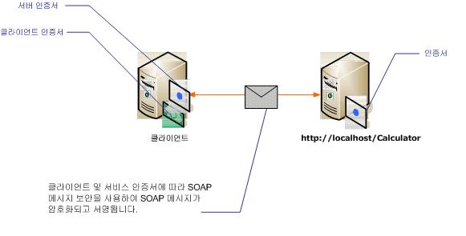

# <a name="message-security-with-mutual-certificates"></a>상호 인증서를 사용하는 메시지 보안
다음 시나리오에서는 메시지 보안 모드를 사용하여 보안하는 [!INCLUDE[indigo1](../../../../includes/indigo1-md.md)] 서비스 및 클라이언트를 보여 줍니다. 클라이언트 및 서비스는 인증서를 사용하여 인증됩니다.  
  
 이 시나리오는 X.509 인증서 토큰 프로필과 함께 WS-Security를 사용하므로 상호 운용할 수 있습니다.  
  
> [!NOTE]
>  이 시나리오에서는 서비스 인증서의 협상을 수행하지 않습니다. 서비스 인증서는 통신을 수행하기 전에 클라이언트에 제공해야 합니다. 서버 인증서는 응용 프로그램과 함께 배포하거나 대역 외 통신에 제공할 수 있습니다.  
  
   
  
|특성|설명|  
|--------------------|-----------------|  
|보안 모드|메시지|  
|상호 운용성|예, 클라이언트 및 서비스와 호환되는 WS-Security 및 X.509 인증서 토큰 프로필과 상호 운용할 수 있습니다.|  
|인증|서버와 클라이언트의 상호 인증입니다.|  
|무결성|예|  
|기밀성|예|  
|전송|HTTP|  
|바인딩|<xref:System.ServiceModel.WSHttpBinding>|  
  
## <a name="service"></a>서비스  
 다음 코드와 구성은 독립적으로 실행되어야 합니다. 다음 작업 중 하나를 수행합니다.  
  
-   구성 없이 코드를 사용하여 독립 실행형 서비스를 만듭니다.  
  
-   제공된 구성을 사용하여 서비스를 만들지만 끝점을 정의하지 않습니다.  
  
### <a name="code"></a>코드  
 다음 코드에서는 메시지 보안을 사용하는 서비스 끝점을 만드는 방법을 보여 줍니다. 서비스는 자신을 인증하기 위한 인증서가 필요합니다.  
  
 [!code-csharp[C_SecurityScenarios#13](../../../../samples/snippets/csharp/VS_Snippets_CFX/c_securityscenarios/cs/source.cs#13)]
 [!code-vb[C_SecurityScenarios#13](../../../../samples/snippets/visualbasic/VS_Snippets_CFX/c_securityscenarios/vb/source.vb#13)]  
  
### <a name="configuration"></a>구성  
 다음 구성은 동일한 서비스를 만드는 데 코드 대신 사용할 수 있습니다.  
  
```xml  
<?xml version="1.0" encoding="utf-8"?>  
<configuration>  
  <system.serviceModel>  
    <behaviors>  
      <serviceBehaviors>  
        <behavior name="serviceCredentialBehavior">  
          <serviceCredentials>  
            <serviceCertificate findValue="Contoso.com"   
                                storeLocation="LocalMachine"  
                                storeName="My"   
                                x509FindType="FindBySubjectName" />  
          </serviceCredentials>  
        </behavior>  
      </serviceBehaviors>  
    </behaviors>  
    <services>  
      <service behaviorConfiguration="serviceCredentialBehavior"   
               name="ServiceModel.Calculator">  
        <endpoint address="http://localhost/Calculator"   
                  binding="wsHttpBinding"  
                  bindingConfiguration="InteropCertificateBinding"  
                  name="WSHttpBinding_ICalculator"  
                  contract="ServiceModel.ICalculator" />  
      </service>  
    </services>  
    <bindings>  
      <wsHttpBinding>  
        <binding name="InteropCertificateBinding">  
          <security mode="Message">  
            <message clientCredentialType="Certificate"  
                     negotiateServiceCredential="false"  
                     establishSecurityContext="false" />  
          </security>  
        </binding>  
      </wsHttpBinding>  
    </bindings>  
    <client />  
  </system.serviceModel>  
</configuration>  
```  
  
## <a name="client"></a>클라이언트  
 다음 코드와 구성은 독립적으로 실행되어야 합니다. 다음 작업 중 하나를 수행합니다.  
  
-   이 코드와 클라이언트 코드를 사용하여 독립 실행형 클라이언트를 만듭니다.  
  
-   끝점 주소를 정의하지 않는 클라이언트를 만듭니다. 대신 구성 이름을 인수로 사용하는 클라이언트 생성자를 사용합니다. 예를 들면 다음과 같습니다.  
  
     [!code-csharp[C_SecurityScenarios#0](../../../../samples/snippets/csharp/VS_Snippets_CFX/c_securityscenarios/cs/source.cs#0)]
     [!code-vb[C_SecurityScenarios#0](../../../../samples/snippets/visualbasic/VS_Snippets_CFX/c_securityscenarios/vb/source.vb#0)]  
  
### <a name="code"></a>코드  
 다음 코드에서는 클라이언트를 만듭니다. 보안 모드는 Message로 설정되며 클라이언트 자격 증명 형식은 Certificate로 설정됩니다.  
  
 [!code-csharp[C_SecurityScenarios#20](../../../../samples/snippets/csharp/VS_Snippets_CFX/c_securityscenarios/cs/source.cs#20)]
 [!code-vb[C_SecurityScenarios#20](../../../../samples/snippets/visualbasic/VS_Snippets_CFX/c_securityscenarios/vb/source.vb#20)]  
  
### <a name="configuration"></a>구성  
 다음과 같이 클라이언트를 구성합니다. 사용 하 여 클라이언트 인증서를 지정 해야 합니다는 [ \<clientCertificate >](../../../../docs/framework/configure-apps/file-schema/wcf/clientcertificate-of-clientcredentials-element.md)합니다. 또한를 사용 하 여 서비스 인증서가 지정 된 [ \<defaultCertificate >](../../../../docs/framework/configure-apps/file-schema/wcf/defaultcertificate-element.md)합니다.  
  
```xml  
<?xml version="1.0" encoding="utf-8"?>  
<configuration>  
  <system.serviceModel>  
    <behaviors>  
      <endpointBehaviors>  
        <behavior name="ClientCredentialsBehavior">  
          <clientCredentials>  
            <clientCertificate findValue="Cohowinery.com"   
                 storeLocation="CurrentUser"  
                 storeName="My"  
                 x509FindType="FindBySubjectName" />  
            <serviceCertificate>  
              <defaultCertificate findValue="Contoso.com"   
                                  storeLocation="CurrentUser"  
                                  storeName="TrustedPeople"  
                                  x509FindType="FindBySubjectName" />  
            </serviceCertificate>  
          </clientCredentials>  
        </behavior>  
      </endpointBehaviors>  
    </behaviors>  
    <bindings>  
      <wsHttpBinding>  
        <binding name="WSHttpBinding_ICalculator" >  
          <security mode="Message">  
            <message clientCredentialType="Certificate"   
                     negotiateServiceCredential="false"  
                     establishSecurityContext="false" />  
          </security>  
        </binding>  
      </wsHttpBinding>  
    </bindings>  
    <client>  
      <endpoint address="http://machineName/Calculator"   
                behaviorConfiguration="ClientCredentialsBehavior"  
                binding="wsHttpBinding"   
                bindingConfiguration="WSHttpBinding_ICalculator"  
                contract="ICalculator"  
                name="WSHttpBinding_ICalculator">  
        <identity>  
          <certificate encodedValue="Encoded_Value_Not_Shown" />  
        </identity>  
      </endpoint>  
    </client>  
  </system.serviceModel>  
</configuration>  
```  
  
## <a name="see-also"></a>참고 항목  
 [보안 개요](../../../../docs/framework/wcf/feature-details/security-overview.md)  
 [Windows Server App Fabric에 대 한 보안 모델](http://go.microsoft.com/fwlink/?LinkID=201279&clcid=0x409)  
 [방법: 만들고 개발 하는 동안 전송 보안에 대 한 WCF에서 임시 인증서 설치](http://go.microsoft.com/fwlink/?LinkId=244264)
