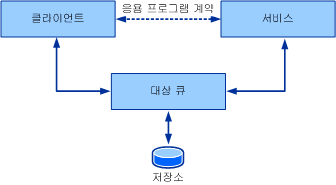
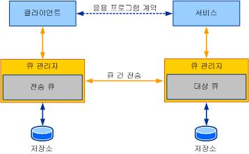

# 큐 개요Queues Overview
이 단원에서는 큐를 사용하는 통신의 일반 개념과 핵심 개념을 소개합니다.This section introduces the general and core concepts behind queued communication. 뒤의 단원에서는 여기서 설명한 큐의 개념이 [!INCLUDE[indigo1](../../../../includes/indigo1-md.md)]에서 명시되는 방법에 대해 자세히 설명합니다.Subsequent sections go into details about how the queuing concepts described here are manifested in [!INCLUDE[indigo1](../../../../includes/indigo1-md.md)].  
  
## 기본 큐 개념Basic Queuing Concepts  
 분산 응용 프로그램을 디자인하는 경우 서비스와 클라이언트 사이의 통신에 적합한 전송을 선택하는 것이 중요합니다.When designing a distributed application, choosing the right transport for communication between services and clients is important. 사용되는 전송의 종류는 몇 가지 요소에 따라 달라집니다.Several factors affect the kind of transport to use. 한 가지 중요한 요소(서비스와 클라이언트 및 전송 사이의 격리)에 따라 대기 중인 전송이나 TCP 또는 HTTP와 같은 직접 전송 사용 여부가 결정됩니다.One important factor—isolation between the service, the client, and the transport—determines use of a queued transport or a direct transport, such as TCP or HTTP. TCP 및 HTTP와 같은 직접 전송의 특성 상 서비스나 클라이언트의 기능이 중지되거나 네트워크 장애가 발생하면 통신이 완전히 중지됩니다.Due to the nature of direct transports such as TCP and HTTP, communication stops altogether if the service or the client stop functioning or if the network fails. 응용 프로그램이 작동하려면 서비스, 클라이언트 및 네트워크가 동시에 실행되고 있어야 합니다.The service, the client, and the network must be running at the same time for the application to work. 대기 중인 전송에서는 격리 기능을 제공하기 때문에 서비스나 클라이언트가 실패하거나 그 사이의 통신 연결이 실패해도 클라이언트와 서비스가 계속 작동할 수 있습니다.Queued transports provide isolation, which means that if the service or client fail or if communication links between them fail, the client and service can continue to function.  
  
 큐를 사용하면 통신 당사자나 네트워크에 오류가 발생해도 안정적인 통신을 제공할 수 있습니다.Queues provide reliable communication even with failures in the communicating parties or the network. 큐에서는 통신 당사자 사이에 교환되는 메시지를 캡처하고 배달합니다.Queues capture and deliver messages exchanged between the communicating parties. 큐는 보통 저장소에 백업되며, 이 때 저장소는 지속적일 수도 있고 일시적일 수도 있습니다.Queues are typically backed by some kind of a store, which can be volatile or durable. 큐는 서비스를 대신하여 클라이언트에서 오는 메시지를 저장했다가 나중에 서비스에 전달합니다.Queues store messages from a client on behalf of a service and later forward these messages to the service. 간접 참조 큐를 사용하면 어느 쪽의 오류에 대해서도 격리를 보장할 수 있기 때문에 고가용성 시스템 및 연결이 끊긴 서비스에서 이 방법이 기본 통신 메커니즘으로 사용됩니다.The indirection queues provide ensured isolation of failure by either party, thus making it the preferred communication mechanism for high-availability systems and disconnected services. 간접 참조에는 대기 시간이 길어진다는 단점이 있습니다.The indirection comes with the cost of high latency. *대기 시간* 는 서비스에서 받을 시간과 클라이언트가 메시지를 보낼 시간 사이의 시간 지연입니다.*Latency* is the time delay between the time the client sends a message and the time the service receives it. 즉, 메시지를 보내고 나면 메시지가 언제 처리되는지 알 수 없습니다.This means that once a message is sent, you do not know when that message may be processed. 큐를 사용하는 대부분의 응용 프로그램은 대기 시간이 긴 편입니다.Most queued applications cope with high latency. 다음 그림에서는 대기 중인 통신의 개념적 모델을 보여 줍니다.The following illustration shows a conceptual model of queued communication.  
  
   
  
 대기 중인 통신 개념적 모델Queued communication conceptual model  
  
 실제로 큐는 분산된 개념입니다.In reality, the queue is a distributed concept. 따라서 한 쪽에 로컬일 수도 있고 양쪽 모두에 원격일 수도 있습니다.As such, they can be local to either party or remote to both parties. 일반적으로 큐는 서비스에 로컬입니다.Typically, the queue is local to the service. 이 구성에서 클라이언트를 지속적으로 사용하기 위해서는 원격 큐에 대한 연결에 의존할 수가 없습니다.In this configuration, the client cannot depend on connectivity to the remote queue to be constantly available. 마찬가지로, 큐는 큐에서 읽는 서비스의 가용성과는 독립적으로 사용할 수 있어야 합니다.Similarly, the queue must be available independent of the availability of the service reading from the queue. 큐 관리자에서는 큐 컬렉션을 관리합니다.A queue manager manages a collection of queues. 여기서는 다른 큐 관리자로부터 이 큐로 보낸 메시지를 받습니다.It is responsible for accepting messages sent to its queues from other queue managers. 또한 원격 큐에 대한 연결을 관리하고 그런 원격 큐로 메시지를 전달하는 작업도 담당합니다.It is also responsible for managing connectivity to remote queues and transferring messages to those remote queues. 클라이언트 또는 서비스 응용 프로그램이 실패해도 큐의 가용성을 보장할 수 있도록, 큐 관리자는 일반적으로 외부 서비스로 실행됩니다.To ensure availability of queues despite client or service application failures, the queue manager is typically run as an external service.  
  
 클라이언트에서 큐로 메시지를 보내면 큐에서는 서비스의 큐 관리자에서 관리하는 대상 큐에 메시지를 지정합니다.When a client sends a message to a queue, it addresses the message to the target queue, which is the queue managed by the service's queue manager. 클라이언트의 큐 관리자에서는 메시지를 전송 큐(또는 나가는 큐)로 보냅니다.The queue manager on the client sends the message to a transmission (or outgoing) queue. 전송 큐는 클라이언트 큐 관리자에서 대상 큐로 전송할 메시지를 저장하는 큐입니다.The transmission queue is a queue on the client queue manager that stores messages for transmission to the target queue. 큐 관리자에서는 대상 큐를 소유한 큐 관리자의 경로를 찾은 다음 메시지를 전송합니다.The queue manager then finds a path to the queue manager that owns the target queue and transfers the message to it. 안정적인 통신을 수행하려면 큐 관리자에서 안정적인 전송 프로토콜을 구현하여 데이터 손실을 방지해야 합니다.To ensure reliable communication, the queue managers implement a reliable transfer protocol to prevent data loss. 대상 큐 관리자에서는 자신이 소유한 대상 큐에 지정된 메시지를 받아 메시지를 저장합니다.The destination queue manager accepts messages addressed to the target queues it owns and stores the messages. 서비스에서 대상 큐로부터 읽기를 수행하는 요청을 보내면 큐 관리자에서 메시지를 대상 응용 프로그램에 배달합니다.The service makes requests to read from the target queue, at which time the queue manager then delivers the message to the destination application. 다음 그림에서는 4자 사이의 통신을 보여 줍니다.The following illustration shows communication between the four parties.  
  
   
  
 일반적인 배포에서의 대기 중인 통신 시나리오Queued communication in a typical deployment scenario  
  
 따라서 큐 관리자는 발신자와 수신자가 실제 통신에 영향을 주지 않고 독립적으로 실패하는 데 필요한 격리를 제공합니다.Thus, the queue manager provides the required isolation so that the sender and receiver can independently fail without affecting actual communication. 큐에서 제공하는 추가 간접 참조의 장점에는 여러 응용 프로그램 인스턴스가 같은 큐에서 읽을 수 있기 때문에 노드 사이의 파밍을 통해 처리량을 더 높일 수 있다는 것이 있습니다.The benefit of extra indirection that queues provide also enables multiple application instances to read from the same queue, so that farming work among the nodes achieves higher throughput. 따라서 큐를 사용하여 더 높은 규모 및 처리량 요구 사항을 달성하는 경우도 많습니다.Therefore, it is not uncommon to see queues being used to achieve higher scale and throughput requirements.  
  
## 큐 및 트랜잭션Queues and Transactions  
 트랜잭션을 사용하면 일련의 작업을 그룹으로 묶어 한 작업이 실패하면 모든 작업이 실패하게 만들 수 있습니다.Transactions allow you to group a set of operations together so that if one operation fails, all of the operations fail. 트랜잭션을 사용하는 방법의 예로는 ATM을 통해 저축예금 계정에서 당좌예금 계정으로 $1,000를 이체하는 경우가 있습니다.An example of how to use transactions is when a person uses an ATM to transfer $1,000 from his savings account to his checking account. 여기에는 다음 작업이 필요합니다.This entails the following operations:  
  
-   저축예금 계정에서 $1,000를 출금합니다.Withdrawing $1,000 from the savings account.  
  
-   당좌계금 계정에 $1,000를 입금합니다.Depositing $1,000 into the checking account.  
  
 첫 번째 작업이 성공해서 저축예금 계정에서 $1,000가 출금되었는데 두 번째 작업이 실패하면 저축예금 계정에서 이미 출금된 $1,000가 손실됩니다.If the first operation succeeds and $1,000 is withdrawn from the savings account but the second operation fails, the $1,000 is lost because it has already been withdrawn from the savings account. 계정을 유효한 상태로 유지하려면 한 작업이 실패했을 때 두 작업이 모두 실패해야 합니다.To keep the accounts in a valid state, if one operation fails, both operations must fail.  
  
 트랜잭션 메시징에서는 메시지를 큐에 보냈다가 트랜잭션으로 큐에서 받을 수 있습니다.In transactional messaging, messages can be sent to the queue and received from the queue under a transaction. 따라서 트랜잭션으로 메시지를 보낸 후 트랜잭션이 롤백되면 메시지를 큐에 아예 보내지 않은 것과 같은 결과를 얻습니다.Thus, if a message is sent in a transaction and the transaction is rolled back, then the outcome is as if the message had never been sent to the queue. 마찬가지로 트랜잭션에서 메시지를 받은 후 트랜잭션이 롤백되면 메시지를 아예 받지 않은 것과 같은 결과를 얻습니다.Similarly if a message is received in a transaction and the transaction is rolled back, then the outcome is as if the message had never been received. 메시지는 읽을 수 있는 상태로 큐에 남습니다.The message remains in the queue to be read.  
  
 대기 시간이 길기 때문에 메시지를 보낸 후에 대상 큐에 도달하는 데 걸리는 시간을 알 수도 없고, 서비스에서 메시지를 처리하는 데 걸리는 시간도 알 수 없습니다.Because of high latency, when you send a message you have no way of knowing how long it takes to reach its target queue, nor do you know how long it takes for the service to process the message. 그렇기 때문에 단일 트랜잭션에 메시지 보내기, 메시지 받기 및 메시지 처리를 모두 맡기는 것은 좋지 않습니다.Because of this, you do not want to use a single transaction to send the message, receive the message, and then process the message. 그러면 무기한 커밋되지 않는 트랜잭션이 생성될 수 있습니다.This creates a transaction that is not committed for an indeterminate amount of time. 클라이언트와 서비스가 큐를 통해 트랜잭션을 사용하여 통신하는 경우, 클라이언트에 있는 트랜잭션과 서비스에 있는 트랜잭션의 두 가지가 관련됩니다.When a client and service communicate through a queue using a transaction, two transactions are involved: one on the client and one on the service. 다음 그림에서는 일반적인 대기 중인 통신의 트랜잭션 경계를 나타냅니다.The following illustration shows the transaction boundaries in typical queued communication.  
  
   
  
 캡처 및 배달에 사용되는 별도의 트랜잭션을 나타내는 대기 중인 통신Queued communication showing separate transactions for capture and delivery  
  
 클라이언트 트랜잭션에서는 메시지를 처리하여 보냅니다.The client transaction processes and sends the message. 트랜잭션이 커밋되면 메시지는 전송 큐에 들어갑니다.When the transaction is committed, the message is in the transmission queue. 서비스에서 트랜잭션은 대상 큐에서 메시지를 읽고 메시지를 처리한 다음 트랜잭션을 커밋합니다.On the service, the transaction reads the message from the target queue, processes the message, and then commits the transaction. 처리 중에 오류가 발생하면 메시지가 롤백되어 대상 큐에 들어갑니다.If an error occurs during the processing, the message is rolled back and placed in the target queue.  
  
## 큐를 사용하는 비동기 통신Asynchronous Communication Using Queues  
 큐를 사용하면 비동기적인 방법으로 통신을 수행할 수 있습니다.Queues provide an asynchronous means of communication. 큐 관리자의 대기 시간이 길기 때문에 큐를 사용하여 메시지를 보내는 응용 프로그램에서는 수신기에서 메시지를 받아 처리하는 동안 기다릴 수가 없습니다.Applications that send messages using queues cannot wait for the message to be received and processed by the receiver because of high latency introduced by the queue manager. 메시지가 응용 프로그램에서 의도한 것보다 훨씬 오래 큐에 남을 수가 있습니다.Messages can remain in the queue for a far longer time than the application intended. 이러한 상황을 방지하기 위해 응용 프로그램에서 메시지에 TTL(Time-To-Live) 값을 지정할 수 있습니다.To avoid this, the application can specify a Time-To-Live value on the message. 이 값은 전송 큐에 메시지가 남아 있어야 할 기간을 지정합니다.This value specifies how long the message should remain in the transmission queue. 이 시간 값이 초과되었는데 메시지가 보내지 않은 상태로 대상 큐에 남아 있는 경우 메시지를 배달 못한 편지 큐로 전송할 수 있습니다.If this time value is exceeded, and the message still has not been sent to the target queue, the message can be transferred to a dead-letter queue.  
  
 발신자가 메시지를 보내는 경우 보내기 작업에서 오는 반환 값을 통해서는 메시지가 발신자의 전송 큐에 가기만 한 것을 알 수 있습니다.When the sender sends a message, the return from the send operation implies that the message only made it to the transmission queue on the sender. 그렇기 때문에 메시지를 대상 큐로 가져가는 중에 오류가 발생한 경우에는 보내는 응용 프로그램에서 그 사실을 즉시 알 수가 없습니다.As such, if there is a failure in getting the message to the target queue, the sending application cannot know about it immediately. 그러한 오류에 대해 알리기 위해, 실패한 메시지는 배달 못한 편지 큐로 전송됩니다.To take note of such failures, the failed message is transferred to a dead-letter queue.  
  
 메시지가 대상 큐에 도달하지 못하거나 TTL(Time-To-Live)이 만료되는 등의 오류가 발생하는 경우 오류는 별도로 처리해야 합니다.Any error, such as a message failing to reach the target queue or the Time-To-Live expiring, must be processed separately. 따라서 대기 중인 응용 프로그램에서 다음 두 가지의 논리 집합을 기록하는 경우가 종종 발생합니다.It is not uncommon, therefore, for queued applications to write two sets of logic:  
  
-   하나는 메시지를 보내고 받는 보통의 클라이언트 및 서비스 논리입니다.The normal client and service logic of sending and receiving messages.  
  
-   실패한 전송 또는 배달의 메시지를 처리하기 위한 보정 논리입니다.Compensation logic to handle messages from the failed transmission or delivery.  
  
 뒤의 단원에서는 이러한 개념에 대해 설명합니다.The following sections discuss these concepts.  
  
## 배달 못한 편지 큐 프로그래밍Dead-Letter Queue Programming  
 배달 못한 편지 큐에는 여러 이유로 대상 큐에 도달하지 못한 메시지가 포함됩니다.Dead-letter queues contain messages that failed to reach the target queue for various reasons. 만료된 메시지에서 대상 큐에 대한 메시지 전송을 막는 연결 문제에 이르기까지, 이유는 다양합니다.The reasons can range from expired messages to connectivity issues preventing transfer of the message to the target queue.  
  
 일반적으로 응용 프로그램에서는 시스템 수준 배달 못한 편지 큐로부터 메시지를 읽고 문제를 파악한 다음 오류를 수정하고 메시지를 다시 보내거나 관련 참고를 기록하는 등의 적절한 작업을 수행할 수 있습니다.Typically, an application can read messages from a system-wide dead-letter queue, determine what went wrong, and take appropriate action, such as correcting the errors and resending the message or taking note of it.  
  
## 포이즌 메시지 큐 프로그래밍Poison Message Queue Programming  
 메시지가 대상 큐에 도달한 후에 서비스에서 메시지의 처리에 반복적으로 실패하는 경우가 있을 수 있습니다.After a message makes it to the target queue, the service may repeatedly fail to process the message. 응용 프로그램에서 트랜잭션의 큐로부터 메시지를 읽는데, 데이터베이스를 업데이트할 때 일시적으로 데이터베이스 연결이 끊기는 경우가 있습니다.For example, an application reading a message from the queue under a transaction and updating a database may find the database temporarily disconnected. 이 경우 트랜잭션이 롤백되고 새 트랜잭션이 만들어진 다음 큐에서 메시지를 다시 읽습니다.In this case, the transaction is rolled back, a new transaction is created, and the message is reread from the queue. 두 번째 시도에 성공할 수도 있고 실패할 수도 있습니다.A second attempt may succeed or fail. 오류의 원인에 따라 응용 프로그램에 대한 메시지 배달이 반복적으로 실패할 수 있습니다.In some cases, depending on the cause of the error, the message may repeatedly fail delivery to the application. 이 경우 메시지를 "포이즌"으로 취급합니다.In this case, the message is deemed as "poison." 그러한 메시지는 포이즌 처리 응용 프로그램에서 읽을 수 있는 포이즌 큐로 이동합니다.Such messages are moved to a poison queue that can be read by a poison-handling application.  
  
## 참고 항목See Also  
 [WCF의 큐Queuing in WCF](../../../../docs/framework/wcf/feature-details/queuing-in-wcf.md)  
 [WCF의 큐Queuing in WCF](../../../../docs/framework/wcf/feature-details/queuing-in-wcf.md)  
 [세션 및 큐Sessions and Queues](../../../../docs/framework/wcf/samples/sessions-and-queues.md)  
 [배달 못 한 편지 큐Dead Letter Queues](../../../../docs/framework/wcf/samples/dead-letter-queues.md)  
 [일시 대기 통신Volatile Queued Communication](../../../../docs/framework/wcf/samples/volatile-queued-communication.md)  
 [메시지 큐에 Windows Communication FoundationWindows Communication Foundation to Message Queuing](../../../../docs/framework/wcf/samples/wcf-to-message-queuing.md)  
 [메시지 큐 (MSMQ) 설치Installing Message Queuing (MSMQ)](../../../../docs/framework/wcf/samples/installing-message-queuing-msmq.md)  
 [메시지 큐 통합 바인딩 예제Message Queuing Integration Binding Samples](http://msdn.microsoft.com/en-us/997d11cb-f2c5-4ba0-9209-92843d4d0e1a)  
 [Windows Communication Foundation로 메시지 큐Message Queuing to Windows Communication Foundation](../../../../docs/framework/wcf/samples/message-queuing-to-wcf.md)  
 [메시지 큐에 대 한 메시지 보안Message Security over Message Queuing](../../../../docs/framework/wcf/samples/message-security-over-message-queuing.md)
