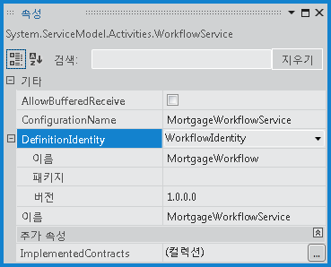

# WorkflowServiceHost에서 Side-by-side 버전 관리
[!INCLUDE[net_v45](../../../../includes/net-v45-md.md)]에 소개된 <xref:System.ServiceModel.Activities.WorkflowServiceHost> side\-by\-side 버전 관리는 단일 끝점에서 여러 버전의 워크플로 서비스를 호스팅하는 기능을 제공합니다.  제공된 side\-by\-side 기능을 사용하여 워크플로 서비스를 구성할 수 있습니다. 그러면 기존 정의를 사용하여 실행 중인 인스턴스를 완료하는 동시에, 새 워크플로 정의를 사용하여 워크플로 서비스의 새 인스턴스를 만들 수 있습니다.  이 항목에서는 <xref:System.ServiceModel.Activities.WorkflowServiceHost>를 사용하는 워크플로 서비스 side\-by\-side 실행에 대해 대략적으로 설명합니다.  
  
> [!NOTE]
>  샘플을 다운로드하고 워크플로 서비스 Side\-by\-Side 버전 관리 연습 비디오를 시청하려면 [웹 호스팅 Xamlx 워크플로 서비스를 사용한 Side\-by\-Side 버전 관리](http://go.microsoft.com/fwlink/?LinkId=393746)를 참조하세요.  
  
## 워크플로 서비스에서 여러 버전 호스팅  
 <xref:System.ServiceModel.Activities.WorkflowServiceHost>에는 여러 버전의 워크플로를 동시에 실행\(Side\-by\-Side 실행\)하도록 구성할 수 있는 두 가지 속성, <xref:System.ServiceModel.Activities.WorkflowServiceHost.SupportedVersions%2A> 및 <xref:System.ServiceModel.Activities.WorkflowService.DefinitionIdentity%2A>가 있습니다.  <xref:System.ServiceModel.Activities.WorkflowServiceHost.SupportedVersions%2A>에는 지원되는 워크플로 서비스 버전이 포함되어 있으며, <xref:System.ServiceModel.Activities.WorkflowService.DefinitionIdentity%2A>를 사용하여 각 워크플로 서비스를 고유하게 식별합니다.  이 작업은 <xref:System.Activities.WorkflowIdentity>를 워크플로 서비스와 연결하여 수행합니다.  <xref:System.Activities.WorkflowIdentity>에는 세 가지 식별 정보가 포함되어 있습니다.  필수 요소인 <xref:System.Activities.WorkflowIdentity.Name%2A> 및 <xref:System.Activities.WorkflowIdentity.Version%2A>에는 이름과 <xref:System.Version>이 포함되며, 선택적인 <xref:System.Activities.WorkflowIdentity.Package%2A>는 어셈블리 이름 등의 정보나 원하는 다른 정보를 포함하는 추가 문자열을 지정하는 데 사용할 수 있습니다.  <xref:System.ServiceModel.Activities.WorkflowServiceHost.SupportedVersions%2A> 컬렉션에 포함된 각 워크플로 서비스의 <xref:System.Activities.WorkflowIdentity>는 고유해야 합니다.  세 개의 속성 중 하나라도 다른 <xref:System.Activities.WorkflowIdentity>와 다르면 <xref:System.Activities.WorkflowIdentity>가 고유한 것으로 간주됩니다.  `null` <xref:System.Activities.WorkflowIdentity>는 <xref:System.ServiceModel.Activities.WorkflowService.DefinitionIdentity%2A>에 대해 허용 가능한 값이지만, 이전 버전의 워크플로 서비스 중 하나만 `null` <xref:System.Activities.WorkflowIdentity>를 가질 수 있습니다.  
  
> [!IMPORTANT]
>  <xref:System.Activities.WorkflowIdentity>에는 어떠한 PII\(개인적으로 식별할 수 있는 정보\)도 포함해서는 안 됩니다.  <xref:System.Activities.WorkflowIdentity>는 <xref:System.Activities.WorkflowIdentity.Name%2A>\(<xref:System.String>\), <xref:System.Activities.WorkflowIdentity.Version%2A>\(<xref:System.Version>\), 및 <xref:System.Activities.WorkflowIdentity.Package%2A>\(<xref:System.String>\)로 구성됩니다.  인스턴스를 만드는 데 사용되는 <xref:System.Activities.WorkflowIdentity>에 대한 정보는 활동 수명 주기의 여러 시점에 런타임에 의해 구성된 추적 서비스로 내보내집니다.  WF 추적 기능에는 중요한 사용자 데이터인 PII를 숨기는 메커니즘이 없습니다.  따라서 <xref:System.Activities.WorkflowIdentity> 인스턴스는 런타임에 의해 추적 레코드에 내보내져 추적 레코드를 볼 수 있는 권한이 있는 사람에게 표시될 수 있기 때문에 이 인스턴스에 PII 데이터가 포함되어서는 안 됩니다.  
  
### 워크플로 서비스의 여러 버전 호스팅에 대한 규칙  
 사용자가 <xref:System.ServiceModel.Activities.WorkflowServiceHost>에 추가 버전을 추가할 경우 동일한 끝점 및 설명 집합을 사용하여 워크플로 서비스를 호스팅하려면 몇 가지 조건을 충족해야 합니다.  추가 버전 중 하나라도 이러한 조건을 충족하지 못하면 `Open`이 호출될 때 <xref:System.ServiceModel.Activities.WorkflowServiceHost>에서 예외를 throw합니다.  호스트에 추가 버전으로 제공된 각 워크플로 정의는 다음 요구사항을 충족해야 합니다\(주 버전은 호스트 생성자에 제공된 워크플로 서비스 정의임\).  추가 워크플로 버전은 다음 조건을 충족해야 합니다.  
  
-   워크플로 서비스의 주 버전과 <xref:System.ServiceModel.Activities.WorkflowService.Name%2A>이 동일해야 합니다.  
  
-   <xref:System.ServiceModel.Activities.WorkflowService.Body%2A>에 주 버전에 없는 <xref:System.ServiceModel.Activities.Receive> 또는 <xref:System.ServiceModel.Activities.SendReply> 작업이 없어야 하며 작업 계약과 일치해야 합니다.  
  
-   고유한 <xref:System.ServiceModel.Activities.WorkflowService.DefinitionIdentity%2A>가 있어야 합니다.  하나의 워크플로 정의만 `null` <xref:System.ServiceModel.Activities.WorkflowService.DefinitionIdentity%2A>를 가질 수 있습니다.  
  
 일부 변경 내용은 허용됩니다.  다음 항목은 버전간 다를 수 있습니다.  
  
-   <xref:System.ServiceModel.Activities.WorkflowService.DefinitionIdentity%2A>는 주 버전과 Name 및 Package가 다를 수 있습니다.  
  
-   <xref:System.ServiceModel.Activities.WorkflowService.AllowBufferedReceive%2A> 값은 주 버전과 다를 수 있습니다.  
  
-   <xref:System.ServiceModel.Activities.WorkflowService.ConfigurationName%2A>은 주 버전과 다를 수 있습니다.  
  
-   <xref:System.ServiceModel.Activities.WorkflowService.ImplementedContracts%2A>은 주 버전과 다를 수 있습니다.  
  
### DefinitionIdentity 구성  
 워크플로 디자이너를 사용하여 워크플로 서비스를 만들 경우 **속성** 창을 사용하여 <xref:System.ServiceModel.Activities.WorkflowService.DefinitionIdentity%2A>를 설정합니다.  디자이너에서 서비스의 루트 활동 밖을 클릭하여 워크플로 서비스를 선택한 다음 **보기** 메뉴에서 **속성 창**을 선택합니다.  **DefinitionIdentity** 속성 옆에 나타나는 드롭다운 목록에서 **WorkflowIdentity**를 선택한 다음 원하는 <xref:System.Activities.WorkflowIdentity> 속성을 확장 및 지정합니다.  다음 예제에서는 <xref:System.Activities.WorkflowIdentity.Name%2A> `MortgageWorkflow` 및 `1.0.0.0`의 <xref:System.Activities.WorkflowIdentity.Version%2A>을 사용하여 <xref:System.ServiceModel.Activities.WorkflowService.DefinitionIdentity%2A>를 구성합니다.  <xref:System.Activities.WorkflowIdentity.Package%2A>는 선택 사항이며 이 예에서는 `null`입니다.  
  
   
  
 워크플로 서비스가 자체 호스팅된 경우 워크플로 서비스가 생성되면 <xref:System.ServiceModel.Activities.WorkflowService.DefinitionIdentity%2A>가 구성됩니다.  다음 예제에서는 이전 예제와 같은 값, <xref:System.Activities.WorkflowIdentity.Name%2A> `MortgageWorkflow` 및 `1.0.0.0`의 <xref:System.Activities.WorkflowIdentity.Name%2A>을 사용하여 <xref:System.ServiceModel.Activities.WorkflowService.DefinitionIdentity%2A>를 구성합니다.  
  
```csharp  
WorkflowService service = new WorkflowService  
{  
    Name = "MortgageWorkflowService",  
    Body = new MortgageWorkflow(),  
    DefinitionIdentity = new WorkflowIdentity  
    {  
        Name = "MortgageWorkflow",  
        Version = new Version(1, 0, 0, 0)  
    }  
};  
  
```  
  
```vb  
Dim service As New WorkflowService  
With service  
    .Name = "MortgageWorkflowService"  
    .Body = New MortgageWorkflow  
    .DefinitionIdentity = New WorkflowIdentity With _  
    { _  
        .Name = "MortgageWorkflow", _  
        .Version = New Version(1, 0, 0, 0) _  
    }  
End With  
```  
  
 한 버전의 워크플로 서비스만 **null** <xref:System.ServiceModel.Activities.WorkflowService.DefinitionIdentity%2A>를 가질 수 있지만 <xref:System.ServiceModel.Activities.WorkflowService.DefinitionIdentity%2A>는 필수가 아닙니다.  
  
> [!NOTE]
>  이는 최초에 <xref:System.ServiceModel.Activities.WorkflowService.DefinitionIdentity%2A>를 구성하지 않고 서비스를 구성한 다음 업데이트된 버전을 만들 경우 유용합니다.  
  
### 웹 호스팅된 워크플로 서비스에 새 버전 추가  
 웹 호스팅된 서비스에 새 버전의 워크플로 서비스를 구성할 때 첫 번째 단계는 서비스 파일과 이름이 동일한 `App_Code` 폴더에 새 폴더를 만드는 것입니다.  서비스의 `xamlx` 파일 이름이 `MortgageWorkflow.xamlx`인 경우 폴더 이름을 `MortgageWorkflow`로 지정해야 합니다.  원본 서비스의 `xamlx` 파일의 사본을 이 폴더에 넣은 다음 `MortgageWorkflowV1.xamlx`와 같은 새 이름으로 이름을 바꿉니다.  기본 서비스를 원하는 대로 변경하고 <xref:System.ServiceModel.Activities.WorkflowService.DefinitionIdentity%2A>를 업데이트한 다음 서비스를 배포합니다.  다음 예제에서는 `MortageWorkflow`의 <xref:System.Activities.WorkflowIdentity.Name%2A> 및 `2.0.0.0`의 <xref:System.Activities.WorkflowIdentity.Version%2A>을 사용하여 <xref:System.ServiceModel.Activities.WorkflowService.DefinitionIdentity%2A>를 업데이트하였습니다.  
  
   
  
 서비스가 다시 시작되면 이전 버전이 지정된 `App_Code` 하위 폴더에 위치하므로 <xref:System.ServiceModel.Activities.WorkflowServiceHost.SupportedVersions%2A> 컬렉션에 자동으로 추가됩니다.  워크플로 서비스의 주 버전에 `null` <xref:System.ServiceModel.Activities.WorkflowService.DefinitionIdentity%2A>가 있으면 이전 버전이 추가되지 않습니다.  한 버전에 `null` <xref:System.ServiceModel.Activities.WorkflowService.DefinitionIdentity%2A>가 있을 수는 있지만, 복수 버전이 있는 경우 `null` <xref:System.ServiceModel.Activities.WorkflowService.DefinitionIdentity%2A>가 포함된 기본 버전은 허용되지 않습니다. 그렇지 않으면 이전 버전이 <xref:System.ServiceModel.Activities.WorkflowServiceHost.SupportedVersions%2A> 컬렉션에 추가되지 않습니다.  
  
### 자체 호스팅된 워크플로 서비스에 새 버전 추가  
 자체 호스팅된 워크플로 서비스에 새 버전을 추가하면 워크플로 서비스의 기본 버전으로 <xref:System.ServiceModel.Activities.WorkflowServiceHost>가 구성되며, 이전 버전은 <xref:System.ServiceModel.Activities.WorkflowServiceHost.SupportedVersions%2A> 컬렉션에 명시적으로 추가해야 합니다.  다음 예제에서는 `MortgageWorkflowV2` 워크플로 정의를 사용하는 기본 워크플로 서비스를 사용하여 <xref:System.ServiceModel.Activities.WorkflowServiceHost>를 구성하고 `MortgageWorkflowV1` 워크플로 정의를 사용하여 구성된 워크플로 서비스가 <xref:System.ServiceModel.Activities.WorkflowServiceHost.SupportedVersions%2A> 컬렉션에 추가됩니다.  각 워크플로 서비스는 워크플로 정의 버전을 나타내는 고유한 <xref:System.ServiceModel.Activities.WorkflowService.DefinitionIdentity%2A>를 사용하여 구성됩니다.  
  
```csharp  
// Create the primary version of the workflow service.  
WorkflowService serviceV2 = new WorkflowService  
{  
    Name = "MortgageWorkflowService",  
    Body = new MortgageWorkflowV2(),  
    DefinitionIdentity = new WorkflowIdentity  
    {  
        Name = "MortgageWorkflow",  
        Version = new Version(2, 0, 0, 0)  
    }  
};  
  
// Configure the WorkflowServiceHost with the current version  
// of the workflow service. This code requires Administrator  
// privileges to function correctly. If running from Visual  
// Studio, Visual Studio must be run with Administrator privileges.  
WorkflowServiceHost host = new WorkflowServiceHost(serviceV2,   
    new Uri("http://localhost:8080/MortgageWorkflowService"));  
  
// Create the previous version of the workflow service.  
WorkflowService serviceV1 = new WorkflowService  
{  
    Name = "MortgageWorkflowService",  
    Body = new MortgageWorkflowV1(),  
    DefinitionIdentity = new WorkflowIdentity  
    {  
        Name = "MortgageWorkflow",  
        Version = new Version(1, 0, 0, 0)  
    }  
};  
  
// Add the previous version of the service to the SupportedVersions collection.  
host.SupportedVersions.Add(serviceV1);  
  
```  
  
```vb  
'Create the primary version of the workflow service  
Dim serviceV2 As New WorkflowService  
With serviceV2  
    .Name = "MortgageWorkflowService"  
    .Body = New MortgageWorkflowV2  
    .DefinitionIdentity = New WorkflowIdentity With _  
    { _  
        .Name = "MortgageWorkflow", _  
        .Version = New Version(2, 0, 0, 0) _  
    }  
End With  
  
'Configure the WorkflowServiceHost with the current version  
'of the workflow service. This code requires Administrator  
'privileges to function correctly. If running from Visual  
'Studio, Visual Studio must be run with Administrator privileges.  
  
Dim host As New WorkflowServiceHost(serviceV2, _  
    New Uri("http://localhost:8080/MortgageWorkflowService"))  
  
'Create the previous version of the workflow service.  
Dim serviceV1 As New WorkflowService  
With serviceV1  
    .Name = "MortgageWorkflowService"  
    .Body = New MortgageWorkflowV1  
    .DefinitionIdentity = New WorkflowIdentity With _  
    { _  
        .Name = "MortgageWorkflow", _  
        .Version = New Version(1, 0, 0, 0) _  
    }  
End With  
  
'Add the previous version of the service to the SupportedVersions collection.  
host.SupportedVersions.Add(serviceV1)  
```