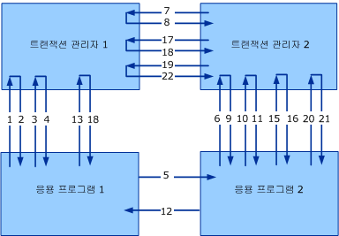

# <a name="transaction-protocols"></a>트랜잭션 프로토콜
Windows Communication Foundation (WCF) Ws-atomic Transaction 및 Ws-coordination 프로토콜을 구현 합니다.  
  
|사양/문서|버전|링크|  
|-----------------------------|-------------|----------|  
|WS-Coordination|1.0<br /><br /> 1.1|[http://go.microsoft.com/fwlink/?LinkId=96104](http://go.microsoft.com/fwlink/?LinkId=96104)<br /><br /> [http://go.microsoft.com/fwlink/?LinkId=96079](http://go.microsoft.com/fwlink/?LinkId=96079)|  
|WS-AtomicTransaction|1.0<br /><br /> 1.1|[http://go.microsoft.com/fwlink/?LinkId=96080](http://go.microsoft.com/fwlink/?LinkId=96080)<br /><br /> http://go.microsoft.com/fwlink/?LinkId=96081|  
  
 이러한 프로토콜 사양에서의 상호 운용성은 응용 프로그램 간 및 트랜잭션 관리자 간 이렇게 두 가지 수준에서 필요합니다(다음 그림 참조) 사양은 두 가지 수준의 상호 운용성을 위한 메시지 형식 및 메시지 교환을 상세하게 설명합니다. 응용 프로그램 간의 교환을 위한 보안, 안정성 및 인코딩은 일반적인 응용 프로그램 교환을 위해 수행되는 것과 같은 방식으로 적용됩니다. 그러나 트랜잭션 관리자 간의 상호 운용성을 위해서는 특정한 바인딩에 대한 동의가 필요합니다. 이러한 부분은 일반적으로 사용자가 구성하지 않기 때문입니다.  
  
 이 항목에서는 WS-AT(WS-Atomic Transaction) 사양과 보안의 조합에 대해 설명하고, 트랜잭션 관리자 간 통신을 위해 사용하는 보안이 설정된 바인딩에 대해 설명합니다. 이 문서에서 설명하는 방식은 IBM, IONA, Sun Microsystems 등에서 WS-AT 및 WS-Coordination의 다른 구현과 함께 성공적으로 테스트되었습니다.  
  
 다음 그림에서는 두 개의 트랜잭션 관리자(트랜잭션 관리자 1, 트랜잭션 관리자 2)와 두 개의 응용 프로그램(응용 프로그램 1, 응용 프로그램 2) 간의 상호 운용성에 대해 설명합니다.  
  
   
  
 한 명의 개시자(I)와 한 명의 참가자(P)가 있는 일반적인 WS-Coordination/WS-Atomic Transaction 시나리오를 예로 들어 봅니다. 개시자와 참가자는 둘 다 트랜잭션 관리자(각각 ITM과 PTM)를 가집니다. 이 항목에서는 2단계 커밋을 2PC라고 합니다.  
  
|||  
|-|-|  
|1. CreateCoordinationContext|12. 응용 프로그램 메시지 응답|  
|2. CreateCoordinationContextResponse|13. 커밋(완료)|  
|3. 등록(완료)|14. 준비(2PC)|  
|4. RegisterResponse|15. 준비(2PC)|  
|5. 응용 프로그램 메시지|16. 준비됨(2PC)|  
|6. CreateCoordinationContext와 Context|17. 준비됨(2PC)|  
|7. 등록(지속적)|18. 커밋됨(완료)|  
|8. RegisterResponse|19. 커밋(2PC)|  
|9. CreateCoordinationContextResponse|20. 커밋(2PC)|  
|10. 등록(지속적)|21. 커밋됨(2PC)|  
|11. RegisterResponse|22. 커밋됨(2PC)|  
  
 이 문서에서는 WS-AtomicTransaction 사양과 보안의 조합에 대해 설명하고, 트랜잭션 관리자 간 통신을 위해 사용하는 보안이 설정된 바인딩에 대해 설명합니다. 이 문서에서 설명하는 방식은 WS-AT 및 WS-Coordination의 다른 구현과 함께 성공적으로 테스트되었습니다.  
  
 그림과 표에서는 보안의 관점에서 메시지에 대한 4가지 클래스를 보여 줍니다.  
  
-   활성화 메시지(CreateCoordinationContext 및 CreateCoordinationContextResponse)  
  
-   등록 메시지(Register 및 RegisterResponse)  
  
-   프로토콜 메시지(준비, 롤백, 커밋, 중단 등)  
  
-   응용 프로그램 메시지  
  
 처음 세 개의 메시지 클래스는 트랜잭션 관리자 메시지로 간주되며, 해당 바인딩 구성은 이 항목의 뒷부분에 있는 "응용 프로그램 메시지 교환"에서 설명합니다. 네 번째 메시지는 응용 프로그램 간 메시지이며, 이 항목의 뒷부분에 있는 "메시지 예제" 단원에서 설명합니다. 이러한 각 클래스에 대 한 WCF에서 사용 되는 프로토콜 바인딩에 대해 설명 합니다.  
  
 다음 XML 네임스페이스 및 관련 접두사는 이 문서 전체에서 사용됩니다.  
  
|접두사|버전|네임스페이스 URI|  
|------------|-------------|-------------------|  
|s11||[http://go.microsoft.com/fwlink/?LinkId=96014](http://go.microsoft.com/fwlink/?LinkId=96014)|  
|wsa|이전 버전 1.0<br /><br /> 1.0|http://www.w3.org/2004/08/addressing<br /><br /> [http://go.microsoft.com/fwlink/?LinkId=96022](http://go.microsoft.com/fwlink/?LinkId=96022)|  
|wscoor|1.0<br /><br /> 1.1|[http://go.microsoft.com/fwlink/?LinkId=96078](http://go.microsoft.com/fwlink/?LinkId=96078)<br /><br /> [http://go.microsoft.com/fwlink/?LinkId=96079](http://go.microsoft.com/fwlink/?LinkId=96079)|  
|wsat|1.0<br /><br /> 1.1|[http://go.microsoft.com/fwlink/?LinkId=96080](http://go.microsoft.com/fwlink/?LinkId=96080)<br /><br /> [http://go.microsoft.com/fwlink/?LinkId=96081](http://go.microsoft.com/fwlink/?LinkId=96081)|  
|t|Pre-1.3<br /><br /> 1.3|[http://go.microsoft.com/fwlink/?LinkId=96082](http://go.microsoft.com/fwlink/?LinkId=96082)<br /><br /> [http://go.microsoft.com/fwlink/?LinkId=96100](http://go.microsoft.com/fwlink/?LinkId=96100)|  
|o||[http://go.microsoft.com/fwlink/?LinkId=96101](http://go.microsoft.com/fwlink/?LinkId=96101)|  
|xsd||[http://go.microsoft.com/fwlink/?LinkId=96102](http://go.microsoft.com/fwlink/?LinkId=96102)|  
  
## <a name="transaction-manager-bindings"></a>트랜잭션 관리자 바인딩  
 R1001: 트랜잭션 관리자가 WS-AT 1.0 트랜잭션에 참가 하 해야 SOAP 1.1과 Ws-addressing 2004/08을 사용 Ws-atomic Transaction 및 Ws-coordination 메시지 교환을 합니다.  
  
 R1002: WS-AT 1.1 트랜잭션에 참여 중인 트랜잭션 관리자는 WS-Atomic Transaction 및 WS-Coordination 메시지 교환을 위해 SOAP 1.1과 WS-Addressing 2005/08을 사용해야 합니다.  
  
 응용 프로그램 메시지는 이러한 바인딩에 제한되지 않으며, 이에 대해서는 나중에 설명합니다.  
  
### <a name="transaction-manager-https-binding"></a>트랜잭션 관리자 HTTPS 바인딩  
 트랜잭션 관리자 HTTPS 바인딩은 전송 보안에만 전적으로 의존하여 보안을 수행하며, 트랜잭션 트리에 있는 각 발신자-수신자 쌍 간의 신뢰를 설정합니다.  
  
#### <a name="https-transport-configuration"></a>HTTPS 전송 구성  
 X.509 인증서는 트랜잭션 관리자 ID를 설정하는 데 사용합니다. 클라이언트/서버 인증이 필요하며, 클라이언트/서버 권한 부여는 구현 정보로 유지됩니다.  
  
-   R1111: 연결을 통해 표시되는 X.509 인증서에는 원래 컴퓨터의 FQDN(정규화된 도메인 이름)과 일치하는 주체 이름이 있어야 합니다.  
  
-   B1112: DNS는 X.509 주체 이름을 확인한 시스템에서 각 발신자-수신자 쌍 간에 작동해야 합니다.  
  
#### <a name="activation-and-registration-binding-configuration"></a>바인딩 구성 활성화 및 등록  
 WCF는 HTTPS를 통한 상관 관계와 함께 요청/회신 이중 바인딩이 필요 합니다. 요청/회신 메시지 교환 패턴의 상관 관계 및 설명에 대한 자세한 내용은 8단원 WS-Atomic Transaction을 참조하십시오.  
  
#### <a name="2pc-protocol-binding-configuration"></a>2PC 프로토콜 바인딩 구성  
 WCF는 HTTPS를 통해 단방향 (데이터 그램) 메시지를 지원합니다. 메시지 간의 상관 관계는 구현 정보로 유지됩니다.  
  
 B1131: 구현에서 지원 해야 `wsa:ReferenceParameters` WCF의 2PC 메시지 상관 관계를 달성 하기 위해 Ws-addressing에서 설명 된 대로 합니다.  
  
### <a name="transaction-manager-mixed-security-binding"></a>트랜잭션 관리자가 혼합된 보안 바인딩  
 이는 ID 설정을 목적으로 WS-Coordination 발급 토큰 모델과 혼합된 전송 보안을 사용하는 대체(혼합 모드) 바인딩입니다. 두 바인딩 간에 다른 요소는 활성화와 등록뿐입니다.  
  
#### <a name="https-transport-configuration"></a>HTTPS 전송 구성  
 X.509 인증서는 트랜잭션 관리자 ID를 설정하는 데 사용합니다. 클라이언트/서버 인증이 필요하며, 클라이언트/서버 권한 부여는 구현 정보로 유지됩니다.  
  
#### <a name="activation-message-binding-configuration"></a>활성화 메시지 바인딩 구성  
 활성화 메시지는 일반적으로 응용 프로그램과 해당 로컬 트랜잭션 관리자 간에 발생하기 때문에 대개 상호 운용성에 관여하지 않습니다.  
  
 B1221: WCF 이중 HTTPS 바인딩을 사용 하 여 (에 설명 된 [메시징 프로토콜](../../../../docs/framework/wcf/feature-details/messaging-protocols.md)) 활성화 메시지에 대 한 합니다. 요청 및 회신 메시지는 WS-AT 1.0용 WS-Addressing 2004/08 및 WS-AT 1.1용 WS-Addressing 2005/08을 사용하여 상호 관련됩니다.  
  
 8단원 WS-Atomic Transaction 사양에서는 상관 관계 및 메시지 교환 패턴에 대해 좀 더 자세히 설명합니다.  
  
-   R1222: 코디네이터는 `CreateCoordinationContext`를 수신하는 즉시 연관된 비밀 `SecurityContextToken`로 `STx`을 발급해야 합니다. 이 토큰은 WS-Trust 사양을 따르는 `t:IssuedTokens` 헤더의 내부로 반환됩니다.  
  
-   R1223: 기존 코디네이션 컨텍스트 내에서 활성화가 수행되면 기존 컨텍스트와 연관된 `t:IssuedTokens`과 함께 `SecurityContextToken` 헤더가 `CreateCoordinationContext` 메시지에서 이동해야 합니다.  
  
 새 `t:IssuedTokens` 에 나가는 연결에 대 한 헤더를 생성 해야 `wscoor:CreateCoordinationContextResponse` 메시지입니다.  
  
#### <a name="registration-message-binding-configuration"></a>등록 메시지 바인딩 구성  
 B1231: WCF 이중 HTTPS 바인딩을 사용 하 여 (에 설명 된 [메시징 프로토콜](../../../../docs/framework/wcf/feature-details/messaging-protocols.md)). 요청 및 회신 메시지는 WS-AT 1.0용 WS-Addressing 2004/08 및 WS-AT 1.1용 WS-Addressing 2005/08을 사용하여 상호 관련됩니다.  
  
 8단원 WS-AtomicTransaction에서는 메시지 교환 패턴의 상관 관계 및 설명에 대해 좀 더 자세히 설명합니다.  
  
 R1232: 나가는 `wscoor:Register` 메시지를 사용 해야 합니다는 `IssuedTokenOverTransport` 에 설명 된 인증 모드 [보안 프로토콜](../../../../docs/framework/wcf/feature-details/security-protocols.md)합니다.  
  
 `wsse:Timestamp` 요소를 사용 하 여 서명 해야 합니다는 `SecurityContextToken``STx` 발급 합니다. 이 서명은 특정 트랜잭션과 연관된 토큰을 소유했음을 나타내며, 트랜잭션에 등록된 참가자를 인증하는 데 사용합니다. RegistrationResponse 메시지는 HTTPS를 통해 다시 보내집니다.  
  
#### <a name="2pc-protocol-binding-configuration"></a>2PC 프로토콜 바인딩 구성  
 WCF는 HTTPS를 통해 단방향 (데이터 그램) 메시지를 지원합니다. 메시지 간의 상관 관계는 구현 정보로 유지됩니다.  
  
 B1241: 구현은 지원 해야 `wsa:ReferenceParameters` WCF의 2PC 메시지 상관 관계를 달성 하기 위해 Ws-addressing에서 설명 된 대로 합니다.  
  
## <a name="application-message-exchange"></a>응용 프로그램 메시지 교환  
 바인딩이 다음 보안 요구 사항을 만족하는 경우, 응용 프로그램에서는 응용 프로그램 간 메시지에 대해 특정 바인딩을 자유롭게 사용할 수 있습니다.  
  
-   R2001: 응용 프로그램 간 메시지는 메시지의 헤더에서 `t:IssuedTokens`와 함께 `CoordinationContext` 헤더를 이동시켜야 합니다.  
  
-   R2002: `t:IssuedToken`의 무결성 및 기밀성이 제공되어야 합니다.  
  
 `CoordinationContext` 헤더에는 `wscoor:Identifier`가 포함됩니다. 정의 하는 동안 `xsd:AnyURI` 절대 곡선과 상대 Uri의 값만 다르고 WCF 지원만 `wscoor:Identifiers`는 절대 Uri입니다.  
  
 B2003: 경우는 `wscoor:Identifier` 의 `wscoor:CoordinationContext` 가 상대 URI 이면 트랜잭션 WCF 서비스에서 오류가 반환 됩니다.  
  
## <a name="message-examples"></a>메시지 예제  
  
### <a name="createcoordinationcontext-requestresponse-messages"></a>CreateCoordinationContext 요청/응답 메시지  
 다음 메시지는 요청/응답 패턴을 따릅니다.  
  
#### <a name="createcoordinationcontext-with-wscoor-10"></a>CreateCoordinationContext와 WSCoor 1.0  
  
```xml  
<s:Envelope>  
  <s:Header>  
    <a:Action>http://.../ws/2004/10/wscoor/CreateCoordinationContext</Action>  
    <a:MessageID>urn:uuid:069f5104-fd88-4264-9f99-60032a82854e</MessageID>  
    <a:ReplyTo>  
      <Address>https://...</a:Address>  
    </a:ReplyTo>  
    <a:To>https://...</a:To>  
    <wsse:Security>  
      <u:Timestamp>  
        <wsu:Created>2005-12-15T23:36:09.921Z</u:Created>  
        <wsu:Expires>2005-12-15T23:41:09.921Z</u:Expires>  
      </u:Timestamp>  
    </wsse:Security>  
  </s:Header>  
  <s:Body xmlns:s="http://schemas.xmlsoap.org/soap/envelope/">  
    <wscoor:CreateCoordinationContext>  
      <wscoor:CoordinationType>...</wscoor:CoordinationType>  
    </wscoor:CreateCoordinationContext>  
  </s:Body>  
</s11:Envelope>  
```  
  
#### <a name="createcoordinationcontext-with-wscoor-11"></a>CreateCoordinationContext와 WSCoor 1.1  
  
```xml  
<s:Envelope>   
<s:Header>  
<a:Action>http://docs.oasis-open.org/ws-tx/wscoor/2006/06/CreateCoordinationContext</Action>  
<a:MessageID>urn:uuid:069f5104-fd88-4264-9f99-60032a82854e</MessageID>  
<a:ReplyTo>   
<Address>https://...</a:Address>   
</a:ReplyTo>   
<a:To>https://...</a:To>   
<wsse:Security>  
 <u:Timestamp>  
<wsu:Created>2005-12-15T23:36:09.921Z</u:Created>  
<wsu:Expires>2005-12-15T23:41:09.921Z</u:Expires>  
</u:Timestamp>   
</wsse:Security>   
</s:Header>   
<s:Body xmlns:s="http://schemas.xmlsoap.org/soap/envelope/">  
<wscoor:CreateCoordinationContext>  
<wscoor:CoordinationType>...</wscoor:CoordinationType>  
</wscoor:CreateCoordinationContext>  
 </s:Body>  
</s11:Envelope>  
```  
  
#### <a name="createcoordinationcontextresponse-with-trust-pre-13-and-wscoor-10"></a>CreateCoordinationContextResponse와 Trust Pre-1.3 및 WSCoor 1.0  
  
```xml  
<s:Envelope>  
  <!-- Data below is shown in the clear for  
       illustration purposes only. -->  
  <s:Header>  
    <a:Action>./ws/2004/10/wscoor/CreateCoordinationContextResponse </a:Action>  
    <a:RelatesTo>urn:uuid:069f5104-fd88-4264-9f99-60032a82854e</a:RelatesTo>  
    <a:To s:mustUnderstand="1">https://... </a:To>  
    <t:IssuedTokens>  
 <wst:RequestSecurityTokenResponse     
    xmlns:wsse="http://docs.oasis-open.org/wss/2004/01/oasis-200401-wss-wssecurity-secext-1.0.xsd"  
    xmlns:wssu="http://docs.oasis-open.org/wss/2004/01/oasis-200401-wss-wssecurity-utility-1.0.xsd"   
    xmlns:wst="http://schemas.xmlsoap.org/ws/2005/02/trust"  
    xmlns:wsc="http://schemas.xmlsoap.org/ws/2005/02/sc"  
    xmlns:wsp="http://schemas.xmlsoap.org/ws/2004/09/policy">  
    <wst:TokenType>http://schemas.xmlsoap.org/ws/2005/02/sc/sct</wst:TokenType>  
    <wst:RequestedSecurityToken>  
      <wsc:SecurityContextToken>  
        <wssu:Identifier>  
          http://fabrikam123.com/SCTi  
        </wssu:Identifier>  
      </wsc:SecurityContextToken>   
    </wst:RequestedSecurityToken>  
    <wsp:AppliesTo>  
        http://fabrikam123.com/CCi  
    </wsp:AppliesTo>    
    <wst:RequestedAttachedReference>  
      <wsse:SecurityTokenReference >  
        <wsse:Reference   
           ValueType="http://schemas.xmlsoap.org/ws/2005/02/sc/sct"  
           URI="http://fabrikam123.com/SCTi"/>  
      </wsse:SecurityTokenReference>  
    </wst:RequestedAttachedReference>  
    <wst:RequestedUnattachedReference>  
      <wsse:SecurityTokenReference>  
        <wsse:Reference   
          ValueType="http://schemas.xmlsoap.org/ws/2005/02/sc/sct"  
          URI="http://fabrikam123.com/SCTi"/>  
      </wsse:SecurityTokenReference>  
    </wst:RequestedUnattachedReference>  
    <wst:RequestedProofToken>  
      <wst:BinarySecret   
        Type="http://schemas.xmlsoap.org/ws/2005/02/trust/SymmetricKey">  
        <!-- base64 encoded value -->  
      </wst:BinarySecret>  
    </wst:RequestedProofToken>  
    <wst:Lifetime>  
      <wssu:Created>2005-10-24T20:19:26.526Z</wssu:Created>  
      <wssu:Expires>2005-10-25T06:24:26.526Z</wssu:Expires>  
    </wst:Lifetime>  
    <wst:KeySize>256</wst:KeySize>  
</wst:RequestSecurityTokenResponse>  
    </t:IssuedTokens>  
    <o:Security xmlns:o="http://docs.oasis-open.org/wss/2004/01/oasis-200401-wss-wssecurity-secext-1.0.xsd">  
      <u:Timestamp u:Id="_0">  
        <u:Created>2005-12-15T23:36:12.015Z</u:Created>  
        <u:Expires>2005-12-15T23:41:12.015Z</u:Expires>  
      </u:Timestamp>  
    </o:Security>  
  </s:Header>  
  <s:Body>  
    <wscoor:CreateCoordinationContextResponse>  
      <wscoor:CoordinationContext>  
        <wscoor:Identifier>  
     http://fabrikam123.com/CCi  
      </wscoor:Identifier>  
        <wscoor:Expires>...</wscoor:Expires>  
        <wscoor:CoordinationType>...</wscoor:CoordinationType>  
        <wscoor:RegistrationService>  
          <a:Address>https://...</a:Address>  
          <a:ReferenceParameters>  
             ...  
          </a:ReferenceParameters>  
        </wscoor:RegistrationService>  
      </wscoor:CoordinationContext>  
    </wscoor:CreateCoordinationContextResponse>  
  </s:Body>  
</s:Envelope>  
```  
  
#### <a name="createcoordinationcontextresponse-with-trust-13-and-wscoor-11"></a>CreateCoordinationContextResponse와 Trust 1.3 및 WSCoor 1.1  
  
```xml  
<s:Envelope>  
<!-- Data below is shown in the clear for illustration purposes only. -->   
<s:Header>   
<a:Action>http://docs.oasis-open.org/ws-tx/wscoor/2006/06/CreateCoordinationContextResponse </a:Action>  
<a:RelatesTo>urn:uuid:069f5104-fd88-4264-9f99-60032a82854e</a:RelatesTo>  
<a:To s:mustUnderstand="1">https://... </a:To>   
<t:IssuedTokens>   
<wst:RequestSecurityTokenResponse   
xmlns:wsse="http://docs.oasis-open.org/wss/2004/01/oasis-200401-wss-wssecurity-secext-1.0.xsd"   
xmlns:wssu="http://docs.oasis-open.org/wss/2004/01/oasis-200401-wss-     wssecurity-utility-1.0.xsd"   
xmlns:wst=http://docs.oasis-open.org/ws-sx/ws-trust/200512  
xmlns:wsc=http://schemas.xmlsoap.org/ws/2005/02/sc  
xmlns:wsp="http://schemas.xmlsoap.org/ws/2004/09/policy">  
<wst:TokenType>http://schemas.xmlsoap.org/ws/2005/02/sc/sct</wst:TokenType>  
<wst:RequestedSecurityToken>   
<wsc:SecurityContextToken>   
<wssu:Identifier> http://fabrikam123.com/SCTi  
</wssu:Identifier>   
</wsc:SecurityContextToken>   
</wst:RequestedSecurityToken>   
<wsp:AppliesTo> http://fabrikam123.com/CCi </wsp:AppliesTo>  
<wst:RequestedAttachedReference>   
<wsse:SecurityTokenReference >   
<wsse:Reference  
  ValueType=http://schemas.xmlsoap.org/ws/2005/02/sc/sct  
  URI="http://fabrikam123.com/SCTi"/>  
</wsse:SecurityTokenReference>   
</wst:RequestedAttachedReference>   
<wst:RequestedUnattachedReference>   
<wsse:SecurityTokenReference>   
<wsse:Reference  
 ValueType=http://schemas.xmlsoap.org/ws/2005/02/sc/sct  
 URI="http://fabrikam123.com/SCTi"/>  
</wsse:SecurityTokenReference>   
</wst:RequestedUnattachedReference>   
<wst:RequestedProofToken>   
<wst:BinarySecret  
  Type="http://docs.oasis-open.org/ws-sx/ws-trust/200512/SymmetricKey">  
  <!-- base64 encoded value -->   
</wst:BinarySecret>   
</wst:RequestedProofToken>   
<wst:Lifetime>   
<wssu:Created>2005-10-24T20:19:26.526Z</wssu:Created>  
<wssu:Expires>2005-10-25T06:24:26.526Z</wssu:Expires>  
</wst:Lifetime>   
<wst:KeySize>256</wst:KeySize>   
</wst:RequestSecurityTokenResponse>   
</t:IssuedTokens>   
<o:Security xmlns:o="http://docs.oasis-open.org/wss/2004/01/oasis-200401-wss-wssecurity-secext-1.0.xsd">   
<u:Timestamp u:Id="_0">   
<u:Created>2005-12-15T23:36:12.015Z</u:Created>   
<u:Expires>2005-12-15T23:41:12.015Z</u:Expires>   
</u:Timestamp>   
</o:Security>   
</s:Header>   
<s:Body>   
<wscoor:CreateCoordinationContextResponse>   
<wscoor:CoordinationContext>   
<wscoor:Identifier> http://fabrikam123.com/CCi  
</wscoor:Identifier>   
<wscoor:Expires>...</wscoor:Expires>  
<wscoor:CoordinationType>...</wscoor:CoordinationType>  
<wscoor:RegistrationService>   
<a:Address>https://...</a:Address>  
<a:ReferenceParameters> ...  
</a:ReferenceParameters>  
</wscoor:RegistrationService>   
</wscoor:CoordinationContext>   
</wscoor:CreateCoordinationContextResponse>   
</s:Body>   
</s:Envelope>  
```  
  
### <a name="registration-messages"></a>등록 메시지  
 다음 메시지는 등록 메시지입니다.  
  
#### <a name="register-with-wscoor-10"></a>WSCoor 1.0로 등록  
  
```xml  
<s:Envelope>  
  <s:Header>  
    <a:Action>http://schemas.xmlsoap.org/ws/2004/10/wscoor/Register</a:Action>  
    <a:MessageID>urn:uuid:ed418b86-a75e-4aea-9d4e-a5d0cb5c088e</a:MessageID>  
    <a:ReplyTo>  
      <a:Address>https://...</a:Address>        
    </a:ReplyTo>  
    <a:To>https://...</a:To>  
    <wsse:Security   
      s:mustUnderstand="1"   
      xmlns:wsse="http://docs.oasis-open.org/wss/2004/01/oasis-200401-wss-wssecurity-secext-1.0.xsd"  
      xmlns:wssu="http://docs.oasis-open.org/wss/2004/01/oasis-200401-wss-wssecurity-utility-1.0.xsd">  
      <wssu:Timestamp wssu:Id="_0" >  
        <wssu:Created>2005-12-15T23:36:13.827Z</wssu:Created>  
        <wssu:Expires>2005-12-15T23:41:13.827Z</wssu:Expires>  
      </wssu:Timestamp>  
      <wsc:SecurityContextToken>  
      <wssu:Identifier>  
          http://fabrikam123.com/SCTi  
      </wssu:Identifier>  
      </wsc:SecurityContextToken>  
      <!-- supporting signature over the timestamp -->  
      <wsse:Signature xmlns:ds="http://www.w3.org/2000/09/xmldsig#">  
        <ds:SignedInfo>  
          <ds:CanonicalizationMethod Algorithm="http://www.w3.org/2001/10/xml-exc-c14n#"/>  
          <ds:SignatureMethod Algorithm="http://www.w3.org/2000/09/xmldsig#hmac-sha1"/>  
          <ds:Reference URI="#_0">  
            <ds:Transforms>  
              <ds:Transform Algorithm="http://www.w3.org/2001/10/xml-exc-c14n#"/>  
            </ds:Transforms>  
            <ds:DigestMethod Algorithm="http://www.w3.org/2000/09/xmldsig#sha1"/>  
            <ds:DigestValue>  
              alRzyhjLgoUOYoh8cx4n75eTcUk=  
            </ds:DigestValue>  
          </ds:Reference>  
        </ds:SignedInfo>  
        <ds:SignatureValue>YZYjnVvSOVasAQqQxaaviTSWtqI=</ds:SignatureValue>  
        <ds:KeyInfo>  
          <wsse:SecurityTokenReference  
            xmlns:wsse="http://docs.oasis-open.org/wss/2004/01/oasis-200401-wss-wssecurity-secext-1.0.xsd">  
            <wsse:Reference   
              URI="http://fabrikam123.com/SCTi"/>  
          </wsse:SecurityTokenReference>  
        </ds:KeyInfo>  
      </wsse:Signature>  
    </wsse:Security>  
  </s:Header>  
  <s:Body xmlns:s="http://schemas.xmlsoap.org/soap/envelope/">  
    <wscoor:Register>  
      <wscoor:ProtocolIdentifier>...</wscoor:ProtocolIdentifier>  
      <wscoor:ParticipantProtocolService>  
        <a:Address>https://... </a:Address>  
      </wscoor:ParticipantProtocolService>  
    </wscoor:Register>  
  </s:Body>  
</s:Envelope>  
```  
  
#### <a name="register-with-wscoor-11"></a>WSCoor 1.1로 등록  
  
```xml  
<s:Envelope>  
<s:Header>   
<a:Action>http://docs.oasis-open.org/ws-tx/wscoor/2006/06/Register</a:Action>   
<a:MessageID>urn:uuid:ed418b86-a75e-4aea-9d4e-a5d0cb5c088e</a:MessageID>  
<a:ReplyTo>   
<a:Address>https://...</a:Address>   
</a:ReplyTo>  
<a:To>https://...</a:To>   
<wsse:Security   
s:mustUnderstand="1"   
xmlns:wsse="http://docs.oasis-open.org/wss/2004/01/oasis-200401-wss-wssecurity-secext-1.0.xsd"   
xmlns:wssu="http://docs.oasis-open.org/wss/2004/01/oasis-200401-wss-wssecurity-utility-1.0.xsd">  
<wssu:Timestamp wssu:Id="_0" >   
<wssu:Created>2005-12-15T23:36:13.827Z</wssu:Created>  
<wssu:Expires>2005-12-15T23:41:13.827Z</wssu:Expires>  
</wssu:Timestamp>   
<wsc:SecurityContextToken>   
<wssu:Identifier> http://fabrikam123.com/SCTi  
</wssu:Identifier>   
</wsc:SecurityContextToken>   
<!-- supporting signature over the timestamp -->  
<wsse:Signature xmlns:ds="http://www.w3.org/2000/09/xmldsig#">  
<ds:SignedInfo>   
<ds:CanonicalizationMethod Algorithm="http://www.w3.org/2001/10/xml-exc-c14n#"/>   
<ds:SignatureMethod Algorithm="http://www.w3.org/2000/09/xmldsig#hmac-sha1"/>   
<ds:Reference URI="#_0">   
<ds:Transforms>   
<ds:Transform Algorithm="http://www.w3.org/2001/10/xml-exc-c14n#"/>   
</ds:Transforms>   
<ds:DigestMethod  
Algorithm="http://www.w3.org/2000/09/xmldsig#sha1"/>   
<ds:DigestValue> alRzyhjLgoUOYoh8cx4n75eTcUk=  
</ds:DigestValue>   
</ds:Reference>   
</ds:SignedInfo>  
<ds:SignatureValue>YZYjnVvSOVasAQqQxaaviTSWtqI=  
</ds:SignatureValue>  
<ds:KeyInfo>   
<wsse:SecurityTokenReference xmlns:wsse="http://docs.oasis-open.org/wss/2004/01/oasis-200401-wss-wssecurity-secext-1.0.xsd">  
  <wsse:Reference URI="http://fabrikam123.com/SCTi"/>  
</wsse:SecurityTokenReference>   
</ds:KeyInfo>   
</wsse:Signature>   
</wsse:Security>   
</s:Header>   
<s:Body xmlns:s="http://schemas.xmlsoap.org/soap/envelope/">   
<wscoor:Register>   
<wscoor:ProtocolIdentifier>...</wscoor:ProtocolIdentifier>  
<wscoor:ParticipantProtocolService>   
<a:Address>https://... </a:Address>  
</wscoor:ParticipantProtocolService>   
</wscoor:Register>   
</s:Body>   
</s:Envelope>  
```  
  
#### <a name="register-response-with-wscoor-10"></a>WSCoor 1.0로 응답 등록  
  
```xml  
<s:Envelope>  
  <s:Header>  
    <a:Action>  
      http://schemas.xmlsoap.org/ws/2004/10/wscoor/RegisterResponse  
    </a:Action>  
    <a:MessageID>urn:uuid:ed418b86-a75e-4aea-9d4e-a5d0cb5c088d</a:MessageID>  
    <a:RelatesTo>  
      urn:uuid:ed418b86-a75e-4aea-9d4e-a5d0cb5c088e        
    </a:RelatesTo>  
    <a:To>https://...</a:To>  
    <wsse:Security   
      s:mustUnderstand="1"   
      xmlns:wsse="http://docs.oasis-open.org/wss/2004/01/oasis-200401-wss-wssecurity-secext-1.0.xsd"  
      xmlns:wssu="http://docs.oasis-open.org/wss/2004/01/oasis-200401-wss-wssecurity-utility-1.0.xsd">  
      <wssu:Timestamp>  
        <wssu:Created>2005-12-15T23:36:13.827Z</wssu:Created>  
        <wssu:Expires>2005-12-15T23:41:13.827Z</wssu:Expires>  
      </wssu:Timestamp>  
    </wsse:Security>  
  </s:Header>  
  <s:Body xmlns:s="http://schemas.xmlsoap.org/soap/envelope/">  
    <wscoor:RegisterResponse>  
      <wscoor:CoordinatorProtocolService>  
        <a:Address>https://...</a:Address>  
        <a:ReferenceParameters>  
          ...  
        </a:ReferenceParameters>  
      </wscoor:CoordinatorProtocolService>  
    </wscoor:RegisterResponse>  
  </s:Body>  
</s:Envelope>  
```  
  
#### <a name="register-response-with-wscoor-11"></a>WSCoor 1.1로 응답 등록  
  
```xml  
<s:Envelope>  
<s:Header>   
<a:Action> http://docs.oasis-open.org/ws-tx/wscoor/2006/06/RegisterResponse  
</a:Action>   
<a:MessageID>urn:uuid:ed418b86-a75e-4aea-9d4e-a5d0cb5c088d</a:MessageID>  
<a:RelatesTo> urn:uuid:ed418b86-a75e-4aea-9d4e-a5d0cb5c088e </a:RelatesTo>  
<a:To>https://...</a:To>   
<wsse:Security   
s:mustUnderstand="1"   
xmlns:wsse="http://docs.oasis-open.org/wss/2004/01/oasis-200401-wss-wssecurity-secext-1.0.xsd"   
xmlns:wssu="http://docs.oasis-open.org/wss/2004/01/oasis-200401-wss-wssecurity-utility-1.0.xsd">   
<wssu:Timestamp>   
<wssu:Created>2005-12-15T23:36:13.827Z</wssu:Created>  
<wssu:Expires>2005-12-15T23:41:13.827Z</wssu:Expires>  
</wssu:Timestamp>   
</wsse:Security>   
</s:Header>   
<s:Body xmlns:s="http://schemas.xmlsoap.org/soap/envelope/">   
<wscoor:RegisterResponse>   
<wscoor:CoordinatorProtocolService>  
<a:Address>https://...</a:Address>  
<a:ReferenceParameters> ... </a:ReferenceParameters>  
</wscoor:CoordinatorProtocolService>   
</wscoor:RegisterResponse>   
</s:Body>   
</s:Envelope>  
```  
  
### <a name="two-phase-commit-protocol-messages"></a>2단계 커밋 프로토콜 메시지  
 다음 메시지는 2PC(2단계 커밋) 프로토콜과 관련됩니다.  
  
#### <a name="commit-with-wsat-10"></a>WSAT 1.0로 커밋  
  
```xml  
<s:Envelope>  
  <s:Header>  
    <a:Action>http://.../ws/2004/10/wsat/Commit</a:Action>  
    <a:To>https://...</a:To>  
    <wsse:Security   
      s:mustUnderstand="1"   
      xmlns:wsse="http://docs.oasis-open.org/wss/2004/01/oasis-200401-wss-wssecurity-secext-1.0.xsd"  
      xmlns:wssu="http://docs.oasis-open.org/wss/2004/01/oasis-200401-wss-wssecurity-utility-1.0.xsd">  
      <wssu:Timestamp wssu:Id="_0" >  
        <wssu:Created>2005-12-15T23:36:13.827Z</wssu:Created>  
        <wssu:Expires>2005-12-15T23:41:13.827Z</wssu:Expires>  
      </wssu:Timestamp>  
   </wsse:Security>  
  </s:Header>  
  <s:Body xmlns:s="http://schemas.xmlsoap.org/soap/envelope/">  
    <wsat:Commit />  
  </s:Body>  
</s:Envelope>  
```  
  
#### <a name="commit-with-wsat-11"></a>WSAT 1.1로 커밋  
  
```xml  
<s:Envelope>  
<s:Header>   
<a:Action>http://docs.oasis-open.org/ws-tx/wsat/2006/06</a:Action>  
<a:To>https://...</a:To>   
<wsse:Security   
s:mustUnderstand="1"   
xmlns:wsse="http://docs.oasis-open.org/wss/2004/01/oasis-200401-wss-wssecurity-secext-1.0.xsd"   
xmlns:wssu="http://docs.oasis-open.org/wss/2004/01/oasis-200401-wss-wssecurity-utility-1.0.xsd">   
<wssu:Timestamp wssu:Id="_0" >   
<wssu:Created>2005-12-15T23:36:13.827Z</wssu:Created>  
<wssu:Expires>2005-12-15T23:41:13.827Z</wssu:Expires>  
</wssu:Timestamp>   
</wsse:Security>   
</s:Header>   
<s:Body xmlns:s="http://schemas.xmlsoap.org/soap/envelope/">   
<wsat:Commit />   
</s:Body>   
</s:Envelope>  
```  
  
### <a name="application-messages"></a>응용 프로그램 메시지  
 다음 메시지는 응용 프로그램 메시지입니다.  
  
#### <a name="application-message-request"></a>응용 프로그램 메시지-요청  
  
```xml  
<s:Envelope>  
  <s:Header>  
<!-- Addressing headers, all signed-->  
    <wsse:Security s:mustUnderstand="1">  
      <wssu:Timestamp wssu:Id="timestamp">   
        <wssu:Created>2005-10-25T06:29:18.703Z</wssu:Created>  
        <wssu:Expires>2005-10-25T06:34:18.703Z</wssu:Expires>  
      </wssu:Timestamp>  
      <wsse:BinarySecurityToken   
          wssu:Id="IA_Certificate"   
          ValueType="...#X509v3"   
          EncodingType="...#Base64Binary">  
        <!-- IA certificate -->  
      </wsse:BinarySecurityToken>  
      <e:EncryptedKey Id="encrypted_key">  
            <!-- ephemeral key encrypted for PA certificate -->    
        <e:ReferenceList xmlns:e="http://www.w3.org/2001/04/xmlenc#">  
          <e:DataReference URI="#encrypted_body"/>  
          <e:DataReference URI="#encrypted_CCi"/>  
          <e:DataReference URI="#encrypted_issuedtokens"/>  
        </e:ReferenceList>  
      </e:EncryptedKey>  
      <Signature xmlns="http://www.w3.org/2000/09/xmldsig#">  
        <!-- signature over Addressing headers, Timestamp, and Body -->  
      </Signature>  
    </wsse:Security>  
    <wsse11:EncryptedHeader >  
     <!-- encrypted wscoor:CoordinationContext header containing CCi -->  
    </wsse11:EncryptedHeader>  
    <wsse11:EncryptedHeader   
      <!-- encrypted wst:IssuedTokens header containing SCTi -->  
      <!-- wst:IssuedTokens header is taken verbatim from message #2 above, omitted for brevity -->  
    </wsse11:EncryptedHeader>  
  </s:Header>  
  <s:Body wssu:Id="body">  
    <!-- encrypted content of the Body element of the application message -->      
    <e:EncryptedData Id="encrypted_body"   
           Type="http://www.w3.org/2001/04/xmlenc#Content"   
           xmlns:e="http://www.w3.org/2001/04/xmlenc#">  
...  
    </e:EncryptedData>  
  </s:Body>  
</s:Envelope>  
```
