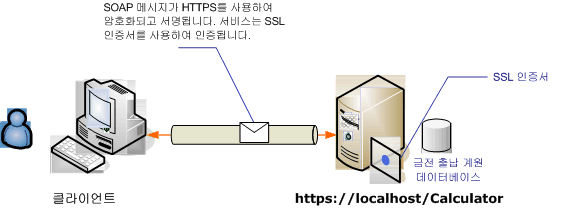

# <a name="transport-security-with-an-anonymous-client"></a>익명 클라이언트를 사용하는 전송 보안
이 [!INCLUDE[indigo1](../../../../includes/indigo1-md.md)] 시나리오에서는 기밀성 및 무결성 확보를 위해 전송 보안(HTTPS)을 사용합니다. 서버는 SSL(Secure Sockets Layer) 인증서로 인증되어야 하며 클라이언트는 서버의 인증서를 신뢰해야 합니다. 클라이언트는 어떤 메커니즘으로도 인증되지 않는 익명 클라이언트입니다.  
  
 샘플 응용 프로그램에 대 한 참조 [WS 전송 보안](../../../../docs/framework/wcf/samples/ws-transport-security.md)합니다. 전송 보안에 대 한 자세한 내용은 참조 [전송 보안 개요](../../../../docs/framework/wcf/feature-details/transport-security-overview.md)합니다.  
  
 서비스에 인증서를 사용 하는 방법에 대 한 자세한 내용은 참조 [인증서 작업](../../../../docs/framework/wcf/feature-details/working-with-certificates.md) 및 [하는 방법: SSL 인증서로 포트 구성](../../../../docs/framework/wcf/feature-details/how-to-configure-a-port-with-an-ssl-certificate.md)합니다.  
  
   
  
|특성|설명|  
|--------------------|-----------------|  
|보안 모드|전송|  
|상호 운용성|기존 웹 서비스 및 클라이언트와의 상호 운용성|  
|인증(서버)<br /><br /> 인증(클라이언트)|예<br /><br /> 응용 프로그램 수준([!INCLUDE[indigo2](../../../../includes/indigo2-md.md)] 지원 없음)|  
|무결성|예|  
|기밀성|예|  
|전송|HTTPS|  
|바인딩|<<!--zz xref:System.ServiceModel.WsHttpBinding --> `xref:System.ServiceModel.WsHttpBinding`>|  
  
## <a name="service"></a>서비스  
 다음 코드와 구성은 독립적으로 실행되어야 합니다. 다음 작업 중 하나를 수행합니다.  
  
-   구성 없이 코드를 사용하여 독립 실행형 서비스를 만듭니다.  
  
-   제공된 구성을 사용하여 서비스를 만들지만 끝점을 정의하지 않습니다.  
  
### <a name="code"></a>코드  
 다음 코드는 전송 보안을 사용하여 끝점을 만드는 방법을 보여 줍니다.  
  
 [!code-csharp[c_SecurityScenarios#5](../../../../samples/snippets/csharp/VS_Snippets_CFX/c_securityscenarios/cs/source.cs#5)]
 [!code-vb[c_SecurityScenarios#5](../../../../samples/snippets/visualbasic/VS_Snippets_CFX/c_securityscenarios/vb/source.vb#5)]  
  
### <a name="configuration"></a>구성  
 다음 코드에서는 구성을 사용하여 동일한 끝점을 설정합니다. 클라이언트는 어떤 메커니즘으로도 인증되지 않는 익명 클라이언트입니다.  
  
```xml  
<?xml version="1.0" encoding="utf-8"?>  
<configuration>  
  <system.serviceModel>  
    <services>  
      <service name="ServiceModel.Calculator">  
        <endpoint address="http://localhost/Calculator"   
                  binding="wsHttpBinding"  
                  bindingConfiguration="WSHttpBinding_ICalculator"   
                  name="SecuredByTransportEndpoint"  
                  contract="ServiceModel.ICalculator" />  
      </service>  
    </services>  
    <bindings>  
      <wsHttpBinding>  
        <binding name="WSHttpBinding_ICalculator">  
          <security mode="Transport">  
            <transport clientCredentialType="None" />  
          </security>  
        </binding>  
      </wsHttpBinding>  
    </bindings>  
    <client />  
  </system.serviceModel>  
</configuration>  
```  
  
## <a name="client"></a>클라이언트  
 다음 코드와 구성은 독립적으로 실행되어야 합니다. 다음 작업 중 하나를 수행합니다.  
  
-   이 코드와 클라이언트 코드를 사용하여 독립 실행형 클라이언트를 만듭니다.  
  
-   끝점 주소를 정의하지 않는 클라이언트를 만듭니다. 대신 구성 이름을 인수로 사용하는 클라이언트 생성자를 사용합니다. 예를 들면 다음과 같습니다.  
  
     [!code-csharp[C_SecurityScenarios#0](../../../../samples/snippets/csharp/VS_Snippets_CFX/c_securityscenarios/cs/source.cs#0)]
     [!code-vb[C_SecurityScenarios#0](../../../../samples/snippets/visualbasic/VS_Snippets_CFX/c_securityscenarios/vb/source.vb#0)]  
  
### <a name="code"></a>코드  
 [!code-csharp[c_SecurityScenarios#6](../../../../samples/snippets/csharp/VS_Snippets_CFX/c_securityscenarios/cs/source.cs#6)]
 [!code-vb[c_SecurityScenarios#6](../../../../samples/snippets/visualbasic/VS_Snippets_CFX/c_securityscenarios/vb/source.vb#6)]  
  
### <a name="configuration"></a>구성  
 다음 구성은 서비스 설정하는 데 코드 대신 사용할 수 있습니다.  
  
```xml  
<configuration>  
  <system.serviceModel>  
    <bindings>  
      <wsHttpBinding>  
        <binding name="WSHttpBinding_ICalculator" >  
          <security mode="Transport">  
            <transport clientCredentialType="None" />  
          </security>  
        </binding>  
      </wsHttpBinding>  
    </bindings>  
    <client>  
      <endpoint address="https://machineName/Calculator"   
                binding="wsHttpBinding"  
                bindingConfiguration="WSHttpBinding_ICalculator"   
                contract="ICalculator"  
                name="WSHttpBinding_ICalculator" />  
    </client>  
  </system.serviceModel>  
</configuration>  
```  
  
## <a name="see-also"></a>참고 항목  
 [보안 개요](../../../../docs/framework/wcf/feature-details/security-overview.md)  
 [WS 전송 보안](../../../../docs/framework/wcf/samples/ws-transport-security.md)  
 [전송 보안 개요](../../../../docs/framework/wcf/feature-details/transport-security-overview.md)  
 [Windows Server App Fabric에 대 한 보안 모델](http://go.microsoft.com/fwlink/?LinkID=201279&clcid=0x409)
