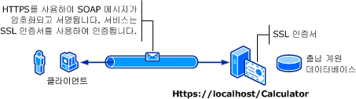

# <a name="transport-security-with-basic-authentication"></a>기본 인증을 사용하는 전송 보안
다음 그림에서는 Windows Communication Foundation (WCF) 서비스 및 클라이언트를 보여 줍니다. 서버에 SSL(Secure Sockets Layer)에 사용할 유효한 X.509 인증서가 있어야 하며 클라이언트에서 서버의 인증서를 신뢰해야 합니다. 또한 웹 서비스에는 이미 사용할 수 있는 SSL 구현이 있습니다. 자세한 내용은 기본 인증을 사용 하는 방법에 대 한 인터넷 정보 서비스 (IIS)를 참조 하십시오. [ http://go.microsoft.com/fwlink/?LinkId=83822 ](http://go.microsoft.com/fwlink/?LinkId=83822)합니다.  
  
   
  
|특성|설명|  
|--------------------|-----------------|  
|보안 모드|전송|  
|상호 운용성|기존 웹 서비스 클라이언트 및 서비스와의 상호 운용성|  
|인증(서버)<br /><br /> 인증(클라이언트)|예(HTTPS 사용)<br /><br /> 예(사용자 이름/암호 사용)|  
|무결성|예|  
|기밀성|예|  
|전송|HTTPS|  
|바인딩|<xref:System.ServiceModel.WSHttpBinding>|  
  
## <a name="service"></a>서비스  
 다음 코드와 구성은 독립적으로 실행되어야 합니다. 다음 작업 중 하나를 수행합니다.  
  
-   구성 없이 코드를 사용하여 독립 실행형 서비스를 만듭니다.  
  
-   제공된 구성을 사용하여 서비스를 만들지만 끝점을 정의하지 않습니다.  
  
### <a name="code"></a>코드  
 다음 코드에서는 전송 보안에 Windows 도메인 사용자 이름과 암호를 사용하는 서비스 끝점을 만드는 방법에 대해 설명합니다. 서비스에서 X.509 인증서를 사용하여 클라이언트를 인증하도록 요구할 수 있습니다. 자세한 내용은 참조 [인증서 작업](../../../../docs/framework/wcf/feature-details/working-with-certificates.md) 및 [하는 방법: SSL 인증서로 포트 구성](../../../../docs/framework/wcf/feature-details/how-to-configure-a-port-with-an-ssl-certificate.md)합니다.  
  
 [!code-csharp[C_SecurityScenarios#1](../../../../samples/snippets/csharp/VS_Snippets_CFX/c_securityscenarios/cs/source.cs#1)]
 [!code-vb[C_SecurityScenarios#1](../../../../samples/snippets/visualbasic/VS_Snippets_CFX/c_securityscenarios/vb/source.vb#1)]  
  
## <a name="configuration"></a>구성  
 다음에서는 전송 수준 보안이 설정된 기본 인증을 사용하도록 서비스를 구성합니다.  
  
```xml  
<?xml version="1.0" encoding="utf-8"?>  
<configuration>  
    <system.serviceModel>  
        <bindings>  
            <wsHttpBinding>  
                <binding name="UsernameWithTransport">  
                    <security mode="Transport">  
                        <transport clientCredentialType="Basic" />  
                    </security>  
                </binding>  
            </wsHttpBinding>  
        </bindings>  
        <services>  
            <service name="BasicAuthentication.Calculator">  
                <endpoint address="https://localhost/Calculator"  
                          binding="wsHttpBinding"   
                          bindingConfiguration="UsernameWithTransport"  
                          name="BasicEndpoint"   
                          contract="BasicAuthentication.ICalculator" />  
            </service>  
        </services>  
    </system.serviceModel>  
</configuration>  
```  
  
## <a name="client"></a>클라이언트  
  
### <a name="code"></a>코드  
 다음 코드에서는 사용자 이름 및 암호를 포함한 클라이언트 코드를 보여 줍니다. 사용자는 유효한 Windows 사용자 이름과 암호를 입력해야 합니다. 사용자 이름과 암호를 반환하는 코드는 여기에 표시하지 않습니다. 대화 상자나 다른 인터페이스를 사용하여 사용자에게 정보를 쿼리합니다.  
  
> [!NOTE]
>  사용자 이름 및 암호는 코드를 사용해야만 설정할 수 있습니다.  
  
 [!code-csharp[C_SecurityScenarios#2](../../../../samples/snippets/csharp/VS_Snippets_CFX/c_securityscenarios/cs/source.cs#2)]
 [!code-vb[C_SecurityScenarios#2](../../../../samples/snippets/visualbasic/VS_Snippets_CFX/c_securityscenarios/vb/source.vb#2)]  
  
### <a name="configuration"></a>구성  
 다음 코드에서는 클라이언트 구성을 보여 줍니다.  
  
> [!NOTE]
>  구성을 사용하여 사용자 이름 및 암호를 설정할 수 없습니다. 여기 표시된 구성은 사용자 이름 및 암호를 설정하는 코드를 사용하여 확장해야 합니다.  
  
```xml  
<?xml version="1.0" encoding="utf-8"?>  
<configuration>  
  <system.serviceModel>  
    <bindings>  
      <wsHttpBinding>  
        <binding name="WSHttpBinding_ICalculator" >  
          <security mode="Transport">  
            <transport clientCredentialType="Basic" />  
          </security>  
        </binding>  
      </wsHttpBinding>  
    </bindings>  
    <client>  
      <endpoint address="https://machineName/Calculator"   
                binding="wsHttpBinding"  
                bindingConfiguration="WSHttpBinding_ICalculator"   
                contract="ICalculator"  
                name="WSHttpBinding_ICalculator" />  
    </client>  
  </system.serviceModel>  
</configuration>  
```  
  
## <a name="see-also"></a>참고 항목  
 <xref:System.ServiceModel.ClientBase%601.ClientCredentials%2A>  
 <xref:System.ServiceModel.Security.UserNamePasswordClientCredential>  
 [인증서 작업](../../../../docs/framework/wcf/feature-details/working-with-certificates.md)  
 [방법: SSL 인증서로 포트 구성](../../../../docs/framework/wcf/feature-details/how-to-configure-a-port-with-an-ssl-certificate.md)  
 [보안 개요](../../../../docs/framework/wcf/feature-details/security-overview.md)  
 [\<clientCredentials>](../../../../docs/framework/configure-apps/file-schema/wcf/clientcredentials.md)  
 [Windows Server App Fabric에 대 한 보안 모델](http://go.microsoft.com/fwlink/?LinkID=201279&clcid=0x409)
