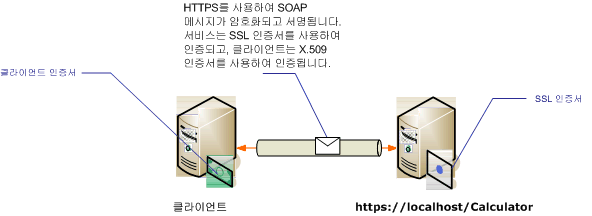

# <a name="transport-security-with-certificate-authentication"></a>인증서 인증을 사용하는 전송 보안
이 항목에서는 전송 보안을 사용할 때 서버 및 클라이언트 인증에 X.509 인증서를 사용하는 방법에 대해 설명합니다. 인증서 참조 X.509에 대 한 자세한 내용은 [X.509 공개 키 인증서](http://msdn.microsoft.com/library/bb540819\(VS.85\).aspx)합니다. 인증서는 인증서의 타사 발급자 자주 변경 되는 인증 기관에서 발급 되어야 합니다. Windows Server 도메인의 경우 Active Directory 인증서 서비스를 사용하여 도메인에서 클라이언트 컴퓨터에 인증서를 발급할 수 있습니다. 자세한 내용은 참조 [Windows 2008 R2 인증서 서비스](http://go.microsoft.com/fwlink/?LinkID=209949&clcid=0x409)합니다. 이 시나리오에서는 SSL(Secure Sockets Layer)을 사용하여 구성된 IIS(인터넷 정보 서비스)에서 서비스가 호스팅됩니다. 서비스는 클라이언트에서 서버의 ID를 확인할 수 있도록 SSL(X.509) 인증서를 사용하여 구성됩니다. 클라이언트도 서비스에서 클라이언트의 ID를 확인할 수 있는 X.509 인증서를 사용하여 구성됩니다. 서버 인증서는 클라이언트에 의해 신뢰되어야 하며 클라이언트 인증서는 서버에 의해 신뢰되어야 합니다. 서비스와 클라이언트가 서로 ID를 확인하는 방법의 실제 메커니즘은 이 항목에서 다루지 않습니다. 자세한 내용은 참조 [Wikipedia에서 디지털 서명을](http://go.microsoft.com/fwlink/?LinkId=253157)합니다.  
  
 이 시나리오에서는 다음 다이어그램에서 보여 주는 것처럼 요청/회신 메시지 패턴을 구현합니다.  
  
   
  
 서비스에 인증서를 사용 하는 방법에 대 한 자세한 내용은 참조 [인증서 작업](../../../../docs/framework/wcf/feature-details/working-with-certificates.md) 및 [하는 방법: SSL 인증서로 포트 구성](../../../../docs/framework/wcf/feature-details/how-to-configure-a-port-with-an-ssl-certificate.md)합니다. 다음 표에서는 시나리오의 다양한 특성에 대해 설명합니다.  
  
|특성|설명|  
|--------------------|-----------------|  
|보안 모드|전송|  
|상호 운용성|기존 웹 서비스 클라이언트 및 서비스에 사용됩니다.|  
|인증(서버)<br /><br /> 인증(클라이언트)|예(SSL 인증서 사용)<br /><br /> 예(X.509 인증서 사용)|  
|데이터 무결성|예|  
|데이터 기밀성|예|  
|전송|HTTPS|  
|바인딩|<xref:System.ServiceModel.WSHttpBinding>|  
  
## <a name="configure-the-service"></a>서비스 구성  
 이 시나리오에서는 서비스가 IIS에서 호스팅되므로 web.config 파일을 사용하여 구성됩니다. 다음 web.config에서는 전송 보안 및 X.509 클라이언트 자격 증명을 사용하도록 <xref:System.ServiceModel.WSHttpBinding>을 구성하는 방법을 보여 줍니다.  
  
```xml  
<configuration>  
  <system.serviceModel>  
    <protocolMapping>  
      <add scheme="https" binding="wsHttpBinding" />  
    </protocolMapping>  
    <bindings>  
      <wsHttpBinding>  
        <!-- configure wsHttp binding with Transport security mode and clientCredentialType as Certificate -->  
        <binding>  
          <security mode="Transport">  
            <transport clientCredentialType="Certificate"/>              
          </security>  
        </binding>  
      </wsHttpBinding>  
    </bindings>  
    <!--For debugging purposes set the includeExceptionDetailInFaults attribute to true-->  
    <behaviors>  
      <serviceBehaviors>  
        <behavior>            
           <serviceDebug includeExceptionDetailInFaults="True" />  
        </behavior>  
      </serviceBehaviors>  
    </behaviors>  
  </system.serviceModel>  
</configuration>  
```  
  
## <a name="configure-the-client"></a>클라이언트 구성  
 클라이언트는 코드 또는 app.config 파일에 지정할 수 있습니다. 다음 예제에서는 클라이언트를 코드에 구성하는 방법을 보여 줍니다.  
  
```vb  
// Create the binding.  
WSHttpBinding myBinding = new WSHttpBinding();  
myBinding.Security.Mode = SecurityMode.Transport;  
myBinding.Security.Transport.ClientCredentialType =  
   HttpClientCredentialType.Certificate;  
  
// Create the endpoint address. Note that the machine name   
// must match the subject or DNS field of the X.509 certificate  
// used to authenticate the service.   
EndpointAddress ea = new  
   EndpointAddress("https://localhost/CalculatorService/service.svc");  
  
// Create the client. The code for the calculator   
// client is not shown here. See the sample applications  
// for examples of the calculator code.  
CalculatorClient cc =  
   new CalculatorClient(myBinding, ea);  
  
// The client must specify a certificate trusted by the server.  
cc.ClientCredentials.ClientCertificate.SetCertificate(  
    StoreLocation.CurrentUser,  
    StoreName.My,  
    X509FindType.FindBySubjectName,  
    "contoso.com");  
  
// Begin using the client.  
Console.WriteLine(cc.Add(100, 1111));  
//...  
cc.Close();  
```  
  
 또는 다음 예제와 같이 클라이언트를 App.config 파일에 구성할 수 있습니다.  
  
```xml  
<configuration>  
  <system.serviceModel>  
    <client>  
      <!-- this endpoint has an https: address -->  
      <endpoint address=" https://localhost/CalculatorService/service.svc "   
                behaviorConfiguration="endpointCredentialBehavior"  
                binding="wsHttpBinding"   
                bindingConfiguration="Binding1"   
                contract="Microsoft.Samples.TransportSecurity.ICalculator"/>  
    </client>  
    <behaviors>  
      <endpointBehaviors>  
        <behavior name="endpointCredentialBehavior">  
          <clientCredentials>  
            <clientCertificate findValue="contoso.com"  
                               storeLocation="CurrentUser"  
                               storeName="My"  
                               x509FindType="FindBySubjectName" />  
          </clientCredentials>  
        </behavior>  
      </endpointBehaviors>  
    </behaviors>  
    <bindings>  
      <wsHttpBinding>  
        <!-- configure wsHttpbinding with Transport security mode  
                   and clientCredentialType as Certificate -->  
        <binding name="Binding1">  
          <security mode="Transport">  
            <transport clientCredentialType="Certificate"/>  
          </security>  
        </binding>  
      </wsHttpBinding>  
    </bindings>  
  </system.serviceModel>  
  
<startup><supportedRuntime version="v4.0" sku=".NETFramework,Version=v4.0"/></startup></configuration>  
```  
  
## <a name="see-also"></a>참고 항목  
 [보안 개요](../../../../docs/framework/wcf/feature-details/security-overview.md)  
 [Windows Server App Fabric에 대 한 보안 모델](http://go.microsoft.com/fwlink/?LinkID=201279&clcid=0x409)
