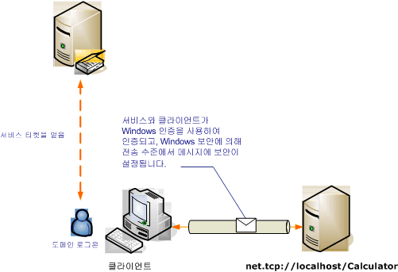

# <a name="transport-security-with-windows-authentication"></a>Windows 인증을 사용하는 전송 보안
다음 시나리오에서는 Windows 보안에 의해 보호되는 [!INCLUDE[indigo1](../../../../includes/indigo1-md.md)] 클라이언트와 서비스를 보여 줍니다. [!INCLUDE[crabout](../../../../includes/crabout-md.md)]프로그래밍 참조 [하는 방법: Windows 자격 증명을 사용 하 여 서비스 보안](../../../../docs/framework/wcf/how-to-secure-a-service-with-windows-credentials.md)합니다.  
  
 인트라넷 웹 서비스는 인사 정보를 표시합니다. 클라이언트는 Windows Form 응용 프로그램입니다. 응용프로그램은 도메인을 보호하는 Kerberos 컨트롤러와 함께 도메인에 배포됩니다.  
  
   
  
|특성|설명|  
|--------------------|-----------------|  
|보안 모드|전송|  
|상호 운용성|[!INCLUDE[indigo2](../../../../includes/indigo2-md.md)]에만 해당|  
|인증(서버)<br /><br /> 인증(클라이언트)|예, Windows 통합 인증을 사용합니다.<br /><br /> 예, Windows 통합 인증을 사용합니다.|  
|무결성|예|  
|기밀성|예|  
|전송|NET.TCP|  
|바인딩|<xref:System.ServiceModel.NetTcpBinding>|  
  
## <a name="service"></a>서비스  
 다음 코드와 구성은 독립적으로 실행되어야 합니다. 다음 작업 중 하나를 수행합니다.  
  
-   구성 없이 코드를 사용하여 독립 실행형 서비스를 만듭니다.  
  
-   제공된 구성을 사용하여 서비스를 만들지만 끝점을 정의하지 않습니다.  
  
### <a name="code"></a>코드  
 다음 코드에서는 Windows 보안을 사용하는 서비스 끝점을 만드는 방법을 보여 줍니다.  
  
 [!code-csharp[C_SecurityScenarios#3](../../../../samples/snippets/csharp/VS_Snippets_CFX/c_securityscenarios/cs/source.cs#3)]
 [!code-vb[C_SecurityScenarios#3](../../../../samples/snippets/visualbasic/VS_Snippets_CFX/c_securityscenarios/vb/source.vb#3)]  
  
### <a name="configuration"></a>구성  
 다음 구성은 서비스 끝점을 설정하는 데 코드 대신 사용할 수 있습니다.  
  
```xml  
<?xml version="1.0" encoding="utf-8"?>  
<configuration>  
  <system.serviceModel>  
    <behaviors />  
    <services>  
      <service behaviorConfiguration="" name="ServiceModel.Calculator">  
        <endpoint address="net.tcp://localhost:8008/Calculator"   
                  binding="netTcpBinding"  
          bindingConfiguration="WindowsClientOverTcp"   
                  name="WindowsClientOverTcp"  
                  contract="ServiceModel.ICalculator" />  
      </service>  
    </services>  
    <bindings>  
      <netTcpBinding>  
        <binding name="WindowsClientOverTcp">  
          <security mode="Transport">  
            <transport clientCredentialType="Windows" />  
          </security>  
        </binding>  
      </netTcpBinding>  
    </bindings>  
    <client />  
  </system.serviceModel>  
</configuration>  
```  
  
## <a name="client"></a>클라이언트  
 다음 코드와 구성은 독립적으로 실행되어야 합니다. 다음 작업 중 하나를 수행합니다.  
  
-   이 코드와 클라이언트 코드를 사용하여 독립 실행형 클라이언트를 만듭니다.  
  
-   끝점 주소를 정의하지 않는 클라이언트를 만듭니다. 대신 구성 이름을 인수로 사용하는 클라이언트 생성자를 사용합니다. 예를 들면 다음과 같습니다.  
  
     [!code-csharp[C_SecurityScenarios#0](../../../../samples/snippets/csharp/VS_Snippets_CFX/c_securityscenarios/cs/source.cs#0)]
     [!code-vb[C_SecurityScenarios#0](../../../../samples/snippets/visualbasic/VS_Snippets_CFX/c_securityscenarios/vb/source.vb#0)]  
  
### <a name="code"></a>코드  
 다음 코드에서는 클라이언트를 만듭니다. 바인딩은 TCP 전송과 함께 클라이언트 자격 증명 형식이 Windows로 설정된 전송 모드 보안을 사용하도록 구성됩니다.  
  
 [!code-csharp[C_SecurityScenarios#4](../../../../samples/snippets/csharp/VS_Snippets_CFX/c_securityscenarios/cs/source.cs#4)]
 [!code-vb[C_SecurityScenarios#4](../../../../samples/snippets/visualbasic/VS_Snippets_CFX/c_securityscenarios/vb/source.vb#4)]  
  
### <a name="configuration"></a>구성  
 다음 구성은 클라이언트를 만드는 데 코드 대신 사용할 수 있습니다.  
  
```xml  
<?xml version="1.0" encoding="utf-8"?>  
<configuration>  
  <system.serviceModel>  
    <bindings>  
      <netTcpBinding>  
        <binding name="NetTcpBinding_ICalculator" >  
          <security mode="Transport">  
            <transport clientCredentialType="Windows" />  
          </security>  
        </binding>  
      </netTcpBinding>  
    </bindings>  
    <client>  
      <endpoint address="net.tcp://localhost:8008/Calculator"   
                binding="netTcpBinding"            
                bindingConfiguration="NetTcpBinding_ICalculator"   
                contract="ICalculator"  
                name="NetTcpBinding_ICalculator">  
      </endpoint>  
    </client>  
  </system.serviceModel>  
</configuration>  
```  
  
## <a name="see-also"></a>참고 항목  
 [보안 개요](../../../../docs/framework/wcf/feature-details/security-overview.md)  
 [방법: Windows 자격 증명을 사용하여 서비스에 보안 설정](../../../../docs/framework/wcf/how-to-secure-a-service-with-windows-credentials.md)  
 [Windows Server App Fabric에 대 한 보안 모델](http://go.microsoft.com/fwlink/?LinkID=201279&clcid=0x409)
