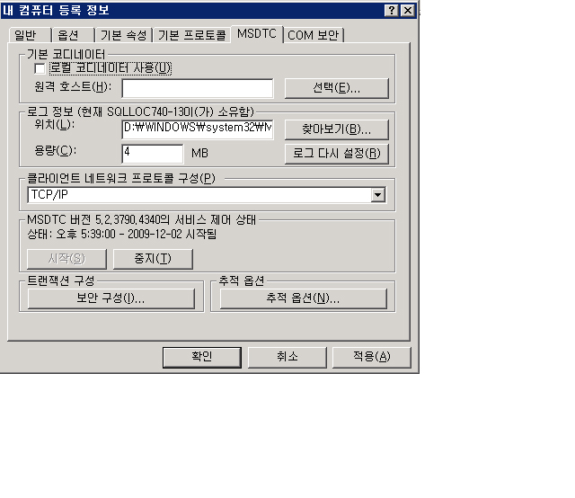

# <a name="troubleshooting-queued-messaging"></a><span data-ttu-id="8533c-102">대기 중인 메시지 문제 해결</span><span class="sxs-lookup"><span data-stu-id="8533c-102">Troubleshooting Queued Messaging</span></span>
<span data-ttu-id="8533c-103">이 단원에는 [!INCLUDE[indigo1](../../../../includes/indigo1-md.md)]에서 큐를 사용하는 경우에 관한 일반적인 질문과 문제 해결 도움말이 있습니다.</span><span class="sxs-lookup"><span data-stu-id="8533c-103">This section contains common questions and troubleshooting help for using queues in [!INCLUDE[indigo1](../../../../includes/indigo1-md.md)].</span></span>  
  
## <a name="common-questions"></a><span data-ttu-id="8533c-104">자주 묻는 질문</span><span class="sxs-lookup"><span data-stu-id="8533c-104">Common Questions</span></span>  
 <span data-ttu-id="8533c-105">**Q:** 사용 [!INCLUDE[indigo2](../../../../includes/indigo2-md.md)] 베타 1과 I MSMQ 핫픽스를 설치 합니다.</span><span class="sxs-lookup"><span data-stu-id="8533c-105">**Q:** I used [!INCLUDE[indigo2](../../../../includes/indigo2-md.md)] Beta 1 and I installed the MSMQ hotfix.</span></span> <span data-ttu-id="8533c-106">핫픽스를 제거해야 합니까?</span><span class="sxs-lookup"><span data-stu-id="8533c-106">Do I need to remove the hotfix?</span></span>  
  
 <span data-ttu-id="8533c-107">**A:** 예.</span><span class="sxs-lookup"><span data-stu-id="8533c-107">**A:** Yes.</span></span> <span data-ttu-id="8533c-108">이 핫픽스는 더 이상 지원되지 않습니다.</span><span class="sxs-lookup"><span data-stu-id="8533c-108">This hotfix is no longer supported.</span></span> [!INCLUDE[indigo2](../../../../includes/indigo2-md.md)]<span data-ttu-id="8533c-109">를 이제 핫픽스 없이도 MSMQ에서 사용할 수 있습니다.</span><span class="sxs-lookup"><span data-stu-id="8533c-109"> now works on MSMQ without a hotfix requirement.</span></span>  
  
 <span data-ttu-id="8533c-110">**Q:** 두 가지 바인딩 msmq: <xref:System.ServiceModel.NetMsmqBinding> 및 <xref:System.ServiceModel.MsmqIntegration.MsmqIntegrationBinding>합니다.</span><span class="sxs-lookup"><span data-stu-id="8533c-110">**Q:** There are two bindings for MSMQ: <xref:System.ServiceModel.NetMsmqBinding> and <xref:System.ServiceModel.MsmqIntegration.MsmqIntegrationBinding>.</span></span> <span data-ttu-id="8533c-111">어느 것을 언제 사용해야 합니까?</span><span class="sxs-lookup"><span data-stu-id="8533c-111">What should I use and when?</span></span>  
  
 <span data-ttu-id="8533c-112">**A:** 사용는 <xref:System.ServiceModel.NetMsmqBinding> 두 큐에 대기 중인된 통신에 MSMQ를 전송으로 사용 하려는 경우 [!INCLUDE[indigo2](../../../../includes/indigo2-md.md)] 응용 프로그램입니다.</span><span class="sxs-lookup"><span data-stu-id="8533c-112">**A:** Use the <xref:System.ServiceModel.NetMsmqBinding> when you want to use MSMQ as a transport for queued communication between two [!INCLUDE[indigo2](../../../../includes/indigo2-md.md)] applications.</span></span> <span data-ttu-id="8533c-113"><xref:System.ServiceModel.MsmqIntegration.MsmqIntegrationBinding>은 기존 MSMQ 응용 프로그램을 사용하여 새 [!INCLUDE[indigo2](../../../../includes/indigo2-md.md)] 응용 프로그램과 통신하려는 경우에 사용합니다.</span><span class="sxs-lookup"><span data-stu-id="8533c-113">Use the <xref:System.ServiceModel.MsmqIntegration.MsmqIntegrationBinding> when you want to use existing MSMQ applications to communicate with new [!INCLUDE[indigo2](../../../../includes/indigo2-md.md)] applications.</span></span>  
  
 <span data-ttu-id="8533c-114">**Q:** 사용 하려면 MSMQ를 업그레이드 해야는 <xref:System.ServiceModel.NetMsmqBinding> 및 `MsmqIntegration` 바인딩?</span><span class="sxs-lookup"><span data-stu-id="8533c-114">**Q:** Do I have to upgrade MSMQ to use the <xref:System.ServiceModel.NetMsmqBinding> and `MsmqIntegration` bindings?</span></span>  
  
 <span data-ttu-id="8533c-115">**A:** 아니요.</span><span class="sxs-lookup"><span data-stu-id="8533c-115">**A:** No.</span></span> <span data-ttu-id="8533c-116">두 바인딩은 모두 [!INCLUDE[wxp](../../../../includes/wxp-md.md)] 및 [!INCLUDE[ws2003](../../../../includes/ws2003-md.md)]에서 MSMQ 3.0에 사용됩니다.</span><span class="sxs-lookup"><span data-stu-id="8533c-116">Both bindings work with MSMQ 3.0 on [!INCLUDE[wxp](../../../../includes/wxp-md.md)] and [!INCLUDE[ws2003](../../../../includes/ws2003-md.md)].</span></span> <span data-ttu-id="8533c-117">바인딩의 일부 기능은 [!INCLUDE[wv](../../../../includes/wv-md.md)]에서 MSMQ 4.0으로 업그레이드하면 사용할 수 있게 됩니다.</span><span class="sxs-lookup"><span data-stu-id="8533c-117">Certain features of the bindings become available when you upgrade to MSMQ 4.0 in [!INCLUDE[wv](../../../../includes/wv-md.md)].</span></span>  
  
 <span data-ttu-id="8533c-118">**Q:** 의 어떤 기능은 <xref:System.ServiceModel.NetMsmqBinding> 및 <xref:System.ServiceModel.MsmqIntegration.MsmqIntegrationBinding> 바인딩은 MSMQ 4.0 있지만 속하지 않은 MSMQ 3.0에서 사용할 수는?</span><span class="sxs-lookup"><span data-stu-id="8533c-118">**Q:** What features of the <xref:System.ServiceModel.NetMsmqBinding> and <xref:System.ServiceModel.MsmqIntegration.MsmqIntegrationBinding> bindings are available in MSMQ 4.0 but not in MSMQ 3.0?</span></span>  
  
 <span data-ttu-id="8533c-119">**A:** 다음 기능은 MSMQ 4.0 있지만 속하지 않은 MSMQ 3.0에서 사용할 수 있습니다.</span><span class="sxs-lookup"><span data-stu-id="8533c-119">**A:** The following features are available in MSMQ 4.0 but not in MSMQ 3.0:</span></span>  
  
-   <span data-ttu-id="8533c-120">사용자 지정 배달 못한 편지 큐는 MSMQ 4.0에서만 지원됩니다.</span><span class="sxs-lookup"><span data-stu-id="8533c-120">Custom dead-letter queue is supported only on MSMQ 4.0.</span></span>  
  
-   <span data-ttu-id="8533c-121">MSMQ 3.0과 4.0은 포이즌 메시지를 처리하는 방식이 다릅니다.</span><span class="sxs-lookup"><span data-stu-id="8533c-121">MSMQ 3.0 and 4.0 handle poison messages differently.</span></span>  
  
-   <span data-ttu-id="8533c-122">MSMQ 4.0에서만 트랜잭션된 원격 읽기를 지원합니다.</span><span class="sxs-lookup"><span data-stu-id="8533c-122">Only MSMQ 4.0 supports remote transacted read.</span></span>  
  
 <span data-ttu-id="8533c-123">자세한 내용은 참조 [Windows Vista, Windows Server 2003 및 Windows XP의 큐 기능 차이점](../../../../docs/framework/wcf/feature-details/diff-in-queue-in-vista-server-2003-windows-xp.md)합니다.</span><span class="sxs-lookup"><span data-stu-id="8533c-123">For more information, see [Differences in Queuing Features in Windows Vista, Windows Server 2003, and Windows XP](../../../../docs/framework/wcf/feature-details/diff-in-queue-in-vista-server-2003-windows-xp.md).</span></span>  
  
 <span data-ttu-id="8533c-124">**Q:** MSMQ 3.0 다른 쪽에 대기 중인된 통신 및 MSMQ 4.0의 한 쪽에서 사용할 수 있습니까?</span><span class="sxs-lookup"><span data-stu-id="8533c-124">**Q:** Can I use MSMQ 3.0 on one side of a queued communication and MSMQ 4.0 on the other side?</span></span>  
  
 <span data-ttu-id="8533c-125">**A:** 예.</span><span class="sxs-lookup"><span data-stu-id="8533c-125">**A:** Yes.</span></span>  
  
 <span data-ttu-id="8533c-126">**Q:** new로 기존 MSMQ 응용 프로그램과 통합 하려는 [!INCLUDE[indigo2](../../../../includes/indigo2-md.md)] 클라이언트 또는 서버입니다.</span><span class="sxs-lookup"><span data-stu-id="8533c-126">**Q:** I want to integrate existing MSMQ applications with new [!INCLUDE[indigo2](../../../../includes/indigo2-md.md)] clients or servers.</span></span> <span data-ttu-id="8533c-127">MSMQ 인프라의 양쪽을 모두 업그레이드해야 합니까?</span><span class="sxs-lookup"><span data-stu-id="8533c-127">Do I need to upgrade both sides of my MSMQ infrastructure?</span></span>  
  
 <span data-ttu-id="8533c-128">**A:** 아니요.</span><span class="sxs-lookup"><span data-stu-id="8533c-128">**A:** No.</span></span> <span data-ttu-id="8533c-129">어느 쪽에서도 MSMQ 4.0으로 업그레이드할 필요는 없습니다.</span><span class="sxs-lookup"><span data-stu-id="8533c-129">You do not have to upgrade to MSMQ 4.0 on either side.</span></span>  
  
## <a name="troubleshooting"></a><span data-ttu-id="8533c-130">문제 해결</span><span class="sxs-lookup"><span data-stu-id="8533c-130">Troubleshooting</span></span>  
 <span data-ttu-id="8533c-131">이 단원에는 일반적인 문제 해결 관련 질문의 답이 있습니다.</span><span class="sxs-lookup"><span data-stu-id="8533c-131">This section contains answers to most common troubleshooting issues.</span></span> <span data-ttu-id="8533c-132">알려진 제한에 관한 몇 가지 문제는 릴리스 정보를 참조하십시오.</span><span class="sxs-lookup"><span data-stu-id="8533c-132">Some issues that are known limitations are also described in the release notes.</span></span>  
  
 <span data-ttu-id="8533c-133">**Q:** 개인 큐를 사용 하 려 하 고 다음과 같은 예외가: `System.InvalidOperationException`: URL이 잘못 되었습니다.</span><span class="sxs-lookup"><span data-stu-id="8533c-133">**Q:** I am trying to use a private queue and I get the following exception: `System.InvalidOperationException`: The URL is invalid.</span></span> <span data-ttu-id="8533c-134">큐의 URL에는 '$' 문자가 포함될 수 없습니다.</span><span class="sxs-lookup"><span data-stu-id="8533c-134">The URL for the queue cannot contain the '$' character.</span></span> <span data-ttu-id="8533c-135">net.msmq://machine/private/queueName의 구문을 사용하여 개인 큐의 주소를 지정하십시오.</span><span class="sxs-lookup"><span data-stu-id="8533c-135">Use the syntax in net.msmq://machine/private/queueName to address a private queue.</span></span>  
  
 <span data-ttu-id="8533c-136">**A:** 구성 및 코드의 식별자 URI (Uniform Resource) 큐를 확인 하십시오.</span><span class="sxs-lookup"><span data-stu-id="8533c-136">**A:** Please check the queue Uniform Resource Identifier (URI) in your configuration and code.</span></span> <span data-ttu-id="8533c-137">URI에는 "$" 문자를 사용하지 마십시오.</span><span class="sxs-lookup"><span data-stu-id="8533c-137">Do not use the "$" character in the URI.</span></span> <span data-ttu-id="8533c-138">예를 들어 OrdersQueue라는 개인 큐를 지정하려면 URI를 net.msmq://localhost/private/ordersQueue로 지정합니다.</span><span class="sxs-lookup"><span data-stu-id="8533c-138">For example, to address a private queue named OrdersQueue, specify the URI as net.msmq://localhost/private/ordersQueue.</span></span>  
  
 <span data-ttu-id="8533c-139">**Q:** 호출 `ServiceHost.Open()` 대기 중인 응용 프로그램에 다음과 같은 예외를 throw: `System.ArgumentException`: 기본 주소 URI 쿼리 문자열을 포함할 수 없습니다.</span><span class="sxs-lookup"><span data-stu-id="8533c-139">**Q:** Calling `ServiceHost.Open()` on my queued application throws the following exception: `System.ArgumentException`: A base address cannot contain a URI query string.</span></span> <span data-ttu-id="8533c-140">이유</span><span class="sxs-lookup"><span data-stu-id="8533c-140">Why?</span></span>  
  
 <span data-ttu-id="8533c-141">**A:** URI 프로그램 구성 파일에서 및 코드에 큐를 확인 합니다.</span><span class="sxs-lookup"><span data-stu-id="8533c-141">**A:** Check the queue URI in your configuration file and in your code.</span></span> <span data-ttu-id="8533c-142">MSMQ 큐에서는 '?' 문자 사용을 지원하지만 URI에서는 이 문자를 문자열 쿼리의 시작으로 해석합니다.</span><span class="sxs-lookup"><span data-stu-id="8533c-142">While MSMQ queues support the use of the '?' character, URIs interpret this character as the beginning of a string query.</span></span> <span data-ttu-id="8533c-143">이 문제를 방지하려면 '?' 문자가 포함되지 않은 큐 이름을 사용합니다.</span><span class="sxs-lookup"><span data-stu-id="8533c-143">To avoid this issue, use queue names that do not contain '?' characters.</span></span>  
  
 <span data-ttu-id="8533c-144">**Q:** 보내기에 성공 했는데 수신기에서 없는 서비스 작업이 호출 됩니다.</span><span class="sxs-lookup"><span data-stu-id="8533c-144">**Q:** My send succeeded but no service operation is invoked on the receiver.</span></span> <span data-ttu-id="8533c-145">이유</span><span class="sxs-lookup"><span data-stu-id="8533c-145">Why?</span></span>  
  
 <span data-ttu-id="8533c-146">**A:** 다음 검사 목록을 통해 작업에 대 한 대답을 확인 하려면:</span><span class="sxs-lookup"><span data-stu-id="8533c-146">**A:** To determine the answer, work through the following check list:</span></span>  
  
-   <span data-ttu-id="8533c-147">트랜잭션 큐 요구 사항이 지정된 보증과 호환되는지 확인합니다.</span><span class="sxs-lookup"><span data-stu-id="8533c-147">Check that the transactional queue requirements are compatible with the assurances specified.</span></span> <span data-ttu-id="8533c-148">다음 원칙에 주의하십시오.</span><span class="sxs-lookup"><span data-stu-id="8533c-148">Note the following principles:</span></span>  
  
    -   <span data-ttu-id="8533c-149">보낼 수 있습니다 (데이터 그램 및 세션)의 지 속성 메시지 "정확히 한 번 만" 보증이 (<xref:System.ServiceModel.MsmqBindingBase.ExactlyOnce%2A> = `true`) 트랜잭션 큐로만 합니다.</span><span class="sxs-lookup"><span data-stu-id="8533c-149">You can send durable messages (datagrams and sessions) with "exactly once" assurances (<xref:System.ServiceModel.MsmqBindingBase.ExactlyOnce%2A> = `true`) only to a transactional queue.</span></span>  
  
    -   <span data-ttu-id="8533c-150">"한 번만" 보증이 지정된 세션만 보낼 수 있습니다.</span><span class="sxs-lookup"><span data-stu-id="8533c-150">You can send sessions only with "exactly once" assurances.</span></span>  
  
    -   <span data-ttu-id="8533c-151">트랜잭션 큐의 세션에서 메시지를 받으려면 트랜잭션이 필요합니다.</span><span class="sxs-lookup"><span data-stu-id="8533c-151">A transaction is required to receive messages in a session from a transactional queue.</span></span>  
  
    -   <span data-ttu-id="8533c-152">보내거나 일시적 또는 지 속성 (데이터 그램만 해당) 보증이 없는 메시지를 받을 수 있습니다 (<xref:System.ServiceModel.MsmqBindingBase.ExactlyOnce%2A> = `false`)는 비트랜잭션 큐로만 합니다.</span><span class="sxs-lookup"><span data-stu-id="8533c-152">You can send or receive volatile or durable messages (datagrams only) with no assurances (<xref:System.ServiceModel.MsmqBindingBase.ExactlyOnce%2A> = `false`) only to a non-transactional queue.</span></span>  
  
-   <span data-ttu-id="8533c-153">배달 못한 편지 큐를 확인합니다.</span><span class="sxs-lookup"><span data-stu-id="8533c-153">Check the dead-letter queue.</span></span> <span data-ttu-id="8533c-154">거기에서 메시지를 찾은 경우에는 배달되지 않은 이유를 확인합니다.</span><span class="sxs-lookup"><span data-stu-id="8533c-154">If you find the messages there, determine why they were not delivered.</span></span>  
  
-   <span data-ttu-id="8533c-155">보내는 큐에서 연결 또는 주소 지정 문제를 확인합니다.</span><span class="sxs-lookup"><span data-stu-id="8533c-155">Check the outgoing queues for connectivity or addressing problems.</span></span>  
  
 <span data-ttu-id="8533c-156">**Q:** 사용자 지정 배달 못 한 편지 큐를 지정 하지만 발신자 응용 프로그램을 시작할 때 배달 못 한 편지 큐를 찾을 수 없다는 내용의 예외가 발생 하거나 발신 응용 프로그램에 배달 못 한 편지 큐 수 있는 권한이 없습니다.</span><span class="sxs-lookup"><span data-stu-id="8533c-156">**Q:** I have specified a custom dead-letter queue, but when I start the sender application, I get an exception that either the dead-letter queue is not found, or the sending application has no permission to the dead-letter queue.</span></span> <span data-ttu-id="8533c-157">이유가 무엇입니까?</span><span class="sxs-lookup"><span data-stu-id="8533c-157">Why is this happening?</span></span>  
  
 <span data-ttu-id="8533c-158">**A:** 사용자 지정 배달 못 한 편지 큐 URI에 "localhost" 또는 컴퓨터 이름을 첫 번째 세그먼트 예를 들어 net.msmq: //localhost/private/myappdead-letter queue에에서 포함 해야 합니다.</span><span class="sxs-lookup"><span data-stu-id="8533c-158">**A:** The custom dead-letter queue URI must include a "localhost" or the computer name in the first segment, for example, net.msmq://localhost/private/myAppdead-letter queue.</span></span>  
  
 <span data-ttu-id="8533c-159">**Q:** 것 항상 사용자 지정 배달 못 한 편지 큐를 정의 하는 데 필요한 없거나 기본 배달 못 한 편지 큐?</span><span class="sxs-lookup"><span data-stu-id="8533c-159">**Q:** Is it always necessary to define a custom dead-letter queue, or is there a default dead-letter queue?</span></span>  
  
 <span data-ttu-id="8533c-160">**A:** 보증 "정확히 한 번 만" 경우 (<xref:System.ServiceModel.MsmqBindingBase.ExactlyOnce%2A> = `true`), 기본값은 시스템 차원의 트랜잭션 배달 못 한 편지 큐는 사용자 지정 배달 못 한 편지 큐를 지정 하지 않습니다.</span><span class="sxs-lookup"><span data-stu-id="8533c-160">**A:** If assurances are "exactly once" (<xref:System.ServiceModel.MsmqBindingBase.ExactlyOnce%2A> = `true`), and if you do not specify a custom dead-letter queue, the default is a system-wide transactional dead-letter queue.</span></span>  
  
 <span data-ttu-id="8533c-161">보증이 없는 (<xref:System.ServiceModel.MsmqBindingBase.ExactlyOnce%2A> = `false`), 기본값은 배달 못 한 편지 큐 기능이 없습니다.</span><span class="sxs-lookup"><span data-stu-id="8533c-161">If assurances are none (<xref:System.ServiceModel.MsmqBindingBase.ExactlyOnce%2A> = `false`), then the default is no dead-letter queue functionality.</span></span>  
  
 <span data-ttu-id="8533c-162">**Q:** 메시지와 함께 SvcHost.Open에서 "EndpointListener 요구 사항에 맞지 않습니다 ListenerFactory" 서비스에서 throw 합니다.</span><span class="sxs-lookup"><span data-stu-id="8533c-162">**Q:** My service throws on SvcHost.Open with a message "EndpointListener requirements cannot be met by the ListenerFactory".</span></span> <span data-ttu-id="8533c-163">이유</span><span class="sxs-lookup"><span data-stu-id="8533c-163">Why?</span></span>  
  
 <span data-ttu-id="8533c-164">대답:</span><span class="sxs-lookup"><span data-stu-id="8533c-164">A.</span></span> <span data-ttu-id="8533c-165">서비스 계약을 확인하십시오.</span><span class="sxs-lookup"><span data-stu-id="8533c-165">Check your service contract.</span></span> <span data-ttu-id="8533c-166">배치 하지 않았을 수 있습니다 "IsOneWay =`true`"에 있는 모든 서비스 작업입니다.</span><span class="sxs-lookup"><span data-stu-id="8533c-166">You may have forgotten to put "IsOneWay=`true`" on all the service operations.</span></span> <span data-ttu-id="8533c-167">큐에서는 단방향 서비스 작업만 지원합니다.</span><span class="sxs-lookup"><span data-stu-id="8533c-167">Queues support only one-way service operations.</span></span>  
  
 <span data-ttu-id="8533c-168">**Q:** 큐에 메시지가 있지만 서비스 작업이 호출 됩니다.</span><span class="sxs-lookup"><span data-stu-id="8533c-168">**Q:** There are messages in the queue but no service operation is invoked.</span></span> <span data-ttu-id="8533c-169">무엇이 문제입니까?</span><span class="sxs-lookup"><span data-stu-id="8533c-169">What is the problem?</span></span>  
  
 <span data-ttu-id="8533c-170">**A:** 서비스 호스트에 오류가 있는지 확인 합니다.</span><span class="sxs-lookup"><span data-stu-id="8533c-170">**A:** Determine if your service host is faulted.</span></span> <span data-ttu-id="8533c-171">추적을 검토하거나 `IErrorHandler`를 구현하면 확인할 수 있습니다.</span><span class="sxs-lookup"><span data-stu-id="8533c-171">You can check by looking at the trace or implementing `IErrorHandler`.</span></span> <span data-ttu-id="8533c-172">포이즌 메시지가 검색되면 기본적으로 서비스 호스트 오류가 발생합니다.</span><span class="sxs-lookup"><span data-stu-id="8533c-172">Service host faults, by default, if a poison message is detected.</span></span>  
  
 <span data-ttu-id="8533c-173">**Q:** 큐에 메시지가 있지만 대기 중인 웹 호스팅 서비스가 활성화 되지 않습니다.</span><span class="sxs-lookup"><span data-stu-id="8533c-173">**Q:** There are messages in the queue but my Web-hosted queued service is not getting activated.</span></span> <span data-ttu-id="8533c-174">이유</span><span class="sxs-lookup"><span data-stu-id="8533c-174">Why?</span></span>  
  
 <span data-ttu-id="8533c-175">**A:** 가장 일반적인 이유는 권한입니다.</span><span class="sxs-lookup"><span data-stu-id="8533c-175">**A:** The most common reason is permissions.</span></span>  
  
1.  <span data-ttu-id="8533c-176">`NetMsmqActivator` 프로세스가 실행되고 있으며 `NetMsmqActivator` 프로세스의 ID에 큐에 대한 읽기 및 검색 권한이 있는지 확인하십시오.</span><span class="sxs-lookup"><span data-stu-id="8533c-176">Ensure that the `NetMsmqActivator` process is running and the identity of the `NetMsmqActivator` process is given read and seek permission on the queue.</span></span>  
  
2.  <span data-ttu-id="8533c-177">`NetMsmqActivator`에서 원격 시스템에 있는 큐를 모니터링하는 경우에는 `NetMsmqActivator`가 제한된 토큰에서 실행되고 있지 않은지 확인합니다.</span><span class="sxs-lookup"><span data-stu-id="8533c-177">If the `NetMsmqActivator` is monitoring queues on a remote machine, ensure that `NetMsmqActivator` does not run under a restricted token.</span></span> <span data-ttu-id="8533c-178">제한되지 않은 토큰으로 `NetMsmqActivator`를 실행하려면:</span><span class="sxs-lookup"><span data-stu-id="8533c-178">To run the `NetMsmqActivator` with an unrestricted token:</span></span>  
  
    ```  
    sc sidtype NetMsmqActivator unrestricted  
    ```  
  
 <span data-ttu-id="8533c-179">에 대 한 비보안 관련된 웹 호스트 문제를 참조: [대기 중인 응용 프로그램 웹 호스팅](../../../../docs/framework/wcf/feature-details/web-hosting-a-queued-application.md)합니다.</span><span class="sxs-lookup"><span data-stu-id="8533c-179">For non-security related Web host issues refer to: [Web Hosting a Queued Application](../../../../docs/framework/wcf/feature-details/web-hosting-a-queued-application.md).</span></span>  
  
 <span data-ttu-id="8533c-180">**Q:** 액세스 세션에는 가장 쉬운 방법은 무엇 인가요?</span><span class="sxs-lookup"><span data-stu-id="8533c-180">**Q:** What is the easiest way to access sessions?</span></span>  
  
 <span data-ttu-id="8533c-181">**A:** 자동 완성 설정 =`true` 마지막에 해당 하는 작업에는 세션에서 메시지 보내기 및 자동 완성 설정 =`false` 나머지 모든 서비스 작업에 있습니다.</span><span class="sxs-lookup"><span data-stu-id="8533c-181">**A:** Set AutoComplete=`true` on the operation that corresponds to the last message in the session, and set AutoComplete=`false` on all remaining service operations.</span></span>  
  
 <span data-ttu-id="8533c-182">**Q:** MSMQ에 대 한 일반적인 질문에 답변은 어디서 찾을 수 있습니까?</span><span class="sxs-lookup"><span data-stu-id="8533c-182">**Q:** Where can I find answers to common questions on MSMQ?</span></span>  
  
 <span data-ttu-id="8533c-183">**A:** [!INCLUDE[crabout](../../../../includes/crabout-md.md)] MSMQ 참조 [Microsoft 메시지 큐](http://go.microsoft.com/fwlink/?LinkId=87810)합니다.</span><span class="sxs-lookup"><span data-stu-id="8533c-183">**A:** [!INCLUDE[crabout](../../../../includes/crabout-md.md)] MSMQ, see [Microsoft Message Queuing](http://go.microsoft.com/fwlink/?LinkId=87810).</span></span>  
  
 <span data-ttu-id="8533c-184">**Q:** 내 서비스 throw 되는 이유는 `ProtocolException` 모두 포함 된 큐에서 읽는 대기 중인 세션 메시지와 대기 중인 데이터 그램 메시지 때?</span><span class="sxs-lookup"><span data-stu-id="8533c-184">**Q:** Why does my service throw a `ProtocolException` when reading from a queue that contains both queued session messages and queued datagram messages?</span></span>  
  
 <span data-ttu-id="8533c-185">**A:** 방식으로 대기 중인된 세션 메시지에서 근본적인 차이가 대기 중인된 데이터 그램 메시지의 작성 합니다.</span><span class="sxs-lookup"><span data-stu-id="8533c-185">**A:** There is a fundamental difference in the way queued session messages and queued datagram messages are composed.</span></span> <span data-ttu-id="8533c-186">따라서 대기 중인 세션 메시지를 읽으려는 서비스에서 대기 중인 데이터그램 메시지를 받을 수 없고, 대기 중인 데이터그램 메시지를 읽으려는 서비스에서 대기 중인 세션 메시지를 받을 수 없습니다.</span><span class="sxs-lookup"><span data-stu-id="8533c-186">Because of this, a service that is expecting to read a queued session message cannot receive a queued datagram message and a service expecting to read a queued datagram message cannot receive a session message.</span></span> <span data-ttu-id="8533c-187">같은 큐에서 두 형식의 메시지를 모두 읽으려고 하면 다음 예외가 throw됩니다.</span><span class="sxs-lookup"><span data-stu-id="8533c-187">Attempting to read both types of messages from the same queue throws the following exception:</span></span>  
  
```  
System.ServiceModel.MsmqPoisonMessageException: The transport channel detected a poison message. This occurred because the message exceeded the maximum number of delivery attempts or because the channel detected a fundamental problem with the message. The inner exception may contain additional information.   
---> System.ServiceModel.ProtocolException: An incoming MSMQ message contained invalid or unexpected .NET Message Framing information in its body. The message cannot be received. Ensure that the sender is using a compatible service contract with a matching SessionMode.  
```  
  
 <span data-ttu-id="8533c-188">응용 프로그램에서 같은 컴퓨터로부터 대기 중인 세션 메시지와 대기 중인 데이터그램 메시지를 모두 보내는 경우, 사용자 지정 배달 못한 편지 큐와 시스템 배달 못한 편지 큐에서 특히 이 문제가 잘 발생합니다.</span><span class="sxs-lookup"><span data-stu-id="8533c-188">The system dead-letter queue, as well as any custom dead-letter queue, is particularly susceptible to this issue if an application sends both queued session messages and queued datagram messages from the same computer.</span></span> <span data-ttu-id="8533c-189">메시지를 보낼 수 없는 경우, 메시지는 배달 못한 편지 큐로 이동합니다.</span><span class="sxs-lookup"><span data-stu-id="8533c-189">If a message cannot be sent successfully, it is moved to the dead-letter queue.</span></span> <span data-ttu-id="8533c-190">이 경우 세션 메시지와 데이터그램 메시지가 모두 배달 못한 편지 큐에 들어갈 수 있습니다.</span><span class="sxs-lookup"><span data-stu-id="8533c-190">Under these circumstances, it is possible to have both session and datagram messages in the dead-letter queue.</span></span> <span data-ttu-id="8533c-191">실행 중에 큐에서 읽는 동안 두 형식의 메시지를 구분할 방법이 없기 때문에, 응용 프로그램에서 같은 컴퓨터로부터 대기 중인 세션 메시지와 대기 중인 데이터그램 메시지를 모두 보내면 안 됩니다.</span><span class="sxs-lookup"><span data-stu-id="8533c-191">There is no way to separate both types of messages at runtime when reading from a queue, therefore, applications should not send both queued session messages and queued datagram messages from the same computer.</span></span>  
  
### <a name="msmq-integration-specific-troubleshooting"></a><span data-ttu-id="8533c-192">MSMQ 통합: 특정 문제 해결</span><span class="sxs-lookup"><span data-stu-id="8533c-192">MSMQ Integration: Specific Troubleshooting</span></span>  
 <span data-ttu-id="8533c-193">**Q:** 메시지를 보낼 때 또는 서비스 호스트를 열 때 오류가 발생 하는 스키마가 잘못 된 나타내는입니다.</span><span class="sxs-lookup"><span data-stu-id="8533c-193">**Q:** When I send a message, or when I open the service host, I get an error that indicates the scheme is wrong.</span></span> <span data-ttu-id="8533c-194">이유</span><span class="sxs-lookup"><span data-stu-id="8533c-194">Why?</span></span>  
  
 <span data-ttu-id="8533c-195">**A:** MSMQ 통합 바인딩을 사용 하는 경우에 msmq.formatname 체계를 사용 하 여 다음 작업을 해야 있습니다.</span><span class="sxs-lookup"><span data-stu-id="8533c-195">**A:** When you use the MSMQ integration binding, you must use the msmq.formatname scheme.</span></span> <span data-ttu-id="8533c-196">예를 들어 msmq.formatname:DIRECT=OS:.\private$\OrdersQueue입니다.</span><span class="sxs-lookup"><span data-stu-id="8533c-196">For example, msmq.formatname:DIRECT=OS:.\private$\OrdersQueue.</span></span> <span data-ttu-id="8533c-197">하지만 사용자 지정 배달 못한 편지 큐를 지정하는 경우에는 net.msmq 체계를 사용해야 합니다.</span><span class="sxs-lookup"><span data-stu-id="8533c-197">But when you specify the custom dead-letter queue, you must use the net.msmq scheme.</span></span>  
  
 <span data-ttu-id="8533c-198">**Q:** 공개 또는 개인 형식 이름을 사용 하 여 I와에서 서비스 호스트를 열고 [!INCLUDE[wv](../../../../includes/wv-md.md)], 오류가 발생 합니다.</span><span class="sxs-lookup"><span data-stu-id="8533c-198">**Q:** When I use a public or private format name and open the service host on [!INCLUDE[wv](../../../../includes/wv-md.md)], I get an error.</span></span> <span data-ttu-id="8533c-199">이유</span><span class="sxs-lookup"><span data-stu-id="8533c-199">Why?</span></span>  
  
 <span data-ttu-id="8533c-200">**A:** 는 [!INCLUDE[indigo2](../../../../includes/indigo2-md.md)] 통합 채널에서 [!INCLUDE[wv](../../../../includes/wv-md.md)] 포이즌 메시지 처리에 대 한 주 응용 프로그램 큐에 대 한 하위 큐를 열 수는 경우를 확인 합니다.</span><span class="sxs-lookup"><span data-stu-id="8533c-200">**A:** The [!INCLUDE[indigo2](../../../../includes/indigo2-md.md)] integration channel on [!INCLUDE[wv](../../../../includes/wv-md.md)] checks to see if a sub-queue can be opened for the main application queue for handling poison messages.</span></span> <span data-ttu-id="8533c-201">하위 큐의 이름은 수신기에 전달되는 msmq.formatname URI에서 파생됩니다.</span><span class="sxs-lookup"><span data-stu-id="8533c-201">The sub-queue name is derived from an msmq.formatname URI passed to the listener.</span></span> <span data-ttu-id="8533c-202">MSMQ에서 하위 큐 이름에는 직접 형식 이름만 사용할 수 있습니다.</span><span class="sxs-lookup"><span data-stu-id="8533c-202">The sub-queue name in MSMQ can only be a direct format name.</span></span> <span data-ttu-id="8533c-203">따라서 오류가 발생합니다.</span><span class="sxs-lookup"><span data-stu-id="8533c-203">So you see the error.</span></span> <span data-ttu-id="8533c-204">큐 URI를 직접 형식 이름으로 변경하십시오.</span><span class="sxs-lookup"><span data-stu-id="8533c-204">Change the queue URI to a direct format name.</span></span>  
  
 <span data-ttu-id="8533c-205">**Q:** MSMQ 응용 프로그램에서 메시지를 받을 때 메시지 큐에 배치 하 고 수신에서 읽을 수 없습니다 [!INCLUDE[indigo2](../../../../includes/indigo2-md.md)] 응용 프로그램입니다.</span><span class="sxs-lookup"><span data-stu-id="8533c-205">**Q:** When receiving a message from an MSMQ application, the message sits in the queue and is not read by the receiving [!INCLUDE[indigo2](../../../../includes/indigo2-md.md)] application.</span></span> <span data-ttu-id="8533c-206">이유</span><span class="sxs-lookup"><span data-stu-id="8533c-206">Why?</span></span>  
  
 <span data-ttu-id="8533c-207">**A:** 메시지에 본문이 있는지 여부를 확인 합니다.</span><span class="sxs-lookup"><span data-stu-id="8533c-207">**A:** Check to see whether the message has a body.</span></span> <span data-ttu-id="8533c-208">메시지에 본문이 없으면 MSMQ 통합 채널에서 메시지를 무시합니다.</span><span class="sxs-lookup"><span data-stu-id="8533c-208">If the message has no body, the MSMQ integration channel ignores the message.</span></span> <span data-ttu-id="8533c-209">예외에 대한 알림을 받고 추적을 확인하려면 `IErrorHandler`를 구현하십시오.</span><span class="sxs-lookup"><span data-stu-id="8533c-209">Implement `IErrorHandler` to be notified of exceptions and check the traces.</span></span>  
  
### <a name="security-related-troubleshooting"></a><span data-ttu-id="8533c-210">보안 관련 문제 해결</span><span class="sxs-lookup"><span data-stu-id="8533c-210">Security-Related Troubleshooting</span></span>  
 <span data-ttu-id="8533c-211">**Q:** 하면 작업 그룹 모드에서 기본 바인딩을 사용 하는 샘플을 실행, 메시지가 보내지는 것 같지만 수신자에 게 전달 되지 않습니다.</span><span class="sxs-lookup"><span data-stu-id="8533c-211">**Q:** When I run the sample that uses a default binding in workgroup mode, messages seem to get sent but are never received by the receiver.</span></span>  
  
 <span data-ttu-id="8533c-212">**A:** 기본적으로 메시지에 Active Directory 디렉터리 서비스가 필요한 MSMQ 내부 인증서를 사용 하 여 서명 됩니다.</span><span class="sxs-lookup"><span data-stu-id="8533c-212">**A:** By default, messages are signed using an MSMQ internal certificate that requires the Active Directory directory service.</span></span> <span data-ttu-id="8533c-213">작업 그룹 모드에서는 Active Directory를 사용할 수 없기 때문에 메시지 서명이 실패합니다.</span><span class="sxs-lookup"><span data-stu-id="8533c-213">In workgroup mode, because Active Directory is not available, signing the message fails.</span></span> <span data-ttu-id="8533c-214">따라서 배달 못 한 편지 큐에 메시지가 삽입 및 "잘못 된 서명" 등의 실패 원인이 표시 됩니다.</span><span class="sxs-lookup"><span data-stu-id="8533c-214">So the message lands in the dead-letter queue and failure cause, such as "Bad signature", is indicated.</span></span>  
  
 <span data-ttu-id="8533c-215">해결 방법은 보안을 해제하는 것입니다.</span><span class="sxs-lookup"><span data-stu-id="8533c-215">The workaround is to turn off security.</span></span> <span data-ttu-id="8533c-216">이렇게 설정 하 여 <xref:System.ServiceModel.NetMsmqSecurity.Mode%2A>  =  <xref:System.ServiceModel.NetMsmqSecurityMode.None> 작업 그룹 모드에서 작동 하도록 합니다.</span><span class="sxs-lookup"><span data-stu-id="8533c-216">This is done by setting <xref:System.ServiceModel.NetMsmqSecurity.Mode%2A> = <xref:System.ServiceModel.NetMsmqSecurityMode.None> to make it work in workgroup mode.</span></span>  
  
 <span data-ttu-id="8533c-217">다른 해결 방법은 <xref:System.ServiceModel.MsmqTransportSecurity>를 <xref:System.ServiceModel.NetMsmqSecurity.Transport%2A> 속성에서 가져와서 <xref:System.ServiceModel.MsmqAuthenticationMode.Certificate>로 설정하고 클라이언트 인증서를 설정하는 것입니다.</span><span class="sxs-lookup"><span data-stu-id="8533c-217">Another workaround is to get the <xref:System.ServiceModel.MsmqTransportSecurity> from the <xref:System.ServiceModel.NetMsmqSecurity.Transport%2A> property and set it to <xref:System.ServiceModel.MsmqAuthenticationMode.Certificate>, and set the client certificate.</span></span>  
  
 <span data-ttu-id="8533c-218">또 다른 해결 방법은 Active Directory 통합을 사용하는 MSMQ를 설치하는 것입니다.</span><span class="sxs-lookup"><span data-stu-id="8533c-218">Yet another workaround is to install MSMQ with Active Directory integration.</span></span>  
  
 <span data-ttu-id="8533c-219">**Q:** 기본 바인딩과 함께 메시지를 전송할 때 (전송 보안 설정 됨) 큐에 Active Directory에는 메시지가 "내부 인증서를 찾을 수 없습니다".</span><span class="sxs-lookup"><span data-stu-id="8533c-219">**Q:** When I send a message with default binding (transport security turned on) in Active Directory to a queue, I get an "internal certificate not found" message.</span></span> <span data-ttu-id="8533c-220">이 문제를 해결하려면 어떻게 해야 합니까?</span><span class="sxs-lookup"><span data-stu-id="8533c-220">How do I fix this?</span></span>  
  
 <span data-ttu-id="8533c-221">**A:** 즉, 보낸 사람에 대 한 Active Directory에 인증서를 갱신 해야 합니다.</span><span class="sxs-lookup"><span data-stu-id="8533c-221">**A:** This means that the certificate in Active Directory for the sender must be renewed.</span></span> <span data-ttu-id="8533c-222">이렇게 하려면 열고 **제어판**, **관리 도구**, **컴퓨터 관리**를 마우스 오른쪽 단추로 클릭 **MSMQ**, 를선택하고**속성**합니다.</span><span class="sxs-lookup"><span data-stu-id="8533c-222">To do so, open **Control Panel**, **Administrative Tools**, **Computer Management**, right-click **MSMQ**, and select **Properties**.</span></span> <span data-ttu-id="8533c-223">선택 된 **사용자 인증서** 탭을 클릭는 **갱신** 단추입니다.</span><span class="sxs-lookup"><span data-stu-id="8533c-223">Select the **User Certificate** tab and click the **Renew** button.</span></span>  
  
 <span data-ttu-id="8533c-224">**Q:** 사용 하 여 메시지 보내면 <xref:System.ServiceModel.MsmqAuthenticationMode.Certificate> "잘못 된 인증서" 메시지가 사용할 인증서를 지정 합니다.</span><span class="sxs-lookup"><span data-stu-id="8533c-224">**Q:** When I send a message using <xref:System.ServiceModel.MsmqAuthenticationMode.Certificate> and specify the certificate to use, I get an "Invalid certificate" message.</span></span> <span data-ttu-id="8533c-225">이 문제를 해결하려면 어떻게 해야 합니까?</span><span class="sxs-lookup"><span data-stu-id="8533c-225">How do I fix this?</span></span>  
  
 <span data-ttu-id="8533c-226">**A:** 인증서 모드와 로컬 컴퓨터 인증서 저장소를 사용할 수 없습니다.</span><span class="sxs-lookup"><span data-stu-id="8533c-226">**A:** You cannot use a local machine certificate store with certificate mode.</span></span> <span data-ttu-id="8533c-227">인증서 스냅인을 사용하여 시스템 인증서 저장소에서 현재 사용자 저장소로 인증서를 복사해야 합니다.</span><span class="sxs-lookup"><span data-stu-id="8533c-227">You have to copy the certificate from the machine certificate store to the current user store using the Certificate snap-in.</span></span> <span data-ttu-id="8533c-228">인증서 스냅인을 가져오려면 다음을 수행하십시오.</span><span class="sxs-lookup"><span data-stu-id="8533c-228">To get the Certificate snap-in:</span></span>  
  
1.  <span data-ttu-id="8533c-229">클릭 **시작**선택, **실행**, 형식 `mmc`를 클릭 하 고 **확인**합니다.</span><span class="sxs-lookup"><span data-stu-id="8533c-229">Click **Start**, select **Run**, type `mmc`, and click **OK**.</span></span>  
  
2.  <span data-ttu-id="8533c-230">에 **Microsoft Management Console**열고는 **파일** 메뉴와 선택 **스냅인 추가/제거**합니다.</span><span class="sxs-lookup"><span data-stu-id="8533c-230">In the **Microsoft Management Console**, open the **File** menu and select **Add/Remove Snap-in**.</span></span>  
  
3.  <span data-ttu-id="8533c-231">에 **스냅인 추가/제거** 대화 상자를 클릭는 **추가** 단추입니다.</span><span class="sxs-lookup"><span data-stu-id="8533c-231">In the **Add/Remove Snap-in** dialog box, click the **Add** button.</span></span>  
  
4.  <span data-ttu-id="8533c-232">에 **독립 실행형 스냅인 추가** 대화 상자, 인증서 선택 및 클릭 **추가**합니다.</span><span class="sxs-lookup"><span data-stu-id="8533c-232">In the **Add Standalone Snap-in** dialog box, select Certificates and click **Add**.</span></span>  
  
5.  <span data-ttu-id="8533c-233">에 **인증서** 스냅인 대화 상자에서 **내 사용자 계정** 클릭 **마침**합니다.</span><span class="sxs-lookup"><span data-stu-id="8533c-233">In the **Certificates** snap-in dialog box, select **My user account,** and click **Finish**.</span></span>  
  
6.  <span data-ttu-id="8533c-234">다음에 두 번째 인증서 스냅인에서 이전 단계를 사용 하 여 이지만이 시간을 선택 하는 추가 **컴퓨터 계정** 클릭 **다음**합니다.</span><span class="sxs-lookup"><span data-stu-id="8533c-234">Next, add a second Certificates snap-in using the previous steps, but this time select **Computer account** and click **Next**.</span></span>  
  
7.  <span data-ttu-id="8533c-235">선택 **로컬 컴퓨터** 클릭 **마침**합니다.</span><span class="sxs-lookup"><span data-stu-id="8533c-235">Select **Local Computer** and click **Finish**.</span></span> <span data-ttu-id="8533c-236">이제 시스템 인증서 저장소에서 현재 사용자 저장소로 인증서를 끌어서 놓을 수 있습니다.</span><span class="sxs-lookup"><span data-stu-id="8533c-236">You can now drag and drop certificates from the machine certificate store to the current user store.</span></span>  
  
 <span data-ttu-id="8533c-237">**Q:** 내 서비스를 읽을 때 작업 그룹 모드에서 다른 컴퓨터에 있는 큐에서 내용의 "액세스 거부" 예외가 발생 합니다.</span><span class="sxs-lookup"><span data-stu-id="8533c-237">**Q:** When my service reads from a queue on another computer in workgroup mode, I get an "access denied" exception.</span></span>  
  
 <span data-ttu-id="8533c-238">**A:** 큐에 액세스 하는 원격 응용 프로그램에 대 한 작업 그룹 모드에서는 응용 프로그램 큐에 액세스할 수 있는 권한이 있어야 합니다.</span><span class="sxs-lookup"><span data-stu-id="8533c-238">**A:** In workgroup mode, for a remote application to gain access to the queue, the application must have permission to access the queue.</span></span> <span data-ttu-id="8533c-239">큐의 액세스 제어 목록 (ACL)에 "익명 로그인"을 추가 하 고 읽기 권한을 부여 합니다.</span><span class="sxs-lookup"><span data-stu-id="8533c-239">Add "Anonymous login" to the queue's access control list (ACL) and give it read permission.</span></span>  
  
 <span data-ttu-id="8533c-240">**Q:** 네트워크 서비스 클라이언트 (또는 도메인 계정이 없는 모든 클라이언트) 큐에 대기 중인된 메시지를 보내는 경우 보내기 잘못 된 인증서와 함께 실패 합니다.</span><span class="sxs-lookup"><span data-stu-id="8533c-240">**Q:** When a network service client (or any client that does not have a domain account) sends a queued message, the send fails with an invalid certificate.</span></span> <span data-ttu-id="8533c-241">이 문제를 해결하려면 어떻게 해야 합니까?</span><span class="sxs-lookup"><span data-stu-id="8533c-241">How do I fix this?</span></span>  
  
 <span data-ttu-id="8533c-242">**A:** 바인딩 구성을 확인 합니다.</span><span class="sxs-lookup"><span data-stu-id="8533c-242">**A:** Check the binding configuration.</span></span> <span data-ttu-id="8533c-243">기본 바인딩에는 메시지 서명을 위해 MSMQ 전송 보안이 설정되어 있습니다.</span><span class="sxs-lookup"><span data-stu-id="8533c-243">The default binding has MSMQ transport security turned on to sign the message.</span></span> <span data-ttu-id="8533c-244">MSMQ 전송 보안을 해제하십시오.</span><span class="sxs-lookup"><span data-stu-id="8533c-244">Turn it off.</span></span>  
  
### <a name="remote-transacted-receives"></a><span data-ttu-id="8533c-245">트랜잭션된 원격 수신</span><span class="sxs-lookup"><span data-stu-id="8533c-245">Remote Transacted Receives</span></span>  
 <span data-ttu-id="8533c-246">**Q:** 컴퓨터 a에서 큐가 있고 및 [!INCLUDE[indigo2](../../../../includes/indigo2-md.md)] 서비스를 읽는 B (트랜잭션 된 원격 수신 시나리오), 메시지는 컴퓨터에 있는 큐에서 메시지를 큐에서 읽을 수 없습니다.</span><span class="sxs-lookup"><span data-stu-id="8533c-246">**Q:** When I have a queue on machine A, and a [!INCLUDE[indigo2](../../../../includes/indigo2-md.md)] service that reads messages from a queue on machine B (the remote transacted receive scenario), messages are not read from the queue.</span></span> <span data-ttu-id="8533c-247">메시지 "트랜잭션을 가져올 수 없습니다."와 수신 실패 나타냅니다 추적 정보</span><span class="sxs-lookup"><span data-stu-id="8533c-247">Tracing information indicates the receive failed with the message "Transaction cannot be imported."</span></span> <span data-ttu-id="8533c-248">이 문제를 해결 하려면 어떻게 해야 합니까?</span><span class="sxs-lookup"><span data-stu-id="8533c-248">What can I do to fix this?</span></span>  
  
 <span data-ttu-id="8533c-249">**A:** 없는 다음이 대 한 세 가지 가능한 이유:</span><span class="sxs-lookup"><span data-stu-id="8533c-249">**A:** There are three possible reasons for this:</span></span>  
  
-   <span data-ttu-id="8533c-250">도메인 모드에 있는 경우 트랜잭션된 원격 수신을 수행하려면 MSDTC(Microsoft Distributed Transaction Coordinator) 네트워크 액세스가 필요합니다.</span><span class="sxs-lookup"><span data-stu-id="8533c-250">If you are in domain mode, remote transacted receive requires Microsoft Distributed Transaction Coordinator (MSDTC) network access.</span></span> <span data-ttu-id="8533c-251">사용 하 여 설정할 수 있습니다 **구성 요소 추가/제거**합니다.</span><span class="sxs-lookup"><span data-stu-id="8533c-251">You can enable this using **Add/Remove Components**.</span></span>  
  
     <span data-ttu-id="8533c-252"></span><span class="sxs-lookup"><span data-stu-id="8533c-252"></span></span>  
  
-   <span data-ttu-id="8533c-253">트랜잭션 관리자와의 통신을 위한 인증 모드를 확인합니다.</span><span class="sxs-lookup"><span data-stu-id="8533c-253">Check the authentication mode for communicating with the transaction manager.</span></span> <span data-ttu-id="8533c-254">작업 그룹 모드에 있는 "인증 필요" 선택 해야 합니다.</span><span class="sxs-lookup"><span data-stu-id="8533c-254">If you are in workgroup mode, "No Authentication Required" must be selected.</span></span> <span data-ttu-id="8533c-255">도메인 모드에 있는 "상호 인증 필요"을 선택 해야 합니다.</span><span class="sxs-lookup"><span data-stu-id="8533c-255">If you are in domain mode, then "Mutual Authentication Required" must be selected.</span></span>  
  
     <span data-ttu-id="8533c-256"></span><span class="sxs-lookup"><span data-stu-id="8533c-256"></span></span>  
  
-   <span data-ttu-id="8533c-257">예외 목록에 MSDTC가 있는지 확인은 **인터넷 연결 방화벽** 설정 합니다.</span><span class="sxs-lookup"><span data-stu-id="8533c-257">Make sure that MSDTC is in the list of exceptions in the **Internet Connection Firewall** settings.</span></span>  
  
-   <span data-ttu-id="8533c-258">[!INCLUDE[wv](../../../../includes/wv-md.md)]를 사용하고 있는지 확인하십시오.</span><span class="sxs-lookup"><span data-stu-id="8533c-258">Ensure that you are using [!INCLUDE[wv](../../../../includes/wv-md.md)].</span></span> <span data-ttu-id="8533c-259">[!INCLUDE[wv](../../../../includes/wv-md.md)]의 MSMQ에서는 트랜잭션된 원격 읽기를 지원합니다.</span><span class="sxs-lookup"><span data-stu-id="8533c-259">MSMQ on [!INCLUDE[wv](../../../../includes/wv-md.md)] supports remote transacted read.</span></span> <span data-ttu-id="8533c-260">이전 Windows 릴리스의 MSMQ에서는 트랜잭션된 원격 읽기를 지원하지 않습니다.</span><span class="sxs-lookup"><span data-stu-id="8533c-260">MSMQ on earlier Windows releases does not support remote transacted read.</span></span>  
  
 <span data-ttu-id="8533c-261">**Q:** 큐에서 읽는 서비스가 네트워크 서비스인 경우 예를 들어 웹에서 호스트, 왜 액세스 거부 예외가 발생 하는 큐에서 읽을 때?</span><span class="sxs-lookup"><span data-stu-id="8533c-261">**Q:** When the service reading from the queue is a network service, for example, in a Web host, why do I get an access-denied exception is raised when reading from the queue?</span></span>  
  
 <span data-ttu-id="8533c-262">**A:** 네트워크 서비스 읽기 권한을 큐 ACL에 네트워크 서비스는 큐에서 읽을 수 있도록에 추가 해야 합니다.</span><span class="sxs-lookup"><span data-stu-id="8533c-262">**A:** Network service read access must be added to the queue ACL to ensure that a network service can read from the queue.</span></span>  
  
 <span data-ttu-id="8533c-263">**Q:** MSMQ 활성화 서비스 응용 프로그램을 원격 컴퓨터에 있는 큐에 메시지 기반 활성화를 사용할 수 있습니까?</span><span class="sxs-lookup"><span data-stu-id="8533c-263">**Q:** Can I use the MSMQ activation service to activate applications based on messages in a queue on a remote machine?</span></span>  
  
 <span data-ttu-id="8533c-264">**A:** 예.</span><span class="sxs-lookup"><span data-stu-id="8533c-264">**A:** Yes.</span></span> <span data-ttu-id="8533c-265">이렇게 하려면 네트워크 서비스로 실행되도록 MSMQ 정품 인증 서비스를 구성하고 원격 시스템의 큐에 대한 네트워크 서비스 액세스 권한을 추가해야 합니다.</span><span class="sxs-lookup"><span data-stu-id="8533c-265">To do this, you must configure the MSMQ activation service to run as a network service, and add network service access to the queue on the remote machine.</span></span>  
  
## <a name="using-custom-msmq-bindings-with-receivecontext-enabled"></a><span data-ttu-id="8533c-266">ReceiveContext를 사용하는 사용자 지정 MSMQ 바인딩 사용</span><span class="sxs-lookup"><span data-stu-id="8533c-266">Using Custom MSMQ Bindings with ReceiveContext Enabled</span></span>  
 <span data-ttu-id="8533c-267"><xref:System.ServiceModel.Channels.ReceiveContext>를 사용하는 사용자 지정 MSMQ 바인딩을 사용하는 경우 네이티브 MSMQ가 비동기 <xref:System.ServiceModel.Channels.ReceiveContext>에 대한 I/O 완료를 지원하지 않기 때문에 들어오는 메시지 처리에서 스레드 풀 스레드를 사용합니다.</span><span class="sxs-lookup"><span data-stu-id="8533c-267">When using a custom MSMQ binding with <xref:System.ServiceModel.Channels.ReceiveContext> enabled processing an incoming message will use a thread pool thread because native MSMQ does not support I/O completion for asynchronous <xref:System.ServiceModel.Channels.ReceiveContext> receives.</span></span> <span data-ttu-id="8533c-268">이는 이러한 메시지 처리에서 <xref:System.ServiceModel.Channels.ReceiveContext>에 내부 트랜잭션을 사용하고 MSMQ가 비동기 처리를 지원하지 않기 때문입니다.</span><span class="sxs-lookup"><span data-stu-id="8533c-268">This is because processing such a message uses internal transactions for <xref:System.ServiceModel.Channels.ReceiveContext> and MSMQ does not support asynchronous processing.</span></span> <span data-ttu-id="8533c-269">이 문제를 해결하려면 <xref:System.ServiceModel.Description.SynchronousReceiveBehavior>를 끝점에 추가하여 동기 처리를 강제로 수행하거나 <xref:System.ServiceModel.Description.DispatcherSynchronizationBehavior.MaxPendingReceives%2A>를 1로 설정하면 됩니다.</span><span class="sxs-lookup"><span data-stu-id="8533c-269">To work around this issue you can add a <xref:System.ServiceModel.Description.SynchronousReceiveBehavior> to the endpoint to force synchronous processing or set <xref:System.ServiceModel.Description.DispatcherSynchronizationBehavior.MaxPendingReceives%2A> to 1.</span></span>
