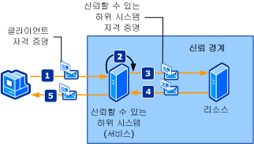

# <a name="trusted-subsystem"></a>신뢰할 수 있는 하위 시스템
클라이언트는 네트워크에 분산되어 있는 하나 이상의 웹 서비스에 액세스합니다. 웹 서비스는 데이터베이스 또는 기타 웹 서비스와 같은 추가 리소스에 대한 액세스가 해당 웹 서비스의 비즈니스 논리에 캡슐화되도록 디자인되어 있습니다. 이러한 리소스는 권한이 없는 액세스로부터 보호되어야 합니다. 다음 그림은 신뢰할 수 있는 하위 시스템 프로세스를 보여 줍니다.  
  
   
  
 그림에서처럼 다음 단계에서는 신뢰할 수 있는 하위 시스템 프로세스에 대해 설명합니다.  
  
1.  클라이언트는 자격 증명과 함께 신뢰할 수 있는 하위 시스템에 대한 요청을 제출합니다.  
  
2.  신뢰할 수 있는 하위 시스템은 사용자를 인증하고 사용자에게 권한을 부여합니다.  
  
3.  신뢰할 수 있는 하위 시스템은 원격 리소스로 요청 메시지를 보냅니다. 이 요청은 신뢰할 수 있는 하위 시스템 또는 신뢰할 수 있는 하위 시스템 프로세스가 실행 중인 서비스 계정에 대한 자격 증명과 함께 보내집니다.  
  
4.  백 엔드 리소스는 신뢰할 수 있는 하위 시스템을 인증하고 해당 시스템에 권한을 부여합니다. 그런 다음 해당 요청을 처리하고 신뢰할 수 있는 하위 시스템에 대한 응답을 보냅니다.  
  
5.  신뢰할 수 있는 하위 시스템은 해당 응답을 처리하고 클라이언트에 자체 응답을 보냅니다.  
  
|특성|설명|  
|--------------------|-----------------|  
|보안 모드|메시지|  
|상호 운용성|Windows Communication Foundation (WCF)만 있습니다.|  
|인증(서비스)|보안 토큰 서비스는 클라이언트를 인증하고 클라이언트에게 권한을 부여합니다.|  
|인증(클라이언트)|신뢰할 수 있는 하위 시스템은 클라이언트를 인증하고, 리소스는 신뢰할 수 있는 하위 시스템 서비스를 인증합니다.|  
|무결성|예|  
|기밀성|예|  
|전송|클라이언트와 신뢰할 수 있는 하위 시스템 서비스 간의 HTTP입니다.<br /><br /> 신뢰할 수 있는 하위 시스템 서비스와 리소스(백 엔드 서비스) 간의 NET.TCP입니다.|  
|바인딩|<xref:System.ServiceModel.WSHttpBinding> 및 <xref:System.ServiceModel.NetTcpBinding> [ \<wsFederationHttpBinding >](../../../../docs/framework/configure-apps/file-schema/wcf/wsfederationhttpbinding.md)|  
  
## <a name="resource-back-end-service"></a>리소스(백 엔드 서비스)  
  
### <a name="code"></a>코드  
 다음 코드에서는 TCP 전송 프로토콜에서 전송 보안을 사용하는 리소스의 서비스 끝점을 만드는 방법을 보여 줍니다.  
  
 [!code-csharp[TrustedSubSystemsResource#1](../../../../samples/snippets/csharp/VS_Snippets_CFX/trustedsubsystemsresource/cs/source.cs#1)]
 [!code-vb[TrustedSubSystemsResource#1](../../../../samples/snippets/visualbasic/VS_Snippets_CFX/trustedsubsystemsresource/vb/source.vb#1)]  
  
### <a name="configuration"></a>구성  
 다음 구성에서는 구성을 사용하여 동일한 끝점을 설정합니다.  
  
```xml  
<?xml version="1.0" encoding="utf-8" ?>  
<configuration>  
  <system.serviceModel>  
    <services>  
      <service name="Microsoft.ServiceModel.Samples.BackendService"  
               behaviorConfiguration="BackendServiceBehavior">  
        <endpoint address="net.tcp://localhost.com:8001/BackendService"  
                  binding="customBinding"  
                  bindingConfiguration="Binding1"  
                  contract="Microsoft.ServiceModel.Samples.ICalculator"/>  
      </service>  
    </services>  
    <bindings>  
      <customBinding>  
        <binding name="Binding1">  
          <security authenticationMode="UserNameOverTransport"/>  
          <windowsStreamSecurity/>  
          <tcpTransport/>  
        </binding>  
      </customBinding>  
    </bindings>  
    <behaviors>  
      <serviceBehaviors>  
        <behavior name="BackendServiceBehavior">  
          <serviceCredentials>  
            <userNameAuthentication userNamePasswordValidationMode="Custom"  
                                    customUserNamePasswordValidatorType="Microsoft.ServiceModel.Samples.MyUserNamePasswordValidator, BackendService"/>  
          </serviceCredentials>  
        </behavior>  
      </serviceBehaviors>  
    </behaviors>  
  </system.serviceModel>  
</configuration>  
```  
  
## <a name="trusted-subsystem"></a>신뢰할 수 있는 하위 시스템  
  
### <a name="code"></a>코드  
 다음 코드에서는 HTTP 프로토콜에서 메시지 보안을 사용하는 신뢰할 수 있는 하위 시스템에 대한 서비스 끝점과 인증용 사용자 이름 및 암호를 만드는 방법을 보여 줍니다.  
  
 [!code-csharp[TrustedSubSystems#1](../../../../samples/snippets/csharp/VS_Snippets_CFX/trustedsubsystems/cs/source.cs#1)]
 [!code-vb[TrustedSubSystems#1](../../../../samples/snippets/visualbasic/VS_Snippets_CFX/trustedsubsystems/vb/source.vb#1)]  
  
 다음 코드에서는 TCP 전송 프로토콜에서 전송 보안을 사용하여 백 엔드 서비스와 통신하는 신뢰할 수 있는 하위 시스템의 서비스를 보여 줍니다.  
  
 [!code-csharp[TrustedSubSystems#2](../../../../samples/snippets/csharp/VS_Snippets_CFX/trustedsubsystems/cs/source.cs#2)]
 [!code-vb[TrustedSubSystems#2](../../../../samples/snippets/visualbasic/VS_Snippets_CFX/trustedsubsystems/vb/source.vb#2)]  
  
### <a name="configuration"></a>구성  
 다음 구성에서는 구성을 사용하여 동일한 끝점을 설정합니다. 두 개의 바인딩 중 하나는 신뢰할 수 있는 하위 시스템에서 호스팅되는 서비스를 보안하고, 다른 하나는 신뢰할 수 있는 하위 시스템과 백 엔드 서비스 간의 통신을 담당합니다.  
  
```xml  
<?xml version="1.0" encoding="utf-8" ?>  
<configuration>  
  <system.serviceModel>  
    <services>  
      <service name="Microsoft.ServiceModel.Samples.FacadeService"  
               behaviorConfiguration="FacadeServiceBehavior">  
        <host>  
          <baseAddresses>  
            <add baseAddress="http://localhost:8000/FacadeService"/>  
          </baseAddresses>  
        </host>  
        <endpoint address="http://localhost:8000/FacadeService"  
                  binding="wsHttpBinding"  
                  bindingConfiguration="Binding1"  
                  contract="Microsoft.ServiceModel.Samples.ICalculator"/>  
      </service>  
    </services>  
    <client>  
      <endpoint name=""   
                address="net.tcp://contoso.com:8001/BackendService"  
                binding="customBinding"  
                bindingConfiguration="ClientBinding"  
                contract="Microsoft.ServiceModel.Samples.ICalculator"/>  
    </client>  
    <bindings>  
      <wsHttpBinding>  
        <binding name="Binding1">  
          <security mode="Message">  
            <message clientCredentialType="UserName"/>  
          </security>  
        </binding>  
      </wsHttpBinding>  
      <customBinding>  
        <binding name="ClientBinding">  
          <security authenticationMode="UserNameOverTransport"/>  
          <windowsStreamSecurity/>  
          <tcpTransport/>  
        </binding>  
      </customBinding>  
    </bindings>  
    <behaviors>  
      <serviceBehaviors>  
        <behavior name="FacadeServiceBehavior">  
          <serviceMetadata httpGetEnabled="True"/>  
          <serviceCredentials>  
            <serviceCertificate findValue="Contoso.com"  
                                storeLocation="LocalMachine"  
                                storeName="My"  
                                x509FindType="FindBySubjectName" />  
            <userNameAuthentication userNamePasswordValidationMode="Custom"  
                                    customUserNamePasswordValidatorType="Microsoft.ServiceModel.Samples.MyUserNamePasswordValidator, FacadeService"/>  
          </serviceCredentials>  
        </behavior>  
      </serviceBehaviors>  
    </behaviors>  
  </system.serviceModel>  
</configuration>  
```  
  
## <a name="client"></a>클라이언트  
  
### <a name="code"></a>코드  
 다음 코드에서는 HTTP 프로토콜에서 메시지 보안을 사용하여 신뢰할 수 있는 하위 시스템과 통신하는 클라이언트와 인증용 사용자 이름 및 암호를 만드는 방법을 보여 줍니다.  
  
 [!code-csharp[TrustedSubSystemsClient#1](../../../../samples/snippets/csharp/VS_Snippets_CFX/trustedsubsystemsclient/cs/source.cs#1)]
 [!code-vb[TrustedSubSystemsClient#1](../../../../samples/snippets/visualbasic/VS_Snippets_CFX/trustedsubsystemsclient/vb/source.vb#1)]  
  
### <a name="configuration"></a>구성  
 다음 코드에서는 HTTP 프로토콜에서 메시지 보안을 사용하고, 인증용 사용자 이름과 암호를 사용하도록 클라이언트를 구성합니다. 사용자 이름 및 암호는 코드(구성할 수 없음)를 사용해서만 지정할 수 있습니다.  
  
```xml  
<?xml version="1.0" encoding="utf-8" ?>  
<configuration>  
  <system.serviceModel>  
    <client>  
        <endpoint name=""   
                  address="http://www.cohowinery.com:8000/FacadeService"  
                  binding="wsHttpBinding"  
                  bindingConfiguration="Binding1"  
                  behaviorConfiguration="ClientUserNameBehavior"  
                  contract="Microsoft.ServiceModel.Samples.ICalculator"/>  
    </client>  
    <bindings>  
      <wsHttpBinding>  
        <binding name="Binding1">  
          <security mode="Message">  
            <message clientCredentialType="UserName"/>  
          </security>  
        </binding>  
      </wsHttpBinding>  
    </bindings>  
    <behaviors>  
      <endpointBehaviors>  
        <behavior name="ClientUserNameBehavior">  
          <clientCredentials>  
            <serviceCertificate>  
              <authentication certificateValidationMode="PeerOrChainTrust"/>  
            </serviceCertificate>  
          </clientCredentials>  
        </behavior>  
      </endpointBehaviors>  
    </behaviors>  
  </system.serviceModel>  
</configuration>  
```  
  
## <a name="see-also"></a>참고 항목  
 [보안 개요](../../../../docs/framework/wcf/feature-details/security-overview.md)  
 [Windows Server App Fabric에 대 한 보안 모델](http://go.microsoft.com/fwlink/?LinkID=201279&clcid=0x409)
