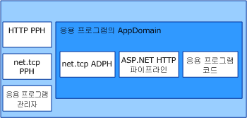

# <a name="was-activation-architecture"></a>WAS Activation 아키텍처
이 항목에서는 Windows Process Activation Service(WAS라고도 함)의 구성 요소를 항목별로 정리하고 설명합니다.  
  
## <a name="activation-components"></a>활성화 구성 요소  
 WAS는 여러 가지 아키텍처 구성 요소로 구성됩니다.  
  
-   수신기 어댑터. 특정 네트워크 프로토콜에서 메시지를 받고, 들어오는 메시지를 올바른 작업자 프로세스로 라우트하기 위해 WAS와 통신하는 Windows 서비스입니다.  
  
-   WAS. 작업자 프로세스 만들기 및 수명을 관리하는 Windows 서비스입니다.  
  
-   제네릭 작업자 프로세스 실행 파일(w3wp.exe).  
  
-   응용 프로그램 관리자. 작업자 프로세스 내에서 응용 프로그램을 호스팅하는 응용 프로그램 도메인 만들기 및 수명을 관리합니다.  
  
-   프로토콜 처리기. 작업자 프로세스에서 실행되고 작업자 프로세스와 개별 수신기 어댑터 간 통신을 관리하는 프로토콜 관련 구성 요소입니다. 프로토콜 처리기 형식에는 프로세스 프로토콜 처리기와 AppDomain 프로토콜 처리기가 있습니다.  
  
 WAS가 작업자 프로세스 인스턴스를 활성화하면 작업자 프로세스에 필요한 프로세스 프로토콜 처리기를 로드하고, 응용 프로그램 관리자를 사용하여 응용 프로그램을 호스트할 응용 프로그램 도메인을 만듭니다. 응용 프로그램 도메인은 응용 프로그램에서 사용하는 네트워크 프로토콜에 필요한 AppDomain 프로토콜 처리기와 응용 프로그램의 코드를 로드합니다.  
  
   
  
### <a name="listener-adapters"></a>수신기 어댑터  
 수신기 어댑터는 수신 대기하는 네트워크 프로토콜을 사용하여 메시지를 받는 데 사용되는 네트워크 통신 논리를 구현하는 개별 Windows 서비스입니다. 다음 표에서 Windows Communication Foundation (WCF) 프로토콜의 수신기 어댑터를 나열합니다.  
  
|수신기 어댑터 서비스 이름|프로토콜|노트|  
|-----------------------------------|--------------|-----------|  
|W3SVC|http|IIS 7.0과 WCF 둘 다에 대해 HTTP 활성화를 제공 하는 일반적인 구성 요소입니다.|  
|NetTcpActivator|net.tcp|NetTcpPortSharing 서비스에 따라 다릅니다.|  
|NetPipeActivator|net.pipe||  
|NetMsmqActivator|net.msmq|WCF 기반 메시지 큐 응용 프로그램과 함께 사용할 수 있습니다.|  
|NetMsmqActivator|msmq.formatname|이전 버전의 기존 메시지 큐 응용 프로그램과의 호환성을 제공합니다.|  
  
 특정 프로토콜의 수신기 어댑터는 다음 XML 예제에서처럼 설치하는 동안 applicationHost.config 파일에 등록됩니다.  
  
```xml  
<system.applicationHost>  
    <listenerAdapters>  
        <add name="http" />  
        <add name="net.tcp"   
          identity="S-1-5-80-3579033775-2824656752-1522793541-1960352512-462907086" />  
         <add name="net.pipe"   
           identity="S-1-5-80-2943419899-937267781-4189664001-1229628381-3982115073" />  
          <add name="net.msmq"   
            identity="S-1-5-80-89244771-1762554971-1007993102-348796144-2203111529" />  
           <add name="msmq.formatname"   
             identity="S-1-5-80-89244771-1762554971-1007993102-348796144-2203111529" />  
    </listenerAdapters>  
</system.applicationHost>  
```  
  
### <a name="protocol-handlers"></a>프로토콜 처리기  
 특정 프로토콜에 대한 프로세스 및 AppDomain 프로토콜 처리기는 시스템 수준의 Web.config 파일에 등록됩니다.  
  
```xml  
<system.web>  
   <protocols>  
      <add name="net.tcp"   
        processHandlerType=  
         "System.ServiceModel.WasHosting.TcpProcessProtocolHandler"  
        appDomainHandlerType=  
         "System.ServiceModel.WasHosting.TcpAppDomainProtocolHandler"  
        validate="false" />  
      <add name="net.pipe"   
        processHandlerType=  
         "System.ServiceModel.WasHosting.NamedPipeProcessProtocolHandler"  
          appDomainHandlerType=  
           "System.ServiceModel.WasHosting.NamedPipeAppDomainProtocolHandler"/>  
      <add name="net.msmq"  
        processHandlerType=  
         "System.ServiceModel.WasHosting.MsmqProcessProtocolHandler"  
        appDomainHandlerType=  
         "System.ServiceModel.WasHosting.MsmqAppDomainProtocolHandler"  
        validate="false" />  
   </protocols>  
</system.web>  
```  
  
## <a name="see-also"></a>참고 항목  
 [WCF와 함께 사용하도록 WAS 구성](../../../../docs/framework/wcf/feature-details/configuring-the-wpa--service-for-use-with-wcf.md)  
 [Windows Server App Fabric 호스팅 기능](http://go.microsoft.com/fwlink/?LinkId=201276)
