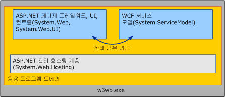

# <a name="wcf-services-and-aspnet"></a><span data-ttu-id="0e6ff-102">WCF 서비스 및 ASP.NET</span><span class="sxs-lookup"><span data-stu-id="0e6ff-102">WCF Services and ASP.NET</span></span>
<span data-ttu-id="0e6ff-103">이 항목에서는 ASP.NET과 함께 [!INCLUDE[indigo1](../../../../includes/indigo1-md.md)] 서비스를 호스트하는 경우 및 ASP.NET 호환 모드에서 WCF 서비스를 호스트하는 경우에 대해 설명합니다.</span><span class="sxs-lookup"><span data-stu-id="0e6ff-103">This topic discusses hosting [!INCLUDE[indigo1](../../../../includes/indigo1-md.md)] services side-by-side with ASP.NET and hosting them in ASP.NET compatibility mode.</span></span>  
  
## <a name="hosting-wcf-side-by-side-with-aspnet"></a><span data-ttu-id="0e6ff-104">ASP.NET과 함께 WCF 호스팅</span><span class="sxs-lookup"><span data-stu-id="0e6ff-104">Hosting WCF Side-by-Side with ASP.NET</span></span>  
 <span data-ttu-id="0e6ff-105">IIS(인터넷 정보 서비스)에서 호스트되는 [!INCLUDE[indigo2](../../../../includes/indigo2-md.md)] 서비스는 하나의 일반적인 응용 프로그램 도메인 내에 ASPX 웹 서비스 및 .ASPX 페이지와 함께 위치할 수 있습니다.</span><span class="sxs-lookup"><span data-stu-id="0e6ff-105">[!INCLUDE[indigo2](../../../../includes/indigo2-md.md)] services hosted in Internet Information Services (IIS) can be located with .ASPX pages and ASMX Web services inside of a single, common Application Domain.</span></span> <span data-ttu-id="0e6ff-106">ASP.NET은 [!INCLUDE[indigo2](../../../../includes/indigo2-md.md)] 및 ASP.NET HTTP 런타임 모두에 대해 AppDomain 관리 및 동적 컴파일과 같은 공통 인프라 서비스를 제공합니다.</span><span class="sxs-lookup"><span data-stu-id="0e6ff-106">ASP.NET provides common infrastructure services such as AppDomain management and dynamic compilation for both [!INCLUDE[indigo2](../../../../includes/indigo2-md.md)] and the ASP.NET HTTP runtime.</span></span> <span data-ttu-id="0e6ff-107">[!INCLUDE[indigo2](../../../../includes/indigo2-md.md)]의 기본 구성은 ASP.NET과 함께 수행됩니다.</span><span class="sxs-lookup"><span data-stu-id="0e6ff-107">The default configuration for [!INCLUDE[indigo2](../../../../includes/indigo2-md.md)] is side-by-side with ASP.NET.</span></span>  
  
 <span data-ttu-id="0e6ff-108"></span><span class="sxs-lookup"><span data-stu-id="0e6ff-108"></span></span>  
  
 <span data-ttu-id="0e6ff-109">ASP.NET HTTP 런타임은 ASP.NET 요청을 처리하지만 [!INCLUDE[indigo2](../../../../includes/indigo2-md.md)] 서비스가 ASP.NET 내용과 동일한 AppDomain에서 호스트되더라도 이러한 서비스가 대상인 요청을 처리하는 작업에는 참여하지 않습니다.</span><span class="sxs-lookup"><span data-stu-id="0e6ff-109">The ASP.NET HTTP runtime handles ASP.NET requests but does not participate in the processing of requests destined for [!INCLUDE[indigo2](../../../../includes/indigo2-md.md)] services, even though these services are hosted in the same AppDomain as is the ASP.NET content.</span></span> <span data-ttu-id="0e6ff-110">대신 [!INCLUDE[indigo2](../../../../includes/indigo2-md.md)] 서비스 모델이 [!INCLUDE[indigo2](../../../../includes/indigo2-md.md)] 서비스에 주소가 지정된 메시지를 가로채고 이러한 메시지를 [!INCLUDE[indigo2](../../../../includes/indigo2-md.md)] 전송/채널 스택을 통해 라우팅합니다.</span><span class="sxs-lookup"><span data-stu-id="0e6ff-110">Instead, the [!INCLUDE[indigo2](../../../../includes/indigo2-md.md)] Service Model intercepts messages addressed to [!INCLUDE[indigo2](../../../../includes/indigo2-md.md)] services and routes them through the [!INCLUDE[indigo2](../../../../includes/indigo2-md.md)] transport/channel stack.</span></span>  
  
 <span data-ttu-id="0e6ff-111">동시 모델의 결과는 다음과 같습니다.</span><span class="sxs-lookup"><span data-stu-id="0e6ff-111">The results of the side-by-side model are as follows:</span></span>  
  
-   <span data-ttu-id="0e6ff-112">ASP.NET 및 [!INCLUDE[indigo2](../../../../includes/indigo2-md.md)] 서비스는 AppDomain 상태를 공유할 수 있습니다.</span><span class="sxs-lookup"><span data-stu-id="0e6ff-112">ASP.NET and [!INCLUDE[indigo2](../../../../includes/indigo2-md.md)] services can share AppDomain state.</span></span> <span data-ttu-id="0e6ff-113">또한 두 개의 프레임워크가 동일한 AppDomain에 함께 있을 수 있기 때문에 [!INCLUDE[indigo2](../../../../includes/indigo2-md.md)]는 ASP.NET과 AppDomain 상태를 공유할 수 있습니다(정적 변수, 이벤트 등 포함).</span><span class="sxs-lookup"><span data-stu-id="0e6ff-113">Because the two frameworks can coexist in the same AppDomain, [!INCLUDE[indigo2](../../../../includes/indigo2-md.md)] can also share AppDomain state with ASP.NET (including static variables, events, and so on).</span></span>  
  
-   [!INCLUDE[indigo2](../../../../includes/indigo2-md.md)]<span data-ttu-id="0e6ff-114"> 서비스는 호스팅 환경 및 전송과 독립적으로 일관성 있게 동작합니다.</span><span class="sxs-lookup"><span data-stu-id="0e6ff-114"> services behave consistently, independent of hosting environment and transport.</span></span> <span data-ttu-id="0e6ff-115">ASP.NET HTTP 런타임은 IIS/ASP.NET 호스팅 환경 및 HTTP 통신에 의도적으로 연결됩니다.</span><span class="sxs-lookup"><span data-stu-id="0e6ff-115">The ASP.NET HTTP runtime is intentionally coupled to the IIS/ASP.NET hosting environment and HTTP communication.</span></span> <span data-ttu-id="0e6ff-116">반대로, [!INCLUDE[indigo2](../../../../includes/indigo2-md.md)]는 호스팅 환경에서 일관성 있게 동작하고([!INCLUDE[indigo2](../../../../includes/indigo2-md.md)]가 IIS 내부 및 외부 모두에서 일관성 있게 동작) 전송을 통해 일관성 있게 동작하도록(노출된 일부 끝점이 HTTP 이외의 프로토콜을 사용하더라도 IIS 7.0 이상에서 호스트되는 서비스는 노출된 모든 끝점에서 일관성 있게 동작) 설계되었습니다.</span><span class="sxs-lookup"><span data-stu-id="0e6ff-116">Conversely, [!INCLUDE[indigo2](../../../../includes/indigo2-md.md)] is designed to behave consistently across hosting environments ([!INCLUDE[indigo2](../../../../includes/indigo2-md.md)] behaves consistently both inside and outside of IIS) and across transport (a service hosted in IIS 7.0 and later has consistent behavior across all endpoints it exposes, even if some of those endpoints use protocols other than HTTP).</span></span>  
  
-   <span data-ttu-id="0e6ff-117">AppDomain 내에서 HTTP 런타임에 의해 구현되는 기능은 ASP.NET 내용에는 적용되지만 [!INCLUDE[indigo2](../../../../includes/indigo2-md.md)]에는 적용되지 않습니다.</span><span class="sxs-lookup"><span data-stu-id="0e6ff-117">Within an AppDomain, features implemented by the HTTP runtime apply to ASP.NET content but not to [!INCLUDE[indigo2](../../../../includes/indigo2-md.md)].</span></span> <span data-ttu-id="0e6ff-118">ASP.NET 응용 프로그램 플랫폼의 많은 HTTP 관련 기능은 ASP.NET 내용이 포함된 AppDomain의 내부에서 호스트되는 [!INCLUDE[indigo2](../../../../includes/indigo2-md.md)] 서비스에 적용되지 않습니다.</span><span class="sxs-lookup"><span data-stu-id="0e6ff-118">Many HTTP-specific features of the ASP.NET application platform do not apply to [!INCLUDE[indigo2](../../../../includes/indigo2-md.md)] Services hosted inside of an AppDomain that contains ASP.NET content.</span></span> <span data-ttu-id="0e6ff-119">이러한 기능의 예는 다음과 같습니다.</span><span class="sxs-lookup"><span data-stu-id="0e6ff-119">Examples of these features include the following:</span></span>  
  
    -   <span data-ttu-id="0e6ff-120">HttpContext: <xref:System.Web.HttpContext.Current%2A>는 `null` 서비스 내에서 액세스한 경우 항상 [!INCLUDE[indigo2](../../../../includes/indigo2-md.md)]입니다.</span><span class="sxs-lookup"><span data-stu-id="0e6ff-120">HttpContext: <xref:System.Web.HttpContext.Current%2A> is always `null` when accessed from within a [!INCLUDE[indigo2](../../../../includes/indigo2-md.md)] service.</span></span> <span data-ttu-id="0e6ff-121">사용 하 여 <!--zz <xref:System.ServiceModel.OperationContext.Current.RequestContext>--> `RequestContext` 대신 합니다.</span><span class="sxs-lookup"><span data-stu-id="0e6ff-121">Use <!--zz <xref:System.ServiceModel.OperationContext.Current.RequestContext>--> `RequestContext` instead.</span></span>  
  
    -   <span data-ttu-id="0e6ff-122">파일 기반 권한 부여: [!INCLUDE[indigo2](../../../../includes/indigo2-md.md)] 보안 모델은 서비스 요청에 권한이 부여되어 있는지 여부를 확인할 때 서비스의 .svc 파일에 ACL(액세스 제어 목록)이 적용되는 것을 허용하지 않습니다.</span><span class="sxs-lookup"><span data-stu-id="0e6ff-122">File-based authorization: The [!INCLUDE[indigo2](../../../../includes/indigo2-md.md)] security model does not allow for the access control list (ACL) applied to the .svc file of the service when deciding if a service request is authorized.</span></span>  
  
    -   <span data-ttu-id="0e6ff-123">구성 기반 URL 권한 부여: 마찬가지로,는 [!INCLUDE[indigo2](../../../../includes/indigo2-md.md)] 보안 모델은 System.Web의에 지정 된 URL 기반 권한 부여 규칙을 따르지 않으면 \<권한 부여 > 구성 요소입니다.</span><span class="sxs-lookup"><span data-stu-id="0e6ff-123">Configuration-based URL Authorization: Similarly, the [!INCLUDE[indigo2](../../../../includes/indigo2-md.md)] security model does not adhere to any URL-based authorization rules specified in System.Web’s \<authorization> configuration element.</span></span> <span data-ttu-id="0e6ff-124">이러한 설정은 서비스가 ASP.NET의 URL 권한 부여 규칙에 의해 보안이 유지되는 URL 공간에 있는 경우 [!INCLUDE[indigo2](../../../../includes/indigo2-md.md)] 요청에 대해 무시됩니다.</span><span class="sxs-lookup"><span data-stu-id="0e6ff-124">These settings are ignored for [!INCLUDE[indigo2](../../../../includes/indigo2-md.md)] requests if a service resides in a URL space secured by ASP.NET’s URL authorization rules.</span></span>  
  
    -   <span data-ttu-id="0e6ff-125">HttpModule 확장성: [!INCLUDE[indigo2](../../../../includes/indigo2-md.md)] 호스팅 인프라는 [!INCLUDE[indigo2](../../../../includes/indigo2-md.md)] 이벤트가 발생하고 처리를 ASP.NET HTTP 파이프라인에 반환하지 않는 경우 <xref:System.Web.HttpApplication.PostAuthenticateRequest> 요청을 가로챕니다.</span><span class="sxs-lookup"><span data-stu-id="0e6ff-125">HttpModule extensibility: The [!INCLUDE[indigo2](../../../../includes/indigo2-md.md)] hosting infrastructure intercepts [!INCLUDE[indigo2](../../../../includes/indigo2-md.md)] requests when the <xref:System.Web.HttpApplication.PostAuthenticateRequest> event is raised and does not return processing to the ASP.NET HTTP pipeline.</span></span> <span data-ttu-id="0e6ff-126">파이프라인의 후반 단계에서 요청을 가로채도록 코딩된 모듈은 [!INCLUDE[indigo2](../../../../includes/indigo2-md.md)] 요청을 가로채지 않습니다.</span><span class="sxs-lookup"><span data-stu-id="0e6ff-126">Modules that are coded to intercept requests at later stages of the pipeline do not intercept [!INCLUDE[indigo2](../../../../includes/indigo2-md.md)] requests.</span></span>  
  
    -   <span data-ttu-id="0e6ff-127">ASP.NET 가장: 기본적으로 [!INCLUDE[indigo2](../../../../includes/indigo2-md.md)] 요청 항상 실행으로 IIS 프로세스 id, ASP.NET이 System.Web의를 사용 하 여 가장을 사용 하도록 설정 되어 있더라도 \<identity impersonate = "true" / > 구성 옵션입니다.</span><span class="sxs-lookup"><span data-stu-id="0e6ff-127">ASP.NET impersonation: By default, [!INCLUDE[indigo2](../../../../includes/indigo2-md.md)] requests always runs as the IIS process identity, even if ASP.NET is set to enable impersonation using System.Web’s \<identity impersonate="true" /> configuration option.</span></span>  
  
 <span data-ttu-id="0e6ff-128">이러한 제한 사항은 IIS 응용 프로그램에서 호스트되는 [!INCLUDE[indigo2](../../../../includes/indigo2-md.md)] 서비스에만 적용됩니다.</span><span class="sxs-lookup"><span data-stu-id="0e6ff-128">These restrictions apply only to [!INCLUDE[indigo2](../../../../includes/indigo2-md.md)] services hosted in IIS application.</span></span> <span data-ttu-id="0e6ff-129">ASP.NET 내용의 동작은 [!INCLUDE[indigo2](../../../../includes/indigo2-md.md)] 존재 유무에 영향을 받지 않습니다.</span><span class="sxs-lookup"><span data-stu-id="0e6ff-129">The behavior of ASP.NET content is not affected by the presence of [!INCLUDE[indigo2](../../../../includes/indigo2-md.md)].</span></span>  
  
 <span data-ttu-id="0e6ff-130">일반적으로 HTTP 파이프라인에서 제공되는 기능이 필요한 [!INCLUDE[indigo2](../../../../includes/indigo2-md.md)] 응용 프로그램은 다음과 같이 호스트 및 전송 독립적인 [!INCLUDE[indigo2](../../../../includes/indigo2-md.md)]의 동일한 기능을 사용할지 고려해야 합니다.</span><span class="sxs-lookup"><span data-stu-id="0e6ff-130">[!INCLUDE[indigo2](../../../../includes/indigo2-md.md)] applications that require functionality traditionally provided by the HTTP pipeline should consider using the [!INCLUDE[indigo2](../../../../includes/indigo2-md.md)] equivalents, which are host and transport independent:</span></span>  
  
-   <span data-ttu-id="0e6ff-131"><xref:System.ServiceModel.OperationContext> 대신 <xref:System.Web.HttpContext> 사용</span><span class="sxs-lookup"><span data-stu-id="0e6ff-131"><xref:System.ServiceModel.OperationContext> instead of <xref:System.Web.HttpContext>.</span></span>  
  
-   <span data-ttu-id="0e6ff-132">ASP.NET의 File/URL 권한 부여 대신 <xref:System.ServiceModel.Description.ServiceAuthorizationBehavior> 사용</span><span class="sxs-lookup"><span data-stu-id="0e6ff-132"><xref:System.ServiceModel.Description.ServiceAuthorizationBehavior> instead of ASP.NET’s File/URL Authorization.</span></span>  
  
-   <span data-ttu-id="0e6ff-133">HTTP 모듈 대신 <xref:System.ServiceModel.Dispatcher.IDispatchMessageInspector> 또는 사용자 지정 계층화된 채널 사용</span><span class="sxs-lookup"><span data-stu-id="0e6ff-133"><xref:System.ServiceModel.Dispatcher.IDispatchMessageInspector> or custom layered channels instead of HTTP modules.</span></span>  
  
-   <span data-ttu-id="0e6ff-134">System.Web 가장 대신 [!INCLUDE[indigo2](../../../../includes/indigo2-md.md)]를 사용하는 각 작업에 대한 가장 사용</span><span class="sxs-lookup"><span data-stu-id="0e6ff-134">Impersonation for each operation using [!INCLUDE[indigo2](../../../../includes/indigo2-md.md)] instead of System.Web impersonation.</span></span>  
  
 <span data-ttu-id="0e6ff-135">또는 [!INCLUDE[indigo2](../../../../includes/indigo2-md.md)]의 ASP.NET 호환 모드에서 서비스를 실행할 것을 고려할 수 있습니다.</span><span class="sxs-lookup"><span data-stu-id="0e6ff-135">Alternatively, you can consider running your services in [!INCLUDE[indigo2](../../../../includes/indigo2-md.md)]’s ASP.NET compatibility mode.</span></span>  
  
## <a name="hosting-wcf-services-in-aspnet-compatibility-mode"></a><span data-ttu-id="0e6ff-136">ASP.NET 호환 모드에서 WCF 서비스 호스팅</span><span class="sxs-lookup"><span data-stu-id="0e6ff-136">Hosting WCF Services in ASP.NET Compatibility Mode</span></span>  
 <span data-ttu-id="0e6ff-137">[!INCLUDE[indigo2](../../../../includes/indigo2-md.md)] 모델이 호스팅 환경 및 전송에서 일관성 있게 동작하도록 디자인되었지만 응용 프로그램이 이러한 수준의 유연성을 필요로 하지 않는 경우가 종종 있습니다.</span><span class="sxs-lookup"><span data-stu-id="0e6ff-137">Although the [!INCLUDE[indigo2](../../../../includes/indigo2-md.md)] model is designed to behave consistently across hosting environments and transports, there are often scenarios where an application does not require this degree of flexibility.</span></span> [!INCLUDE[indigo2](../../../../includes/indigo2-md.md)]<span data-ttu-id="0e6ff-138">의 ASP.NET 호환 모드는 IIS 외부에서 호스트하거나 HTTP 이외의 프로토콜을 통해 통신하는 기능은 필요 없지만 ASP.NET 웹 응용 프로그램 플랫폼의 모든 기능을 사용하는 경우에 적합합니다.</span><span class="sxs-lookup"><span data-stu-id="0e6ff-138">’s ASP.NET compatibility mode is suitable for scenarios that do not require the ability to host outside of IIS or to communicate over protocols other than HTTP, but that use all of features of the ASP.NET Web application platform.</span></span>  
  
 <span data-ttu-id="0e6ff-139">[!INCLUDE[indigo2](../../../../includes/indigo2-md.md)] 호스팅 인프라가 [!INCLUDE[indigo2](../../../../includes/indigo2-md.md)] 메시지를 가로채고 HTTP 파이프라인에서 이러한 메시지를 라우트하는 기본 동시 구성과는 달리, ASP.NET 호환 모드에서 실행되는 [!INCLUDE[indigo2](../../../../includes/indigo2-md.md)] 서비스는 ASP.NET HTTP 요청 수명에 완전히 참여합니다.</span><span class="sxs-lookup"><span data-stu-id="0e6ff-139">Unlike the default side-by-side configuration, where the [!INCLUDE[indigo2](../../../../includes/indigo2-md.md)] hosting infrastructure intercepts [!INCLUDE[indigo2](../../../../includes/indigo2-md.md)] messages and routes them out of the HTTP pipeline, [!INCLUDE[indigo2](../../../../includes/indigo2-md.md)] services running in ASP.NET Compatibility Mode participate fully in the ASP.NET HTTP request lifecycle.</span></span> <span data-ttu-id="0e6ff-140">호환 모드에서 [!INCLUDE[indigo2](../../../../includes/indigo2-md.md)] 서비스는 <xref:System.Web.IHttpHandler> 구현을 통해 HTTP 파이프라인을 사용하며, 이것은 ASPX 페이지 및 ASMX 웹 서비스의 요청이 처리되는 방법과 비슷합니다.</span><span class="sxs-lookup"><span data-stu-id="0e6ff-140">In compatibility mode, [!INCLUDE[indigo2](../../../../includes/indigo2-md.md)] services use the HTTP pipeline through an <xref:System.Web.IHttpHandler> implementation, similar to the way requests for ASPX pages and ASMX Web services are handled.</span></span> <span data-ttu-id="0e6ff-141">결과적으로 [!INCLUDE[indigo2](../../../../includes/indigo2-md.md)]는 다음 ASP.NET 기능과 관련하여 ASMX와 동일하게 동작합니다.</span><span class="sxs-lookup"><span data-stu-id="0e6ff-141">As a result, [!INCLUDE[indigo2](../../../../includes/indigo2-md.md)] behaves identically to ASMX with respect to the following ASP.NET features:</span></span>  
  
-   <span data-ttu-id="0e6ff-142"><xref:System.Web.HttpContext>: ASP.NET 호환 모드에서 실행되는 [!INCLUDE[indigo2](../../../../includes/indigo2-md.md)] 서비스는 <xref:System.Web.HttpContext.Current%2A> 및 연결된 상태에 액세스할 수 있습니다.</span><span class="sxs-lookup"><span data-stu-id="0e6ff-142"><xref:System.Web.HttpContext>: [!INCLUDE[indigo2](../../../../includes/indigo2-md.md)] services running in ASP.NET Compatibility Mode can access <xref:System.Web.HttpContext.Current%2A> and its associated state.</span></span>  
  
-   <span data-ttu-id="0e6ff-143">파일 기반 권한 부여: ASP.NET 호환 모드에서 실행되는 [!INCLUDE[indigo2](../../../../includes/indigo2-md.md)] 서비스는 파일 시스템 ACL(액세스 제어 목록)을 서비스의 .svc 파일에 첨부하여 보안을 유지할 수 있습니다.</span><span class="sxs-lookup"><span data-stu-id="0e6ff-143">File-based authorization: [!INCLUDE[indigo2](../../../../includes/indigo2-md.md)] services running in ASP.NET compatibility mode can be secure by attaching file system access control lists (ACLs) to the service’s .svc file.</span></span>  
  
-   <span data-ttu-id="0e6ff-144">구성 가능한 URL 권한 부여: ASP.NET의 URL 권한 부여 규칙은 [!INCLUDE[indigo2](../../../../includes/indigo2-md.md)] 서비스가 ASP.NET 호환 모드에서 실행 중일 때 [!INCLUDE[indigo2](../../../../includes/indigo2-md.md)] 요청에 적용됩니다.</span><span class="sxs-lookup"><span data-stu-id="0e6ff-144">Configurable URL authorization: ASP.NET’s URL authorization rules are enforced for [!INCLUDE[indigo2](../../../../includes/indigo2-md.md)] requests when the [!INCLUDE[indigo2](../../../../includes/indigo2-md.md)] service is running in ASP.NET Compatibility Mode.</span></span>  
  
-   <span data-ttu-id="0e6ff-145"><xref:System.Web.HttpModuleCollection> 확장성: ASP.NET 호환 모드에서 실행되는 [!INCLUDE[indigo2](../../../../includes/indigo2-md.md)] 서비스는 ASP.NET HTTP 요청 수명에 완전히 참여하기 때문에 HTTP 파이프라인에서 구성된 모든 HTTP 모듈은 서비스 호출 이전 및 이후 모두 [!INCLUDE[indigo2](../../../../includes/indigo2-md.md)] 요청에 대해 작동할 수 있습니다.</span><span class="sxs-lookup"><span data-stu-id="0e6ff-145"><xref:System.Web.HttpModuleCollection> extensibility: Because [!INCLUDE[indigo2](../../../../includes/indigo2-md.md)] services running in ASP.NET Compatibility Mode participate fully in the ASP.NET HTTP request lifecycle, any HTTP module configured in the HTTP pipeline is able to operate on [!INCLUDE[indigo2](../../../../includes/indigo2-md.md)] requests both before and after service invocation.</span></span>  
  
-   <span data-ttu-id="0e6ff-146">ASP.NET 가장: [!INCLUDE[indigo2](../../../../includes/indigo2-md.md)] 서비스는 ASP.NET 가장 스레드의 현재 ID를 사용하여 실행되며, 이것은 ASP.NET 가장이 응용 프로그램에 대해 활성화된 경우 IIS 프로세스 ID와 다를 수 있습니다.</span><span class="sxs-lookup"><span data-stu-id="0e6ff-146">ASP.NET Impersonation: [!INCLUDE[indigo2](../../../../includes/indigo2-md.md)] services run using the current identity of the ASP.NET impersonated thread, which may be different than the IIS process identity if ASP.NET impersonation has been enabled for the application.</span></span> <span data-ttu-id="0e6ff-147">ASP.NET 가장 및 [!INCLUDE[indigo2](../../../../includes/indigo2-md.md)] 가장 모두 특정 서비스 작업에 대해 활성화되면 서비스 구현은 결국 [!INCLUDE[indigo2](../../../../includes/indigo2-md.md)]에서 가져온 ID를 사용하여 실행됩니다.</span><span class="sxs-lookup"><span data-stu-id="0e6ff-147">If ASP.NET impersonation and [!INCLUDE[indigo2](../../../../includes/indigo2-md.md)] impersonation are both enabled for a particular service operation, the service implementation ultimately runs using the identity obtained from [!INCLUDE[indigo2](../../../../includes/indigo2-md.md)].</span></span>  
  
 [!INCLUDE[indigo2](../../../../includes/indigo2-md.md)]<span data-ttu-id="0e6ff-148">의 ASP.NET 호환 모드는 다음 구성을 통해 응용 프로그램 수준에서 활성화됩니다(응용 프로그램의 Web.config 파일에 위치).</span><span class="sxs-lookup"><span data-stu-id="0e6ff-148">’s ASP.NET compatibility mode is enabled at the application level through the following configuration (located in the application’s Web.config file):</span></span>  
  
```xml  
<system.serviceModel>  
    <serviceHostingEnvironment aspNetCompatibilityEnabled="true" />  
</system.serviceModel>  
```  
  
 <span data-ttu-id="0e6ff-149">기본값은 "`true`" 지정 하지 않은 경우.</span><span class="sxs-lookup"><span data-stu-id="0e6ff-149">This value defaults to "`true`" if not specified.</span></span> <span data-ttu-id="0e6ff-150">이 값을 설정 "`false`" 나타내는 모든 [!INCLUDE[indigo2](../../../../includes/indigo2-md.md)] 응용 프로그램에서 실행 되는 서비스는 ASP.NET 호환 모드에서 실행 되지 것입니다.</span><span class="sxs-lookup"><span data-stu-id="0e6ff-150">Setting this value to "`false`" indicates that all [!INCLUDE[indigo2](../../../../includes/indigo2-md.md)] services running in the application will not run in ASP.NET Compatibility Mode.</span></span>  
  
 <span data-ttu-id="0e6ff-151">ASP.NET 호환 모드는 기본적으로 [!INCLUDE[indigo2](../../../../includes/indigo2-md.md)] 기본값과는 다른 요청 처리 의미 체계를 의미하기 때문에 개별 서비스 구현에는 ASP.NET 호환 모드가 활성화된 응용 프로그램 내에서 실행할지 여부를 제어하는 기능이 있습니다.</span><span class="sxs-lookup"><span data-stu-id="0e6ff-151">Because ASP.NET Compatibility Mode implies request processing semantics that are fundamentally different from the [!INCLUDE[indigo2](../../../../includes/indigo2-md.md)] default, individual service implementations have the ability to control whether they run inside of an application for which ASP.NET Compatibility Mode has been enabled.</span></span> <span data-ttu-id="0e6ff-152">서비스는 <xref:System.ServiceModel.Activation.AspNetCompatibilityRequirementsAttribute>를 사용하여 ASP.NET 호환 모드를 지원할지 여부를 나타낼 수 있습니다.</span><span class="sxs-lookup"><span data-stu-id="0e6ff-152">Services can use the <xref:System.ServiceModel.Activation.AspNetCompatibilityRequirementsAttribute> to indicate whether they support ASP.NET Compatibility Mode.</span></span> <span data-ttu-id="0e6ff-153">이 특성의 기본값은 <xref:System.ServiceModel.Activation.AspNetCompatibilityRequirementsMode.Allowed>입니다.</span><span class="sxs-lookup"><span data-stu-id="0e6ff-153">The default value for this attribute is <xref:System.ServiceModel.Activation.AspNetCompatibilityRequirementsMode.Allowed>.</span></span>  
  
 `[AspNetCompatibilityRequirements(RequirementsMode = AspNetCompatibilityRequirementsMode.Allowed)]`  
  
 `public class CalculatorService : ICalculatorSession`  
  
 `{//Implement calculator service methods.}`  
  
 <span data-ttu-id="0e6ff-154">다음 표에서는 응용 프로그램 수준의 호환 모드 설정이 개별 서비스에 명시된 지원 수준과 상호 작용하는 방법을 보여 줍니다.</span><span class="sxs-lookup"><span data-stu-id="0e6ff-154">The following table illustrates how the application-wide compatibility mode setting interacts with the individual service’s stated level of support:</span></span>  
  
|<span data-ttu-id="0e6ff-155">응용 프로그램 수준의 호환 모드 설정</span><span class="sxs-lookup"><span data-stu-id="0e6ff-155">Application-wide Compatibility Mode setting</span></span>|<span data-ttu-id="0e6ff-156">[AspNetCompatibilityRequirementsMode]</span><span class="sxs-lookup"><span data-stu-id="0e6ff-156">[AspNetCompatibilityRequirementsMode]</span></span><br /><br /> <span data-ttu-id="0e6ff-157">설정</span><span class="sxs-lookup"><span data-stu-id="0e6ff-157">Setting</span></span>|<span data-ttu-id="0e6ff-158">확인된 결과</span><span class="sxs-lookup"><span data-stu-id="0e6ff-158">Observed Result</span></span>|  
|--------------------------------------------------|---------------------------------------------------------|---------------------|  
|<span data-ttu-id="0e6ff-159">aspNetCompatibilityEnabled = "`true`"</span><span class="sxs-lookup"><span data-stu-id="0e6ff-159">aspNetCompatibilityEnabled = "`true`"</span></span>|<xref:System.ServiceModel.Activation.AspNetCompatibilityRequirementsMode.Required>|<span data-ttu-id="0e6ff-160">서비스가 활성화됩니다.</span><span class="sxs-lookup"><span data-stu-id="0e6ff-160">Service activates successfully.</span></span>|  
|<span data-ttu-id="0e6ff-161">aspNetCompatibilityEnabled = "`true`"</span><span class="sxs-lookup"><span data-stu-id="0e6ff-161">aspNetCompatibilityEnabled = "`true`"</span></span>|<xref:System.ServiceModel.Activation.AspNetCompatibilityRequirementsMode.Allowed>|<span data-ttu-id="0e6ff-162">서비스가 활성화됩니다.</span><span class="sxs-lookup"><span data-stu-id="0e6ff-162">Service activates successfully.</span></span>|  
|<span data-ttu-id="0e6ff-163">aspNetCompatibilityEnabled = "`true`"</span><span class="sxs-lookup"><span data-stu-id="0e6ff-163">aspNetCompatibilityEnabled = "`true`"</span></span>|<xref:System.ServiceModel.Activation.AspNetCompatibilityRequirementsMode.NotAllowed>|<span data-ttu-id="0e6ff-164">서비스가 메시지를 수신할 때 활성화 오류가 발생합니다.</span><span class="sxs-lookup"><span data-stu-id="0e6ff-164">An activation error occurs when the service receives a message.</span></span>|  
|<span data-ttu-id="0e6ff-165">aspNetCompatibilityEnabled = "`false`"</span><span class="sxs-lookup"><span data-stu-id="0e6ff-165">aspNetCompatibilityEnabled = "`false`"</span></span>|<xref:System.ServiceModel.Activation.AspNetCompatibilityRequirementsMode.Required>|<span data-ttu-id="0e6ff-166">서비스가 메시지를 수신할 때 활성화 오류가 발생합니다.</span><span class="sxs-lookup"><span data-stu-id="0e6ff-166">An activation error occurs when the service receives a message.</span></span>|  
|<span data-ttu-id="0e6ff-167">aspNetCompatibilityEnabled = "`false`"</span><span class="sxs-lookup"><span data-stu-id="0e6ff-167">aspNetCompatibilityEnabled = "`false`"</span></span>|<xref:System.ServiceModel.Activation.AspNetCompatibilityRequirementsMode.Allowed>|<span data-ttu-id="0e6ff-168">서비스가 활성화됩니다.</span><span class="sxs-lookup"><span data-stu-id="0e6ff-168">Service activates successfully.</span></span>|  
|<span data-ttu-id="0e6ff-169">aspNetCompatibilityEnabled = "`false`"</span><span class="sxs-lookup"><span data-stu-id="0e6ff-169">aspNetCompatibilityEnabled = "`false`"</span></span>|<xref:System.ServiceModel.Activation.AspNetCompatibilityRequirementsMode.NotAllowed>|<span data-ttu-id="0e6ff-170">서비스가 활성화됩니다.</span><span class="sxs-lookup"><span data-stu-id="0e6ff-170">Service activates successfully.</span></span>|  
  
> [!NOTE]
>  <span data-ttu-id="0e6ff-171">IIS 7.0 및 WAS를 사용하면 [!INCLUDE[indigo2](../../../../includes/indigo2-md.md)] 서비스에서 HTTP 이외의 프로토콜을 통해 통신할 수 있습니다.</span><span class="sxs-lookup"><span data-stu-id="0e6ff-171">IIS 7.0 and WAS allows [!INCLUDE[indigo2](../../../../includes/indigo2-md.md)] services to communicate over protocols other than HTTP.</span></span> <span data-ttu-id="0e6ff-172">그러나 ASP.NET 호환 모드를 사용하는 응용 프로그램에서 실행 중인 [!INCLUDE[indigo2](../../../../includes/indigo2-md.md)] 서비스는 HTTP가 아닌 끝점을 노출할 수 없습니다.</span><span class="sxs-lookup"><span data-stu-id="0e6ff-172">However, [!INCLUDE[indigo2](../../../../includes/indigo2-md.md)] services running in applications that have enabled ASP.NET compatibility mode are not permitted to expose non-HTTP endpoints.</span></span> <span data-ttu-id="0e6ff-173">이러한 구성은 서비스에서 첫 번째 메시지를 수신할 때 활성화 예외를 생성합니다.</span><span class="sxs-lookup"><span data-stu-id="0e6ff-173">Such a configuration generates an activation exception when the service receives its first message.</span></span>  
  
 <span data-ttu-id="0e6ff-174">에 대 한 ASP.NET 호환 모드를 사용 하도록 설정 하는 방법에 대 한 자세한 내용은 [!INCLUDE[indigo2](../../../../includes/indigo2-md.md)] 서비스 참조 <xref:System.ServiceModel.Activation.AspNetCompatibilityRequirementsMode> 및 [ASP.NET 호환성](../../../../docs/framework/wcf/samples/aspnet-compatibility.md) 샘플.</span><span class="sxs-lookup"><span data-stu-id="0e6ff-174">For more information about enabling ASP.NET compatibility mode for [!INCLUDE[indigo2](../../../../includes/indigo2-md.md)] services, see <xref:System.ServiceModel.Activation.AspNetCompatibilityRequirementsMode> and the [ASP.NET Compatibility](../../../../docs/framework/wcf/samples/aspnet-compatibility.md) sample.</span></span>  
  
## <a name="see-also"></a><span data-ttu-id="0e6ff-175">참고 항목</span><span class="sxs-lookup"><span data-stu-id="0e6ff-175">See Also</span></span>  
 <xref:System.ServiceModel.Activation.AspNetCompatibilityRequirementsAttribute>  
 [<span data-ttu-id="0e6ff-176">Windows Server App Fabric 호스팅 기능</span><span class="sxs-lookup"><span data-stu-id="0e6ff-176">Windows Server App Fabric Hosting Features</span></span>](http://go.microsoft.com/fwlink/?LinkId=201276)
