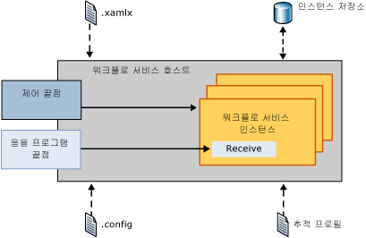
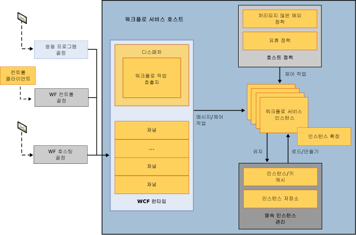
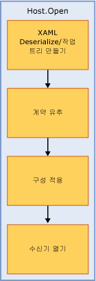
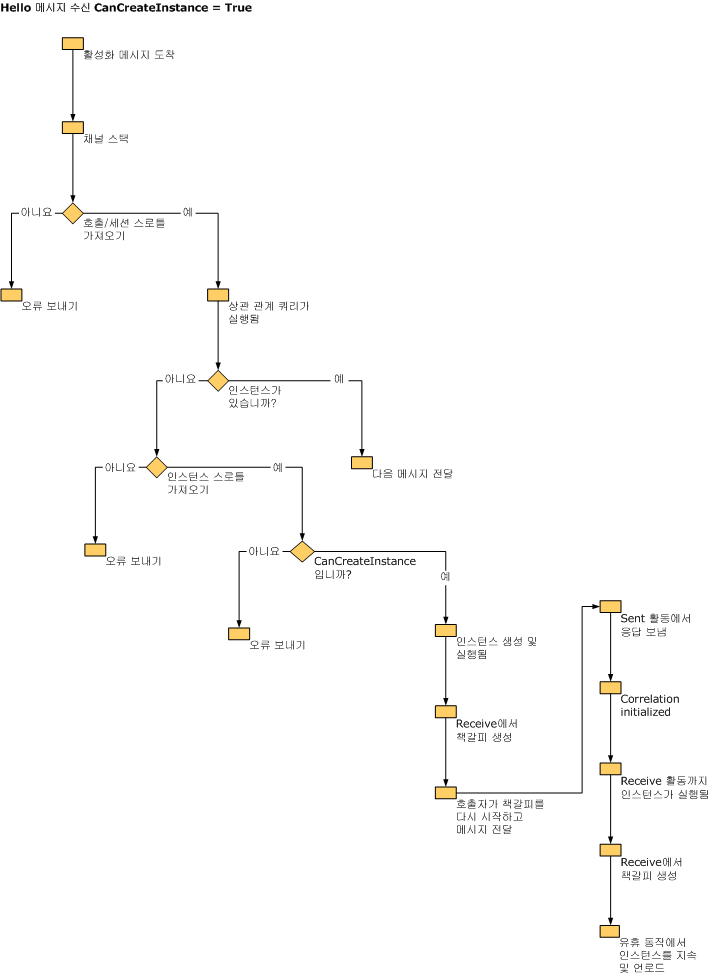
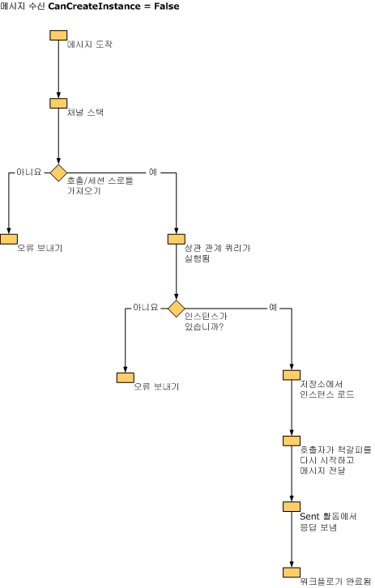

# 워크플로 서비스 호스트 내부 기능
<xref:System.ServiceModel.WorkflowServiceHost>에서는 워크플로 서비스에 대한 호스트를 제공합니다. 들어오는 메시지를 수신 대기하여 적절한 워크플로 서비스 인스턴스로 라우팅하고 유휴 워크플로의 언로드 및 유지를 제어하는 등의 작업을 담당합니다. 이 항목에서는 WorkflowServiceHost가 들어오는 메시지를 처리하는 방법을 설명합니다.  
  
## WorkflowServiceHost 개요  
 <xref:System.ServiceModel.WorkflowServiceHost> 클래스는 워크플로 서비스를 호스트하는 데 사용됩니다. 들어오는 메시지를 수신 대기하여 적절한 서비스 인스턴스로 라우팅하고 필요에 따라 새 인스턴스를 만들거나 영구 저장소에서 기존 인스턴스를 로드합니다.  다음 다이어그램에서는 <xref:System.ServiceModel.WorkflowServiceHost>의 작동 방식을 간략하게 보여 줍니다.  
  
   
  
 이 다이어그램에서는 <xref:System.ServiceModel.WorkflowServiceHost>가 .xamlx 파일에서 워크플로 서비스 정의를 로드하고 구성 파일에서 구성 정보를 로드하는 것을 보여 줍니다. 또한 추적 프로필에서 추적 구성을 로드합니다. <xref:System.ServiceModel.WorkflowServiceHost>는 제어 작업을 워크플로 인스턴스로 보내는 데 사용할 수 있는 워크플로 제어 끝점을 노출합니다.  자세한 내용은 참조 [워크플로 제어 끝점](../../../../docs/framework/wcf/feature-details/workflow-control-endpoint.md) 및 [워크플로 관리 끝점 샘플](../../../../docs/framework/windows-workflow-foundation/samples/workflow-management-endpoint-sample.md)합니다.  
  
 <xref:System.ServiceModel.WorkflowServiceHost>는 들어오는 응용 프로그램 메시지를 수신 대기하는 응용 프로그램 끝점도 노출합니다. 들어오는 메시지가 도착하면 적절한 워크플로 서비스 인스턴스로 전송됩니다(현재 로드되어 있는 경우). 필요한 경우 새 워크플로 인스턴스가 만들어지고, 기존 인스턴스가 유지된 경우에는 지속성 저장소에서 로드됩니다.  
  
## WorkflowServiceHost 세부 정보  
 다음 다이어그램에서는 <xref:System.ServiceModel.WorkflowServiceHost>에서 메시지를 처리하는 방법을 자세히 보여 줍니다.  
  
   
  
 이 다이어그램에서는 세 가지 끝점인 응용 프로그램 끝점, 워크플로 제어 끝점 및 워크플로 호스팅 끝점을 보여 줍니다. 응용 프로그램 끝점은 특정 워크플로 인스턴스에 바인딩된 메시지를 받습니다. 워크플로 제어 끝점은 제어 작업을 수신 대기합니다. 워크플로 호스팅 끝점은 <xref:System.ServiceModel.WorkflowServiceHost>가 서비스가 아닌 워크플로를 로드하고 실행하도록 하는 메시지를 수신 대기합니다. 다이어그램에 나와 있듯이 모든 메시지는 WCF 런타임을 통해 처리됩니다.  워크플로 서비스 인스턴스 제한은 <xref:System.ServiceModel.Description.ServiceThrottlingBehavior.MaxConcurrentInstances%2A> 속성을 사용하여 구현됩니다. 이 속성은 동시 워크플로 서비스 인스턴스 수를 제한합니다. 이 제한을 초과하면 새 워크플로 서비스 인스턴스에 대한 추가 요청이나 지속형 워크플로 인스턴스 활성화 요청이 큐에 저장됩니다. 큐에 대기 중인 요청은 새 인스턴스에 대한 요청인지, 실행 중인 지속형 인스턴스에 대한 요청인지에 관계없이 FIFO 순서대로 처리됩니다. 처리되지 않은 예외가 처리되는 방법과 유휴 워크플로 서비스가 언로드되고 지속되는 방법을 결정하는 호스트 정책 정보가 로드됩니다. 이러한 항목에 대 한 자세한 내용은 참조 [하는 방법: 워크플로 처리 되지 않은 예외 동작 구성 WorkflowServiceHost로](../../../../docs/framework/wcf/feature-details/config-workflow-unhandled-exception-workflowservicehost.md) 및 [하는 방법: WorkflowServiceHost로 유휴 동작 구성](../../../../docs/framework/wcf/feature-details/how-to-configure-idle-behavior-with-workflowservicehost.md)합니다. 워크플로 인스턴스는 호스트 정책에 따라 유지되고 필요한 경우 다시 로드됩니다. 워크플로 지 속성에 대 한 자세한 내용은 참조: [하는 방법: WorkflowServiceHost로 지 속성 구성](../../../../docs/framework/wcf/feature-details/how-to-configure-persistence-with-workflowservicehost.md), [장기 실행 워크플로 서비스를 만드는](../../../../docs/framework/wcf/feature-details/creating-a-long-running-workflow-service.md), 및 [워크플로 지 속성 ](../../../../docs/framework/windows-workflow-foundation/workflow-persistence.md).  
  
 다음 그림에서는 WorkflowServiceHost.Open이 호출될 때 일어나는 상황을 보여 줍니다.  
  
   
  
 워크플로가 XAML에서 로드되고 작업 트리가 만들어집니다. <xref:System.ServiceModel.WorkflowServiceHost>가 작업 트리를 단계별로 진행하면서 서비스 설명을 만듭니다. 구성이 호스트에 적용됩니다. 마지막으로 호스트가 들어오는 메시지를 수신 대기하기 시작합니다.  
  
 다음 그림에서는 <xref:System.ServiceModel.WorkflowServiceHost>에서 CanCreateInstance가 `true`로 설정된 Receive 작업에 바인딩된 메시지를 받을 때 수행하는 작업을 보여 줍니다.  
  
   
  
 메시지가 도착하고 WCF 채널 스택에서 처리됩니다. 스로틀이 확인되고 상관 관계 쿼리가 실행됩니다. 메시지가 기존 인스턴스에 바인딩된 경우 메시지가 배달됩니다. 새 인스턴스를 만들어야 하는 경우에는 Receive 활동의 CanCreateInstance 속성이 확인됩니다. 이 속성이 true로 설정되었으면 새 인스턴스가 만들어지고 메시지가 배달됩니다.  
  
 다음 그림에서는 <xref:System.ServiceModel.WorkflowServiceHost>에서 CanCreateInstance가 false로 설정된 Receive 작업에 바인딩된 메시지를 받을 때 수행하는 작업을 보여 줍니다.  
  
   
  
 메시지가 도착하고 WCF 채널 스택에서 처리됩니다. 스로틀이 확인되고 상관 관계 쿼리가 실행됩니다. 메시지가 기존 인스턴스에 바인딩되어 있으므로(CanCreateInstance가 false이기 때문) 인스턴스가 지속성 저장소에서 로드되고 책갈피가 다시 시작되며 워크플로가 실행됩니다.  
  
> [!WARNING]
>  SQL Server가 NamedPipe 프로토콜에서만 수신하도록 구성되어 있으면 워크플로 서비스 호스트가 열리지 않습니다.  
  
## 참고 항목  
 [워크플로 서비스](../../../../docs/framework/wcf/feature-details/workflow-services.md)  
 [워크플로 서비스 호스팅](../../../../docs/framework/wcf/feature-details/hosting-workflow-services.md)  
 [워크플로 제어 끝점](../../../../docs/framework/wcf/feature-details/workflow-control-endpoint.md)  
 [워크플로 관리 끝점 샘플](../../../../docs/framework/windows-workflow-foundation/samples/workflow-management-endpoint-sample.md)  
 [방법: WorkflowServiceHost를 사용하여 워크플로의 처리되지 않은 예외 동작 구성](../../../../docs/framework/wcf/feature-details/config-workflow-unhandled-exception-workflowservicehost.md)  
 [장기 실행 워크플로 서비스 만들기](../../../../docs/framework/wcf/feature-details/creating-a-long-running-workflow-service.md)  
 [워크플로 유지](../../../../docs/framework/windows-workflow-foundation/workflow-persistence.md)
