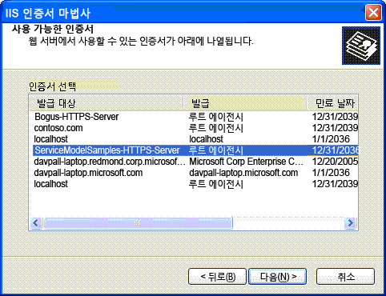

# <a name="internet-information-services-iis-server-certificate-installation-instructions"></a><span data-ttu-id="574ab-102">IIS(인터넷 정보 서비스) 서버 인증서 설치 지침</span><span class="sxs-lookup"><span data-stu-id="574ab-102">Internet Information Services (IIS) Server Certificate Installation Instructions</span></span>
<span data-ttu-id="574ab-103">IIS(인터넷 정보 서비스)와 안전하게 통신하는 샘플을 실행하려면 서버 인증서를 만들어 설치해야 합니다.</span><span class="sxs-lookup"><span data-stu-id="574ab-103">To run the samples that securely communicate with Internet Information Services (IIS), you must create and install a server certificate.</span></span>  
  
## <a name="step-1-creating-certificates"></a><span data-ttu-id="574ab-104">1단계:</span><span class="sxs-lookup"><span data-stu-id="574ab-104">Step 1.</span></span> <span data-ttu-id="574ab-105">인증서 만들기</span><span class="sxs-lookup"><span data-stu-id="574ab-105">Creating Certificates</span></span>  
 <span data-ttu-id="574ab-106">컴퓨터의 인증서를 만들려면 관리자 권한으로 Visual Studio 명령 프롬프트를 열고 IIS와의 보안 통신을 사용하는 각 샘플에 포함된 Setup.bat를 실행합니다.</span><span class="sxs-lookup"><span data-stu-id="574ab-106">To create a certificate for your computer, open a Visual Studio command prompt with administrator privileges and run the Setup.bat that is included in each of the samples that use secure communication with IIS.</span></span> <span data-ttu-id="574ab-107">이 일괄 처리 파일을 실행하기 전에 경로에 Makecert.exe가 포함된 폴더가 있는지 확인합니다.</span><span class="sxs-lookup"><span data-stu-id="574ab-107">Ensure that the path includes the folder that contains Makecert.exe before you run this batch file.</span></span> <span data-ttu-id="574ab-108">Setup.bat에서 인증서를 만드는 데 사용되는 명령은 다음과 같습니다.</span><span class="sxs-lookup"><span data-stu-id="574ab-108">The following command is used to create the certificate in Setup.bat.</span></span>  
  
```  
makecert -sr LocalMachine -ss My -n CN=ServiceModelSamples-HTTPS-Server -sky exchange -sk ServiceModelSamples-HTTPS-Key  
```  
  
## <a name="step-2-installing-certificates"></a><span data-ttu-id="574ab-109">2단계.</span><span class="sxs-lookup"><span data-stu-id="574ab-109">Step 2.</span></span> <span data-ttu-id="574ab-110">인증서 설치</span><span class="sxs-lookup"><span data-stu-id="574ab-110">Installing Certificates</span></span>  
 <span data-ttu-id="574ab-111">만든 인증서를 설치하는 데 필요한 단계는 사용 중인 IIS의 버전에 따라 다릅니다.</span><span class="sxs-lookup"><span data-stu-id="574ab-111">The steps required to install the certificates you just created depend on which version of IIS you are using.</span></span>  
  
#### <a name="to-install-iis-on-iis-51-windows-xp-and-iis-60-windows-server-2003"></a><span data-ttu-id="574ab-112">IIS 5.1(Windows XP) 및 IIS 6.0(Windows Server 2003)에 IIS를 설치하려면</span><span class="sxs-lookup"><span data-stu-id="574ab-112">To install IIS on IIS 5.1 (Windows XP) and IIS 6.0 (Windows Server 2003)</span></span>  
  
1.  <span data-ttu-id="574ab-113">인터넷 정보 서비스 관리자 MMC 스냅인을 엽니다.</span><span class="sxs-lookup"><span data-stu-id="574ab-113">Open the Internet Information Services Manager MMC Snap-In.</span></span>  
  
2.  <span data-ttu-id="574ab-114">기본 웹 사이트를 마우스 오른쪽 단추로 클릭 하 고 선택 **속성**합니다.</span><span class="sxs-lookup"><span data-stu-id="574ab-114">Right-click the default Web site and select **Properties**.</span></span>  
  
3.  <span data-ttu-id="574ab-115">선택 된 **디렉터리 보안** 탭 합니다.</span><span class="sxs-lookup"><span data-stu-id="574ab-115">Select the **Directory Security** tab.</span></span>  
  
4.  <span data-ttu-id="574ab-116">클릭는 **서버 인증서** 단추입니다.</span><span class="sxs-lookup"><span data-stu-id="574ab-116">Click the **Server Certificate** button.</span></span> <span data-ttu-id="574ab-117">웹 서버 인증서 마법사가 시작됩니다.</span><span class="sxs-lookup"><span data-stu-id="574ab-117">The Web Server Certificate Wizard starts.</span></span>  
  
5.  <span data-ttu-id="574ab-118">마법사에서 필요한 작업을 완료합니다.</span><span class="sxs-lookup"><span data-stu-id="574ab-118">Complete the wizard.</span></span> <span data-ttu-id="574ab-119">인증서를 할당하는 옵션을 선택합니다.</span><span class="sxs-lookup"><span data-stu-id="574ab-119">Select the option to assign a certificate.</span></span> <span data-ttu-id="574ab-120">표시된 인증서 목록에서 ServiceModelSamples-HTTPS-Server 인증서를 선택합니다.</span><span class="sxs-lookup"><span data-stu-id="574ab-120">Select the ServiceModelSamples-HTTPS-Server certificate from the list of certificates that are displayed.</span></span>  
  
     <span data-ttu-id="574ab-121"></span><span class="sxs-lookup"><span data-stu-id="574ab-121"></span></span>  
  
6.  <span data-ttu-id="574ab-122">HTTPS 주소 https://localhost/servicemodelsamples/service.svc를 사용하여 브라우저에서 서비스에 대한 액세스를 테스트합니다.</span><span class="sxs-lookup"><span data-stu-id="574ab-122">Test access to the service in a browser by using the HTTPS address https://localhost/servicemodelsamples/service.svc.</span></span>  
  
#### <a name="if-ssl-was-previously-configured-by-using-httpcfgexe"></a><span data-ttu-id="574ab-123">Httpcfg.exe를 사용하여 SSL을 이전에 구성한 경우</span><span class="sxs-lookup"><span data-stu-id="574ab-123">If SSL was previously configured by using Httpcfg.exe</span></span>  
  
1.  <span data-ttu-id="574ab-124">Makecert.exe를 사용하거나 Setup.bat를 실행하여 서버 인증서를 만듭니다.</span><span class="sxs-lookup"><span data-stu-id="574ab-124">Use Makecert.exe (or run Setup.bat) to create the server certificate.</span></span>  
  
2.  <span data-ttu-id="574ab-125">IIS 관리자를 실행하고 이전 단계에 따라 인증서를 설치합니다.</span><span class="sxs-lookup"><span data-stu-id="574ab-125">Run the IIS manager and install the certificate according to the previous steps.</span></span>  
  
3.  <span data-ttu-id="574ab-126">다음 코드 줄을 클라이언트 프로그램에 추가합니다.</span><span class="sxs-lookup"><span data-stu-id="574ab-126">Add the following line of code to the client program.</span></span>  
  
> [!IMPORTANT]
>  <span data-ttu-id="574ab-127">이 코드는 Makecert.exe로 만든 인증서 같은 테스트 인증서에만 필요합니다.</span><span class="sxs-lookup"><span data-stu-id="574ab-127">This code is only required for test certificates such as those created by Makecert.exe.</span></span> <span data-ttu-id="574ab-128">프로덕션 코드에 사용하지 않는 것이 좋습니다.</span><span class="sxs-lookup"><span data-stu-id="574ab-128">It is not recommended for production code.</span></span>  
  
```  
PermissiveCertificatePolicy.Enact("CN=ServiceModelSamples-HTTPS-Server");  
```  
  
#### <a name="to-install-iis-on-iis-70-windows-vista-and-windows-server-2008"></a><span data-ttu-id="574ab-129">IIS 7.0(Windows Vista 및 Windows Server 2008)에서 IIS를 설치하려면</span><span class="sxs-lookup"><span data-stu-id="574ab-129">To install IIS on IIS 7.0 (Windows Vista and Windows Server 2008)</span></span>  
  
1.  <span data-ttu-id="574ab-130">**시작** 메뉴를 클릭 **실행**, 다음 입력 **inetmgr** 를 인터넷 정보 서비스 (IIS) MMC 스냅인을 엽니다.</span><span class="sxs-lookup"><span data-stu-id="574ab-130">From the **Start** menu, click **Run**, then type **inetmgr** to open the Internet Information Services (IIS) MMC snap-in.</span></span>  
  
2.  <span data-ttu-id="574ab-131">마우스 오른쪽 단추로 클릭는 **기본 웹 사이트** 선택 **바인딩 편집...**</span><span class="sxs-lookup"><span data-stu-id="574ab-131">Right-click the **Default Web Site** and select **Edit Bindings…**</span></span>  
  
3.  <span data-ttu-id="574ab-132">클릭는 **추가** 의 단추는 **사이트 바인딩** 대화 상자.</span><span class="sxs-lookup"><span data-stu-id="574ab-132">Click the **Add** button of the **Site Bindings** dialog box.</span></span>  
  
4.  <span data-ttu-id="574ab-133">선택 **HTTPS** 에서 **형식** 드롭 다운 목록입니다.</span><span class="sxs-lookup"><span data-stu-id="574ab-133">Select **HTTPS** from the **Type** drop-down list.</span></span>  
  
5.  <span data-ttu-id="574ab-134">선택 된 **ServiceModelSamples HTTPS 서버** 에서 **SSL 인증서** 드롭다운 목록에서 클릭 하 고 **확인**합니다.</span><span class="sxs-lookup"><span data-stu-id="574ab-134">Select the **ServiceModelSamples-HTTPS-Server** from the **SSL certificate** drop-down list and click **OK**.</span></span>  
  
6.  <span data-ttu-id="574ab-135">HTTPS 주소 https://localhost/servicemodelsamples/service.svc를 사용하여 브라우저에서 서비스에 대한 액세스를 테스트합니다.</span><span class="sxs-lookup"><span data-stu-id="574ab-135">Test access to the service in a browser by using the HTTPS address https://localhost/servicemodelsamples/service.svc.</span></span>  
  
> [!NOTE]
>  <span data-ttu-id="574ab-136">설치한 테스트 인증서는 신뢰할 수 있는 인증서가 아니므로 이 인증서로 보안된 로컬 웹 주소를 검색할 때 추가 Internet Explorer 보안 경고가 발생할 수 있습니다.</span><span class="sxs-lookup"><span data-stu-id="574ab-136">Because the test certificate you have just installed is not a trusted certificate, you may encounter additional Internet Explorer security warnings when browsing to local Web addresses secured with this certificate.</span></span>  
  
## <a name="removing-certificates"></a><span data-ttu-id="574ab-137">인증서 제거</span><span class="sxs-lookup"><span data-stu-id="574ab-137">Removing Certificates</span></span>  
  
-   <span data-ttu-id="574ab-138">앞서 설명한 대로 인터넷 정보 서비스 관리자를 사용하는 것은 동일하고, 인증서나 바인딩을 추가하는 대신 제거합니다.</span><span class="sxs-lookup"><span data-stu-id="574ab-138">Use the Internet Information Services Manager as previously directed, but remove the certificate or binding instead of adding it.</span></span>  
  
-   <span data-ttu-id="574ab-139">다음 명령을 사용하여 컴퓨터 인증서를 제거합니다.</span><span class="sxs-lookup"><span data-stu-id="574ab-139">Remove the computer certificate by using the following command.</span></span>  
  
    ```  
    httpcfg delete ssl -i 0.0.0.0:443  
    ```
