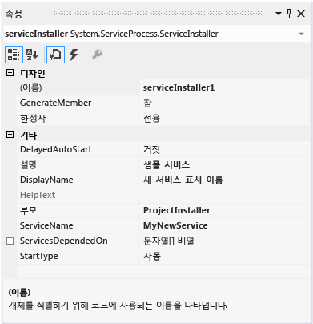
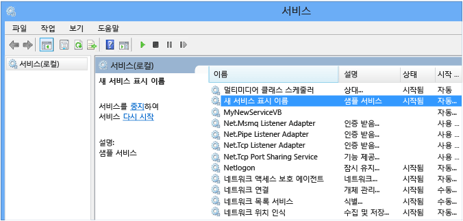
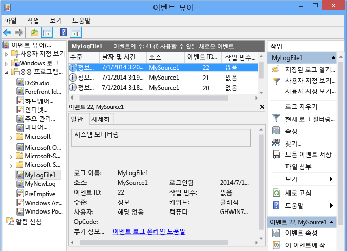

# <a name="walkthrough-creating-a-windows-service-application-in-the-component-designer"></a><span data-ttu-id="84ed4-102">연습: 구성 요소 디자이너에서 Windows 서비스 응용 프로그램 만들기</span><span class="sxs-lookup"><span data-stu-id="84ed4-102">Walkthrough: Creating a Windows Service Application in the Component Designer</span></span>
<span data-ttu-id="84ed4-103">이 문서에서는 이벤트 로그에 메시지를 쓰는 간단한 Windows 서비스 응용 프로그램을 Visual Studio에서 만드는 방법을 보여 줍니다.</span><span class="sxs-lookup"><span data-stu-id="84ed4-103">This article demonstrates how to create a simple Windows Service application in Visual Studio that writes messages to an event log.</span></span> <span data-ttu-id="84ed4-104">서비스를 만들고 사용하기 위해 수행하는 기본적인 단계는 다음과 같습니다.</span><span class="sxs-lookup"><span data-stu-id="84ed4-104">Here are the basic steps that you perform to create and use your service:</span></span>  
  
1.  <span data-ttu-id="84ed4-105">[서비스 만들기](#BK_CreateProject) Windows 서비스 **프로젝트 템플릿을 사용하여** 를 수행하고 해당 프로젝트를 구성합니다.</span><span class="sxs-lookup"><span data-stu-id="84ed4-105">[Creating a Service](#BK_CreateProject) by using the **Windows Service** project template, and configure it.</span></span> <span data-ttu-id="84ed4-106">이 템플릿을 사용하면 <xref:System.ServiceProcess.ServiceBase?displayProperty=nameWithType>에서 상속되어 서비스 시작 코드와 같은 기본 서비스 코드의 대부분을 자동으로 작성하는 클래스가 생성됩니다.</span><span class="sxs-lookup"><span data-stu-id="84ed4-106">This template creates a class for you that inherits from <xref:System.ServiceProcess.ServiceBase?displayProperty=nameWithType> and writes much of the basic service code, such as the code to start the service.</span></span>  
  
2.  <span data-ttu-id="84ed4-107">[서비스에 기능 추가](#BK_WriteCode) 및 <xref:System.ServiceProcess.ServiceBase.OnStart%2A> 프로시저의 <xref:System.ServiceProcess.ServiceBase.OnStop%2A> 하고 다시 정의할 기타 모든 메서드를 재정의합니다.</span><span class="sxs-lookup"><span data-stu-id="84ed4-107">[Adding Features to the Service](#BK_WriteCode) for the <xref:System.ServiceProcess.ServiceBase.OnStart%2A> and <xref:System.ServiceProcess.ServiceBase.OnStop%2A> procedures, and override any other methods that you want to redefine.</span></span>  
  
3.  <span data-ttu-id="84ed4-108">[서비스 상태 설정](#BK_SetStatus).</span><span class="sxs-lookup"><span data-stu-id="84ed4-108">[Setting Service Status](#BK_SetStatus).</span></span> <span data-ttu-id="84ed4-109">기본적으로 <xref:System.ServiceProcess.ServiceBase?displayProperty=nameWithType>를 사용하여 만드는 서비스는 사용 가능한 상태 플래그 중 일부만 구현합니다.</span><span class="sxs-lookup"><span data-stu-id="84ed4-109">By default, services created with <xref:System.ServiceProcess.ServiceBase?displayProperty=nameWithType> implement only a subset of the available status flags.</span></span> <span data-ttu-id="84ed4-110">서비스를 시작, 일시 중지 또는 중지하는 데 시간이 오래 걸리면 시작 보류 중, 중지 보류 중 등의 상태 값을 구현하여 해당 서비스가 작업을 수행하는 중임을 표시할 수 있습니다.</span><span class="sxs-lookup"><span data-stu-id="84ed4-110">If your service takes a long time to start up, pause, or stop, you can implement status values such as Start Pending or Stop Pending to indicate that it's working on an operation.</span></span>  
  
4.  <span data-ttu-id="84ed4-111">[서비스에 설치 관리자 추가](#BK_AddInstallers) 합니다.</span><span class="sxs-lookup"><span data-stu-id="84ed4-111">[Adding Installers to the Service](#BK_AddInstallers) for your service application.</span></span>  
  
5.  <span data-ttu-id="84ed4-112">(선택 사항) [시작 매개 변수 설정](#BK_StartupParameters)하고, 기본 시작 인수를 지정하고, 사용자가 서비스를 수동으로 시작할 때 기본 설정을 재정의할 수 있도록 설정합니다.</span><span class="sxs-lookup"><span data-stu-id="84ed4-112">(Optional) [Set Startup Parameters](#BK_StartupParameters), specify default startup arguments, and enable users to override default settings when they start your service manually.</span></span>  
  
6.  <span data-ttu-id="84ed4-113">[서비스 빌드](#BK_Build).</span><span class="sxs-lookup"><span data-stu-id="84ed4-113">[Building the Service](#BK_Build).</span></span>  
  
7.  <span data-ttu-id="84ed4-114">[서비스 설치](#BK_Install) 를 수행합니다.</span><span class="sxs-lookup"><span data-stu-id="84ed4-114">[Installing the Service](#BK_Install) on the local machine.</span></span>  
  
8.  <span data-ttu-id="84ed4-115">Windows 서비스 제어 관리자에 액세스하여 [서비스 시작 및 실행](#BK_StartService).</span><span class="sxs-lookup"><span data-stu-id="84ed4-115">Access the Windows Service Control Manager and [Starting and Running the Service](#BK_StartService).</span></span>  
  
9. <span data-ttu-id="84ed4-116">[Windows 서비스 제거](#BK_Uninstall).</span><span class="sxs-lookup"><span data-stu-id="84ed4-116">[Uninstalling a Windows Service](#BK_Uninstall).</span></span>  
  
> [!WARNING]
>  <span data-ttu-id="84ed4-117">Visual Studio Express 버전에서는 이 연습에 필요한 Windows 서비스 프로젝트 템플릿을 사용할 수 없습니다.</span><span class="sxs-lookup"><span data-stu-id="84ed4-117">The Windows Services project template that is required for this walkthrough is not available in the Express edition of Visual Studio.</span></span>  
  
 [!INCLUDE[note_settings_general](../../../includes/note-settings-general-md.md)]  
  
<a name="BK_CreateProject"></a>   
## <a name="creating-a-service"></a><span data-ttu-id="84ed4-118">서비스 만들기</span><span class="sxs-lookup"><span data-stu-id="84ed4-118">Creating a Service</span></span>  
 <span data-ttu-id="84ed4-119">우선 프로젝트를 만들고 서비스가 제대로 작동하는 데 필요한 값을 설정합니다.</span><span class="sxs-lookup"><span data-stu-id="84ed4-119">To begin, you create the project and set values that are required for the service to function correctly.</span></span>  
  
#### <a name="to-create-and-configure-your-service"></a><span data-ttu-id="84ed4-120">서비스를 만들고 구성하려면</span><span class="sxs-lookup"><span data-stu-id="84ed4-120">To create and configure your service</span></span>  
  
1.  <span data-ttu-id="84ed4-121">Visual Studio의 메뉴 모음에서 **파일**, **새로 만들기**, **프로젝트**를 선택합니다.</span><span class="sxs-lookup"><span data-stu-id="84ed4-121">In Visual Studio, on the menu bar, choose **File**, **New**, **Project**.</span></span>  
  
     <span data-ttu-id="84ed4-122">**새 프로젝트** 대화 상자가 열립니다.</span><span class="sxs-lookup"><span data-stu-id="84ed4-122">The **New Project** dialog box opens.</span></span>  
  
2.  <span data-ttu-id="84ed4-123">Visual Basic 또는 Visual C# 프로젝트 템플릿 목록에서 **Windows 서비스**를 선택하고 프로젝트의 이름을 **MyNewService**로 지정합니다.</span><span class="sxs-lookup"><span data-stu-id="84ed4-123">In the list of Visual Basic or Visual C# project templates, choose **Windows Service**, and name the project **MyNewService**.</span></span> <span data-ttu-id="84ed4-124">**확인**을 선택합니다.</span><span class="sxs-lookup"><span data-stu-id="84ed4-124">Choose **OK**.</span></span>  
  
     <span data-ttu-id="84ed4-125">프로젝트 템플릿은 `Service1`에서 상속된 <xref:System.ServiceProcess.ServiceBase?displayProperty=nameWithType>이라는 구성 요소 클래스를 자동으로 추가합니다.</span><span class="sxs-lookup"><span data-stu-id="84ed4-125">The project template automatically adds a component class named `Service1` that inherits from <xref:System.ServiceProcess.ServiceBase?displayProperty=nameWithType>.</span></span>  
  
3.  <span data-ttu-id="84ed4-126">**편집** 메뉴에서 **찾기 및 바꾸기**, **파일에서 찾기** 를 선택합니다(키보드: Ctrl+Shift+F).</span><span class="sxs-lookup"><span data-stu-id="84ed4-126">On the **Edit** menu, choose **Find and Replace**, **Find in Files** (Keyboard: Ctrl+Shift+F).</span></span> <span data-ttu-id="84ed4-127">모든 `Service1` 을 `MyNewService`로 변경합니다.</span><span class="sxs-lookup"><span data-stu-id="84ed4-127">Change all occurrences of `Service1` to `MyNewService`.</span></span> <span data-ttu-id="84ed4-128">Service1.cs, Program.cs 및 Service1.Designer.cs 또는 그에 해당하는 .vb 파일에서 인스턴스를 찾습니다.</span><span class="sxs-lookup"><span data-stu-id="84ed4-128">You’ll find instances in Service1.cs, Program.cs, and Service1.Designer.cs (or their .vb equivalents).</span></span>  
  
4.  <span data-ttu-id="84ed4-129">**Service1.cs [디자인]** 또는 **Service1.vb [디자인]** 의 **속성**창에서 <xref:System.ServiceProcess.ServiceBase.ServiceName%2A> 의 **및** (이름) `Service1` 속성이 아직 설정되어 있지 않으면 **MyNewService**로 설정합니다.</span><span class="sxs-lookup"><span data-stu-id="84ed4-129">In the **Properties** window for **Service1.cs [Design]** or **Service1.vb [Design]**, set the <xref:System.ServiceProcess.ServiceBase.ServiceName%2A> and the **(Name)** property for `Service1` to **MyNewService**, if it's not already set.</span></span>  
  
5.  <span data-ttu-id="84ed4-130">솔루션 탐색기에서 **Service1.cs** 의 이름을 **MyNewService.cs**로 바꾸거나 **Service1.vb** 의 이름을 **MyNewService.vb**로 바꿉니다.</span><span class="sxs-lookup"><span data-stu-id="84ed4-130">In Solution Explorer, rename **Service1.cs** to **MyNewService.cs**, or **Service1.vb** to **MyNewService.vb**.</span></span>  
  
<a name="BK_WriteCode"></a>   
## <a name="adding-features-to-the-service"></a><span data-ttu-id="84ed4-131">서비스에 기능 추가</span><span class="sxs-lookup"><span data-stu-id="84ed4-131">Adding Features to the Service</span></span>  
 <span data-ttu-id="84ed4-132">다음 섹션에서는 Windows 서비스에 사용자 지정 이벤트 로그를 추가합니다.</span><span class="sxs-lookup"><span data-stu-id="84ed4-132">In this section, you add a custom event log to the Windows service.</span></span> <span data-ttu-id="84ed4-133">이벤트 로그는 Windows 서비스와 연관이 없으며,</span><span class="sxs-lookup"><span data-stu-id="84ed4-133">Event logs are not associated in any way with Windows services.</span></span> <span data-ttu-id="84ed4-134">여기에서는 단지 Windows 서비스에 추가할 수 있는 구성 요소 종류의 한 예로 <xref:System.Diagnostics.EventLog> 구성 요소를 사용합니다.</span><span class="sxs-lookup"><span data-stu-id="84ed4-134">Here the <xref:System.Diagnostics.EventLog> component is used as an example of the type of component you could add to a Windows service.</span></span>  
  
#### <a name="to-add-custom-event-log-functionality-to-your-service"></a><span data-ttu-id="84ed4-135">사용자 지정 이벤트 로그 기능을 서비스에 추가하려면</span><span class="sxs-lookup"><span data-stu-id="84ed4-135">To add custom event log functionality to your service</span></span>  
  
1.  <span data-ttu-id="84ed4-136">**솔루션 탐색기**에서 **MyNewService.cs** 또는 **MyNewService.vb**의 상황에 맞는 메뉴를 열고 **뷰 디자이너**를 선택합니다.</span><span class="sxs-lookup"><span data-stu-id="84ed4-136">In **Solution Explorer**, open the context menu for **MyNewService.cs** or **MyNewService.vb**, and then choose **View Designer**.</span></span>  
  
2.  <span data-ttu-id="84ed4-137">**도구 상자** 의 **구성 요소**섹션에서 <xref:System.Diagnostics.EventLog> 구성 요소를 디자이너로 끌어 옵니다.</span><span class="sxs-lookup"><span data-stu-id="84ed4-137">From the **Components** section of the **Toolbox**, drag an <xref:System.Diagnostics.EventLog> component to the designer.</span></span>  
  
3.  <span data-ttu-id="84ed4-138">**솔루션 탐색기**에서 **MyNewService.cs** 또는 **MyNewService.vb**의 상황에 맞는 메뉴를 열고 **코드 보기**를 선택합니다.</span><span class="sxs-lookup"><span data-stu-id="84ed4-138">In **Solution Explorer**, open the context menu for **MyNewService.cs** or **MyNewService.vb**, and then choose **View Code**.</span></span>  
  
4.  <span data-ttu-id="84ed4-139">**클래스에서** 변수를 선언하는 줄 바로 다음에 `MyNewService` eventLog `components` 개체에 대한 선언을 추가합니다.</span><span class="sxs-lookup"><span data-stu-id="84ed4-139">Add a declaration for the **eventLog** object in the `MyNewService` class, right after the line that declares the `components` variable:</span></span>  
  
     [!code-csharp[VbRadconService#16](../../../samples/snippets/csharp/VS_Snippets_VBCSharp/VbRadconService/CS/MyNewService.cs#16)]
     [!code-vb[VbRadconService#16](../../../samples/snippets/visualbasic/VS_Snippets_VBCSharp/VbRadconService/VB/MyNewService.vb#16)]  
  
5.  <span data-ttu-id="84ed4-140">사용자 지정 이벤트 로그를 정의하는 생성자를 추가하거나 편집합니다.</span><span class="sxs-lookup"><span data-stu-id="84ed4-140">Add or edit the constructor to define a custom event log:</span></span>  
  
     [!code-csharp[VbRadconService#2](../../../samples/snippets/csharp/VS_Snippets_VBCSharp/VbRadconService/CS/MyNewService.cs#2)]
     [!code-vb[VbRadconService#2](../../../samples/snippets/visualbasic/VS_Snippets_VBCSharp/VbRadconService/VB/MyNewService.vb#2)]  
  
#### <a name="to-define-what-occurs-when-the-service-starts"></a><span data-ttu-id="84ed4-141">서비스가 시작될 때 수행되는 동작을 정의하려면</span><span class="sxs-lookup"><span data-stu-id="84ed4-141">To define what occurs when the service starts</span></span>  
  
-   <span data-ttu-id="84ed4-142">코드 편집기에서 프로젝트를 만들 때 자동으로 재정의된 <xref:System.ServiceProcess.ServiceBase.OnStart%2A> 메서드를 찾아서 코드를 다음과 같이 바꿉니다.</span><span class="sxs-lookup"><span data-stu-id="84ed4-142">In the Code Editor, locate the <xref:System.ServiceProcess.ServiceBase.OnStart%2A> method that was automatically overridden when you created the project, and replace the code with the following.</span></span> <span data-ttu-id="84ed4-143">이렇게 하면 서비스 실행이 시작될 때 이벤트 로그에 항목이 추가됩니다.</span><span class="sxs-lookup"><span data-stu-id="84ed4-143">This adds an entry to the event log when the service starts running:</span></span>  
  
     [!code-csharp[VbRadconService#3](../../../samples/snippets/csharp/VS_Snippets_VBCSharp/VbRadconService/CS/MyNewService.cs#3)]
     [!code-vb[VbRadconService#3](../../../samples/snippets/visualbasic/VS_Snippets_VBCSharp/VbRadconService/VB/MyNewService.vb#3)]  
  
     <span data-ttu-id="84ed4-144">서비스 응용 프로그램은 오랫동안 실행되도록 설계되므로 대개 시스템의 특정 항목을 폴링하거나 모니터링합니다.</span><span class="sxs-lookup"><span data-stu-id="84ed4-144">A service application is designed to be long-running, so it usually polls or monitors something in the system.</span></span> <span data-ttu-id="84ed4-145">모니터링은 <xref:System.ServiceProcess.ServiceBase.OnStart%2A> 메서드에서 설정됩니다.</span><span class="sxs-lookup"><span data-stu-id="84ed4-145">The monitoring is set up in the <xref:System.ServiceProcess.ServiceBase.OnStart%2A> method.</span></span> <span data-ttu-id="84ed4-146">그러나 <xref:System.ServiceProcess.ServiceBase.OnStart%2A> 가 실제로 모니터링을 수행하지는 않습니다.</span><span class="sxs-lookup"><span data-stu-id="84ed4-146">However, <xref:System.ServiceProcess.ServiceBase.OnStart%2A> doesn’t actually do the monitoring.</span></span> <span data-ttu-id="84ed4-147">서비스의 작업이 시작되고 나면 <xref:System.ServiceProcess.ServiceBase.OnStart%2A> 메서드가 운영 체제에 반환되어야 하며</span><span class="sxs-lookup"><span data-stu-id="84ed4-147">The <xref:System.ServiceProcess.ServiceBase.OnStart%2A> method must return to the operating system after the service's operation has begun.</span></span> <span data-ttu-id="84ed4-148">무제한 순환하거나 방해가 되어서는 안 됩니다.</span><span class="sxs-lookup"><span data-stu-id="84ed4-148">It must not loop forever or block.</span></span> <span data-ttu-id="84ed4-149">간단한 폴링 메커니즘을 설정하려면 <xref:System.Timers.Timer?displayProperty=nameWithType> 구성 요소를 사용할 수 있습니다. 즉, <xref:System.ServiceProcess.ServiceBase.OnStart%2A> 메서드에서 구성 요소에 대한 매개 변수를 설정한 다음 <xref:System.Timers.Timer.Enabled%2A> 속성을 `true`로 설정합니다.</span><span class="sxs-lookup"><span data-stu-id="84ed4-149">To set up a simple polling mechanism, you can use the <xref:System.Timers.Timer?displayProperty=nameWithType> component as follows: In the <xref:System.ServiceProcess.ServiceBase.OnStart%2A> method, set parameters on the component, and then set the <xref:System.Timers.Timer.Enabled%2A> property to `true`.</span></span> <span data-ttu-id="84ed4-150">타이머는 코드에서 주기적으로 이벤트를 발생시키며 그러는 동안에도 서비스에서는 모니터링을 수행할 수 있습니다.</span><span class="sxs-lookup"><span data-stu-id="84ed4-150">The timer raises events in your code periodically, at which time your service could do its monitoring.</span></span> <span data-ttu-id="84ed4-151">이렇게 하려면 다음 코드를 사용할 수 있습니다.</span><span class="sxs-lookup"><span data-stu-id="84ed4-151">You can use the following code to do this:</span></span>  
  
    ```csharp  
    // Set up a timer to trigger every minute.  
    System.Timers.Timer timer = new System.Timers.Timer();  
    timer.Interval = 60000; // 60 seconds  
    timer.Elapsed += new System.Timers.ElapsedEventHandler(this.OnTimer);  
    timer.Start();  
    ```  
  
    ```vb  
    ' Set up a timer to trigger every minute.  
    Dim timer As System.Timers.Timer = New System.Timers.Timer()  
    timer.Interval = 60000 ' 60 seconds  
    AddHandler timer.Elapsed, AddressOf Me.OnTimer  
    timer.Start()  
    ```  
     <span data-ttu-id="84ed4-152">멤버 변수를 클래스에 추가합니다.</span><span class="sxs-lookup"><span data-stu-id="84ed4-152">Add a member variable to the class.</span></span> <span data-ttu-id="84ed4-153">여기에는 이벤트 로그에 기록할 다음 이벤트의 식별자가 포함됩니다.</span><span class="sxs-lookup"><span data-stu-id="84ed4-153">It will contain the identifier of the next event to write into the event log.</span></span>

    ```csharp
    private int eventId = 1;
    ```

    ```vb
    Private eventId As Integer = 1
    ```

     <span data-ttu-id="84ed4-154">타이머 이벤트를 처리하는 코드를 추가합니다.</span><span class="sxs-lookup"><span data-stu-id="84ed4-154">Add code to handle the timer event:</span></span>  
  
    ```csharp  
    public void OnTimer(object sender, System.Timers.ElapsedEventArgs args)  
    {  
        // TODO: Insert monitoring activities here.  
        eventLog1.WriteEntry("Monitoring the System", EventLogEntryType.Information, eventId++);  
    }  
    ```  
  
    ```vb  
    Private Sub OnTimer(sender As Object, e As Timers.ElapsedEventArgs)  
        ' TODO: Insert monitoring activities here.  
        eventLog1.WriteEntry("Monitoring the System", EventLogEntryType.Information, eventId)  
        eventId = eventId + 1  
    End Sub  
    ```  
  
     <span data-ttu-id="84ed4-155">주 스레드에서 모든 작업을 실행하는 대신 백그라운드 작업자 스레드를 사용하여 작업을 수행할 수도 있습니다.</span><span class="sxs-lookup"><span data-stu-id="84ed4-155">You might want to perform tasks by using background worker threads instead of running all your work on the main thread.</span></span> <span data-ttu-id="84ed4-156">이러한 방식의 예제를 보려면 <xref:System.ServiceProcess.ServiceBase?displayProperty=nameWithType> 참조 페이지를 참조하세요.</span><span class="sxs-lookup"><span data-stu-id="84ed4-156">For an example of this, see the <xref:System.ServiceProcess.ServiceBase?displayProperty=nameWithType> reference page.</span></span>  
  
#### <a name="to-define-what-occurs-when-the-service-is-stopped"></a><span data-ttu-id="84ed4-157">서비스가 중단될 때 수행되는 동작을 정의하려면</span><span class="sxs-lookup"><span data-stu-id="84ed4-157">To define what occurs when the service is stopped</span></span>  
  
-   <span data-ttu-id="84ed4-158"><xref:System.ServiceProcess.ServiceBase.OnStop%2A> 메서드의 코드를 다음 코드로 바꿉니다.</span><span class="sxs-lookup"><span data-stu-id="84ed4-158">Replace the code for the <xref:System.ServiceProcess.ServiceBase.OnStop%2A> method with the following.</span></span> <span data-ttu-id="84ed4-159">이렇게 하면 서비스가 중지될 때 이벤트 로그에 항목이 추가됩니다.</span><span class="sxs-lookup"><span data-stu-id="84ed4-159">This adds an entry to the event log when the service is stopped:</span></span>  
  
     [!code-csharp[VbRadconService#4](../../../samples/snippets/csharp/VS_Snippets_VBCSharp/VbRadconService/CS/MyNewService.cs#4)]
     [!code-vb[VbRadconService#4](../../../samples/snippets/visualbasic/VS_Snippets_VBCSharp/VbRadconService/VB/MyNewService.vb#4)]  
  
 <span data-ttu-id="84ed4-160">다음 섹션에서는 <xref:System.ServiceProcess.ServiceBase.OnPause%2A>, <xref:System.ServiceProcess.ServiceBase.OnContinue%2A>및 <xref:System.ServiceProcess.ServiceBase.OnShutdown%2A> 메서드를 재정의하여 구성 요소에 대한 추가 처리를 정의할 수 있습니다.</span><span class="sxs-lookup"><span data-stu-id="84ed4-160">In the next section, you can override the <xref:System.ServiceProcess.ServiceBase.OnPause%2A>, <xref:System.ServiceProcess.ServiceBase.OnContinue%2A>, and <xref:System.ServiceProcess.ServiceBase.OnShutdown%2A> methods to define additional processing for your component.</span></span>  
  
#### <a name="to-define-other-actions-for-the-service"></a><span data-ttu-id="84ed4-161">서비스의 다른 동작을 정의하려면</span><span class="sxs-lookup"><span data-stu-id="84ed4-161">To define other actions for the service</span></span>  
  
-   <span data-ttu-id="84ed4-162">처리할 메서드를 찾은 다음 재정의하여 수행할 동작을 정의합니다.</span><span class="sxs-lookup"><span data-stu-id="84ed4-162">Locate the method that you want to handle, and override it to define what you want to occur.</span></span>  
  
     <span data-ttu-id="84ed4-163">다음 코드에서는 <xref:System.ServiceProcess.ServiceBase.OnContinue%2A> 메서드를 재정의하는 방법을 보여 줍니다.</span><span class="sxs-lookup"><span data-stu-id="84ed4-163">The following code shows how you can override the <xref:System.ServiceProcess.ServiceBase.OnContinue%2A> method:</span></span>  
  
     [!code-csharp[VbRadconService#5](../../../samples/snippets/csharp/VS_Snippets_VBCSharp/VbRadconService/CS/MyNewService.cs#5)]
     [!code-vb[VbRadconService#5](../../../samples/snippets/visualbasic/VS_Snippets_VBCSharp/VbRadconService/VB/MyNewService.vb#5)]  
  
 <span data-ttu-id="84ed4-164"><xref:System.Configuration.Install.Installer> 클래스를 통해 Windows 서비스를 설치할 때는 일부 사용자 지정 작업을 수행해야 합니다.</span><span class="sxs-lookup"><span data-stu-id="84ed4-164">Some custom actions have to occur when a Windows service is installed by the <xref:System.Configuration.Install.Installer> class.</span></span> <span data-ttu-id="84ed4-165">Visual Studio에서 특별히 Windows 서비스를 위해 이러한 설치 관리자를 만들어 프로젝트에 추가할 수 있습니다.</span><span class="sxs-lookup"><span data-stu-id="84ed4-165">Visual Studio can create these installers specifically for a Windows service and add them to your project.</span></span>  
  
<a name="BK_SetStatus"></a>   
## <a name="setting-service-status"></a><span data-ttu-id="84ed4-166">서비스 상태 설정</span><span class="sxs-lookup"><span data-stu-id="84ed4-166">Setting Service Status</span></span>  
 <span data-ttu-id="84ed4-167">서비스는 서비스 제어 관리자에 상태를 보고합니다. 따라서 사용자는 서비스가 정상적으로 작동 중인지를 확인할 수 있습니다.</span><span class="sxs-lookup"><span data-stu-id="84ed4-167">Services report their status to the Service Control Manager, so that users can tell whether a service is functioning correctly.</span></span> <span data-ttu-id="84ed4-168">기본적으로 <xref:System.ServiceProcess.ServiceBase> 에서 상속되는 서비스는 중지됨, 일시 중지됨, 실행 중 등의 제한적인 상태 설정 집합을 보고합니다.</span><span class="sxs-lookup"><span data-stu-id="84ed4-168">By default, services that inherit from <xref:System.ServiceProcess.ServiceBase> report a limited set of status settings, including Stopped, Paused, and Running.</span></span> <span data-ttu-id="84ed4-169">서비스를 시작하는 데 시간이 다소 걸리는 경우에는 시작 보류 중 상태를 보고하면 도움이 될 수 있습니다.</span><span class="sxs-lookup"><span data-stu-id="84ed4-169">If a service takes a little while to start up, it might be helpful to report a Start Pending status.</span></span> <span data-ttu-id="84ed4-170">또한 Windows [SetServiceStatus 함수](http://msdn.microsoft.com/library/windows/desktop/ms686241.aspx)를 호출하는 코드를 추가하여 시작 보류 중 및 중지 보류 중 상태 설정을 구현할 수도 있습니다.</span><span class="sxs-lookup"><span data-stu-id="84ed4-170">You can also implement the Start Pending and Stop Pending status settings by adding code that calls into the Windows [SetServiceStatus function](http://msdn.microsoft.com/library/windows/desktop/ms686241.aspx).</span></span>  
  
#### <a name="to-implement-service-pending-status"></a><span data-ttu-id="84ed4-171">서비스 보류 중 상태를 구현하려면</span><span class="sxs-lookup"><span data-stu-id="84ed4-171">To implement service pending status</span></span>  
  
1.  <span data-ttu-id="84ed4-172">MyNewService.cs 또는 MyNewService.vb 파일의 `using` 네임스페이스에 `Imports` 문 또는 <xref:System.Runtime.InteropServices?displayProperty=nameWithType> 선언을 추가합니다.</span><span class="sxs-lookup"><span data-stu-id="84ed4-172">Add a `using` statement or `Imports` declaration to the <xref:System.Runtime.InteropServices?displayProperty=nameWithType> namespace in the MyNewService.cs or MyNewService.vb file:</span></span>  
  
    ```csharp  
    using System.Runtime.InteropServices;  
    ```  
  
    ```vb  
    Imports System.Runtime.InteropServices  
    ```  
  
2.  <span data-ttu-id="84ed4-173">`ServiceState` 값을 선언하고 상태에 대한 구조(플랫폼 호출에서 사용함)를 추가하려면 MyNewService.cs에 다음 코드를 추가합니다.</span><span class="sxs-lookup"><span data-stu-id="84ed4-173">Add the following code to MyNewService.cs to declare the `ServiceState` values and to add a structure for the status, which you'll use in a platform invoke call:</span></span>  
  
    ```csharp  
    public enum ServiceState  
      {  
          SERVICE_STOPPED = 0x00000001,  
          SERVICE_START_PENDING = 0x00000002,  
          SERVICE_STOP_PENDING = 0x00000003,  
          SERVICE_RUNNING = 0x00000004,  
          SERVICE_CONTINUE_PENDING = 0x00000005,  
          SERVICE_PAUSE_PENDING = 0x00000006,  
          SERVICE_PAUSED = 0x00000007,  
      }  
  
      [StructLayout(LayoutKind.Sequential)]  
      public struct ServiceStatus  
      {  
          public int dwServiceType;  
          public ServiceState dwCurrentState;  
          public int dwControlsAccepted;  
          public int dwWin32ExitCode;  
          public int dwServiceSpecificExitCode;  
          public int dwCheckPoint;  
          public int dwWaitHint;  
      };  
    ```  
  
    ```vb  
    Public Enum ServiceState  
        SERVICE_STOPPED = 1  
        SERVICE_START_PENDING = 2  
        SERVICE_STOP_PENDING = 3  
        SERVICE_RUNNING = 4  
        SERVICE_CONTINUE_PENDING = 5  
        SERVICE_PAUSE_PENDING = 6  
        SERVICE_PAUSED = 7  
    End Enum  
  
    <StructLayout(LayoutKind.Sequential)>  
    Public Structure ServiceStatus  
        Public dwServiceType As Long  
        Public dwCurrentState As ServiceState  
        Public dwControlsAccepted As Long  
        Public dwWin32ExitCode As Long  
        Public dwServiceSpecificExitCode As Long  
        Public dwCheckPoint As Long  
        Public dwWaitHint As Long  
    End Structure  
    ```  
  
3.  <span data-ttu-id="84ed4-174">이제 `MyNewService` 클래스에서 플랫폼 호출을 사용하여 [SetServiceStatus 함수](http://msdn.microsoft.com/library/windows/desktop/ms686241.aspx) 를 선언합니다.</span><span class="sxs-lookup"><span data-stu-id="84ed4-174">Now, in the `MyNewService` class, declare the [SetServiceStatus function](http://msdn.microsoft.com/library/windows/desktop/ms686241.aspx) by using platform invoke:</span></span>  
  
    ```csharp  
    [DllImport("advapi32.dll", SetLastError=true)]  
            private static extern bool SetServiceStatus(IntPtr handle, ref ServiceStatus serviceStatus);  
    ```  
  
    ```vb  
    Declare Auto Function SetServiceStatus Lib "advapi32.dll" (ByVal handle As IntPtr, ByRef serviceStatus As ServiceStatus) As Boolean  
    ```  
  
4.  <span data-ttu-id="84ed4-175">시작 보류 중 상태를 구현하려면 <xref:System.ServiceProcess.ServiceBase.OnStart%2A> 메서드 시작 부분에 다음 코드를 추가합니다.</span><span class="sxs-lookup"><span data-stu-id="84ed4-175">To implement the Start Pending status, add the following code to the beginning of the <xref:System.ServiceProcess.ServiceBase.OnStart%2A> method:</span></span>  
  
    ```csharp  
    // Update the service state to Start Pending.  
    ServiceStatus serviceStatus = new ServiceStatus();  
    serviceStatus.dwCurrentState = ServiceState.SERVICE_START_PENDING;  
    serviceStatus.dwWaitHint = 100000;  
    SetServiceStatus(this.ServiceHandle, ref serviceStatus);  
    ```  
  
    ```vb  
    ' Update the service state to Start Pending.  
    Dim serviceStatus As ServiceStatus = New ServiceStatus()  
    serviceStatus.dwCurrentState = ServiceState.SERVICE_START_PENDING  
    serviceStatus.dwWaitHint = 100000  
    SetServiceStatus(Me.ServiceHandle, serviceStatus)  
    ```  
  
5.  <span data-ttu-id="84ed4-176">상태를 실행 중으로 설정하는 코드를 <xref:System.ServiceProcess.ServiceBase.OnStart%2A> 메서드 끝에 추가합니다.</span><span class="sxs-lookup"><span data-stu-id="84ed4-176">Add code to set the status to Running at the end of the <xref:System.ServiceProcess.ServiceBase.OnStart%2A> method.</span></span>  
  
    ```csharp
    // Update the service state to Running.  
    serviceStatus.dwCurrentState = ServiceState.SERVICE_RUNNING;  
    SetServiceStatus(this.ServiceHandle, ref serviceStatus);  
    ```  
  
    ```vb  
    ' Update the service state to Running.  
    serviceStatus.dwCurrentState = ServiceState.SERVICE_RUNNING  
    SetServiceStatus(Me.ServiceHandle, serviceStatus)  
    ```  
  
6.  <span data-ttu-id="84ed4-177">(선택 사항) <xref:System.ServiceProcess.ServiceBase.OnStop%2A> 메서드에 대해 이 절차를 반복합니다.</span><span class="sxs-lookup"><span data-stu-id="84ed4-177">(Optional) Repeat this procedure for the <xref:System.ServiceProcess.ServiceBase.OnStop%2A> method.</span></span>  
  
> [!CAUTION]
>  <span data-ttu-id="84ed4-178">서비스의 작업이 시작되고 나면 [서비스 제어 관리자](http://msdn.microsoft.com/library/windows/desktop/ms685150.aspx) 는 `dwWaitHint` 프로시저의 `dwCheckpoint` 및 [dwCheckpoint](http://msdn.microsoft.com/library/windows/desktop/ms685996.aspx) 멤버를 사용하여 Windows 서비스가 종료될 때까지 기다릴 시간을 결정합니다.</span><span class="sxs-lookup"><span data-stu-id="84ed4-178">The [Service Control Manager](http://msdn.microsoft.com/library/windows/desktop/ms685150.aspx) uses the `dwWaitHint` and `dwCheckpoint` members of the [SERVICE_STATUS structure](http://msdn.microsoft.com/library/windows/desktop/ms685996.aspx) to determine how much time to wait for a Windows Service to start or shut down.</span></span> <span data-ttu-id="84ed4-179"><xref:System.ServiceProcess.ServiceBase.OnStart%2A> 및 <xref:System.ServiceProcess.ServiceBase.OnStop%2A> 메서드가 오랫동안 실행되는 경우 서비스는 증분된 `dwCheckPoint` 값을 포함하여 [SetServiceStatus](http://msdn.microsoft.com/library/windows/desktop/ms686241.aspx)를 다시 호출하여 시간을 더 요청할 수 있습니다.</span><span class="sxs-lookup"><span data-stu-id="84ed4-179">If your <xref:System.ServiceProcess.ServiceBase.OnStart%2A> and <xref:System.ServiceProcess.ServiceBase.OnStop%2A> methods run long, your service can request more time by calling [SetServiceStatus](http://msdn.microsoft.com/library/windows/desktop/ms686241.aspx) again with an incremented `dwCheckPoint` value.</span></span>  
  
<a name="BK_AddInstallers"></a>   
## <a name="adding-installers-to-the-service"></a><span data-ttu-id="84ed4-180">서비스에 설치 관리자 추가</span><span class="sxs-lookup"><span data-stu-id="84ed4-180">Adding Installers to the Service</span></span>  
 <span data-ttu-id="84ed4-181">Windows 서비스를 실행하려면 해당 서비스를 설치해야 합니다. 그러면 서비스 제어 관리자에 서비스가 등록됩니다.</span><span class="sxs-lookup"><span data-stu-id="84ed4-181">Before you can run a Windows Service, you need to install it, which registers it with the Service Control Manager.</span></span> <span data-ttu-id="84ed4-182">등록 정보를 처리하는 설치 관리자를 프로젝트에 추가할 수 있습니다.</span><span class="sxs-lookup"><span data-stu-id="84ed4-182">You can add installers to your project that handle the registration details.</span></span>  
  
#### <a name="to-create-the-installers-for-your-service"></a><span data-ttu-id="84ed4-183">서비스를 위한 설치 관리자를 만들려면</span><span class="sxs-lookup"><span data-stu-id="84ed4-183">To create the installers for your service</span></span>  
  
1.  <span data-ttu-id="84ed4-184">**솔루션 탐색기**에서 **MyNewService.cs** 또는 **MyNewService.vb**의 상황에 맞는 메뉴를 열고 **뷰 디자이너**를 선택합니다.</span><span class="sxs-lookup"><span data-stu-id="84ed4-184">In **Solution Explorer**, open the context menu for **MyNewService.cs** or **MyNewService.vb**, and then choose **View Designer**.</span></span>  
  
2.  <span data-ttu-id="84ed4-185">디자이너의 배경을 클릭하여 서비스 내용이 아닌 서비스 자체를 선택합니다.</span><span class="sxs-lookup"><span data-stu-id="84ed4-185">Click the background of the designer to select the service itself, instead of any of its contents.</span></span>  
  
3.  <span data-ttu-id="84ed4-186">디자이너 창의 상황에 맞는 메뉴를 열고(포인팅 장치를 사용하는 경우 창 안쪽을 마우스 오른쪽 단추로 클릭) **설치 관리자 추가**를 선택합니다.</span><span class="sxs-lookup"><span data-stu-id="84ed4-186">Open the context menu for the designer window (if you’re using a pointing device, right-click inside the window), and then choose **Add Installer**.</span></span>  
  
     <span data-ttu-id="84ed4-187">기본적으로 설치 관리자가 두 개 들어 있는 구성 요소 클래스가 프로젝트에 추가됩니다.</span><span class="sxs-lookup"><span data-stu-id="84ed4-187">By default, a component class that contains two installers is added to your project.</span></span> <span data-ttu-id="84ed4-188">구성 요소의 이름이 **ProjectInstaller**로 지정되며 구성 요소에는 서비스를 위한 설치 관리자와 서비스 관련 프로세스를 위한 설치 관리자가 들어 있습니다.</span><span class="sxs-lookup"><span data-stu-id="84ed4-188">The component is named **ProjectInstaller**, and the installers it contains are the installer for your service and the installer for the service's associated process.</span></span>  
  
4.  <span data-ttu-id="84ed4-189">**ProjectInstaller** 의 **디자인**뷰에서 Visual C# 프로젝트의 경우 **serviceInstaller1** 를 선택하고 Visual Basic 프로젝트의 경우 **ServiceInstaller1** 을 선택합니다.</span><span class="sxs-lookup"><span data-stu-id="84ed4-189">In **Design** view for **ProjectInstaller**, choose **serviceInstaller1** for a Visual C# project, or **ServiceInstaller1** for a Visual Basic project.</span></span>  
  
5.  <span data-ttu-id="84ed4-190">**속성** 창에서 <xref:System.ServiceProcess.ServiceInstaller.ServiceName%2A> 속성이 **MyNewService**로 설정되어 있는지 확인합니다.</span><span class="sxs-lookup"><span data-stu-id="84ed4-190">In the **Properties** window, make sure the <xref:System.ServiceProcess.ServiceInstaller.ServiceName%2A> property is set to **MyNewService**.</span></span>  
  
6.  <span data-ttu-id="84ed4-191">**설명** 속성을 "샘플 서비스"와 같은 텍스트로 설정합니다.</span><span class="sxs-lookup"><span data-stu-id="84ed4-191">Set the **Description** property to some text, such as "A sample service".</span></span> <span data-ttu-id="84ed4-192">이 텍스트는 서비스 창에 표시되며 사용자가 서비스를 식별하고 서비스의 용도를 이해하는 데 도움이 됩니다.</span><span class="sxs-lookup"><span data-stu-id="84ed4-192">This text appears in the Services window and helps the user identify the service and understand what it’s used for.</span></span>  
  
7.  <span data-ttu-id="84ed4-193"><xref:System.ServiceProcess.ServiceInstaller.DisplayName%2A> 속성을 서비스 창의 **이름** 열에 표시할 텍스트로 설정합니다.</span><span class="sxs-lookup"><span data-stu-id="84ed4-193">Set the <xref:System.ServiceProcess.ServiceInstaller.DisplayName%2A> property to the text that you want to appear in the Services window in the **Name** column.</span></span> <span data-ttu-id="84ed4-194">예를 들어 "MyNewService 표시 이름"을 입력할 수 있습니다.</span><span class="sxs-lookup"><span data-stu-id="84ed4-194">For example, you can enter "MyNewService Display Name".</span></span> <span data-ttu-id="84ed4-195">이 이름은 <xref:System.ServiceProcess.ServiceInstaller.ServiceName%2A> 명령을 사용하여 서비스를 시작하는 등의 경우 시스템에서 사용하는 이름인 `net start` 속성과는 다릅니다.</span><span class="sxs-lookup"><span data-stu-id="84ed4-195">This name can be different from the <xref:System.ServiceProcess.ServiceInstaller.ServiceName%2A> property, which is the name used by the system (for example, when you use the `net start` command to start your service).</span></span>  
  
8.  <span data-ttu-id="84ed4-196"><xref:System.ServiceProcess.ServiceInstaller.StartType%2A> 속성을 <xref:System.ServiceProcess.ServiceStartMode.Automatic>으로 설정합니다.</span><span class="sxs-lookup"><span data-stu-id="84ed4-196">Set the <xref:System.ServiceProcess.ServiceInstaller.StartType%2A> property to <xref:System.ServiceProcess.ServiceStartMode.Automatic>.</span></span>  
  
     <span data-ttu-id="84ed4-197"></span><span class="sxs-lookup"><span data-stu-id="84ed4-197"></span></span>  
  
9. <span data-ttu-id="84ed4-198">디자이너에서 Visual C# 프로젝트의 경우 **serviceProcessInstaller1** 을 선택하고 Visual Basic 프로젝트의 경우 **ServiceProcessInstaller1** 을 선택합니다.</span><span class="sxs-lookup"><span data-stu-id="84ed4-198">In the designer, choose **serviceProcessInstaller1** for a Visual C# project, or **ServiceProcessInstaller1** for a Visual Basic project.</span></span> <span data-ttu-id="84ed4-199"><xref:System.ServiceProcess.ServiceProcessInstaller.Account%2A> 속성을 <xref:System.ServiceProcess.ServiceAccount.LocalSystem>으로 설정합니다.</span><span class="sxs-lookup"><span data-stu-id="84ed4-199">Set the <xref:System.ServiceProcess.ServiceProcessInstaller.Account%2A> property to <xref:System.ServiceProcess.ServiceAccount.LocalSystem>.</span></span> <span data-ttu-id="84ed4-200">이렇게 하면 서비스가 로컬 서비스 계정으로 설치되고 실행됩니다.</span><span class="sxs-lookup"><span data-stu-id="84ed4-200">This will cause the service to be installed and to run on a local service account.</span></span>  
  
    > [!IMPORTANT]
    >  <span data-ttu-id="84ed4-201"><xref:System.ServiceProcess.ServiceAccount.LocalSystem> 계정에는 광범위한 권한이 있습니다. 예를 들어, 이 계정은 이벤트 로그에 쓸 수 있습니다.</span><span class="sxs-lookup"><span data-stu-id="84ed4-201">The <xref:System.ServiceProcess.ServiceAccount.LocalSystem> account has broad permissions, including the ability to write to the event log.</span></span> <span data-ttu-id="84ed4-202">이 계정을 사용할 때는 악성 소프트웨어의 공격을 받을 가능성이 커지므로 주의해야 합니다.</span><span class="sxs-lookup"><span data-stu-id="84ed4-202">Use this account with caution, because it might increase your risk of attacks from malicious software.</span></span> <span data-ttu-id="84ed4-203">다른 작업에는 <xref:System.ServiceProcess.ServiceAccount.LocalService> 계정을 사용하는 것이 좋습니다. 이 계정은 로컬 컴퓨터에서 권한 없는 사용자의 역할을 하며 원격 서버에 익명 자격 증명을 제공합니다.</span><span class="sxs-lookup"><span data-stu-id="84ed4-203">For other tasks, consider using the <xref:System.ServiceProcess.ServiceAccount.LocalService> account, which acts as a non-privileged user on the local computer and presents anonymous credentials to any remote server.</span></span> <span data-ttu-id="84ed4-204"><xref:System.ServiceProcess.ServiceAccount.LocalService> 계정을 사용하는 경우 이 예제는 실패합니다. 이벤트 로그에 대한 쓰기 권한이 필요하기 때문입니다.</span><span class="sxs-lookup"><span data-stu-id="84ed4-204">This example fails if you try to use the <xref:System.ServiceProcess.ServiceAccount.LocalService> account, because it needs permission to write to the event log.</span></span>  
  
     <span data-ttu-id="84ed4-205">설치 관리자에 대한 자세한 내용은 [How to: Add Installers to Your Service Application](../../../docs/framework/windows-services/how-to-add-installers-to-your-service-application.md)를 참조하세요.</span><span class="sxs-lookup"><span data-stu-id="84ed4-205">For more information about installers, see [How to: Add Installers to Your Service Application](../../../docs/framework/windows-services/how-to-add-installers-to-your-service-application.md).</span></span>  
  
<a name="BK_StartupParameters"></a>   
## <a name="set-startup-parameters"></a><span data-ttu-id="84ed4-206">시작 매개 변수 설정</span><span class="sxs-lookup"><span data-stu-id="84ed4-206">Set Startup Parameters</span></span>  
 <span data-ttu-id="84ed4-207">다른 실행 파일과 마찬가지로 Windows 서비스에도 명령줄 인수나 시작 매개 변수를 사용할 수 있습니다.</span><span class="sxs-lookup"><span data-stu-id="84ed4-207">A Windows Service, like any other executable, can accept command-line arguments, or startup parameters.</span></span> <span data-ttu-id="84ed4-208">프로세스 시작 매개 변수에 코드를 추가하면 사용자가 Windows 제어판의 서비스 창을 사용하여 고유한 사용자 지정 시작 매개 변수로 서비스를 시작할 수 있습니다.</span><span class="sxs-lookup"><span data-stu-id="84ed4-208">When you add code to process startup parameters, users can start your service with their own custom startup parameters by using the Services window in the Windows Control Panel.</span></span> <span data-ttu-id="84ed4-209">그러나 이러한 시작 매개 변수는 다음 번에 서비스를 시작할 때 유지되지 않습니다.</span><span class="sxs-lookup"><span data-stu-id="84ed4-209">However, these startup parameters are not persisted the next time the service starts.</span></span> <span data-ttu-id="84ed4-210">시작 매개 변수를 영구적으로 설정하려는 경우 아래 절차에 나와 있는 것처럼 레지스트리에서 설정하면 됩니다.</span><span class="sxs-lookup"><span data-stu-id="84ed4-210">To set startup parameters permanently, you can set them in the registry, as shown in this procedure.</span></span>  
  
> [!NOTE]
>  <span data-ttu-id="84ed4-211">시작 매개 변수 추가를 결정하기 전에 시작 매개 변수가 서비스로 정보를 전달하는 가장 효율적인 방법인지를 고려합니다.</span><span class="sxs-lookup"><span data-stu-id="84ed4-211">Before you decide to add startup parameters, consider whether that is the best way to pass information to your service.</span></span> <span data-ttu-id="84ed4-212">시작 매개 변수는 쉽게 사용하고 구문 분석할 수 있으며 사용자가 쉽게 재정의할 수 있지만 설명서가 없으면 사용자가 검색하고 사용하기가 어려울 수 있습니다.</span><span class="sxs-lookup"><span data-stu-id="84ed4-212">Although startup parameters are easy to use and to parse, and users can easily override them, they might be harder for users to discover and use without documentation.</span></span> <span data-ttu-id="84ed4-213">일반적으로 서비스에 많은 시작 매개 변수가 필요한 경우에는 레지스트리나 구성 파일을 대신 사용하는 것이 좋습니다.</span><span class="sxs-lookup"><span data-stu-id="84ed4-213">Generally, if your service requires more than just a few startup parameters, you should consider using the registry or a configuration file instead.</span></span> <span data-ttu-id="84ed4-214">모든 Windows 서비스에는 레지스트리의 HKLM\System\CurrentControlSet\services 아래에 항목이 있습니다.</span><span class="sxs-lookup"><span data-stu-id="84ed4-214">Every Windows Service has an entry in the registry under HKLM\System\CurrentControlSet\services.</span></span> <span data-ttu-id="84ed4-215">이 서비스의 키 아래에서 **매개 변수** 하위 키를 사용하여 서비스가 액세스할 수 있는 정보를 저장할 수 있습니다.</span><span class="sxs-lookup"><span data-stu-id="84ed4-215">Under the service's key, you can use the **Parameters** subkey to store information that your service can access.</span></span> <span data-ttu-id="84ed4-216">Windows 서비스의 응용 프로그램 구성 파일은 다른 프로그램 형식에서와 같은 방식으로 사용할 수 있습니다.</span><span class="sxs-lookup"><span data-stu-id="84ed4-216">You can use application configuration files for a Windows Service the same way you do for other types of programs.</span></span> <span data-ttu-id="84ed4-217">예제 코드를 보려면 <xref:System.Configuration.ConfigurationManager.AppSettings%2A>를 참조하세요.</span><span class="sxs-lookup"><span data-stu-id="84ed4-217">For example code, see <xref:System.Configuration.ConfigurationManager.AppSettings%2A>.</span></span>  
  
#### <a name="adding-startup-parameters"></a><span data-ttu-id="84ed4-218">시작 매개 변수 추가</span><span class="sxs-lookup"><span data-stu-id="84ed4-218">Adding startup parameters</span></span>  
  
1.  <span data-ttu-id="84ed4-219">Program.cs 또는 MyNewService.Designer.vb의 `Main` 메서드에서 명령줄에 대해 인수를 추가합니다.</span><span class="sxs-lookup"><span data-stu-id="84ed4-219">In the `Main` method in Program.cs or in MyNewService.Designer.vb, add an argument for the command line:</span></span>  
  
```csharp  
static void Main(string[] args)
{
    ServiceBase[] ServicesToRun = new ServiceBase[] { new MyNewService(args) };
    ServiceBase.Run(ServicesToRun);
}
```  
  
```vb
Shared Sub Main(ByVal cmdArgs() As String)
    Dim ServicesToRun() As System.ServiceProcess.ServiceBase = New System.ServiceProcess.ServiceBase() {New MyNewServiceVB(cmdArgs)}
    System.ServiceProcess.ServiceBase.Run(ServicesToRun)
End Sub
```  
  
2.  <span data-ttu-id="84ed4-220">`MyNewService` 생성자를 다음과 같이 변경합니다.</span><span class="sxs-lookup"><span data-stu-id="84ed4-220">Change the `MyNewService` constructor as follows:</span></span>  
  
```csharp  
public MyNewService(string[] args)
{
    InitializeComponent();
    string eventSourceName = "MySource";
    string logName = "MyNewLog";
    if (args.Count() > 0) 
    {
        eventSourceName = args[0];
    }
    if (args.Count() > 1)
    {
        logName = args[1];
    }
    eventLog1 = new System.Diagnostics.EventLog();
    if (!System.Diagnostics.EventLog.SourceExists(eventSourceName))
    {
        System.Diagnostics.EventLog.CreateEventSource(eventSourceName, logName);
    }
    eventLog1.Source = eventSourceName;
    eventLog1.Log = logName;        
}
```  
  
```vb  
Public Sub New(ByVal cmdArgs() As String)
    InitializeComponent()
    Dim eventSourceName As String = "MySource"
    Dim logName As String = "MyNewLog"
    If (cmdArgs.Count() > 0) Then
        eventSourceName = cmdArgs(0)
    End If
    If (cmdArgs.Count() > 1) Then
        logName = cmdArgs(1)
    End If
    eventLog1 = New System.Diagnostics.EventLog()
    If (Not System.Diagnostics.EventLog.SourceExists(eventSourceName)) Then
        System.Diagnostics.EventLog.CreateEventSource(eventSourceName, logName)
    End If
    eventLog1.Source = eventSourceName
    eventLog1.Log = logName
End Sub  
```  
  
<span data-ttu-id="84ed4-221">이 코드는 제공된 시작 매개 변수에 따라 이벤트 소스 및 로그 이름을 설정하거나, 인수를 제공하지 않는 경우에는 기본값을 사용합니다.</span><span class="sxs-lookup"><span data-stu-id="84ed4-221">This code sets the event source and log name according to the supplied startup parameters, or uses default values if no arguments are supplied.</span></span>  
  
3. <span data-ttu-id="84ed4-222">명령줄 인수를 지정하려면 ProjectInstaller.cs 또는 ProjectInstaller.vb의 `ProjectInstaller` 클래스에 다음 코드를 추가합니다.</span><span class="sxs-lookup"><span data-stu-id="84ed4-222">To specify the command-line arguments, add the following code to the `ProjectInstaller` class in ProjectInstaller.cs or ProjectInstaller.vb:</span></span>  
  
```csharp  
protected override void OnBeforeInstall(IDictionary savedState)
{
    string parameter = "MySource1\" \"MyLogFile1";
    Context.Parameters["assemblypath"] = "\"" + Context.Parameters["assemblypath"] + "\" \"" + parameter + "\"";
    base.OnBeforeInstall(savedState);
}
```

```vb  
Protected Overrides Sub OnBeforeInstall(ByVal savedState As IDictionary)
    Dim parameter As String = "MySource1"" ""MyLogFile1"
    Context.Parameters("assemblypath") = """" + Context.Parameters("assemblypath") + """ """ + parameter + """"
    MyBase.OnBeforeInstall(savedState)
End Sub  
```  
  
<span data-ttu-id="84ed4-223">이 코드는 기본 매개 변수 값을 추가하여 일반적으로 Windows 서비스 실행 파일의 전체 경로를 포함하는 **ImagePath** 레지스트리 키를 수정합니다.</span><span class="sxs-lookup"><span data-stu-id="84ed4-223">This code modifies the **ImagePath** registry key, which typically contains the full path to the executable for the Windows Service, by adding the default parameter values.</span></span> <span data-ttu-id="84ed4-224">경로와 개별 매개 변수는 따옴표로 묶어야 서비스가 올바르게 시작됩니다.</span><span class="sxs-lookup"><span data-stu-id="84ed4-224">The quotation marks around the path (and around each individual parameter) are required for the service to start up correctly.</span></span> <span data-ttu-id="84ed4-225">이 Windows 서비스의 시작 매개 변수를 변경하려는 경우 사용자는 **ImagePath** 레지스트리 키에 지정된 매개 변수를 변경할 수 있습니다. 그러나 해당 키를 프로그래밍 방식으로 변경하고 사용자 친화적인 방식(예: 관리 또는 구성 유틸리티)으로 기능을 노출하는 것이 보다 효율적입니다.</span><span class="sxs-lookup"><span data-stu-id="84ed4-225">To change the startup parameters for this Windows Service, users can change the parameters given in the **ImagePath** registry key, although the better way is to change it programmatically and expose the functionality to users in a friendly way (for example, in a management or configuration utility).</span></span>  
  
<a name="BK_Build"></a>   
## <a name="building-the-service"></a><span data-ttu-id="84ed4-226">서비스 빌드</span><span class="sxs-lookup"><span data-stu-id="84ed4-226">Building the Service</span></span>  
  
#### <a name="to-build-your-service-project"></a><span data-ttu-id="84ed4-227">서비스 프로젝트를 빌드하려면</span><span class="sxs-lookup"><span data-stu-id="84ed4-227">To build your service project</span></span>  
  
1.  <span data-ttu-id="84ed4-228">**솔루션 탐색기**에서 프로젝트의 상황에 맞는 메뉴를 열고 **속성**을 선택합니다.</span><span class="sxs-lookup"><span data-stu-id="84ed4-228">In **Solution Explorer**, open the context menu for your project, and then choose **Properties**.</span></span> <span data-ttu-id="84ed4-229">프로젝트의 속성 페이지가 나타납니다.</span><span class="sxs-lookup"><span data-stu-id="84ed4-229">The property pages for your project  appear.</span></span>  
  
2.  <span data-ttu-id="84ed4-230">응용 프로그램 탭의 **시작 개체** 목록에서 **MyNewService.Program**을 선택합니다.</span><span class="sxs-lookup"><span data-stu-id="84ed4-230">On the Application tab, in the **Startup object** list, choose **MyNewService.Program**.</span></span>  
  
3.  <span data-ttu-id="84ed4-231">**솔루션 탐색기**에서 프로젝트의 상황에 맞는 메뉴를 열고 **빌드** 를 선택하여 프로젝트를 빌드합니다(키보드: Ctrl+Shift+B).</span><span class="sxs-lookup"><span data-stu-id="84ed4-231">In **Solution Explorer**, open the context menu for your project, and then choose **Build** to build the project (Keyboard: Ctrl+Shift+B).</span></span>  
  
<a name="BK_Install"></a>   
## <a name="installing-the-service"></a><span data-ttu-id="84ed4-232">서비스 설치</span><span class="sxs-lookup"><span data-stu-id="84ed4-232">Installing the Service</span></span>  
 <span data-ttu-id="84ed4-233">이제 Windows 서비스를 빌드했으므로 이를 설치할 수 있습니다.</span><span class="sxs-lookup"><span data-stu-id="84ed4-233">Now that you've built the Windows service, you can install it.</span></span> <span data-ttu-id="84ed4-234">Windows 서비스를 설치하려면 설치할 컴퓨터에 관리 자격 증명이 있어야 합니다.</span><span class="sxs-lookup"><span data-stu-id="84ed4-234">To install a Windows service, you must have administrative credentials on the computer on which you're installing it.</span></span>  
  
#### <a name="to-install-a-windows-service"></a><span data-ttu-id="84ed4-235">Windows 서비스를 설치하려면</span><span class="sxs-lookup"><span data-stu-id="84ed4-235">To install a Windows Service</span></span>  
  
1.  <span data-ttu-id="84ed4-236">Windows 7 및 Windows Server에서는 **시작** 메뉴의 **Visual Studio Tools** 에서 **개발자 명령 프롬프트** 를 엽니다.</span><span class="sxs-lookup"><span data-stu-id="84ed4-236">In Windows 7 and Windows Server, open the **Developer Command Prompt** under **Visual Studio Tools** in the **Start** menu.</span></span> <span data-ttu-id="84ed4-237">Windows 8 또는 Windows 8.1에서는 **시작** 화면의 **Visual Studio Tools** 타일을 선택한 다음 관리 자격 증명을 사용하여 개발자 명령 프롬프트를 실행합니다.</span><span class="sxs-lookup"><span data-stu-id="84ed4-237">In Windows 8 or Windows 8.1, choose the **Visual Studio Tools** tile on the **Start** screen, and then run Developer Command Prompt with administrative credentials.</span></span> <span data-ttu-id="84ed4-238">마우스를 사용하는 경우 **개발자 명령 프롬프트**를 마우스 오른쪽 단추로 클릭한 후 **관리자 권한으로 실행**을 선택합니다.</span><span class="sxs-lookup"><span data-stu-id="84ed4-238">(If you’re using a mouse, right-click on **Developer Command Prompt**, and then choose **Run as Administrator**.)</span></span>  
  
2.  <span data-ttu-id="84ed4-239">명령 프롬프트 창에서 프로젝트의 출력이 포함된 폴더로 이동합니다.</span><span class="sxs-lookup"><span data-stu-id="84ed4-239">In the Command Prompt window, navigate to the folder that contains your project's output.</span></span> <span data-ttu-id="84ed4-240">예를 들어, 내 문서 폴더에서 Visual Studio 2013\Projects\MyNewService\bin\Debug로 이동합니다.</span><span class="sxs-lookup"><span data-stu-id="84ed4-240">For example, under your My Documents folder, navigate to Visual Studio 2013\Projects\MyNewService\bin\Debug.</span></span>  
  
3.  <span data-ttu-id="84ed4-241">다음 명령을 입력합니다.</span><span class="sxs-lookup"><span data-stu-id="84ed4-241">Enter the following command:</span></span>  
  
    ```  
    installutil.exe MyNewService.exe  
    ```  
  
     <span data-ttu-id="84ed4-242">서비스를 성공적으로 설치한 경우 installutil.exe에서 설치에 성공했음을 보고합니다.</span><span class="sxs-lookup"><span data-stu-id="84ed4-242">If the service installs successfully, installutil.exe will report success.</span></span> <span data-ttu-id="84ed4-243">시스템에서 InstallUtil.exe를 찾을 수 없는 경우 해당 파일이 컴퓨터에 있는지 확인합니다.</span><span class="sxs-lookup"><span data-stu-id="84ed4-243">If the system could not find InstallUtil.exe, make sure that it exists on your computer.</span></span> <span data-ttu-id="84ed4-244">이 도구는 .NET Framework와 함께 `%WINDIR%\Microsoft.NET\Framework[64]\`*framework_version*폴더에 설치됩니다.</span><span class="sxs-lookup"><span data-stu-id="84ed4-244">This tool is installed with the .NET Framework to the folder `%WINDIR%\Microsoft.NET\Framework[64]\`*framework_version*.</span></span> <span data-ttu-id="84ed4-245">예를 들어 32비트 버전 .NET Framework 4, 4.5, 4.5.1 및 4.5.2의 기본 경로는 `C:\Windows\Microsoft.NET\Framework\v4.0.30319\InstallUtil.exe`입니다.</span><span class="sxs-lookup"><span data-stu-id="84ed4-245">For example, the default path for the 32-bit version of the .NET Framework 4, 4.5, 4.5.1, and 4.5.2 is `C:\Windows\Microsoft.NET\Framework\v4.0.30319\InstallUtil.exe`.</span></span>  
  
     <span data-ttu-id="84ed4-246">Installutil.exe 프로세스에서 오류를 보고하는 경우 설치 로그를 확인하여 이유를 찾아 보세요.</span><span class="sxs-lookup"><span data-stu-id="84ed4-246">If the installutil.exe process reports failure, check the install log to find out why.</span></span> <span data-ttu-id="84ed4-247">기본적으로 로그는 서비스 실행 파일과 동일한 폴더에 있습니다.</span><span class="sxs-lookup"><span data-stu-id="84ed4-247">By default the log is in the same folder as the service executable.</span></span> <span data-ttu-id="84ed4-248"><xref:System.ComponentModel.RunInstallerAttribute> 클래스가 `ProjectInstaller` 클래스에 없거나, 해당 특성이 `true`로 설정되어 있지 않거나, `ProjectInstaller` 클래스가 `public`이 아닌 경우 설치가 실패할 수 있습니다.</span><span class="sxs-lookup"><span data-stu-id="84ed4-248">The installation can fail if  the <xref:System.ComponentModel.RunInstallerAttribute> Class is not present on the `ProjectInstaller` class, or else the attribute is not set to `true`, or else the `ProjectInstaller` class is not `public`.</span></span>  
  
     <span data-ttu-id="84ed4-249">자세한 내용은 [How to: Install and Uninstall Services](../../../docs/framework/windows-services/how-to-install-and-uninstall-services.md)을 참조하세요.</span><span class="sxs-lookup"><span data-stu-id="84ed4-249">For more information, see [How to: Install and Uninstall Services](../../../docs/framework/windows-services/how-to-install-and-uninstall-services.md).</span></span>  
  
<a name="BK_StartService"></a>   
## <a name="starting-and-running-the-service"></a><span data-ttu-id="84ed4-250">서비스 시작 및 실행</span><span class="sxs-lookup"><span data-stu-id="84ed4-250">Starting and Running the Service</span></span>  
  
#### <a name="to-start-and-stop-your-service"></a><span data-ttu-id="84ed4-251">서비스를 시작하고 중지하려면</span><span class="sxs-lookup"><span data-stu-id="84ed4-251">To start and stop your service</span></span>  
  
1.  <span data-ttu-id="84ed4-252">Windows에서 **시작** 화면 또는 **시작** 메뉴를 열고 `services.msc`를 입력합니다.</span><span class="sxs-lookup"><span data-stu-id="84ed4-252">In Windows, open the **Start** screen or **Start** menu, and type `services.msc`.</span></span>  
  
     <span data-ttu-id="84ed4-253">이제 **서비스** 창의 목록에 **MyNewService** 가 표시됩니다.</span><span class="sxs-lookup"><span data-stu-id="84ed4-253">You should now see **MyNewService** listed in the **Services** window.</span></span>  
  
     <span data-ttu-id="84ed4-254"></span><span class="sxs-lookup"><span data-stu-id="84ed4-254"></span></span>  
  
2.  <span data-ttu-id="84ed4-255">**서비스** 창에서 서비스의 바로 가기 메뉴를 열고 **시작**을 선택합니다.</span><span class="sxs-lookup"><span data-stu-id="84ed4-255">In the **Services** window, open the shortcut menu for your service, and then choose **Start**.</span></span>  
  
3.  <span data-ttu-id="84ed4-256">서비스의 바로 가기 메뉴를 열고 **중지**를 선택합니다.</span><span class="sxs-lookup"><span data-stu-id="84ed4-256">Open the shortcut menu for the service, and then choose **Stop**.</span></span>  
  
4.  <span data-ttu-id="84ed4-257">(선택 사항) 명령줄에서 `net start``ServiceName` 프로시저의 `net stop``ServiceName` 명령을 사용하여 서비스를 시작하고 중지할 수 있습니다.</span><span class="sxs-lookup"><span data-stu-id="84ed4-257">(Optional) From the command line, you can use the commands `net start``ServiceName` and `net stop``ServiceName` to start and stop your service.</span></span>  
  
#### <a name="to-verify-the-event-log-output-of-your-service"></a><span data-ttu-id="84ed4-258">서비스의 이벤트 로그 출력을 확인하려면</span><span class="sxs-lookup"><span data-stu-id="84ed4-258">To verify the event log output of your service</span></span>  
  
1.  <span data-ttu-id="84ed4-259">Visual Studio에서 **서버 탐색기** 를 열고(키보드: Ctrl+Alt+S) 로컬 컴퓨터의 **이벤트 로그** 노드에 액세스합니다.</span><span class="sxs-lookup"><span data-stu-id="84ed4-259">In Visual Studio, open **Server Explorer** (Keyboard: Ctrl+Alt+S), and access the **Event Logs** node for the local computer.</span></span>  
  
2.  <span data-ttu-id="84ed4-260">**MyNewLog** (선택적 절차를 사용하여 명령줄 인수를 추가한 경우에는 **MyLogFile1**)의 목록을 찾아서 확장합니다.</span><span class="sxs-lookup"><span data-stu-id="84ed4-260">Locate the listing for **MyNewLog** (or **MyLogFile1**, if you used the optional procedure to add command-line arguments) and expand it.</span></span> <span data-ttu-id="84ed4-261">서비스에서 수행한 두 작업(시작 및 중지)의 항목을 확인할 수 있습니다.</span><span class="sxs-lookup"><span data-stu-id="84ed4-261">You should see entries for the two actions (start and stop) your service has performed.</span></span>  
  
     <span data-ttu-id="84ed4-262"></span><span class="sxs-lookup"><span data-stu-id="84ed4-262"></span></span>  
  
<a name="BK_Uninstall"></a>   
## <a name="uninstalling-a-windows-service"></a><span data-ttu-id="84ed4-263">Windows 서비스 제거</span><span class="sxs-lookup"><span data-stu-id="84ed4-263">Uninstalling a Windows Service</span></span>  
  
#### <a name="to-uninstall-your-service"></a><span data-ttu-id="84ed4-264">서비스를 제거하려면</span><span class="sxs-lookup"><span data-stu-id="84ed4-264">To uninstall your service</span></span>  
  
1.  <span data-ttu-id="84ed4-265">관리 자격 증명을 사용하여 개발자 명령 프롬프트를 엽니다.</span><span class="sxs-lookup"><span data-stu-id="84ed4-265">Open a developer command prompt with administrative credentials.</span></span>  
  
2.  <span data-ttu-id="84ed4-266">명령 프롬프트 창에서 프로젝트의 출력이 포함된 폴더로 이동합니다.</span><span class="sxs-lookup"><span data-stu-id="84ed4-266">In the Command Prompt window, navigate to the folder that contains your project's output.</span></span> <span data-ttu-id="84ed4-267">예를 들어, 내 문서 폴더에서 Visual Studio 2013\Projects\MyNewService\bin\Debug로 이동합니다.</span><span class="sxs-lookup"><span data-stu-id="84ed4-267">For example, under your My Documents folder, navigate to Visual Studio 2013\Projects\MyNewService\bin\Debug.</span></span>  
  
3.  <span data-ttu-id="84ed4-268">다음 명령을 입력합니다.</span><span class="sxs-lookup"><span data-stu-id="84ed4-268">Enter the following command:</span></span>  
  
    ```  
    installutil.exe /u MyNewService.exe  
    ```  
  
     <span data-ttu-id="84ed4-269">서비스를 성공적으로 제거한 경우 installutil.exe에서 서비스가 성공적으로 제거되었음을 보고합니다.</span><span class="sxs-lookup"><span data-stu-id="84ed4-269">If the service uninstalls successfully, installutil.exe will report that your service was successfully removed.</span></span> <span data-ttu-id="84ed4-270">자세한 내용은 [How to: Install and Uninstall Services](../../../docs/framework/windows-services/how-to-install-and-uninstall-services.md)을 참조하세요.</span><span class="sxs-lookup"><span data-stu-id="84ed4-270">For more information, see [How to: Install and Uninstall Services](../../../docs/framework/windows-services/how-to-install-and-uninstall-services.md).</span></span>  
  
## <a name="next-steps"></a><span data-ttu-id="84ed4-271">다음 단계</span><span class="sxs-lookup"><span data-stu-id="84ed4-271">Next Steps</span></span>  
 <span data-ttu-id="84ed4-272">다른 사용자가 Windows 서비스를 설치하는 데 사용할 수 있는 독립 실행형 설치 프로그램을 만들 수 있습니다. 그러나 이 경우 추가 단계를 수행해야 합니다.</span><span class="sxs-lookup"><span data-stu-id="84ed4-272">You can create a standalone setup program that others can use to install your Windows service, but it requires additional steps.</span></span> <span data-ttu-id="84ed4-273">ClickOnce는 Windows 서비스를 지원하지 않으므로 게시 마법사를 사용할 수 없습니다.</span><span class="sxs-lookup"><span data-stu-id="84ed4-273">ClickOnce doesn't support Windows services, so you can't use the Publish Wizard.</span></span> <span data-ttu-id="84ed4-274">Microsoft가 제공하지 않는 InstallShield의 전체 버전을 사용할 수 있습니다.</span><span class="sxs-lookup"><span data-stu-id="84ed4-274">You can use a full edition of InstallShield, which Microsoft doesn't provide.</span></span> <span data-ttu-id="84ed4-275">InstallShield에 대한 자세한 내용은 [InstallShield Limited Edition](/visualstudio/deployment/installshield-limited-edition)을 참조하세요.</span><span class="sxs-lookup"><span data-stu-id="84ed4-275">For more information about InstallShield, see [InstallShield Limited Edition](/visualstudio/deployment/installshield-limited-edition).</span></span> <span data-ttu-id="84ed4-276">또한 [Windows Installer XML 도구 집합](http://go.microsoft.com/fwlink/?LinkId=249067) 을 사용하여 Windows 서비스의 설치 관리자를 만들 수 있습니다.</span><span class="sxs-lookup"><span data-stu-id="84ed4-276">You can also use the [Windows Installer XML Toolset](http://go.microsoft.com/fwlink/?LinkId=249067) to create an installer for a Windows service.</span></span>  
  
 <span data-ttu-id="84ed4-277">설치한 서비스에 명령을 보낼 수 있는 <xref:System.ServiceProcess.ServiceController> 구성 요소를 사용해 볼 수 있습니다.</span><span class="sxs-lookup"><span data-stu-id="84ed4-277">You might explore the use of a <xref:System.ServiceProcess.ServiceController> component, which enables you to send commands to the service you have installed.</span></span>  
  
 <span data-ttu-id="84ed4-278">이벤트 로그는 응용 프로그램이 실행될 때 만드는 것보다는 응용 프로그램이 설치될 때 설치 관리자를 사용하여 만드는 것이 좋습니다.</span><span class="sxs-lookup"><span data-stu-id="84ed4-278">You can use an installer to create an event log when the application is installed instead of creating the event log when the application runs.</span></span> <span data-ttu-id="84ed4-279">또한 이벤트 로그는 응용 프로그램이 제거되면 설치 관리자에 의해 삭제됩니다.</span><span class="sxs-lookup"><span data-stu-id="84ed4-279">Additionally, the event log will be deleted by the installer when the application is uninstalled.</span></span> <span data-ttu-id="84ed4-280">자세한 내용은 <xref:System.Diagnostics.EventLogInstaller> 참조 페이지를 참조하세요.</span><span class="sxs-lookup"><span data-stu-id="84ed4-280">For more information, see the <xref:System.Diagnostics.EventLogInstaller> reference page.</span></span>  
  
## <a name="see-also"></a><span data-ttu-id="84ed4-281">참고 항목</span><span class="sxs-lookup"><span data-stu-id="84ed4-281">See Also</span></span>  
 [<span data-ttu-id="84ed4-282">Windows 서비스 응용 프로그램</span><span class="sxs-lookup"><span data-stu-id="84ed4-282">Windows Service Applications</span></span>](../../../docs/framework/windows-services/index.md)  
 [<span data-ttu-id="84ed4-283">Windows 서비스 응용 프로그램 소개</span><span class="sxs-lookup"><span data-stu-id="84ed4-283">Introduction to Windows Service Applications</span></span>](../../../docs/framework/windows-services/introduction-to-windows-service-applications.md)  
 [<span data-ttu-id="84ed4-284">방법: Windows 서비스 응용 프로그램 디버깅</span><span class="sxs-lookup"><span data-stu-id="84ed4-284">How to: Debug Windows Service Applications</span></span>](../../../docs/framework/windows-services/how-to-debug-windows-service-applications.md)  
 <span data-ttu-id="84ed4-285">[Services (Windows)](http://msdn.microsoft.com/library/windows/desktop/ms685141.aspx)(서비스(Windows))</span><span class="sxs-lookup"><span data-stu-id="84ed4-285">[Services (Windows)](http://msdn.microsoft.com/library/windows/desktop/ms685141.aspx)</span></span>
