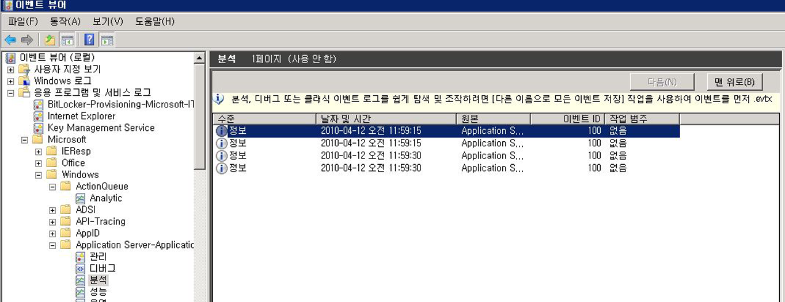

# <a name="configuring-tracking-for-a-workflow"></a><span data-ttu-id="86b1d-102">워크플로 추적 구성</span><span class="sxs-lookup"><span data-stu-id="86b1d-102">Configuring Tracking for a Workflow</span></span>
<span data-ttu-id="86b1d-103">워크플로는 다음과 같은 세 가지 방식으로 실행할 수 있습니다.</span><span class="sxs-lookup"><span data-stu-id="86b1d-103">A workflow can execute in three ways:</span></span>  
  
-   <span data-ttu-id="86b1d-104"><xref:System.ServiceModel.Activities.WorkflowServiceHost>에서 호스팅</span><span class="sxs-lookup"><span data-stu-id="86b1d-104">Hosted in <xref:System.ServiceModel.Activities.WorkflowServiceHost></span></span>  
  
-   <span data-ttu-id="86b1d-105"><xref:System.Activities.WorkflowApplication>으로 실행</span><span class="sxs-lookup"><span data-stu-id="86b1d-105">Executed as a <xref:System.Activities.WorkflowApplication></span></span>  
  
-   <span data-ttu-id="86b1d-106"><xref:System.Activities.WorkflowInvoker>를 사용하여 직접 실행</span><span class="sxs-lookup"><span data-stu-id="86b1d-106">Executed directly using <xref:System.Activities.WorkflowInvoker></span></span>  
  
 <span data-ttu-id="86b1d-107">워크플로 호스팅 옵션에 따라 코드 또는 구성 파일을 통해 추적 참가자를 추가할 수 있습니다.</span><span class="sxs-lookup"><span data-stu-id="86b1d-107">Depending on the workflow hosting option, a tracking participant can be added either through code or through a configuration file.</span></span> <span data-ttu-id="86b1d-108">이 항목에서는 <xref:System.Activities.WorkflowApplication> 및 <xref:System.ServiceModel.Activities.WorkflowServiceHost>에 추적 참가자를 추가하여 추적을 구성하는 방법과 <xref:System.Activities.WorkflowInvoker>를 사용할 때 추적을 활성화하는 방법에 대해 설명합니다.</span><span class="sxs-lookup"><span data-stu-id="86b1d-108">This topic describes how tracking is configured by adding a tracking participant to a <xref:System.Activities.WorkflowApplication> and to a <xref:System.ServiceModel.Activities.WorkflowServiceHost>, and how to enable tracking when using <xref:System.Activities.WorkflowInvoker>.</span></span>  
  
## <a name="configuring-workflow-application-tracking"></a><span data-ttu-id="86b1d-109">워크플로 응용 프로그램 추적 구성</span><span class="sxs-lookup"><span data-stu-id="86b1d-109">Configuring Workflow Application Tracking</span></span>  
 <span data-ttu-id="86b1d-110"><xref:System.Activities.WorkflowApplication> 클래스를 사용하여 워크플로를 실행할 수 있습니다.</span><span class="sxs-lookup"><span data-stu-id="86b1d-110">A workflow can run using the <xref:System.Activities.WorkflowApplication> class.</span></span> <span data-ttu-id="86b1d-111">이 항목에서는 [!INCLUDE[netfx_current_long](../../../includes/netfx-current-long-md.md)] 워크플로 호스트에 추적 참가자를 추가하여 <xref:System.Activities.WorkflowApplication> 워크플로 응용 프로그램에 대해 추적을 구성하는 방법을 보여 줍니다.</span><span class="sxs-lookup"><span data-stu-id="86b1d-111">This topic demonstrates how tracking is configured for a [!INCLUDE[netfx_current_long](../../../includes/netfx-current-long-md.md)] workflow application by adding a tracking participant to the <xref:System.Activities.WorkflowApplication> workflow host.</span></span> <span data-ttu-id="86b1d-112">이 경우 워크플로는 워크플로 응용 프로그램으로 실행됩니다.</span><span class="sxs-lookup"><span data-stu-id="86b1d-112">In this case, the workflow runs as a workflow application.</span></span> <span data-ttu-id="86b1d-113">구성 파일을 사용하는 대신 코드를 통해 워크플로 응용 프로그램을 구성하면 이 워크플로 응용 프로그램은 <xref:System.Activities.WorkflowApplication> 클래스를 사용하는 자체 호스팅 .exe 파일이 됩니다.</span><span class="sxs-lookup"><span data-stu-id="86b1d-113">You configure a workflow application through code (rather than by using a configuration file), which is a self-hosted .exe file using the <xref:System.Activities.WorkflowApplication> class.</span></span> <span data-ttu-id="86b1d-114">추적 참가자는 <xref:System.Activities.WorkflowApplication> 인스턴스에 확장으로 추가됩니다.</span><span class="sxs-lookup"><span data-stu-id="86b1d-114">The tracking participant is added as an extension to the <xref:System.Activities.WorkflowApplication> instance.</span></span> <span data-ttu-id="86b1d-115">이 작업은 WorkflowApplication 인스턴스에 대한 확장 컬렉션에 <xref:System.Activities.Tracking.TrackingParticipant>를 추가하여 수행됩니다.</span><span class="sxs-lookup"><span data-stu-id="86b1d-115">This is done by adding the <xref:System.Activities.Tracking.TrackingParticipant> to the extensions collection for the WorkflowApplication instance.</span></span>  
  
 <span data-ttu-id="86b1d-116">워크플로 응용 프로그램의 경우 다음 코드와 같이 <xref:System.Activities.Tracking.EtwTrackingParticipant> 동작 확장을 추가할 수 있습니다.</span><span class="sxs-lookup"><span data-stu-id="86b1d-116">For a workflow application, you can add the <xref:System.Activities.Tracking.EtwTrackingParticipant> behavior extension as shown in the following code.</span></span>  
  
```csharp  
LogActivity activity = new LogActivity();  
  
WorkflowApplication instance = new WorkflowApplication(activity);  
EtwTrackingParticipant trackingParticipant =  
    new EtwTrackingParticipant  
{  
  
        TrackingProfile = new TrackingProfile  
           {  
               Name = "SampleTrackingProfile",  
               ActivityDefinitionId = "ProcessOrder",  
               Queries = new WorkflowInstanceQuery  
               {  
                  States = { "*" }  
              }  
          }  
       };  
instance.Extensions.Add(trackingParticipant);  
```  
  
### <a name="configuring-workflow-service-tracking"></a><span data-ttu-id="86b1d-117">워크플로 서비스 추적 구성</span><span class="sxs-lookup"><span data-stu-id="86b1d-117">Configuring Workflow Service Tracking</span></span>  
 <span data-ttu-id="86b1d-118">워크플로에서 호스팅되는 경우 WCF 서비스로 노출 될 수 있습니다는 <xref:System.ServiceModel.Activities.WorkflowServiceHost> 서비스 호스트입니다.</span><span class="sxs-lookup"><span data-stu-id="86b1d-118">A workflow can be exposed as a WCF service when hosted in the <xref:System.ServiceModel.Activities.WorkflowServiceHost> service host.</span></span> <span data-ttu-id="86b1d-119"><xref:System.ServiceModel.Activities.WorkflowServiceHost>는 워크플로 기반 서비스에 대한 특수 .NET ServiceHost 구현입니다.</span><span class="sxs-lookup"><span data-stu-id="86b1d-119"><xref:System.ServiceModel.Activities.WorkflowServiceHost> is a specialized .NET ServiceHost implementation for a workflow-based service.</span></span> <span data-ttu-id="86b1d-120">이 단원에서는 [!INCLUDE[netfx_current_short](../../../includes/netfx-current-short-md.md)]에서 실행되는 <xref:System.ServiceModel.Activities.WorkflowServiceHost> 워크플로 서비스에 대해 추적을 구성하는 방법에 대해 설명합니다.</span><span class="sxs-lookup"><span data-stu-id="86b1d-120">This section explains how to configure tracking for a [!INCLUDE[netfx_current_short](../../../includes/netfx-current-short-md.md)] workflow service running in <xref:System.ServiceModel.Activities.WorkflowServiceHost>.</span></span> <span data-ttu-id="86b1d-121">이러한 추적 기능은 Web.config 파일(웹 호스팅 서비스의 경우) 또는 App.config 파일(콘솔 응용 프로그램과 같은 독립 실행형 응용 프로그램에서 호스트되는 서비스의 경우)을 통해 서비스 동작을 지정하거나, 코드를 통해 서비스 호스트에 대한 <xref:System.ServiceModel.Description.ServiceDescription.Behaviors%2A> 컬렉션에 추적별 동작을 추가하여 구성됩니다.</span><span class="sxs-lookup"><span data-stu-id="86b1d-121">It is configured through a Web.config file (for a Web-hosted service) or an App.config file (for a service hosted in a stand-alone application, such as a console application) by specifying a service behavior or through code by adding a tracking-specific behavior to the <xref:System.ServiceModel.Description.ServiceDescription.Behaviors%2A> collection for the service host.</span></span>  
  
 <span data-ttu-id="86b1d-122"><xref:System.ServiceModel.WorkflowServiceHost>에서 호스트되는 워크플로 서비스의 경우 다음 예제와 같이 구성 파일에서 <<xref:System.Activities.Tracking.EtwTrackingParticipant>> 요소를 사용하여 `behavior`를 추가할 수 있습니다.</span><span class="sxs-lookup"><span data-stu-id="86b1d-122">For a workflow service hosted in <xref:System.ServiceModel.WorkflowServiceHost>, you can add the <xref:System.Activities.Tracking.EtwTrackingParticipant> using the <`behavior`> element in a configuration file, as shown in the following example.</span></span>  
  
```xml  
<behaviors>  
   <serviceBehaviors>  
        <behavior>  
          <etwTracking profileName="Sample Tracking Profile" />  
        </behavior>              
   </serviceBehaviors>  
<behaviors>  
```  
  
 <span data-ttu-id="86b1d-123">또는 <xref:System.ServiceModel.WorkflowServiceHost>에서 호스트되는 워크플로 서비스의 경우 코드를 통해 <xref:System.Activities.Tracking.EtwTrackingParticipant> 동작 확장을 추가할 수 있습니다.</span><span class="sxs-lookup"><span data-stu-id="86b1d-123">Alternatively, for a workflow service hosted in <xref:System.ServiceModel.WorkflowServiceHost>, you can add the <xref:System.Activities.Tracking.EtwTrackingParticipant> behavior extension through code.</span></span> <span data-ttu-id="86b1d-124">사용자 지정 추적 참가자를 추가하려면 다음 예제 코드와 같이 새 동작 확장을 만들어 <xref:System.ServiceModel.ServiceHost>에 추가합니다.</span><span class="sxs-lookup"><span data-stu-id="86b1d-124">To add a custom tracking participant, create a new behavior extension and add it to the <xref:System.ServiceModel.ServiceHost> as shown in the following example code.</span></span>  
  
> [!NOTE]
>  <span data-ttu-id="86b1d-125">사용자 지정 추적 참가자를 추가 하는 사용자 지정 동작 요소를 만드는 방법을 보여 주는 샘플 코드를 보려는 경우 참조는 [추적](../../../docs/framework/windows-workflow-foundation/samples/tracking.md) 샘플입니다.</span><span class="sxs-lookup"><span data-stu-id="86b1d-125">If you want to view sample code that shows how to create a custom behavior element that adds a custom tracking participant, refer to the [Tracking](../../../docs/framework/windows-workflow-foundation/samples/tracking.md) samples.</span></span>  
  
```  
ServiceHost svcHost = new ServiceHost(typeof(WorkflowService), new   
                                 Uri("http://localhost:8001/Sample"));  
EtwTrackingBehavior trackingBehavior =   
    new EtwTrackingBehavior  
    {  
        ProfileName = "Sample Tracking Profile"  
    };  
svcHost.Description.Behaviors.Add(trackingBehavior);  
svcHost.Open();  
```  
  
 <span data-ttu-id="86b1d-126">추적 참가자는 동작에 대한 확장으로 워크플로 서비스 호스트에 추가됩니다.</span><span class="sxs-lookup"><span data-stu-id="86b1d-126">The tracking participant is added to the workflow service host as an extension to the behavior.</span></span>  
  
 <span data-ttu-id="86b1d-127">다음 샘플 코드에서는 구성 파일에서 추적 프로필을 읽는 방법을 보여 줍니다.</span><span class="sxs-lookup"><span data-stu-id="86b1d-127">This sample code below shows how to read a tracking profile from configuration file.</span></span>  
  
```  
TrackingProfile GetProfile(string profileName, string displayName)  
        {  
            TrackingProfile trackingProfile = null;  
            TrackingSection trackingSection = (TrackingSection)WebConfigurationManager.GetSection("system.serviceModel/tracking");  
            if (trackingSection == null)   
            {  
                return null;  
            }  
  
            if (profileName == null)   
            {  
                profileName = "";  
            }  
  
            //Find the profile with the specified profile name in the list of profile found in config  
            var match = from p in new List<TrackingProfile>(trackingSection.TrackingProfiles)  
                        where (p.Name == profileName) && ((p.ActivityDefinitionId == displayName) || (p.ActivityDefinitionId == "*"))  
                        select p;  
  
            if (match.Count() == 0)  
            {  
                //return an empty profile  
                trackingProfile = new TrackingProfile()  
                {  
                    ActivityDefinitionId = displayName  
                };  
  
            }  
            else  
            {  
                trackingProfile = match.First();  
            }  
  
            return trackingProfile;  
```  
  
 <span data-ttu-id="86b1d-128">이 샘플 코드에서는 워크플로 호스트에 추적 프로필을 추가하는 방법을 보여 줍니다.</span><span class="sxs-lookup"><span data-stu-id="86b1d-128">This sample code shows how to add a tracking profile to a workflow host.</span></span>  
  
```  
WorkflowServiceHost workflowServiceHost = serviceHostBase as WorkflowServiceHost;  
if (null != workflowServiceHost)  
{  
              string workflowDisplayName = workflowServiceHost.Activity.DisplayName;  
               TrackingProfile trackingProfile = GetProfile(this.profileName, workflowDisplayName);  
                workflowServiceHost.WorkflowExtensions.Add(()  => new EtwTrackingParticipant  {  
               TrackingProfile = trackingProfile  
                        });  
 }  
```  
  
> [!NOTE]
>  <span data-ttu-id="86b1d-129">추적 프로필에 대 한 자세한 내용은 참조 [추적 프로필](http://go.microsoft.com/fwlink/?LinkId=201310)합니다.</span><span class="sxs-lookup"><span data-stu-id="86b1d-129">For more information on tracking profiles, refer to [Tracking Profiles](http://go.microsoft.com/fwlink/?LinkId=201310).</span></span>  
  
### <a name="configuring-tracking-using-workflowinvoker"></a><span data-ttu-id="86b1d-130">WorkflowInvoker를 사용하여 추적 구성</span><span class="sxs-lookup"><span data-stu-id="86b1d-130">Configuring tracking using WorkflowInvoker</span></span>  
 <span data-ttu-id="86b1d-131"><xref:System.Activities.WorkflowInvoker>를 사용하여 실행되는 워크플로에 대한 추적을 구성하려면 추적 공급자를 <xref:System.Activities.WorkflowInvoker> 인스턴스에 대한 확장으로 추가합니다.</span><span class="sxs-lookup"><span data-stu-id="86b1d-131">To configure tracking for a workflow executed using <xref:System.Activities.WorkflowInvoker>, add the tracking provider as an extension to a <xref:System.Activities.WorkflowInvoker> instance.</span></span> <span data-ttu-id="86b1d-132">다음 코드 예제는는 [사용자 지정 추적](../../../docs/framework/windows-workflow-foundation/samples/custom-tracking.md) 샘플.</span><span class="sxs-lookup"><span data-stu-id="86b1d-132">The following code example is from the [Custom Tracking](../../../docs/framework/windows-workflow-foundation/samples/custom-tracking.md) sample.</span></span>  
  
```  
WorkflowInvoker invoker = new WorkflowInvoker(BuildSampleWorkflow());  
invoker.Extensions.Add(customTrackingParticipant);  
invoker.Invoke();  
```  
  
### <a name="viewing-tracking-records-in-event-viewer"></a><span data-ttu-id="86b1d-133">이벤트 뷰어에서 추적 레코드 보기</span><span class="sxs-lookup"><span data-stu-id="86b1d-133">Viewing tracking records in Event Viewer</span></span>  
 <span data-ttu-id="86b1d-134">WF 실행을 추적할 때 특별히 관심을 두고 확인할 이벤트 뷰어 로그 두 가지는 분석 로그와 디버그 로그입니다.</span><span class="sxs-lookup"><span data-stu-id="86b1d-134">There are two Event Viewer logs of particular interest to view when tracking WF execution - the Analytic log and the Debug log.</span></span> <span data-ttu-id="86b1d-135">둘 다 Microsoft&#124;Windows&#124;응용 프로그램 서버-응용 프로그램 노드.</span><span class="sxs-lookup"><span data-stu-id="86b1d-135">Both reside under the Microsoft&#124;Windows&#124;Application Server-Applications node.</span></span>  <span data-ttu-id="86b1d-136">이 섹션의 로그에는 전체 시스템에 영향을 미치는 이벤트가 아닌 단일 응용 프로그램의 이벤트가 있습니다.</span><span class="sxs-lookup"><span data-stu-id="86b1d-136">Logs within this section contain events from a single application rather than events that have an impact on the entire system.</span></span>  
  
 <span data-ttu-id="86b1d-137">디버그 추적 이벤트는 디버그 로그에 기록됩니다.</span><span class="sxs-lookup"><span data-stu-id="86b1d-137">Debug trace events are written to the Debug Log.</span></span> <span data-ttu-id="86b1d-138">이벤트 뷰어에서 WF 디버그 추적 이벤트를 수집하려면 디버그 로그를 사용합니다.</span><span class="sxs-lookup"><span data-stu-id="86b1d-138">To collect WF debug trace events in the Event Viewer, enable the Debug Log.</span></span>  
  
1.  <span data-ttu-id="86b1d-139">이벤트 뷰어를 열려면 **시작**, 클릭 하 고 **실행 합니다.**</span><span class="sxs-lookup"><span data-stu-id="86b1d-139">To open Event Viewer, click **Start**, and then click **Run.**</span></span> <span data-ttu-id="86b1d-140">실행 대화 상자에 입력 `eventvwr`합니다.</span><span class="sxs-lookup"><span data-stu-id="86b1d-140">In the Run dialog, type `eventvwr`.</span></span>  
  
2.  <span data-ttu-id="86b1d-141">이벤트 뷰어 대화 상자에서 확장 된 **Applications and Services Logs** 노드.</span><span class="sxs-lookup"><span data-stu-id="86b1d-141">In the Event Viewer dialog, expand the **Applications and Services Logs** node.</span></span>  
  
3.  <span data-ttu-id="86b1d-142">확장 된 **Microsoft**, **Windows**, 및 **응용 프로그램 서버-응용 프로그램** 노드.</span><span class="sxs-lookup"><span data-stu-id="86b1d-142">Expand the **Microsoft**, **Windows**, and **Application Server-Applications** nodes.</span></span>  
  
4.  <span data-ttu-id="86b1d-143">마우스 오른쪽 단추로 클릭는 **디버그** 아래의 노드는 **응용 프로그램 서버-응용 프로그램** 노드를 선택한 **로그 사용**합니다.</span><span class="sxs-lookup"><span data-stu-id="86b1d-143">Right-click the **Debug** node under the **Application Server-Applications** node, and select **Enable Log**.</span></span>  
  
5.  <span data-ttu-id="86b1d-144">추적이 설정된 응용 프로그램을 실행하여 추적 이벤트를 생성합니다.</span><span class="sxs-lookup"><span data-stu-id="86b1d-144">Execute your tracing-enabled application to generate tracing events.</span></span>  
  
6.  <span data-ttu-id="86b1d-145">마우스 오른쪽 단추로 클릭는 **디버그** 노드 선택한 **새로 고칩니다.**</span><span class="sxs-lookup"><span data-stu-id="86b1d-145">Right-click the **Debug** node and select **Refresh.**</span></span> <span data-ttu-id="86b1d-146">가운데 창에 추적 이벤트가 표시됩니다.</span><span class="sxs-lookup"><span data-stu-id="86b1d-146">Tracing events should be visible in the center pane.</span></span>  
  
 <span data-ttu-id="86b1d-147">WF 4는 추적 레코드를 ETW(Windows용 이벤트 추적) 세션에 기록하는 추적 참가자를 제공합니다.</span><span class="sxs-lookup"><span data-stu-id="86b1d-147">WF 4 provides a tracking participant that writes tracking records to an ETW (Event Tracing for Windows) session.</span></span> <span data-ttu-id="86b1d-148">ETW 추적 참가자는 추적 레코드를 구독하도록 추적 프로필을 사용하여 구성됩니다.</span><span class="sxs-lookup"><span data-stu-id="86b1d-148">The ETW tracking participant is configured with a tracking profile to subscribe to tracking records.</span></span>  <span data-ttu-id="86b1d-149">추적을 사용하도록 하면 오류 추적 레코드를 ETW로 내보냅니다.</span><span class="sxs-lookup"><span data-stu-id="86b1d-149">When tracking is enabled, errors tracking records are emitted to ETW.</span></span> <span data-ttu-id="86b1d-150">ETW 추적 참가자가 보낸 추적 이벤트에 해당하는 ETW 추적 이벤트(100-113)는 분석 로그에 기록됩니다.</span><span class="sxs-lookup"><span data-stu-id="86b1d-150">ETW tracking events (between the range of 100-113) corresponding to the tracking events emitted by the ETW tracking participant are written to the Analytic Log.</span></span>  
  
 <span data-ttu-id="86b1d-151">추적 레코드를 보려면 아래 단계를 따릅니다.</span><span class="sxs-lookup"><span data-stu-id="86b1d-151">To view tracking records, follow these steps.</span></span>  
  
1.  <span data-ttu-id="86b1d-152">이벤트 뷰어를 열려면 **시작**, 클릭 하 고 **실행 합니다.**</span><span class="sxs-lookup"><span data-stu-id="86b1d-152">To open Event Viewer, click **Start**, and then click **Run.**</span></span> <span data-ttu-id="86b1d-153">실행 대화 상자에 입력 `eventvwr`합니다.</span><span class="sxs-lookup"><span data-stu-id="86b1d-153">In the Run dialog, type `eventvwr`.</span></span>  
  
2.  <span data-ttu-id="86b1d-154">이벤트 뷰어 대화 상자에서 확장 된 **Applications and Services Logs** 노드.</span><span class="sxs-lookup"><span data-stu-id="86b1d-154">In the Event Viewer dialog, expand the **Applications and Services Logs** node.</span></span>  
  
3.  <span data-ttu-id="86b1d-155">확장 된 **Microsoft**, **Windows**, 및 **응용 프로그램 서버-응용 프로그램** 노드.</span><span class="sxs-lookup"><span data-stu-id="86b1d-155">Expand the **Microsoft**, **Windows**, and **Application Server-Applications** nodes.</span></span>  
  
4.  <span data-ttu-id="86b1d-156">마우스 오른쪽 단추로 클릭는 **분석** 아래의 노드는 **응용 프로그램 서버-응용 프로그램** 노드를 선택한 **로그 사용**합니다.</span><span class="sxs-lookup"><span data-stu-id="86b1d-156">Right-click the **Analytic** node under the **Application Server-Applications** node, and select **Enable Log**.</span></span>  
  
5.  <span data-ttu-id="86b1d-157">추적이 설정된 응용 프로그램을 실행하여 추적 레코드를 생성합니다.</span><span class="sxs-lookup"><span data-stu-id="86b1d-157">Execute your tracking-enabled application to generate tracking records.</span></span>  
  
6.  <span data-ttu-id="86b1d-158">마우스 오른쪽 단추로 클릭는 **분석** 노드 선택한 **새로 고칩니다.**</span><span class="sxs-lookup"><span data-stu-id="86b1d-158">Right-click the **Analytic** node and select **Refresh.**</span></span> <span data-ttu-id="86b1d-159">가운데 창에 추적 레코드가 표시됩니다.</span><span class="sxs-lookup"><span data-stu-id="86b1d-159">Tracking records should be visible in the center pane.</span></span>  
  
 <span data-ttu-id="86b1d-160">다음 이미지는 이벤트 뷰어의 추적 이벤트를 보여 줍니다.</span><span class="sxs-lookup"><span data-stu-id="86b1d-160">The following image shows tracking events in the event viewer.</span></span>  
  
 <span data-ttu-id="86b1d-161"></span><span class="sxs-lookup"><span data-stu-id="86b1d-161"></span></span>  
  
### <a name="registering-an-application-specific-provider-id"></a><span data-ttu-id="86b1d-162">응용 프로그램별 공급자 ID 등록</span><span class="sxs-lookup"><span data-stu-id="86b1d-162">Registering an application-specific provider ID</span></span>  
 <span data-ttu-id="86b1d-163">이벤트를 특정 응용 프로그램 로그에 기록해야 하는 경우 아래 단계에 따라 새 공급자 매니페스트를 등록합니다.</span><span class="sxs-lookup"><span data-stu-id="86b1d-163">If events need to be written to a specific application log, follow these steps to register the new provider manifest.</span></span>  
  
1.  <span data-ttu-id="86b1d-164">응용 프로그램 구성 파일에 공급자 ID를 선언합니다.</span><span class="sxs-lookup"><span data-stu-id="86b1d-164">Declare the provider ID in the application configuration file.</span></span>  
  
    ```xml  
    <system.serviceModel>  
        <diagnostics etwProviderId="2720e974-9fe9-477a-bb60-81fe3bf91eec"/>  
    </system.serviceModel>  
    ```  
  
2.  <span data-ttu-id="86b1d-165">%Windir%\Microsoft.NET\Framework에서 매니페스트 파일을 복사\\< 최신 버전의 [!INCLUDE[netfx_current_short](../../../includes/netfx-current-short-md.md)]> 임시 위치로 \Microsoft.Windows.ApplicationServer.Applications.man 넣고 이름을 Microsoft.Windows.ApplicationServer.Applications_Provider1.man</span><span class="sxs-lookup"><span data-stu-id="86b1d-165">Copy the manifest file from %windir%\Microsoft.NET\Framework\\<latest version of [!INCLUDE[netfx_current_short](../../../includes/netfx-current-short-md.md)]>\Microsoft.Windows.ApplicationServer.Applications.man to a temporary location, and rename it to Microsoft.Windows.ApplicationServer.Applications_Provider1.man</span></span>  
  
3.  <span data-ttu-id="86b1d-166">매니페스트 파일의 GUID를 새 GUID로 변경합니다.</span><span class="sxs-lookup"><span data-stu-id="86b1d-166">Change the GUID in the manifest file to the new GUID.</span></span>  
  
    ```xml  
    <provider name="Microsoft-Windows-Application Server-Applications" guid="{2720e974-9fe9-477a-bb60-81fe3bf91eec}"  
    ```  
  
4.  <span data-ttu-id="86b1d-167">기본 공급자를 제거하지 않으려는 경우에는 공급자 이름을 변경합니다.</span><span class="sxs-lookup"><span data-stu-id="86b1d-167">Change the provider name if you do not want to uninstall the default provider.</span></span>  
  
    ```xml  
    <provider name="Microsoft-Windows-Application Server-Applications" guid="{2720e974-9fe9-477a-bb60-81fe3bf91eec}"  
    ```  
  
5.  <span data-ttu-id="86b1d-168">이전 단계에서 공급자 이름을 변경한 경우 매니페스트 파일의 채널 이름을 새 공급자 이름으로 변경합니다.</span><span class="sxs-lookup"><span data-stu-id="86b1d-168">If you changed the provider name in the previous step, change the channel names in the manifest file to the new provider name.</span></span>  
  
    ```xml  
    <channel name="Microsoft-Windows-Application Server-Applications_Provider1/Admin" chid="ADMIN_CHANNEL" symbol="ADMIN_CHANNEL" type="Admin" enabled="false" isolation="Application" message="$(string.MICROSOFT_WINDOWS_APPLICATIONSERVER_APPLICATIONS.channel.ADMIN_CHANNEL.message)" />  
    <channel name="Microsoft-Windows-Application Server-Applications_Provider1/Operational" chid="OPERATIONAL_CHANNEL" symbol="OPERATIONAL_CHANNEL" type="Operational" enabled="false" isolation="Application" message="$(string.MICROSOFT_WINDOWS_APPLICATIONSERVER_APPLICATIONS.channel.OPERATIONAL_CHANNEL.message)" />  
    <channel name="Microsoft-Windows-Application Server-Applications_Provider1/Analytic" chid="ANALYTIC_CHANNEL" symbol="ANALYTIC_CHANNEL" type="Analytic" enabled="false" isolation="Application" message="$(string.MICROSOFT_WINDOWS_APPLICATIONSERVER_APPLICATIONS.channel.ANALYTIC_CHANNEL.message)" />  
    <channel name="Microsoft-Windows-Application Server-Applications_Provider1/Debug" chid="DEBUG_CHANNEL" symbol="DEBUG_CHANNEL" type="Debug" enabled="false" isolation="Application" message="$(string.MICROSOFT_WINDOWS_APPLICATIONSERVER_APPLICATIONS.channel.DEBUG_CHANNEL.message)" />  
    <channel name="Microsoft-Windows-Application Server-Applications_Provider1/Perf" chid="PERF_CHANNEL" symbol="PERF_CHANNEL" type="Analytic" enabled="false" isolation="Application" message="$(string.MICROSOFT_WINDOWS_APPLICATIONSERVER_APPLICATIONS.channel.PERF_CHANNEL.message)" />  
    ```  
  
6.  <span data-ttu-id="86b1d-169">다음 단계에 따라 리소스 DLL을 생성합니다.</span><span class="sxs-lookup"><span data-stu-id="86b1d-169">Generate the resource DLL by following these steps.</span></span>  
  
    1.  <span data-ttu-id="86b1d-170">Windows SDK를 설치합니다.</span><span class="sxs-lookup"><span data-stu-id="86b1d-170">Install the Windows SDK.</span></span> <span data-ttu-id="86b1d-171">Windows SDK에 포함 메시지 컴파일러 ([mc.exe](http://go.microsoft.com/fwlink/?LinkId=184606)) 및 리소스 컴파일러 ([rc.exe](http://go.microsoft.com/fwlink/?LinkId=184605)).</span><span class="sxs-lookup"><span data-stu-id="86b1d-171">The Windows SDK includes the message compiler ([mc.exe](http://go.microsoft.com/fwlink/?LinkId=184606)) and resource compiler ([rc.exe](http://go.microsoft.com/fwlink/?LinkId=184605)).</span></span>  
  
    2.  <span data-ttu-id="86b1d-172">Windows SDK 명령 프롬프트에서 새 매니페스트 파일에 대해 mc.exe를 실행합니다.</span><span class="sxs-lookup"><span data-stu-id="86b1d-172">In a Windows SDK command prompt, run mc.exe on the new manifest file.</span></span>  
  
        ```  
        mc.exe Microsoft.Windows.ApplicationServer.Applications_Provider1.man  
        ```  
  
    3.  <span data-ttu-id="86b1d-173">이전 단계에서 생성된 리소스 파일에 대해 rc.exe를 실행합니다.</span><span class="sxs-lookup"><span data-stu-id="86b1d-173">Run rc.exe on the resource file generated in the previous step.</span></span>  
  
        ```  
        rc.exe  Microsoft.Windows.ApplicationServer.Applications_Provider1.rc  
        ```  
  
    4.  <span data-ttu-id="86b1d-174">NewProviderReg.cs라는 빈 cs 파일을 만듭니다.</span><span class="sxs-lookup"><span data-stu-id="86b1d-174">Create an empty cs file called NewProviderReg.cs.</span></span>  
  
    5.  <span data-ttu-id="86b1d-175">C# 컴파일러를 사용하여 리소스 DLL을 만듭니다.</span><span class="sxs-lookup"><span data-stu-id="86b1d-175">Create a resource DLL using the C# compiler.</span></span>  
  
        ```  
        csc /target:library /win32res:Microsoft.Windows.ApplicationServer.Applications_Provider1.res NewProviderReg.cs /out:Microsoft.Windows.ApplicationServer.Applications_Provider1.dll  
        ```  
  
    6.  <span data-ttu-id="86b1d-176">`Microsoft.Windows.ApplicationServer.Applications.Provider1.man`의 매니페스트 파일에 있는 리소스 및 메시지 dll 이름을 새 dll 이름으로 변경합니다.</span><span class="sxs-lookup"><span data-stu-id="86b1d-176">Change the resource and message dl namel in the manifest file from `Microsoft.Windows.ApplicationServer.Applications.Provider1.man` to the new dll name.</span></span>  
  
        ```xml  
        <provider name="Microsoft-Windows-Application Server-Applications_Provider1" guid="{2720e974-9fe9-477a-bb60-81fe3bf91eec}" symbol="Microsoft_Windows_ApplicationServer_ApplicationEvents" resourceFileName="<dll directory>\Microsoft.Windows.ApplicationServer.Applications_Provider1.dll" messageFileName="<dll directory>\Microsoft.Windows.ApplicationServer.Applications_Provider1.dll">  
        ```  
  
    7.  <span data-ttu-id="86b1d-177">사용 하 여 [wevtutil](http://go.microsoft.com/fwlink/?LinkId=184608) 매니페스트를 등록 합니다.</span><span class="sxs-lookup"><span data-stu-id="86b1d-177">Use [wevtutil](http://go.microsoft.com/fwlink/?LinkId=184608) to register the manifest.</span></span>  
  
        ```  
        wevtutil im Microsoft.Windows.ApplicationServer.Applications_Provider1.man  
        ```  
  
## <a name="see-also"></a><span data-ttu-id="86b1d-178">참고 항목</span><span class="sxs-lookup"><span data-stu-id="86b1d-178">See Also</span></span>  
 [<span data-ttu-id="86b1d-179">Windows Server App Fabric 모니터링</span><span class="sxs-lookup"><span data-stu-id="86b1d-179">Windows Server App Fabric Monitoring</span></span>](http://go.microsoft.com/fwlink/?LinkId=201273)  
 [<span data-ttu-id="86b1d-180">App Fabric로 응용 프로그램 모니터링</span><span class="sxs-lookup"><span data-stu-id="86b1d-180">Monitoring Applications with App Fabric</span></span>](http://go.microsoft.com/fwlink/?LinkId=201275)
