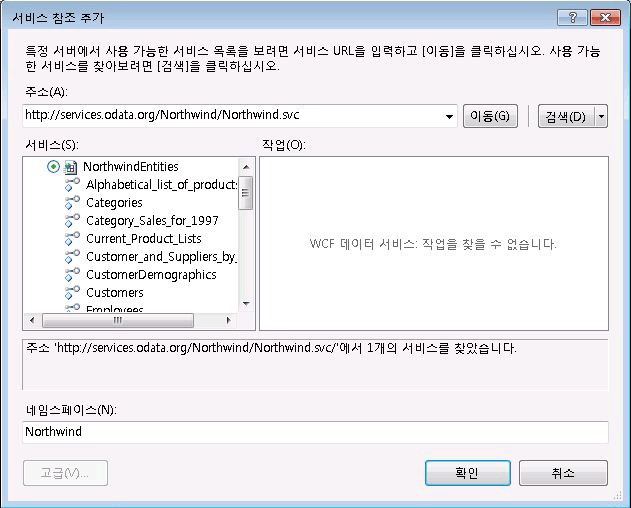

# 워크플로에서 OData 피드 사용
WCF Data Services는 REST(Representational State Transfer)의 의미 체계를 사용하여 웹 또는 인트라넷을 통해 데이터를 노출하고 사용하기 위해 Open Data Protocol(OData)을 사용하는 서비스를 만들 수 있도록 하는 [!INCLUDE[dnprdnshort](../../../includes/dnprdnshort-md.md)] 의 구성 요소입니다. OData는 URI로 주소를 지정할 수 있는 리소스로 데이터를 노출합니다. HTTP 요청을 보내고 데이터 서비스에서 반환하는 OData 피드를 처리할 수 있는 응용 프로그램은 모두 OData 기반 데이터 서비스와 상호 작용할 수 있습니다. 또한 WCF Data Services에는 [!INCLUDE[dnprdnshort](../../../includes/dnprdnshort-md.md)] 응용 프로그램에서 OData 피드를 사용할 때 보다 다양한 기능을 갖춘 프로그래밍 환경을 제공하는 클라이언트 라이브러리가 포함되어 있습니다. 이 항목에서는 클라이언트 라이브러리를 사용하거나 사용하지 않고 워크플로에서 OData 피드를 사용하는 방법에 대해 간략하게 설명합니다.  
  
## 샘플 Northwind OData 서비스 사용  
 이 항목의 예제에서는 사용 샘플 Northwind 데이터 서비스에 있는 [ http://services.odata.org/Northwind/Northwind.svc/ ](http://go.microsoft.com/fwlink/?LinkID=187426)합니다. 이 서비스는 [OData SDK](http://go.microsoft.com/fwlink/?LinkID=185248) 의 일부로 제공되며 샘플 Northwind 데이터베이스에 읽기 전용으로 액세스할 수 있게 해줍니다. 쓰기 권한이 필요하거나 로컬 WCF 데이터 서비스가 필요한 경우 [퀵 스타트(WCF Data Services)](http://go.microsoft.com/fwlink/?LinkID=131076) 의 단계를 수행하여 Northwind 데이터베이스에 액세스할 수 있게 해 주는 로컬 OData 서비스를 만들 수 있습니다. 퀵 스타트를 따르는 경우 이 항목의 예제 코드에 제공된 URI를 로컬 URI로 바꿉니다.  
  
## 클라이언트 라이브러리를 사용하여 OData 피드 사용  
 WCF Data Services에는 [!INCLUDE[dnprdnshort](../../../includes/dnprdnshort-md.md)] 및 클라이언트 응용 프로그램에서 OData 피드를 보다 쉽게 사용할 수 있도록 클라이언트 라이브러리가 포함되어 있습니다. 이러한 라이브러리는 HTTP 메시지를 보내고 받는 작업을 단순화합니다. 또한 엔터티 데이터를 나타내는 CLR 개체로 메시지 페이로드를 변환합니다. 클라이언트 라이브러리는 두 가지 핵심 클래스인 <xref:System.Data.Services.Client.DataServiceContext> 및 <xref:System.Data.Services.Client.DataServiceQuery%601>를 제공합니다. 이러한 클래스를 사용하면 데이터 서비스를 쿼리한 다음 반환된 엔터티 데이터를 CLR 개체로 사용하여 작업할 수 있습니다. 이 단원에서는 클라이언트 라이브러리를 사용하는 활동을 만드는 두 가지 방법에 대해 설명합니다.  
  
### WCF Data Services에 서비스 참조 추가  
 Northwind 클라이언트 라이브러리를 생성하려면 **에서** 서비스 참조 추가 [!INCLUDE[vs_current_long](../../../includes/vs-current-long-md.md)] 대화 상자를 사용하여 Northwind OData 서비스에 참조를 추가할 수 있습니다.  
  
   
  
 서비스에서 노출하는 서비스 작업이 없으며 **서비스** 목록에 Northwind 데이터 서비스에서 노출하는 엔터티를 나타내는 항목이 있습니다. 서비스 참조가 추가되면 이러한 엔터티에 대한 클래스가 생성되며 클라이언트 코드에서 사용될 수 있습니다. 이 항목의 예제에서는 이러한 클래스와 `NorthwindEntities` 클래스를 사용하여 쿼리를 수행합니다.  
  
> [!NOTE]
>  자세한 내용은 [데이터 서비스 클라이언트 라이브러리 (WCF Data Services) 생성](http://go.microsoft.com/fwlink/?LinkID=191611)합니다.  
  
### 비동기 메서드 사용  
 웹을 통해 리소스에 액세스할 때 발생할 수 있는 지연 문제를 해결하려면 WCF Data Services에 비동기적으로 액세스하는 것이 좋습니다. 쿼리를 호출 하는 것에 대 한 비동기 메서드를 포함 하는 WCF Data Services 클라이언트 라이브러리 및 Windows WF (Workflow Foundation)를 제공 합니다 <xref:System.Activities.AsyncCodeActivity> 비동기 활동을 작성 하는 것에 대 한 클래스입니다. <xref:System.Activities.AsyncCodeActivity> 파생 동작은 비동기 메서드가 있는 [!INCLUDE[dnprdnshort](../../../includes/dnprdnshort-md.md)] 클래스를 사용하여 기록될 수 있거나, 비동기적으로 실행되는 코드는 메서드에 넣어 대리자를 사용하여 호출할 수 있습니다. 이 단원에서는 <xref:System.Activities.AsyncCodeActivity> 파생 활동의 두 가지 예제를 제공합니다. 한 예제에서는 WCF Data Services 클라이언트 라이브러리의 비동기 메서드를 사용하고 다른 예제에서는 대리자를 사용합니다.  
  
> [!NOTE]
>  자세한 내용은 [비동기 작업 (WCF Data Services)](http://go.microsoft.com/fwlink/?LinkId=193396) 하 고 [비동기 활동 만들기](../../../docs/framework/windows-workflow-foundation/creating-asynchronous-activities-in-wf.md)합니다.  
  
### 클라이언트 라이브러리 비동기 메서드 사용  
 <xref:System.Data.Services.Client.DataServiceQuery%601> 클래스는 OData 서비스를 비동기적으로 쿼리하기 위한 <xref:System.Data.Services.Client.DataServiceQuery%601.BeginExecute%2A> 및 <xref:System.Data.Services.Client.DataServiceQuery%601.EndExecute%2A> 메서드를 제공합니다. 이러한 메서드는 <xref:System.Activities.AsyncCodeActivity.BeginExecute%2A> 파생 클래스의 <xref:System.Activities.AsyncCodeActivity.EndExecute%2A> 및 <xref:System.Activities.AsyncCodeActivity> 재정의에서 호출할 수 있습니다. <xref:System.Activities.AsyncCodeActivity> <xref:System.Activities.AsyncCodeActivity.BeginExecute%2A> 재정의가 반환되면 워크플로가 유휴 상태가 될 수 있으며(그러나 유지되지는 않음), 비동기 작업이 완료되면 <xref:System.Activities.AsyncCodeActivity.EndExecute%2A> 는 런타임에서 호출됩니다.  
  
 다음 예제에서는 두 입력 인수를 가진 `OrdersByCustomer` 활동을 정의합니다. `CustomerId` 인수는 반환할 주문을 식별하는 고객을 나타내고, `ServiceUri` 인수는 쿼리할 OData 서비스의 URI를 나타냅니다. 활동이 `AsyncCodeActivity<IEnumerable<Order>>` 에서 파생되기 때문에 쿼리의 결과를 반환하는 데 사용되는 <xref:System.Activities.Activity%601.Result%2A> 출력 인수도 있습니다. <xref:System.Activities.AsyncCodeActivity.BeginExecute%2A> 재정의는 지정된 고객의 모든 주문을 선택하는 LINQ 쿼리를 만듭니다. 이 쿼리는 전달된 <xref:System.Activities.AsyncCodeActivityContext.UserState%2A> 의 <xref:System.Activities.AsyncCodeActivityContext>로 지정되며, 그런 다음 쿼리의 <xref:System.Data.Services.Client.DataServiceQuery%601.BeginExecute%2A> 메서드가 호출됩니다. 쿼리의 <xref:System.Data.Services.Client.DataServiceQuery%601.BeginExecute%2A> 로 전달된 콜백과 상태는 활동의 <xref:System.Activities.AsyncCodeActivity.BeginExecute%2A> 메서드에 전달되는 콜백과 상태입니다. 쿼리 실행이 완료되면 활동의 <xref:System.Activities.AsyncCodeActivity.EndExecute%2A> 메서드가 호출됩니다. 쿼리는 <xref:System.Activities.AsyncCodeActivityContext.UserState%2A>에서 검색되며, 그런 다음 쿼리의 <xref:System.Data.Services.Client.DataServiceQuery%601.EndExecute%2A> 메서드가 호출됩니다. 이 메서드는 지정된 엔터티 형식의 <xref:System.Collections.Generic.IEnumerable%601> 을 반환합니다. 이 경우에는 `Order`를 반환합니다. `IEnumerable<Order>` 가 <xref:System.Activities.AsyncCodeActivity%601>의 제네릭 형식이므로 이 `IEnumerable` 은 활동의 <xref:System.Activities.Activity%601.Result%2A> <xref:System.Activities.OutArgument%601> 로 설정됩니다.  
  
 [!code-csharp[CFX_WCFDataServicesActivityExample#100](../../../samples/snippets/csharp/VS_Snippets_CFX/CFX_WCFDataServicesActivityExample/cs/Program.cs#100)]  
  
 다음 예제에서는 `OrdersByCustomer` 활동이 지정된 고객의 주문 목록을 검색한 다음 <xref:System.Activities.Statements.ForEach%601> 활동이 반환된 주문을 열거하고 각 주문의 날짜를 콘솔에 기록합니다.  
  
 [!code-csharp[CFX_WCFDataServicesActivityExample#10](../../../samples/snippets/csharp/VS_Snippets_CFX/CFX_WCFDataServicesActivityExample/cs/Program.cs#10)]  
  
 이 워크플로가 호출되면 다음 데이터가 콘솔에 기록됩니다.  
  
 **WCF 데이터 서비스를 호출 하는 중...**  
**8/25/1997**   
**10/3/1997**   
**10/13/1997**   
**1/15/1998**   
**3/16/1998**   
**4/9/1998**    
> [!NOTE]
>  OData 서버에 연결할 수 없는 경우 다음 예외와 유사한 예외가 발생합니다.  
>   
>  처리되지 않은 예외: System.InvalidOperationException: 이 요청을 처리하는 동안 오류가 발생했습니다. ---> System.Net.WebException: 원격 서버에 연결할 수 없습니다. ---> System.Net.Sockets.SocketException: 연결된 구성원으로부터 응답이 없어 연결하지 못했거나, 호스트로부터 응답이 없어 연결이 끊어졌습니다.  
  
 쿼리에서 반환된 데이터를 추가로 처리해야 하는 경우 활동의 <xref:System.Activities.AsyncCodeActivity%601.EndExecute%2A> 재정의에서 이를 수행할 수 있습니다. <xref:System.Activities.AsyncCodeActivity%601.BeginExecute%2A> 및 <xref:System.Activities.AsyncCodeActivity%601.EndExecute%2A> 는 워크플로 스레드를 사용하여 호출되며 이러한 재정의의 모든 코드는 비동기적으로 실행되지 않습니다. 추가 처리가 광범위하거나 오래 실행되는 경우나 쿼리 결과가 페이징되는 경우 다음 단원에서 설명하는 방법을 고려해야 합니다. 이 방법에서는 대리자를 사용하여 쿼리를 실행하고 비동기적으로 추가 처리를 수행합니다.  
  
### 대리자 사용  
 [!INCLUDE[dnprdnshort](../../../includes/dnprdnshort-md.md)] 기반 활동은 <xref:System.Activities.AsyncCodeActivity>클래스의 비동기 메서드를 호출할 뿐만 아니라 해당 메서드 중 하나에서 비동기 논리도 정의할 수 있습니다. 이 메서드는 활동의 <xref:System.Activities.AsyncCodeActivity.BeginExecute%2A> 재정의에서 대리자를 사용하여 지정됩니다. 메서드가 반환될 때 런타임에서 활동의 <xref:System.Activities.AsyncCodeActivity.EndExecute%2A> 재정의를 호출합니다. 워크플로에서 OData 서비스를 호출할 때 이 메서드를 사용하여 서비스를 쿼리하고 추가 처리를 제공할 수 있습니다.  
  
 다음 예제에서는 `ListCustomers` 활동을 정의합니다. 이 활동은 샘플 Northwind 데이터 서비스를 쿼리하고 Northwind 데이터베이스의 모든 고객이 포함된 `List<Customer>` 를 반환합니다. 비동기 작업은 `GetCustomers` 메서드에서 수행됩니다. 이 메서드는 서비스에서 모든 고객을 쿼리하여 `List<Customer>`에 복사합니다. 그런 다음 결과가 페이징되는지 확인하고 페이징되면 서비스에서 결과의 다음 페이지를 쿼리하여 목록에 추가하고 모든 고객 데이터가 검색될 때까지 계속합니다.  
  
> [!NOTE]
>  WCF Data Services의 페이징에 대 한 자세한 내용은 다음을 참조 하세요. [방법: 페이지 단위 결과 로드(WCF Data Services)](http://go.microsoft.com/fwlink/?LinkId=193452).  
  
 모든 고객이 추가되면 목록이 반환됩니다. `GetCustomers` 메서드는 활동의 <xref:System.Activities.AsyncCodeActivity.BeginExecute%2A> 재정의에 지정됩니다. 메서드에 반환 값이 있으므로 `Func<string, List<Customer>>` 가 메서드를 지정하기 위해 만들어집니다.  
  
> [!NOTE]
>  비동기 작업을 수행하는 메서드에 반환 값이 없는 경우 <xref:System.Action> 대신 <!--zz <xref:System.Func> --> `System.Func`이 사용됩니다. 두 방법 모두를 사용 하 여 비동기 예제를 만드는 방법의 예제를 참조 하세요 [비동기 활동 만들기](../../../docs/framework/windows-workflow-foundation/creating-asynchronous-activities-in-wf.md)합니다.  
  
 이 <!--zz <xref:System.Func> --> `System.Func` 가 <xref:System.Activities.AsyncCodeActivityContext.UserState%2A>에 할당된 다음 `BeginInvoke` 가 호출됩니다. 호출될 메서드가 활동의 인수 환경에 액세스할 수 없으므로 `ServiceUri` 인수의 값이 <xref:System.Activities.AsyncCodeActivity.BeginExecute%2A>에 전달된 콜백 및 상태와 함께 첫 번째 매개 변수로 전달됩니다. `GetCustomers` 가 반환되면 런타임에서 <xref:System.Activities.AsyncCodeActivity.EndExecute%2A>를 호출합니다. <xref:System.Activities.AsyncCodeActivity.EndExecute%2A> 의 코드에서는 <xref:System.Activities.AsyncCodeActivityContext.UserState%2A>에서 대리자를 검색하고 `EndInvoke`를 호출하며 `GetCustomers` 메서드에서 반환된 고객의 목록인 결과를 반환합니다.  
  
 [!code-csharp[CFX_WCFDataServicesActivityExample#200](../../../samples/snippets/csharp/VS_Snippets_CFX/CFX_WCFDataServicesActivityExample/cs/Program.cs#200)]  
  
 다음 예제에서는 `ListCustomers` 활동이 고객의 목록을 검색한 다음 <xref:System.Activities.Statements.ForEach%601> 활동이 고객을 열거하고 각 고객의 회사 이름과 연락처 이름을 콘솔에 기록합니다.  
  
 [!code-csharp[CFX_WCFDataServicesActivityExample#20](../../../samples/snippets/csharp/VS_Snippets_CFX/CFX_WCFDataServicesActivityExample/cs/Program.cs#20)]  
  
 이 워크플로가 호출되면 다음 데이터가 콘솔에 기록됩니다. 이 쿼리가 많은 고객을 반환하므로 여기에서는 출력의 일부만 표시됩니다.  
  
 **WCF 데이터 서비스를 호출 하는 중...**  
**Alfreds Futterkiste, Contact: Maria Anders**   
**Ana Trujillo Emparedados y helados, Contact: Ana Trujillo**   
**Antonio Moreno Taquería, Contact: Antonio Moreno**   
**Around the Horn, Contact: Thomas Hardy**   
**Berglunds snabbköp, 연락처: Christina Berglund**   
**...**    
## 클라이언트 라이브러리를 사용하지 않고 OData 피드 사용  
 OData는 URI로 주소를 지정할 수 있는 리소스로 데이터를 노출합니다. 클라이언트 라이브러리를 사용할 때 이러한 URI가 자동으로 만들어지지만 클라이언트 라이브러리를 반드시 사용할 필요는 없습니다. 적절한 경우 클라이언트 라이브러리를 사용하지 않고 OData 서비스에 직접 액세스할 수 있습니다. 클라이언트 라이브러리를 사용하지 않는 경우 서비스의 위치와 원하는 데이터는 URI로 지정되며 결과가 HTTP 요청의 응답으로 반환됩니다. 그러면 이 원시 데이터를 원하는 방식으로 처리하거나 조작할 수 있습니다. OData 쿼리의 결과를 검색하는 한 가지 방법은 <xref:System.Net.WebClient> 클래스를 사용하는 것입니다. 이 예제에서는 ALFKI 키로 표현된 고객의 연락처 이름이 검색됩니다.  
  
 [!code-csharp[CFX_WCFDataServicesActivityExample#2](../../../samples/snippets/csharp/VS_Snippets_CFX/CFX_WCFDataServicesActivityExample/cs/Program.cs#2)]  
  
 이 코드가 실행되면 다음 출력이 콘솔에 표시됩니다.  
  
 **원시 데이터를 반환 합니다.**  
**\<? xml 버전 "1.0" encoding = "utf-8" 독립 실행형 = = "yes"? >**   
**\<ContactName xmlns = "http://schemas.microsoft.com/ado/2007/08/dataservices" > Maria Anders\</ContactName >** 워크플로에서이 예제의 코드에 통합 될 수는 <xref:System.Activities.CodeActivity.Execute%2A> 재정의 <xref:System.Activities.CodeActivity>-사용자 지정 활동에 있지만 동일한 기반 사용 하 여 기능을 수행할 수도 있습니다는 <xref:System.Activities.Expressions.InvokeMethod%601> 활동입니다. 워크플로 작성자는 <xref:System.Activities.Expressions.InvokeMethod%601> 활동을 사용하여 클래스의 정적 메서드와 인스턴스 메서드를 호출할 수 있습니다. 이 활동에는 지정된 메서드를 비동기적으로 호출하는 옵션도 있습니다. 다음 예제에서는 <xref:System.Activities.Expressions.InvokeMethod%601> 활동이 <xref:System.Net.WebClient.DownloadString%2A> 클래스의 <xref:System.Net.WebClient> 메서드를 호출하도록 구성되며 고객의 목록을 반환합니다.  
  
 [!code-csharp[CFX_WCFDataServicesActivityExample#3](../../../samples/snippets/csharp/VS_Snippets_CFX/CFX_WCFDataServicesActivityExample/cs/Program.cs#3)]  
  
 <xref:System.Activities.Expressions.InvokeMethod%601> 는 클래스의 정적 메서드와 인스턴스 메서드를 모두 호출할 수 있습니다. <xref:System.Net.WebClient.DownloadString%2A> 은 <xref:System.Net.WebClient> 클래스의 인스턴스 메서드이므로 <xref:System.Net.WebClient> 클래스의 새 인스턴스가 <xref:System.Activities.Expressions.InvokeMethod%601.TargetObject%2A>에 대해 지정됩니다. `DownloadString` 은 <xref:System.Activities.Expressions.InvokeMethod%601.MethodName%2A>으로 지정되고, 쿼리가 포함된 URI는 <xref:System.Activities.Expressions.InvokeMethod%601.Parameters%2A> 컬렉션에 지정되고, 반환 값은 <xref:System.Activities.Activity%601.Result%2A> 값에 할당됩니다. <xref:System.Activities.Expressions.InvokeMethod%601.RunAsynchronously%2A> 값은 메서드 호출이 워크플로와 관련하여 비동기적으로 실행됨을 의미하는 `true`로 설정됩니다. 다음 예제에서는 <xref:System.Activities.Expressions.InvokeMethod%601> 활동을 사용하여 샘플 Northwind 데이터 서비스에서 특정 고객의 주문 목록을 쿼리하는 워크플로가 생성되며 반환된 데이터가 콘솔에 기록됩니다.  
  
 [!code-csharp[CFX_WCFDataServicesActivityExample#1](../../../samples/snippets/csharp/VS_Snippets_CFX/CFX_WCFDataServicesActivityExample/cs/Program.cs#1)]  
  
 이 워크플로가 호출되면 다음 출력이 콘솔에 표시됩니다. 이 쿼리가 몇 가지 주문을 반환하므로 여기에서는 출력의 일부만 표시됩니다.  
  
 **WCF 데이터 서비스를 호출 하는 중...**  
**Raw data returned:**   
**\<? xml 버전 "1.0" encoding = "utf-8" 독립 실행형 = = "yes"? >**   
**\<피드**   
 **xml: base = "http://services.odata.org/Northwind/Northwind.svc/"**  
 **xmlns:d = "http://schemas.microsoft.com/ado/2007/08/dataservices"**  
 **xmlns:m = "http://schemas.microsoft.com/ado/2007/08/dataservices/metadata"**  
 **xmlns = "http://www.w3.org/2005/Atom" >**  
 **\<형식 제목 = "text" > 주문\<제목/>**  
 **\<id >http://services.odata.org/Northwind/Northwind.svc/Customers('ALFKI') /orders\</id >**  
 **\<업데이트 > 2010-05-19T19:37:07Z\<업데이트 / >**  
 **\<링크 rel = "self" title = "Orders" href = "Orders" / >**  
 **\<항목 >**  
 **\<id >http://services.odata.org/Northwind/Northwind.svc/Orders(10643)\</id>**  
 **\<형식 제목 = "text" >\<제목/>**  
 **\<업데이트 > 2010-05-19T19:37:07Z\<업데이트 / >**  
 **\<작성자 >**  
 **\<이름 / >**  
 **\<작성/>**  
 **\<링크 rel = "edit" title = "Order" href="Orders(10643)" / >**  
 **\<링크 rel = "http://schemas.microsoft.com/ado/2007/08/dataservices/related/Customer"**  
 **형식 = "application/atom + xml; 입력 = entry" 제목 = "고객" href = "(10643) / 고객 정렬" / >**  
**...**  이 예제에서는 워크플로 응용 프로그램 작성자가 OData 서비스에서 반환된 원시 데이터를 사용하는 데 사용할 수 있는 한 가지 방법을 제공합니다. WCF Data Services Uri를 사용 하 여 액세스 하는 방법에 대 한 자세한 내용은 참조 하세요. [데이터 액세스 서비스 리소스 (WCF Data Services)](http://go.microsoft.com/fwlink/?LinkId=193397) 하 고 [OData: URI 규칙](http://go.microsoft.com/fwlink/?LinkId=185564)합니다.
